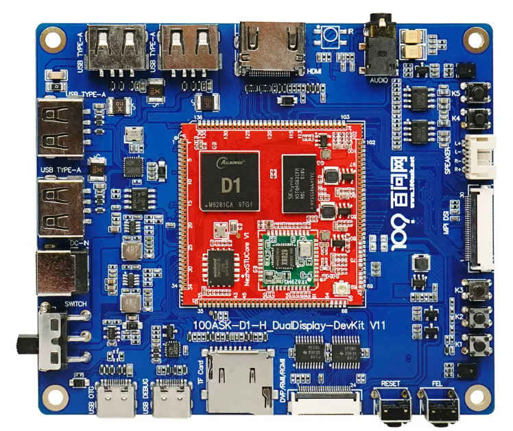
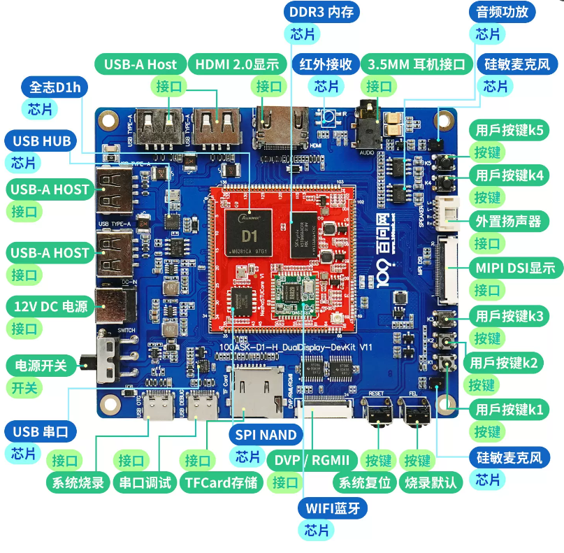

# RISC-V全志D1多媒体套件

* 此开发板的任何问题都可以在我们的论坛交流讨论 https://forums.100ask.net/c/aw/d1/57 

## 硬件简述

### D1主板
以下是主板图：

### D1板载功能
板载功能有：

- XR829 WIFI蓝牙模组芯片，Bluetooth支持标准蓝牙与 低功耗蓝牙，Wifi 支持2.4G hz 无线网络通信。
- MIPI DSI屏幕显示接口：支持最高 1920x 1200分辨率，接口兼容全志哪吒公板。
- IR红外接收接口：支持红外信号接收。
- 3.5MM Audio OUT：支持常见 手机的四段式 3.5MM耳机，可用于播放音乐并录制声音。
- MIC1 MIC2:使用硅敏麦克风，用于专业拾音。
- SPEAKER：专门的功放接口，用于扬声器播放声音，接口是 1.25 mmx2 PH.
- USB TYPE-A HOST接口：用于连接 标准的 USB设备，比如 U盘 支持UVC的摄像头 等等设备。
- DVP/RGMII接口：DVP支持图像传感器与处理单元间的高速数据传输，RGMII支持MAC与PHY芯片间的Gigabit以太网通信。
- HDMI 2.0 显示：支持HDMI高清显示。

