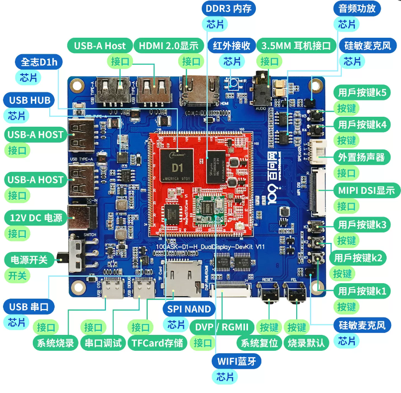

# 启动开发板



如果想方便使用的话，可以优先使用下面的 **使用ADB登录系统** 方式进行登录系统

## windows下使用 ADB登录系统
### 连接OTG线

将开发板配套的两根typec线，一根 直接连接至 开发板 `OTG烧录接口` 另一头连接至电脑的USB接口，开发板默认有系统，接通otg电源线就会通电并直接启动。

### 安装windows板ADB
点击链接下载Windows版ADB工具 [adb-tools](https://gitlab.com/dongshanpi/tools/-/raw/main/ADB.7z)
下载完成后解压，可以看到如下目录，


然后 我们单独 拷贝 上一层的 **platform-tools** 文件夹到任意 目录，拷贝完成后，记住这个 目录位置，我们接下来要把这个 路径添加至 Windows系统环境变量里。


我这里是把它单独拷贝到了 D盘，我的目录是 `D:\platform-tools` 接下来 我需要把它单独添加到Windows系统环境变量里面才可以在任意位置使用adb命令。


添加到 Windows系统环境变量里面


### 打开cmd连接开发板
打开CMD Windows 命令提示符方式有两种
方式1：直接在Windows10/11搜索对话框中输入  cmd 在弹出的软件中点击  `命令提示符`
方式2：同时按下 wind + r 键，输入 cmd 命令，按下确认 就可以自动打开 `命令提示符`


打开命令提示符，输出 adb命令可以直接看到我们的adb已经配置成功


连接好开发板的 OTG 并将其连接至电脑上，然后 输入 adb shell就可以自动登录系统

``` shell

C:\System> adb shell
* daemon not running. starting it now on port 5037 *
* daemon started successfully *

 _____  _              __     _
|_   _||_| ___  _ _   |  |   |_| ___  _ _  _ _
  | |   _ |   ||   |  |  |__ | ||   || | ||_'_|
  | |  | || | || _ |  |_____||_||_|_||___||_,_|
  |_|  |_||_|_||_|_|  Tina is Based on OpenWrt!
 ----------------------------------------------
 Tina Linux
 ----------------------------------------------
root@TinaLinux:/#

```
ADB 也可以作为文件传输使用，例如：
``` shell
C:\System> adb push badapple.mp4 /mnt/UDISK   # 将 badapple.mp4 上传到开发板 /mnt/UDISK 目录内
```
``` shell
C:\System> adb pull /mnt/UDISK/badapple.mp4   # 将 /mnt/UDISK/badapple.mp4 下拉到当前目录内
```

**注意： 此方法目前只适用于 使用全志Tina-SDK 构建出来的系统。**


## 使用串口登录系统
### 1. 连接串口线
将配套的TypeC线一段连接至开发板的串口/供电接口，另一端连接至电脑USB接口，连接成功后板载的红色电源灯会亮起。
默认情况下系统会自动安装串口设备驱动，如果没有自动安装，可以使用驱动精灵来自动安装。
* 对于Windows系统
此时Windows设备管理器 在 端口(COM和LPT) 处会多出一个串口设备，一般是以 `USB-Enhanced-SERIAL CH9102`开头，您需要留意一下后面的具体COM编号，用于后续连接使用。


如上图，COM号是96，我们接下来连接所使用的串口号就是96。

* 对于Linux系统
可以查看是否多出一个/dev/tty 设备,一般情况设备节点为 /dev/ttyACM0  。


### 2. 打开串口控制台
#### 获取串口工具
使用Putty或者MobaXterm等串口工具来开发板设备。

* 其中putty工具可以访问页面  https://www.chiark.greenend.org.uk/~sgtatham/putty/  来获取。
* MobaXterm可以通过访问页面 https://mobaxterm.mobatek.net/ 获取 (推荐使用)。

#### 使用putty登录串口


#### 使用Mobaxterm登录串口
打开MobaXterm，点击左上角的“Session”，在弹出的界面选中“Serial”，如下图所示选择端口号（前面设备管理器显示的端口号COM21）、波特率（Speed 115200）、流控（Flow Control: none）,最后点击“OK”即可。步骤如下图所示。
**注意：流控（Flow Control）一定要选择none，否则你将无法在MobaXterm中向串口输入数据**


### 3. 进入系统shell
使用串口工具成功打开串口后，可以直接按下 Enter 键 进入shell，当然您也可以按下板子上的 `Reset`复位键，来查看完整的系统信息。

``` bash
[53]HELLO! BOOT0 is starting!
[56]BOOT0 commit : 88480af
[58]set pll start
[60]periph0 has been enabled
[63]set pll end
[64][pmu]: bus read error
[67]board init ok
[69]get_pmu_exist() = -1
[71]DRAM BOOT DRIVE INFO: V0.33
[74]DRAM CLK = 792 MHz
[76]DRAM Type = 3 (2:DDR2,3:DDR3)
[79]DRAMC ZQ value: 0x7b7bfb
[82]DRAM ODT value: 0x42.
[84]ddr_efuse_type: 0x0
[87]DRAM SIZE =512 M
[89]dram_tpr4:0x0
[91]PLL_DDR_CTRL_REG:0xf8004100
[94]DRAM_CLK_REG:0xc0000000
[96][TIMING DEBUG] MR2= 0x18
[100]DRAM simple test OK.
[103]dram size =512
[105]spinand UBOOT_START_BLK_NUM 8 UBOOT_LAST_BLK_NUM 32
[110]block from 8 to 32
[165]Check is correct.
[167]dma 0x301a8 int is not used yet
[171]dma 0x301a8 int is free, you do not need to free it again
[176]Entry_name        = opensbi
[180]Entry_name        = u-boot
[183]Entry_name        = dtb
[186]Jump to second Boot.

OpenSBI auto-t113-linux-V0.8-2-g053d088
   ____                    _____ ____ _____
  / __ \                  / ____|  _ \_   _|
 | |  | |_ __   ___ _ __ | (___ | |_) || |
 | |  | | '_ \ / _ \ '_ \ \___ \|  _ < | |
 | |__| | |_) |  __/ | | |____) | |_) || |_
  \____/| .__/ \___|_| |_|_____/|____/_____|
        | |
        |_|

Platform Name          : T-HEAD Xuantie Platform
Platform HART Features : RV64ACDFIMSUVX
Platform Max HARTs     : 1
Current Hart           : 0
Firmware Base          : 0x41fc0400
Firmware Size          : 75 KB
Runtime SBI Version    : 0.2

MIDELEG : 0x0000000000000222
MEDELEG : 0x000000000000b1ff
PMP0    : 0x0000000041fc0000-0x0000000041fdffff (A)
PMP1    : 0x0000000040000000-0x000000007fffffff (A,R,W,X)
PMP2    : 0x0000000080000000-0x00000000bfffffff (A,R,W,X)
PMP3    : 0x0000000000020000-0x0000000000027fff (A,▒

U-Boot 2018.05-g24521d6-dirty (Jun 25 2024 - 02:56:26 -0400) Allwinner Technology

[00.271]DRAM:  512 MiB
[00.273]Relocation Offset is: 1dee9000
[00.278]secure enable bit: 0
[00.280]CPU=1008 MHz,PLL6=600 Mhz,AHB=200 Mhz, APB1=100Mhz  MBus=300Mhz
[00.286]flash init start
[00.289]workmode = 0,storage type = 0
sspi->base_addr = 0x4025000, the SPI control register:
[VER] 0x4025000 = 0x00010001, [GCR] 0x4025004 = 0x00000083, [TCR] 0x4025008 = 0x00000184
[ICR] 0x4025010 = 0x00000f00, [ISR] 0x4025014 = 0x00000032, [FCR] 0x4025018 = 0x00200020
[FSR] 0x402501c = 0x00000000, [WCR] 0x4025020 = 0x00000000, [CCR] 0x4025024 = 0x00000002
[SDC] 0x4025028 = 0x00002000, [BCR] 0x4025030 = 0x00000000, [TCR] 0x4025034 = 0x00000000
[BCC] 0x4025038 = 0x20000000, [DMA] 0x4025088 = 0x000000e5

[00.336]sunxi-spinand-phy: not detect any munufacture from id table
[00.343]sunxi-spinand-phy: get spi-nand Model from fdt fail
[00.348]sunxi-spinand-phy: get phy info from fdt fail

device nand0 <nand>, # parts = 4
 #: name                size            offset          mask_flags
 0: boot0               0x00100000      0x00000000      1
 1: uboot               0x00300000      0x00100000      1
 2: secure_storage      0x00100000      0x00400000      1
 3: sys                 0x07b00000      0x00500000      0

active partition: nand0,0 - (boot0) 0x00100000 @ 0x00000000

defaults:
mtdids  : nand0=nand
mtdparts: mtdparts=nand:1024k@0(boot0)ro,3072k@1048576(uboot)ro,1024k@4194304(secure_storage)ro,-(sys)
[00.462]ubi0: attaching mtd4
[00.557]ubi0: scanning is finished
[00.564]ubi0: attached mtd4 (name "sys", size 123 MiB)
[00.568]ubi0: PEB size: 262144 bytes (256 KiB), LEB size: 258048 bytes
[00.574]ubi0: min./max. I/O unit sizes: 4096/4096, sub-page size 2048
[00.581]ubi0: VID header offset: 2048 (aligned 2048), data offset: 4096
[00.587]ubi0: good PEBs: 492, bad PEBs: 0, corrupted PEBs: 0
[00.592]ubi0: user volume: 10, internal volumes: 1, max. volumes count: 128
[00.599]ubi0: max/mean erase counter: 2/1, WL threshold: 4096, image sequence number: 0
[00.607]ubi0: available PEBs: 0, total reserved PEBs: 492, PEBs reserved for bad PEB handling: 20
[00.615]sunxi flash init ok
[00.618]line:703 init_clocks
[00.621]drv_disp_init
request pwm success, pwm0:pwm0:0x2000c00.
[00.638]drv_disp_init finish
[00.640]boot_gui_init:start
[00.643]set disp.dev2_output_type fail. using defval=0
[00.648]lcd_open_flow
[00.650]lcd_cfg_panel_info
[00.653]lcd_open_flow
[00.655]lcd_power_on
[00.680]boot_gui_init:finish
partno erro : can't find partition bootloader
[00.800]lcd_open_flow
[00.802] tft08006 drivers/video/sunxi/disp2/disp/lcd/tft08006.c lcd_panel_init 162
[00.809]lcd_panel_init
[01.283]lcd_open_flow
54 bytes read in 0 ms
[01.288]bmp_name=bootlogo.bmp size 1152054
[01.335]lcd_open_flow
[01.337]lcd_bl_open
FDT ERROR:fdt_get_all_pin:get property handle pinctrl-0 error:FDT_ERR_INTERNAL
sunxi_pwm_pin_set_state, fdt_set_all_pin, ret=-1
[01.351]lcd_open_flow
[01.353]lcd_open_flow
[01.355]LCD open finish
1152054 bytes read in 75 ms (14.6 MiB/s)
[01.491]Loading Environment from SUNXI_FLASH... OK
[01.512]out of usb burn from boot: not need burn key
[01.518]Item0 (Map) magic is bad
partno erro : can't find partition private
[01.545]update bootcmd
[01.557]change working_fdt 0x5eaa8da0 to 0x5ea88da0
No reserved memory region found in source FDT
[01.585]update dts
noncached_alloc(): addr = 0x5eca7080
noncached_alloc(): addr = 0x5eca70c0
noncached_alloc(): addr = 0x5eca7100
noncached_alloc(): addr = 0x5eca7940
phy_mode=rgmii, phy_interface=7
gmac: *** using ephy_clk ***
eth0
Warning: eth0 (eth0) using random MAC address - 62:2c:14:f8:ee:8c

Hit any key to stop autoboot:  0
dsp0:gpio init config fail
dsp0:sharespace config fail
dsp0 version is r528-tina-v1.0.0-release-37-g735b6b4-dirty
DSP0 start ok, img length 254860, booting from 0x400660
[01.901]no vendor_boot partition is found
Android's image name: d1-h-nezha
Detect comp gzip
[02.154]
Starting kernel ...

[    0.000000] Linux version 5.4.61 (ubuntu@ubuntu1804) (riscv64-unknown-linux-gnu-gcc (C-SKY RISCV Tools V1.8.4 B20200702) 8.1.0, GNU ld (GNU Binutils) 2.32) #50 PREEMPT Tue Jun 25 06:59:32 UTC 2024
[    0.000000] cma: Reserved 8 MiB at 0x000000005f800000
[    0.000000] Zone ranges:
[    0.000000]   DMA32    [mem 0x0000000040000000-0x000000005fffffff]
[    0.000000]   Normal   empty
[    0.000000] Movable zone start for each node
[    0.000000] Early memory node ranges
[    0.000000]   node   0: [mem 0x0000000040000000-0x000000005fffffff]
[    0.000000] Initmem setup node 0 [mem 0x0000000040000000-0x000000005fffffff]
[    0.000000] On node 0 totalpages: 131072
[    0.000000]   DMA32 zone: 1792 pages used for memmap
[    0.000000]   DMA32 zone: 0 pages reserved
[    0.000000]   DMA32 zone: 131072 pages, LIFO batch:31
[    0.000000] elf_hwcap is 0x20112d
[    0.000000] pcpu-alloc: s0 r0 d32768 u32768 alloc=1*32768
[    0.000000] pcpu-alloc: [0] 0
[    0.000000] Built 1 zonelists, mobility grouping on.  Total pages: 129280
[    0.000000] Kernel command line: ubi.mtd=sys ubi.block=0,rootfs earlyprintk=sunxi-uart,0x02500000 clk_ignore_unused initcall_debug=0 console=ttyS0,115200 loglevel=8 root=/dev/ubiblock0_5 rootfstype=squashfs init=/sbin/init partitions=mbr@ubi0_0:boot-resource@ubi0_1:env@ubi0_2:env-redund@ubi0_3:boot@ubi0_4:rootfs@ubi0_5:dsp0@ubi0_6:recovery@ubi0_7:rootfs_data@ubi0_8:UDISK@ubi0_9: cma=8M snum= mac_addr= wifi_mac= bt_mac= specialstr= gpt=1 androidboot.hardware=sun20iw1p1 boot_type=5 androidboot.boot_type=5 gpt=1 uboot_message=2018.05-g24521d
[    0.000000] Dentry cache hash table entries: 65536 (order: 7, 524288 bytes, linear)
[    0.000000] Inode-cache hash table entries: 32768 (order: 6, 262144 bytes, linear)
[    0.000000] Sorting __ex_table...
[    0.000000] mem auto-init: stack:off, heap alloc:off, heap free:off
[    0.000000] Memory: 495332K/524288K available (6406K kernel code, 663K rwdata, 2165K rodata, 184K init, 336K bss, 20764K reserved, 8192K cma-reserved)
[    0.000000] SLUB: HWalign=64, Order=0-3, MinObjects=0, CPUs=1, Nodes=1
[    0.000000] rcu: Preemptible hierarchical RCU implementation.
[    0.000000]  Tasks RCU enabled.
[    0.000000] rcu: RCU calculated value of scheduler-enlistment delay is 10 jiffies.
[    0.000000] NR_IRQS: 0, nr_irqs: 0, preallocated irqs: 0
[    0.000000] plic: mapped 200 interrupts with 1 handlers for 2 contexts.
[    0.000000] riscv_timer_init_dt: Registering clocksource cpuid [0] hartid [0]
[    0.000000] clocksource: riscv_clocksource: mask: 0xffffffffffffffff max_cycles: 0x588fe9dc0, max_idle_ns: 440795202592 ns
[    0.000006] sched_clock: 64 bits at 24MHz, resolution 41ns, wraps every 4398046511097ns
[    0.000022] riscv_timer_clockevent depends on broadcast, but no broadcast function available
[    0.000310] clocksource: timer: mask: 0xffffffff max_cycles: 0xffffffff, max_idle_ns: 79635851949 ns
[    0.000909] Console: colour dummy device 80x25
[    0.000945] Calibrating delay loop (skipped), value calculated using timer frequency.. 48.00 BogoMIPS (lpj=240000)
[    0.000962] pid_max: default: 32768 minimum: 301
[    0.001127] Mount-cache hash table entries: 1024 (order: 1, 8192 bytes, linear)
[    0.001146] Mountpoint-cache hash table entries: 1024 (order: 1, 8192 bytes, linear)
[    0.002687] ASID allocator initialised with 65536 entries
[    0.002837] rcu: Hierarchical SRCU implementation.
[    0.003442] devtmpfs: initialized
[    0.016536] random: get_random_u32 called from bucket_table_alloc.isra.31+0x4e/0x15e with crng_init=0
[    0.017450] clocksource: jiffies: mask: 0xffffffff max_cycles: 0xffffffff, max_idle_ns: 19112604462750000 ns
[    0.017480] futex hash table entries: 256 (order: 0, 6144 bytes, linear)
[    0.017864] pinctrl core: initialized pinctrl subsystem
[    0.019111] NET: Registered protocol family 16
[    0.020998] DMA: preallocated 256 KiB pool for atomic allocations
[    0.021588] cpuidle: using governor menu
[    0.064032] rtc_ccu: sunxi ccu init OK
[    0.073104] clock: sunxi ccu init OK
[    0.073899] clock: sunxi ccu init OK
[    0.102467] iommu: Default domain type: Translated
[    0.102638] sunxi iommu: irq = 4
[    0.103690] SCSI subsystem initialized
[    0.104013] usbcore: registered new interface driver usbfs
[    0.104104] usbcore: registered new interface driver hub
[    0.104206] usbcore: registered new device driver usb
[    0.104367] mc: Linux media interface: v0.10
[    0.104424] videodev: Linux video capture interface: v2.00
[    0.105476] sunxi-msgbox-amp 3003000.msgbox: invalid resource
[    0.106268] Advanced Linux Sound Architecture Driver Initialized.
[    0.106834] Bluetooth: Core ver 2.22
[    0.106908] NET: Registered protocol family 31
[    0.106918] Bluetooth: HCI device and connection manager initialized
[    0.106940] Bluetooth: HCI socket layer initialized
[    0.106954] Bluetooth: L2CAP socket layer initialized
[    0.106987] Bluetooth: SCO socket layer initialized
[    0.107259] pwm module init!
[    0.108767] g2d 5410000.g2d: Adding to iommu group 0
[    0.109218] G2D: rcq version initialized.major:250
[    0.109872] input: sunxi-keyboard as /devices/virtual/input/input0
[    0.111383] clocksource: Switched to clocksource riscv_clocksource
[    0.123040] sun8iw20-pinctrl 2000000.pinctrl: initialized sunXi PIO driver
[    0.137865] thermal_sys: Registered thermal governor 'user_space'
[    0.137872] thermal_sys: Registered thermal governor 'power_allocator'
[    0.138360] NET: Registered protocol family 2
[    0.139111] tcp_listen_portaddr_hash hash table entries: 256 (order: 0, 4096 bytes, linear)
[    0.139153] TCP established hash table entries: 4096 (order: 3, 32768 bytes, linear)
[    0.139213] TCP bind hash table entries: 4096 (order: 3, 32768 bytes, linear)
[    0.139259] TCP: Hash tables configured (established 4096 bind 4096)
[    0.139396] UDP hash table entries: 256 (order: 1, 8192 bytes, linear)
[    0.139434] UDP-Lite hash table entries: 256 (order: 1, 8192 bytes, linear)
[    0.139646] NET: Registered protocol family 1
[    0.140799] sun8iw20-pinctrl 2000000.pinctrl: 2000000.pinctrl supply vcc-pc not found, using dummy regulator
[    0.141336] spi spi0: spi0 supply spi not found, using dummy regulator
[    0.141654] sunxi_spi_resource_get()2151 - [spi0] SPI MASTER MODE
[    0.141715] sunxi_spi_resource_get()2189 - Failed to get sample mode
[    0.141727] sunxi_spi_resource_get()2194 - Failed to get sample delay
[    0.141736] sunxi_spi_resource_get()2198 - sample_mode:-1431633921 sample_delay:-1431633921
[    0.141791] sunxi_spi_clk_init()2240 - [spi0] mclk 100000000
[    0.142437] sunxi_spi_probe()2653 - [spi0]: driver probe succeed, base ffffffd004060000, irq 31
[    0.144277] Initialise system trusted keyrings
[    0.144473] workingset: timestamp_bits=62 max_order=17 bucket_order=0
[    0.151041] squashfs: version 4.0 (2009/01/31) Phillip Lougher
[    0.171642] Key type asymmetric registered
[    0.171655] Asymmetric key parser 'x509' registered
[    0.171677] io scheduler mq-deadline registered
[    0.171686] io scheduler kyber registered
[    0.171704] atomic64_test: passed
[    0.172861] [DISP]disp_module_init
[    0.173400] disp 5000000.disp: Adding to iommu group 0
[    0.174009] [DISP] disp_init,line:2386:
[    0.174015] smooth display screen:0 type:1 mode:4
[    0.208620] lcd_cfg_panel_info
[    0.208632] tft08006
[    0.208676] display_fb_request,fb_id:0
[    0.224227] Freeing logo buffer memory: 1500K
[    0.224658] disp_al_manager_apply ouput_type:1
[    0.224800] [DISP] lcd_clk_config,line:732:
[    0.224812] disp 0, clk: pll(300000000),clk(300000000),dclk(25000000) dsi_rate(25000000)
[    0.224812]      clk real:pll(300000000),clk(300000000),dclk(75000000) dsi_rate(150000000)
[    0.225189] sun8iw20-pinctrl 2000000.pinctrl: 2000000.pinctrl supply vcc-pb not found, using dummy regulator
[    0.225900] [DISP]disp_module_init finish
[    0.226748] sunxi_sid_init()551 - insmod ok
[    0.227110] pwm-regulator vdd-cpu: Failed to get PWM: -16
[    0.227140] pwm-regulator: probe of vdd-cpu failed with error -16
[    0.233843] uart uart0: get regulator failed
[    0.233872] uart uart0: uart0 supply uart not found, using dummy regulator
[    0.234204] uart0: ttyS0 at MMIO 0x2500000 (irq = 18, base_baud = 1500000) is a SUNXI
[    0.234229] sw_console_setup()1808 - console setup baud 115200 parity n bits 8, flow n
[    1.064140] printk: console [ttyS0] enabled
[    1.069707] sun8iw20-pinctrl 2000000.pinctrl: 2000000.pinctrl supply vcc-pg not found, using dummy regulator
[    1.081123] uart uart1: get regulator failed
[    1.085987] uart uart1: uart1 supply uart not found, using dummy regulator
[    1.094015] uart1: ttyS1 at MMIO 0x2500400 (irq = 19, base_baud = 1500000) is a SUNXI
[    1.103898] misc dump reg init
[    1.108149] sunxi-rfkill soc@3000000:rfkill@0: module version: v1.0.9
[    1.115395] sunxi-rfkill soc@3000000:rfkill@0: get gpio chip_en failed
[    1.122756] sunxi-rfkill soc@3000000:rfkill@0: get gpio power_en failed
[    1.130143] sunxi-rfkill soc@3000000:rfkill@0: wlan_busnum (1)
[    1.136705] sunxi-rfkill soc@3000000:rfkill@0: Missing wlan_power.
[    1.143642] sunxi-rfkill soc@3000000:rfkill@0: wlan clock[0] (32k-fanout1)
[    1.151338] sunxi-rfkill soc@3000000:rfkill@0: wlan_regon gpio=44 assert=1
[    1.159128] sunxi-rfkill soc@3000000:rfkill@0: wlan_hostwake gpio=202 assert=1
[    1.167257] sunxi-rfkill soc@3000000:rfkill@0: wakeup source is enabled
[    1.174934] sunxi-rfkill soc@3000000:rfkill@0: Missing bt_power.
[    1.181694] sunxi-rfkill soc@3000000:rfkill@0: bt clock[0] (32k-fanout1)
[    1.189226] sunxi-rfkill soc@3000000:rfkill@0: bt_rst gpio=210 assert=0
[    1.197386] [ADDR_MGT] addr_mgt_probe: module version: v1.0.10
[    1.205082] [ADDR_MGT] addr_mgt_probe: success.
[    1.211037] sunxi-spinand: AW SPINand MTD Layer Version: 2.0 20201228
[    1.218307] sunxi-spinand-phy: AW SPINand Phy Layer Version: 1.10 20200306
[    1.226218] sunxi-spinand-phy: not detect any munufacture from id table
[    1.233661] sunxi-spinand-phy: get spi-nand Model from fdt fail
[    1.240281] sunxi-spinand-phy: get phy info from fdt fail
[    1.246326] sunxi-spinand-phy: not detect munufacture from fdt
[    1.253009] sunxi-spinand-phy: detect munufacture from id table: Winbond
[    1.260503] sunxi-spinand-phy: detect spinand id: ff21aaef ffffffff
[    1.267516] sunxi-spinand-phy: ========== arch info ==========
[    1.274067] sunxi-spinand-phy: Model:               W25N01GVZEIG
[    1.280764] sunxi-spinand-phy: Munufacture:         Winbond
[    1.286997] sunxi-spinand-phy: DieCntPerChip:       1
[    1.292677] sunxi-spinand-phy: BlkCntPerDie:        1024
[    1.298597] sunxi-spinand-phy: PageCntPerBlk:       64
[    1.304345] sunxi-spinand-phy: SectCntPerPage:      4
[    1.309988] sunxi-spinand-phy: OobSizePerPage:      64
[    1.315739] sunxi-spinand-phy: BadBlockFlag:        0x0
[    1.321582] sunxi-spinand-phy: OperationOpt:        0x7
[    1.327418] sunxi-spinand-phy: MaxEraseTimes:       65000
[    1.333459] sunxi-spinand-phy: EccFlag:             0x0
[    1.339281] sunxi-spinand-phy: EccType:             2
[    1.344954] sunxi-spinand-phy: EccProtectedType:    3
[    1.350584] sunxi-spinand-phy: ========================================
[    1.358001] sunxi-spinand-phy:
[    1.361523] sunxi-spinand-phy: ========== physical info ==========
[    1.368410] sunxi-spinand-phy: TotalSize:    128 M
[    1.373765] sunxi-spinand-phy: SectorSize:   512 B
[    1.379117] sunxi-spinand-phy: PageSize:     2 K
[    1.384285] sunxi-spinand-phy: BlockSize:    128 K
[    1.389623] sunxi-spinand-phy: OOBSize:      64 B
[    1.394908] sunxi-spinand-phy: ========================================
[    1.402304] sunxi-spinand-phy:
[    1.405800] sunxi-spinand-phy: ========== logical info ==========
[    1.412636] sunxi-spinand-phy: TotalSize:    128 M
[    1.417974] sunxi-spinand-phy: SectorSize:   512 B
[    1.423333] sunxi-spinand-phy: PageSize:     4 K
[    1.428492] sunxi-spinand-phy: BlockSize:    256 K
[    1.433854] sunxi-spinand-phy: OOBSize:      128 B
[    1.439191] sunxi-spinand-phy: ========================================
[    1.446719] sunxi-spinand-phy: block lock register: 0x00
[    1.452823] sunxi-spinand-phy: feature register: 0x19
[    1.458459] sunxi-spinand-phy: sunxi physic nand init end
[    1.465125] Creating 4 MTD partitions on "sunxi_mtd_nand":
[    1.471253] 0x000000000000-0x000000100000 : "boot0"
[    1.492561] 0x000000100000-0x000000500000 : "uboot"
[    1.500983] random: fast init done
[    1.522572] 0x000000500000-0x000000600000 : "secure_storage"
[    1.542522] 0x000000600000-0x000008000000 : "sys"
[    1.743072] libphy: Fixed MDIO Bus: probed
[    1.747646] CAN device driver interface
[    1.753096] sun8iw20-pinctrl 2000000.pinctrl: 2000000.pinctrl supply vcc-pe not found, using dummy regulator
[    1.764399] sunxi gmac driver's version: 1.0.0
[    1.769541] gmac-power0: NULL
[    1.772895] gmac-power1: NULL
[    1.776201] gmac-power2: NULL
[    1.780617] Failed to alloc md5
[    1.784251] eth0: Use random mac address
[    1.788958] ehci_hcd: USB 2.0 'Enhanced' Host Controller (EHCI) Driver
[    1.796329] sunxi-ehci: EHCI SUNXI driver
[    1.801367] get ehci1-controller wakeup-source is fail.
[    1.807390] sunxi ehci1-controller don't init wakeup source
[    1.813686] [sunxi-ehci1]: probe, pdev->name: 4200000.ehci1-controller, sunxi_ehci: 0xffffffe000962758, 0x:ffffffd00407c000, irq_no:31
[    1.827282] sunxi-ehci 4200000.ehci1-controller: 4200000.ehci1-controller supply drvvbus not found, using dummy regulator
[    1.839865] sunxi-ehci 4200000.ehci1-controller: 4200000.ehci1-controller supply hci not found, using dummy regulator
[    1.852110] sunxi-ehci 4200000.ehci1-controller: EHCI Host Controller
[    1.859333] sunxi-ehci 4200000.ehci1-controller: new USB bus registered, assigned bus number 1
[    1.869194] sunxi-ehci 4200000.ehci1-controller: irq 49, io mem 0x04200000
[    1.901428] sunxi-ehci 4200000.ehci1-controller: USB 2.0 started, EHCI 1.00
[    1.909214] sunxi-ehci 4200000.ehci1-controller: ehci_irq: highspeed device connect
[    1.918694] hub 1-0:1.0: USB hub found
[    1.923037] hub 1-0:1.0: 1 port detected
[    1.928194] ohci_hcd: USB 1.1 'Open' Host Controller (OHCI) Driver
[    1.935185] sunxi-ohci: OHCI SUNXI driver
[    1.940208] get ohci1-controller wakeup-source is fail.
[    1.946225] sunxi ohci1-controller don't init wakeup source
[    1.952484] [sunxi-ohci1]: probe, pdev->name: 4200400.ohci1-controller, sunxi_ohci: 0xffffffe0009632b0
[    1.962960] sunxi-ohci 4200400.ohci1-controller: 4200400.ohci1-controller supply drvvbus not found, using dummy regulator
[    1.975506] sunxi-ohci 4200400.ohci1-controller: 4200400.ohci1-controller supply hci not found, using dummy regulator
[    1.987706] sunxi-ohci 4200400.ohci1-controller: OHCI Host Controller
[    1.995010] sunxi-ohci 4200400.ohci1-controller: new USB bus registered, assigned bus number 2
[    2.004795] sunxi-ohci 4200400.ohci1-controller: irq 50, io mem 0x04200400
[    2.086338] hub 2-0:1.0: USB hub found
[    2.090582] hub 2-0:1.0: 1 port detected
[    2.096049] usbcore: registered new interface driver uas
[    2.102211] usbcore: registered new interface driver usb-storage
[    2.109011] usbcore: registered new interface driver ums-alauda
[    2.115759] usbcore: registered new interface driver ums-cypress
[    2.122565] usbcore: registered new interface driver ums-datafab
[    2.129360] usbcore: registered new interface driver ums_eneub6250
[    2.136359] usbcore: registered new interface driver ums-freecom
[    2.143375] usbcore: registered new interface driver ums-isd200
[    2.150039] usbcore: registered new interface driver ums-jumpshot
[    2.156949] usbcore: registered new interface driver ums-karma
[    2.163619] usbcore: registered new interface driver ums-onetouch
[    2.170490] usbcore: registered new interface driver ums-realtek
[    2.177354] usbcore: registered new interface driver ums-sddr09
[    2.184064] usbcore: registered new interface driver ums-sddr55
[    2.190738] usbcore: registered new interface driver ums-usbat
[    2.197971] sunxi_gpadc_init,2151, success
[    2.204780] sunxi-rtc 7090000.rtc: registered as rtc0
[    2.210528] sunxi-rtc 7090000.rtc: setting system clock to 1970-01-01T00:00:30 UTC (30)
[    2.219600] sunxi-rtc 7090000.rtc: sunxi rtc probed
[    2.225646] i2c /dev entries driver
[    2.229663] IR NEC protocol handler initialized
[    2.235157] sunxi-rc-recv 7040000.s_cir: sunxi_irrx_resource_get: get ir protocol failed
[    2.244318] Registered IR keymap rc_map_sunxi
[    2.249323] rc rc0: sunxi-ir as /devices/platform/soc@3000000/7040000.s_cir/rc/rc0
[    2.258008] rc rc0: lirc_dev: driver sunxi-rc-recv registered at minor = 0, raw IR receiver, no transmitter
[    2.269150] input: sunxi-ir as /devices/platform/soc@3000000/7040000.s_cir/rc/rc0/s_cir_rx
[    2.279473] sunxi cedar version 1.1
[    2.283695] sunxi-cedar 1c0e000.ve: Adding to iommu group 0
[    2.289935] VE: install start!!!
[    2.289935]
[    2.295244] usb 1-1: new high-speed USB device number 2 using sunxi-ehci
[    2.303019] VE: cedar-ve the get irq is 6
[    2.303019]
[    2.309361] VE: ve_debug_proc_info:(____ptrval____), data:(____ptrval____), lock:(____ptrval____)
[    2.309361]
[    2.321035] VE: install end!!!
[    2.321035]
[    2.326191] VE: sunxi_cedar_probe
[    2.331600] sunxi-wdt 6011000.watchdog: Watchdog enabled (timeout=16 sec, nowayout=0)
[    2.340747] Bluetooth: HCI UART driver ver 2.3
[    2.345745] Bluetooth: HCI UART protocol H4 registered
[    2.351544] Bluetooth: HCI UART protocol BCSP registered
[    2.357483] Bluetooth: XRadio Bluetooth LPM Mode Driver Ver 1.0.10
[    2.364797] [XR_BT_LPM] bluesleep_probe: bt_wake polarity: 1
[    2.371140] sun8iw20-pinctrl 2000000.pinctrl: pin PG16 already requested by 7040000.s_cir; cannot claim for 2000000.pinctrl:208
[    2.384029] sun8iw20-pinctrl 2000000.pinctrl: pin-208 (2000000.pinctrl:208) status -22
[    2.392888] Bluetooth: can't request bt_wake gpio 208
[    2.398542] sunxi-btlpm: probe of soc@3000000:btlpm@0 failed with error -22
[    2.408282] sunxi-mmc 4021000.sdmmc: SD/MMC/SDIO Host Controller Driver(v4.21 2021-11-18 10:02)
[    2.418288] sunxi-mmc 4021000.sdmmc: ***ctl-spec-caps*** 8
[    2.424504] sunxi-mmc 4021000.sdmmc: No vmmc regulator found
[    2.430816] sunxi-mmc 4021000.sdmmc: No vqmmc regulator found
[    2.437291] sunxi-mmc 4021000.sdmmc: No vdmmc regulator found
[    2.443723] sunxi-mmc 4021000.sdmmc: No vd33sw regulator found
[    2.450243] sunxi-mmc 4021000.sdmmc: No vd18sw regulator found
[    2.456772] sunxi-mmc 4021000.sdmmc: No vq33sw regulator found
[    2.463298] sunxi-mmc 4021000.sdmmc: No vq18sw regulator found
[    2.469840] sunxi-mmc 4021000.sdmmc: Cann't get pin bias hs pinstate,check if needed
[    2.479566] sunxi-mmc 4021000.sdmmc: sdc set ios:clk 0Hz bm PP pm UP vdd 21 width 1 timing LEGACY(SDR12) dt B
[    2.490753] sunxi-mmc 4021000.sdmmc: no vqmmc,Check if there is regulator
[    2.510942] sunxi-mmc 4021000.sdmmc: sdc set ios:clk 400000Hz bm PP pm ON vdd 21 width 1 timing LEGACY(SDR12) dt B
[    2.524179] hub 1-1:1.0: USB hub found
[    2.528572] hub 1-1:1.0: 4 ports detected
[    2.533109] sunxi-mmc 4021000.sdmmc: detmode:manually by software
[    2.540866] sunxi_led_probe()1749 - start
[    2.545491] sunxi_get_str_of_property()1595 - failed to get the string of propname led_regulator!
[    2.555432] sunxi-mmc 4021000.sdmmc: smc 0 p1 err, cmd 52, RTO !!
[    2.562554] sunxi_register_led_classdev()1483 - led_classdev start
[    2.569480] sunxi-mmc 4021000.sdmmc: smc 0 p1 err, cmd 52, RTO !!
[    2.576398] sunxi-mmc 4021000.sdmmc: sdc set ios:clk 400000Hz bm PP pm ON vdd 21 width 1 timing LEGACY(SDR12) dt B
[    2.593363] sunxi_led_probe()1845 - finish
[    2.598533] usbcore: registered new interface driver usbhid
[    2.604992] usbhid: USB HID core driver
[    2.609434] rpmsg_client_dsp_standby 3003000.msgbox.sunxi,dsp-power-msgbox.512.256: new channel: 0x200 -> 0x100!
[    2.622204] sunxi-mmc 4021000.sdmmc: sdc set ios:clk 400000Hz bm PP pm ON vdd 21 width 1 timing LEGACY(SDR12) dt B
[    2.634488] usbcore: registered new interface driver snd-usb-audio
[    2.644070] sun8iw20-pinctrl 2000000.pinctrl: 2000000.pinctrl supply vcc-pd not found, using dummy regulator
[    2.656477] sunxi-daudio 2034000.daudio: regulator missing or invalid
[    2.664559] sunxi-mmc 4021000.sdmmc: smc 0 p1 err, cmd 5, RTO !!
[    2.671385] [AUDIOCODEC][sunxi_codec_parse_params][2412]:digital_vol:0, lineout_vol:26, mic1gain:19, mic2gain:19 pa_msleep:120, pa_level:1, pa_pwr_level:1
[    2.671385]
[    2.688504] sunxi-mmc 4021000.sdmmc: smc 0 p1 err, cmd 5, RTO !!
[    2.695393] [AUDIOCODEC][sunxi_codec_parse_params][2448]:adcdrc_cfg:0, adchpf_cfg:1, dacdrc_cfg:0, dachpf:0
[    2.706350] sunxi-mmc 4021000.sdmmc: smc 0 p1 err, cmd 5, RTO !!
[    2.713717] [AUDIOCODEC][sunxi_internal_codec_probe][2609]:codec probe finished
[    2.721890] sunxi-mmc 4021000.sdmmc: smc 0 p1 err, cmd 5, RTO !!
[    2.728694] sunxi-mmc 4021000.sdmmc: sdc set ios:clk 0Hz bm PP pm OFF vdd 0 width 1 timing LEGACY(SDR12) dt B
[    2.741249] sid_rd_ver_reg()254 - ver >= 4, soc ver:5
[    2.746977] debugfs: Directory '203034c.dummy_cpudai' with parent 'audiocodec' already present!
[    2.756938] [SNDCODEC][sunxi_card_init][583]:card init finished
[    2.765931] sunxi-codec-machine 2030340.sound: 2030000.codec <-> 203034c.dummy_cpudai mapping ok
[    2.777205] input: audiocodec sunxi Audio Jack as /devices/platform/soc@3000000/2030340.sound/sound/card0/input2
[    2.789234] [SNDCODEC][sunxi_card_dev_probe][836]:register card finished
[    2.802122] sunxi-rpaf-dsp soc@3000000:rpaf-dsp@203034c: register device finished!
[    2.810599] sunxi-rpaf-dsp soc@3000000:rpaf-dsp@203034c: [rpaf_dsp0] probe finished!
[    2.819677] rpmsg_hifi 3003000.msgbox.sunxi,dsp-msgbox.514.258: id:sunxi,dsp-msgbox new channel: 0x202 -> 0x102!
[    2.831257] rpmsg_hifi 3003000.msgbox.sunxi,dsp-msgbox.514.258: rpmsg hifi[0] client driver is probed
[    2.843180] NET: Registered protocol family 10
[    2.849520] Segment Routing with IPv6
[    2.853873] sit: IPv6, IPv4 and MPLS over IPv4 tunneling driver
[    2.861252] NET: Registered protocol family 17
[    2.866346] can: controller area network core (rev 20170425 abi 9)
[    2.873401] NET: Registered protocol family 29
[    2.878391] can: raw protocol (rev 20170425)
[    2.883188] can: broadcast manager protocol (rev 20170425 t)
[    2.889508] can: netlink gateway (rev 20190810) max_hops=1
[    2.895974] Bluetooth: RFCOMM TTY layer initialized
[    2.901519] Bluetooth: RFCOMM socket layer initialized
[    2.907271] Bluetooth: RFCOMM ver 1.11
[    2.912552] Loading compiled-in X.509 certificates
[    2.920095] HDMI 2.0 driver init start!
[    2.924456] boot_hdmi=false
[    2.927632] ERROR: pinctrl_get for HDMI2.0 DDC fail
[    2.934692] HDMI2.0 module init end
[    2.964447] sunxi-i2c sunxi-i2c2: sunxi-i2c2 supply twi not found, using dummy regulator
[    2.980494] input: fts_ts as /devices/platform/soc@3000000/sunxi-i2c2/i2c-2/2-0038/input/input3
[    3.011652] fts_ts 2-0038: 2-0038 supply  not found, using dummy regulator
[    3.019617] fts_ts 2-0038: 2-0038 supply  not found, using dummy regulator
[    3.027395] debugfs: Directory '2-0038-' with parent 'reg-dummy-regulator-dummy' already present!
[    3.891683] sunxi-i2c sunxi-i2c2: probe success
[    3.900910] debugfs: Directory '2031000.dmic' with parent 'snddmic' already present!
[    3.911126] sunxi-audio-card 2031060.sounddmic: dmic-hifi <-> 2031000.dmic mapping ok
[    3.921115] get ehci0-controller wakeup-source is fail.
[    3.927122] sunxi ehci0-controller don't init wakeup source
[    3.933378] [sunxi-ehci0]: probe, pdev->name: 4101000.ehci0-controller, sunxi_ehci: 0xffffffe000962390, 0x:ffffffd004bca000, irq_no:2e
[    3.946933] [sunxi-ehci0]: Not init ehci0
[    3.951881] get ohci0-controller wakeup-source is fail.
[    3.957846] sunxi ohci0-controller don't init wakeup source
[    3.964123] [sunxi-ohci0]: probe, pdev->name: 4101400.ohci0-controller, sunxi_ohci: 0xffffffe000962ee8
[    3.974563] [sunxi-ohci0]: Not init ohci0
[    3.979454] ubi0: attaching mtd3
[    4.315189] random: crng init done
[    4.376484] ubi0: scanning is finished
[    4.391534] ubi0 warning: ubi_eba_init: cannot reserve enough PEBs for bad PEB handling, reserved 16, need 20
[    4.405277] ubi0: attached mtd3 (name "sys", size 122 MiB)
[    4.411440] ubi0: PEB size: 262144 bytes (256 KiB), LEB size: 258048 bytes
[    4.419131] ubi0: min./max. I/O unit sizes: 4096/4096, sub-page size 2048
[    4.426744] ubi0: VID header offset: 2048 (aligned 2048), data offset: 4096
[    4.434564] ubi0: good PEBs: 488, bad PEBs: 0, corrupted PEBs: 0
[    4.441262] ubi0: user volume: 10, internal volumes: 1, max. volumes count: 128
[    4.449470] ubi0: max/mean erase counter: 2/1, WL threshold: 4096, image sequence number: 0
[    4.458809] ubi0: available PEBs: 0, total reserved PEBs: 488, PEBs reserved for bad PEB handling: 16
[    4.469166] ubi0: background thread "ubi_bgt0d" started, PID 70
[    4.477739] block ubiblock0_5: created from ubi0:5(rootfs)
[    4.485779] cfg80211: Loading compiled-in X.509 certificates for regulatory database
[    4.496626] cfg80211: Loaded X.509 cert 'sforshee: 00b28ddf47aef9cea7'
[    4.504289] platform regulatory.0: Direct firmware load for regulatory.db failed with error -2
[    4.513968] clk: Not disabling unused clocks
[    4.518761] ALSA device list:
[    4.522198] cfg80211: failed to load regulatory.db
[    4.527610]   #0: audiocodec
[    4.530819]   #1: snddmic
[    4.533809] alloc_fd: slot 0 not NULL!
[    4.542002] VFS: Mounted root (squashfs filesystem) readonly on device 254:0.
[    4.553578] devtmpfs: mounted
[    4.557055] Freeing unused kernel memory: 184K
[    4.562093] This architecture does not have kernel memory protection.
[    4.569303] Run /sbin/init as init process
[    5.370780] init: Console is alive
[    5.374983] init: - watchdog -
[    5.378526] init: - preinit -
/dev/by-name/UDISK already format by ubifs
/dev/by-name/rootfs_data already format by ubifs
[    6.758409] mount_root: loading kmods from internal overlay
[    6.841487] hdmi_hpd_sys_config_release
[    7.009948] block: attempting to load /etc/config/fstab
[    7.038610] UBIFS (ubi0:9): Mounting in unauthenticated mode
[    7.045754] UBIFS (ubi0:9): background thread "ubifs_bgt0_9" started, PID 117
[    7.154127] UBIFS (ubi0:9): recovery needed
[    7.479844] UBIFS (ubi0:9): recovery completed
[    7.485486] UBIFS (ubi0:9): UBIFS: mounted UBI device 0, volume 9, name "UDISK"
[    7.493727] UBIFS (ubi0:9): LEB size: 258048 bytes (252 KiB), min./max. I/O unit sizes: 4096 bytes/4096 bytes
[    7.504816] UBIFS (ubi0:9): FS size: 53673984 bytes (51 MiB, 208 LEBs), journal size 7741440 bytes (7 MiB, 30 LEBs)
[    7.516513] UBIFS (ubi0:9): reserved for root: 0 bytes (0 KiB)
[    7.523047] UBIFS (ubi0:9): media format: w4/r0 (latest is w5/r0), UUID 0F597857-8DF5-4158-BE5D-801B4C610776, small LPT model
[    7.539986] block: extroot: UUID match (root: 14aa15db-35e00f98-1674d058-b2b76b5f, overlay: 14aa15db-35e00f98-1674d058-b2b76b5f)
[    7.562791] mount_root: switched to extroot
[    7.583915] procd: - early -
[    7.587268] procd: - watchdog -
[    7.997894] procd: - watchdog -
[    8.006061] procd: - ubus -
[    8.009817] procd (1): /proc/129/oom_adj is deprecated, please use /proc/129/oom_score_adj instead.
[    8.121473]
[    8.121473] insmod_device_driver
[    8.121473]
[    8.128627] sunxi_usb_udc 4100000.udc-controller: 4100000.udc-controller supply udc not found, using dummy regulator
[    8.349149] procd: - init -
Please press Enter to activate this console.
[    9.439106] fuse: init (API version 7.31)
[    9.826674] file system registered
[    9.879003] configfs-gadget 4100000.udc-controller: failed to start g1: -19
[    9.887270] usbcore: registered new interface driver uvcvideo
[    9.922012] USB Video Class driver (1.1.1)
[   10.423167] read descriptors
[   10.426390] read strings
[   10.584473] sunxi_set_cur_vol_work()397 WARN: get power supply failed
[   10.671029] android_work: sent uevent USB_STATE=CONNECTED
[   10.766175] configfs-gadget gadget: high-speed config #1: c
[   10.772571] android_work: sent uevent USB_STATE=CONFIGURED
[   12.844108] ======== XRADIO WIFI OPEN ========
[   12.851119] [XRADIO] Driver Label:XR_V02.16.85_P2P_HT40_01.31
[   12.860289] [XRADIO] Allocated hw_priv @ 000000007a83d074
[   12.871331] sunxi-rfkill soc@3000000:rfkill@0: bus_index: 1
[   12.888887] sunxi-rfkill soc@3000000:rfkill@0: wlan power on success
[   13.173539] sunxi-mmc 4021000.sdmmc: sdc set ios:clk 0Hz bm PP pm UP vdd 21 width 1 timing LEGACY(SDR12) dt B
[   13.187145] [XRADIO] Detect SDIO card 1
[   13.201571] sunxi-mmc 4021000.sdmmc: no vqmmc,Check if there is regulator
[   13.221477] sunxi-mmc 4021000.sdmmc: sdc set ios:clk 400000Hz bm PP pm ON vdd 21 width 1 timing LEGACY(SDR12) dt B
[   13.255919] sunxi-mmc 4021000.sdmmc: sdc set ios:clk 400000Hz bm PP pm ON vdd 21 width 1 timing LEGACY(SDR12) dt B
[   13.272892] sunxi-mmc 4021000.sdmmc: sdc set ios:clk 400000Hz bm PP pm ON vdd 21 width 1 timing LEGACY(SDR12) dt B
[   13.298467] sunxi-mmc 4021000.sdmmc: sdc set ios:clk 400000Hz bm PP pm ON vdd 21 width 1 timing SD-HS(SDR25) dt B
[   13.311930] sunxi-mmc 4021000.sdmmc: sdc set ios:clk 50000000Hz bm PP pm ON vdd 21 width 1 timing SD-HS(SDR25) dt B
[   13.326945] sunxi-mmc 4021000.sdmmc: sdc set ios:clk 50000000Hz bm PP pm ON vdd 21 width 4 timing SD-HS(SDR25) dt B
[   13.346029] mmc0: new high speed SDIO card at address 0001
[   13.362238] [SBUS] XRadio Device:sdio clk=50000000
[   13.381556] [XRADIO] XRADIO_HW_REV 1.0 detected.
[   13.551992] [XRADIO] xradio_update_dpllctrl: DPLL_CTRL Sync=0x01400000.
[   13.617937] [XRADIO] Bootloader complete
[   13.786129] [XRADIO] Firmware completed.
[   13.802911] [WSM] Firmware Label:XR_C09.08.52.64_DBG_02.100 2GHZ HT40 Jan  3 2020 13:14:37
[   13.831494] [XRADIO] Firmware Startup Done.
[   13.841858] [XRADIO_WRN] enable Multi-Rx!
[   13.861130] ieee80211 phy0: Selected rate control algorithm 'minstrel_ht'
[   13.914550] xt_time: kernel timezone is -0000
[   13.951748] Error: Driver 'gt9xxnew_ts' is already registered, aborting...
kmodloader done
[   14.686044] ieee80211_do_open: vif_type=2, p2p=0, ch=3, addr=00:65:d8:1d:b6:8e
[   14.708778] [STA] !!!xradio_vif_setup: id=0, type=2, p2p=0, addr=00:65:d8:1d:b6:8e
[   14.748395] [AP_WRN] BSS_CHANGED_ASSOC but driver is unjoined.
[   17.154364] libphy: 4500000.eth: probed
[   17.158681] sunxi-gmac 4500000.eth eth0: No PHY found!
[   17.324357] libphy: 4500000.eth: probed
[   17.328675] sunxi-gmac 4500000.eth eth0: No PHY found!
[   17.421824] sunxi-gmac 4500000.eth eth0: phy init failed
[   17.465400] br-lan: port 1(eth0) entered blocking state
[   17.471231] br-lan: port 1(eth0) entered disabled state
[   17.595308] device eth0 entered promiscuous mode
Trying to connect to SWUpdate...
[   18.021806] [SNDCODEC][sunxi_card_hw_params][620]:stream_flag: 0

BusyBox v1.27.2 () built-in shell (ash)

 _____  _              __     _
|_   _||_| ___  _ _   |  |   |_| ___  _ _  _ _
  | |   _ |   ||   |  |  |__ | ||   || | ||_'_|
  | |  | || | || _ |  |_____||_||_|_||___||_,_|
  |_|  |_||_|_||_|_|  Tina is Based on OpenWrt!
 ----------------------------------------------
 Tina Linux (Neptune, 61CC0487)
 ----------------------------------------------
root@TinaLinux:/# 
```
**系统默认会自己登录 没有用户名 没有密码。**
**系统默认会自己登录 没有用户名 没有密码。**
**系统默认会自己登录 没有用户名 没有密码。**