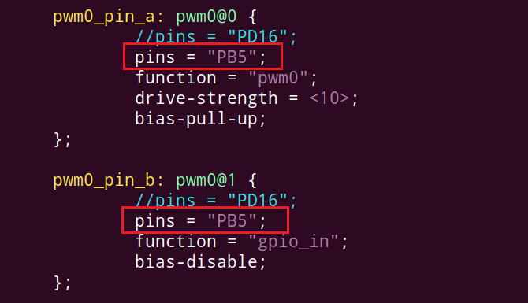
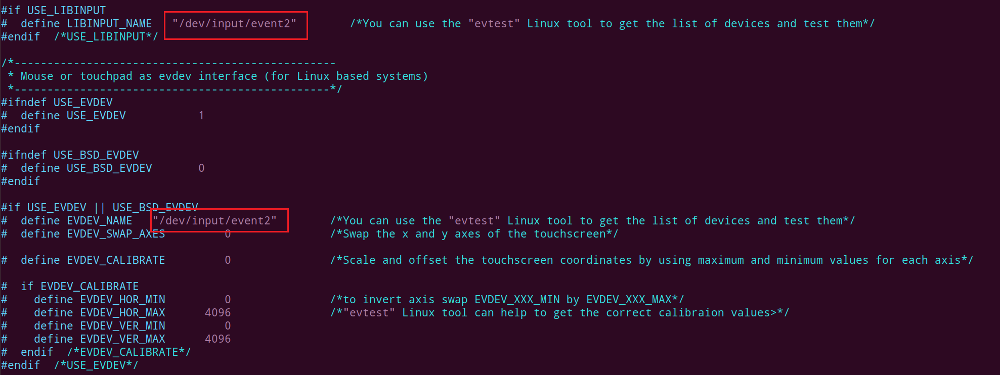

# MIPI屏适配

100ASK-D1-H_DualDisplay-DevKit V11

## 1. 显示适配

### 1.1 修改设备树

#### 1.1.1 修改内核设备树

进入目录：

~~~bash
cd /home/ubuntu/tina-d1-h/device/config/chips/d1-h/configs/nezha/linux-5.4
~~~

修改`board.dts`:

~~~bash
&lcd0 {
        lcd_used            = <1>;

        lcd_driver_name     = "tft08006";
        lcd_backlight       = <100>;
        lcd_if              = <4>;

        lcd_x               = <480>;
        lcd_y               = <800>;
        lcd_width           = <52>;
        lcd_height          = <52>;
        lcd_dclk_freq       = <25>;

        lcd_pwm_used        = <1>;
        lcd_pwm_ch          = <0>;
        lcd_pwm_freq        = <1000>;
        lcd_pwm_pol         = <0>;
        lcd_pwm_max_limit   = <255>;

        lcd_hbp             = <10>;
        lcd_ht              = <515>;
        lcd_hspw            = <5>;
        lcd_vbp             = <20>;
        lcd_vt              = <830>;
        lcd_vspw            = <5>;

        lcd_dsi_if          = <0>;
        lcd_dsi_lane        = <2>;
        lcd_lvds_if         = <0>;
        lcd_lvds_colordepth = <0>;
        lcd_lvds_mode       = <0>;
        lcd_frm             = <0>;
        lcd_hv_clk_phase    = <0>;
        lcd_hv_sync_polarity= <0>;
        lcd_gamma_en        = <0>;
        lcd_bright_curve_en = <0>;
        lcd_cmap_en         = <0>;
        lcd_fsync_en        = <0>;
        lcd_fsync_act_time  = <1000>;
        lcd_fsync_dis_time  = <1000>;
        lcd_fsync_pol       = <0>;

        deu_mode            = <0>;
        lcdgamma4iep        = <22>;
        smart_color         = <90>;

        lcd_gpio_0 =  <&pio PG 13 GPIO_ACTIVE_HIGH>;
        pinctrl-0 = <&dsi4lane_pins_a>;
        pinctrl-1 = <&dsi4lane_pins_b>;
};
~~~

根据原理图：

可以查看到，mipi屏的pwm通道引脚是PB5，设备树中搜索PB5，发现有I2C设备树节点占用，需要把`status`位设置为`disabled`：

lcd0设备树节点中的pwm通道是pwm0，即把pwm0设备树节点的引脚改为相应的`PB5`引脚:

#### 1.1.2 修改uboot设备树

进入目录：

~~~bash
/home/ubuntu/tina-d1-h/device/config/chips/d1-h/configs/nezha
~~~

修改`uboot-board.dts`:

~~~bash
&lcd0 {
        lcd_used            = <1>;

        lcd_driver_name     = "tft08006";
        lcd_backlight       = <100>;
        lcd_if              = <4>;

        lcd_x               = <480>;
        lcd_y               = <800>;
        lcd_width           = <52>;
        lcd_height          = <52>;
        lcd_dclk_freq       = <25>;

        lcd_pwm_used        = <1>;
        lcd_pwm_ch          = <0>;
        lcd_pwm_freq        = <1000>;
        lcd_pwm_pol         = <0>;
        lcd_pwm_max_limit   = <255>;

        lcd_hbp             = <10>;
        lcd_ht              = <515>;
        lcd_hspw            = <5>;
        lcd_vbp             = <20>;
        lcd_vt              = <830>;
        lcd_vspw            = <5>;

        lcd_dsi_if          = <0>;
        lcd_dsi_lane        = <2>;
        lcd_lvds_if         = <0>;
        lcd_lvds_colordepth = <0>;
        lcd_lvds_mode       = <0>;
        lcd_frm             = <0>;
        lcd_hv_clk_phase    = <0>;
        lcd_hv_sync_polarity= <0>;
		lcd_io_phase        = <0x0000>;
		lcd_dsi_te	        = <0>;
        lcd_gamma_en        = <0>;
        lcd_bright_curve_en = <0>;
        lcd_cmap_en         = <0>;
        lcd_fsync_en        = <0>;
        lcd_fsync_act_time  = <1000>;
        lcd_fsync_dis_time  = <1000>;
        lcd_fsync_pol       = <0>;

        deu_mode            = <0>;
        lcdgamma4iep        = <22>;
        smart_color         = <90>;

        lcd_gpio_0 =  <&pio PG 13 GPIO_ACTIVE_HIGH>;
        pinctrl-0 = <&dsi4lane_pins_a>;
        pinctrl-1 = <&dsi4lane_pins_b>;
};
~~~

### 1.2 内核配置

修改内核驱动：

进入目录：

~~~bash
~/tina-d1-h/lichee/linux-5.4/drivers/video/fbdev/sunxi/disp2/disp/lcd
~~~

在这里[100ASK_T113-PRO开发板适配4寸MIPI屏-Tina SDK - Allwinner / T113s3-PRO - 嵌入式开发问答社区](https://forums.100ask.net/t/topic/3153)可以下载到相应的驱动，替换到TinaSDK里面的`tft08006.c`和`tft08006.h`。

并修改如下：

执行`ckernel`，进入内核配置界面：

~~~bash
m kernel_menuconfig
~~~

选上屏幕显示驱动`TFT08006`：

选上支持显示框架驱动：

"DISP Driver Support"关乎显示驱动框架的整体启用，而"LCD panels select"则专注于在这个框架下选择和配置具体的LCD面板硬件。前者是基础支持层，后者是具体应用层。

### 1.3 uboot配置

修改uboot下的驱动：

进入目录：

~~~bash
~/tina-d1-h/lichee/brandy-2.0/u-boot-2018/drivers/video/sunxi/disp2/disp/lcd
~~~

在这里[100ASK_T113-PRO开发板适配4寸MIPI屏-Tina SDK - Allwinner / T113s3-PRO - 嵌入式开发问答社区](https://forums.100ask.net/t/topic/3153)可以下载到相应的驱动，替换到TinaSDK里面的`tft08006.c`和`tft08006.h`。

并修改如下：

执行`cboot`，进入uboot配置界面：

~~~bash
make menuconfig
~~~

选上屏幕显示驱动：

选上支持显示框架驱动：

mipi屏幕显示需要先在uboot阶段初始化。

### 1.4 显示测试

为了方便测试屏幕显示，可以选上TinaSDK自带的lvgl例程。

执行`croot`，进入配置界面：

~~~bash
make menuconfig
~~~

选上lvgl例程：

编译`make`，打包`pack`。

烧录到板子后，执行`lv_examples 1`:

## 2. 触摸适配

### 2.1 修改内核设备树

根据原理图：

可以查看：

TP_INT→PB6；TP_RESET→PB4；DSI_SCL→PB0；DSI_SDA→PB1；

进入：

~~~bash
vi /home/ubuntu/tina-d1-h/device/config/chips/d1-h/configs/nezha/linux-5.4/board.dts
~~~

看到PB0、PB1引脚对应的是twi2设备树节点。所以需要在twi2设备树节点中添加触摸屏设备树节点。

~~~bash
&twi2 {
        clock-frequency = <400000>;
        pinctrl-0 = <&twi2_pins_a>;
        pinctrl-1 = <&twi2_pins_b>;
        pinctrl-names = "default", "sleep";
        dmas = <&dma 45>, <&dma 45>;
        dma-names = "tx", "rx";
        status = "okay";

        ctp@38 {
                compatible = "focaltech,fts";
                reg = <0x38>;
                status = "okay";
                interrupt-parent = <&pio>;
                interrupts = <PB 6 IRQ_TYPE_LEVEL_LOW>;
                focaltech,reset-gpio = <&pio PB 4 GPIO_ACTIVE_HIGH>;
                focaltech,irq-gpio = <&pio PB 6 IRQ_TYPE_LEVEL_LOW>;
                focaltech,max-touch-number = <5>;
                focaltech,display-coords = <0 0 480 800>;
                focaltech,reg_vdd = <0x0000001f>;
				focaltech,reg_avdd = <0x0000001f>;
        };
};
~~~

如果原来有同样地址为0x38的I2C设备和触摸设备的节点时，可以注释或者删除。

### 2.2 添加触摸驱动

> Tina_SDK自带相应的触摸驱动，只需修改内核配置，把驱动编译进系统。

执行`ckernel`进入内核目录。

执行`m kernel_menuconfig`，进入内核配置界面，选上`Focaltech Touchscreen `：

执行`croot`，进入SDK根目录，执行`make menuconfig`进入配置界面，把触摸驱动模块添加进文件系统中：

### 2.3 修改触摸驱动

> 在测试过程中，发现触摸点（x,y）不对，需要修改驱动程序。

进入目录:

~~~bash
tina-d1-h/lichee/linux-5.4/drivers/input/touchscreen/focaltech_touch
~~~

修改：

~~~bash
vim focaltech_core.c
~~~

两处修改：

- 在`fts_input_dev_report_a`函数中修改，找到相应的位置：

~~~bash
#原来的
input_report_abs(data->input_dev, ABS_MT_POSITION_X, event->au16_x[i]);
input_report_abs(data->input_dev, ABS_MT_POSITION_Y, event->au16_y[i]);

#修改的
input_report_abs(data->input_dev, ABS_MT_POSITION_X, -(event->au16_x[i] - 480));
input_report_abs(data->input_dev, ABS_MT_POSITION_Y, -(event->au16_y[i] - 800));
~~~

- 在`fts_input_dev_report_b`函数中修改，找到相应的位置：

~~~bash
#原来的
input_report_abs(data->input_dev, ABS_MT_POSITION_X, event->au16_x[i]);
input_report_abs(data->input_dev, ABS_MT_POSITION_Y, event->au16_y[i]);

#修改的
input_report_abs(data->input_dev, ABS_MT_POSITION_X, -(event->au16_x[i] - 480));
input_report_abs(data->input_dev, ABS_MT_POSITION_Y, -(event->au16_y[i] - 800));
~~~

### 2.4 修改lvgl驱动配置文件

如果在lvgl的例程上测试触摸功能，需要进入目录：

~~~bash
cd /home/ubuntu/tina-d1-h/package/gui/littlevgl-8/lv_examples/src
~~~

修改：

~~~bash
vim lv_drv_conf.h
~~~

如果之前配置过lvgl例程，需要进入目录：

~~~bash
cd /home/ubuntu/tina-d1-h/out/d1-h-nezha/compile_dir/target
~~~

删除`lv_examples`，再进行编译打包烧录。

开发板上执行`lv_examples 0`，测试：

