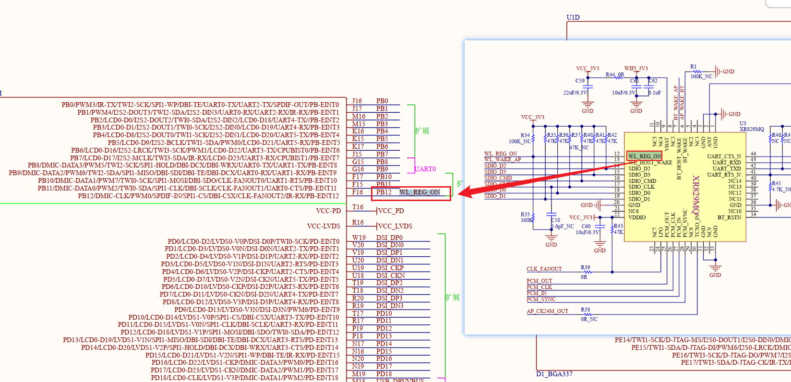
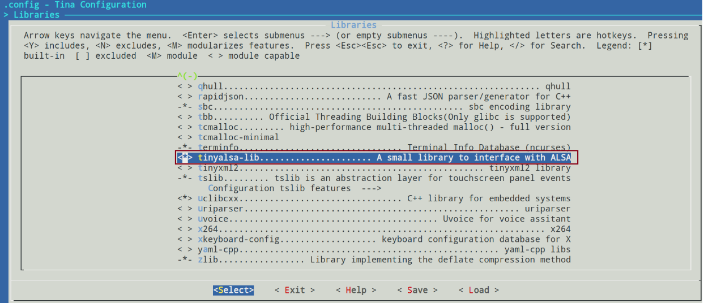

# XR829芯片适配

## 1. 修改设备树

查看原理图：

原设备树中，`WL_REG_ON`与原理图的不匹配，修改为PB12。

蓝牙的设备树节点无需修改：

与原理图引脚符合：

## 2. 添加内核模块

进入SDK根目录，执行：

~~~bash
make menuconfig
~~~

取消勾选xr829-40M，选上xr829。

## 3. 添加xr829固件

Firmware负责实现Wi-Fi和蓝牙的连接管理、数据传输、安全加密以及其他底层操作。

把`xr829 with 40M sdd`取消勾选。

## 4. 启动odhcp6c服务

odhcp6c的核心作用在于简化并自动化IPv6网络环境下的地址配置过程，确保设备能够顺利接入并通信。

## 5. wifi测试

SDK根目录下，执行编译`make`，打包`pack`。

烧录到开发板上。

**执行`wifi_scan_results_test`扫描附近wifi热点：**

~~~bash
root@TinaLinux:/# wifi_scan_results_test

*********************************
***Start scan!***
*********************************
bssid / frequency / signal level / flags / ssid
94:d9:b3:b7:c9:0a       2442    -30     [WPA-PSK-CCMP+TKIP][WPA2-PSK-CCMP+TKIP][ESS]    Programmers
64:6e:97:5d:22:4a       2442    -67     [WPA-PSK-CCMP+TKIP][WPA2-PSK-CCMP+TKIP][ESS]    pobo
d0:76:e7:f8:93:d8       2462    -68     [WPA-PSK-CCMP][WPA2-PSK-CCMP][ESS]      TP-LINK_93D8
9c:a6:15:3b:b9:94       2437    -69     [WPA-PSK-CCMP][WPA2-PSK-CCMP][ESS]      TP-LINK_B994
30:fc:68:4b:d7:94       2412    -70     [WPA-PSK-CCMP][WPA2-PSK-CCMP][ESS]      1708
f0:92:b4:a6:03:91       2452    -45     [WPA-PSK-CCMP+TKIP][WPA2-PSK-CCMP+TKIP][ESS]    ChinaNet-kRAH
c8:50:e9:bb:f5:0a       2462    -48     [WPA-PSK-TKIP][WPA2-PSK+FT/PSK-CCMP][WPS][ESS]  ChinaNet-sqJr
32:95:e3:19:e8:48       2437    -62     [WPA2-PSK+FT/PSK-CCMP][ESS]
30:95:e3:59:e8:48       2437    -62     [WPA2-PSK+FT/PSK-CCMP][ESS]     \xe7\xbe\xbd\xe5\x8d\x92\xe7\xa7\x91\xe6\x8a\x80
74:69:4a:51:91:38       2417    -65     [WPA2-PSK-CCMP][ESS]    1510
34:12:f9:87:a6:49       2427    -69     [WPA2-PSK-CCMP][ESS]    \x00\x00\x00\x00\x00\x00\x00\x00\x00\x00\x00\x00\x00\x00\x00\x00\x00\x00\x00\x00\x00\x00\x00\x00\x00\x00\x00\x00\x00\x00\x00\x00
34:12:f9:87:a6:4d       2427    -70     [WPA2-PSK-CCMP][ESS]    \x00\x00\x00\x00\x00\x00\x00\x00
******************************
Wifi get_scan_results: Success!
******************************
~~~

**执行`wifi_connect_ap_test`连接wifi热点：**

~~~bash
root@TinaLinux:/# wifi_connect_ap_test Programmers 100asktech
==================================
Connecting to the network(Programmers)......
[ 2841.637787] [STA_WRN] Freq 2442 (wsm ch: 7) prev: 3.
[ 2841.643853] wlan0: authenticate with 94:d9:b3:b7:c9:0a (try 1)
[ 2841.657251] [STA_WRN] [HT40][xradio_join_work][bss_ht_info]:
[ 2841.657251] [primary_chan  :0x00000007]
[ 2841.657251] [ht_param      :0x0000000f]
[ 2841.657251] [operation_mode:0x00000006]
[ 2841.657251] [stbc_param    :0x00000000]
[ 2841.657251] [basic_set[0]  :0x00000000]
[ 2841.685173] [STA_WRN] [HT40][xradio_join_work][PhyModeCfg:0x0027]
[ 2841.685173] [ModemFlags    :0x00000007]
[ 2841.685173] [ChWidthCfg    :0x00000002]
[ 2841.685173] [PriChCfg      :0x00000000]
[ 2841.685173] [BandCfg       :0x00000000]
[ 2841.685173] [STBC_Enable   :0x00000000]
[ 2841.685173] [PreambleCfg   :0x00000000]
[ 2841.685173] [SGI_Enable    :0x00000000]
[ 2841.685173] GF_Enable      :0x00000000]
[ 2841.748294] wlan0: authenticated
[ 2841.752631] wlan0: associate with 94:d9:b3:b7:c9:0a (try 1)
[ 2841.806522] wlan0: RX AssocResp from 94:d9:b3:b7:c9:0a (capab=0x431 status=0 aid=5)
[ 2841.815277] wlan0: associated
[ 2841.824201] [AP_WRN] [STA] ASSOC HTCAP 11N 58
[ 2841.829535] [AP_WRN] [HT40][xradio_bss_info_changed][ht_prot:0x0000000a][HtProtMode:0x0002][Green:0x0004]
[ 2841.829952] [AP_WRN] [HT40][xradio_bss_info_changed][PhyModeCfg:0x5027]
[ 2841.829952] [ModemFlags    :0x00000007]
[ 2841.829952] [ChWidthCfg    :0x00000002]
[ 2841.829952] [PriChCfg      :0x00000000]
[ 2841.829952] [BandCfg       :0x00000000]
[ 2841.829952] [STBC_Enable   :0x00000000]
[ 2841.829952] [PreambleCfg   :0x00000001]
[ 2841.829952] [SGI_Enable    :0x00000001]
[ 2841.829952] [GF_Enable     :0x00000000]
[ 2841.922603] IPv6: ADDRCONF(NETDEV_CHANGE): wlan0: link becomes ready
Connected to the AP(Programmers)
Getting ip address(Programmers)......
[ 2842.217245] [TXRX_WRN] drop=1771, fctl=0x00d0.
Wifi connect ap : Success!
==================================
~~~

**`ifconfig`，查看是否分配ip地址：**

~~~bash
root@TinaLinux:/# ifconfig
br-lan    Link encap:Ethernet  HWaddr 12:94:C8:33:1D:27
          inet addr:192.168.100.100  Bcast:192.168.100.255  Mask:255.255.255.0
          inet6 addr: fd93:2460:b4ec::1/60 Scope:Global
          UP BROADCAST MULTICAST  MTU:1500  Metric:1
          RX packets:0 errors:0 dropped:0 overruns:0 frame:0
          TX packets:0 errors:0 dropped:0 overruns:0 carrier:0
          collisions:0 txqueuelen:1000
          RX bytes:0 (0.0 B)  TX bytes:0 (0.0 B)

lo        Link encap:Local Loopback
          inet addr:127.0.0.1  Mask:255.0.0.0
          inet6 addr: ::1/128 Scope:Host
          UP LOOPBACK RUNNING  MTU:65536  Metric:1
          RX packets:11280 errors:0 dropped:0 overruns:0 frame:0
          TX packets:11280 errors:0 dropped:0 overruns:0 carrier:0
          collisions:0 txqueuelen:1000
          RX bytes:879840 (859.2 KiB)  TX bytes:879840 (859.2 KiB)

wlan0     Link encap:Ethernet  HWaddr 00:65:D8:1D:B6:8E
          inet addr:192.168.0.126  Bcast:192.168.0.255  Mask:255.255.255.0
          inet6 addr: fe80::265:d8ff:fe1d:b68e/64 Scope:Link
          UP BROADCAST RUNNING MULTICAST  MTU:1500  Metric:1
          RX packets:333 errors:0 dropped:0 overruns:0 frame:0
          TX packets:36 errors:0 dropped:0 overruns:0 carrier:0
          collisions:0 txqueuelen:1000
          RX bytes:33951 (33.1 KiB)  TX bytes:4894 (4.7 KiB)

root@TinaLinux:/# ping www.baidu.com
PING www.baidu.com (183.2.172.42): 56 data bytes
64 bytes from 183.2.172.42: seq=0 ttl=52 time=8.906 ms
64 bytes from 183.2.172.42: seq=1 ttl=52 time=17.209 ms
64 bytes from 183.2.172.42: seq=2 ttl=52 time=18.982 ms
^C
--- www.baidu.com ping statistics ---
3 packets transmitted, 3 packets received, 0% packet loss
round-trip min/avg/max = 8.906/15.032/18.982 ms
root@TinaLinux:/#
~~~

**执行`wifi_disconnect_ap_test`，断开wifi热点。**

## 6. 蓝牙测试

### 6.1 蓝牙通话HFP

> 蓝牙HFP（Hands-Free Profile）是一种蓝牙配置文件，它允许用户通过蓝牙设备进行免提通话。HFP的实现通常建立在RFCOMM协议之上，并定义了音频网关（AG）和免提设备（HF）之间的通信方式，使用AT指令进行控制和状态信息的交换。

在开发板中，执行`bt_test -i`，打开蓝牙电源、D1-H开发板和控制器XR829的数据传输通道HCI进入交互模式：

~~~bash
root@TinaLinux:/# bt_test -i
1719041879.566378: BTMG[bt_manager_set_enable_default:513]:  enable default profile from bt config.
1719041879.566644: BTMG[bt_manager_enable:407]:  bt manager version:Version:3.0.1.202110291544,builed time:Oct 29 2021-09:42:35
1719041879.566692: BTMG[bt_test_status_cb:82]:  bt is turnning on.
[13383.789836] sunxi-rfkill soc@3000000:rfkill@0: block state already is 1
[13383.817822] sunxi-rfkill soc@3000000:rfkill@0: set block: 0
[13383.834060] sunxi-rfkill soc@3000000:rfkill@0: bt power on success
1719041885.082395: BTMG[bt_profile_global_init:355]:  start bluealsa :1 times
1719041885.752543: BTMG[bt_test_adapter_power_state_cb:47]:  Turn on bt successfully
1719041886.086287: BTMG[bt_test_status_cb:67]:  BT is ON
[bt]#
~~~

打开手机，连接上蓝牙：

终端上输入`hfp_dial 10086`，即可控制手机拨打10086：

~~~bash
[bt]#hfp_dial 10086
[bt]#bluealsa: Unsupported AT message: RESP: command:, value:OK
1719042215.140614: BTMG[bt_test_hfp_event_cb:423]:  event HFP_OK
1719042215.244263: BTMG[bt_test_hfp_event_cb:423]:  event HFP_CIEV
1719042215.245588: [rfcomm_bcs_resp_cb:225]:  ++
1719042215.245640: BTMG[bt_test_hfp_event_cb:423]:  event HFP_BCS
bluealsa: setsockopt BT_VOICE error 22, Invalid argument
1719042215.275556: BTMG[bt_test_hfp_event_cb:423]:  event HFP_OK
bluealsa: SCO connection created by peer
1719042215.309518: [bt_hfp_hf_pcm_start:452]:  enter
1719042215.309568: [aw_pcm_tansport_start:245]:  enter,id:0
1719042215.309591: [aw_pcm_tansport_start:251[13719.425633] [SNDCODEC][sunxi_card_hw_params][620]:stream_flag: 1
]:  device:hw:snddaudio1,default;chanels:1,sampling:16000
1719042215.309618: [aw_pcm_tansport_start:253]:  hfp worker address:0x3fb8b9f658
1719042215.309797: [aw_pcm_tansport_start:245]:  enter,id:1
1719042215.309841: [aw_pcm_tansport_start:251]:  device:CaptureMic,hw:snddaudio1;chanels:1,sampling:16000
1719042215.309867: [aw_pcm_tansport_start:253]:  hfp worker address:0x3fb8b9f680
1719042215.310315: [aw_pcm_transport_runtine:194]:  enter,id:1
1719042215.310470: [aw_pcm_transport_runtine:208]:  opening read pcm ......
1719042215.311252: [aw_pcm_transport_runtine:194]:  enter,id:0
1719042215.311445: [aw_pcm_transport_runtine:208]:  opening read pcm ......
ALSA lib pcm_hw.c:1713:(_snd_pcm_hw_open) Invalid value for card
1719042215.334374: BTMG[aw_pcm_open:400]:  --->Couldn't open PCM:hw:snddaudio1
1719042215.334409: [aw_pcm_transport_runtine:210]:  open read pcm failed
1719042215.334436: [aw_pcm_tansport_routine_device_free:169]:  enter,id:0
1719042215.334459: [aw_pcm_tansport_routine_device_free:183]:  quit,id:0
1719042215.334483: [aw_pcm_tansport_routine_data_free:157]:  enter
1719042215.334505: [aw_pcm_tansport_routine_data_free:162]:  quit
1719042215.338041: [aw_pcm_transport_runtine:214]:  opening write pcm ......
ALSA lib pcm_hw.c:1713:(_snd_pcm_hw_open) Invalid value for card
1719042215.341763: BTMG[aw_pcm_open:400]:  --->Couldn't open PCM:hw:snddaudio1
1719042215.341801: [aw_pcm_transport_runtine:216]:  open write pcm failed
1719042215.341827: [aw_pcm_tansport_routine_device_free:169]:  enter,id:1
1719042215.342343: [aw_pcm_tansport_routine_device_free:183]:  quit,id:1
1719042215.342396: [aw_pcm_tansport_routine_data_free:157]:  enter
1719042215.342420: [aw_pcm_tansport_routine_data_free:162]:  quit
1719042216.014303: BTMG[bt_test_hfp_event_cb:423]:  event HFP_CIEV
~~~

结果如下：

还有其他的一些操作：

~~~bash
来电接听：hfp_answer 
来电拒绝:hfp_hangup
样机拨打上一个电话:hfp_last_num
样机获取手机:hfp_cnum
~~~

### 6.2 蓝牙音频A2DP

> 蓝牙音频A2DP（Advanced Audio Distribution Profile）区别于HFP的另一种蓝牙配置文件，主要用于音乐播放和其他音频流应用，它提供了一种从音频源设备（如智能手机、平板电脑或笔记本电脑）到音频接收设备（如蓝牙耳机、扬声器或车载音频系统）的音频传输机制。

A2DP定义了两种主要角色：Source（源）和Sink（接收器）。

#### 6.2.1 Source

> Source设备是数字音频流的发起者，它负责将音频数据编码并通过蓝牙发送给一个或多个Sink设备。

开发板中，执行`bt_test -i -p a2dp-source`，打开Source模式并进入交互模式：

~~~bash
root@TinaLinux:/# bt_test -i -p a2dp-source
1719044146.397706: BTMG[bt_manager_enable:407]:  bt manager version:Version:3.0.1.202110291544,builed time:Oct 29 2021-09:42:35
1719044146.398009: BTMG[bt_test_status_cb:82]:  bt is turnning on.
[15650.616385] sunxi-rfkill soc@3000000:rfkill@0: set block: 1
[15650.622614] sunxi-rfkill soc@3000000:rfkill@0: bt power off success
[15650.650590] sunxi-rfkill soc@3000000:rfkill@0: set block: 0
[15650.666950] sunxi-rfkill soc@3000000:rfkill@0: bt power on success
1719044150.730524: BTMG[bt_profile_global_init:355]:  start bluealsa :1 times
1719044151.289084: BTMG[bt_test_adapter_power_state_cb:47]:  Turn on bt successfully
1719044151.732365: BTMG[bt_test_status_cb:67]:  BT is ON
~~~

扫描附近蓝牙设备：

- `scan 1`：扫描设备获取到mac地址。
- `scan 0`：停止扫描。
- `scan_list`：获取已经扫描到的设备。

~~~bash
[bt]#scan 1
[bt]#1719044547.238333: BTMG[bt_test_discovery_status_cb:91]:  bt start scanning.
1719044547.238379: BTMG[btmg_gap_bluez_callback:1228]:  Discovery started
1719044552.490007: BTMG[bt_test_update_rssi_cb:139]:  address:90:F0:52:BA:95:7D,name:linuxrf,rssi:-57
1719044555.674164: BTMG[bt_test_update_rssi_cb:139]:  address:60:AB:67:60:85:1F,name:小米手机,rssi:-67
1719044556.831551: BTMG[bt_test_update_rssi_cb:139]:  address:90:F0:52:BA:95:7D,name:linuxrf,rssi:-33
1719044558.882874: BTMG[bt_test_update_rssi_cb:139]:  address:90:F0:52:BA:95:7D,name:linuxrf,rssi:-58
~~~

连接蓝牙设备：

~~~bash
[bt]#connect 80:76:C2:23:D0:A9
~~~

更多的操作可以输入`help`来查看：

~~~bash
[bt]#help
Available commands:
        enable                          enable [0/1]: open bt or not
        scan                            scan [0/1]: scan for devices
        scan_list                       scan_list: list available devices
        pair                            pair [mac]: pair with devices
        unpair                          uppair [mac]: unpair with devices
        paired_list                     paired_list: list paired devices
        get_state                       get_state: get bt state
        get_name                        get_name: get bt name
        set_name                        set_name [name]: set bt name
        remote_name                     remote_name: get remote device name
        set_vol                         set_vol: set a2dp source volme
        get_vol                         get_vol: get a2dp source volme
        get_addr                        get_addr: get bt address
        set_dis                         set_dis [0~2]:0-NONE,1-page scan,2-inquiry scan&page scan
        set_page_to                     real timeout = slots * 0.625ms
        set_io_cap                      set_io_cap [0~4]:0-keyboarddisplay,             1-displayonly,2-displayyesno,3-keyboardonly,4-noinputnooutput
        avrcp                           avrcp [play/pause/stop/fastforward/rewind/forward/backward]: avrcp control
        profile_cn                      profile_cn [mac]:a2dp sink connect
        profile_dis                     profile_dis [mac]:a2dp sink disconnect
        connect                         connect [mac]:generic method to connect
        disconnect                      disconnect [mac]:generic method to disconnect
        remove                          remove [mac]:removes the remote device
        a2dp_src_start                  a2dp_src_start:start a2dp source playing
        a2dp_src_stop                   a2dp_src_stop:stop a2dp source playing
        hfp_answer                      hfp_answer: answer the phone
        hfp_hangup                      hfp_hangup: hangup the phone
        hfp_dial                        hfp_dial [num]: call to a phone number
        hfp_cnum                        hfp_cum: Subscriber Number Information
        hfp_last_num                    hfp_last_num: calling the last phone number dialed
        hfp_vol                         hfp_vol [0~15]: update phone's volume.
        spp_connect                     spp_connect dev_id dst channel
        spp_send                        spp_send data
        spp_disconnect                  spp_disconnect dst
        get_version                     get_version: get btmanager version
        debug                           debug [0~5]: set debug level
        ex_dbg                          ex_dbg [mask]: set ex debug mask
        test                            test : test cmd
~~~

#### 6.2.2 Sink

> Sink设备接收来自Source的音频数据，对其进行解码，并播放音频。Sink设备还可以实现远程控制功能，允许用户控制播放、音量等。

开发板中，执行`bt_test -p a2dp-sink`，打开Sink模式：

~~~bash
root@TinaLinux:/# bt_test -p a2dp-sink
root@TinaLinux:/# 1719045265.302286: BTMG[bt_manager_enable:407]:  bt manager version:Version:3.0.1.202110291544,builed time:Oct 29 2021-09:42:35
1719045265.303777: BTMG[bt_test_status_cb:82]:  bt is turnning on.
[16769.554233] sunxi-rfkill soc@3000000:rfkill@0: set block: 1
[16769.562498] sunxi-rfkill soc@3000000:rfkill@0: bt power off success
[16769.590341] sunxi-rfkill soc@3000000:rfkill@0: set block: 0
[16769.606706] sunxi-rfkill soc@3000000:rfkill@0: bt power on success
1719045269.582019: BTMG[bt_profile_global_init:355]:  start bluealsa :1 times
1719045270.143978: BTMG[bt_test_adapter_power_state_cb:47]:  Turn on bt successfully
1719045270.585384: BTMG[bt_test_status_cb:67]:  BT is ON
~~~

打开手机连接上蓝牙，播放音乐，找个耳机插上D1H开发板耳机孔，即可听到音乐。

如果想要使用扬声器的接口来播放音乐，需要做以下设置：

在SDK根目录下执行`make menuconfig`，选上：

在`package/libs/tinyalsa/`，执行`mm -B`：

~~~bash
ubuntu@ubuntu1804:~/tina-d1-h/package/libs/tinyalsa$ mm -B
ubuntu@ubuntu1804:~/tina-d1-h/package/libs/tinyalsa$ cd /home/ubuntu/tina-d1-h/out/d1-h-nezha/compile_dir/target/tinyalsa-1.1.1/ipkg-install/usr/bin/
ubuntu@ubuntu1804:~/tina-d1-h/out/d1-h-nezha/compile_dir/target/tinyalsa-1.1.1/ipkg-install/usr/bin$ ls
tinycap  tinymix  tinypcminfo  tinyplay
ubuntu@ubuntu1804:~/tina-d1-h/out/d1-h-nezha/compile_dir/target/tinyalsa-1.1.1/ipkg-install/usr/bin$ adb push ./* /usr/bin
~~~

在开发板中，可以执行以下：

~~~bash
#转换为喇叭播放：
tinymix set "LINEOUTL Output Select" 1
tinymix set "LINEOUTR Output Select" 1

#设置音量：
tinymix set "LINEOUT volume" 15
tinymix set "LINEOUT Switch" 1
~~~

即可通过扬声器接口从喇叭上播放音乐。

