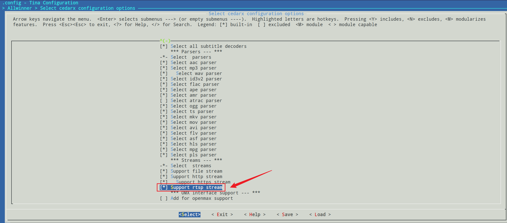
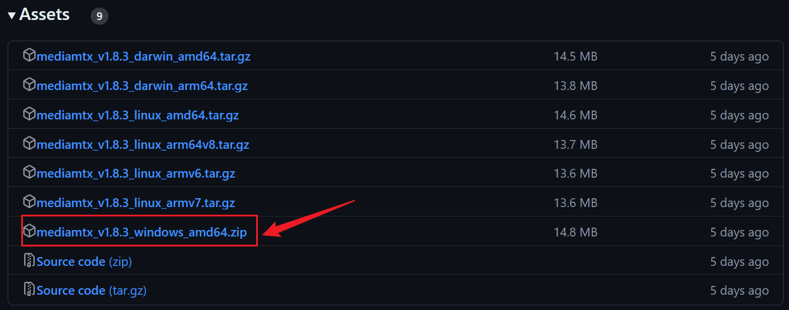
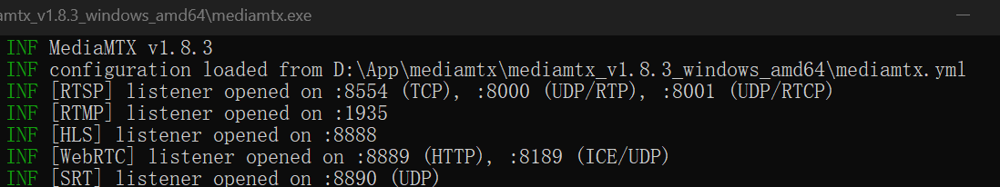
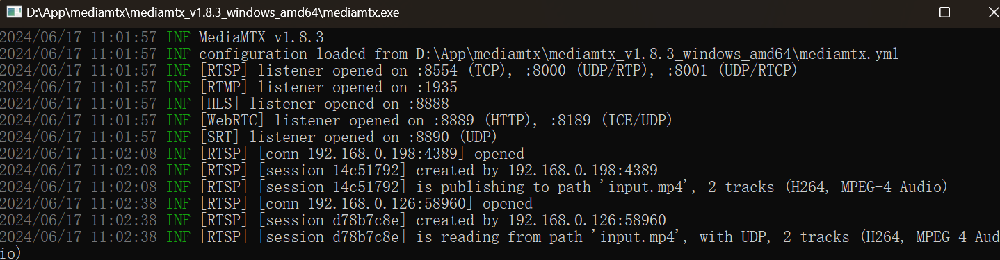

# 播放网络视频

## 1. 开机默认HDMI输出

> 网络视频将通过HDMI屏幕来显示，需要先配置HDMI输出。

修改uboot的设备树，实现开机默认HDMI显示。

进入目录：

~~~bash
cd /home/ubuntu/tina-d1-h/device/config/chips/d1-h/configs/nezha
~~~

修改`uboot-board.dts`：

~~~bash
vim uboot-board.dts
~~~

修改disp节点，如下：

~~~bash
&disp {
	disp_init_enable         = <1>;
	disp_mode                = <0>;
/*
        screen0_output_type      = <1>;
        screen0_output_mode      = <4>;

        screen1_output_type      = <3>;
        screen1_output_mode      = <10>;
*/
	screen0_output_type      = <3>;
	screen0_output_mode      = <10>;

	screen1_output_type      = <1>;
	screen1_output_mode      = <4>;

/*
        screen1_output_format    = <0>;
        screen1_output_bits      = <0>;
        screen1_output_eotf      = <4>;
        screen1_output_cs        = <257>;
        screen1_output_dvi_hdmi  = <2>;
        screen1_output_range     = <2>;
        screen1_output_scan      = <0>;
        screen1_output_aspect_ratio = <8>;

*/

	screen0_output_format    = <0>;
	screen0_output_bits      = <0>;
	screen0_output_eotf      = <4>;
	screen0_output_cs        = <257>;
	screen0_output_dvi_hdmi  = <2>;
	screen0_output_range     = <2>;
	screen0_output_scan      = <0>;
	screen0_output_aspect_ratio = <8>;
/*
        dev0_output_type         = <1>;
        dev0_output_mode         = <4>;
        dev0_screen_id           = <0>;
        dev0_do_hpd              = <0>;
*/
	dev0_output_type         = <4>;
	dev0_output_mode         = <10>;
	dev0_screen_id           = <0>;
	dev0_do_hpd              = <1>;

	//dev1_output_type         = <4>;
	//dev1_output_mode         = <10>;
	//dev1_screen_id           = <1>;
	//dev1_do_hpd              = <1>;

	def_output_dev           = <0>;
	hdmi_mode_check          = <1>;

	fb0_format               = <0>;
	fb0_width                = <0>;
	fb0_height               = <0>;

	fb1_format               = <0>;
	fb1_width                = <0>;
	fb1_height               = <0>;
	chn_cfg_mode             = <1>;

	disp_para_zone           = <1>;
	/*VCC-LCD*/
/*	dc1sw-supply = <&reg_dc1sw>;*/
	/*VCC-DSI*/
/*	eldo3-supply = <&reg_eldo3>;*/
	/*VCC-PD*/
/*	dcdc1-supply = <&reg_dcdc1>;*/
};
~~~

在SDK根目录下，烧写`make`、打包`pack`和烧录。即可在HDMI屏幕上显示。

## 2. 使能RTSP

进入目录：

~~~bash
cd /home/ubuntu/tina-d1-h/package/allwinner
~~~

新建文件`support_rtsp.patch`:

~~~bash
touch support_rtsp.patch
~~~

写入以下内容:

~~~bash
diff --git a/allwinner/tina_multimedia/libcedarx/libcore/parser/Makefile.am b/allwinner/tina_multimedia/libcedarx/libcore/parser/Makefile.am
index f33af3743..5d1aeaf0c 100755
--- a/allwinner/tina_multimedia/libcedarx/libcore/parser/Makefile.am
+++ b/allwinner/tina_multimedia/libcedarx/libcore/parser/Makefile.am
@@ -72,4 +72,7 @@ if PLS_PARSER_ENABLE
 SUBDIRS += pls
 endif
 
-SUBDIRS += base
\ No newline at end of file
+SUBDIRS += remux
+
+SUBDIRS += base
+
diff --git a/allwinner/tina_multimedia/libcedarx/libcore/parser/base/CdxParser.c b/allwinner/tina_multimedia/libcedarx/libcore/parser/base/CdxParser.c
index 44305f3c6..a24273fbc 100755
--- a/allwinner/tina_multimedia/libcedarx/libcore/parser/base/CdxParser.c
+++ b/allwinner/tina_multimedia/libcedarx/libcore/parser/base/CdxParser.c
@@ -50,7 +50,7 @@ static struct ParserUriKeyInfoS asfKeyInfo =
 };
 #endif
 
-#if 0
+#if 1
 extern CdxParserCreatorT remuxParserCtor;
 static struct ParserUriKeyInfoS remuxKeyInfo =
 {
@@ -460,7 +460,7 @@ void AwParserInit(void)
     AwParserRegister(&movParserCtor, CDX_PARSER_MOV, &movKeyInfo);
 #endif
 
-#if 0
+#if 1
     AwParserRegister(&remuxParserCtor, CDX_PARSER_REMUX, &remuxKeyInfo);
 #endif
 
diff --git a/allwinner/tina_multimedia/libcedarx/libcore/parser/base/Makefile.am b/allwinner/tina_multimedia/libcedarx/libcore/parser/base/Makefile.am
index 9dbb73590..86174f94e 100755
--- a/allwinner/tina_multimedia/libcedarx/libcore/parser/base/Makefile.am
+++ b/allwinner/tina_multimedia/libcedarx/libcore/parser/base/Makefile.am
@@ -65,6 +65,8 @@ libcdx_parser_la_LIBADD += $(top_srcdir)/libcore/parser/avi/libcdx_avi_parser.la
 libcdx_parser_la_CFLAGS += -DAVI_PARSER_ENABLE
 endif
 
+libcdx_parser_la_LIBADD += $(top_srcdir)/libcore/parser/remux/libcdx_remux_parser.la
+
 if TS_PARSER_ENABLE
 libcdx_parser_la_LIBADD += $(top_srcdir)/libcore/parser/ts/libcdx_ts_parser.la
 libcdx_parser_la_CFLAGS += -DTS_PARSER_ENABLE
~~~

用 git apply 来运行 patch 补丁:

~~~bash
git apply support_rtsp.patch
~~~

如果出现以下错误：

~~~bash
ubuntu@ubuntu1804:~/tina-d1-h/package/allwinner$ git apply support_rtsp.patch
error: patch failed: allwinner/tina_multimedia/libcedarx/libcore/parser/Makefile.am:72
error: allwinner/tina_multimedia/libcedarx/libcore/parser/Makefile.am: patch does not apply
error: patch failed: allwinner/tina_multimedia/libcedarx/libcore/parser/base/CdxParser.c:50
error: allwinner/tina_multimedia/libcedarx/libcore/parser/base/CdxParser.c: patch does not apply
error: patch failed: allwinner/tina_multimedia/libcedarx/libcore/parser/base/Makefile.am:65
error: allwinner/tina_multimedia/libcedarx/libcore/parser/base/Makefile.am: patch does not apply
ubuntu@ubuntu1804:~/tina-d1-h/package/allwinner$
~~~

大概率是被修改过了，不用再修改。

执行`croot`，进入配置界面：

~~~bash
make menuconfig
~~~

选上以下内容：

保存、编译`make`、打包`pack`和烧录。这样开发板就支持rtsp拉流功能了。

## 3. RTSP推流

有拉流，相应的就需要有推流。要实现这些功能，首先需要一个支持rtsp流媒体协议的服务器，可以在windows下搭建一个服务器。

下载链接：[Releases · bluenviron/mediamtx (github.com)](https://github.com/bluenviron/mediamtx/releases)

下载完成后，双击`.exe`，即可运行服务器：

一般使用的是`8554`这个端口。

在ubuntu上，准备一个mp4格式的视频（视频尽量一分钟左右），使用ffmpeg工具来实现推流操作：

~~~bash
ffmpeg -re -stream_loop -1 -i input.mp4 -c copy -f rtsp rtsp://192.168.0.198:8554/input.mp4
~~~

> `192.168.0.198`是windows上的无线ip地址。

这时推流已经就位了，下面开始在开发板上面进行拉流的操作。

## 4. RTSP拉流

完成了之前的步骤后，开发板进行 RTSP 拉流就比较容易了，联网、拉流即可。

wifi配置、连接根据之前写的操作来执行。

tplayerdemo 来拉流播放：

> 操作之前需要先把windows上的防火墙关闭，确保能ping通192.168.0.198，同样也需要能ping通ubuntu的桥接ip地址。

~~~bash
tplayerdemo rtsp://192.168.0.198:8554/input.mp4
~~~

可以看到视频可以播放到 HDMI 的输出了，日志如下：

~~~bash
root@TinaLinux:/# tplayerdemo rtsp://192.168.0.198:8554/input.mp4
WARNING: awplayer <cdx_log_set_level:30>: cdx Set log level to 6

INFO   : cedarc <CedarPluginVDInit:79>: register h264 decoder success!
INFO   : cedarc <CedarPluginVDInit:84>: register mjpeg decoder success!
INFO   : cedarc <CedarPluginVDInit:86>: register mpeg2 decoder success!
INFO   : cedarc <CedarPluginVDInit:92>: register mpeg4dx decoder success!
INFO   : cedarc <CedarPluginVDInit:79>: register mpeg4H263 decoder success!
INFO   : cedarc <CedarPluginVDInit:90>: register mpeg4Normal decoder success!
INFO   : cedarc <CedarPluginVDInit:74>: register vc1 decoder success!
INFO   : cedarc <CedarPluginVDInit:85>: register h265 decoder success!

******************************************************************************************
* This program implements a simple player, you can type commands to control the player.
* To show what commands supported, type 'help'.
******************************************************************************************
dd: writing '/dev/fb0': No space left on device
32401+0 records in
32400+0 records out
argc = 2
argv[0] = tplayerdemo
argv[1] = rtsp://192.168.0.198:8554/input.mp4
may be is one file:cut[  133.664339] [SNDCODEC][sunxi_card_hw_params][620]:stream_flag: 0
 down suffix is:.mp4
find the matched type:.mp4
create player:0

>>>>>>>>>>>>>>>>>>>>>>>>>>>>>>> tina_multimedia <<<<<<<<<<<<<<<<<<<<<<<<<<<<<<<
tag   : tina3.5
branch: tina-dev
date  : Mon Jul 15 19:04:59 2019 +0800
Change-Id: I5f6c8a88d7b387a312b7744797a0d5f8ab07ee7a
-------------------------------------------------------------------------------
xplayer:process message XPLAYER_COMMAND_SET_AUDIOSINK.
xplayer:process message XPLAYER_COMMAND_SET_SURFACE.
xplayer:process message XPLAYER_COMMAND_SET_SUBCTRL.
xplayer:process message XPLAYER_COMMAND_SET_DI.
create player[0]:0x34a2a3d0
screen width:1920,screen height:1080
1:playVideo:0
before TPlayerSetDataSource,94712:rtsp://192.168.0.198:8554/input.mp4
xplayer:process message XPLAYER_COMMAND_SET_SOURCE.
setDataSource end
xplayer:process message XPLAYER_COMMAND_PREPARE.
Created new TCP socket 9 for connection
INFO   : cedarc <log_set_level:4[  133.983565] VE: enable hw clock
3>: Set log level to 5 from /ven[  133.989646] enable_cedar_hw_clk,552
dor/etc/cedarc.conf
ERROR  : cedarc <DebugCheckConfig:301>: [4[  133.998973] VE: VE real_freq=576000000
[  133.998973]
0;31mnow cedarc log level:5
info: media source is unseekable.
TPlayerPrepare end
TPlayerSetHoldLastPicture()
xplayer:process message XPLAYER_COMMAND_START.
(Allwinner Audio Middle Layer),line(971) : Create Decoder!!=====
(Allwinner Audio Middle Layer),line(603) : AudioDec_Installaudiolib ok
(Allwinner Audio Middle Layer),line(606) : audio decoder init start ...
(AllwinnerAlibs),line(50) :
>>>>>>>>>>>>>>>>>>>>>>>>>>>>>>> Audio <<<<<<<<<<<<<<<<<<<<<<<<<<<<<<<
tag   : audiocodec-v1.2
branch: new
commit: 3ba65962c01cbf1280ddda19d843009b6ef8ce85
date  : Tue Jan 8 16:25:27 2019 +0800
----------------------------------------------------------------------

(AllwinnerAlibs),line(700) : ----Loading so success!
(AllwinnerAlibs),line(902) : *************pAudioStreamInfo start******************
(AllwinnerAlibs),line(903) : eCodecFormat         :id(4), name(aac low-complexy)
(AllwinnerAlibs),line(904) : eSubCodecFormat      :0
(AllwinnerAlibs),line(905) : nChannelNum          :2
(AllwinnerAlibs),line(906) : nBitsPerSample       :16
(AllwinnerAlibs),line(907) : nSampleRate          :44100
(AllwinnerAlibs),line(908) : nAvgBitrate          :0
(AllwinnerAlibs),line(909) : nMaxBitRate          :0
(AllwinnerAlibs),line(910) : nFileSize            :0
(AllwinnerAlibs),line(911) : eAudioBitstreamSource:0
(AllwinnerAlibs),line(912) : eDataEncodeType      :0
(AllwinnerAlibs),line(913) : nCodecSpecificDataLen:2
(AllwinnerAlibs),line(914) : pCodecSpecificData   :0x3fbc088420
(AllwinnerAlibs),line(915) : nFlags               :0
(AllwinnerAlibs),line(916) : nBlockAlign          :0
(AllwinnerAlibs),line(917) : *************pAudioStreamInfo end  ******************
(AAC Decoder),line(36) : init successs...
(Allwinner Audio Middle Layer),line(614) : AUDIO DECODE INIT OK...0
started.

tplayerdemo# ERROR  : awplayer <PlayerStart:806>: invalid start operation, player already in started status.
have no enough data to play
have enough data to play again
ERROR  : awplayer <__LayerQueueBuffer:969>: *** picNode is full when queue buffer
ERROR  : awplayer <__LayerQueueBuffer:969>: *** picNode is full when queue buffer
*****tplayer:video decoded width = 1280,height = 720
*****tplayerdemo:video decoded width = 1280,height = 720real set to display rect:w = 1280,h = 720
warning: unknown callback from Tinaplayer.
*****tplayer:video width = 1280,height = 720
warning: unknown callback from Tinaplayer.
****player(0x34a2c7b0): first video pts = 1714438937699315*****
ERROR  : awplayer <__LayerQueueBuffer:969>: *** picNode is full when queue buffer
ERROR  : fbm.c <FbmReturnPicture:1043>: invalid frame status, a picture being returned,                 but bUsedByRender=0, bInValidPictureQueue=1, bAlreadyDisplayed=0.
ERROR  : fbm.c <FbmReturnPicture:1044>: **picture[0x3fb4001f08],id[8]
WARNING: cedarc <ReturnPicture:1698>: FbmReturnPicture return fail,            it means the picture being returned it not one of this FBM.
~~~

mediamtx服务器上的信息如下：

