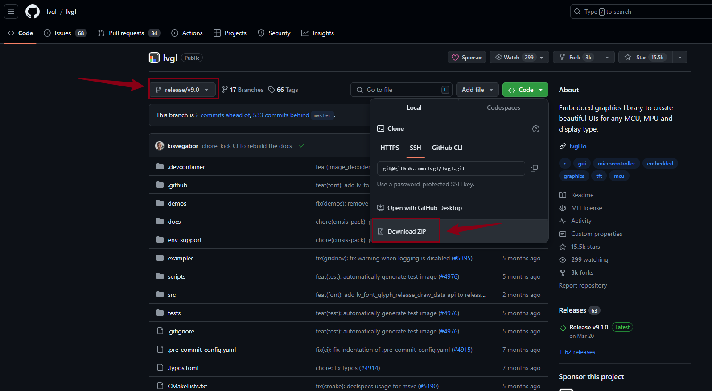

# 红外控制LVGL界面切换

## 1. 测试红外功能

### 1.1 配置设备树

查看原理图：

可以看到红外对应的引脚号是`PG16`。

进入目录：

~~~bash
cd /home/ubuntu/tina-d1-h/device/config/chips/d1-h/configs/nezha/linux-5.4
~~~

修改`board.dts`：

~~~bash
vim board.dts
~~~

修改引脚：

以下节点是`红外接收`的设备树节点，没有使能的话，需要使能：

### 1.2 配置内核配置文件

执行`ckernel`，进入内核目录。

打开内核配置界面：

~~~bash
m kernel_menuconfig
~~~

红外有很多种协议，NEC红外协议是最常用的一种，默认选上：

添加红外接收驱动：

保存，回到SDK根目录，编译`make`、打包`pack`和烧录。

### 1.3 验证红外功能

开发板上，执行`cat proc/bus/input/devices`:

~~~bash
root@TinaLinux:/# cat proc/bus/input/devices
I: Bus=0019 Vendor=0001 Product=0001 Version=0100
N: Name="sunxi-keyboard"
P: Phys=sunxikbd/input0
S: Sysfs=/devices/virtual/input/input0
U: Uniq=
H: Handlers=kbd event0
B: PROP=0
B: EV=3
B: KEY=100000000 0 0 100000000800 4000000000000 10000000

I: Bus=0019 Vendor=0001 Product=0001 Version=0100
N: Name="sunxi-ir"
P: Phys=sunxi-ir/input0
S: Sysfs=/devices/platform/soc@3000000/7040000.s_cir/rc/rc0/s_cir_rx
U: Uniq=
H: Handlers=kbd event1
B: PROP=20
B: EV=100017
B: KEY=2
B: REL=3
B: MSC=10

I: Bus=0000 Vendor=0000 Product=0000 Version=0000
N: Name="audiocodec sunxi Audio Jack"
P: Phys=ALSA
S: Sysfs=/devices/platform/soc@3000000/2030340.sound/sound/card0/input2
U: Uniq=
H: Handlers=kbd event2
B: PROP=0
B: EV=23
B: KEY=40 0 0 0 0 0 400000000 0 c000000000000 0
B: SW=14

I: Bus=0018 Vendor=0000 Product=0000 Version=0000
N: Name="fts_ts"
P: Phys=
S: Sysfs=/devices/platform/soc@3000000/sunxi-i2c2/i2c-2/2-0038/input/input3
U: Uniq=
H: Handlers=event3
B: PROP=2
B: EV=b
B: KEY=400 0 0 0 0 0
B: ABS=661800000000000
~~~

可以看到`/dev/input/event1`就是红外接收的设备节点了。

执行：

~~~bash
hexdump /dev/input/event1
~~~

查看是否接收正常：

~~~bash
root@TinaLinux:/# hexdump /dev/input/event1
0000000 0d07 0000 0000 0000 4ab4 000c 0000 0000
0000010 0004 0004 0007 0000 0d07 0000 0000 0000
0000020 4ab4 000c 0000 0000 0000 0000 0000 0000
0000030 0d08 0000 0000 0000 4a1b 000e 0000 0000
0000040 0004 0004 0009 0000 0d08 0000 0000 0000
0000050 4a1b 000e 0000 0000 0000 0000 0000 0000
0000060 0d0a 0000 0000 0000 5968 0009 0000 0000
0000070 0004 0004 0007 0000 0d0a 0000 0000 0000
0000080 5968 0009 0000 0000 0000 0000 0000 0000
0000090 0d0b 0000 0000 0000 cf50 0004 0000 0000
00000a0 0004 0004 0009 0000 0d0b 0000 0000 0000
00000b0 cf50 0004 0000 0000 0000 0000 0000 0000
~~~

收到数据就是接收正常的现象。下面可以编写测试程序了。

### 1.4 编写红外接收测试程序

以下编写的测试文件：

~~~bash
ubuntu@ubuntu1804:~/C_Source/C_IRTest$ tree -L 2
.
├── bin
│   └── main
├── build
│   ├── CMakeCache.txt
│   ├── CMakeFiles
│   ├── cmake_install.cmake
│   └── Makefile
├── build.sh
├── CMakeLists.txt
├── inc
│   └── ir_test.h
├── main.c
├── src
│   └── ir_test.c
└── toolchain.cmake

5 directories, 10 files
~~~

主函数`main.c`如下:

~~~c
#include <stdio.h>

#include "ir_test.h"

int main(int argc,char ** argv)
{
        int rang_low = 0, rang_high = 0;
        return test_keyboard(DEV_PATH);
}
~~~

红外模块测试程序`/src/ir_test.c`如下：

~~~c
#include "ir_test.h"

static const int key_exit = 102;
static int keys_fd = 0;

unsigned int test_keyboard(const char * event_file)
{
        int code = 0, i;
        struct input_event data={0};
        keys_fd=open(DEV_PATH, O_RDONLY);
        if(keys_fd <= 0)
        {
                printf("open %s error!\n", DEV_PATH);
                return -1;
        }
        fcntl(keys_fd,F_SETFL,O_NONBLOCK);
        for(;;)
        {
                read(keys_fd, &data, sizeof(data));
                if(data.value){
                        printf("%d\r\n",data.value);
                        code = data.value;
                }
        }
        close(keys_fd);
        return 0;
}
~~~

所用到的头文件`/inc/ir_test.h`如下：

~~~c
#ifndef IR_TEST_H
#define IR_TEST_H

#include <stdio.h>
#include <linux/input.h>
#include <stdlib.h>
#include <sys/types.h>
#include <sys/stat.h>
#include <fcntl.h>
#include <sys/time.h>
#include <limits.h>
#include <unistd.h>
#include <signal.h>

#define DEV_PATH "/dev/input/event1" //difference is possible

unsigned int test_keyboard(const char * event_file);

#endif
~~~

使用CMake来构建工程会更加方便一些，`CMakeLists.txt`如下：

~~~cmake
cmake_minimum_required(VERSION 3.10)
project(ir)

set(CMAKE_C_STANDARD 99)
set(CMAKE_CXX_STANDARD 17)
set(CMAKE_CXX_STANDARD_REQUIRED ON)

set(EXECUTABLE_OUTPUT_PATH ${PROJECT_SOURCE_DIR}/bin)

include_directories(${PROJECT_SOURCE_DIR}/inc)

file(GLOB SRC_FILES "src/*.c")

add_executable(main main.c ${SRC_FILES})

#target_link_libraries(target_name lib1 lib2 ...)
~~~

指定交叉编译工具，`toolchain.cmake`如下:

~~~bash
set(CMAKE_SYSTEM_NAME Linux)
set(CMAKE_SYSTEM_PROCESSOR riscv)

set(tools "/home/ubuntu/tina-d1-h/prebuilt/gcc/linux-x86/riscv/toolchain-thead-glibc/riscv64-glibc-gcc-thead_20200702")
set(CMAKE_C_COMPILER ${tools}/bin/riscv64-unknown-linux-gnu-gcc)
set(CMAKE_CXX_COMPILER ${tools}/bin/riscv64-unknown-linux-gnu-g++)
~~~

为了更加方便编译，编写一个脚本。`build.sh`如下：

~~~bash
rm -rf build
mkdir -p build
cd build/
cmake -DCMAKE_TOOLCHAIN_FILE="../toolchain.cmake" ..
make -j8
~~~

执行`./build.sh`，生成的可执行程序在`bin/`文件下。

使用adb来推送到开发板上：

~~~bash
adb push bin/main /mnt/UDISK/
~~~

在开发板上执行`/mnt/UDISK/main`，即可验证红外接收：

~~~bash
root@TinaLinux:/mnt/UDISK# ./main
7
9
7
9
~~~

为后面实现红外切换LVGL界面做准备。

## 2. lvgl9移植

> lvgl的界面准备使用9.0版本去实现，在这之前，需要先移植lvgl9.0版本例程到开发板上，为后面移植界面做准备。

参考文章：[移植lvgl v9到嵌入式linux设备_lvgl9 linux-CSDN博客](https://blog.csdn.net/weixin_63773568/article/details/136913352?spm=1001.2014.3001.5501)

### 2.1 准备移植资源

以下文件是从LVGL官方仓库，下载两个仓库：

> 注意：都要选择v9.0版本！！

|     名称      |                 仓库地址                  |                        描述                        |
| :-----------: | :---------------------------------------: | :------------------------------------------------: |
|     lvgl      |     https://github.com/lvgl/lvgl.git      | 包含了LVGL图形界面控件源码、驱动接口源代码以及例程 |
| lv_port_linux | https://github.com/lvgl/lv_port_linux.git |         适配有framebuffer的linux系统的接口         |

由于版本更新，直接在ubuntu上克隆是最新版本的，编译会出现问题。

建议在window上都选择V9.0版本下载上面两个仓库，最后用lvgl仓库代替lv_port_linux_frame_buffer的lvgl文件夹。

`lv_port_linux`：

`lvgl`：

### 2,2 移植步骤

替换好工程后，上传到ubuntu，新建一个目录用于存放该工程。

可以看到目录结构如下：

~~~bash
ubuntu@ubuntu1804:~/lvgl_demo/lv_port_linux-release-v9.0$ tree -L 1
.
├── CMakeLists.txt
├── LICENSE
├── lv_conf.h
├── lvgl
├── main.c
├── Makefile
├── mouse_cursor_icon.c
└── README.md

1 directory, 7 files
~~~

如果需要支持触摸功能，修改`lv_conf.h`：

~~~bash
888 /*Driver for evdev input devices*/
889 #define LV_USE_EVDEV    1
~~~

在`mian.c`中添加触摸输入：

> 需要确定设备的触摸节点（可以使用`cat /dev/input/event3`测试）

~~~c
int main(void)
{
    lv_init();

    /*Linux frame buffer device init*/
    lv_display_t * disp = lv_linux_fbdev_create();
    lv_linux_fbdev_set_file(disp, "/dev/fb0");

    /*input touch device init*/
    lv_indev_t *touch;
    touch = lv_evdev_create(LV_INDEV_TYPE_POINTER,"/dev/input/event3");

    /*Create a Demo*/
    lv_demo_widgets();
    //lv_demo_widgets_start_slideshow();

    /*Handle LVGL tasks*/
    while(1) {
        lv_timer_handler();
        usleep(5000);
    }

    return 0;
}
~~~

### 2.3 编译

指定交叉编译工具，编写一个`toolchain.cmake`如下:

~~~bash
set(CMAKE_SYSTEM_NAME Linux)
set(CMAKE_SYSTEM_PROCESSOR riscv)

set(tools "/home/ubuntu/tina-d1-h/prebuilt/gcc/linux-x86/riscv/toolchain-thead-glibc/riscv64-glibc-gcc-thead_20200702")
set(CMAKE_C_COMPILER ${tools}/bin/riscv64-unknown-linux-gnu-gcc)
set(CMAKE_CXX_COMPILER ${tools}/bin/riscv64-unknown-linux-gnu-g++)
~~~

为了方便编译，编写一份脚本`build.sh`：

~~~bash
rm -rf build
mkdir -p build
cd build/
cmake -DCMAKE_TOOLCHAIN_FILE="../toolchain.cmake" ..
make -j8
~~~

编译：

~~~bash
ubuntu@ubuntu1804:~/lvgl_demo/lv_port_linux-release-v9.0$ ls
bin  build  build.sh  CMakeLists.txt  LICENSE  lv_conf.h  lvgl  main.c  Makefile  mouse_cursor_icon.c  README.md  toolchain.cmake
ubuntu@ubuntu1804:~/lvgl_demo/lv_port_linux-release-v9.0$
ubuntu@ubuntu1804:~/lvgl_demo/lv_port_linux$ sudo chmod +x build.sh
ubuntu@ubuntu1804:~/lvgl_demo/lv_port_linux-release-v9.0$ ./build.sh 
-- The C compiler identification is GNU 8.1.0
-- The CXX compiler identification is GNU 8.1.0
-- Detecting C compiler ABI info
-- Detecting C compiler ABI info - done
...
[ 99%] Linking C static library liblvgl_examples.a
[ 99%] Built target lvgl_examples
[ 99%] Building C object CMakeFiles/main.dir/main.c.o
[ 99%] Building C object CMakeFiles/main.dir/mouse_cursor_icon.c.o
[100%] Linking CXX executable /home/ubuntu/lvgl_demo/lv_port_linux-release-v9.0/bin/main
[100%] Built target main
ubuntu@ubuntu1804:~/lvgl_demo/lv_port_linux-release-v9.0$ 
~~~

编译成功后，可执行程序保存在bin/目录下：

~~~bash
ubuntu@ubuntu1804:~/lvgl_demo/lv_port_linux-release-v9.0/bin$ file main 
main: ELF 64-bit LSB executable, UCB RISC-V, version 1 (SYSV), dynamically linked, interpreter /lib/ld-linux-riscv64xthead-lp64d.so.1, for GNU/Linux 4.15.0, with debug_info, not stripped
ubuntu@ubuntu1804:~/lvgl_demo/lv_port_linux-release-v9.0/bin$
~~~

## 3. lvgl输入设备适配

通过前面的测试，可以确认红外功能是可以使用的，为了方便控制lvgl的界面切换，需要把红外绑定到lvgl的输入设备框架里。

### 3.1 移植红外输入设备

参考官方文档：

[Input device interface（输入设备接口） — LVGL 文档 (100ask.net)](https://lvgl.100ask.net/9.0/porting/indev.html)

可以看到，要创建输入设备，需要使用以下：

~~~c
/*Register at least one display before you register any input devices*/
lv_indev_t * indev = lv_indev_create();
lv_indev_set_type(indev, LV_INDEV_TYPE_...);   /*See below.*/
lv_indev_set_read_cb(indev, read_cb);  /*See below.*/
~~~

其中`LV_INDEV_TYPE_`成员可以是：

- `LV_INDEV_TYPE_POINTER`：触摸屏或鼠标
- `LV_INDEV_TYPE_KEYPAD`：键盘或键垫
- `LV_INDEV_TYPE_ENCODER`：具有左右旋转及按下选项的编码器
- `LV_INDEV_TYPE_BUTTON`：外部按钮虚拟按压屏幕

`read_cb` 是一个函数指针，它将定期被调用以报告输入设备当前的状态。

每种类型，官网都简单写了一个`read_cb`所指向的函数的用法。可以参考它的，把红外适配上去。

在这里，红外使用的是`LV_INDEV_TYPE_BUTTON`类型，官网中的`read_cb`指向的函数是这样使用的：

~~~c
void button_read(lv_indev_t * indev, lv_indev_data_t*data){
    static uint32_t last_btn = 0;   /*Store the last pressed button*/
    int btn_pr = my_btn_read();     /*Get the ID (0,1,2...) of the pressed button*/
    if(btn_pr >= 0) {               /*Is there a button press? (E.g. -1 indicated no button was pressed)*/
       last_btn = btn_pr;           /*Save the ID of the pressed button*/
       data->state = LV_INDEV_STATE_PRESSED;  /*Set the pressed state*/
    } else {
       data->state = LV_INDEV_STATE_RELEASED; /*Set the released state*/
    }
    data->btn_id = last_btn;         /*Save the last button*/
}
~~~

这里需要把`my_btn_read`修改成上一章验证过的红外测试接口 ，加以修改，如下：

~~~c
static int ir_pressed(void)
{
    struct input_event data={0};
    int cnt = 0;

    read(keys_fd, &data, sizeof(data));
    if(data.value == 7)
    {
        cnt = 0;
        return cnt;
    }else if(data.value == 9)
    {
        cnt = 1;
        return cnt;
    }

    return -1;
}
~~~

这样，`read_cb`所指向的函数就变成：

~~~c
static void read_cb(lv_indev_t * indev, lv_indev_data_t*data)
{
    static uint32_t last_btn = 0;                       /*Store the last pressed button*/
    int btn_pr = ir_pressed();                                  /*Get the ID (0,1,2...) of the pressed button*/
    if(btn_pr >= 0) {                                   /*Is there a button press? (E.g. -1 indicated no button was pressed)*/
        last_btn = btn_pr;                              /*Save the ID of the pressed button*/
        data->state = LV_INDEV_STATE_PRESSED;    /*Set the pressed state*/
            printf("last_btn : %d\n",last_btn);
    } else {
        data->state = LV_INDEV_STATE_RELEASED;   /*Set the released state*/
                //printf("RELEASED\n");
    }
        data->btn_id = last_btn;                                /*Save the last button*/
        //printf("data->btn_id : %d\n",data->btn_id);
}
~~~

`ir_pressed`返回的每个索引都分配了相应的坐标，使用了`lv_indev_set_button_points(my_indev, points_array)`， `points_array` 应该看起来像 `const lv_point_t points_array[] = { {12,30},{60,90}, ...}`。

添加上初始化，就可以用红外控制lvgl界面切换了（界面需要在lvgl9移植的工程上额外编写）：

~~~c
static const lv_point_t points_array[] = {{20,20},{120,20}};

void ir_init(void)
{
    keys_fd = open(DEV_PATH, O_RDONLY);
    if(keys_fd <= 0)
    {
        printf("open %s error!\n", DEV_PATH);
        return;
    }

    fcntl(keys_fd,F_SETFL,O_NONBLOCK);

    lv_indev_t * indev = lv_indev_create();
    lv_indev_set_type(indev,LV_INDEV_TYPE_BUTTON);
    lv_indev_set_read_cb(indev,read_cb);
    lv_indev_set_button_points(indev,points_array);
}
~~~

整个工程的目录结构如下：

~~~bash
ubuntu@ubuntu1804:~/C_Source/lvgl_v9_demo_irtest$ tree -L 2
.
├── bin
│   └── main
├── build
│   ├── CMakeCache.txt
│   ├── CMakeFiles
│   ├── cmake_install.cmake
│   ├── lib
│   ├── lvgl
│   └── Makefile
├── build.sh
├── CMakeLists.txt
├── inc
│   ├── anim.h
│   ├── calendar.h
│   ├── ir_test.h
│   └── my_lvgl_demo_irtest.h
├── lv_conf.h
├── lvgl
│   ├── CMakeLists.txt
│   ├── component.mk
│   ├── demos
│   ├── docs
│   ├── env_support
│   ├── examples
│   ├── idf_component.yml
│   ├── Kconfig
│   ├── library.json
│   ├── library.properties
│   ├── LICENCE.txt
│   ├── lv_conf_template.h
│   ├── lvgl.h
│   ├── lvgl.mk
│   ├── lvgl.pc.in
│   ├── README.md
│   ├── SConscript
│   ├── scripts
│   ├── src
│   └── tests
├── main.c
├── Makefile
├── mouse_cursor_icon.c
├── src
│   ├── anim.c
│   ├── calendar.c
│   ├── ir_test.c
│   └── my_lvgl_demo_irtest.c
└── toolchain.cmake

15 directories, 32 files
~~~

执行`./build.sh`可以直接编译程序，可执行程序`main`放在bin/文件里。

推送到开发板上：

~~~bash
adb push bin/main /mnt/UDISK/
~~~

### 3.2 测试

开发板上执行：

~~~bash
root@TinaLinux:/mnt/UDISK# ./main
last_btn : 0
last_btn : 0
last_btn : 1
last_btn : 1
last_btn : 0
last_btn : 1
last_btn : 0
last_btn : 1
~~~

界面如下：

`0`是往前返回上一个界面，`1`是往下一个界面走，搞定。

