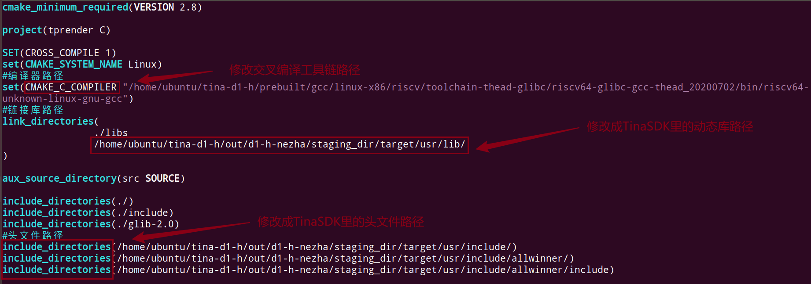
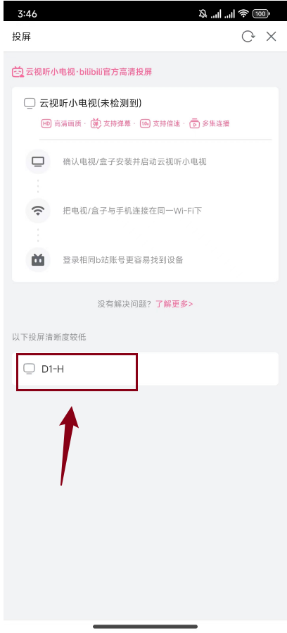

# WIFI投屏

参考[哪吒D1编译配置DLNA客户端进行B站投屏 / 全志 SOC / WhyCan Forum(哇酷开发者社区)](https://whycan.com/p_97704.html)实现wifi投屏功能。

## 1. 常见的投屏协议

实现该功能前，可以了解一下常见的投屏协议主要包括以下几种：

1. **AirPlay**：由苹果公司开发的无线显示协议，允许将iPhone、iPad或Mac的屏幕内容投屏到Apple TV或支持AirPlay的Android电视盒子上。AirPlay支持镜像模式和流模式两种工作方式。
2. **Miracast**：由Wi-Fi联盟制定的Wi-Fi投屏行业标准，基于Wi-Fi Direct技术，可以在Android 4.2及以上版本和Windows 8.1或Windows 10系统中使用，实现无线连接和数据传输。
3. **DLNA**：由数字生活网络联盟（Digital Living Network Alliance）创建的投屏协议，基于UPnP协议，主要用于在设备之间共享多媒体内容。DLNA不是无线显示解决方案，而是在一台设备上获取内容并在另一台设备上播放的方法。
4. **Chromecast**：由谷歌开发的无线投屏技术，与AirPlay相比，Chromecast的体验更接近于DLNA。
5. **WiDi**：支持Windows 10笔记本的无线投屏方式，无需安装软件即可实现无线投屏。

## 2. 配置DLNA客户端

DLNA客户端可以接收并播放以DLNA协议推送的流媒体，而B站可以将视频通过DLNA协议来推送。
所以需要给D1h开发板配置DLNA客户端，就可以在同一网络下实现B站投屏了。

> **故事情节：**
>
> 有个博主使用`gmrender-resurrect`用来做DLNA客户端。
> `gmrender-resurrect`是基于 GStreamer 框架开发的项目，专门用于实现 DLNA/UPnP-AV 媒体播放功能。
> GStreamer是一个全面的多媒体框架，提供了一整套工具和组件来处理各种媒体任务。
> 但是博主发现使用GStreamer来解码B站投屏的视频会出现闪屏和不能自动硬件缩放问题。
> 于是就对`gmrender-resurrect`进行了魔改，把GStreamer 改成了tina自带的tplayer来播放视频。
> `gmrender-resurrect`自此便成了`tprender`。

在tina的package里面没有相关的库，下面将手动交叉编译`tprender`和DLNA的底层upnp库。

### 2.1 获取源码资料

我们百问网提供了相应的源码和补丁：https://github.com/DongshanPI/DongshannezhaSTU_DLNA_ScreenProjection.git

进入ubuntu，把源码克隆下来：

~~~bash
ubuntu@ubuntu1804:~$ git clone https://github.com/DongshanPI/DongshannezhaSTU_DLNA_ScreenProjection.git
ubuntu@ubuntu1804:~$ tree DongshannezhaSTU_DLNA_ScreenProjection -L 1
DongshannezhaSTU_DLNA_ScreenProjection
├── libupnp-1.14.12
├── README.md
└── tprender

2 directories, 1 file
~~~

在交叉编译源码之前，先把补丁也克隆下来：

~~~bash
ubuntu@ubuntu1804:~$ git clone https://github.com/DongshanPI/Tina-sdk_dongshannezhastu
ubuntu@ubuntu1804:~$ tree Tina-sdk_dongshannezhastu -L 1
Tina-sdk_dongshannezhastu
├── config_gstreamer
├── device
├── package
├── README.md
└── target

3 directories, 2 files
ubuntu@ubuntu1804:~$ cd tina-d1-h/
ubuntu@ubuntu1804:~/tina-d1-h$ source build/envsetup.sh 
Setup env done! Please run lunch next.
ubuntu@ubuntu1804:~/tina-d1-h$ lunch

You're building on Linux

Lunch menu... pick a combo:
     1. d1-h_nezha_min-tina
     2. d1-h_nezha-tina
     3. d1s_nezha-tina

Which would you like? [Default d1-h_nezha]: 2
============================================
TINA_BUILD_TOP=/home/ubuntu/tina-d1-h
TINA_TARGET_ARCH=riscv
TARGET_PRODUCT=d1-h_nezha
TARGET_PLATFORM=d1-h
TARGET_BOARD=d1-h-nezha
TARGET_PLAN=nezha
TARGET_BUILD_VARIANT=tina
TARGET_BUILD_TYPE=release
TARGET_KERNEL_VERSION=5.4
TARGET_UBOOT=u-boot-2018
TARGET_CHIP=sun20iw1p1
============================================
clean buildserver
[2] 90293
ubuntu@ubuntu1804:~/tina-d1-h$ rm .config
ubuntu@ubuntu1804:~/tina-d1-h$ rm out/ -rf
ubuntu@ubuntu1804:~/tina-d1-h$ cp ../Tina-sdk_dongshannezhastu/* -rfvd ./
~~~

如果执行了`rm .config`和`rm out/ -rf`，后续烧录系统需要wifi功能，就得重新根据之前的文章`重新配置`wifi功能。

拷贝完成后，执行：

~~~bash
ubuntu@ubuntu1804:~/tina-d1-h$ cp config_gstreamer.txt .config
ubuntu@ubuntu1804:~/tina-d1-h$ make
~~~

编译完成后，记得进行打包`pack`操作：

~~~bash
ubuntu@ubuntu1804:~/tina-d1-h$ pack
~~~

否则out/无法更新。就会影响到`tprender`的编译。

### 2.2 交叉编译

新建一个终端，进入`DongshannezhaSTU_DLNA_ScreenProjection`目录。

配置临时交叉编译环境变量：

~~~bash
ubuntu@ubuntu1804:~/DongshannezhaSTU_DLNA_ScreenProjection$ export PATH=$PATH:/home/ubuntu/tina-d1-h/prebuilt/gcc/linux-x86/riscv/toolchain-thead-glibc/riscv64-glibc-gcc-thead_20200702/bin
ubuntu@ubuntu1804:~/DongshannezhaSTU_DLNA_ScreenProjection$ cd libupnp-1.14.12/
ubuntu@ubuntu1804:~/DongshannezhaSTU_DLNA_ScreenProjection/libupnp-1.14.12$ ./configure --host=riscv64-unknown-linux-gnu
ubuntu@ubuntu1804:~/DongshannezhaSTU_DLNA_ScreenProjection/libupnp-1.14.12$ make
ubuntu@ubuntu1804:~/DongshannezhaSTU_DLNA_ScreenProjection/libupnp-1.14.12$ mkdir tmp
ubuntu@ubuntu1804:~/DongshannezhaSTU_DLNA_ScreenProjection/libupnp-1.14.12$ make install DESTDIR=$(pwd)/tmp/
ubuntu@ubuntu1804:~/DongshannezhaSTU_DLNA_ScreenProjection/libupnp-1.14.12$ ls -lh tmp/usr/local/lib
total 8.4M
-rw-r--r-- 1 ubuntu ubuntu 1.1M Jun 20 23:34 libixml.a
-rwxr-xr-x 1 ubuntu ubuntu  929 Jun 20 23:34 libixml.la
lrwxrwxrwx 1 ubuntu ubuntu   17 Jun 20 23:34 libixml.so -> libixml.so.11.1.2
lrwxrwxrwx 1 ubuntu ubuntu   17 Jun 20 23:34 libixml.so.11 -> libixml.so.11.1.2
-rwxr-xr-x 1 ubuntu ubuntu 205K Jun 20 23:34 libixml.so.11.1.2
-rw-r--r-- 1 ubuntu ubuntu 6.0M Jun 20 23:34 libupnp.a
-rwxr-xr-x 1 ubuntu ubuntu  955 Jun 20 23:34 libupnp.la
lrwxrwxrwx 1 ubuntu ubuntu   17 Jun 20 23:34 libupnp.so -> libupnp.so.17.1.3
lrwxrwxrwx 1 ubuntu ubuntu   17 Jun 20 23:34 libupnp.so.17 -> libupnp.so.17.1.3
-rwxr-xr-x 1 ubuntu ubuntu 1.2M Jun 20 23:34 libupnp.so.17.1.3
drwxrwxr-x 2 ubuntu ubuntu 4.0K Jun 20 23:34 pkgconfig
ubuntu@ubuntu1804:~/DongshannezhaSTU_DLNA_ScreenProjection/libupnp-1.14.12$ 
~~~

就可以在当前的tmp/目录下得到相应的动态库。

进入tprender/目录：

~~~bash
ubuntu@ubuntu1804:~/DongshannezhaSTU_DLNA_ScreenProjection/libupnp-1.14.12$ cd ../tprender/
ubuntu@ubuntu1804:~/DongshannezhaSTU_DLNA_ScreenProjection/tprender$ cp ../libupnp-1.14.12/tmp/usr/local/lib/libixml.so.11.1.2 libs/libixml.so
ubuntu@ubuntu1804:~/DongshannezhaSTU_DLNA_ScreenProjection/tprender$ cp ../libupnp-1.14.12/tmp/usr/local/lib/libixml.so.11.1.2 libs/libixml.so.11
ubuntu@ubuntu1804:~/DongshannezhaSTU_DLNA_ScreenProjection/tprender$ cp ../libupnp-1.14.12/tmp/usr/local/lib/libupnp.so.17.1.3 libs/libupnp.so
ubuntu@ubuntu1804:~/DongshannezhaSTU_DLNA_ScreenProjection/tprender$ cp ../libupnp-1.14.12/tmp/usr/local/lib/libupnp.so.17.1.3 libs/libupnp.so.17
~~~

修改CMakeLists.txt：

~~~bash
ubuntu@ubuntu1804:~/DongshannezhaSTU_DLNA_ScreenProjection/tprender$ gedit CMakeLists.txt
~~~

保存退出，编译即可得到可执行程序`tprender`：

~~~bash
ubuntu@ubuntu1804:~/DongshannezhaSTU_DLNA_ScreenProjection/tprender$ rm -rf CMakeFiles cmake_install.cmake  CMakeCache.txt tags
ubuntu@ubuntu1804:~/DongshannezhaSTU_DLNA_ScreenProjection/tprender$ cmake .
ubuntu@ubuntu1804:~/DongshannezhaSTU_DLNA_ScreenProjection/tprender$ make 
ubuntu@ubuntu1804:~/DongshannezhaSTU_DLNA_ScreenProjection/tprender$ file tprender
tprender: ELF 64-bit LSB executable, UCB RISC-V, version 1 (SYSV), dynamically linked, interpreter /lib/ld-linux-riscv64xthead-lp64d.so.1, for GNU/Linux 4.15.0, with debug_info, not stripped
ubuntu@ubuntu1804:~/DongshannezhaSTU_DLNA_ScreenProjection/tprender$ 
~~~

## 3. 测试投屏功能

扫描附近wifi：

~~~bash
root@TinaLinux:/# wifi_scan_results_test

*********************************
***Start scan!***
*********************************
bssid / frequency / signal level / flags / ssid
94:d9:b3:b7:c9:0a       2442    -36     [WPA-PSK-CCMP+TKIP][WPA2-PSK-CCMP+TKIP][ESS]    Programmers
d6:84:09:1e:9b:95       2412    -59     [WPA-PSK-CCMP][WPA2-PSK-CCMP][ESS]      Guest_An
d4:84:09:1d:9b:95       2412    -61     [WPA-PSK-CCMP][WPA2-PSK-CCMP][ESS]      Voform
4a:0e:ec:50:95:83       2437    -62     [WPA-PSK-CCMP][WPA2-PSK-CCMP][ESS]      1415\xe5\xa4\x87\xe7\x94\xa8
48:0e:ec:50:95:83       2437    -66     [WPA-PSK-CCMP][WPA2-PSK-CCMP][ESS]      A1415
f0:92:b4:a6:03:91       2452    -38     [WPA-PSK-CCMP+TKIP][WPA2-PSK-CCMP+TKIP][ESS]    ChinaNet-kRAH
a4:a9:30:ba:83:16       2457    -51     [WPA2-PSK-CCMP][WPS][ESS]       wifi1
1c:68:7e:bc:25:0a       2412    -58     [WPA-PSK-CCMP][WPA2-PSK-CCMP][ESS]      \xe9\xa1\xba\xe6\x88\x90\xe5\x8a\xb3\xe5\x8a\xa1
34:12:f9:87:a6:48       2427    -61     [WPA2-PSK-CCMP][WPS][ESS]       Redmi_83D1
34:12:f9:87:a6:49       2427    -62     [WPA2-PSK-CCMP][ESS]    \x00\x00\x00\x00\x00\x00\x00\x00\x00\x00\x00\x00\x00\x00\x00\x00\x00\x00\x00\x00\x00\x00\x00\x00\x00\x00\x00\x00\x00\x00\x00\x00
a4:39:b3:73:ac:74       2427    -63     [WPA2-PSK-CCMP][WPS][ESS]       Redmi_83D1
b4:77:48:a7:52:45       2437    -63     [WPA2-PSK-CCMP][ESS]    VANTEN
98:0d:51:10:78:31       2437    -70     [WPA2-PSK-CCMP][WPS][ESS]
aa:a9:30:ba:83:16       2457    -61     [ESS]
a6:39:b3:63:ac:74       2427    -62     [ESS]
******************************
Wifi get_scan_results: Success!
******************************
root@TinaLinux:/#
~~~

在这里准备用手机的B站来进行投屏，开发板需要连接和手机同一个wifi：

~~~bash
root@TinaLinux:/# wifi_connect_ap_test <wifi名> <wifi密码>
root@TinaLinux:/# ifconfig
br-lan    Link encap:Ethernet  HWaddr 46:6C:D2:EA:24:03
          inet addr:192.168.100.100  Bcast:192.168.100.255  Mask:255.255.255.0
          inet6 addr: fd18:7ee6:608a::1/60 Scope:Global
          UP BROADCAST MULTICAST  MTU:1500  Metric:1
          RX packets:0 errors:0 dropped:0 overruns:0 frame:0
          TX packets:0 errors:0 dropped:0 overruns:0 carrier:0
          collisions:0 txqueuelen:1000
          RX bytes:0 (0.0 B)  TX bytes:0 (0.0 B)

lo        Link encap:Local Loopback
          inet addr:127.0.0.1  Mask:255.0.0.0
          inet6 addr: ::1/128 Scope:Host
          UP LOOPBACK RUNNING  MTU:65536  Metric:1
          RX packets:3 errors:0 dropped:0 overruns:0 frame:0
          TX packets:3 errors:0 dropped:0 overruns:0 carrier:0
          collisions:0 txqueuelen:1000
          RX bytes:108 (108.0 B)  TX bytes:108 (108.0 B)

wlan0     Link encap:Ethernet  HWaddr 00:65:D8:1D:B6:8E
          inet addr:192.168.0.127  Bcast:192.168.0.255  Mask:255.255.255.0
          inet6 addr: fe80::265:d8ff:fe1d:b68e/64 Scope:Link
          UP BROADCAST RUNNING MULTICAST  MTU:1500  Metric:1
          RX packets:103820 errors:0 dropped:0 overruns:0 frame:0
          TX packets:18352 errors:0 dropped:0 overruns:0 carrier:0
          collisions:0 txqueuelen:1000
          RX bytes:69417258 (66.2 MiB)  TX bytes:3751190 (3.5 MiB)

root@TinaLinux:/#
~~~

连接成功后，wlan0节点会有ip地址。测试wifi功能：

~~~bash
root@TinaLinux:/# ping www.baidu.com
PING www.baidu.com (183.2.172.185): 56 data bytes
64 bytes from 183.2.172.185: seq=0 ttl=52 time=13.684 ms
64 bytes from 183.2.172.185: seq=1 ttl=52 time=18.239 ms
64 bytes from 183.2.172.185: seq=2 ttl=52 time=14.803 ms
^C
--- www.baidu.com ping statistics ---
3 packets transmitted, 3 packets received, 0% packet loss
round-trip min/avg/max = 13.684/15.575/18.239 ms
root@TinaLinux:/#
~~~

在ubuntu上，推送`可执行程序`与`动态库`到D1h开发板：

~~~bash
ubuntu@ubuntu1804:~/DongshannezhaSTU_DLNA_ScreenProjection/tprender$ adb push libs/ tprender /root/
libs/: 4 files pushed. 1.4 MB/s (2738288 bytes in 1.887s)
tprender: 1 file pushed. 1.3 MB/s (116984 bytes in 0.087s)
5 files pushed. 1.3 MB/s (2855272 bytes in 2.143s)
ubuntu@ubuntu1804:~/DongshannezhaSTU_DLNA_ScreenProjection/tprender$
~~~

开发板上进入/root目录，执行：

~~~bash
root@TinaLinux:~# ./tprender -f "D1-H"
WARNING: awplayer <cdx_log_set_level:30>: cdx Set log level to 6
INFO   : cedarc <CedarPluginVDInit:79>: register h264 decoder success!
INFO   : cedarc <CedarPluginVDInit:84>: register mjpeg decoder success!
INFO   : cedarc <CedarPluginVDInit:86>: register mpeg2 decoder success!
INFO   : cedarc <CedarPluginVDInit:92>: register mpeg4dx decoder success!
INFO   : cedarc <CedarPluginVDInit:79>: register mpeg4H263 decoder success!
INFO   : cedarc <CedarPluginVDInit:90>: register mpeg4Normal decoder success!
INFO   : cedarc <CedarPluginVDInit:74>: register vc1 decoder success!
INFO   : cedarc <CedarPluginVDInit:85>: register h265 decoder success!
gmrender-resurrect started [ gmediarender 0.0.9 (libupnp-1.14.10; glib-2.50.1; withou[14742.072053] [SNDCODEC][sunxi_card_hw_params][620]:stream_flag: 0
t gstreamer.) ].
Logging switched off. Enable with --logfile=<filename> (or --logfile=stdout for console)

>>>>>>>>>>>>>>>>>>>>>>>>>>>>>>> tina_multimedia <<<<<<<<<<<<<<<<<<<<<<<<<<<<<<<
tag   : tina3.5
branch: tina-dev
date  : Mon Jul 15 19:04:59 2019 +0800
Change-Id: I5f6c8a88d7b387a312b7744797a0d5f8ab07ee7a
-------------------------------------------------------------------------------
xplayer:process message XPLAYER_COMMAND_SET_AUDIOSINK.
xplayer:process message XPLAYER_COMMAND_SET_SURFACE.
xplayer:process message XPLAYER_COMMAND_SET_SUBCTRL.
xplayer:process message XPLAYER_COMMAND_SET_DI.
dd: writing '/dev/fb0': No space left on device
32401+0 records in
32400+0 records out
ERROR [2024-06-21 15:45:10.824354 | webserver] Could not stat './/grender-64x64.png': No such file or directory
ERROR [2024-06-21 15:45:10.824939 | webserver] Could not stat './/grender-128x128.png': No such file or directory
output_set_volume
Ready for rendering.
~~~

打开手机B站APP，在投屏功能上就可以看见`D1-H`这个设备了：

点击`D1-H`即可在hdmi屏幕上进行wifi投屏了。