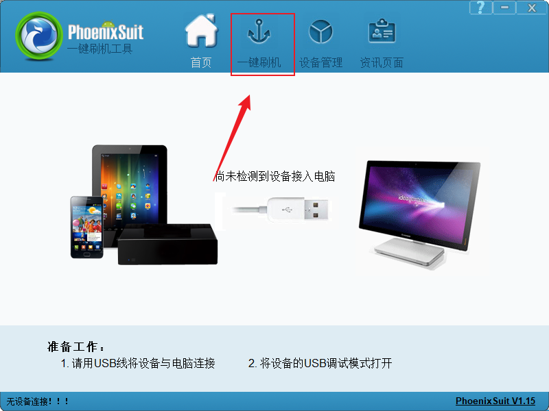
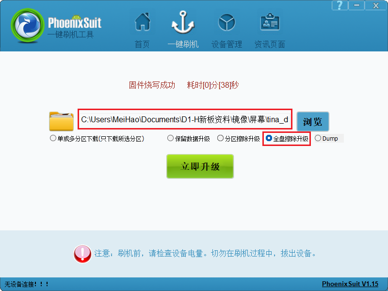
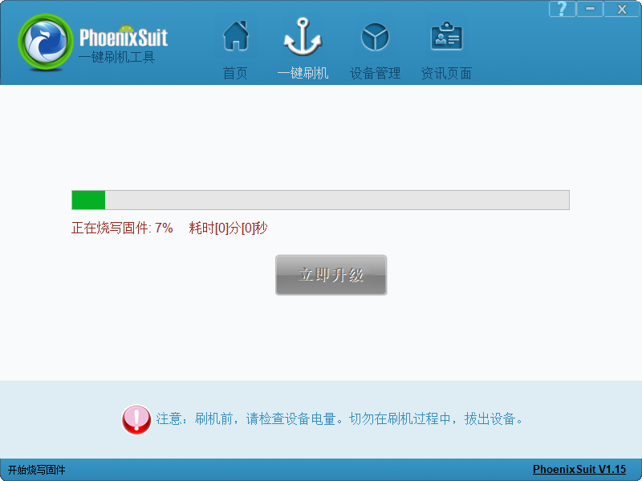

# 开发环境搭建

## 获取TinaSDK源码

Tina-SDKV2.0源码网盘链接：https://pan.baidu.com/s/13uKlqDXImmMl9cgKc41tZg?pwd=qcw7

上传到ubuntu，创建文件夹用来保存源码：

~~~bash
ubuntu@ubuntu1804:~$ mkdir Tina_SDK
ubuntu@ubuntu1804:~$ cd Tina_SDK/
ubuntu@ubuntu1804:~/Tina_SDK$ tree -L 1
.
├── tina-d1-h.tar.bz2.00
├── tina-d1-h.tar.bz2.01
├── tina-d1-h.tar.bz2.02
├── tina-d1-h.tar.bz2.03
├── tina-d1-h.tar.bz2.04
├── tina-d1-h.tar.bz2.05
├── tina-d1-h.tar.bz2.06
├── tina-d1-h.tar.bz2.07
└── tina-d1-h.tar.bz2.08

0 directories, 9 files
~~~

查看所有文件MD5校验值：

~~~bash
ubuntu@ubuntu1804:~/Tina_SDK$ md5sum tina-d1-h.tar.bz2.*
e755bae00cd76afc3fb276b4e3fd86ba  tina-d1-h.tar.bz2.00
cb60ecfdb51c624ff3cbd7b24552866f  tina-d1-h.tar.bz2.01
54e56a4cf1cef46ca0a94b85ea1d33a1  tina-d1-h.tar.bz2.02
4988fa08827c0f7af2dc170145e24b26  tina-d1-h.tar.bz2.03
a0463bcf8e73db27b5ecafaac593a919  tina-d1-h.tar.bz2.04
a87382ca16a8c12b3a94f1cad99ce77e  tina-d1-h.tar.bz2.05
5973530baa3b282108351818641c27fd  tina-d1-h.tar.bz2.06
ccd63e1d16534b364a101d2d44416261  tina-d1-h.tar.bz2.07
e0d72713565f4424ea43c07e15a38139  tina-d1-h.tar.bz2.08
~~~

确保校验值对上。否则需要重新上传。

解压源码：

~~~bash
ubuntu@ubuntu1804:~/Tina_SDK$ cat tina-d1-h.tar.bz2.* | tar -jxv
~~~

等待一段时间，即可解压完成。

~~~bash
ubuntu@ubuntu1804:~/Tina_SDK$ tree -L 1
.
├── tina-d1-h
├── tina-d1-h.tar.bz2.00
├── tina-d1-h.tar.bz2.01
├── tina-d1-h.tar.bz2.02
├── tina-d1-h.tar.bz2.03
├── tina-d1-h.tar.bz2.04
├── tina-d1-h.tar.bz2.05
├── tina-d1-h.tar.bz2.06
├── tina-d1-h.tar.bz2.07
└── tina-d1-h.tar.bz2.08

1 directory, 9 files
ubuntu@ubuntu1804:~/Tina_SDK$ mv tina-d1-h ../
~~~

编译固件之前，先安装一些依赖，否则编译会报错：

~~~bash
sudo apt-get install build-essential subversion git libncurses5-dev zlib1g-dev gawk flex quilt libssl-dev xsltproc libxml-parser-perl mercurial bzr ecj cvs unzip lib32z1 lib32z1-dev lib32stdc++6 libstdc++6 libc6:i386 libstdc++6:i386 lib32ncurses5 lib32z1 -y
~~~

## 编译出固件

进入源码目录，执行`source build/envsetup.sh`、`lunch`之后，选择`2`：

~~~bash
ubuntu@ubuntu1804:~/tina-d1-h$ source build/envsetup.sh 
Setup env done! Please run lunch next.
ubuntu@ubuntu1804:~/tina-d1-h$ lunch

You're building on Linux

Lunch menu... pick a combo:
     1. d1-h_nezha_min-tina
     2. d1-h_nezha-tina
     3. d1s_cvbs-tina
     4. d1s_nezha-tina
     5. t113_100ask_devkit-tina
     6. t113_100ask-tina

Which would you like? [Default d1s_nezha]: 2
============================================
TINA_BUILD_TOP=/home/ubuntu/tina-d1-h
TINA_TARGET_ARCH=riscv
TARGET_PRODUCT=d1-h_nezha
TARGET_PLATFORM=d1-h
TARGET_BOARD=d1-h-nezha
TARGET_PLAN=nezha
TARGET_BUILD_VARIANT=tina
TARGET_BUILD_TYPE=release
TARGET_KERNEL_VERSION=5.4
TARGET_UBOOT=u-boot-2018
TARGET_CHIP=sun20iw1p1
============================================
no buildserver to clean
[1] 66670
ubuntu@ubuntu1804:~/tina-d1-h$ 
~~~

接着`make`编译、`pack`打包：

~~~bash
ubuntu@ubuntu1804:~/tina-d1-h$ make
...
make[5]: Leaving directory '/home/ubuntu/tina-d1-h/target/allwinner/generic/image'
make[4]: Leaving directory '/home/ubuntu/tina-d1-h/target/allwinner/d1-h-nezha'
make[3]: Leaving directory '/home/ubuntu/tina-d1-h/target/allwinner'
make[2]: Leaving directory '/home/ubuntu/tina-d1-h'
export MAKEFLAGS= ;make -w -r package/index
make[2]: Entering directory '/home/ubuntu/tina-d1-h'
Generating package index...
Signing key has not been configured
make[2]: Leaving directory '/home/ubuntu/tina-d1-h'
make[1]: Leaving directory '/home/ubuntu/tina-d1-h'
[2]+  Done                    $T/tools/build/buildserver --path $T 2> /dev/null 1>&2

#### make completed successfully (15:50 (mm:ss)) ####

ubuntu@ubuntu1804:~/tina-d1-h$ 
ubuntu@ubuntu1804:~/tina-d1-h$ ls
build   Config.in  dl      logs      out      prebuilt   rules.mk  target  toolchain
config  device     lichee  Makefile  package  README.md  scripts   tmp     tools
ubuntu@ubuntu1804:~/tina-d1-h$ pack
--==========--
PACK_CHIP         sun20iw1p1
PACK_PLATFORM     tina
PACK_BOARD        d1-h-nezha
PACK_KERN        
PACK_DEBUG        uart0
PACK_SIG          none
PACK_SECURE       none
PACK_MODE         normal
PACK_FUNC         android
PACK_PROGRAMMER   none
PACK_TAR_IMAGE    none
PACK_TOPDIR       /home/ubuntu/tina-d1-h
--==========--
No kernel param, parse it from d1-h
copying tools file
copying configs file
storage_type value is 5
rm /home/ubuntu/tina-d1-h/out/d1-h-nezha/image/sys_partition_nor.fex
rm /home/ubuntu/tina-d1-h/out/d1-h-nezha/image/image_nor.cfg
copying boot resource

LZMA 4.65 : Igor Pavlov : Public domain : 2009-02-03
copying boot file
make user resource for : /home/ubuntu/tina-d1-h/out/d1-h-nezha/image/sys_partition.fex
handle partition user-res
no user resource partitions
APP_PART_DOWNLOAD_FILE = /home/ubuntu/tina-d1-h/out/d1-h-nezha/image/app.fex
Need size of filesystem
no data resource partitions
don't build dtbo ...
update_chip
pack boot package
GetPrivateProfileSection read to end
content_count=3
LICHEE_REDUNDANT_ENV_SIZE config in BoardConfig.mk
--mkenvimage create redundant env data!--
---redundant env data size 0x20000---
packing for tina linux
normal
mbr count = 4

partitation file Path=/home/ubuntu/tina-d1-h/out/d1-h-nezha/image/sys_partition.bin
mbr_name file Path=/home/ubuntu/tina-d1-h/out/d1-h-nezha/image/sunxi_mbr.fex
download_name file Path=/home/ubuntu/tina-d1-h/out/d1-h-nezha/image/dlinfo.fex

mbr size = 252
mbr magic softw411
disk name=boot-resource
disk name=env
disk name=env-redund
disk name=boot
disk name=rootfs
disk name=dsp0
disk name=recovery
this is not a partition key
update_for_part_info 0
crc 0 = 4c7bc2df
crc 1 = d9c69382
crc 2 = bc706624
crc 3 = 29cd3779
gpt_head->header_crc32 = 0x892c53ba
GPT----part num 8---
gpt_entry: 128
gpt_header: 92
GPT:boot-resource: a1f8          c177        
GPT:env         : c178          c36f        
GPT:env-redund  : c370          c567        
GPT:boot        : c568          1161f       
GPT:rootfs      : 11620         1b597       
GPT:dsp0        : 1b598         1b987       
GPT:recovery    : 1b988         227c7       
GPT:UDISK       : 227c8         ffffffde    
update gpt file ok
update mbr file ok
temp = 20
mbr count = 4 total_sectors = 15269888 logic_offset = 40960

partitation file Path=/home/ubuntu/tina-d1-h/out/d1-h-nezha/image/sys_partition.bin
mbr_name file Path=/home/ubuntu/tina-d1-h/out/d1-h-nezha/image/sunxi_mbr.fex
download_name file Path=/home/ubuntu/tina-d1-h/out/d1-h-nezha/image/dlinfo.fex

mbr size = 252
mbr magic softw411
disk name=boot-resource
disk name=env
disk name=env-redund
disk name=boot
disk name=rootfs
disk name=dsp0
disk name=recovery
this is not a partition key
update_for_part_info 0
crc 0 = 4c7bc2df
crc 1 = d9c69382
crc 2 = bc706624
crc 3 = 29cd3779
gpt_head->header_crc32 = 0x1328fa28
GPT----part num 8---
gpt_entry: 128
gpt_header: 92
GPT:boot-resource: a1f8          c177        
GPT:env         : c178          c36f        
GPT:env-redund  : c370          c567        
GPT:boot        : c568          1161f       
GPT:rootfs      : 11620         1b597       
GPT:dsp0        : 1b598         1b987       
GPT:recovery    : 1b988         227c7       
GPT:UDISK       : 227c8         e8ffde      
update gpt file ok
update mbr file ok
====================================
show "sys_partition_for_dragon.fex" message
------------------------------------
  [mbr]
  mbr_size  : 252 Kbyte
------------------------------------
  partition_name  : boot-resource
  partition_size  : 8064
  downloadfile  : boot-resource.fex
  boot-resource.fex size : 3.0M byte
------------------------------------
  partition_name  : env
  partition_size  : 504
  downloadfile  : env.fex
  env.fex size : 128K byte
------------------------------------
  partition_name  : env-redund
  partition_size  : 504
  downloadfile  : env.fex
  env.fex size : 128K byte
------------------------------------
  partition_name  : boot
  partition_size  : 20664
  downloadfile  : boot.fex
  boot.fex -> /home/ubuntu/tina-d1-h/out/d1-h-nezha/boot.img
  boot.img size : 5.0M byte
------------------------------------
  partition_name  : rootfs
  partition_size  : 40824
  downloadfile  : rootfs.fex
  rootfs.fex -> /home/ubuntu/tina-d1-h/out/d1-h-nezha/rootfs.img
  rootfs.img size : 16M byte
------------------------------------
  partition_name  : dsp0
  partition_size  : 1008
  downloadfile  : dsp0.fex
  dsp0.fex size : 249K byte
------------------------------------
  partition_name  : recovery
  partition_size  : 28224
------------------------------------
/home/ubuntu/tina-d1-h/out/host/bin/
/home/ubuntu/tina-d1-h/out/d1-h-nezha/image
Begin Parse sys_partion.fex
Add partion boot-resource.fex BOOT-RESOURCE_FEX
Add partion very boot-resource.fex BOOT-RESOURCE_FEX
FilePath: boot-resource.fex
FileLength=2f8c00Add partion env.fex ENV_FEX000000000
Add partion very env.fex ENV_FEX000000000
FilePath: env.fex
FileLength=20000Add partion env.fex ENV_FEX000000000
Add partion very env.fex ENV_FEX000000000
FilePath: env.fex
FileLength=20000Add partion boot.fex BOOT_FEX00000000
Add partion very boot.fex BOOT_FEX00000000
FilePath: boot.fex
FileLength=4f4000Add partion rootfs.fex ROOTFS_FEX000000
Add partion very rootfs.fex ROOTFS_FEX000000
FilePath: rootfs.fex
FileLength=fc0000Add partion dsp0.fex DSP0_FEX00000000
Add partion very dsp0.fex DSP0_FEX00000000
FilePath: dsp0.fex
FileLength=3e38cBuildImg 0
Dragon execute image.cfg SUCCESS !
----------image is for nand/emmc----------
----------image is at----------

/home/ubuntu/tina-d1-h/out/d1-h-nezha/tina_d1-h-nezha_uart0.img

pack finish
~~~

打包成功后，镜像文件保存在`/home/ubuntu/tina-d1-h/out/d1-h-nezha/tina_d1-h-nezha_uart0.img`

## 烧录固件

把镜像文件传到PC端，打开全志线刷工具 **AllwinnertechPhoeniSuit**，找到**PhoenixSuit.exe** ，双击运行：

选择`一键刷机`:

找到镜像路径，选择全盘擦除升级：

选择好之后，不需要其他界面操作，这时拿起已经连接好的开发板，先按住 **FEL** 烧写模式按键，之后按一下 **RESET** 系统复位键，就可以自动进入烧写模式并开始烧写。

串口打印信息，如下：

~~~bash
[53]HELLO! BOOT0 is starting!
[56]BOOT0 commit : 88480af
[58]set pll start
[60]periph0 has been enabled
[63]set pll end
[64][pmu]: bus read error
[67]board init ok
[69]get_pmu_exist() = -1
[71]DRAM BOOT DRIVE INFO: V0.33
[74]DRAM CLK = 792 MHz
[76]DRAM Type = 3 (2:DDR2,3:DDR3)
[79]DRAMC ZQ value: 0x7b7bfb
[82]DRAM ODT value: 0x42.
[84]ddr_efuse_type: 0x0
[87]DRAM SIZE =512 M
[89]dram_tpr4:0x0
[91]PLL_DDR_CTRL_REG:0xf8004100
[94]DRAM_CLK_REG:0xc0000000
[96][TIMING DEBUG] MR2= 0x18
[100]DRAM simple test OK.
[103]dram size =512
[105]spinand UBOOT_START_BLK_NUM 8 UBOOT_LAST_BLK_NUM 32
[110]block from 8 to 32
[165]Check is correct.
[167]dma 0x301a8 int is not used yet
[171]dma 0x301a8 int is free, you do not need to free it again
[176]Entry_name        = opensbi
[179]Entry_name        = u-boot
[183]Entry_name        = dtb
[186]Jump to second Boot.

OpenSBI auto-t113-linux-V0.8-2-g053d088
   ____                    _____ ____ _____
  / __ \                  / ____|  _ \_   _|
 | |  | |_ __   ___ _ __ | (___ | |_) || |
 | |  | | '_ \ / _ \ '_ \ \___ \|  _ < | |
 | |__| | |_) |  __/ | | |____) | |_) || |_
  \____/| .__/ \___|_| |_|_____/|____/_____|
        | |
        |_|

Platform Name          : T-HEAD Xuantie Platform
Platform HART Features : RV64ACDFIMSUVX
Platform Max HARTs     : 1
Current Hart           : 0
Firmware Base          : 0x41fc0400
Firmware Size          : 75 KB
Runtime SBI Version    : 0.2

MIDELEG : 0x0000000000000222
MEDELEG : 0x000000000000b1ff
PMP0    : 0x0000000041fc0000-0x0000000041fdffff (A)
PMP1    : 0x0000000040000000-0x000000007fffffff (A,R,W,X)
PMP2    : 0x0000000080000000-0x00000000bfffffff (A,R,W,X)
PMP3    : 0x0000000000020000-0x0000000000027fff (A,▒

U-Boot 2018.05-g24521d6-dirty (Jun 25 2024 - 02:56:26 -0400) Allwinner Technology

[00.271]DRAM:  512 MiB
[00.273]Relocation Offset is: 1dee9000
[00.277]secure enable bit: 0
[00.280]CPU=1008 MHz,PLL6=600 Mhz,AHB=200 Mhz, APB1=100Mhz  MBus=300Mhz
[00.286]flash init start
[00.289]workmode = 0,storage type = 0
sspi->base_addr = 0x4025000, the SPI control register:
[VER] 0x4025000 = 0x00010001, [GCR] 0x4025004 = 0x00000083, [TCR] 0x4025008 = 0x00000184
[ICR] 0x4025010 = 0x00000f00, [ISR] 0x4025014 = 0x00000032, [FCR] 0x4025018 = 0x00200020
[FSR] 0x402501c = 0x00000000, [WCR] 0x4025020 = 0x00000000, [CCR] 0x4025024 = 0x00000002
[SDC] 0x4025028 = 0x00002000, [BCR] 0x4025030 = 0x00000000, [TCR] 0x4025034 = 0x00000000
[BCC] 0x4025038 = 0x20000000, [DMA] 0x4025088 = 0x000000e5

[00.336]sunxi-spinand-phy: not detect any munufacture from id table
[00.342]sunxi-spinand-phy: get spi-nand Model from fdt fail
[00.348]sunxi-spinand-phy: get phy info from fdt fail

device nand0 <nand>, # parts = 4
 #: name                size            offset          mask_flags
 0: boot0               0x00100000      0x00000000      1
 1: uboot               0x00300000      0x00100000      1
 2: secure_storage      0x00100000      0x00400000      1
 3: sys                 0x07b00000      0x00500000      0

active partition: nand0,0 - (boot0) 0x00100000 @ 0x00000000

defaults:
mtdids  : nand0=nand
mtdparts: mtdparts=nand:1024k@0(boot0)ro,3072k@1048576(uboot)ro,1024k@4194304(secure_storage)ro,-(sys)
[00.462]ubi0: attaching mtd4
[00.557]ubi0: scanning is finished
[00.563]ubi0: attached mtd4 (name "sys", size 123 MiB)
[00.568]ubi0: PEB size: 262144 bytes (256 KiB), LEB size: 258048 bytes
[00.574]ubi0: min./max. I/O unit sizes: 4096/4096, sub-page size 2048
[00.581]ubi0: VID header offset: 2048 (aligned 2048), data offset: 4096
[00.587]ubi0: good PEBs: 492, bad PEBs: 0, corrupted PEBs: 0
[00.592]ubi0: user volume: 10, internal volumes: 1, max. volumes count: 128
[00.599]ubi0: max/mean erase counter: 2/1, WL threshold: 4096, image sequence number: 0
[00.607]ubi0: available PEBs: 0, total reserved PEBs: 492, PEBs reserved for bad PEB handling: 20
[00.615]sunxi flash init ok
[00.618]line:703 init_clocks
[00.621]drv_disp_init
request pwm success, pwm0:pwm0:0x2000c00.
[00.638]drv_disp_init finish
[00.640]boot_gui_init:start
[00.643]set disp.dev2_output_type fail. using defval=0
[00.648]lcd_open_flow
[00.650]lcd_cfg_panel_info
[00.653]lcd_open_flow
[00.655]lcd_power_on
[00.680]boot_gui_init:finish
partno erro : can't find partition bootloader
[00.800]lcd_open_flow
[00.802] tft08006 drivers/video/sunxi/disp2/disp/lcd/tft08006.c lcd_panel_init 162
[00.809]lcd_panel_init
[01.283]lcd_open_flow
54 bytes read in 0 ms
[01.288]bmp_name=bootlogo.bmp size 1152054
[01.335]lcd_open_flow
[01.337]lcd_bl_open
FDT ERROR:fdt_get_all_pin:get property handle pinctrl-0 error:FDT_ERR_INTERNAL
sunxi_pwm_pin_set_state, fdt_set_all_pin, ret=-1
[01.350]lcd_open_flow
[01.353]lcd_open_flow
[01.355]LCD open finish
1152054 bytes read in 75 ms (14.6 MiB/s)
[01.491]Loading Environment from SUNXI_FLASH... OK
[01.512]out of usb burn from boot: not need burn key
[01.518]Item0 (Map) magic is bad
partno erro : can't find partition private
[01.544]update bootcmd
[01.556]change working_fdt 0x5eaa8da0 to 0x5ea88da0
No reserved memory region found in source FDT
[01.584]update dts
noncached_alloc(): addr = 0x5eca7080
noncached_alloc(): addr = 0x5eca70c0
noncached_alloc(): addr = 0x5eca7100
noncached_alloc(): addr = 0x5eca7940
phy_mode=rgmii, phy_interface=7
gmac: *** using ephy_clk ***
eth0
Warning: eth0 (eth0) using random MAC address - 62:2c:14:f8:ee:8c

Hit any key to stop autoboot:  0
dsp0:gpio init config fail
dsp0:sharespace config fail
dsp0 version is r528-tina-v1.0.0-release-37-g735b6b4-dirty
DSP0 start ok, img length 254860, booting from 0x400660
[01.901]no vendor_boot partition is found
Android's image name: d1-h-nezha
Detect comp gzip
[02.154]
Starting kernel ...

[    0.000000] Linux version 5.4.61 (ubuntu@ubuntu1804) (riscv64-unknown-linux-gnu-gcc (C-SKY RISCV Tools V1.8.4 B20200702) 8.1.0, GNU ld (GNU Binutils) 2.32) #50 PREEMPT Tue Jun 25 06:59:32 UTC 2024
[    0.000000] cma: Reserved 8 MiB at 0x000000005f800000
[    0.000000] Zone ranges:
[    0.000000]   DMA32    [mem 0x0000000040000000-0x000000005fffffff]
[    0.000000]   Normal   empty
[    0.000000] Movable zone start for each node
[    0.000000] Early memory node ranges
[    0.000000]   node   0: [mem 0x0000000040000000-0x000000005fffffff]
[    0.000000] Initmem setup node 0 [mem 0x0000000040000000-0x000000005fffffff]
[    0.000000] On node 0 totalpages: 131072
[    0.000000]   DMA32 zone: 1792 pages used for memmap
[    0.000000]   DMA32 zone: 0 pages reserved
[    0.000000]   DMA32 zone: 131072 pages, LIFO batch:31
[    0.000000] elf_hwcap is 0x20112d
[    0.000000] pcpu-alloc: s0 r0 d32768 u32768 alloc=1*32768
[    0.000000] pcpu-alloc: [0] 0
[    0.000000] Built 1 zonelists, mobility grouping on.  Total pages: 129280
[    0.000000] Kernel command line: ubi.mtd=sys ubi.block=0,rootfs earlyprintk=sunxi-uart,0x02500000 clk_ignore_unused initcall_debug=0 console=ttyS0,115200 loglevel=8 root=/dev/ubiblock0_5 rootfstype=squashfs init=/sbin/init partitions=mbr@ubi0_0:boot-resource@ubi0_1:env@ubi0_2:env-redund@ubi0_3:boot@ubi0_4:rootfs@ubi0_5:dsp0@ubi0_6:recovery@ubi0_7:rootfs_data@ubi0_8:UDISK@ubi0_9: cma=8M snum= mac_addr= wifi_mac= bt_mac= specialstr= gpt=1 androidboot.hardware=sun20iw1p1 boot_type=5 androidboot.boot_type=5 gpt=1 uboot_message=2018.05-g24521d
[    0.000000] Dentry cache hash table entries: 65536 (order: 7, 524288 bytes, linear)
[    0.000000] Inode-cache hash table entries: 32768 (order: 6, 262144 bytes, linear)
[    0.000000] Sorting __ex_table...
[    0.000000] mem auto-init: stack:off, heap alloc:off, heap free:off
[    0.000000] Memory: 495332K/524288K available (6406K kernel code, 663K rwdata, 2165K rodata, 184K init, 336K bss, 20764K reserved, 8192K cma-reserved)
[    0.000000] SLUB: HWalign=64, Order=0-3, MinObjects=0, CPUs=1, Nodes=1
[    0.000000] rcu: Preemptible hierarchical RCU implementation.
[    0.000000]  Tasks RCU enabled.
[    0.000000] rcu: RCU calculated value of scheduler-enlistment delay is 10 jiffies.
[    0.000000] NR_IRQS: 0, nr_irqs: 0, preallocated irqs: 0
[    0.000000] plic: mapped 200 interrupts with 1 handlers for 2 contexts.
[    0.000000] riscv_timer_init_dt: Registering clocksource cpuid [0] hartid [0]
[    0.000000] clocksource: riscv_clocksource: mask: 0xffffffffffffffff max_cycles: 0x588fe9dc0, max_idle_ns: 440795202592 ns
[    0.000006] sched_clock: 64 bits at 24MHz, resolution 41ns, wraps every 4398046511097ns
[    0.000022] riscv_timer_clockevent depends on broadcast, but no broadcast function available
[    0.000311] clocksource: timer: mask: 0xffffffff max_cycles: 0xffffffff, max_idle_ns: 79635851949 ns
[    0.000911] Console: colour dummy device 80x25
[    0.000948] Calibrating delay loop (skipped), value calculated using timer frequency.. 48.00 BogoMIPS (lpj=240000)
[    0.000965] pid_max: default: 32768 minimum: 301
[    0.001130] Mount-cache hash table entries: 1024 (order: 1, 8192 bytes, linear)
[    0.001150] Mountpoint-cache hash table entries: 1024 (order: 1, 8192 bytes, linear)
[    0.002696] ASID allocator initialised with 65536 entries
[    0.002847] rcu: Hierarchical SRCU implementation.
[    0.003453] devtmpfs: initialized
[    0.016485] random: get_random_u32 called from bucket_table_alloc.isra.31+0x4e/0x15e with crng_init=0
[    0.017399] clocksource: jiffies: mask: 0xffffffff max_cycles: 0xffffffff, max_idle_ns: 19112604462750000 ns
[    0.017429] futex hash table entries: 256 (order: 0, 6144 bytes, linear)
[    0.017813] pinctrl core: initialized pinctrl subsystem
[    0.019052] NET: Registered protocol family 16
[    0.020928] DMA: preallocated 256 KiB pool for atomic allocations
[    0.021517] cpuidle: using governor menu
[    0.063906] rtc_ccu: sunxi ccu init OK
[    0.072980] clock: sunxi ccu init OK
[    0.073776] clock: sunxi ccu init OK
[    0.102457] iommu: Default domain type: Translated
[    0.102628] sunxi iommu: irq = 4
[    0.103675] SCSI subsystem initialized
[    0.103996] usbcore: registered new interface driver usbfs
[    0.104089] usbcore: registered new interface driver hub
[    0.104190] usbcore: registered new device driver usb
[    0.104349] mc: Linux media interface: v0.10
[    0.104405] videodev: Linux video capture interface: v2.00
[    0.105459] sunxi-msgbox-amp 3003000.msgbox: invalid resource
[    0.106252] Advanced Linux Sound Architecture Driver Initialized.
[    0.106819] Bluetooth: Core ver 2.22
[    0.106894] NET: Registered protocol family 31
[    0.106905] Bluetooth: HCI device and connection manager initialized
[    0.106926] Bluetooth: HCI socket layer initialized
[    0.106940] Bluetooth: L2CAP socket layer initialized
[    0.106974] Bluetooth: SCO socket layer initialized
[    0.107245] pwm module init!
[    0.108757] g2d 5410000.g2d: Adding to iommu group 0
[    0.109209] G2D: rcq version initialized.major:250
[    0.109863] input: sunxi-keyboard as /devices/virtual/input/input0
[    0.111373] clocksource: Switched to clocksource riscv_clocksource
[    0.123010] sun8iw20-pinctrl 2000000.pinctrl: initialized sunXi PIO driver
[    0.137891] thermal_sys: Registered thermal governor 'user_space'
[    0.137897] thermal_sys: Registered thermal governor 'power_allocator'
[    0.138388] NET: Registered protocol family 2
[    0.139140] tcp_listen_portaddr_hash hash table entries: 256 (order: 0, 4096 bytes, linear)
[    0.139182] TCP established hash table entries: 4096 (order: 3, 32768 bytes, linear)
[    0.139241] TCP bind hash table entries: 4096 (order: 3, 32768 bytes, linear)
[    0.139288] TCP: Hash tables configured (established 4096 bind 4096)
[    0.139422] UDP hash table entries: 256 (order: 1, 8192 bytes, linear)
[    0.139460] UDP-Lite hash table entries: 256 (order: 1, 8192 bytes, linear)
[    0.139672] NET: Registered protocol family 1
[    0.140824] sun8iw20-pinctrl 2000000.pinctrl: 2000000.pinctrl supply vcc-pc not found, using dummy regulator
[    0.141366] spi spi0: spi0 supply spi not found, using dummy regulator
[    0.141679] sunxi_spi_resource_get()2151 - [spi0] SPI MASTER MODE
[    0.141740] sunxi_spi_resource_get()2189 - Failed to get sample mode
[    0.141752] sunxi_spi_resource_get()2194 - Failed to get sample delay
[    0.141762] sunxi_spi_resource_get()2198 - sample_mode:-1431633921 sample_delay:-1431633921
[    0.141818] sunxi_spi_clk_init()2240 - [spi0] mclk 100000000
[    0.142463] sunxi_spi_probe()2653 - [spi0]: driver probe succeed, base ffffffd004060000, irq 31
[    0.144302] Initialise system trusted keyrings
[    0.144493] workingset: timestamp_bits=62 max_order=17 bucket_order=0
[    0.151060] squashfs: version 4.0 (2009/01/31) Phillip Lougher
[    0.170468] Key type asymmetric registered
[    0.170482] Asymmetric key parser 'x509' registered
[    0.170504] io scheduler mq-deadline registered
[    0.170512] io scheduler kyber registered
[    0.170531] atomic64_test: passed
[    0.171741] [DISP]disp_module_init
[    0.172287] disp 5000000.disp: Adding to iommu group 0
[    0.172892] [DISP] disp_init,line:2386:
[    0.172898] smooth display screen:0 type:1 mode:4
[    0.207628] lcd_cfg_panel_info
[    0.207639] tft08006
[    0.207682] display_fb_request,fb_id:0
[    0.223221] Freeing logo buffer memory: 1500K
[    0.223650] disp_al_manager_apply ouput_type:1
[    0.223794] [DISP] lcd_clk_config,line:732:
[    0.223807] disp 0, clk: pll(300000000),clk(300000000),dclk(25000000) dsi_rate(25000000)
[    0.223807]      clk real:pll(300000000),clk(300000000),dclk(75000000) dsi_rate(150000000)
[    0.224184] sun8iw20-pinctrl 2000000.pinctrl: 2000000.pinctrl supply vcc-pb not found, using dummy regulator
[    0.224891] [DISP]disp_module_init finish
[    0.225740] sunxi_sid_init()551 - insmod ok
[    0.226103] pwm-regulator vdd-cpu: Failed to get PWM: -16
[    0.226131] pwm-regulator: probe of vdd-cpu failed with error -16
[    0.232818] uart uart0: get regulator failed
[    0.232846] uart uart0: uart0 supply uart not found, using dummy regulator
[    0.233177] uart0: ttyS0 at MMIO 0x2500000 (irq = 18, base_baud = 1500000) is a SUNXI
[    0.233202] sw_console_setup()1808 - console setup baud 115200 parity n bits 8, flow n
[    1.063245] printk: console [ttyS0] enabled
[    1.068808] sun8iw20-pinctrl 2000000.pinctrl: 2000000.pinctrl supply vcc-pg not found, using dummy regulator
[    1.080225] uart uart1: get regulator failed
[    1.085090] uart uart1: uart1 supply uart not found, using dummy regulator
[    1.093121] uart1: ttyS1 at MMIO 0x2500400 (irq = 19, base_baud = 1500000) is a SUNXI
[    1.102998] misc dump reg init
[    1.107246] sunxi-rfkill soc@3000000:rfkill@0: module version: v1.0.9
[    1.114493] sunxi-rfkill soc@3000000:rfkill@0: get gpio chip_en failed
[    1.121855] sunxi-rfkill soc@3000000:rfkill@0: get gpio power_en failed
[    1.129242] sunxi-rfkill soc@3000000:rfkill@0: wlan_busnum (1)
[    1.135805] sunxi-rfkill soc@3000000:rfkill@0: Missing wlan_power.
[    1.142741] sunxi-rfkill soc@3000000:rfkill@0: wlan clock[0] (32k-fanout1)
[    1.150439] sunxi-rfkill soc@3000000:rfkill@0: wlan_regon gpio=44 assert=1
[    1.158229] sunxi-rfkill soc@3000000:rfkill@0: wlan_hostwake gpio=202 assert=1
[    1.166360] sunxi-rfkill soc@3000000:rfkill@0: wakeup source is enabled
[    1.174043] sunxi-rfkill soc@3000000:rfkill@0: Missing bt_power.
[    1.180762] sunxi-rfkill soc@3000000:rfkill@0: bt clock[0] (32k-fanout1)
[    1.188353] sunxi-rfkill soc@3000000:rfkill@0: bt_rst gpio=210 assert=0
[    1.196514] [ADDR_MGT] addr_mgt_probe: module version: v1.0.10
[    1.204188] [ADDR_MGT] addr_mgt_probe: success.
[    1.210142] sunxi-spinand: AW SPINand MTD Layer Version: 2.0 20201228
[    1.217408] sunxi-spinand-phy: AW SPINand Phy Layer Version: 1.10 20200306
[    1.225321] sunxi-spinand-phy: not detect any munufacture from id table
[    1.232764] sunxi-spinand-phy: get spi-nand Model from fdt fail
[    1.239385] sunxi-spinand-phy: get phy info from fdt fail
[    1.245430] sunxi-spinand-phy: not detect munufacture from fdt
[    1.252110] sunxi-spinand-phy: detect munufacture from id table: Winbond
[    1.259604] sunxi-spinand-phy: detect spinand id: ff21aaef ffffffff
[    1.266615] sunxi-spinand-phy: ========== arch info ==========
[    1.273167] sunxi-spinand-phy: Model:               W25N01GVZEIG
[    1.279863] sunxi-spinand-phy: Munufacture:         Winbond
[    1.286095] sunxi-spinand-phy: DieCntPerChip:       1
[    1.291772] sunxi-spinand-phy: BlkCntPerDie:        1024
[    1.297690] sunxi-spinand-phy: PageCntPerBlk:       64
[    1.303437] sunxi-spinand-phy: SectCntPerPage:      4
[    1.309081] sunxi-spinand-phy: OobSizePerPage:      64
[    1.314831] sunxi-spinand-phy: BadBlockFlag:        0x0
[    1.320652] sunxi-spinand-phy: OperationOpt:        0x7
[    1.326520] sunxi-spinand-phy: MaxEraseTimes:       65000
[    1.332562] sunxi-spinand-phy: EccFlag:             0x0
[    1.338384] sunxi-spinand-phy: EccType:             2
[    1.344058] sunxi-spinand-phy: EccProtectedType:    3
[    1.349687] sunxi-spinand-phy: ========================================
[    1.357131] sunxi-spinand-phy:
[    1.360631] sunxi-spinand-phy: ========== physical info ==========
[    1.367541] sunxi-spinand-phy: TotalSize:    128 M
[    1.372899] sunxi-spinand-phy: SectorSize:   512 B
[    1.378254] sunxi-spinand-phy: PageSize:     2 K
[    1.383422] sunxi-spinand-phy: BlockSize:    128 K
[    1.388757] sunxi-spinand-phy: OOBSize:      64 B
[    1.394044] sunxi-spinand-phy: ========================================
[    1.401440] sunxi-spinand-phy:
[    1.404936] sunxi-spinand-phy: ========== logical info ==========
[    1.411772] sunxi-spinand-phy: TotalSize:    128 M
[    1.417111] sunxi-spinand-phy: SectorSize:   512 B
[    1.422472] sunxi-spinand-phy: PageSize:     4 K
[    1.427631] sunxi-spinand-phy: BlockSize:    256 K
[    1.432992] sunxi-spinand-phy: OOBSize:      128 B
[    1.438329] sunxi-spinand-phy: ========================================
[    1.445863] sunxi-spinand-phy: block lock register: 0x00
[    1.451967] sunxi-spinand-phy: feature register: 0x19
[    1.457605] sunxi-spinand-phy: sunxi physic nand init end
[    1.464272] Creating 4 MTD partitions on "sunxi_mtd_nand":
[    1.470399] 0x000000000000-0x000000100000 : "boot0"
[    1.482551] 0x000000100000-0x000000500000 : "uboot"
[    1.490925] random: fast init done
[    1.512572] 0x000000500000-0x000000600000 : "secure_storage"
[    1.532519] 0x000000600000-0x000008000000 : "sys"
[    1.733115] libphy: Fixed MDIO Bus: probed
[    1.737689] CAN device driver interface
[    1.743097] sun8iw20-pinctrl 2000000.pinctrl: 2000000.pinctrl supply vcc-pe not found, using dummy regulator
[    1.754440] sunxi gmac driver's version: 1.0.0
[    1.759554] gmac-power0: NULL
[    1.762911] gmac-power1: NULL
[    1.766216] gmac-power2: NULL
[    1.770656] Failed to alloc md5
[    1.774250] eth0: Use random mac address
[    1.778955] ehci_hcd: USB 2.0 'Enhanced' Host Controller (EHCI) Driver
[    1.786363] sunxi-ehci: EHCI SUNXI driver
[    1.791357] get ehci1-controller wakeup-source is fail.
[    1.797379] sunxi ehci1-controller don't init wakeup source
[    1.803712] [sunxi-ehci1]: probe, pdev->name: 4200000.ehci1-controller, sunxi_ehci: 0xffffffe000962758, 0x:ffffffd00407c000, irq_no:31
[    1.817272] sunxi-ehci 4200000.ehci1-controller: 4200000.ehci1-controller supply drvvbus not found, using dummy regulator
[    1.829857] sunxi-ehci 4200000.ehci1-controller: 4200000.ehci1-controller supply hci not found, using dummy regulator
[    1.842114] sunxi-ehci 4200000.ehci1-controller: EHCI Host Controller
[    1.849334] sunxi-ehci 4200000.ehci1-controller: new USB bus registered, assigned bus number 1
[    1.859202] sunxi-ehci 4200000.ehci1-controller: irq 49, io mem 0x04200000
[    1.891419] sunxi-ehci 4200000.ehci1-controller: USB 2.0 started, EHCI 1.00
[    1.899192] sunxi-ehci 4200000.ehci1-controller: ehci_irq: highspeed device connect
[    1.908691] hub 1-0:1.0: USB hub found
[    1.913001] hub 1-0:1.0: 1 port detected
[    1.918153] ohci_hcd: USB 1.1 'Open' Host Controller (OHCI) Driver
[    1.925184] sunxi-ohci: OHCI SUNXI driver
[    1.930181] get ohci1-controller wakeup-source is fail.
[    1.936194] sunxi ohci1-controller don't init wakeup source
[    1.942496] [sunxi-ohci1]: probe, pdev->name: 4200400.ohci1-controller, sunxi_ohci: 0xffffffe0009632b0
[    1.952932] sunxi-ohci 4200400.ohci1-controller: 4200400.ohci1-controller supply drvvbus not found, using dummy regulator
[    1.965478] sunxi-ohci 4200400.ohci1-controller: 4200400.ohci1-controller supply hci not found, using dummy regulator
[    1.977718] sunxi-ohci 4200400.ohci1-controller: OHCI Host Controller
[    1.984975] sunxi-ohci 4200400.ohci1-controller: new USB bus registered, assigned bus number 2
[    1.994798] sunxi-ohci 4200400.ohci1-controller: irq 50, io mem 0x04200400
[    2.076326] hub 2-0:1.0: USB hub found
[    2.080570] hub 2-0:1.0: 1 port detected
[    2.086001] usbcore: registered new interface driver uas
[    2.092203] usbcore: registered new interface driver usb-storage
[    2.098963] usbcore: registered new interface driver ums-alauda
[    2.105710] usbcore: registered new interface driver ums-cypress
[    2.112568] usbcore: registered new interface driver ums-datafab
[    2.119327] usbcore: registered new interface driver ums_eneub6250
[    2.126371] usbcore: registered new interface driver ums-freecom
[    2.133353] usbcore: registered new interface driver ums-isd200
[    2.140017] usbcore: registered new interface driver ums-jumpshot
[    2.146979] usbcore: registered new interface driver ums-karma
[    2.153601] usbcore: registered new interface driver ums-onetouch
[    2.160510] usbcore: registered new interface driver ums-realtek
[    2.167326] usbcore: registered new interface driver ums-sddr09
[    2.174035] usbcore: registered new interface driver ums-sddr55
[    2.180740] usbcore: registered new interface driver ums-usbat
[    2.187931] sunxi_gpadc_init,2151, success
[    2.194794] sunxi-rtc 7090000.rtc: registered as rtc0
[    2.200543] sunxi-rtc 7090000.rtc: setting system clock to 1970-01-01T00:01:19 UTC (79)
[    2.209577] sunxi-rtc 7090000.rtc: sunxi rtc probed
[    2.215667] i2c /dev entries driver
[    2.219651] IR NEC protocol handler initialized
[    2.225143] sunxi-rc-recv 7040000.s_cir: sunxi_irrx_resource_get: get ir protocol failed
[    2.234350] Registered IR keymap rc_map_sunxi
[    2.239323] rc rc0: sunxi-ir as /devices/platform/soc@3000000/7040000.s_cir/rc/rc0
[    2.248053] rc rc0: lirc_dev: driver sunxi-rc-recv registered at minor = 0, raw IR receiver, no transmitter
[    2.259150] input: sunxi-ir as /devices/platform/soc@3000000/7040000.s_cir/rc/rc0/s_cir_rx
[    2.269480] sunxi cedar version 1.1
[    2.273701] sunxi-cedar 1c0e000.ve: Adding to iommu group 0
[    2.279972] VE: install start!!!
[    2.279972]
[    2.285283] usb 1-1: new high-speed USB device number 2 using sunxi-ehci
[    2.293018] VE: cedar-ve the get irq is 6
[    2.293018]
[    2.299387] VE: ve_debug_proc_info:(____ptrval____), data:(____ptrval____), lock:(____ptrval____)
[    2.299387]
[    2.311028] VE: install end!!!
[    2.311028]
[    2.316213] VE: sunxi_cedar_probe
[    2.321557] sunxi-wdt 6011000.watchdog: Watchdog enabled (timeout=16 sec, nowayout=0)
[    2.330746] Bluetooth: HCI UART driver ver 2.3
[    2.335744] Bluetooth: HCI UART protocol H4 registered
[    2.341500] Bluetooth: HCI UART protocol BCSP registered
[    2.347428] Bluetooth: XRadio Bluetooth LPM Mode Driver Ver 1.0.10
[    2.354736] [XR_BT_LPM] bluesleep_probe: bt_wake polarity: 1
[    2.361079] sun8iw20-pinctrl 2000000.pinctrl: pin PG16 already requested by 7040000.s_cir; cannot claim for 2000000.pinctrl:208
[    2.373967] sun8iw20-pinctrl 2000000.pinctrl: pin-208 (2000000.pinctrl:208) status -22
[    2.382857] Bluetooth: can't request bt_wake gpio 208
[    2.388510] sunxi-btlpm: probe of soc@3000000:btlpm@0 failed with error -22
[    2.398188] sunxi-mmc 4021000.sdmmc: SD/MMC/SDIO Host Controller Driver(v4.21 2021-11-18 10:02)
[    2.408192] sunxi-mmc 4021000.sdmmc: ***ctl-spec-caps*** 8
[    2.414407] sunxi-mmc 4021000.sdmmc: No vmmc regulator found
[    2.420743] sunxi-mmc 4021000.sdmmc: No vqmmc regulator found
[    2.427178] sunxi-mmc 4021000.sdmmc: No vdmmc regulator found
[    2.433642] sunxi-mmc 4021000.sdmmc: No vd33sw regulator found
[    2.440147] sunxi-mmc 4021000.sdmmc: No vd18sw regulator found
[    2.446673] sunxi-mmc 4021000.sdmmc: No vq33sw regulator found
[    2.453229] sunxi-mmc 4021000.sdmmc: No vq18sw regulator found
[    2.459759] sunxi-mmc 4021000.sdmmc: Cann't get pin bias hs pinstate,check if needed
[    2.469497] sunxi-mmc 4021000.sdmmc: sdc set ios:clk 0Hz bm PP pm UP vdd 21 width 1 timing LEGACY(SDR12) dt B
[    2.480638] sunxi-mmc 4021000.sdmmc: no vqmmc,Check if there is regulator
[    2.500857] sunxi-mmc 4021000.sdmmc: sdc set ios:clk 400000Hz bm PP pm ON vdd 21 width 1 timing LEGACY(SDR12) dt B
[    2.514064] hub 1-1:1.0: USB hub found
[    2.518457] hub 1-1:1.0: 4 ports detected
[    2.523012] sunxi-mmc 4021000.sdmmc: detmode:manually by software
[    2.530756] sunxi_led_probe()1749 - start
[    2.535386] sunxi_get_str_of_property()1595 - failed to get the string of propname led_regulator!
[    2.545326] sunxi-mmc 4021000.sdmmc: smc 0 p1 err, cmd 52, RTO !!
[    2.552447] sunxi_register_led_classdev()1483 - led_classdev start
[    2.559374] sunxi-mmc 4021000.sdmmc: smc 0 p1 err, cmd 52, RTO !!
[    2.566267] sunxi-mmc 4021000.sdmmc: sdc set ios:clk 400000Hz bm PP pm ON vdd 21 width 1 timing LEGACY(SDR12) dt B
[    2.583233] sunxi_led_probe()1845 - finish
[    2.588435] usbcore: registered new interface driver usbhid
[    2.594848] usbhid: USB HID core driver
[    2.599290] rpmsg_client_dsp_standby 3003000.msgbox.sunxi,dsp-power-msgbox.512.256: new channel: 0x200 -> 0x100!
[    2.612043] sunxi-mmc 4021000.sdmmc: sdc set ios:clk 400000Hz bm PP pm ON vdd 21 width 1 timing LEGACY(SDR12) dt B
[    2.624365] usbcore: registered new interface driver snd-usb-audio
[    2.633914] sun8iw20-pinctrl 2000000.pinctrl: 2000000.pinctrl supply vcc-pd not found, using dummy regulator
[    2.646314] sunxi-daudio 2034000.daudio: regulator missing or invalid
[    2.653570] sunxi-mmc 4021000.sdmmc: smc 0 p1 err, cmd 5, RTO !!
[    2.661171] sunxi-mmc 4021000.sdmmc: smc 0 p1 err, cmd 5, RTO !!
[    2.668032] [AUDIOCODEC][sunxi_codec_parse_params][2412]:digital_vol:0, lineout_vol:26, mic1gain:19, mic2gain:19 pa_msleep:120, pa_level:1, pa_pwr_level:1
[    2.668032]
[    2.685111] sunxi-mmc 4021000.sdmmc: smc 0 p1 err, cmd 5, RTO !!
[    2.692007] [AUDIOCODEC][sunxi_codec_parse_params][2448]:adcdrc_cfg:0, adchpf_cfg:1, dacdrc_cfg:0, dachpf:0
[    2.702900] sunxi-mmc 4021000.sdmmc: smc 0 p1 err, cmd 5, RTO !!
[    2.709697] sunxi-mmc 4021000.sdmmc: sdc set ios:clk 0Hz bm PP pm OFF vdd 0 width 1 timing LEGACY(SDR12) dt B
[    2.721345] [AUDIOCODEC][sunxi_internal_codec_probe][2609]:codec probe finished
[    2.731246] sid_rd_ver_reg()254 - ver >= 4, soc ver:5
[    2.737112] debugfs: Directory '203034c.dummy_cpudai' with parent 'audiocodec' already present!
[    2.746939] [SNDCODEC][sunxi_card_init][583]:card init finished
[    2.755719] sunxi-codec-machine 2030340.sound: 2030000.codec <-> 203034c.dummy_cpudai mapping ok
[    2.772435] input: audiocodec sunxi Audio Jack as /devices/platform/soc@3000000/2030340.sound/sound/card0/input2
[    2.784506] [SNDCODEC][sunxi_card_dev_probe][836]:register card finished
[    2.792794] sunxi-rpaf-dsp soc@3000000:rpaf-dsp@203034c: register device finished!
[    2.801241] sunxi-rpaf-dsp soc@3000000:rpaf-dsp@203034c: [rpaf_dsp0] probe finished!
[    2.810335] rpmsg_hifi 3003000.msgbox.sunxi,dsp-msgbox.514.258: id:sunxi,dsp-msgbox new channel: 0x202 -> 0x102!
[    2.821878] rpmsg_hifi 3003000.msgbox.sunxi,dsp-msgbox.514.258: rpmsg hifi[0] client driver is probed
[    2.833780] NET: Registered protocol family 10
[    2.840125] Segment Routing with IPv6
[    2.844515] sit: IPv6, IPv4 and MPLS over IPv4 tunneling driver
[    2.851953] NET: Registered protocol family 17
[    2.856969] can: controller area network core (rev 20170425 abi 9)
[    2.864076] NET: Registered protocol family 29
[    2.869041] can: raw protocol (rev 20170425)
[    2.873834] can: broadcast manager protocol (rev 20170425 t)
[    2.880177] can: netlink gateway (rev 20190810) max_hops=1
[    2.886609] Bluetooth: RFCOMM TTY layer initialized
[    2.892153] Bluetooth: RFCOMM socket layer initialized
[    2.897933] Bluetooth: RFCOMM ver 1.11
[    2.903168] Loading compiled-in X.509 certificates
[    2.910707] HDMI 2.0 driver init start!
[    2.915106] boot_hdmi=false
[    2.918286] ERROR: pinctrl_get for HDMI2.0 DDC fail
[    2.925306] HDMI2.0 module init end
[    2.954998] sunxi-i2c sunxi-i2c2: sunxi-i2c2 supply twi not found, using dummy regulator
[    2.971010] input: fts_ts as /devices/platform/soc@3000000/sunxi-i2c2/i2c-2/2-0038/input/input3
[    2.981200] sunxi-i2c sunxi-i2c2: SLA+W has been transmitted; ACK not received
[    2.989304] sunxi-i2c sunxi-i2c2: engine-mode: xfer failed(dev addr:0x38)
[    3.021548] sunxi-i2c sunxi-i2c2: engine-mode: xfer failed(dev addr:0x38)
[    3.029148] fts_ts 2-0038: 2-0038 supply  not found, using dummy regulator
[    3.037167] fts_ts 2-0038: 2-0038 supply  not found, using dummy regulator
[    3.044906] debugfs: Directory '2-0038-' with parent 'reg-dummy-regulator-dummy' already present!
[    3.311557] sunxi-i2c sunxi-i2c2: SLA+W has been transmitted; ACK not received
[    3.319656] sunxi-i2c sunxi-i2c2: engine-mode: xfer failed(dev addr:0x38)
[    3.361531] sunxi-i2c sunxi-i2c2: SLA+W has been transmitted; ACK not received
[    3.369612] sunxi-i2c sunxi-i2c2: engine-mode: xfer failed(dev addr:0x38)
[    3.411552] sunxi-i2c sunxi-i2c2: SLA+W has been transmitted; ACK not received
[    3.419649] sunxi-i2c sunxi-i2c2: engine-mode: xfer failed(dev addr:0x38)
[    3.461544] sunxi-i2c sunxi-i2c2: SLA+W has been transmitted; ACK not received
[    3.469640] sunxi-i2c sunxi-i2c2: engine-mode: xfer failed(dev addr:0x38)
[    3.511551] sunxi-i2c sunxi-i2c2: SLA+W has been transmitted; ACK not received
[    3.519649] sunxi-i2c sunxi-i2c2: engine-mode: xfer failed(dev addr:0x38)
[    3.561531] sunxi-i2c sunxi-i2c2: SLA+W has been transmitted; ACK not received
[    3.569612] sunxi-i2c sunxi-i2c2: engine-mode: xfer failed(dev addr:0x38)
[    3.611550] sunxi-i2c sunxi-i2c2: SLA+W has been transmitted; ACK not received
[    3.619666] sunxi-i2c sunxi-i2c2: engine-mode: xfer failed(dev addr:0x38)
[    3.661526] sunxi-i2c sunxi-i2c2: SLA+W has been transmitted; ACK not received
[    3.669625] sunxi-i2c sunxi-i2c2: engine-mode: xfer failed(dev addr:0x38)
[    3.711554] sunxi-i2c sunxi-i2c2: SLA+W has been transmitted; ACK not received
[    3.719668] sunxi-i2c sunxi-i2c2: engine-mode: xfer failed(dev addr:0x38)
[    3.761527] sunxi-i2c sunxi-i2c2: SLA+W has been transmitted; ACK not received
[    3.769624] sunxi-i2c sunxi-i2c2: engine-mode: xfer failed(dev addr:0x38)
[    3.811540] sunxi-i2c sunxi-i2c2: SLA+W has been transmitted; ACK not received
[    3.819636] sunxi-i2c sunxi-i2c2: engine-mode: xfer failed(dev addr:0x38)
[    3.861534] sunxi-i2c sunxi-i2c2: SLA+W has been transmitted; ACK not received
[    3.869633] sunxi-i2c sunxi-i2c2: engine-mode: xfer failed(dev addr:0x38)
[    3.911566] sunxi-i2c sunxi-i2c2: SLA+W has been transmitted; ACK not received
[    3.919683] sunxi-i2c sunxi-i2c2: engine-mode: xfer failed(dev addr:0x38)
[    3.961530] sunxi-i2c sunxi-i2c2: SLA+W has been transmitted; ACK not received
[    3.969609] sunxi-i2c sunxi-i2c2: engine-mode: xfer failed(dev addr:0x38)
[    4.011554] sunxi-i2c sunxi-i2c2: SLA+W has been transmitted; ACK not received
[    4.019653] sunxi-i2c sunxi-i2c2: engine-mode: xfer failed(dev addr:0x38)
[    4.061677] sunxi-i2c sunxi-i2c2: probe success
[    4.070880] debugfs: Directory '2031000.dmic' with parent 'snddmic' already present!
[    4.081098] sunxi-audio-card 2031060.sounddmic: dmic-hifi <-> 2031000.dmic mapping ok
[    4.091101] get ehci0-controller wakeup-source is fail.
[    4.097104] sunxi ehci0-controller don't init wakeup source
[    4.103362] [sunxi-ehci0]: probe, pdev->name: 4101000.ehci0-controller, sunxi_ehci: 0xffffffe000962390, 0x:ffffffd004bca000, irq_no:2e
[    4.116915] [sunxi-ehci0]: Not init ehci0
[    4.121874] get ohci0-controller wakeup-source is fail.
[    4.127836] sunxi ohci0-controller don't init wakeup source
[    4.134116] [sunxi-ohci0]: probe, pdev->name: 4101400.ohci0-controller, sunxi_ohci: 0xffffffe000962ee8
[    4.144554] [sunxi-ohci0]: Not init ohci0
[    4.149457] ubi0: attaching mtd3
[    4.489346] random: crng init done
[    4.547059] ubi0: scanning is finished
[    4.562100] ubi0 warning: ubi_eba_init: cannot reserve enough PEBs for bad PEB handling, reserved 16, need 20
[    4.575844] ubi0: attached mtd3 (name "sys", size 122 MiB)
[    4.582007] ubi0: PEB size: 262144 bytes (256 KiB), LEB size: 258048 bytes
[    4.589699] ubi0: min./max. I/O unit sizes: 4096/4096, sub-page size 2048
[    4.597310] ubi0: VID header offset: 2048 (aligned 2048), data offset: 4096
[    4.605131] ubi0: good PEBs: 488, bad PEBs: 0, corrupted PEBs: 0
[    4.611868] ubi0: user volume: 10, internal volumes: 1, max. volumes count: 128
[    4.620035] ubi0: max/mean erase counter: 2/1, WL threshold: 4096, image sequence number: 0
[    4.629372] ubi0: available PEBs: 0, total reserved PEBs: 488, PEBs reserved for bad PEB handling: 16
[    4.639728] ubi0: background thread "ubi_bgt0d" started, PID 70
[    4.648304] block ubiblock0_5: created from ubi0:5(rootfs)
[    4.656347] cfg80211: Loading compiled-in X.509 certificates for regulatory database
[    4.667201] cfg80211: Loaded X.509 cert 'sforshee: 00b28ddf47aef9cea7'
[    4.674859] platform regulatory.0: Direct firmware load for regulatory.db failed with error -2
[    4.684537] clk: Not disabling unused clocks
[    4.689329] ALSA device list:
[    4.692762] cfg80211: failed to load regulatory.db
[    4.698177]   #0: audiocodec
[    4.701452]   #1: snddmic
[    4.704380] alloc_fd: slot 0 not NULL!
[    4.712604] VFS: Mounted root (squashfs filesystem) readonly on device 254:0.
[    4.724171] devtmpfs: mounted
[    4.727648] Freeing unused kernel memory: 184K
[    4.732686] This architecture does not have kernel memory protection.
[    4.739896] Run /sbin/init as init process
[    5.540788] init: Console is alive
[    5.544987] init: - watchdog -
[    5.548530] init: - preinit -
[    6.806363] hdmi_hpd_sys_config_release
/dev/by-name/UDISK already format by ubifs
/dev/by-name/rootfs_data already format by ubifs
[    6.932034] mount_root: loading kmods from internal overlay
[    7.178600] block: attempting to load /etc/config/fstab
[    7.207531] UBIFS (ubi0:9): Mounting in unauthenticated mode
[    7.214373] UBIFS (ubi0:9): background thread "ubifs_bgt0_9" started, PID 117
[    7.322289] UBIFS (ubi0:9): recovery needed
[    7.595009] UBIFS (ubi0:9): recovery completed
[    7.600582] UBIFS (ubi0:9): UBIFS: mounted UBI device 0, volume 9, name "UDISK"
[    7.608856] UBIFS (ubi0:9): LEB size: 258048 bytes (252 KiB), min./max. I/O unit sizes: 4096 bytes/4096 bytes
[    7.619967] UBIFS (ubi0:9): FS size: 53673984 bytes (51 MiB, 208 LEBs), journal size 7741440 bytes (7 MiB, 30 LEBs)
[    7.631699] UBIFS (ubi0:9): reserved for root: 0 bytes (0 KiB)
[    7.638207] UBIFS (ubi0:9): media format: w4/r0 (latest is w5/r0), UUID 0F597857-8DF5-4158-BE5D-801B4C610776, small LPT model
[    7.655206] block: extroot: UUID match (root: 14aa15db-35e00f98-1674d058-b2b76b5f, overlay: 14aa15db-35e00f98-1674d058-b2b76b5f)
[    7.678473] mount_root: switched to extroot
[    7.698526] procd: - early -
[    7.702102] procd: - watchdog -
[    8.102634] procd: - watchdog -
[    8.106465] procd: - ubus -
[    8.110233] procd (1): /proc/128/oom_adj is deprecated, please use /proc/128/oom_score_adj instead.
[    8.231464]
[    8.231464] insmod_device_driver
[    8.231464]
[    8.238620] sunxi_usb_udc 4100000.udc-controller: 4100000.udc-controller supply udc not found, using dummy regulator
[    8.455153] procd: - init -
Please press Enter to activate this console.
[    9.367332] fuse: init (API version 7.31)
[    9.652921] usbcore: registered new interface driver uvcvideo
[    9.700342] USB Video Class driver (1.1.1)
[    9.947238] file system registered
[   10.136731] configfs-gadget 4100000.udc-controller: failed to start g1: -19
[   10.584643] read descriptors
[   10.587868] read strings
[   10.771638] sunxi_set_cur_vol_work()397 WARN: get power supply failed
[   10.813963] android_work: sent uevent USB_STATE=CONNECTED
[   10.970922] sunxi_set_cur_vol_work()397 WARN: get power supply failed
[   11.032261] configfs-gadget gadget: high-speed config #1: c
[   11.038600] android_work: sent uevent USB_STATE=CONFIGURED
[   11.061464] sunxi_vbus_det_work()3356 WARN: get power supply failed
[   11.081660] android_work: sent uevent USB_STATE=DISCONNECTED
[   11.639655] android_work: sent uevent USB_STATE=CONNECTED
[   12.861861] ======== XRADIO WIFI OPEN ========
[   12.876291] [XRADIO] Driver Label:XR_V02.16.85_P2P_HT40_01.31
[   12.890370] [XRADIO] Allocated hw_priv @ 000000008a45bbe0
[   12.911506] sunxi-rfkill soc@3000000:rfkill@0: bus_index: 1
[   12.927757] sunxi-rfkill soc@3000000:rfkill@0: wlan power on success
[   13.192456] sunxi-mmc 4021000.sdmmc: sdc set ios:clk 0Hz bm PP pm UP vdd 21 width 1 timing LEGACY(SDR12) dt B
[   13.203999] [XRADIO] Detect SDIO card 1
[   13.221934] sunxi-mmc 4021000.sdmmc: no vqmmc,Check if there is regulator
[   13.241446] sunxi-mmc 4021000.sdmmc: sdc set ios:clk 400000Hz bm PP pm ON vdd 21 width 1 timing LEGACY(SDR12) dt B
[   13.267967] sunxi-mmc 4021000.sdmmc: sdc set ios:clk 400000Hz bm PP pm ON vdd 21 width 1 timing LEGACY(SDR12) dt B
[   13.285285] sunxi-mmc 4021000.sdmmc: sdc set ios:clk 400000Hz bm PP pm ON vdd 21 width 1 timing LEGACY(SDR12) dt B
[   13.310972] sunxi-mmc 4021000.sdmmc: sdc set ios:clk 400000Hz bm PP pm ON vdd 21 width 1 timing SD-HS(SDR25) dt B
[   13.331938] sunxi-mmc 4021000.sdmmc: sdc set ios:clk 50000000Hz bm PP pm ON vdd 21 width 1 timing SD-HS(SDR25) dt B
[   13.356333] sunxi-mmc 4021000.sdmmc: sdc set ios:clk 50000000Hz bm PP pm ON vdd 21 width 4 timing SD-HS(SDR25) dt B
[   13.379484] mmc0: new high speed SDIO card at address 0001
[   13.398023] [SBUS] XRadio Device:sdio clk=50000000
[   13.404845] [XRADIO] XRADIO_HW_REV 1.0 detected.
[   13.512096] [XRADIO] xradio_update_dpllctrl: DPLL_CTRL Sync=0x01400000.
[   13.585205] [XRADIO] Bootloader complete
[   13.751601] [XRADIO] Firmware completed.
[   13.762818] [WSM] Firmware Label:XR_C09.08.52.64_DBG_02.100 2GHZ HT40 Jan  3 2020 13:14:37
[   13.791479] [XRADIO] Firmware Startup Done.
[   13.801820] [XRADIO_WRN] enable Multi-Rx!
[   13.821092] ieee80211 phy0: Selected rate control algorithm 'minstrel_ht'
[   13.874500] xt_time: kernel timezone is -0000
[   13.911779] Error: Driver 'gt9xxnew_ts' is already registered, aborting...
kmodloader done
[   14.656076] ieee80211_do_open: vif_type=2, p2p=0, ch=3, addr=00:65:d8:1d:b6:8e
[   14.681553] [STA] !!!xradio_vif_setup: id=0, type=2, p2p=0, addr=00:65:d8:1d:b6:8e
[   14.712564] [AP_WRN] BSS_CHANGED_ASSOC but driver is unjoined.
[   17.264412] libphy: 4500000.eth: probed
[   17.268701] sunxi-gmac 4500000.eth eth0: No PHY found!
[   17.564261] libphy: 4500000.eth: probed
[   17.568578] sunxi-gmac 4500000.eth eth0: No PHY found!
Trying to connect to SWUpdate...
[   17.602210] sunxi-gmac 4500000.eth eth0: phy init failed
[   17.626982] br-lan: port 1(eth0) entered blocking state
[   17.665325] br-lan: port 1(eth0) entered disabled state
[   17.910180] [SNDCODEC][sunxi_card_hw_params][620]:stream_flag: 0
[   17.924492] device eth0 entered promiscuous mode
[   21.976053] [STA_WRN] Freq 2442 (wsm ch: 7) prev: 3.
[   21.994314] wlan0: authenticate with 94:d9:b3:b7:c9:0a (try 1)
[   22.007660] [STA_WRN] [HT40][xradio_join_work][bss_ht_info]:
[   22.007660] [primary_chan  :0x00000007]
[   22.007660] [ht_param      :0x0000000f]
[   22.007660] [operation_mode:0x00000006]
[   22.007660] [stbc_param    :0x00000000]
[   22.007660] [basic_set[0]  :0x00000000]
[   22.074197] [STA_WRN] [HT40][xradio_join_work][PhyModeCfg:0x0027]
[   22.074197] [ModemFlags    :0x00000007]
[   22.074197] [ChWidthCfg    :0x00000002]
[   22.074197] [PriChCfg      :0x00000000]
[   22.074197] [BandCfg       :0x00000000]
[   22.074197] [STBC_Enable   :0x00000000]
[   22.074197] [PreambleCfg   :0x00000000]
[   22.074197] [SGI_Enable    :0x00000000]
[   22.074197] GF_Enable      :0x00000000]
[   22.412103] [TXRX_WRN] [RX] IF=0, No key found.
[   22.514074] wlan0: authenticate with 94:d9:b3:b7:c9:0a (try 2)
[   22.534240] wlan0: authenticated
[   22.541050] wlan0: associate with 94:d9:b3:b7:c9:0a (try 1)
[   22.606343] wlan0: RX AssocResp from 94:d9:b3:b7:c9:0a (capab=0x431 status=0 aid=8)
[   22.629980] wlan0: associated
[   22.639652] [AP_WRN] [STA] ASSOC HTCAP 11N 58
[   22.654007] [AP_WRN] [HT40][xradio_bss_info_changed][ht_prot:0x0000000a][HtProtMode:0x0002][Green:0x0004]
[   22.654455] [AP_WRN] [HT40][xradio_bss_info_changed][PhyModeCfg:0x5027]
[   22.654455] [ModemFlags    :0x00000007]
[   22.654455] [ChWidthCfg    :0x00000002]
[   22.654455] [PriChCfg      :0x00000000]
[   22.654455] [BandCfg       :0x00000000]
[   22.654455] [STBC_Enable   :0x00000000]
[   22.654455] [PreambleCfg   :0x00000001]
[   22.654455] [SGI_Enable    :0x00000001]
[   22.654455] [GF_Enable     :0x00000000]
[   22.815551] IPv6: ADDRCONF(NETDEV_CHANGE): wlan0: link becomes ready

BusyBox v1.27.2 () built-in shell (ash)

 _____  _              __     _
|_   _||_| ___  _ _   |  |   |_| ___  _ _  _ _
  | |   _ |   ||   |  |  |__ | ||   || | ||_'_|
  | |  | || | || _ |  |_____||_||_|_||___||_,_|
  |_|  |_||_|_||_|_|  Tina is Based on OpenWrt!
 ----------------------------------------------
 Tina Linux (Neptune, 61CC0487)
 ----------------------------------------------
root@TinaLinux:/#
~~~

