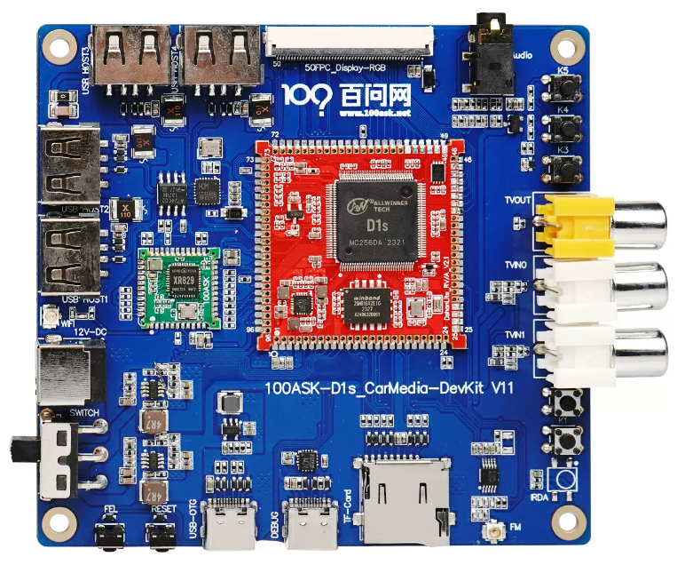

# RISC-V全志D1sCVBS套件

* 此开发板的任何问题都可以在我们的论坛交流讨论 https://forums.100ask.net/c/10-category/75-category/75

## 硬件简述

### D1s主板
主板如下：

### D1s板载功能
板载功能有

* XR829 WIFI蓝牙模组芯片，Bluetooth支持标准蓝牙与 低功耗蓝牙，Wifi 支持2.4G hz 无线网络通信。
* RGB屏幕显示接口：支持1024x600分辨率。
* IR红外接收接口：支持红外信号接收。
* 3.5MM Audio OUT：支持常见 手机的四段式 3.5MM耳机，可用于播放音乐并录制声音。
* USB TYPE-A HOST接口：用于连接 标准的 USB设备，比如 U盘 支持UVC的摄像头 等等设备。
* CVBS显示输出：支持输出模拟视频信号的功能。
* CVBS摄像头输入0、1：支持接收CVBS摄像头的模拟视频信号。

