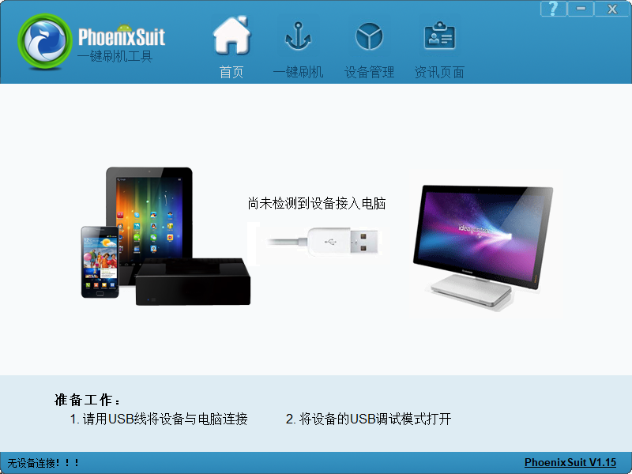
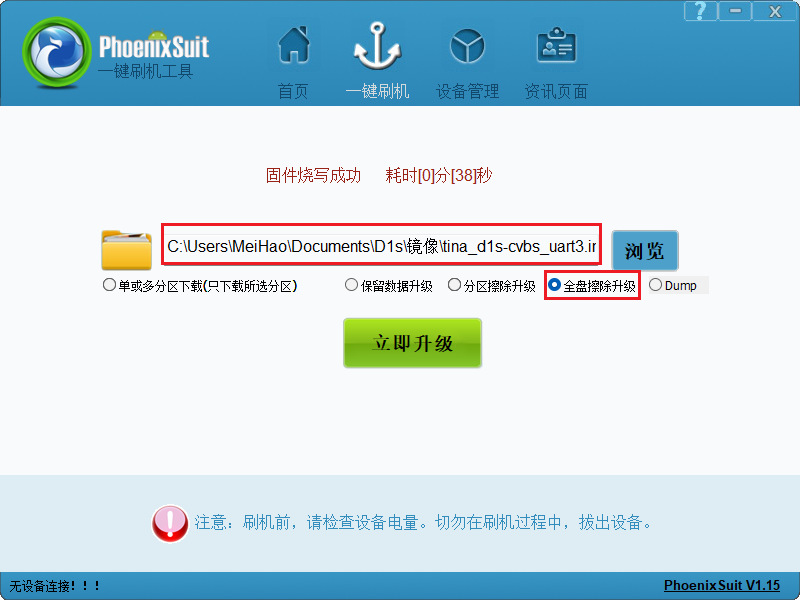
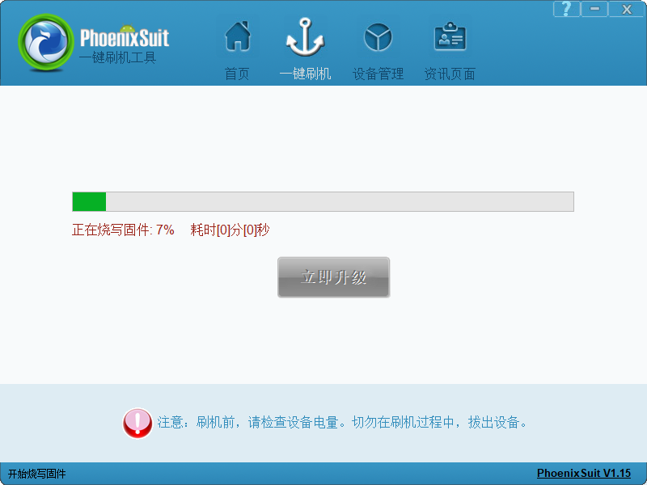

# 开发环境搭建

## 获取TinaSDK源码

Tina-SDKV2.0源码网盘链接：https://pan.baidu.com/s/13uKlqDXImmMl9cgKc41tZg?pwd=qcw7

D1s-CVBS开发板扩展补丁：[https://github.com/DongshanPI/D1s-CVBS_TinaSDK](https://github.com/DongshanPI/D1s-CVBS_TinaSDK)

上传到ubuntu，创建文件夹用来保存源码：

~~~bash
ubuntu@ubuntu1804:~$ mkdir Tina_SDK
ubuntu@ubuntu1804:~$ cd Tina_SDK/
ubuntu@ubuntu1804:~/Tina_SDK$ tree -L 1
.
├── tina-d1-h.tar.bz2.00
├── tina-d1-h.tar.bz2.01
├── tina-d1-h.tar.bz2.02
├── tina-d1-h.tar.bz2.03
├── tina-d1-h.tar.bz2.04
├── tina-d1-h.tar.bz2.05
├── tina-d1-h.tar.bz2.06
├── tina-d1-h.tar.bz2.07
└── tina-d1-h.tar.bz2.08

0 directories, 9 files
~~~

查看所有文件MD5校验值：

~~~bash
ubuntu@ubuntu1804:~/Tina_SDK$ md5sum tina-d1-h.tar.bz2.*
e755bae00cd76afc3fb276b4e3fd86ba  tina-d1-h.tar.bz2.00
cb60ecfdb51c624ff3cbd7b24552866f  tina-d1-h.tar.bz2.01
54e56a4cf1cef46ca0a94b85ea1d33a1  tina-d1-h.tar.bz2.02
4988fa08827c0f7af2dc170145e24b26  tina-d1-h.tar.bz2.03
a0463bcf8e73db27b5ecafaac593a919  tina-d1-h.tar.bz2.04
a87382ca16a8c12b3a94f1cad99ce77e  tina-d1-h.tar.bz2.05
5973530baa3b282108351818641c27fd  tina-d1-h.tar.bz2.06
ccd63e1d16534b364a101d2d44416261  tina-d1-h.tar.bz2.07
e0d72713565f4424ea43c07e15a38139  tina-d1-h.tar.bz2.08
~~~

确保校验值对上。否则需要重新上传。

解压源码：

~~~bash
ubuntu@ubuntu1804:~/Tina_SDK$ cat tina-d1-h.tar.bz2.* | tar -jxv
~~~

等待一段时间，即可解压完成。

~~~bash
ubuntu@ubuntu1804:~/Tina_SDK$ tree -L 1
.
├── tina-d1-h
├── tina-d1-h.tar.bz2.00
├── tina-d1-h.tar.bz2.01
├── tina-d1-h.tar.bz2.02
├── tina-d1-h.tar.bz2.03
├── tina-d1-h.tar.bz2.04
├── tina-d1-h.tar.bz2.05
├── tina-d1-h.tar.bz2.06
├── tina-d1-h.tar.bz2.07
└── tina-d1-h.tar.bz2.08

1 directory, 9 files
ubuntu@ubuntu1804:~/Tina_SDK$ mv tina-d1-h ../
~~~

获取扩展支持仓库，然后加以应用：

~~~bash
ubuntu@ubuntu1804:~$ git clone https://github.com/DongshanPI/D1s-CVBS_TinaSDK.git
ubuntu@ubuntu1804:~$ cd D1s-CVBS_TinaSDK
ubuntu@ubuntu1804:~/D1s-CVBS_TinaSDK$ git submodule update --init
ubuntu@ubuntu1804:~/D1s-CVBS_TinaSDK$ cp ./* -rfvd ~/tina-d1-h
~~~

编译固件之前，先安装一些依赖，否则编译会报错：

~~~bash
sudo apt-get install build-essential subversion git libncurses5-dev zlib1g-dev gawk flex quilt libssl-dev xsltproc libxml-parser-perl mercurial bzr ecj cvs unzip lib32z1 lib32z1-dev lib32stdc++6 libstdc++6 libc6:i386 libstdc++6:i386 lib32ncurses5 lib32z1 -y
~~~

## 编译出固件

进入源码目录，执行`source build/envsetup.sh`、`lunch`之后，选择`3`：

~~~bash
ubuntu@ubuntu1804:~/tina-d1-h$ source build/envsetup.sh 
Setup env done! Please run lunch next.
ubuntu@ubuntu1804:~/tina-d1-h$ lunch

You're building on Linux

Lunch menu... pick a combo:
     1. d1-h_nezha_min-tina
     2. d1-h_nezha-tina
     3. d1s_cvbs-tina
     4. d1s_nezha-tina
     5. t113_100ask_devkit-tina
     6. t113_100ask-tina

Which would you like? [Default t113_100ask_devkit]: 3
============================================
TINA_BUILD_TOP=/home/ubuntu/tina-d1-h
TINA_TARGET_ARCH=riscv
TARGET_PRODUCT=d1s_cvbs
TARGET_PLATFORM=d1s
TARGET_BOARD=d1s-cvbs
TARGET_PLAN=cvbs
TARGET_BUILD_VARIANT=tina
TARGET_BUILD_TYPE=release
TARGET_KERNEL_VERSION=5.4
TARGET_UBOOT=u-boot-2018
TARGET_CHIP=sun20iw1p1
============================================
clean buildserver
[1] 121700
ubuntu@ubuntu1804:~/tina-d1-h$
~~~

接着`make`编译、`pack`打包：

~~~bash
ubuntu@ubuntu1804:~/tina-d1-h$ make
...
make[5]: Leaving directory '/home/ubuntu/tina-d1-h/target/allwinner/generic/image'
make[4]: Leaving directory '/home/ubuntu/tina-d1-h/target/allwinner/d1s-cvbs'
make[3]: Leaving directory '/home/ubuntu/tina-d1-h/target/allwinner'
make[2]: Leaving directory '/home/ubuntu/tina-d1-h'
export MAKEFLAGS= ;make -w -r package/index
make[2]: Entering directory '/home/ubuntu/tina-d1-h'
Generating package index...
Signing key has not been configured
make[2]: Leaving directory '/home/ubuntu/tina-d1-h'
make[1]: Leaving directory '/home/ubuntu/tina-d1-h'
[2]+  Done                    $T/tools/build/buildserver --path $T 2> /dev/null 1>&2

#### make completed successfully (26:53 (mm:ss)) ####
ubuntu@ubuntu1804:~/tina-d1-h$ pack
--==========--
PACK_CHIP         sun20iw1p1
PACK_PLATFORM     tina
PACK_BOARD        d1s-cvbs
PACK_KERN        
PACK_DEBUG        uart3
PACK_SIG          none
PACK_SECURE       none
PACK_MODE         normal
PACK_FUNC         android
PACK_PROGRAMMER   none
PACK_TAR_IMAGE    none
PACK_TOPDIR       /home/ubuntu/tina-d1-h
--==========--
No kernel param, parse it from d1s
copying tools file
copying configs file
storage_type value is 5
rm /home/ubuntu/tina-d1-h/out/d1s-cvbs/image/sys_partition_nor.fex
rm /home/ubuntu/tina-d1-h/out/d1s-cvbs/image/image_nor.cfg
copying boot resource

LZMA 4.65 : Igor Pavlov : Public domain : 2009-02-03
copying boot file
make user resource for : /home/ubuntu/tina-d1-h/out/d1s-cvbs/image/sys_partition.fex
handle partition user-res
no user resource partitions
APP_PART_DOWNLOAD_FILE = /home/ubuntu/tina-d1-h/out/d1s-cvbs/image/app.fex
Need size of filesystem
no data resource partitions
don't build dtbo ...
update_chip
pack boot package
GetPrivateProfileSection read to end
content_count=3
LICHEE_REDUNDANT_ENV_SIZE config in BoardConfig.mk
--mkenvimage create redundant env data!--
---redundant env data size 0x20000---
packing for tina linux
normal
mbr count = 4

partitation file Path=/home/ubuntu/tina-d1-h/out/d1s-cvbs/image/sys_partition.bin
mbr_name file Path=/home/ubuntu/tina-d1-h/out/d1s-cvbs/image/sunxi_mbr.fex
download_name file Path=/home/ubuntu/tina-d1-h/out/d1s-cvbs/image/dlinfo.fex

mbr size = 16384
mbr magic softw411
disk name=boot-resource
disk name=env
disk name=env-redund
disk name=boot
disk name=rootfs
disk name=recovery
disk name=rootfs_data
this is not a partition key
update_for_part_info 0
crc 0 = 8b52d09e
crc 1 = 1eef81c3
crc 2 = 7b597465
crc 3 = eee42538
gpt_head->header_crc32 = 0x33ca0f56
GPT----part num 8---
gpt_entry: 128
gpt_header: 92
GPT:boot-resource: 12000         121f7       
GPT:env         : 121f8         123ef       
GPT:env-redund  : 123f0         125e7       
GPT:boot        : 125e8         175e7       
GPT:rootfs      : 175e8         233e7       
GPT:recovery    : 233e8         28b67       
GPT:rootfs_data : 28b68         2b367       
GPT:UDISK       : 2b368         ffffffde    
update gpt file ok
update mbr file ok
temp = 20
mbr count = 4 total_sectors = 15269888 logic_offset = 40960

partitation file Path=/home/ubuntu/tina-d1-h/out/d1s-cvbs/image/sys_partition.bin
mbr_name file Path=/home/ubuntu/tina-d1-h/out/d1s-cvbs/image/sunxi_mbr.fex
download_name file Path=/home/ubuntu/tina-d1-h/out/d1s-cvbs/image/dlinfo.fex

mbr size = 16384
mbr magic softw411
disk name=boot-resource
disk name=env
disk name=env-redund
disk name=boot
disk name=rootfs
disk name=recovery
disk name=rootfs_data
this is not a partition key
update_for_part_info 0
crc 0 = 8b52d09e
crc 1 = 1eef81c3
crc 2 = 7b597465
crc 3 = eee42538
gpt_head->header_crc32 = 0xa9cea6c4
GPT----part num 8---
gpt_entry: 128
gpt_header: 92
GPT:boot-resource: 12000         121f7       
GPT:env         : 121f8         123ef       
GPT:env-redund  : 123f0         125e7       
GPT:boot        : 125e8         175e7       
GPT:rootfs      : 175e8         233e7       
GPT:recovery    : 233e8         28b67       
GPT:rootfs_data : 28b68         2b367       
GPT:UDISK       : 2b368         e8ffde      
update gpt file ok
update mbr file ok
====================================
show "sys_partition_for_dragon.fex" message
------------------------------------
  [mbr]
  mbr_size  : 16384 Kbyte
------------------------------------
  partition_name  : boot-resource
  partition_size  : 504
  downloadfile  : boot-resource.fex
  boot-resource.fex size : 80K byte
------------------------------------
  partition_name  : env
  partition_size  : 504
  downloadfile  : env.fex
  env.fex size : 128K byte
------------------------------------
  partition_name  : env-redund
  partition_size  : 504
  downloadfile  : env.fex
  env.fex size : 128K byte
------------------------------------
  partition_name  : boot
  partition_size  : 20480
  downloadfile  : boot.fex
  boot.fex -> /home/ubuntu/tina-d1-h/out/d1s-cvbs/boot.img
  boot.img size : 7.3M byte
------------------------------------
  partition_name  : rootfs
  partition_size  : 48640
  downloadfile  : rootfs.fex
  rootfs.fex -> /home/ubuntu/tina-d1-h/out/d1s-cvbs/rootfs.img
  rootfs.img size : 9.2M byte
------------------------------------
  partition_name  : recovery
  partition_size  : 22400
  ;downloadfile  : recovery.fex
  recovery.fex size : 24 byte
------------------------------------
  partition_name  : rootfs_data
  partition_size  : 10240
------------------------------------
/home/ubuntu/tina-d1-h/out/host/bin/
/home/ubuntu/tina-d1-h/out/d1s-cvbs/image
Begin Parse sys_partion.fex
Add partion boot-resource.fex BOOT-RESOURCE_FEX
Add partion very boot-resource.fex BOOT-RESOURCE_FEX
FilePath: boot-resource.fex
FileLength=14000Add partion env.fex ENV_FEX000000000
Add partion very env.fex ENV_FEX000000000
FilePath: env.fex
FileLength=20000Add partion env.fex ENV_FEX000000000
Add partion very env.fex ENV_FEX000000000
FilePath: env.fex
FileLength=20000Add partion boot.fex BOOT_FEX00000000
Add partion very boot.fex BOOT_FEX00000000
FilePath: boot.fex
FileLength=74c000Add partion rootfs.fex ROOTFS_FEX000000
Add partion very rootfs.fex ROOTFS_FEX000000
FilePath: rootfs.fex
FileLength=920000BuildImg 0
Dragon execute image.cfg SUCCESS !
----------image is for nand/emmc----------
----------image is at----------

/home/ubuntu/tina-d1-h/out/d1s-cvbs/tina_d1s-cvbs_uart3.img

pack finish
ubuntu@ubuntu1804:~/tina-d1-h$
~~~

打包成功后，镜像文件保存在`tina-d1-h/out/d1s-cvbs/tina_d1s-cvbs_uart3.img`

## 烧录固件

把镜像文件传到PC端，打开全志线刷工具 **AllwinnertechPhoeniSuit**，找到**PhoenixSuit.exe** ，双击运行：

选择`一键刷机`:

找到镜像路径，选择全盘擦除升级：

选择好之后，不需要其他界面操作，这时拿起已经连接好的开发板，先按住 **FEL** 烧写模式按键，之后按一下 **RESET** 系统复位键，就可以自动进入烧写模式并开始烧写。

串口打印信息，如下：

~~~bash
[53]HELLO! BOOT0 is starting!
[56]BOOT0 commit : 88480af-dirty
[59]set pll start
[61]periph0 has been enabled
[64]set pll end
[65][pmu]: bus read error
[68]board init ok
[70]ZQ value = 0x2e
[72]get_pmu_exist() = -1
[74]DRAM BOOT DRIVE INFO: V0.33
[77]DRAM CLK = 528 MHz
[79]DRAM Type = 2 (2:DDR2,3:DDR3)
[82]DRAMC read ODT  off.
[84]DRAM ODT off.
[86]ddr_efuse_type: 0xa
[89]DRAM SIZE =64 M
[91]dram_tpr4:0x0
[92]PLL_DDR_CTRL_REG:0xf8002b00
[95]DRAM_CLK_REG:0xc0000000
[98][TIMING DEBUG] MR2= 0x0
[102]DRAM simple test OK.
[105]dram size =64
[106]spinand UBOOT_START_BLK_NUM 8 UBOOT_LAST_BLK_NUM 32
[111]block from 8 to 32
[169]Check is correct.
[171]dma 0x301c8 int is not used yet
[174]dma 0x301c8 int is free, you do not need to free it again
[180]Entry_name        = opensbi
[183]Entry_name        = u-boot
[187]Entry_name        = dtb
▒190]Jump to second Boot.

U-Boot 2018.05-g24521d6-dirty (Jul 14 2024 - 23:47:14 -0400) Allwinner Technology

[00.200]DRAM:  64 MiB
[00.202]Relocation Offset is: 01ee7000
[00.206]secure enable bit: 0
[00.210]CPU=720 MHz,PLL6=600 Mhz,AHB=200 Mhz, APB1=100Mhz  MBus=300Mhz
[00.216]flash init start
[00.218]workmode = 0,storage type = 0
sspi->base_addr = 0x4025000, the SPI control register:
[VER] 0x4025000 = 0x00010001, [GCR] 0x4025004 = 0x00000083, [TCR] 0x4025008 = 0x00000184
[ICR] 0x4025010 = 0x00000f00, [ISR] 0x4025014 = 0x00000032, [FCR] 0x4025018 = 0x00200020
[FSR] 0x402501c = 0x00000000, [WCR] 0x4025020 = 0x00000000, [CCR] 0x4025024 = 0x00000002
[SDC] 0x4025028 = 0x00002000, [BCR] 0x4025030 = 0x00000000, [TCR] 0x4025034 = 0x00000000
[BCC] 0x4025038 = 0x20000000, [DMA] 0x4025088 = 0x000000e5

[00.267]sunxi-spinand-phy: not detect any munufacture from id table
[00.273]sunxi-spinand-phy: get spi-nand Model from fdt fail
[00.279]sunxi-spinand-phy: get phy info from fdt fail

device nand0 <nand>, # parts = 4
 #: name                size            offset          mask_flags
 0: boot0               0x00100000      0x00000000      1
 1: uboot               0x00300000      0x00100000      1
 2: secure_storage      0x00100000      0x00400000      1
 3: sys                 0x07b00000      0x00500000      0

active partition: nand0,0 - (boot0) 0x00100000 @ 0x00000000

defaults:
mtdids  : nand0=nand
mtdparts: mtdparts=nand:1024k@0(boot0)ro,3072k@1048576(uboot)ro,1024k@4194304(secure_storage)ro,-(sys)
[00.397]ubi0: attaching mtd4
[00.496]ubi0: scanning is finished
[00.503]ubi0: attached mtd4 (name "sys", size 123 MiB)
[00.508]ubi0: PEB size: 262144 bytes (256 KiB), LEB size: 258048 bytes
[00.514]ubi0: min./max. I/O unit sizes: 4096/4096, sub-page size 2048
[00.520]ubi0: VID header offset: 2048 (aligned 2048), data offset: 4096
[00.527]ubi0: good PEBs: 492, bad PEBs: 0, corrupted PEBs: 0
[00.532]ubi0: user volume: 9, internal volumes: 1, max. volumes count: 128
[00.539]ubi0: max/mean erase counter: 2/1, WL threshold: 4096, image sequence number: 0
[00.546]ubi0: available PEBs: 0, total reserved PEBs: 492, PEBs reserved for bad PEB handling: 20
[00.555]sunxi flash init ok
[00.558]line:703 init_clocks
[00.561]drv_disp_init
request pwm success, pwm7:pwm7:0x2000c00.
[00.582]drv_disp_init finish
[00.584]boot_gui_init:start
[00.588]set disp.dev2_output_type fail. using defval=0
[00.595]boot_gui_init:finish
partno erro : can't find partition bootloader
54 bytes read in 0 ms
[00.727]bmp_name=bootlogo.bmp size 38454
38454 bytes read in 3 ms (12.2 MiB/s)
[00.776]LCD open finish
[00.857]Loading Environment from SUNXI_FLASH... OK
[00.880]out of usb burn from boot: not need burn key
[00.886]Item0 (Map) magic is bad
partno erro : can't find partition private
[00.915]update bootcmd
[00.927]change working_fdt 0x42aa6da0 to 0x42a86da0
No reserved memory region found in source FDT
[00.961]update dts
noncached_alloc(): addr = 0x42ca5080
noncached_alloc(): addr = 0x42ca50c0
noncached_alloc(): addr = 0x42ca5100
noncached_alloc(): addr = 0x42ca5940
geth_sys_init:634: get node 'gmac0' error
geth_sys_init fail!
[00.981]Board Net Initialization Failed
[00.985]No ethernet found.
Hit any key to stop autoboot:  0
[02.377]no vendor_boot partition is found
Android's image name: d1s-cvbs
Detect comp none
[02.395]
Starting kernel ...

▒** 17 printk messages dropped **
Dentry cache hash table entries: 8192 (order: 4, 65536 bytes, linear)
Inode-cache hash table entries: 4096 (order: 3, 32768 bytes, linear)
Sorting __ex_table...
mem auto-init: stack:off, heap alloc:off, heap free:off
Memory: 55032K/65536K available (4775K kernel code, 427K rwdata, 1864K rodata, 152K init, 240K bss, 10504K reserved, 0K cma-reserved)
SLUB: HWalign=64, Order=0-3, MinObjects=0, CPUs=1, Nodes=1
rcu: Preemptible hierarchical RCU implementation.
        Tasks RCU enabled.
rcu: RCU calculated value of scheduler-enlistment delay is 10 jiffies.
NR_IRQS: 0, nr_irqs: 0, preallocated irqs: 0
plic: mapped 200 interrupts with 1 handlers for 2 contexts.
riscv_timer_init_dt: Registering clocksource cpuid [0] hartid [0]
clocksource: riscv_clocksource: mask: 0xffffffffffffffff max_cycles: 0x588fe9dc0, max_idle_ns: 440795202592 ns
sched_clock: 64 bits at 24MHz, resolution 41ns, wraps every 4398046511097ns
riscv_timer_clockevent depends on broadcast, but no broadcast function available
clocksource: timer: mask: 0xffffffff max_cycles: 0xffffffff, max_idle_ns: 79635851949 ns
Calibrating delay loop (skipped), value calculated using timer frequency.. 48.00 BogoMIPS (lpj=240000)
pid_max: default: 32768 minimum: 301
Mount-cache hash table entries: 512 (order: 0, 4096 bytes, linear)
Mountpoint-cache hash table entries: 512 (order: 0, 4096 bytes, linear)
ASID allocator initialised with 65536 entries
rcu: Hierarchical SRCU implementation.
devtmpfs: initialized
random: get_random_u32 called from bucket_table_alloc.isra.27+0xfe/0x120 with crng_init=0
clocksource: jiffies: mask: 0xffffffff max_cycles: 0xffffffff, max_idle_ns: 19112604462750000 ns
futex hash table entries: 256 (order: 0, 6144 bytes, linear)
pinctrl core: initialized pinctrl subsystem
NET: Registered protocol family 16
DMA: preallocated 256 KiB pool for atomic allocations
cpuidle: using governor menu
rtc_ccu: sunxi ccu init OK
clock: sunxi ccu init OK
clock: sunxi ccu init OK
iommu: Default domain type: Translated
sunxi iommu: irq = 4
SCSI subsystem initialized
usbcore: registered new interface driver usbfs
usbcore: registered new interface driver hub
usbcore: registered new device driver usb
mc: Linux media interface: v0.10
videodev: Linux video capture interface: v2.00
Advanced Linux Sound Architecture Driver Initialized.
Bluetooth: Core ver 2.22
NET: Registered protocol family 31
Bluetooth: HCI device and connection manager initialized
Bluetooth: HCI socket layer initialized
Bluetooth: L2CAP socket layer initialized
Bluetooth: SCO socket layer initialized
pwm module init!
g2d 5410000.g2d: Adding to iommu group 0
G2D: rcq version initialized.major:251
clocksource: Switched to clocksource riscv_clocksource
sun8iw20-pinctrl 2000000.pinctrl: initialized sunXi PIO driver
NET: Registered protocol family 2
tcp_listen_portaddr_hash hash table entries: 256 (order: 0, 4096 bytes, linear)
TCP established hash table entries: 512 (order: 0, 4096 bytes, linear)
TCP bind hash table entries: 512 (order: 0, 4096 bytes, linear)
TCP: Hash tables configured (established 512 bind 512)
UDP hash table entries: 256 (order: 1, 8192 bytes, linear)
UDP-Lite hash table entries: 256 (order: 1, 8192 bytes, linear)
NET: Registered protocol family 1
sun8iw20-pinctrl 2000000.pinctrl: 2000000.pinctrl supply vcc-pc not found, using dummy regulator
spi spi0: spi0 supply spi not found, using dummy regulator
sunxi_spi_resource_get()2151 - [spi0] SPI MASTER MODE
sunxi_spi_resource_get()2189 - Failed to get sample mode
sunxi_spi_resource_get()2194 - Failed to get sample delay
sunxi_spi_resource_get()2198 - sample_mode:-1431633921 sample_delay:-1431633921
sunxi_spi_clk_init()2240 - [spi0] mclk 100000000
sunxi_spi_probe()2653 - [spi0]: driver probe succeed, base ffffffd004058000, irq 31
workingset: timestamp_bits=62 max_order=14 bucket_order=0
squashfs: version 4.0 (2009/01/31) Phillip Lougher
ntfs: driver 2.1.32 [Flags: R/W].
io scheduler mq-deadline registered
io scheduler kyber registered
[DISP]disp_module_init
disp 5000000.disp: Adding to iommu group 0
[DISP] parser_disp_init_para,line:1430:
of_property_read fb0_width fail
[DISP] disp_init,line:2386:
smooth display screen:0 type:1 mode:4
disp 5000000.disp: 5000000.disp supply vcc-lcd not found, using dummy regulator
disp 5000000.disp: 5000000.disp supply vcc-pd not found, using dummy regulator
display_fb_request,fb_id:0
Freeing logo buffer memory: 1500K
disp_al_manager_apply ouput_type:1
[DISP] lcd_clk_config,line:732:
disp 0, clk: pll(306000000),clk(306000000),dclk(51000000) dsi_rate(306000000)
     clk real:pll(300000000),clk(300000000),dclk(50000000) dsi_rate(0)
sun8iw20-pinctrl 2000000.pinctrl: 2000000.pinctrl supply vcc-pd not found, using dummy regulator
[DISP]disp_module_init finish
sunxi_sid_init()551 - insmod ok
pwm-regulator: supplied by regulator-dummy
uart uart0: get regulator failed
uart uart0: uart0 supply uart not found, using dummy regulator
uart0: ttyS0 at MMIO 0x2500000 (irq = 18, base_baud = 1500000) is a SUNXI
sun8iw20-pinctrl 2000000.pinctrl: 2000000.pinctrl supply vcc-pb not found, using dummy regulator
uart uart3: get regulator failed
uart uart3: uart3 supply uart not found, using dummy regulator
uart3: ttyS3 at MMIO 0x2500c00 (irq = 21, base_baud = 1500000) is a SUNXI
sw_console_setup()1808 - console setup baud 115200 parity n bits 8, flow n
printk: console [ttyS3] enabled
misc dump reg init
sun8iw20-pinctrl 2000000.pinctrl: 2000000.pinctrl supply vcc-pg not found, using dummy regulator
sunxi-rfkill soc@3000000:rfkill@0: module version: v1.0.9
sunxi-rfkill soc@3000000:rfkill@0: get gpio chip_en failed
sunxi-rfkill soc@3000000:rfkill@0: get gpio power_en failed
sunxi-rfkill soc@3000000:rfkill@0: wlan_busnum (1)
sunxi-rfkill soc@3000000:rfkill@0: Missing wlan_power.
sunxi-rfkill soc@3000000:rfkill@0: wlan clock[0] (32k-fanout1)
sunxi-rfkill soc@3000000:rfkill@0: wlan_regon gpio=204 assert=1
sunxi-rfkill soc@3000000:rfkill@0: wlan_hostwake gpio=202 assert=1
sunxi-rfkill soc@3000000:rfkill@0: wakeup source is enabled
sunxi-rfkill soc@3000000:rfkill@0: Missing bt_power.
sunxi-rfkill soc@3000000:rfkill@0: bt clock[0] (32k-fanout1)
sunxi-rfkill soc@3000000:rfkill@0: bt_rst gpio=210 assert=0
[ADDR_MGT] addr_mgt_probe: module version: v1.0.10
[ADDR_MGT] addr_mgt_probe: success.
sunxi-spinand: AW SPINand MTD Layer Version: 2.0 20201228
sunxi-spinand-phy: AW SPINand Phy Layer Version: 1.10 20200306
sunxi-spinand-phy: not detect any munufacture from id table
sunxi-spinand-phy: get spi-nand Model from fdt fail
sunxi-spinand-phy: get phy info from fdt fail
sunxi-spinand-phy: not detect munufacture from fdt
sunxi-spinand-phy: detect munufacture from id table: Winbond
sunxi-spinand-phy: detect spinand id: ff21aaef ffffffff
sunxi-spinand-phy: ========== arch info ==========
sunxi-spinand-phy: Model:               W25N01GVZEIG
sunxi-spinand-phy: Munufacture:         Winbond
sunxi-spinand-phy: DieCntPerChip:       1
sunxi-spinand-phy: BlkCntPerDie:        1024
sunxi-spinand-phy: PageCntPerBlk:       64
sunxi-spinand-phy: SectCntPerPage:      4
sunxi-spinand-phy: OobSizePerPage:      64
sunxi-spinand-phy: BadBlockFlag:        0x0
sunxi-spinand-phy: OperationOpt:        0x7
sunxi-spinand-phy: MaxEraseTimes:       65000
sunxi-spinand-phy: EccFlag:             0x0
sunxi-spinand-phy: EccType:             2
sunxi-spinand-phy: EccProtectedType:    3
sunxi-spinand-phy: ========================================
sunxi-spinand-phy:
sunxi-spinand-phy: ========== physical info ==========
sunxi-spinand-phy: TotalSize:    128 M
sunxi-spinand-phy: SectorSize:   512 B
sunxi-spinand-phy: PageSize:     2 K
sunxi-spinand-phy: BlockSize:    128 K
sunxi-spinand-phy: OOBSize:      64 B
sunxi-spinand-phy: ========================================
sunxi-spinand-phy:
sunxi-spinand-phy: ========== logical info ==========
sunxi-spinand-phy: TotalSize:    128 M
sunxi-spinand-phy: SectorSize:   512 B
sunxi-spinand-phy: PageSize:     4 K
sunxi-spinand-phy: BlockSize:    256 K
sunxi-spinand-phy: OOBSize:      128 B
sunxi-spinand-phy: ========================================
sunxi-spinand-phy: W25N01GVZEIG reset rx bit width to 1
sunxi-spinand-phy: W25N01GVZEIG reset tx bit width to 1
sunxi-spinand-phy: block lock register: 0x00
sunxi-spinand-phy: feature register: 0x19
sunxi-spinand-phy: sunxi physic nand init end
Creating 4 MTD partitions on "sunxi_mtd_nand":
0x000000000000-0x000000100000 : "boot0"
0x000000100000-0x000000500000 : "uboot"
random: fast init done
0x000000500000-0x000000600000 : "secure_storage"
0x000000600000-0x000008000000 : "sys"
ehci_hcd: USB 2.0 'Enhanced' Host Controller (EHCI) Driver
sunxi-ehci: EHCI SUNXI driver
get ehci1-controller wakeup-source is fail.
sunxi ehci1-controller don't init wakeup source
[sunxi-ehci1]: probe, pdev->name: 4200000.ehci1-controller, sunxi_ehci: 0xffffffe000736920, 0x:ffffffd004072000, irq_no:31
sunxi-ehci 4200000.ehci1-controller: 4200000.ehci1-controller supply drvvbus not found, using dummy regulator
sunxi-ehci 4200000.ehci1-controller: 4200000.ehci1-controller supply hci not found, using dummy regulator
sunxi-ehci 4200000.ehci1-controller: EHCI Host Controller
sunxi-ehci 4200000.ehci1-controller: new USB bus registered, assigned bus number 1
sunxi-ehci 4200000.ehci1-controller: irq 49, io mem 0x04200000
sunxi-ehci 4200000.ehci1-controller: USB 2.0 started, EHCI 1.00
sunxi-ehci 4200000.ehci1-controller: ehci_irq: highspeed device connect
hub 1-0:1.0: USB hub found
hub 1-0:1.0: 1 port detected
ohci_hcd: USB 1.1 'Open' Host Controller (OHCI) Driver
sunxi-ohci: OHCI SUNXI driver
get ohci1-controller wakeup-source is fail.
sunxi ohci1-controller don't init wakeup source
[sunxi-ohci1]: probe, pdev->name: 4200400.ohci1-controller, sunxi_ohci: 0xffffffe000736ce8
sunxi-ohci 4200400.ohci1-controller: 4200400.ohci1-controller supply drvvbus not found, using dummy regulator
sunxi-ohci 4200400.ohci1-controller: 4200400.ohci1-controller supply hci not found, using dummy regulator
sunxi-ohci 4200400.ohci1-controller: OHCI Host Controller
sunxi-ohci 4200400.ohci1-controller: new USB bus registered, assigned bus number 2
sunxi-ohci 4200400.ohci1-controller: irq 50, io mem 0x04200400
hub 2-0:1.0: USB hub found
hub 2-0:1.0: 1 port detected
sunxi-rtc 7090000.rtc: registered as rtc0
sunxi-rtc 7090000.rtc: setting system clock to 1970-01-01T00:03:43 UTC (223)
sunxi-rtc 7090000.rtc: sunxi rtc probed
i2c /dev entries driver
IR NEC protocol handler initialized
[VIN_WARN]sensor_helper_probe: cannot get sensor0_cameravdd supply, setting it to NULL!
[VIN_WARN]sensor_helper_probe: cannot get sensor0_iovdd supply, setting it to NULL!
[VIN_WARN]sensor_helper_probe: cannot get sensor0_avdd supply, setting it to NULL!
[VIN_WARN]sensor_helper_probe: cannot get sensor0_dvdd supply, setting it to NULL!
[VIN_WARN]sensor_helper_probe: cannot get sensor1_cameravdd supply, setting it to NULL!
[VIN_WARN]sensor_helper_probe: cannot get sensor1_iovdd supply, setting it to NULL!
[VIN_WARN]sensor_helper_probe: cannot get sensor1_avdd supply, setting it to NULL!
[VIN_WARN]sensor_helper_probe: cannot get sensor1_dvdd supply, setting it to NULL!
uvcvideo: Unable to create debugfs directory
usbcore: registered new interface driver uvcvideo
USB Video Class driver (1.1.1)
gspca_main: v2.14.0 registered
sunxi cedar version 1.1
sunxi-cedar 1c0e000.ve: Adding to iommu group 0
VE: install start!!!

VE: cedar-ve the get irq is 6

VE: install end!!!

VE: sunxi_cedar_probe
Bluetooth: HCI UART driver ver 2.3
Bluetooth: HCI UART protocol H4 registered
Bluetooth: HCI UART protocol BCSP registered
Bluetooth: XRadio Bluetooth LPM Mode Driver Ver 1.0.10
sunxi-mmc 4021000.sdmmc: SD/MMC/SDIO Host Controller Driver(v4.21 2021-11-18 10:02)
sunxi-mmc 4021000.sdmmc: ***ctl-spec-caps*** 8
sunxi-mmc 4021000.sdmmc: No vmmc regulator found
sunxi-mmc 4021000.sdmmc: No vqmmc regulator found
sunxi-mmc 4021000.sdmmc: No vdmmc regulator found
sunxi-mmc 4021000.sdmmc: No vd33sw regulator found
sunxi-mmc 4021000.sdmmc: No vd18sw regulator found
sunxi-mmc 4021000.sdmmc: No vq33sw regulator found
sunxi-mmc 4021000.sdmmc: No vq18sw regulator found
sunxi-mmc 4021000.sdmmc: Cann't get pin bias hs pinstate,check if needed
sunxi-mmc 4021000.sdmmc: sdc set ios:clk 0Hz bm PP pm UP vdd 21 width 1 timing LEGACY(SDR12) dt B
usb 1-1: new high-speed USB device number 2 using sunxi-ehci
sunxi-mmc 4021000.sdmmc: no vqmmc,Check if there is regulator
sunxi-mmc 4021000.sdmmc: sdc set ios:clk 400000Hz bm PP pm ON vdd 21 width 1 timing LEGACY(SDR12) dt B
sunxi-mmc 4021000.sdmmc: detmode:manually by software
sunxi-mmc 4021000.sdmmc: smc 0 p1 err, cmd 52, RTO !!
ashmem: initialized
sunxi-mmc 4021000.sdmmc: smc 0 p1 err, cmd 52, RTO !!
sunxi-mmc 4021000.sdmmc: sdc set ios:clk 400000Hz bm PP pm ON vdd 21 width 1 timing LEGACY(SDR12) dt B
exFAT: Version 1.3.0
sunxi-mmc 4021000.sdmmc: sdc set ios:clk 400000Hz bm PP pm ON vdd 21 width 1 timing LEGACY(SDR12) dt B
[AUDIOCODEC][sunxi_codec_parse_params][2412]:digital_vol:0, lineout_vol:26, mic1gain:31, mic2gain:31 pa_msleep:120, pa_level:1, pa_pwr_level:1

[AUDIOCODEC][sunxi_codec_parse_params][2448]:adcdrc_cfg:0, adchpf_cfg:1, dacdrc_cfg:0, dachpf:0
[AUDIOCODEC][sunxi_internal_codec_probe][2609]:codec probe finished
sunxi-mmc 4021000.sdmmc: smc 0 p1 err, cmd 5, RTO !!
sunxi-mmc 4021000.sdmmc: smc 0 p1 err, cmd 5, RTO !!
sunxi-mmc 4021000.sdmmc: smc 0 p1 err, cmd 5, RTO !!
[SNDCODEC][sunxi_card_init][583]:card init finished
sunxi-mmc 4021000.sdmmc: smc 0 p1 err, cmd 5, RTO !!
sunxi-mmc 4021000.sdmmc: sdc set ios:clk 0Hz bm PP pm OFF vdd 0 width 1 timing LEGACY(SDR12) dt B
sunxi-codec-machine 2030340.sound: 2030000.codec <-> 203034c.dummy_cpudai mapping ok
input: audiocodec sunxi Audio Jack as /devices/platform/soc@3000000/2030340.sound/sound/card0/input0
[SNDCODEC][sunxi_card_dev_probe][836]:register card finished
NET: Registered protocol family 10
Segment Routing with IPv6
[SNDCODEC][sunxi_hs_init_work][259]:resume-->report switch
NET: Registered protocol family 17
Bluetooth: RFCOMM TTY layer initialized
Bluetooth: RFCOMM socket layer initialized
Bluetooth: RFCOMM ver 1.11
hub 1-1:1.0: USB hub found
hub 1-1:1.0: 4 ports detected
sun8iw20-pinctrl 2000000.pinctrl: 2000000.pinctrl supply vcc-pe not found, using dummy regulator
sunxi-i2c sunxi-i2c2: sunxi-i2c2 supply twi not found, using dummy regulator
sunxi-i2c sunxi-i2c2: probe success
get ehci0-controller wakeup-source is fail.
sunxi ehci0-controller don't init wakeup source
[sunxi-ehci0]: probe, pdev->name: 4101000.ehci0-controller, sunxi_ehci: 0xffffffe000736190, 0x:ffffffd0040f4000, irq_no:2e
[sunxi-ehci0]: Not init ehci0
get ohci0-controller wakeup-source is fail.
sunxi ohci0-controller don't init wakeup source
[sunxi-ohci0]: probe, pdev->name: 4101400.ohci0-controller, sunxi_ohci: 0xffffffe000736558
[sunxi-ohci0]: Not init ohci0
ubi0: attaching mtd3
random: crng init done
ubi0: scanning is finished
ubi0: attached mtd3 (name "sys", size 122 MiB)
ubi0: PEB size: 262144 bytes (256 KiB), LEB size: 258048 bytes
ubi0: min./max. I/O unit sizes: 4096/4096, sub-page size 2048
ubi0: VID header offset: 2048 (aligned 2048), data offset: 4096
ubi0: good PEBs: 488, bad PEBs: 0, corrupted PEBs: 0
ubi0: user volume: 9, internal volumes: 1, max. volumes count: 128
ubi0: max/mean erase counter: 2/1, WL threshold: 4096, image sequence number: 0
ubi0: available PEBs: 6, total reserved PEBs: 482, PEBs reserved for bad PEB handling: 10
ubi0: background thread "ubi_bgt0d" started, PID 61
block ubiblock0_5: created from ubi0:5(rootfs)
sun8iw20-pinctrl 2000000.pinctrl: pin PB6 already requested by 2500c00.uart; cannot claim for 2000000.pinctrl:38
sun8iw20-pinctrl 2000000.pinctrl: pin-38 (2000000.pinctrl:38) status -22
ERR: id gpio_request failed
vin_csi 5801000.csi: Adding to iommu group 0
sunxi-vin-core 5809000.vinc: Adding to iommu group 0
sunxi-vin-core 5809200.vinc: Adding to iommu group 0
sun8iw20-pinctrl 2000000.pinctrl: pin PE8 already requested by 5801000.csi; cannot claim for 2000000.pinctrl:136
sun8iw20-pinctrl 2000000.pinctrl: pin-136 (2000000.pinctrl:136) status -22
sun8iw20-pinctrl 2000000.pinctrl: pin PE9 already requested by 5801000.csi; cannot claim for 2000000.pinctrl:137
sun8iw20-pinctrl 2000000.pinctrl: pin-137 (2000000.pinctrl:137) status -22
sun8iw20-pinctrl 2000000.pinctrl: pin PE6 already requested by 5801000.csi; cannot claim for 2000000.pinctrl:134
sun8iw20-pinctrl 2000000.pinctrl: pin-134 (2000000.pinctrl:134) status -22
sun8iw20-pinctrl 2000000.pinctrl: pin PE7 already requested by 5801000.csi; cannot claim for 2000000.pinctrl:135
sun8iw20-pinctrl 2000000.pinctrl: pin-135 (2000000.pinctrl:135) status -22
[VIN_WARN]get csi isp clk fail
[VIN_WARN]get csi isp src clk fail
[VIN_WARN]get csi mipi clk fail
[VIN_WARN]get csi mipi src clk fail
[VIN_WARN]get csi isp clk fail
[VIN_WARN]Get isp reset control fail
[VIN_ERR]registering ov5640, No such device!
[VIN_ERR]ov5647 request i2c3 adapter failed!
platform regulatory.0: Direct firmware load for regulatory.db failed with error -2
clk: Not disabling unused clocks
ALSA device list:
  #0: audiocodec
alloc_fd: slot 0 not NULL!
cfg80211: failed to load regulatory.db
VFS: Mounted root (squashfs filesystem) readonly on device 254:0.
devtmpfs: mounted
Freeing unused kernel memory: 152K
This architecture does not have kernel memory protection.
Run /pseudo_init as init process
mount: mounting none on /dev failed: Device or resource busy
UBIFS (ubi0:7): Mounting in unauthenticated mode
UBIFS (ubi0:7): background thread "ubifs_bgt0_7" started, PID 89
UBIFS (ubi0:7): recovery needed
UBIFS (ubi0:7): recovery completed
UBIFS (ubi0:7): UBIFS: mounted UBI device 0, volume 7, name "rootfs_data"
UBIFS (ubi0:7): LEB size: 258048 bytes (252 KiB), min./max. I/O unit sizes: 4096 bytes/4096 bytes
UBIFS (ubi0:7): FS size: 3096576 bytes (2 MiB, 12 LEBs), journal size 1806337 bytes (1 MiB, 5 LEBs)
UBIFS (ubi0:7): reserved for root: 146258 bytes (142 KiB)
UBIFS (ubi0:7): media format: w5/r0 (latest is w5/r0), UUID FE900EA9-D4AD-493A-8674-E58A153B6367, small LPT model
can't run '/etc/preinit': No such file or directory
mount: mounting proc on /proc failed: Device or resource busy
mount: mounting tmpfs on /run failed: No such file or directory
hostname: can't open '/etc/hostname': No such file or directory
------run rc.preboot file-----
UBIFS (ubi0:8): Mounting in unauthenticated mode
UBIFS (ubi0:8): background thread "ubifs_bgt0_8" started, PID 118
UBIFS (ubi0:8): recovery needed
UBIFS (ubi0:8): recovery completed
UBIFS (ubi0:8): UBIFS: mounted UBI device 0, volume 8, name "UDISK"
UBIFS (ubi0:8): LEB size: 258048 bytes (252 KiB), min./max. I/O unit sizes: 4096 bytes/4096 bytes
UBIFS (ubi0:8): FS size: 47738880 bytes (45 MiB, 185 LEBs), journal size 2322432 bytes (2 MiB, 9 LEBs)
UBIFS (ubi0:8): reserved for root: 2254825 bytes (2201 KiB)
UBIFS (ubi0:8): media format: w5/r0 (latest is w5/r0), UUID E1929F41-6C47-4EBE-9816-DF4C22B99EF6, small LPT model
------run rc.modules file-----
usbcore: registered new interface driver usb-storage
sunxi_gpadc_init,2151, success
sunxi_gpadc_setup: get channel scan data failed
input: sunxi-gpadc0 as /devices/virtual/input/input1
get ctp_power is fail, -22
get ctp_power_ldo_vol is fail, -22
sunxi_ctp_startup: ctp_power_io is invalid.
get ctp_gesture_wakeup fail, no gesture wakeup
gt9xxnew_ts 2-0014: 2-0014 supply ctp not found, using dummy regulator
sun8iw20-pinctrl 2000000.pinctrl: pin PE11 already requested by 5801000.csi; cannot claim for 2000000.pinctrl:139
sun8iw20-pinctrl 2000000.pinctrl: pin-139 (2000000.pinctrl:139) status -22
wakeup gpio_request is failed
startup:ctp_ops.input_sensor_init err.
can not startup device!
regulator-dummy: Underflow of regulator enable count
regulator-dummy: Underflow of regulator enable count
gt9xxnew_ts: probe of 2-0014 failed with error -1
Error: Driver 'gt9xxnew_ts' is already registered, aborting...
insmod: can't insert '/lib/modules/5.4.61/gt9xxnew_ts.ko': Operation not permitted
insmod: can't insert '/lib/modules/5.4.61/xr819s.ko': No such file or directory
Successfully initialized wpa_supplicant
Could not read interface wlan0 flags: No such device
nl80211: Driver does not support authentication/association or connect commands
nl80211: deinit ifname=wlan0 disabled_11b_rates=0
Could not read interface wlan0 flags: No such device
wlan0: Failed to initialize driver interface
------run rc.final file-----
numid=30,iface=MIXER,name='Headphone Switch'
  ; type=BOOLEAN,access=rw------,values=1
  : values=on
file system registered
configfs-gadget 4100000.udc-controller: failed to start g1: -19
sh: write error: No such device
read descriptors
read strings

insmod_host_driver

[ehci0-controller]: sunxi_usb_enable_ehci
[sunxi-ehci0]: probe, pdev->name: 4101000.ehci0-controller, sunxi_ehci: 0xffffffe000736190, 0x:ffffffd0040f4000, irq_no:2e
sunxi-ehci 4101000.ehci0-controller: 4101000.ehci0-controller supply hci not found, using dummy regulator
sunxi-ehci 4101000.ehci0-controller: EHCI Host Controller
sunxi-ehci 4101000.ehci0-controller: new USB bus registered, assigned bus number 3
sunxi-ehci 4101000.ehci0-controller: irq 46, io mem 0x04101000
sunxi-ehci 4101000.ehci0-controller: USB 2.0 started, EHCI 1.00
hub 3-0:1.0: USB hub found
hub 3-0:1.0: 1 port detected
[ohci0-controller]: sunxi_usb_enable_ohci
[sunxi-ohci0]: probe, pdev->name: 4101400.ohci0-controller, sunxi_ohci: 0xffffffe000736558
sunxi-ohci 4101400.ohci0-controller: 4101400.ohci0-controller supply hci not found, using dummy regulator
sunxi-ohci 4101400.ohci0-controller: OHCI Host Controller
sunxi-ohci 4101400.ohci0-controller: new USB bus registered, assigned bus number 4
sunxi-ohci 4101400.ohci0-controller: irq 47, io mem 0x04101400
hub 4-0:1.0: USB hub found
hub 4-0:1.0: 1 port detected
host_chose finished!

BusyBox v1.27.2 () built-in shell (ash)

------run profile file-----
nice: can't execute '/usr/bin/story_bin': No such file or directory
 _____  _              __     _
|_   _||_| ___  _ _   |  |   |_| ___  _ _  _ _
  | |   _ |   ||   |  |  |__ | ||   || | ||_'_|
  | |  | || | || _ |  |_____||_||_|_||___||_,_|
  |_|  |_||_|_||_|_|  Tina is Based on OpenWrt!
 ----------------------------------------------
 Tina Linux (Neptune, 61CC0487)
 ----------------------------------------------
root@TinaLinux:/#
~~~

