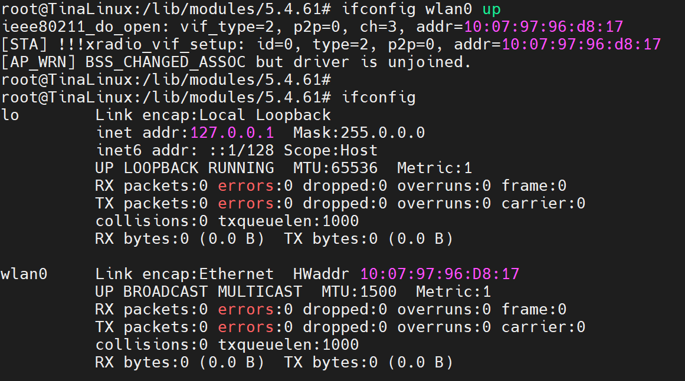

# 移植wifi模块XR829

> Tina_SDK  d1s-cvbs

### XR829驱动配置

> Tina_SDK  自带XR829驱动，需要在内核`tina-d1-h/lichee/linux-5.4`中选中编译即可

**执行`m kernel_menuconfig`:**

~~~bash
> Device Drivers > Network device support > Wireless LAN
<M> XR829 WLAN support
~~~

按M键表示要把XR829编译为.ko模块。

**编译内核：**

~~~bash
~/tina-d1-h/lichee/linux-5.4$ mkernel
~~~

在`tina-d1-h/lichee/linux-5.4/drivers/net/wireless/xr829`目录下查看是否有`xr829.ko`

### 修改设备树

> vi ~/tina-d1-h/device/config/chips/d1s/configs/cvbs/linux-5.4/board.dts

**参考原理图修改引脚：**

wlan_regon引脚是PG12，wlan_hostwake引脚是PG10。

### 添加module

> 注意区分wifi模块是24M还是40M，这里是24M的。

**1、手动修改：**

> vi tina-d1-h/target/allwinner/d1s-cvbs/defconfig

**2、`make menuconfig`修改：**

> 在SDK根目录`tina-d1-h/`下执行命令。

~~~bash
> Kernel modules > Wireless Drivers
~~~

### 添加 Firmware

> 注意区分wifi模块是24M还是40M，这里是24M的。

**1、手动修改：**

> vi tina-d1-h/target/allwinner/d1s-cvbs/defconfig

**2、`make menuconfig`修改：**

> 在SDK根目录`tina-d1-h/`下执行命令。

~~~bash
> Firmware
~~~

---

### 测试验证

> 把镜像烧录到开发板中

~~~bash
ifconfig -a
~~~

~~~bash
ifconfig wlan0 up
~~~

wifi 的基础功能可以通过下面的步骤进行验证:
• 加载 wifi 驱动，启动 wpa_supplicant
• 扫描测试
• 联网测试
• 查看 ip 地址
• ping 百度测试

**1. 加载 wifi 驱动，启动 wpa_supplicant**

> cd /lib/modules/5.4.61/

~~~bash
insmod xr829.ko
~~~

~~~bash
/etc/init.d/wpa_supplicant start
~~~

`ps`查看wpa_supplicant是否启动成功

**2. 扫描测试**

~~~bash
wifi_scan_results_test
~~~

 **3. 联网测试**

~~~bash
wifi_connect_ap_test xxx xxx
~~~

**4. 查看 ip 地址**

~~~bash
ifconfig
~~~

**5. ping 百度测试**

~~~bash
ping www.baidu.com
~~~

---

### 参考文章

[【网络专题1】Tina Wi-Fi模组移植_实践篇 | 全志在线开发者论坛 (aw-ol.com)](https://bbs.aw-ol.com/topic/895/网络专题1-tina-wi-fi模组移植_实践篇/2)

[【FAQ】全志R系列如何解决wpa_supplicant服务启动问题？ | 全志在线开发者论坛 (aw-ol.com)](https://bbs.aw-ol.com/topic/618/faq-全志r系列如何解决wpa_supplicant服务启动问题)

[D1 Tina Linux Wi-Fi (aw-ol.com)](https://bbs.aw-ol.com/assets/uploads/files/1648272592399-d1-tina-linux-wi-fi-开发指南.pdf)

[D1 Tina Linux 配置 (aw-ol.com)](https://bbs.aw-ol.com/assets/uploads/files/1648475912844-d1-tina-linux-配置-开发指南.pdf)

[【资料汇总】D1-H和D1s的芯片手册，开发资料文档 | 全志在线开发者论坛 (aw-ol.com)](https://bbs.aw-ol.com/topic/1216/资料汇总-d1-h和d1s的芯片手册-开发资料文档?_=1709081858811)