# 使用CVBS摄像头接入VIN0端口

> 100ask-d1s    Tina_SDK

### 设备树配置：

> /home/ubuntu/tina-d1-h/device/config/chips/d1s/configs/cvbs/linux-5.4/board.dts

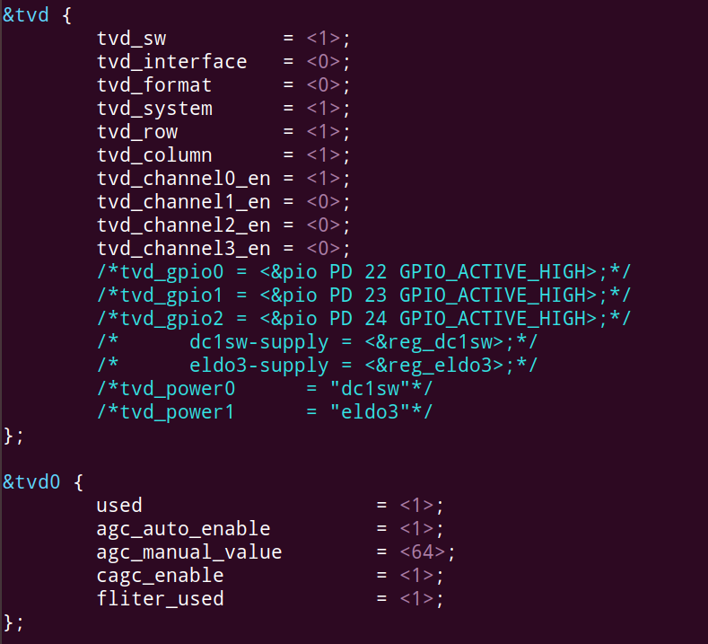

### 内核配置：

> /home/ubuntu/tina-d1-h/lichee/linux-5.4

在内核目录下执行：

~~~bash
m kernel_menuconfig
~~~

~~~bash
-> Device Drivers
	-> Multimedia support (MEDIA_SUPPORT [=y])
~~~

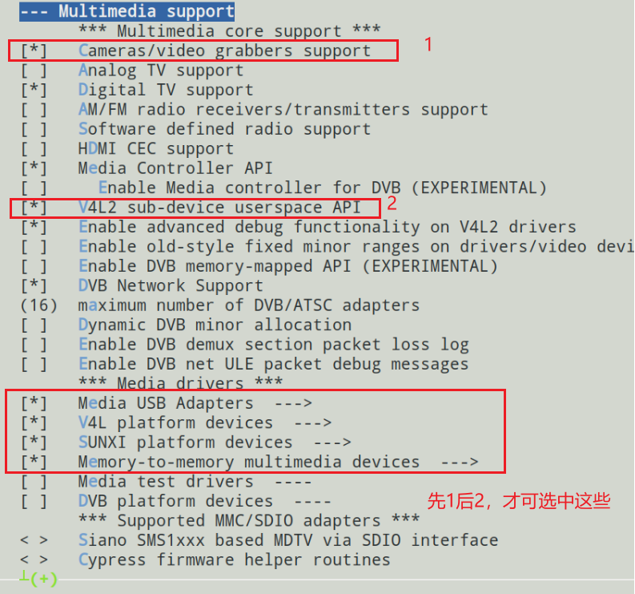

~~~bash
-> Device Drivers
	-> Multimedia support (MEDIA_SUPPORT [=y])
		-> Media USB Adapters (MEDIA_USB_SUPPORT [=y])
~~~

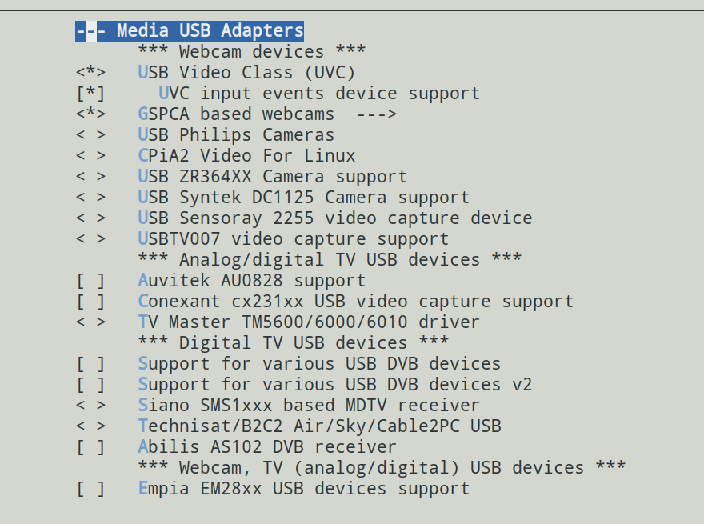

~~~bash
-> Device Drivers
	-> Multimedia support (MEDIA_SUPPORT [=y])
		-> V4L platform devices (V4L_PLATFORM_DRIVERS [=y])
~~~

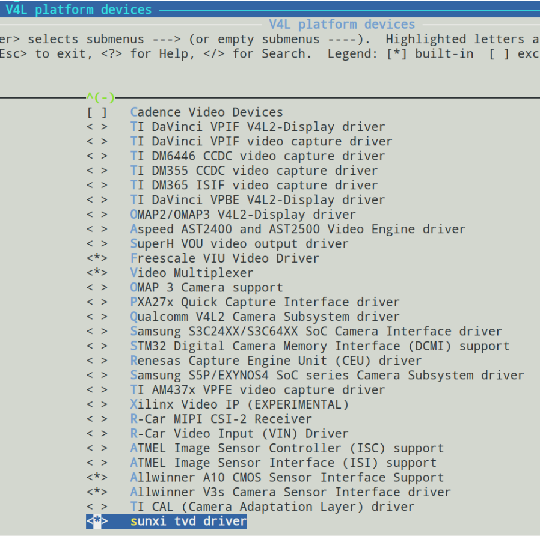

~~~bash
-> Device Drivers
	-> Multimedia support (MEDIA_SUPPORT [=y])
		-> SUNXI platform devices (SUNXI_PLATFORM_DRIVERS [=y])
~~~

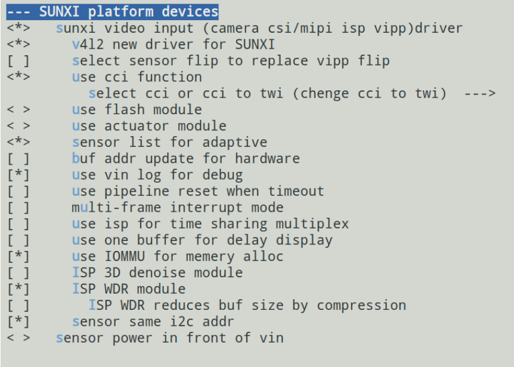

~~~bash
-> Device Drivers
	-> Multimedia support (MEDIA_SUPPORT [=y])
		-> Memory-to-memory multimedia devices (V4L_MEM2MEM_DRIVERS [=y])
~~~

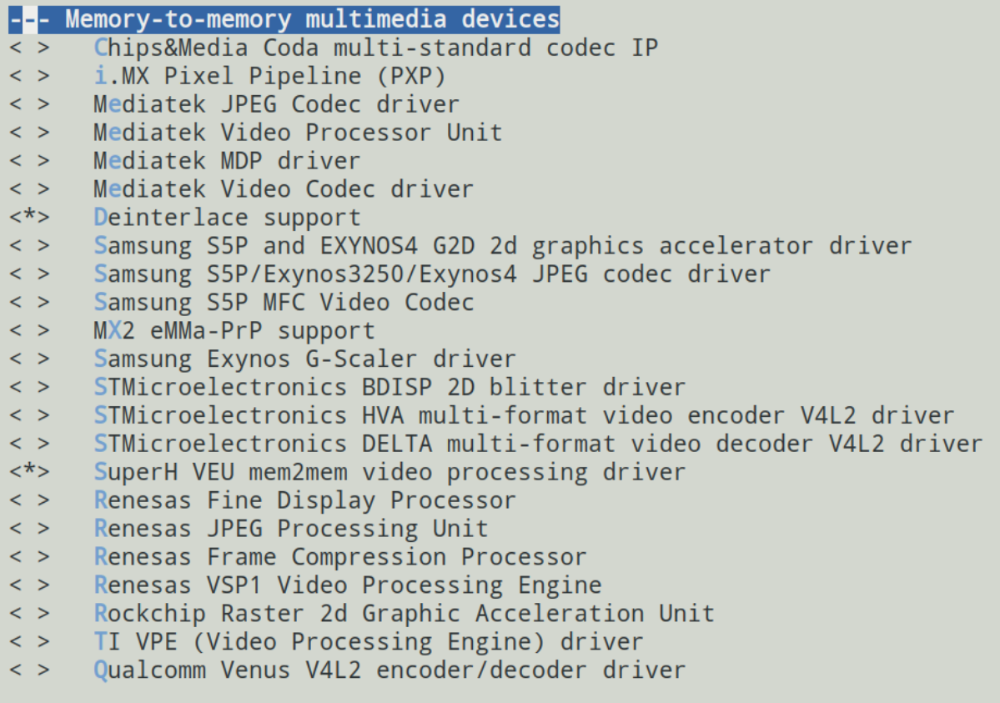

配置完，编译打包，烧录。

编译如果报错，选中这里看看（具体原因忘记了，当时是根据错误信息，找到内核源码做出的修改）：

~~~bash
-> General setup
~~~

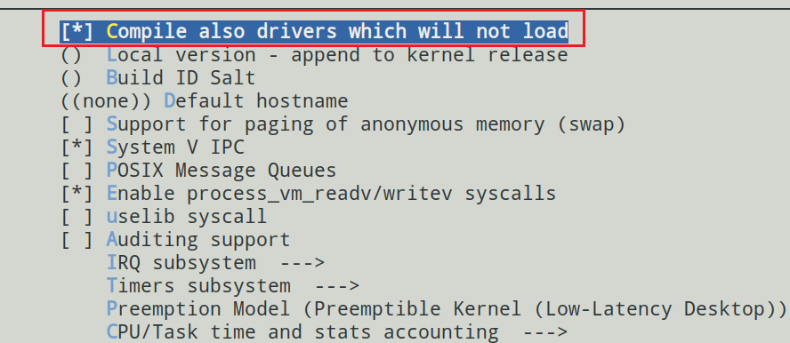

### 修改Video_input_port.c

进入目录：

~~~bash
cd /home/ubuntu/tina-d1-h/out/d1s-cvbs/compile_dir/target/libcedarx/trecorder/
~~~

修改：

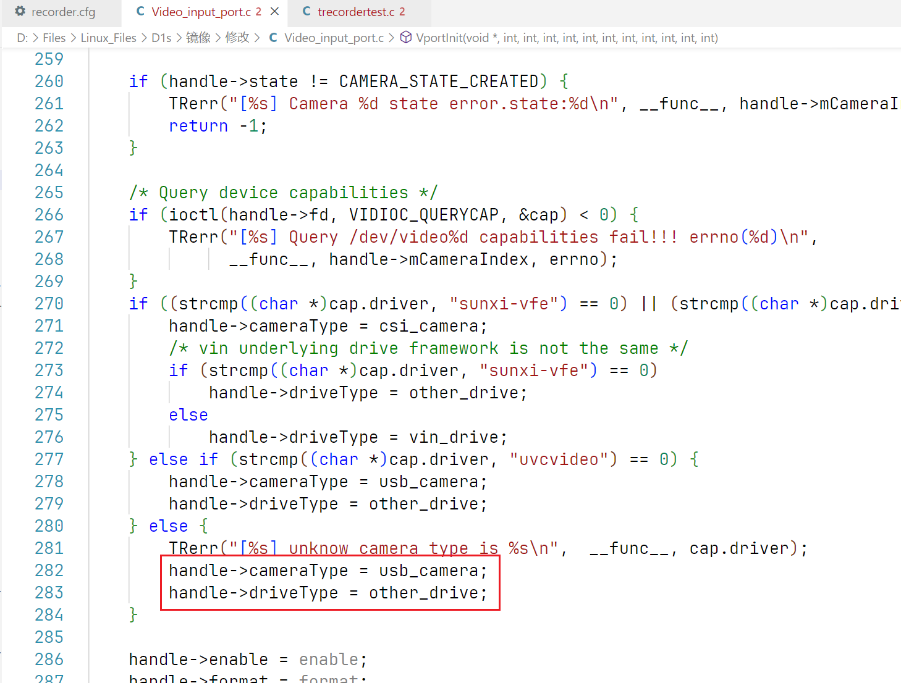

### 修改recorder.cfg

进入目录：

~~~bash
cd /home/ubuntu/tina-d1-h/out/d1s-cvbs/compile_dir/target/libcedarx/trecorder/
~~~

如下：

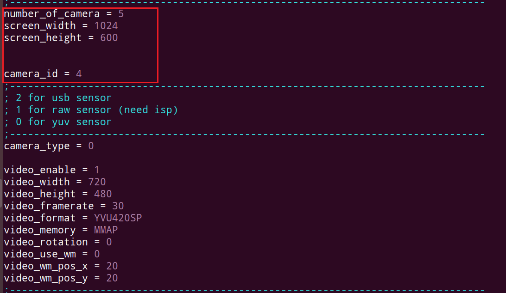

修改为：

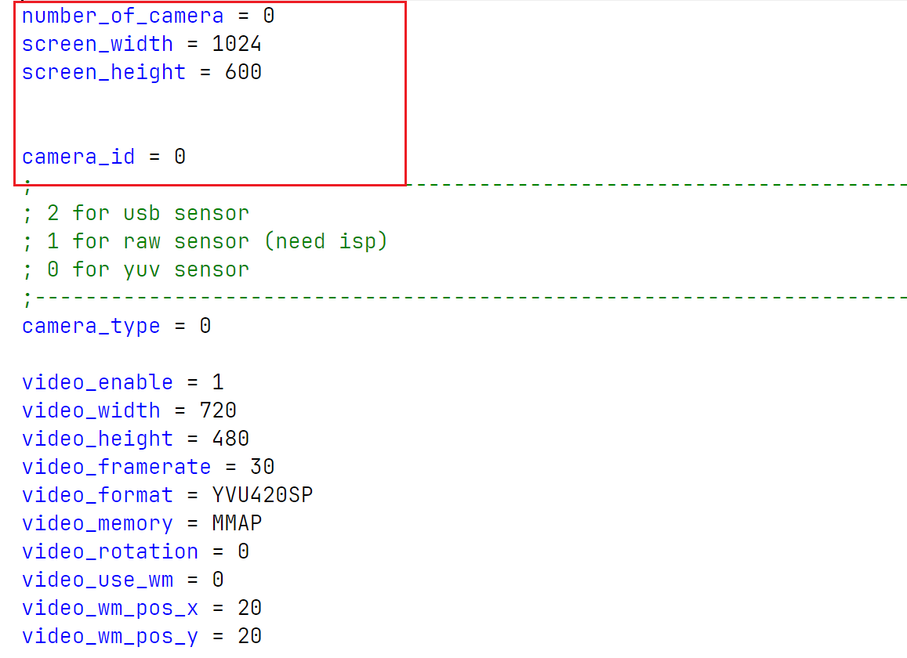

主要修改camera_id这个参数，不改出现以下错误：

> 0对应/dev/video0，1对应/dev/video1

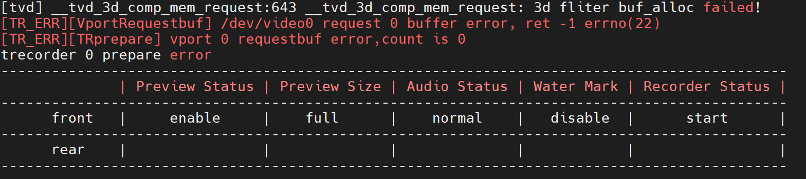

### 使用trecorderdemo测试

> 回到SDK根目录`make menuconfig`。

~~~bash
-> Allwinner
	-> tina_multimedia_demo
~~~

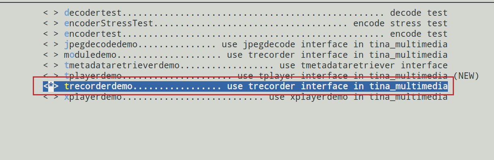

`make menuconfig`修改后发现保存不了，那就只能手动修改相应的`deconfig`文件了：

进入目录：

~~~bash
cd tina-d1-h/target/allwinner/d1s-cvbs/defconfig
~~~

添加：

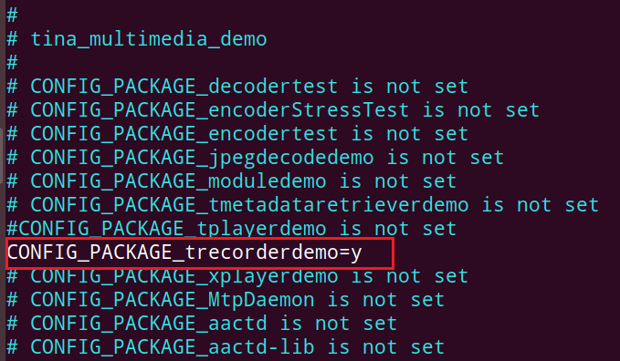

### 测试

> 自带的测试程序只能使用/dev/video0节点。

查看是否有/dev/video0节点。

假如只有/dev/vide04，可以使用以下指令：

~~~bash
ln -s /dev/video4 /dev/video0
~~~

测试：

~~~bash
trecorderdemo 0
~~~

### 参考文档

[Tina_Linux_多媒体编码_开发指南.pdf (whycan.com)](https://whycan.com/files/202202/A133_documents/基础组件开发指南/Tina_Linux_多媒体编码_开发指南.pdf)

[全志T113接CVBS摄像头怎么打开VIDEO 节点？ | 全志在线开发者论坛 (aw-ol.com)](https://bbs.aw-ol.com/topic/3147/全志t113接cvbs摄像头怎么打开video-节点/8)

[让T113-S3的TVIN吃上trecorder的本地预览套餐 | 全志在线开发者论坛 (aw-ol.com)](https://bbs.aw-ol.com/topic/2103/让t113-s3的tvin吃上trecorder的本地预览套餐)

