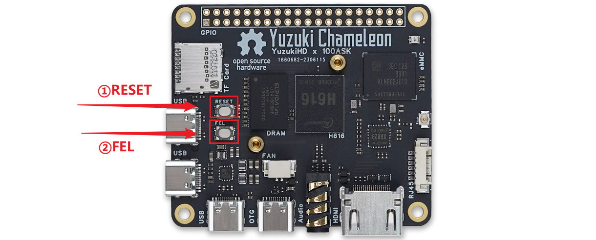
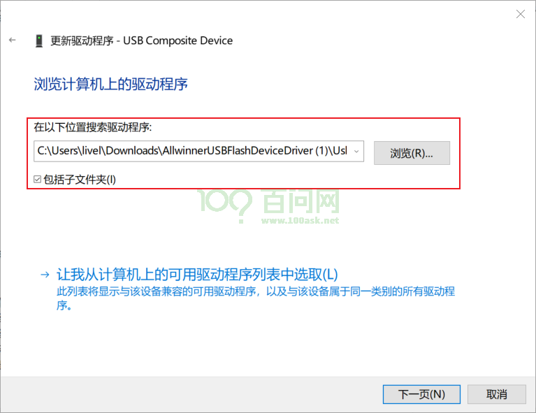
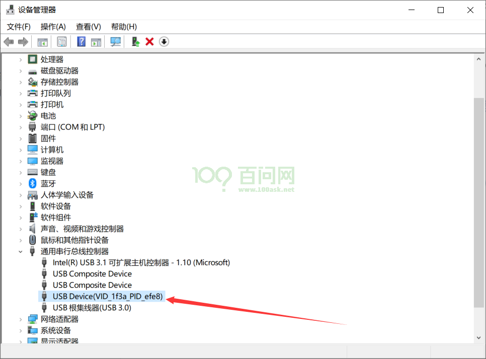
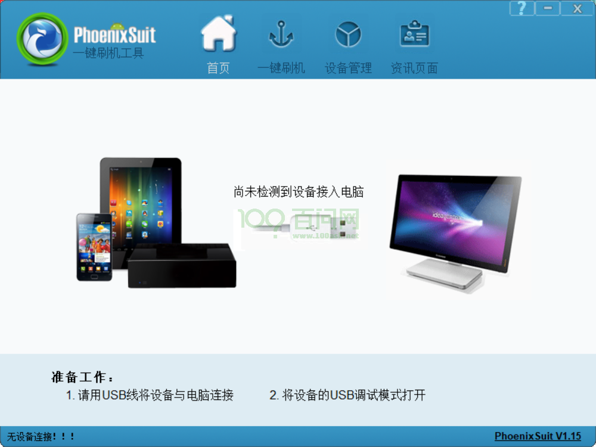
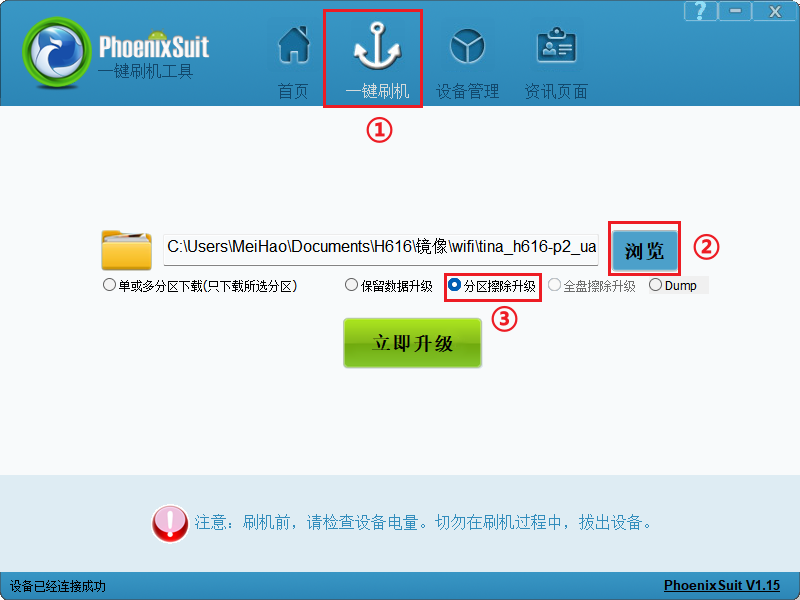
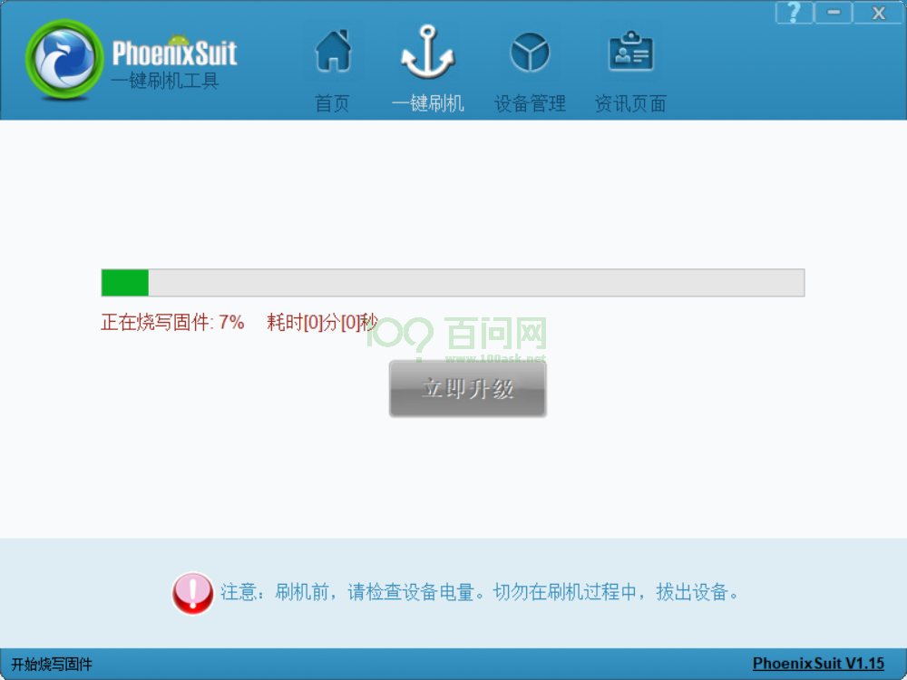
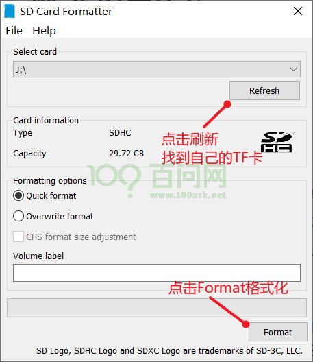
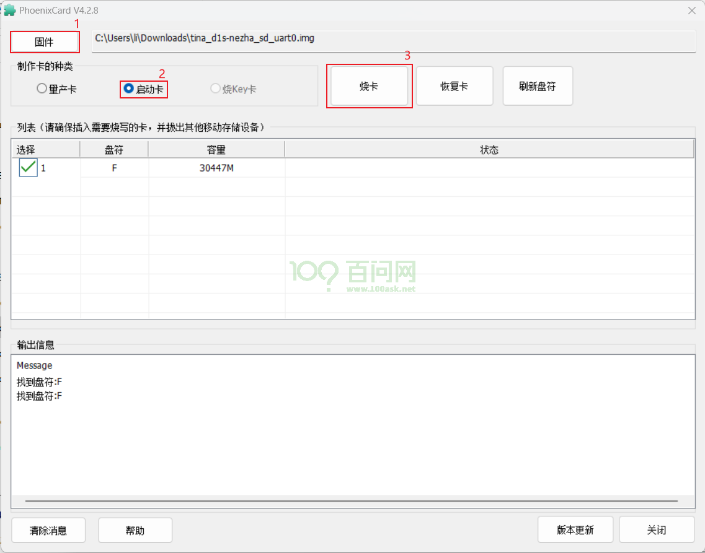
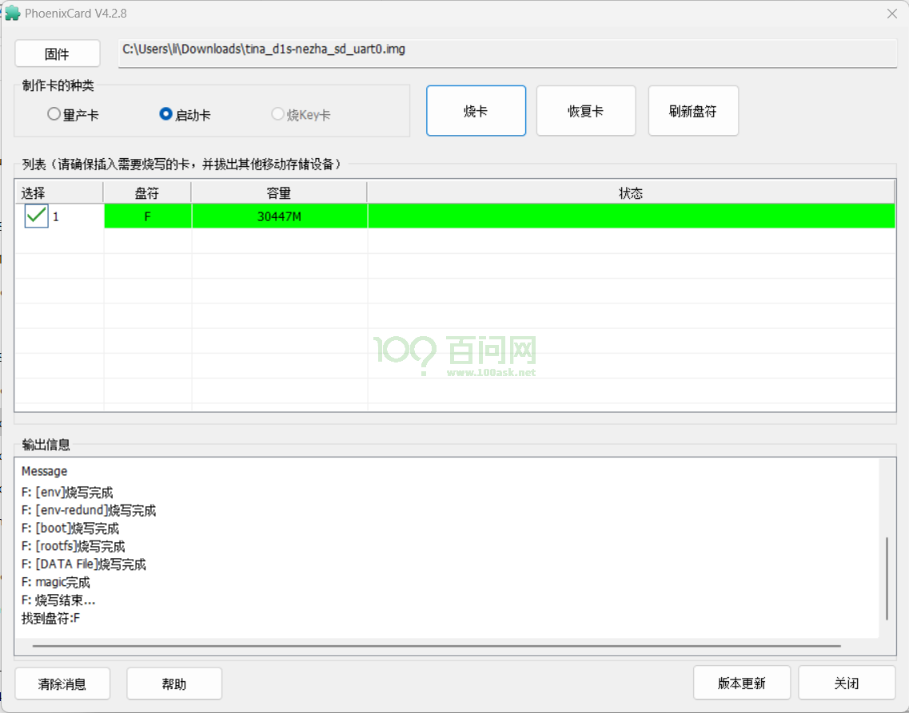

# 更新系统固件

## 烧写固件至EMMC
### 准备工作
**硬件：**
* 变色龙-H616（YuzuKiHD-Chamelen）主板 x1
* TypeC线 X1
* 串口模块 x1

**软件：**
* 全志线刷工具：[AllwinnertechPhoeniSuit.zip](https://dl.100ask.net/Hardware/MPU/T113i-Industrial/Tools/AllwinnertechPhoeniSuit.zip)
* 全志USB烧录驱动：[AllwinnerUSBFlashDeviceDriver.zip](https://dl.100ask.net/Hardware/MPU/T113i-Industrial/Tools/AllwinnerUSBFlashDeviceDriver.zip)
* 镜像：[H616-YuzuKiHD-Chamelen-DefaultSystem.7z](https://dl.100ask.net/Hardware/MPU/H616-YuzuKiHD-Chamelen/Images/H616-YuzuKiHD-Chamelen-DefaultSystem.7z)
> 镜像说明：支持文档描述所有板载功能。md5值是 591c795abbca391626cf31d573b9cbde

### 连接开发板

参考前面章节《启动开发板》，连接开发板，为后面更新系统固件做准备。

### 安装usb驱动
连接好开发板以后，先**按住** H616-YuzukiHD-Chameleon 开发板 烧录模式按键 也称为**②FEL** 烧写模式按键，之后**按一下** 系统复位按键 也称 **①RESET** 复位键，就可以自动进入烧写模式。



这时我们可以看到电脑设备管理器  **通用串行总线控制器** 部分弹出一个  未知设备 ，这个时候我们就需要把我们提前下载好的 **全志USB烧录驱动** 进行修改，然后将解压缩过的 **全志USB烧录驱动**  压缩包，解压缩，可以看到里面有这么几个文件。

```bash
InstallUSBDrv.exe
drvinstaller_IA64.exe
drvinstaller_X86.exe
UsbDriver/          
drvinstaller_X64.exe   
install.bat
```

对于wind7系统的同学，只需要以管理员 打开   `install.bat` 脚本，等待安装，在弹出的 是否安装驱动的对话框里面，点击安装即可。

对于wind10/wind11系统的同学，需要在设备管理器里面进行手动安装驱动。

如下图所示，在第一次插入OTG设备，进入烧写模式设备管理器会弹出一个未知设备。


接下来鼠标右键点击这个未知设备，在弹出的对话框里， 点击浏览我计算机以查找驱动程序软件。


之后在弹出新的对话框里，点击浏览找到我们之前下载好的 usb烧录驱动文件夹内，找到 `UsbDriver/` 这个目录，并进入，之后点击确定即可。



注意进入到  `UsbDriver/`  文件夹，然后点击确定，如下图所示。


此时，我们继续点击 **下一页** 按钮，这时系统就会提示安装一个驱动程序。 

在弹出的对话框里，我们点击 始终安装此驱动程序软件 等待安装完成。


安装完成后，会提示，Windows已成功更新你的驱动程序。


最后我们可以看到，设备管理器 里面的未知设备 变成了一个 `USB Device(VID_1f3a_efe8)`的设备，这时就表明设备驱动已经安装成功。




### 运行软件烧写
将下载下来的全志线刷工具 **AllwinnertechPhoeniSuit** 解压缩，同时将 **EMMC系统镜像** 下载下来也进行解压缩。如果没有镜像提供，可以通过后面章节自行编译镜像。解压后，得到一个 **tina_h616-p2_uart0.img** 镜像，是用于烧录至 EMMC。另一个是**AllwinnertechPhoeniSuit**文件夹。首先我们进入到 **AllwinnertechPhoeniSuit\AllwinnertechPhoeniSuitRelease20201225** 目录下 找到 **PhoenixSuit.exe** 双击运行。

打开软件后 软件主界面如下图所示：




接下来 我们需要切换到 **一键刷机**窗口，如下图所示，点击红框标号① **一键刷机**，在弹出的新窗口内，我们点击 红框② **浏览** 找到我们的 EMMC 系统镜像  **tina_h616-p2_uart0.img** ，选中镜像后，最后点击红框③ **分区擦除升级** 



点击完成后，不需要点击 **立即升级** ，也不需要理会其他信息，这时 我们拿起已经连接好的开发板，先按住 **FEL** 烧写模式按键，之后按一下 **RESET** 系统复位键，就可以自动进入烧写模式并开始烧写。



烧写时会提示烧写进度条，烧写完成后 开发板会自己重启。

### 启动系统

一般情况下，烧写成功后 都会自动重启 启动系统，此时我们进入到 串口终端，可以看到它的启动信息，等所有启动信息加载完成。

~~~bash
[143]HELLO! BOOT0 is starting Aug  6 2020 15:38:24!
[148]BOOT0 commit : b2b1d75
[151]set pll start
[154]periph0 has been enabled
[157]set pll end
[159]unknow PMU
[160]unknow PMU
[162]PMU: AXP1530
[169]vaild para:1  select dram para0
[173]board init ok
[175]DRAM BOOT DRIVE INFO: V0.52
[178]the chip id is 0x5000
[181]chip id check OK
[183]DRAM_VCC set to 1500 mv
[186]DRAM CLK =720 MHZ
[188]DRAM Type =3 (3:DDR3,4:DDR4,7:LPDDR3,8:LPDDR4)
[195]Actual DRAM SIZE =512 M
[197]DRAM SIZE =512 MBytes, para1 = 30fa, para2 = 2000001, dram_tpr13 = 6041
[211]DRAM simple test OK.
[213]rtc standby flag is 0x0, super standby flag is 0x0
[218]dram size =512
[221]card no is 2
[223]sdcard 2 line count 8
[226][mmc]: mmc driver ver 2019-12-19 10:41
[230][mmc]: set f_max to 50M, set f_max_ddr to 50M
[235][mmc]: mmc 2 bias 4
[243][mmc]: ***Try MMC card 2***
[258][mmc]: MMC 5.1
[260][mmc]: HSDDR52/DDR50 8 bit
[263][mmc]: 50000000 Hz
[265][mmc]: 7456 MB
[267][mmc]: ***SD/MMC 2 init OK!!!***
[327]Loading boot-pkg Succeed(index=0).
[330]Entry_name        = u-boot
[339]Entry_name        = monitor
[343]Entry_name        = dtbo
[346]Entry_name        = dtb
[349]tunning data addr:0x4a0003e8
[353]Jump to second Boot.
NOTICE:  BL3-1: v1.0(debug):6a92f45
NOTICE:  BL3-1: Built : 17:13:06, 2020-07-30
NOTICE:  BL3-1 commit: 8
ERROR:   Error initializing runtime service tspd_fast
NOTICE:  BL3-1: Preparing for EL3 exit to normal world
NOTICE:  BL3-1: Next image address = 0x4a000000
▒OTICE:  BL3-1: Next image spsr = 0x1d3

U-Boot 2018.05-00003-gec92168 (Aug 06 2020 - 15:40:52 +0800) Allwinner Technology

[00.427]CPU:   Allwinner Family
[00.430]Model: sun50iw9
I2C:   ready
[00.434]DRAM:  512 MiB
[00.437]Relocation Offset is: 15ec5000
[00.474]secure enable bit: 0
[00.477]pmu_axp152_probe pmic_bus_read fail
[00.481]PMU: AXP1530
[00.485]CPU=1008 MHz,PLL6=600 Mhz,AHB=200 Mhz, APB1=100Mhz  MBus=400Mhz
[00.494]drv_disp_init
[00.524]__clk_enable: clk is null.
[00.530]drv_disp_init finish
[00.532]gic: sec monitor mode
[00.561]flash init start
[00.563]workmode = 0,storage type = 2
[00.567]MMC:     2
[00.568]get mem for descripter OK !
[00.577]get sdc2 sdc_boot0_sup_1v8 fail.
[00.582]io is 1.8V

[00.605]already at HSSDR52_SDR25 mode
[00.608]sunxi flash init ok
[00.611]Loading Environment from SUNXI_FLASH... OK
[00.621]Item0 (Map) magic is bad
[00.624]the secure storage item0 copy0 is bad
[00.628]Item0 (Map) magic is bad
[00.631]Item0 (Map) magic is bad
[00.634]usb burn from boot
delay time 0
weak:otg_phy_config
[00.647]usb prepare ok
[00.838]usb sof ok
[00.839]usb probe ok
[00.841]usb setup ok
set address 0x37
set address 0x37 ok
set address 0x38
set address 0x38 ok
try to update
[03.847]do_burn_from_boot usb : have no handshake
[03.851]boot_gui_init:start
partno erro : can't find partition Reserve0
[03.863]Get Reserve0 partition number fail!
[04.131]boot_gui_init:finish
[04.134]bmp_name=bootlogo.bmp
38454 bytes read in 1 ms (36.7 MiB/s)
[04.147]hsddr 2-50000000
[04.149]hs200 5-200000000
[04.152]hs400 2-50000000
[04.154]get max-frequency ok 100000000 Hz
[04.158]0 0 0: 0 0 0
[04.160]get max-frequency ok 50000000 Hz
[04.166]update dts
** Unrecognized filesystem type **
[04.181]load file(ULI/factory/rootwait init.txt) error.
** Unrecognized filesystem type **
[04.192]load file(ULI/factory/snum.txt) error.
** Unrecognized filesystem type **
[04.202]load file(ULI/factory/mac.txt) error.
** Unrecognized filesystem type **
[04.213]load file(ULI/factory/wifi_mac.txt) error.
** Unrecognized filesystem type **
[04.224]load file(ULI/factory/bt_mac.txt) error.
** Unrecognized filesystem type **
[04.234]load file(ULI/factory/selinux.txt) error.
** Unrecognized filesystem type **
[04.245]load file(ULI/factory/specialstr.txt) error.
[04.253]update part info
[04.275]update bootcmd
[04.277]No ethernet found.
Hit any key to stop autoboot:  0
Android's image name: h616-p2
[04.494]Starting kernel ...

[04.497]mmc exit start
[04.513]mmc 2 exit ok
[    0.000000] Booting Linux on physical CPU 0x0
[    0.000000] Linux version 4.9.170 (ubuntu@dshanpi) (gcc version 6.4.1 (OpenWrt/Linaro GCC 6.4-2017.11 2017-11) ) #9 SMP PREEMPT Wed Aug 14 10:25:35 UTC 2024
[    0.000000] Boot CPU: AArch64 Processor [410fd034]
[    0.000000] bootconsole [earlycon0] enabled
[    0.000000] disp reserve base 0x5bf2d900 ,size 0x384000
[    0.000000] cma: Reserved 64 MiB at 0x0000000057c00000
[    0.000000] On node 0 totalpages: 131072
[    0.000000]   DMA zone: 2048 pages used for memmap
[    0.000000]   DMA zone: 0 pages reserved
[    0.000000]   DMA zone: 131072 pages, LIFO batch:31
[    0.000000] psci: probing for conduit method from DT.
[    0.000000] psci: PSCIv1.0 detected in firmware.
[    0.000000] psci: Using standard PSCI v0.2 function IDs
[    0.000000] psci: Trusted OS migration not required
[    0.000000] psci: SMC Calling Convention v1.0
[    0.000000] percpu: Embedded 21 pages/cpu @ffffffc01ff08000 s47128 r8192 d30696 u86016
[    0.000000] pcpu-alloc: s47128 r8192 d30696 u86016 alloc=21*4096
[    0.000000] pcpu-alloc: [0] 0 [0] 1 [0] 2 [0] 3
[    0.000000] Detected VIPT I-cache on CPU0
[    0.000000] CPU features: enabling workaround for ARM erratum 845719
[    0.000000] Built 1 zonelists in Zone order, mobility grouping on.  Total pages: 129024
[    0.000000] Kernel command line: earlyprintk=sunxi-uart,0x05000000 initcall_debug=0 console=ttyS0,115200 loglevel=8 root=/dev/mmcblk0p4 rootwait init=/pseudo_init partitions=bootloader@mmcblk0p1:env@mmcblk0p2:boot@mmcblk0p3:rootfs@mmcblk0p4:rootfs_data@mmcblk0p5:misc@mmcblk0p6:private@mmcblk0p7:UDISK@mmcblk0p8 cma=64M snum=0c00142873038681d4e mac_addr= wifi_mac= bt_mac= selinux=0 specialstr= gpt=1 androidboot.mode=normal androidboot.serialno=0c00142873038681d4e androidboot.hardware=sun50iw9p1 boot_type=2 androidboot.boot_type=2 androidboot.secure_os_exist=0 gpt=1 uboot_message=2018.05-00003-gec92168(08/06/2020-15:40:52) disp_reserve=3686400,0x5bf2d900 bootreason=unknow
[    0.000000] log_buf_len individual max cpu contribution: 4096 bytes
[    0.000000] log_buf_len total cpu_extra contributions: 12288 bytes
[    0.000000] log_buf_len min size: 16384 bytes
[    0.000000] log_buf_len: 32768 bytes
[    0.000000] early log buf free: 14164(86%)
[    0.000000] PID hash table entries: 2048 (order: 2, 16384 bytes)
[    0.000000] Dentry cache hash table entries: 65536 (order: 7, 524288 bytes)
[    0.000000] Inode-cache hash table entries: 32768 (order: 6, 262144 bytes)
[    0.000000] Memory: 407236K/524288K available (8510K kernel code, 964K rwdata, 2652K rodata, 512K init, 502K bss, 51516K reserved, 65536K cma-reserved)
[    0.000000] Virtual kernel memory layout:
[    0.000000]     modules : 0xffffff8000000000 - 0xffffff8008000000   (   128 MB)
[    0.000000]     vmalloc : 0xffffff8008000000 - 0xffffffbebfff0000   (   250 GB)
[    0.000000]       .text : 0xffffff8008080000 - 0xffffff80088d0000   (  8512 KB)
[    0.000000]     .rodata : 0xffffff80088d0000 - 0xffffff8008b70000   (  2688 KB)
[    0.000000]       .init : 0xffffff8008b70000 - 0xffffff8008bf0000   (   512 KB)
[    0.000000]       .data : 0xffffff8008bf0000 - 0xffffff8008ce1008   (   965 KB)
[    0.000000]        .bss : 0xffffff8008ce1008 - 0xffffff8008d5e87c   (   503 KB)
[    0.000000]     fixed   : 0xffffffbefe7fb000 - 0xffffffbefec00000   (  4116 KB)
[    0.000000]     PCI I/O : 0xffffffbefee00000 - 0xffffffbeffe00000   (    16 MB)
[    0.000000]     vmemmap : 0xffffffbf00000000 - 0xffffffc000000000   (     4 GB maximum)
[    0.000000]               0xffffffbf00000000 - 0xffffffbf00800000   (     8 MB actual)
[    0.000000]     memory  : 0xffffffc000000000 - 0xffffffc020000000   (   512 MB)
[    0.000000] SLUB: HWalign=64, Order=0-3, MinObjects=0, CPUs=4, Nodes=1
[    0.000000] Preemptible hierarchical RCU implementation.
[    0.000000]  Build-time adjustment of leaf fanout to 64.
[    0.000000] NR_IRQS:64 nr_irqs:64 0
[    0.000000] clocksource: timer: mask: 0xffffffff max_cycles: 0xffffffff, max_idle_ns: 79635851949 ns
[    0.000000] arm_arch_timer: Architected cp15 timer(s) running at 24.00MHz (virt).
[    0.000000] clocksource: arch_sys_counter: mask: 0xffffffffffffff max_cycles: 0x588fe9dc0, max_idle_ns: 440795202592 ns
[    0.000006] sched_clock: 56 bits at 24MHz, resolution 41ns, wraps every 4398046511097ns
[    0.008155] Calibrating delay loop (skipped), value calculated using timer frequency.. 48.00 BogoMIPS (lpj=80000)
[    0.018197] pid_max: default: 32768 minimum: 301
[    0.023299] Security Framework initialized
[    0.026882] SELinux:  Disabled at boot.
[    0.030867] Mount-cache hash table entries: 1024 (order: 1, 8192 bytes)
[    0.037274] Mountpoint-cache hash table entries: 1024 (order: 1, 8192 bytes)
[    0.048167] sched-energy: CPU device node has no sched-energy-costs
[    0.050528] Invalid sched_group_energy for CPU0
[    0.055071] CPU0: update cpu_capacity 1024
[    0.069199] ASID allocator initialised with 32768 entries
[    0.086481] BOOTEVENT:        86.468290: ON
[    0.116149] Detected VIPT I-cache on CPU1
[    0.116213] Invalid sched_group_energy for CPU1
[    0.116217] CPU1: update cpu_capacity 1024
[    0.116220] CPU1: Booted secondary processor [410fd034]
[    0.139565] Detected VIPT I-cache on CPU2
[    0.139623] Invalid sched_group_energy for CPU2
[    0.139626] CPU2: update cpu_capacity 1024
[    0.139629] CPU2: Booted secondary processor [410fd034]
[    0.162968] Detected VIPT I-cache on CPU3
[    0.163022] Invalid sched_group_energy for CPU3
[    0.163027] CPU3: update cpu_capacity 1024
[    0.163030] CPU3: Booted secondary processor [410fd034]
[    0.163140] Brought up 4 CPUs
[    0.197139] SMP: Total of 4 processors activated.
[    0.201831] CPU features: detected feature: 32-bit EL0 Support
[    0.207637] CPU features: detected feature: Kernel page table isolation (KPTI)
[    0.218186] CPU: All CPU(s) started at EL1
[    0.218907] alternatives: patching kernel code
[    0.223829] Invalid sched_group_energy for CPU3
[    0.227834] Invalid sched_group_energy for Cluster3
[    0.232681] Invalid sched_group_energy for CPU2
[    0.237187] Invalid sched_group_energy for Cluster2
[    0.242040] Invalid sched_group_energy for CPU1
[    0.246547] Invalid sched_group_energy for Cluster1
[    0.251399] Invalid sched_group_energy for CPU0
[    0.255907] Invalid sched_group_energy for Cluster0
[    0.262883] devtmpfs: initialized
[    0.538326] clocksource: jiffies: mask: 0xffffffff max_cycles: 0xffffffff, max_idle_ns: 6370867519511994 ns
[    0.538426] futex hash table entries: 1024 (order: 5, 131072 bytes)
[    0.541353] atomic64_test: passed
[    0.541401] pinctrl core: initialized pinctrl subsystem
[    0.545799] NET: Registered protocol family 16
[    0.549984] dump_class_init,861, success
[    0.553770] sunxi iommu: irq = 8
[    0.554859] vdso: 2 pages (1 code @ ffffff80088d6000, 1 data @ ffffff8008bf4000)
[    0.560825] DMA: preallocated 256 KiB pool for atomic allocations
[    0.569666] sun50iw9p1-r-pinctrl r_pio: initialized sunXi PIO driver
[    0.641309] sun50iw9p1-pinctrl pio: initialized sunXi PIO driver
[    0.654131] iommu: Adding device 1c0e000.ve to group 0
[    0.655693] iommu: Adding device 1c00000.vp9 to group 0
[    0.693196] iommu: Adding device 1000000.disp to group 0
[    0.698924] iommu: Adding device 1480000.g2d to group 0
[    0.710855] iommu: Adding device csi0 to group 0
[    0.712369] iommu: Adding device csi1 to group 0
[    0.716332] iommu: Adding device 6600800.vind:scaler@0 to group 0
[    0.717480] iommu: Adding device 6600800.vind:scaler@1 to group 0
[    0.718657] iommu: Adding device 6600800.vind:scaler@2 to group 0
[    0.719735] iommu: Adding device 6600800.vind:scaler@3 to group 0
[    0.723215] iommu: Adding device 6600800.vind:scaler@4 to group 0
[    0.729336] iommu: Adding device 6600800.vind:scaler@5 to group 0
[    0.737302] iommu: Adding device vinc0 to group 0
[    0.740523] iommu: Adding device vinc1 to group 0
[    0.748356] iommu: Adding device 1420000.deinterlace to group 0
[    0.875734] pwm module init!
[    0.890632] sunxi-pm debug v3.10
[    0.894872] SCSI subsystem initialized
[    0.896508] usbcore: registered new interface driver usbfs
[    0.896923] usbcore: registered new interface driver hub
[    0.897254] usbcore: registered new device driver usb
[    0.898017] sunxi_i2c_adap_init()2522 - init
[    0.899100] sunxi_i2c_probe()2209 - [i2c3] warning: failed to get regulator id
[    0.903888] sunxi_i2c_probe()2271 - [i2c3] twi_drv_used = 0
[    0.909150] sunxi_i2c_probe()2275 - [i2c3] twi_pkt_interval = 0
[    0.915037] twi3 supply twi not found, using dummy regulator
[    0.920970] twi_request_gpio()452 - [i2c3] init name: twi3
[    0.928050] sunxi_i2c_probe()2209 - [i2c5] warning: failed to get regulator id
[    0.933606] sunxi_i2c_probe()2271 - [i2c5] twi_drv_used = 0
[    0.938875] sunxi_i2c_probe()2275 - [i2c5] twi_pkt_interval = 0
[    0.944758] twi5 supply twi not found, using dummy regulator
[    0.950631] twi_request_gpio()452 - [i2c5] init name: twi5
[    0.957701] axp20x-i2c 5-0036: AXP20x variant AXP1530 found
[    0.963803] axp2101-regulator axp2101-regulator.0: Setting DCDC frequency for unsupported AXP variant
[    0.970600] axp2101-regulator axp2101-regulator.0: Error setting dcdc frequency: -22
[    0.994108] axp20x-i2c 5-0036: AXP20X driver loaded
[    0.994904] media: Linux media interface: v0.10
[    0.995242] Linux video capture interface: v2.00
[    0.998238] ion_parse_dt_heap_common: id 0 type 0 name sys_user align 1000
[    0.999852] ion_parse_dt_heap_common: id 4 type 4 name cma align 1000
[    1.006262] ion_parse_dt_heap_common: id 6 type 6 name secure align 1000
[    1.013347] drm config service not available: FFFFFFFF
[    1.018760] Advanced Linux Sound Architecture Driver Initialized.
[    1.026576] Bluetooth: Core ver 2.22
[    1.027142] NET: Registered protocol family 31
[    1.031343] Bluetooth: HCI device and connection manager initialized
[    1.037700] Bluetooth: HCI socket layer initialized
[    1.042546] Bluetooth: L2CAP socket layer initialized
[    1.047675] Bluetooth: SCO socket layer initialized
[    1.055173] [DISP]disp_module_init
[    1.058962] [DISP] disp_init,line:2216:
[    1.059442] smooth display screen:0 type:4 mode:10
[    1.077289] [DISP]disp_module_init finish
[    6.134686] sunxi_i2c_do_xfer()1928 - [i2c3] xfer timeout (dev addr:0x10)
[    6.134993] sunxi_i2c_do_xfer()1935 - [i2c5] incomplete xfer (status: 0x20, dev addr: 0x10)
[    6.135535] of_property_read_string ac200.tv_regulator_name fail
[    6.135589] [ac200] get ave_regulator_name failed!
[    6.139208] [ac200] pwm enable
[    6.142053] clocksource: Switched to clocksource arch_sys_counter
[    6.147959] VFS: Disk quotas dquot_6.6.0
[    6.151446] VFS: Dquot-cache hash table entries: 512 (order 0, 4096 bytes)
[    6.167209] udc_init,0
[    6.171286] thermal thermal_zone2: power_allocator: sustainable_power will be estimated
[    6.172392] thermal thermal_zone3: power_allocator: sustainable_power will be estimated
[    6.177041] NET: Registered protocol family 2
[    6.209330] TCP established hash table entries: 4096 (order: 3, 32768 bytes)
[    6.209456] TCP bind hash table entries: 4096 (order: 4, 65536 bytes)
[    6.209586] TCP: Hash tables configured (established 4096 bind 4096)
[    6.209778] UDP hash table entries: 256 (order: 1, 8192 bytes)
[    6.212714] UDP-Lite hash table entries: 256 (order: 1, 8192 bytes)
[    6.219952] NET: Registered protocol family 1
[    6.224949] RPC: Registered named UNIX socket transport module.
[    6.229174] RPC: Registered udp transport module.
[    6.233808] RPC: Registered tcp transport module.
[    6.238485] RPC: Registered tcp NFSv4.1 backchannel transport module.
[    6.245762] Trying to unpack rootfs image as initramfs...
[    6.251227] rootfs image is not initramfs (junk in compressed archive); looks like an initrd
[    6.267160] audit: initializing netlink subsys (disabled)
[    6.267388] audit: type=2000 audit(6.156:1): initialized
[    6.270258] workingset: timestamp_bits=45 max_order=17 bucket_order=0
[    6.388449] Registering sdcardfs 0.1
[    6.406109] fuse init (API version 7.26)
[    6.433967] io scheduler noop registered
[    6.434014] io scheduler deadline registered
[    6.436317] io scheduler cfq registered (default)
[    6.446494] failed to get standby led pin assign
[    6.446547] failed to get standby led pin assign
[    6.446724] gpio_pin_1(230) gpio_is_valid
[    6.447963] gpio name is PH6, ret = 0
[    6.448884] gpio_init finish with uesd
[    6.451453] reg-virt-consumer.1 supply dcdc1 not found, using dummy regulator
[    6.452984] reg-virt-consumer.2 supply dcdc2 not found, using dummy regulator
[    6.459951] reg-virt-consumer.3 supply dcdc3 not found, using dummy regulator
[    6.467057] reg-virt-consumer.4 supply aldo1 not found, using dummy regulator
[    6.474082] reg-virt-consumer.5 supply dldo1 not foun▒[    6.500794] console [ttyS0] enabled
[    6.500794] console [ttyS0] enabled
[    6.504811] bootconsole [earlycon0] disabled
[    6.504811] bootconsole [earlycon0] disabled
[    6.515607] uart uart1: get regulator failed
[    6.522486] uart1: ttyS1 at MMIO 0x5000400 (irq = 281, base_baud = 1500000) is a SUNXI
[    6.534686] misc dump reg init
[    6.541383] deinterlace 1420000.deinterlace: version[1.0.0], ip=0x300100
[    6.550138] Unable to detect cache hierarchy for CPU 0
[    6.613303] brd: module loaded
[    6.654858] loop: module loaded
[    6.662643] zram: Added device: zram0
[    6.667001] [NAND][NE] Not found valid nand node on dts
[    6.672930] Boot type 2
[    6.677149] sunxi-bt soc@03000000:bt: Missing bt_power.
[    6.683227] sunxi-bt soc@03000000:bt: bt_power_name ((null))
[    6.689619] sunxi-bt soc@03000000:bt: Missing bt_io_regulator.
[    6.696191] sunxi-bt soc@03000000:bt: io_regulator_name ((null))
[    6.703040] sunxi-bt soc@03000000:bt: bt_rst gpio=205  mul-sel=1  pull=-1  drv_level=-1  data=0
[    6.713027] sunxi-bt soc@03000000:bt: devm_pinctrl_get() failed!
[    6.721930] sunxi-wlan soc@03000000:wlan: wlan_busnum (1)
[    6.728041] sunxi-wlan soc@03000000:wlan: Missing wlan_power.
[    6.734523] sunxi-wlan soc@03000000:wlan: wlan_power_name ((null))
[    6.741486] sunxi-wlan soc@03000000:wlan: Missing wlan_io_regulator.
[    6.748649] sunxi-wlan soc@03000000:wlan: io_regulator_name ((null))
[    6.755858] sunxi-wlan soc@03000000:wlan: wlan_regon gpio=203  mul-sel=1  pull=-1  drv_level=-1  data=0
[    6.766509] sunxi-wlan soc@03000000:wlan: get gpio chip_en failed
[    6.773376] sunxi-wlan soc@03000000:wlan: get gpio power_en failed
[    6.780367] sunxi-wlan soc@03000000:wlan: wlan_hostwake gpio=204  mul-sel=6  pull=-1  drv_level=-1  data=0
[    6.793782] [ADDR_MGT] addr_mgt_probe: success.
[    6.806753] libphy: Fixed MDIO Bus: probed
[    6.811399] tun: Universal TUN/TAP device driver, 1.6
[    6.817097] tun: (C) 1999-2004 Max Krasnyansky <maxk@qualcomm.com>
[    6.827112] gmac-power0: NULL
[    6.830489] gmac-power1: NULL
[    6.833837] gmac-power2: NULL
[    6.840739] PPP generic driver version 2.4.2
[    6.846582] PPP BSD Compression module registered
[    6.851918] PPP Deflate Compression module registered
[    6.857656] PPP MPPE Compression module registered
[    6.863063] NET: Registered protocol family 24
[    6.868151] PPTP driver version 0.8.5
[    6.873034] usbcore: registered new interface driver r8152
[    6.879614] usbcore: registered new interface driver asix
[    6.885992] usbcore: registered new interface driver ax88179_178a
[    6.893159] usbcore: registered new interface driver cdc_ether
[    6.900022] usbcore: registered new interface driver net1080
[    6.906705] usbcore: registered new interface driver cdc_subset
[    6.913685] usbcore: registered new interface driver zaurus
[    6.920374] usbcore: registered new interface driver cdc_ncm
[    6.926765] ehci_hcd: USB 2.0 'Enhanced' Host Controller (EHCI) Driver
[    6.934642] get drv_vbus is fail, 84
[    6.938703] get ehci0-controller, regulator_io is no nocare
[    6.945645] [sunxi-ehci0]: probe, pdev->name: 5101000.ehci0-controller, sunxi_ehci: 0xffffff8008d48f28, 0x:ffffff80099b4000, irq_no:11d
[    6.959356] [sunxi-ehci0]: Not init ehci0
[    6.964257] get ehci1-controller, regulator_io is no nocare
[    6.971196] [sunxi-ehci1]: probe, pdev->name: 5200000.ehci1-controller, sunxi_ehci: 0xffffff8008d49270, 0x:ffffff80099b8000, irq_no:11f
[    6.985001] sunxi-ehci 5200000.ehci1-controller: SW USB2.0 'Enhanced' Host Controller (EHCI) Driver
[    6.995276] sunxi-ehci 5200000.ehci1-controller: new USB bus registered, assigned bus number 1
[    7.005821] sunxi-ehci 5200000.ehci1-controller: irq 287, io mem 0xffffff80099b8000
[    7.025402] sunxi-ehci 5200000.ehci1-controller: USB 0.0 started, EHCI 1.00
[    7.037358] hub 1-0:1.0: USB hub found
[    7.041763] hub 1-0:1.0: 1 port detected
[    7.048834] get drv_vbus is fail, 84
[    7.052870] get ehci2-controller, regulator_io is no nocare
[    7.059800] [sunxi-ehci2]: probe, pdev->name: 5310000.ehci2-controller, sunxi_ehci: 0xffffff8008d495b8, 0x:ffffff80099c2000, irq_no:121
[    7.073634] sunxi-ehci 5310000.ehci2-controller: SW USB2.0 'Enhanced' Host Controller (EHCI) Driver
[    7.083895] sunxi-ehci 5310000.ehci2-controller: new USB bus registered, assigned bus number 2
[    7.094294] sunxi-ehci 5310000.ehci2-controller: irq 289, io mem 0xffffff80099c2000
[    7.115406] sunxi-ehci 5310000.ehci2-controller: USB 0.0 started, EHCI 1.00
[    7.127356] hub 2-0:1.0: USB hub found
[    7.131746] hub 2-0:1.0: 1 port detected
[    7.138846] get drv_vbus is fail, 84
[    7.142886] get ehci3-controller, regulator_io is no nocare
[    7.150168] [sunxi-ehci3]: probe, pdev->name: 5311000.ehci3-controller, sunxi_ehci: 0xffffff8008d49900, 0x:ffffff80099cc000, irq_no:123
[    7.163987] sunxi-ehci 5311000.ehci3-controller: SW USB2.0 'Enhanced' Host Controller (EHCI) Driver
[    7.174256] sunxi-ehci 5311000.ehci3-controller: new USB bus registered, assigned bus number 3
[    7.184616] sunxi-ehci 5311000.ehci3-controller: irq 291, io mem 0xffffff80099cc000
[    7.205397] sunxi-ehci 5311000.ehci3-controller: USB 0.0 started, EHCI 1.00
[    7.217382] hub 3-0:1.0: USB hub found
[    7.221770] hub 3-0:1.0: 1 port detected
[    7.229201] ohci_hcd: USB 1.1 'Open' Host Controller (OHCI) Driver
[    7.236771] get drv_vbus is fail, 84
[    7.241958] get ohci0-controller, regulator_io is no nocare
[    7.249053] [sunxi-ohci0]: probe, pdev->name: 5101000.ohci0-controller, sunxi_ohci: 0xffffff8008d48208
[    7.259536] [sunxi-ohci0]: Not init ohci0
[    7.264428] get ohci1-controller, regulator_io is no nocare
[    7.271259] hci: request ohci1-controller gpio:232
[    7.276859] [sunxi-ohci1]: probe, pdev->name: 5200000.ohci1-controller, sunxi_ohci: 0xffffff8008d48550
[    7.287424] sunxi-ohci 5200000.ohci1-controller: SW USB2.0 'Open' Host Controller (OHCI) Driver
[    7.297307] sunxi-ohci 5200000.ohci1-controller: new USB bus registered, assigned bus number 4
[    7.307290] sunxi-ohci 5200000.ohci1-controller: irq 288, io mem 0x00000040
[    7.380113] hub 4-0:1.0: USB hub found
[    7.384507] hub 4-0:1.0: 1 port detected
[    7.391437] get drv_vbus is fail, 84
[    7.395495] get ohci2-controller, regulator_io is no nocare
[    7.402644] [sunxi-ohci2]: probe, pdev->name: 5310000.ohci2-controller, sunxi_ohci: 0xffffff8008d48898
[    7.413384] sunxi-ohci 5310000.ohci2-controller: SW USB2.0 'Open' Host Controller (OHCI) Driver
[    7.423282] sunxi-ohci 5310000.ohci2-controller: new USB bus registered, assigned bus number 5
[    7.433277] sunxi-ohci 5310000.ohci2-controller: irq 290, io mem 0x00000040
[    7.503464] hub 5-0:1.0: USB hub found
[    7.507852] hub 5-0:1.0: 1 port detected
[    7.514791] get drv_vbus is fail, 84
[    7.518854] get ohci3-controller, regulator_io is no nocare
[    7.525976] [sunxi-ohci3]: probe, pdev->name: 5311000.ohci3-controller, sunxi_ohci: 0xffffff8008d48be0
[    7.536552] sunxi-ohci 5311000.ohci3-controller: SW USB2.0 'Open' Host Controller (OHCI) Driver
[    7.546426] sunxi-ohci 5311000.ohci3-controller: new USB bus registered, assigned bus number 6
[    7.556433] sunxi-ohci 5311000.ohci3-controller: irq 292, io mem 0x00000040
[    7.626872] hub 6-0:1.0: USB hub found
[    7.631295] hub 6-0:1.0: 1 port detected
[    7.639015] usbcore: registered new interface driver uas
[    7.645581] usbcore: registered new interface driver usb-storage
[    7.652624] usbcore: registered new interface driver ums-alauda
[    7.659560] usbcore: registered new interface driver ums-cypress
[    7.666622] usbcore: registered new interface driver ums-datafab
[    7.673660] usbcore: registered new interface driver ums_eneub6250
[    7.680890] usbcore: registered new interface driver ums-freecom
[    7.687922] usbcore: registered new interface driver ums-isd200
[    7.694868] usbcore: registered new interface driver ums-jumpshot
[    7.702010] usbcore: registered new interface driver ums-karma
[    7.708868] usbcore: registered new interface driver ums-onetouch
[    7.716123] usbcore: registered new interface driver ums-realtek
[    7.723178] usbcore: registered new interface driver ums-sddr09
[    7.730123] usbcore: registered new interface driver ums-sddr55
[    7.737065] usbcore: registered new interface driver ums-usbat
[    7.744017] usb_serial_number:20080411
[    7.751379] input: sunxi-keyboard as /devices/virtual/input/input0
[    7.760309] usbcore: registered new interface driver xpad
[    7.766761] usbcore: registered new interface driver usb_acecad
[    7.773817] usbcore: registered new interface driver aiptek
[    7.780442] usbcore: registered new interface driver gtco
[    7.786863] usbcore: registered new interface driver hanwang
[    7.793556] usbcore: registered new interface driver kbtab
[    7.804035] sunxi-rtc rtc: rtc core: registered sunxi-rtc as rtc0
[    7.811177] sunxi-rtc rtc: RTC enabled
[    7.815481] sunxi_rtc_probe: bootup extend state 1
[    7.821799] i2c /dev entries driver
[    7.827975] IR NEC protocol handler initialized
[    7.833107] IR RC5(x/sz) protocol handler initialized
[    7.839715] sunxi_ir_startup: get ir protocol failed
[    7.845198] 7040000.s_cir supply ir0 not found, using dummy regulator
[    7.853446] Registered IR keymap rc_map_sunxi
[    7.860262] input: sunxi-ir as /devices/platform/soc/7040000.s_cir/rc/rc0/input1
[    7.869554] rc rc0: sunxi-ir as /devices/platform/soc/7040000.s_cir/rc/rc0
[    7.878954] sunxi cedar version 0.1
[    7.883230] VE: install start!!!
[    7.883230]
[    7.888814] cedar_ve: cedar-ve the get irq is 278
[    7.895448] VE: get debugfs_mpp_root is NULL, please check mpp
[    7.895448]
[    7.903700] VE: sunxi ve debug register driver failed!
[    7.903700]
[    7.917824] device-mapper: uevent: version 1.0.3
[    7.926196] device-mapper: ioctl: 4.35.0-ioctl (2016-06-23) initialised: dm-devel@redhat.com
[    7.936049] Bluetooth: HCI UART driver ver 2.3
[    7.941079] Bluetooth: HCI UART protocol H4 registered
[    7.946926] Bluetooth: HCI UART protocol LL registered
[    7.952719] Bluetooth: HCI UART protocol Three-wire (H5) registered
[    7.965325] sunxi-mmc sdc2: SD/MMC/SDIO Host Controller Driver(v3.35 2019-12-11 14:29)
[    7.974598] sunxi-mmc sdc2: ***ctl-spec-caps*** 8
[    7.981351] sunxi-mmc sdc2: No vdmmc regulator found
[    7.986963] sunxi-mmc sdc2: No vd33sw regulator found
[    7.992665] sunxi-mmc sdc2: No vd18sw regulator found
[    7.998358] sunxi-mmc sdc2: No vq33sw regulator found
[    8.004050] sunxi-mmc sdc2: No vq18sw regulator found
[    8.010868] sunxi-mmc sdc2: set host busy
[    8.015524] mmc:failed to get gpios
[    8.020293] sunxi-mmc sdc2: sdc set ios:clk 0Hz bm PP pm UP vdd 21 width 1 timing LEGACY(SDR12) dt B
[    8.045399] sunxi-mmc sdc2: sdc set ios:clk 400000Hz bm PP pm ON vdd 21 width 1 timing LEGACY(SDR12) dt B
[    8.072071] sunxi-mmc sdc2: detmode:alway in(non removable)
[    8.072096] sunxi-mmc sdc2: sdc set ios:clk 400000Hz bm PP pm ON vdd 21 width 1 timing LEGACY(SDR12) dt B
[    8.080524] sunxi-mmc sdc2: sdc set ios:clk 400000Hz bm PP pm ON vdd 21 width 1 timing LEGACY(SDR12) dt B
[    8.081624] sunxi-mmc sdc2: sdc set ios:clk 400000Hz bm OD pm ON vdd 21 width 1 timing LEGACY(SDR12) dt B
[    8.092518] sunxi-mmc sdc2: sdc set ios:clk 400000Hz bm OD pm ON vdd 21 width 1 timing LEGACY(SDR12) dt B
[    8.092613] sunxi-mmc sdc2: sdc set ios:clk 400000Hz bm OD pm ON vdd 21 width 1 timing LEGACY(SDR12) dt B
[    8.105495] sunxi-mmc sdc2: sdc set ios:clk 400000Hz bm OD pm ON vdd 21 width 1 timing LEGACY(SDR12) dt B
[    8.150509] sun50iw9p1-pinctrl pio: expect_func as:uart0_jtag, but muxsel(3) is func:jtag
[    8.159737] sun50iw9p1-pinctrl pio: expect_func as:uart0_jtag, but muxsel(3) is func:jtag
[    8.168979] sun50iw9p1-pinctrl pio: expect_func as:uart0_jtag, but muxsel(3) is func:uart0
[    8.178318] sun50iw9p1-pinctrl pio: expect_func as:uart0_jtag, but muxsel(3) is func:jtag
[    8.187579] sun50iw9p1-pinctrl pio: expect_func as:uart0_jtag, but muxsel(3) is func:uart0
[    8.196901] sunxi-mmc sdc2: sdc set ios:clk 400000Hz bm PP pm ON vdd 21 width 1 timing LEGACY(SDR12) dt B
[    8.207869] sun50iw9p1-pinctrl pio: expect_func as:uart0_jtag, but muxsel(3) is func:jtag
[    8.217971] sunxi-mmc sdc0: SD/MMC/SDIO Host Controller Driver(v3.35 2019-12-11 14:29)
[    8.227077] sunxi-mmc sdc0: ***ctl-spec-caps*** 8
[    8.233853] sunxi-mmc sdc2: sdc set ios:clk 400000Hz bm PP pm ON vdd 21 width 8 timing LEGACY(SDR12) dt B
[    8.246660] sunxi-mmc sdc0: No vqmmc regulator found
[    8.247131] sunxi-mmc sdc2: sdc set ios:clk 400000Hz bm PP pm ON vdd 21 width 8 timing MMC-HS200 dt B
[    8.247619] sunxi-mmc sdc2: sdc set ios:clk 50000000Hz bm PP pm ON vdd 21 width 8 timing MMC-HS200 dt B
[    8.247935] sunxi-mmc sdc2: sdc set ios:clk 50000000Hz bm PP pm ON vdd 21 width 8 timing MMC-HS(SDR20) dt B
[    8.248111] sunxi-mmc sdc2: sdc set ios:clk 50000000Hz bm PP pm ON vdd 21 width 8 timing MMC-HS(SDR20) dt B
[    8.248374] sunxi-mmc sdc2: sdc set ios:clk 50000000Hz bm PP pm ON vdd 21 width 8 timing MMC-HS400 dt B
[    8.248543] sunxi-mmc sdc2: sdc set ios:clk 50000000Hz bm PP pm ON vdd 21 width 8 timing MMC-HS400 dt B
[    8.248876] mmc0: new HS400 MMC card at address 0001
[    8.251378] mmcblk0: mmc0:0001 58A398 7.28 GiB
[    8.252405] mmcblk0boot0: mmc0:0001 58A398 partition 1 4.00 MiB
[    8.256597] mmcblk0boot1: mmc0:0001 58A398 partition 2 4.00 MiB
[    8.260766] mmcblk0rpmb: mmc0:0001 58A398 partition 3 4.00 MiB
[    8.264538]  mmcblk0: p1 p2 p3 p4 p5 p6 p7 p8
[    8.351886] sunxi-mmc sdc0: No vdmmc regulator found
[    8.358687] sunxi-mmc sdc0: set host busy
[    8.363436] sunxi-mmc sdc0: Got CD GPIO
[    8.368784] sunxi-mmc sdc0: sdc set ios:clk 0Hz bm PP pm UP vdd 21 width 1 timing LEGACY(SDR12) dt B
[    8.379121] sunxi-mmc sdc0: no vqmmc,Check if there is regulator
[    8.402062] sunxi-mmc sdc0: sdc set ios:clk 400000Hz bm PP pm ON vdd 21 width 1 timing LEGACY(SDR12) dt B
[    8.429201] sunxi-mmc sdc0: detmode:gpio irq
[    8.435357] sunxi-mmc sdc1: SD/MMC/SDIO Host Controller Driver(v3.35 2019-12-11 14:29)
[    8.444449] sunxi-mmc sdc1: ***ctl-spec-caps*** 8
[    8.449854] sunxi-mmc sdc1: No vmmc regulator found
[    8.455449] sunxi-mmc sdc1: No vqmmc regulator found
[    8.461045] sunxi-mmc sdc1: No vdmmc regulator found
[    8.466639] sunxi-mmc sdc1: No vd33sw regulator found
[    8.472330] sunxi-mmc sdc1: No vd18sw regulator found
[    8.478021] sunxi-mmc sdc1: No vq33sw regulator found
[    8.483711] sunxi-mmc sdc1: No vq18sw regulator found
[    8.490445] sunxi-mmc sdc1: set host busy
[    8.495110] mmc:failed to get gpios
[    8.499881] sunxi-mmc sdc1: sdc set ios:clk 0Hz bm PP pm UP vdd 21 width 1 timing LEGACY(SDR12) dt B
[    8.525398] sunxi-mmc sdc1: sdc set ios:clk 400000Hz bm PP pm ON vdd 21 width 1 timing LEGACY(SDR12) dt B
[    8.552069] sunxi-mmc sdc1: detmode:manually by software
[    8.552914] sunxi-mmc sdc1: smc 2 p1 err, cmd 52, RTO !!
[    8.558908] sunxi-mmc sdc1: smc 2 p1 err, cmd 52, RTO !!
[    8.564095] sunxi-mmc sdc1: sdc set ios:clk 400000Hz bm PP pm ON vdd 21 width 1 timing LEGACY(SDR12) dt B
[    8.572193] sunxi-mmc sdc1: sdc set ios:clk 400000Hz bm PP pm ON vdd 21 width 1 timing LEGACY(SDR12) dt B
[    8.574091] sunxi-mmc sdc1: smc 2 p1 err, cmd 5, RTO !!
[    8.584874] sunxi-mmc sdc1: smc 2 p1 err, cmd 5, RTO !!
[    8.595649] sunxi-mmc sdc1: smc 2 p1 err, cmd 5, RTO !!
[    8.601538] sunxi-mmc sdc1: smc 2 p1 err, cmd 5, RTO !!
[    8.606626] sunxi-mmc sdc1: sdc set ios:clk 0Hz bm PP pm OFF vdd 0 width 1 timing LEGACY(SDR12) dt B
[    8.631381] hidraw: raw HID events driver (C) Jiri Kosina
[    8.638787] sunxi-mmc sdc0: sdc set ios:clk 0Hz bm PP pm OFF vdd 0 width 1 timing LEGACY(SDR12) dt B
[    8.657192] usbcore: registered new interface driver usbhid
[    8.663496] usbhid: USB HID core driver
[    8.671053] ashmem: initialized
[    8.680212] optee: probing for conduit method from DT.
[    8.686044] optee: api uid mismatch
[    8.691719] usbcore: registered new interface driver snd-usb-audio
[    8.702685] [sunxi_hdmi_codec_init] driver and deivce register finished.
[    8.711768] failed get gpio-spdif gpio from dts,spdif_gpio:-2
[    8.723385] lineout_vol:26, linein_gain:3, fmin_gain:3, digital_vol:0, adcdrc_cfg:0, adchpf_cfg:0, dacdrc_cfg:0, dachpf_cfg:0, ramp_func_used:1, pa_msleep_time:100, pa_ctl_level:1, gpio-spk:229
[    8.747990] sunxi-codec-machine sndcodec: sun50iw9-codec <-> cpudai mapping ok
[    8.762112] sndhdmi sndhdmi: ASoC: CPU DAI (null) not registered
[    8.768920] sndhdmi sndhdmi: snd_soc_register_card() failed: -517
[    8.781965] sndspdif sndspdif: spdif-hifi <-> spdif mapping ok
[    8.796360] sunxi-ahub-cpudai 5097000.cpudai3-controller: ahub cpudai id invalid
[    8.804750] sunxi-ahub-cpudai: probe of 5097000.cpudai3-controller failed with error -22
[    8.814898] sun50iw9p1-pinctrl pio: expect_func as:h_pcm0, but muxsel(4) is func:h_i2s0
[    8.823951] sun50iw9p1-pinctrl pio: expect_func as:h_pcm0, but muxsel(4) is func:h_i2s0
[    8.832988] sun50iw9p1-pinctrl pio: expect_func as:h_pcm0, but muxsel(4) is func:h_i2s0
[    8.842014] sun50iw9p1-pinctrl pio: expect_func as:h_pcm0, but muxsel(4) is func:h_i2s0
[    8.851047] sun50iw9p1-pinctrl pio: expect_func as:h_pcm0, but muxsel(4) is func:h_i2s0
[    8.868977] sndahub sndahub: sunxi-ahub-aif1 <-> 5097000.cpudai0-controller mapping ok
[    8.881270] sndahub sndahub: sunxi-ahub-aif2 <-> 5097000.cpudai1-controller mapping ok
[    8.893073] sndahub sndahub: sunxi-ahub-aif3 <-> 5097000.cpudai2-controller mapping ok
[    8.912873] pktgen: Packet Generator for packet performance testing. Version: 2.75
[    8.922375] u32 classifier
[    8.925698]     Actions configured
[    8.929553] Netfilter messages via NETLINK v0.30.
[    8.934930] nfnl_acct: registering with nfnetlink.
[    8.941627] nf_conntrack version 0.5.0 (4096 buckets, 16384 max)
[    8.950083] ctnetlink v0.93: registering with nfnetlink.
[    8.960599] xt_time: kernel timezone is -0000
[    8.965723] ipip: IPv4 and MPLS over IPv4 tunneling driver
[    8.975057] gre: GRE over IPv4 demultiplexor driver
[    8.980595] ip_gre: GRE over IPv4 tunneling driver
[    8.992162] IPv4 over IPsec tunneling driver
[    9.000506] ip_tables: (C) 2000-2006 Netfilter Core Team
[    9.007563] arp_tables: arp_tables: (C) 2002 David S. Miller
[    9.014161] Initializing XFRM netlink socket
[    9.019056] IPsec XFRM device driver
[    9.031066] NET: Registered protocol family 10
[    9.046218] mip6: Mobile IPv6
[    9.049727] ip6_tables: (C) 2000-2006 Netfilter Core Team
[    9.061576] sit: IPv6, IPv4 and MPLS over IPv4 tunneling driver
[    9.075107] NET: Registered protocol family 17
[    9.080247] NET: Registered protocol family 15
[    9.085846] l2tp_core: L2TP core driver, V2.0
[    9.090801] l2tp_ppp: PPPoL2TP kernel driver, V2.0
[    9.096802] Registered cp15_barrier emulation handler
[    9.102524] Registered setend emulation handler
[    9.111109] registered taskstats version 1
[    9.118153] HDMI 2.0 driver init start!
[    9.122546] boot_hdmi=true
[    9.126497] Can not find the node of esm
[    9.130985] ERROR: pinctrl_get for HDMI2.0 DDC fail
[    9.136672] Get hdmi_power0:vcc-hdmi
[    9.140737] 6000000.hdmi supply vcc-hdmi not found, using dummy regulator
[    9.148865] Get hdmi_power1:vdd-hdmi
[    9.152919] 6000000.hdmi supply vdd-hdmi not found, using dummy regulator
[    9.163245] hdmi_cec_init
[    9.167489] [DISP] disp_device_attached,line:146:[    9.169234] HDMI2.0 module init end
[    9.170653] tv_probe()1435 - of_property_read_string tv_power failed!

[    9.183942] attached ok, mgr0<-->device0, type=4
[    9.189363] [HDMI receive params]: tv mode: 0xa format:0x1 data bits:0x0 eotf:0x4 cs:0x101 dvi_hdmi:2 range:2 scan:0 aspect_ratio:8
[    9.202705] [DISP] disp_hdmi_set_mode,line:648:
[    9.207619] hdmi_set_mode is null!
[    9.333865] sunxi-thermal 5070400.thermal_sensor: avcc is not calibrated
[    9.348852] cpu cpu1: opp_list_debug_create_link: Failed to create link
[    9.356333] cpu cpu1: _add_opp_dev: Failed to register opp debugfs (-12)
[    9.364080] cpu cpu2: opp_list_debug_create_link: Failed to create link
[    9.371541] cpu cpu2: _add_opp_dev: Failed to register opp debugfs (-12)
[    9.379167] cpu cpu3: opp_list_debug_create_link: Failed to create link
[    9.386628] cpu cpu3: _add_opp_dev: Failed to register opp debugfs (-12)
[    9.396175] random: fast init done
[    9.403216] sndhdmi sndhdmi: audiohdmi-dai <-> sunxi-ahub-cpu-aif1 mapping ok
[    9.413639] get det_vbus is fail, 84
[    9.417687] get id is fail, 84
[    9.421909] sunxi-rtc rtc: setting system clock to 1970-01-01 00:29:40 UTC (1780)
[    9.431285] snddaudio snddaudio0: codec: snd-soc-dummy, codec_dai: snd-soc-dummy-dai.
[    9.441327] snddaudio snddaudio0: snd-soc-dummy-dai <-> ahub_daudio0 mapping ok
[    9.452754] ALSA device list:
[    9.456110]   #0: audiocodec
[    9.459341]   #1: sndspdif
[    9.462375]   #2: sndahub
[    9.465302]   #3: sndhdmi
[    9.468237]   #4: snddaudio0
[    9.472274] RAMDISK: Couldn't find valid RAM disk image starting at 0.
[    9.481725] EXT4-fs (mmcblk0p4): couldn't mount as ext3 due to feature incompatibilities
[    9.495695] EXT4-fs (mmcblk0p4): mounted filesystem without journal. Opts: (null)
[    9.504202] VFS: Mounted root (ext4 filesystem) readonly on device 179:4.
[    9.512578] devtmpfs: mounted
[    9.516383] Freeing unused kernel memory: 512K
mount: mounting none on /dev failed: Device or resource busy
[    9.749085] EXT4-fs (mmcblk0p8): mounted filesystem with ordered data mode. Opts: (null)
skip mount overlayfs as now rootfs not squashfs
[    9.789539] EXT4-fs (mmcblk0p4): warning: mounting unchecked fs, running e2fsck is recommended
[    9.799566] EXT4-fs (mmcblk0p4): re-mounted. Opts: block_validity,delalloc,barrier,user_xattr
-- run rc.preboot --
mkdir: can't create directory '/mnt/UDISK/': File exists
mkdir: can't create directory '/mnt/Reserve0/': File exists
/etc/init.d/rcS: line 125: mkfs.vfat: not found
[   10.026686] FAT-fs (mmcblk0p1): Volume was not properly unmounted. Some data may be corrupt. Please run fsck.
-- run rc.final --
-- start log service --


BusyBox v1.27.2 () built-in shell (ash)

[   10.170222] random: dbus-uuidgen: uninitialized urandom read (12 bytes read)
 _____  _              __     _
[   10.182324] random: dbus-uuidgen: uninitialized urandom read (8 bytes read)
|_   _||_| ___  _ _   |  |   |_| ___  _ _  _ _
  | |   _ |   ||   |  |  |__ | ||   || | ||_'_|
  | |  | || | || _ |  |_____||_||_|_||___||_,_|
  |_|  |_||_|_||_|_|  Tina is Based on OpenWrt!
 ----------------------------------------------
 Tina Linux (Neptune, 5C1C9C53)
 ----------------------------------------------
failed to connect to ubus
root@TinaLinux:/# [   10.219287] file system registered
Failed to start message bus: Failed to bind socket "/var/run/dbus/system_bus_socket": Address already in use[   10.220870] random: dbus-daemon: uninitialized urandom read (12 bytes read)

[   10.281359] read descriptors
[   10.284642] read strings
[   11.183523] urandom_read: 1 callbacks suppressed
[   11.183528] random: ubusd: uninitialized urandom read (4 bytes read)
[   11.196151] random: ubusd: uninitialized urandom read (4 bytes read)
[   11.203306] random: ubusd: uninitialized urandom read (4 bytes read)
log: connected to ubus

root@TinaLinux:/# [   12.502046] hdmi_hpd_sys_config_release

root@TinaLinux:/# [   13.545383]
[   13.545383] insmod_device_driver
[   13.545383]
[   13.552778] device_chose finished 124!
[   13.777038] android_work: sent uevent USB_STATE=CONNECTED
[   13.993271] configfs-gadget gadget: high-speed config #1: c
[   13.999672] android_work: sent uevent USB_STATE=CONFIGURED
[   14.012158] android_work: sent uevent USB_STATE=DISCONNECTED
root@TinaLinux:/#
root@TinaLinux:/#
~~~

## 烧写固件至TF卡

### 准备工作
* 硬件：变色龙-H616（YuzuKiHD-Chamelen）主板 x1
* 硬件：USB Type-C线 x1
* 硬件：TF卡读卡器  x1
* 硬件：8GB以上的 Micro TF卡 x1
* 软件：Tina系统TF卡烧录工具: [PhoenixCard-V2.8](https://gitlab.com/dongshanpi/tools/-/raw/main/PhoenixCard-V2.8.zip)
* 软件：SDcard格式化工具：[SDCardFormatter5](https://gitlab.com/dongshanpi/tools/-/raw/main/SDCardFormatter5.0.1Setup.exe)


### 运行烧写软件烧写

首先需要下载  **win32diskimage  SDcard专用格式化** 这两个烧写TF卡的工具，然后可以根据开发环境搭建章节，打包出相应的镜像文件，这个文件就是我们要烧写的镜像。 同时解压缩 **Tina系统TF卡烧录工具 PhoenixCard-V2.8**，解压完成后，进入到烧写工具目录内，双击运行 `PhoenixCard.exe`烧录工具。具体步骤如下：


步骤一： 将TF卡插进读卡器内，同时将读卡器插到电脑USB接口，使用SD CatFormat格式化TF卡，注意备份卡内数据。参考下图所示，点击刷新找到TF卡，然后点击 Format 在弹出的 对话框 点击 **是(Yes)**等待格式完成即可。




步骤二：格式化完成后，使用**PhoenixCard.exe**工具来烧录镜像，参考下图步骤，找到自己的TF卡盘符，点击 `左上角红框1` 固件，选择已经解压过的 `tina_h616-p2_uart0.img` 镜像，然后点击 `红框2 启动卡`，最后点击`红框3 烧录` 等待烧录完成即可。



如下图为烧录成功示意图。




烧录完成以后，就可以弹出TF卡，并将其插到开发板正面 `TF卡卡槽`位置处，使用串口进行登录，也可以使用 adb shell 直接连接 ADB进行登录访问。

**注意：T113-i插上TF卡默认TF卡优先启动**