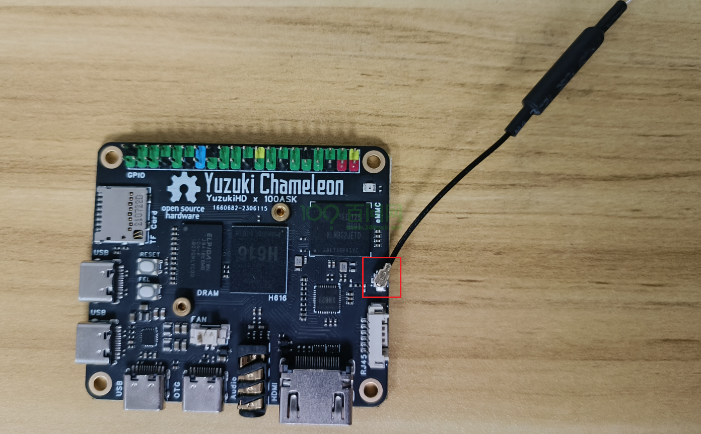
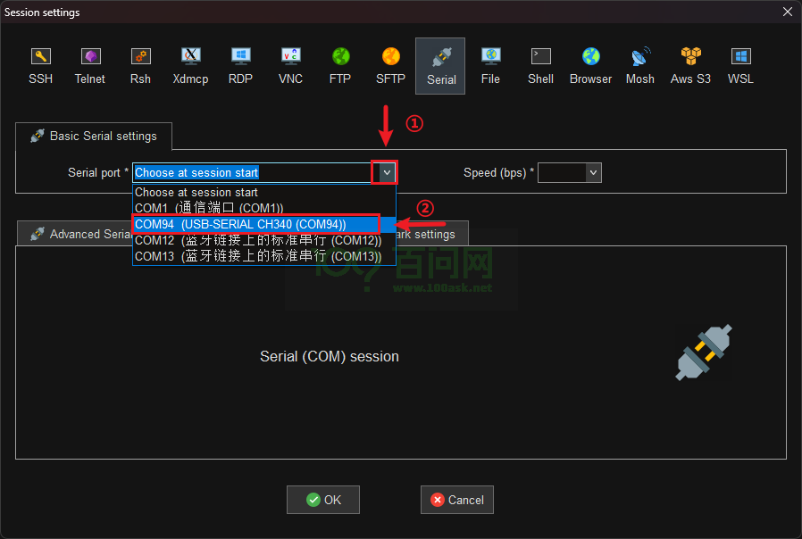
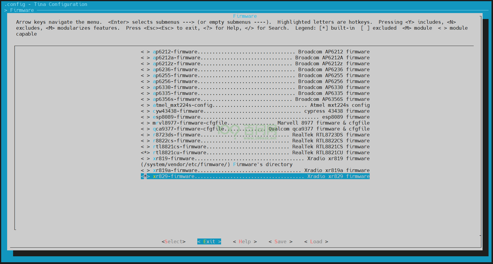
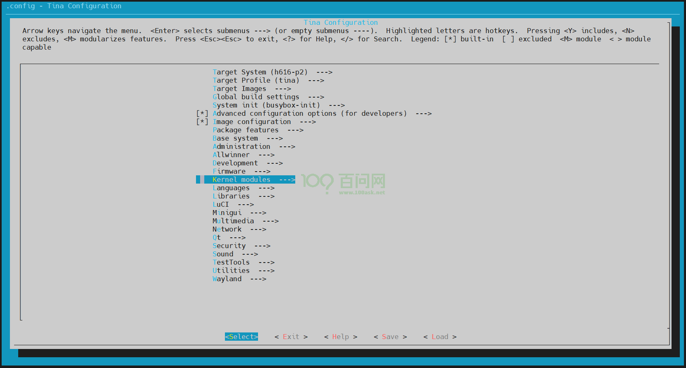
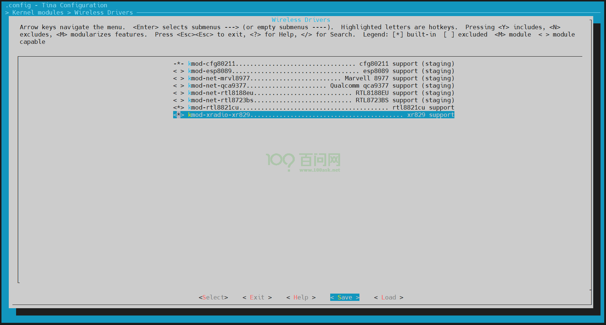
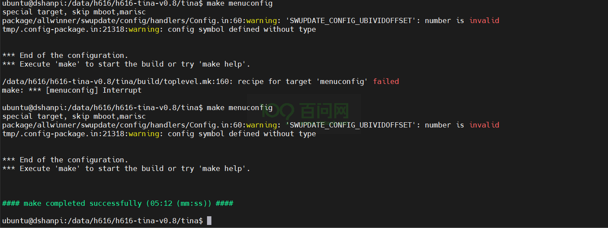
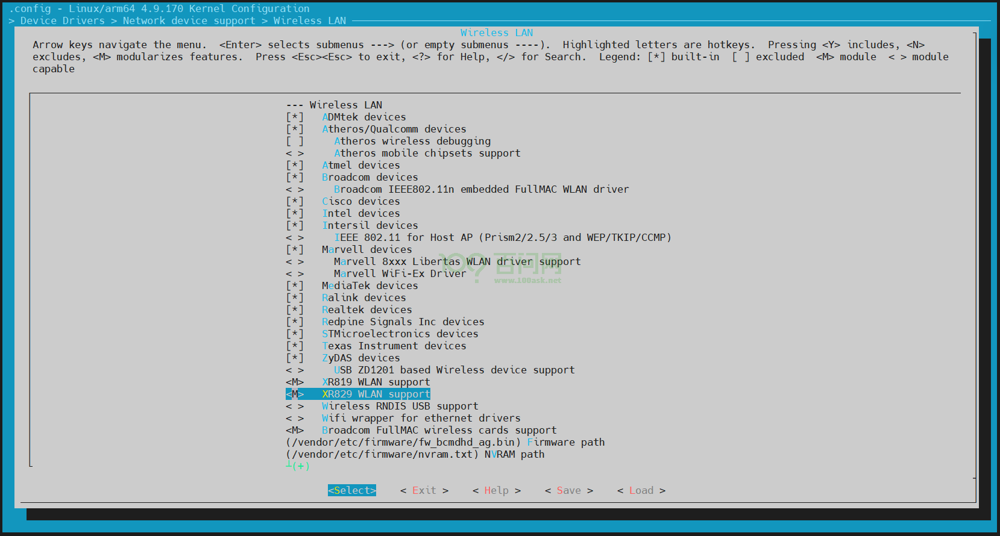

# Wi-Fi联网

本文将介绍如何使用Wi-Fi。H616开发板板载的是 [XradioTech](http://www.xradiotech.com/) 所设计的 XR829 Wi-Fi 模组。

## 前提条件

> 在进入本章节学习之前，请做好以下准备。

当前版本`xr829 Wi-Fi模组`和`天线接口`硬件位置图，如下：

**准备工作：**

**硬件：**
1. 变色龙-H616开发板（YuzuKiHD-Chamelen）
2. usb typeC线 X1
3. ipex 2.4G天线 X1
4. 串口模块

**软件：**
1. 全志线刷工具：[AllwinnertechPhoeniSuit.zip](https://dl.100ask.net/Hardware/MPU/T113i-Industrial/Tools/AllwinnertechPhoeniSuit.zip)
2. 全志USB烧录驱动：[AllwinnerUSBFlashDeviceDriver.zip](https://dl.100ask.net/Hardware/MPU/T113i-Industrial/Tools/AllwinnerUSBFlashDeviceDriver.zip)

## 硬件介绍

### Wi-Fi功能特性

XR829 Wi-Fi模组是一款集成了2.4G IEEE 802.11b/g/n标准的无线连接解决方案，并且支持蓝牙2.1/4.0/4.1协议标准。它主要应用于短距离无线连接，如平板电脑、智能电视等设备。以下是XR829 Wi-Fi模组的一些功能特性：

1. **STA模式管理**：支持STA（Station）模式，允许设备连接到无线网络。
2. **AP模式管理**：支持AP（Access Point）模式，允许设备作为无线热点供其他设备连接。
3. **Monitor模式管理**：提供Monitor模式，用于监听无线网络的流量。
4. **配网管理**：支持多种配网方式，如softap、soundwave、xconfig等，方便用户连接到无线网络。
5. **P2P模式管理**：正在考虑支持P2P（Peer to Peer）模式，用于设备间的直接连接。
6. **软件结构**：wifimanger2.0支持AP模式和monitor模式，集成了多种配网模式，方便用户使用。
7. **硬件资源适配**：需要根据硬件原理图进行配置，包括时钟、电源、SDIO等资源的适配。
8. **内核驱动适配**：需要在内核中添加Kconfig和Makefile配置，并通过menuconfig启用XR829 WLAN支持。
9. **Firmware支持**：根据不同晶振（24M或40M）提供相应的固件支持。
10. **应用工具适配**：提供了wifimanager、smartlinkd、softap等应用工具的适配，以方便进行Wi-Fi功能测试和使用。

### Wi-Fi软件结构

- **wifimanger**：主要用于STATION模式，提供Wi-Fi连接扫描等功能。
- **softap manager**：提供启动AP的功能。
- **smartlink**：对于 `NoInput` 的设备，通过借助第三方设备（如手机）实现透传配网的功能,包括 `softap/soundwave/xconfig/airkiss/` 等多种配网方式。
- **wpa_supplicant**：开源的无线网络配置工具，主要用来支持WEP，WPA/WPA2和WAPI无线协议和加密认证的，实际上的工作内容是通过 `socket` 与驱动交互上报数据给用户。
- **hostapd**：是一个用户态用于AP和认证服务器的守护进程。
- **monitor**：Wi-Fi处于混杂设备监听模式的处理应用。

### Wi-Fi天线安装

要使用Wi-Fi，需要连接一根ipex 2.4G天线，下面是将天线连接到H616开发板的指南图。

参考上图，拿到一根天线，对准天线接口，稍微用点力摁下去，听到咔擦一声，安装完毕。

## 安装驱动

###  登录开发板终端

操作开发板之前，要连接好硬件，先根据原理图扩展口引脚定义连接串口（串口模块的vcc电源线可以不用连接），然后插上OTG线（支持供电与烧写功能）。

白色线，对应开发板的引脚是TXD   ===>  扩展IO口23（PH0，UART0_TX）

绿色线，对应开发板的引脚是RXD   ===>  扩展IO口22（PH1，UART0_RX）

黑色线，对应开发板的引脚是GND  ===>  扩展IO口25

> 注意：
>
> 串口模块的RXD线  连接 开发板的TXD引脚
>
> 串口模块的TXD线  连接 开发板的RXD引脚
>
> 串口模块的GND线 连接 开发板的GND引脚

连接好设备后，打开设备管理器，可以看到有一个名为CH340的COM94端口号，说明串口连接成功。（这边使用的串口模块的转换芯片是CH340）

打开串口终端工具（类似的工具也可以），这里以MobaXterm为例讲解。

点击`Session`。

然后会跳出一个选择框，选择`Serial`。

找到上面设备管理器显示的串口号（CH340），选上。

设置波特率为`115200`。

配置串口，修改`Flow control`为`None`。

修改完成后点击OK即可进入开发板串口终端。

可以看到上面没有任何显示，需要按下开发板上的`RESET`按键，就可以看到串口打印信息。

点击键盘的`Enter`键，串口终端也能接受，自此登录开发板终端完成，接下来可以开始操作开发板了。

### 装载Wi-Fi驱动模块

本章节提供的镜像已经移植好了 XR829 Wi-Fi 模组和 Wi-Fi 的使用工具。所以只需要在开发板上进行wifi连接即可。

进入开发板串口终端，执行`ifconfig -a`，查看节点信息，想使用wifi，就需要有 `wlan0`节点。

~~~bash
root@TinaLinux:/# ifconfig -a
eth0      Link encap:Ethernet  HWaddr 36:C9:E3:F1:B8:05
          BROADCAST MULTICAST  MTU:1500  Metric:1
          RX packets:0 errors:0 dropped:0 overruns:0 frame:0
          TX packets:0 errors:0 dropped:0 overruns:0 carrier:0
          collisions:0 txqueuelen:1000
          RX bytes:0 (0.0 B)  TX bytes:0 (0.0 B)
          Interrupt:62

gre0      Link encap:UNSPEC  HWaddr 00-00-00-00-30-30-30-30-00-00-00-00-00-00-00-00
          NOARP  MTU:1476  Metric:1
          RX packets:0 errors:0 dropped:0 overruns:0 frame:0
          TX packets:0 errors:0 dropped:0 overruns:0 carrier:0
          collisions:0 txqueuelen:1
          RX bytes:0 (0.0 B)  TX bytes:0 (0.0 B)

gretap0   Link encap:Ethernet  HWaddr 00:00:00:00:00:00
          BROADCAST MULTICAST  MTU:1462  Metric:1
          RX packets:0 errors:0 dropped:0 overruns:0 frame:0
          TX packets:0 errors:0 dropped:0 overruns:0 carrier:0
          collisions:0 txqueuelen:1000
          RX bytes:0 (0.0 B)  TX bytes:0 (0.0 B)

ip6_vti0  Link encap:UNSPEC  HWaddr 00-00-00-00-00-00-00-00-00-00-00-00-00-00-00-00
          NOARP  MTU:1500  Metric:1
          RX packets:0 errors:0 dropped:0 overruns:0 frame:0
          TX packets:0 errors:0 dropped:0 overruns:0 carrier:0
          collisions:0 txqueuelen:1
          RX bytes:0 (0.0 B)  TX bytes:0 (0.0 B)

ip6tnl0   Link encap:UNSPEC  HWaddr 00-00-00-00-00-00-00-00-00-00-00-00-00-00-00-00
          NOARP  MTU:1452  Metric:1
          RX packets:0 errors:0 dropped:0 overruns:0 frame:0
          TX packets:0 errors:0 dropped:0 overruns:0 carrier:0
          collisions:0 txqueuelen:1
          RX bytes:0 (0.0 B)  TX bytes:0 (0.0 B)

ip_vti0   Link encap:UNSPEC  HWaddr 00-00-00-00-30-30-30-30-00-00-00-00-00-00-00-00
          NOARP  MTU:1480  Metric:1
          RX packets:0 errors:0 dropped:0 overruns:0 frame:0
          TX packets:0 errors:0 dropped:0 overruns:0 carrier:0
          collisions:0 txqueuelen:1
          RX bytes:0 (0.0 B)  TX bytes:0 (0.0 B)

lo        Link encap:Local Loopback
          inet addr:127.0.0.1  Mask:255.0.0.0
          inet6 addr: ::1/128 Scope:Host
          UP LOOPBACK RUNNING  MTU:65536  Metric:1
          RX packets:0 errors:0 dropped:0 overruns:0 frame:0
          TX packets:0 errors:0 dropped:0 overruns:0 carrier:0
          collisions:0 txqueuelen:1
          RX bytes:0 (0.0 B)  TX bytes:0 (0.0 B)

sit0      Link encap:IPv6-in-IPv4
          NOARP  MTU:1480  Metric:1
          RX packets:0 errors:0 dropped:0 overruns:0 frame:0
          TX packets:0 errors:0 dropped:0 overruns:0 carrier:0
          collisions:0 txqueuelen:1
          RX bytes:0 (0.0 B)  TX bytes:0 (0.0 B)

tunl0     Link encap:UNSPEC  HWaddr 00-00-00-00-30-30-30-30-00-00-00-00-00-00-00-00
          NOARP  MTU:1480  Metric:1
          RX packets:0 errors:0 dropped:0 overruns:0 frame:0
          TX packets:0 errors:0 dropped:0 overruns:0 carrier:0
          collisions:0 txqueuelen:1
          RX bytes:0 (0.0 B)  TX bytes:0 (0.0 B)

root@TinaLinux:/#
~~~

上面并没有看到 `wlan0` 节点，因为驱动没有被装载，需要手动执行 `insmod /lib/modules/4.9.191/xr829.ko` 装载驱动。

~~~bash
root@TinaLinux:/# insmod /lib/modules/4.9.191/xr829.ko
[ 1115.488858] xr829: no symbol version for module_layout
[ 1115.501263] ======== XRADIO WIFI OPEN ========
[ 1115.506927] [XRADIO] Driver Label:XR_V02.16.83_P2P_HT40_01.31  Aug 14 2024 02:47:41
[ 1115.515660] [XRADIO] Allocated hw_priv @ ffffffc027b597a0
[ 1115.523373] sunxi-wlan soc@03000000:wlan: bus_index: 1
[ 1115.639378] [XRADIO] Detect SDIO card 1
[ 1115.639416] sunxi-mmc sdc1: sdc set ios:clk 0Hz bm PP pm UP vdd 21 width 1 timing LEGACY(SDR12) dt B
[ 1115.654084] sunxi-mmc sdc1: sdc set ios:clk 400000Hz bm PP pm ON vdd 21 width 1 timing LEGACY(SDR12) dt B
[ 1115.670930] sunxi-mmc sdc1: sdc set ios:clk 400000Hz bm PP pm ON vdd 21 width 1 timing LEGACY(SDR12) dt B
[ 1115.684255] sunxi-mmc sdc1: sdc set ios:clk 400000Hz bm PP pm ON vdd 21 width 1 timing LEGACY(SDR12) dt B
[ 1115.705287] sunxi-mmc sdc1: sdc set ios:clk 400000Hz bm PP pm ON vdd 21 width 1 timing SD-HS(SDR25) dt B
[ 1115.716041] sunxi-mmc sdc1: sdc set ios:clk 50000000Hz bm PP pm ON vdd 21 width 1 timing SD-HS(SDR25) dt B
[ 1115.727098] sunxi-mmc sdc1: sdc set ios:clk 50000000Hz bm PP pm ON vdd 21 width 4 timing SD-HS(SDR25) dt B
[ 1115.738627] mmc2: new high speed SDIO card at address 0001
[ 1115.746164] [SBUS] XRadio Device:sdio clk=50000000
[ 1115.753248] [XRADIO] XRADIO_HW_REV 1.0 detected.
[ 1115.797286] [XRADIO] xradio_update_dpllctrl: DPLL_CTRL Sync=0x00c00000.
[ 1115.825938] [XRADIO] Bootloader complete
[ 1115.913761] [XRADIO] Firmware completed.
[ 1115.919709] [WSM] Firmware Label:XR_C09.08.52.64_DBG_02.100 2GHZ HT40 Jan  3 2020 13:14:37
[ 1115.928989] [XRADIO] Firmware Startup Done.
[ 1115.933856] [XRADIO_WRN] enable Multi-Rx!
[ 1115.953917] ieee80211 phy0: Selected rate control algorithm 'minstrel_ht'
root@TinaLinux:/#
~~~

如上所示，驱动模块已经安装成功。

## 连接Wi-Fi网络

### 开启Wi-Fi功能

加载驱动没有出现问题之后，执行`ifconfig -a`，即可看到 `wlan0` 节点。

使用wifi功能还需要执行指令`ifconfig wlan0 up`，来打开 `wlan0` 节点。

~~~bash
root@TinaLinux:/# ifconfig wlan0 up
[ 1362.332934] ieee80211_do_open: vif_type=2, p2p=0, ch=3, addr=f0:a9:3e:86:31:83
[ 1362.341210] [STA] !!!xradio_vif_setup: id=0, type=2, p2p=0, addr=f0:a9:3e:86:31:83
[ 1362.353431] [AP_WRN] BSS_CHANGED_ASSOC but driver is unjoined.
[ 1362.364758] IPv6: ADDRCONF(NETDEV_UP): wlan0: link is not ready
root@TinaLinux:/#
~~~

打开完成后，执行`ifconfig`，即可看到 `wlan0` 节点。

### 扫描附近Wi-Fi

打开 `wlan0` 节点后，就可以在开发板上使用已经适配上的 `iw` 工具来扫描附近的Wi-Fi。

执行指令如下：

~~~bash
iw dev wlan0 scan | grep SSID
~~~

扫描到附近的wifi节点，结果显示：

~~~bash
root@TinaLinux:/# iw dev wlan0 scan | grep SSID
        SSID: Voform
        SSID: \xe9\xa1\xba\xe6\x88\x90\xe5\x8a\xb3\xe5\x8a\xa1
        SSID: Guest_An
        SSID: Redmi_83D1
        SSID: Redmi_83D1
        SSID: WiFi
        SSID: bgy-pagoda
        SSID: JS
        SSID: Programmers
        SSID: DIRECT-MHDESKTOP-F024M1AmsMR
        SSID: ChinaNet-kRAH
        SSID: wifi1
        SSID: YZKJ
        SSID: ChinaNet-ccXn
root@TinaLinux:/#
~~~

能扫描到附近的Wi-Fi节点，即可证明 XR829 Wi-Fi 模组可以正常使用。接下来就可以开始连接Wi-Fi节点了。

### 连接Wi-Fi

连接Wi-Fi节点，需要使用 `wpa_supplican`，该工具也已适配上。

`wpa_supplicant` 连接Wi-Fi节点的时候会从配置文件中读取账号和密码，以及加密方式等， 所以我们在运行wpa_supplicant工具的时候要提前写好配置文件。 配置文件名称自定，但是要以 .conf 为后缀，并保存在 /etc/ 目录下，这边给出一个配置文件的例子。

---

执行以下指令，进入配置文件：

~~~bash
vim /etc/wpa_supplicant.conf
~~~

添加如下内容：

~~~bash
ctrl_interface=/var/run/wpa_supplicant
update_config=1

network={
        ssid="Programmers"
        psk="100askxxx"
}
~~~

- **ctrl_interface**：这是 `wpa_supplicant` 的配置选项，用于定义一个 Unix 域套接字的路径，通过这个套接字，其他程序可以与 `wpa_supplicant` 进行通信，发送命令和查询状态。`/var/run/wpa_supplicant` 是 `wpa_supplicant` 配置文件中的一个参数，用于指定控制接口的路径。
- **update_config** : 这个配置项指示 `wpa_supplicant` 在网络连接成功或失败时更新配置文件。当设置为 `1` 时，任何通过控制接口添加或修改的网络配置都会被永久保存到配置文件中，这样在下次启动 `wpa_supplicant` 时，这些更改仍然有效。
- **ssid** : 这里指定了要连接的无线网络的 SSID（服务集标识符），即网络名称。（需要根据实际情况填写）
- **psk** ：`psk`（预共享密钥）是用于 WPA/WPA2 加密的密码。（需要根据实际情况填写）

---

在开发板上，执行以下指令，创建一个socket通信的目录，命名需要和上面配置文件里`ctrl_interface`的路径一样。

~~~bash
mkdir -p /var/log/wpa_supplicant
~~~

---

完成以上操作，执行以下指令，连接Wi-Fi节点：

~~~bash
wpa_supplicant -B -c /etc/wpa_supplicant.conf -i wlan0
~~~

### 获取IP地址

有以上这一些log信息打印，表明连接成功，但是还需要使用`udhcpc`工具来分配ip地址，否则无法连接外网。

执行以下指令，分配ip地址：

~~~bash
udhcpc -i wlan0
~~~

ip地址分配成功，即可连接外网，测试如下：

~~~bash
root@TinaLinux:/# ping www.baidu.com
PING www.baidu.com (183.2.172.185): 56 data bytes
64 bytes from 183.2.172.185: seq=0 ttl=52 time=15.317 ms
64 bytes from 183.2.172.185: seq=1 ttl=52 time=9.063 ms
64 bytes from 183.2.172.185: seq=2 ttl=52 time=12.577 ms
64 bytes from 183.2.172.185: seq=3 ttl=52 time=8.751 ms
^C
--- www.baidu.com ping statistics ---
4 packets transmitted, 4 packets received, 0% packet loss
round-trip min/avg/max = 8.751/11.427/15.317 ms
root@TinaLinux:/#
~~~

分配的ip地址，也成功显示，如下。

## 常见问题

**能不能用ssh登录**   

Tina4默认不支持，不可以。

## 扩展-手动配置Wi-Fi

以上是基于已经适配好xr829模组的镜像来使用WiFi功能，接下来讲解，如何在TinaSDK中配置一个支持WiFi功能的镜像。

### Tina配置选择

在Ubuntu上，假设已经打开了一个新的终端，

~~~bash
source build/envsetup.sh
lunch
~~~

其中：

- source build/envsetup.sh ：获取环境变量。
- lunch 会提供方案选项以供选择。选择 `5. h616_p2-tina`

~~~bash
ubuntu@dshanpi:/data/h616/h616-tina-v0.8/tina$ source build/envsetup.sh
Setup env done! Please run lunch next.
ubuntu@dshanpi:/data/h616/h616-tina-v0.8/tina$ lunch

You're building on Linux

Lunch menu... pick a combo:
     1. h3_p1nor-tina
     2. h3_p1-tina
     3. h3_p2nor-tina
     4. h3_p2-tina
     5. h616_p2-tina
     6. h6_p1_axp806-tina
     7. h6_p1_axpdummy-tina

Which would you like? [Default h616_p2]: 5
============================================
TINA_BUILD_TOP=/data/h616/h616-tina-v0.8/tina
TINA_TARGET_ARCH=aarch64
TARGET_PRODUCT=h616_p2
TARGET_PLATFORM=h616
TARGET_BOARD=h616-p2
TARGET_PLAN=p2
TARGET_BUILD_VARIANT=tina
TARGET_BUILD_TYPE=release
TARGET_KERNEL_VERSION=4.9
TARGET_UBOOT=u-boot-
TARGET_CHIP=sun50iw9p1
============================================
ubuntu@dshanpi:/data/h616/h616-tina-v0.8/tina$
~~~

这样，就可以使用相应的指令来配置Wi-Fi。

首先，需要在Tina配置界面，选上相应的固件`xr829-firmware`，

在TinaSDK根目录，执行以下指令，进入Tina配置界面：

~~~bash
make menuconfig
~~~

进入Tina配置界面后，找到`Firmware`。

找到后，点击键盘`Enter`回车键，进入`Firmware`选项界面，找到`xr829-firmware`选项，点击键盘`y`键，选上。

选择成功后，控制键盘上的方向键，选择`Save`保存，然后一路回车。

保存完成后，控制键盘上的方向键，选择`Exit`回车即可退出，

退出到最初进入的界面，找到`Kernel modules`，回车进入。

进入`Kernel modules`后，找到`Wireless Drivers`，回车进入。

进入`Wireless Drivers`后，找到`kmod-xradio-xr829`，点击键盘上的`y`键，选上，作用是把内核驱动模块编译进系统中。

选择成功后，控制键盘上的方向键，选择`Save`保存，然后一路回车。

保存完成后，即可控制键盘上的方向键，选择`Exit`回车退出。

一路退出到最初进入的界面，找到`Network`，回车进入。

进入`Network`界面后，找到`iw`，点击键盘上的`y`键，选上。`iw`工具就是用来扫描附近的Wi-Fi。

同样先保存，然后退出，一样的操作退出两次即可退到串口终端。

### 内核配置选择

Tina配置完成后，需要配置内核，一般内核的配置是默认选上了xr829驱动，但是不妨再看一眼，确保无误，进入TinaSDK根目录，执行以下指令：

~~~bash
make kernel_menuconfig
~~~

即可进入内核配置界面。

找到`Device Drivers`，回车进入。

进入`Device Drivers`后，找到`Network device support`，回车进入。

进入`Network device support`后，找到`Wireless LAN`，回车进入。

进入`Wireless LAN`后，查看`XR829 WLAN support`，是否有被选择为`M`，如果没有，点击键盘上的`m`键，意思是把xr829的驱动编译为内核模块。

确保无误后，控制键盘上的方向键，选择`Save`保存，然后一路回车。

保存完成后，即可控制键盘上的方向键，选择`Exit`回车退出。

同样的操作，一路退出即可退出到终端界面。

### 设备树修改

想要xr829驱动模块成功装载，当然还需要确保设备树里的wlan节点是否正确配置。

进入目录`tina/device/config/chips/h616/configs/p2`，实际目录还需要看你保存的TinaSDK位置。

~~~bash
ubuntu@dshanpi:/data/h616/h616-tina-v0.8/tina/device/config/chips/h616/configs/p2$ ls
android  board.dts  dragonboard  linux  sys_config.fex
ubuntu@dshanpi:/data/h616/h616-tina-v0.8/tina/device/config/chips/h616/configs/p2$
~~~

可以看到一个`board.dts`设备树文件，该文件就是h616开发板的内核设备树。

使用 vim 工具进入`board.dts`，在普通模式上（进入默认是普通模式），输入`/wlan`，回车即可跳转到`wlan`设备树节点：

参考原理图，查看`wlan_regon` 和 `wlan_hostwake`对应的是哪个节点。

由上图可知，`wlan_regon` 对应的引脚是 `PG11`；`wlan_hostwake` 对应的引脚是 `PG12`。修改设备树wlan节点里的属性为对应引脚。

修改完成后，在普通模式下，执行`:wq`，然后回车，即可保存并退出设备树文件。

### 烧写更新

以上操作并没有先后顺序，只需选上并确保无误即可。

配置完成之后，进入TinaSDK根目录，执行`mp -jN`即可完成**编译和打包**操作（N值的大小根据电脑配置选择，若不确定，也可不加-j参数）。

镜像`tina_h616-p2_uart0.img`保存的路径是`out/h616-p2/tina_h616-p2_uart0.img`。

进入目录`out/h616-p2/`即可看到镜像文件。

如何烧写，请根据之前的`Tina开发环境搭建`文章来进行烧写。

