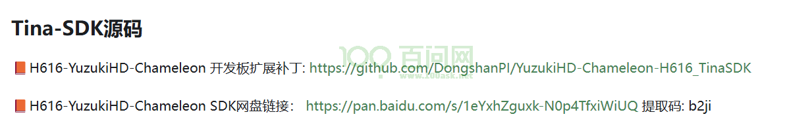
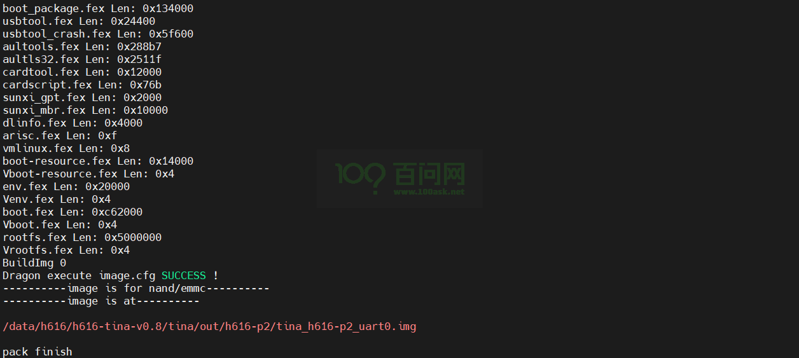
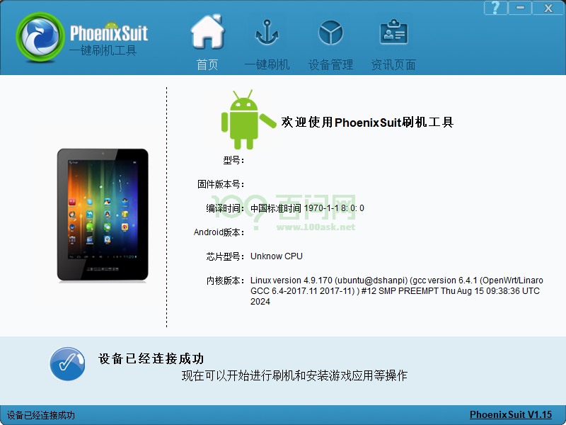
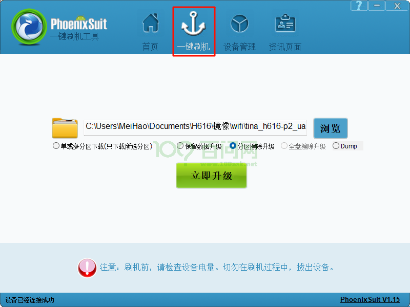
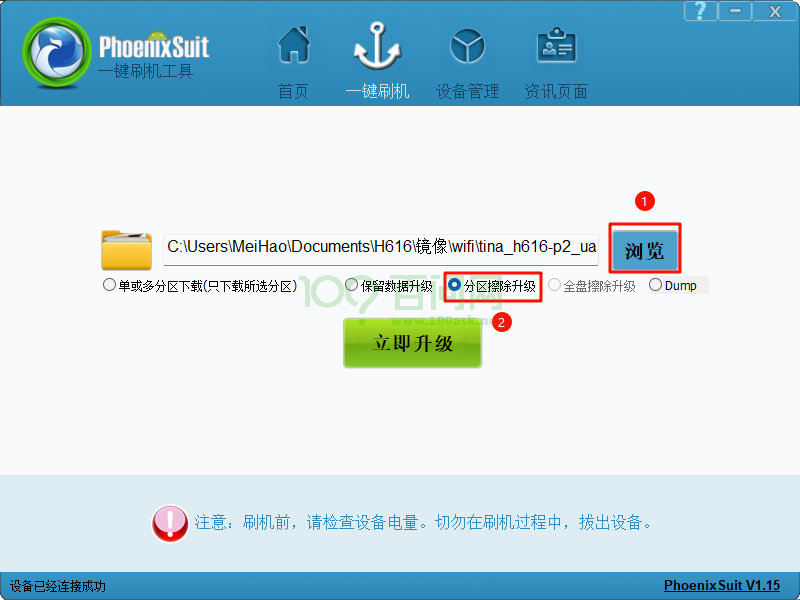
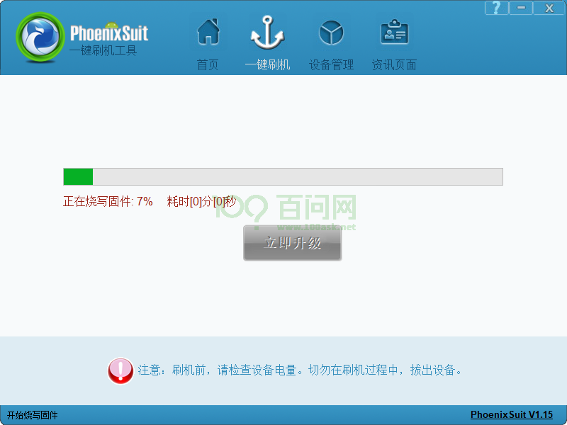
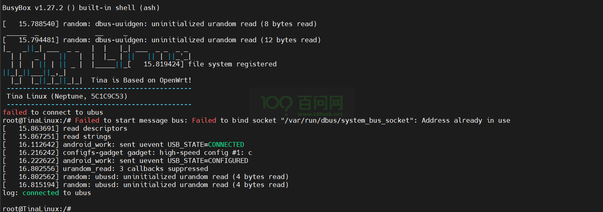

# 开发环境搭建

本章节将介绍如何搭建 H616 开发板 Tina 开发环境。

## 1.获取Tina源码SDK

首先，在 Windows 上，打开前面的章节《源码工具文档手册》，找到SDK源码。

如下：

SDK源码需要通过百度网盘下载，一共有11个压缩包，如下所示：

下载完成后，通过网络等方式拷贝到 Ubuntu 虚拟机目录下(路径自行选择)。

拷贝完成之后，执行以下指令，进行解压。

~~~bash
cat h616-tina-v0.8.tar.gza* | tar -xv
cd tina
.repo/repo/repo sync -l
~~~

如果出现python问题，执行以下指令：

~~~bash
/usr/bin/python2 .repo/repo/repo sync -l
~~~

## 2.获取补丁包

基于 H616-YuzukiHD-Chameleon 开发板，我们提供了一个扩展补丁包，执行以下指令，获取扩展支持仓库，然后加以应用，这里把SDK源码放在**用户目录下 ~/** 。(注意：路径根据实际的路径进行修改)

~~~bash
cd ~/
git clone https://github.com/DongshanPI/YuzukiHD-Chameleon-H616_TinaSDK.git
cd YuzukiHD-Chameleon-H616_TinaSDK
git submodule update --init
cp ./* -rfvd ~/h616-tina-v0.8/
~~~

## 3.编译固件

进入TinaSDK根目录，对源码编译之前，先搭建编译环境。

指令如下：

~~~bash
source build/envsetup.sh
lunch
~~~

其中：

- source build/envsetup.sh ：获取环境变量。
- lunch 会提供方案选项以供选择。选择 `h616_p2-tina`（具体数字可能不一样）

~~~bash
ubuntu@dshanpi:/data/h616/h616-tina-v0.8$ source build/envsetup.sh
Setup env done! Please run lunch next.
ubuntu@dshanpi:/data/h616/h616-tina-v0.8$ lunch

You're building on Linux

Lunch menu... pick a combo:
     1. h3_p1nor-tina
     2. h3_p1-tina
     3. h3_p2nor-tina
     4. h3_p2-tina
     5. h616_p2-tina
     6. h6_p1_axp806-tina
     7. h6_p1_axpdummy-tina

Which would you like? [Default h616_p2]: 5
============================================
TINA_BUILD_TOP=/data/h616/h616-tina-v0.8
TINA_TARGET_ARCH=aarch64
TARGET_PRODUCT=h616_p2
TARGET_PLATFORM=h616
TARGET_BOARD=h616-p2
TARGET_PLAN=p2
TARGET_BUILD_VARIANT=tina
TARGET_BUILD_TYPE=release
TARGET_KERNEL_VERSION=4.9
TARGET_UBOOT=u-boot-
TARGET_CHIP=sun50iw9p1
============================================
ubuntu@dshanpi:/data/h616/h616-tina-v0.8$
~~~

> 注意：
>
> 每次打开一个ubuntu终端只需要做一次获取环境变量和选择方案的操作，在这个终端多次编译的时候不需要再做前两步操作。
> 每次打开一个ubuntu终端也必须做一次获取环境变量和选择方案的操作。

完成前两步后，直接进行编译和打包。

执行指令如下：

~~~bash
make -j32
pack
~~~

- make -j32 ：编译，其中-j后面的数字参数为编译用的线程数，可根据编译用的虚拟机实际情况选择。
- pack : 打包，将编译好的固件打包成一个.img格式的固件，固件路径`out/h616-p2/tina_h616-p2_uart0.img`

图片仅供参考。

## 4.烧写固件

> 烧写，即将编译打包好的固件下载到设备。

烧写固件的方式往往是在windows里进行，所以烧写之前需要先把固件 `tina_h616-p2_uart0.img` 根据开发者习惯的方式拉到windows。

在windows上，需要提前安装好烧写工具 `PhoenixSuit.exe`。双击打开烧写工具 `PhoenixSuit.exe`。

选择一键刷机。

点击①浏览，选择固件，②分区擦除升级。

不需要点击立即升级，先**按住**开发板上的 `FEL` 按键，**不要松手！！！**，再**点击** `RESET`，再**松开** `FEL` 按键，即可自动烧写固件。

> 注意：
>
> 执行烧写操作时，确保OTG线没有被占用，是连接到windows上的。

烧写完成后，即可查看串口终端打印信息。

