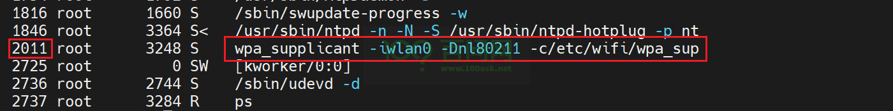
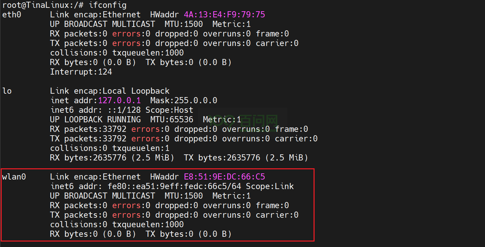
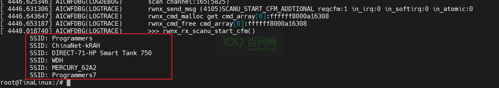
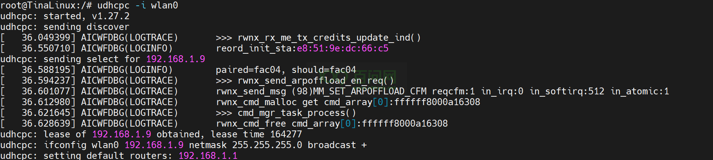
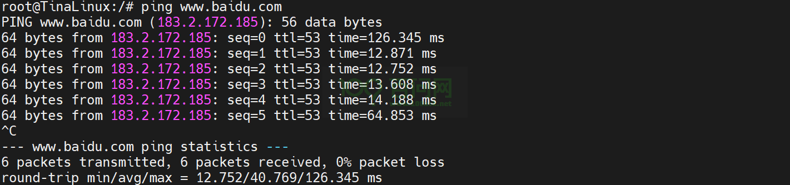

# WiFi联网

## 引言

欢迎来到 R818-DshanPI-ROSx 的WiFi联网指南。在本教程中，我们将引导您完成将设备连接到WiFi网络的步骤。无论您是初学者还是有一定经验的用户，本指南都将为您提供必要的信息和步骤。

## 准备工作

为了确保您能够顺利进行WiFi联网配置，请准备以下硬件和软件准备：

### 硬件要求

- **typeC线:** 2根。 
- **OTG&串口二合一模块：** 1块。同时实现OTG(可烧录与使用ADB)和串口功能。
- **ipex 2.4G天线：** 1根。用于增强您的开发板的无线信号接收能力，确保稳定的WiFi连接。 

### 软件要求

- **Mobaxterm:** 用于登录串口。

接下来将讲解如何实现WiFi联网，在这之前先登录串口终端(也可以使用ADB登录)，请参考前面快速启动的《启动开发板》章节。

## 步骤1：检查当前进程情况

如果是第一次连接无线网络，在设置网络设备账号和密码之前，提前执行 **wpa_supplican** ，后面的连接操作会出现报错。所以在配置之前，我们需要检查当前进程中 wpa_supplican 是否被执行。执行以下指令：

~~~bash
ps
~~~

可以看到，开发板启动系统时，默认会执行 wpa_supplican 。

执行以下指令，终止该进程。

~~~bash
kill -9 2011
~~~

## 步骤2：扫描附近无线网络

启动系统之后，执行 ifconfig 指令，我们可以看见有存在 wlan0 这个网络节点，表示WiFi驱动加载正常。

接着，我们可以执行以下指令，来扫描附近无线网络，验证开发板上的WiFi模块是否正常。

~~~bash
iw dev wlan0 scan | grep SSID
~~~

出现如下打印信息：

这里扫到了本章节需要连接的无线网络 Programmers，说明WiFi模块正常。开发板搭载的WiFi模块是 aic8800dc 2.4G模组，最高支持WiFi6。

## 步骤3：添加无线网络配置信息

连接无线网络之前，我们需要在配置文件中添加相应的无线网络名以及对应的密码。执行以下指令。

~~~bash
vi /etc/wifi/wpa_supplicant.conf
~~~

添加如下内容：

~~~bash
ctrl_interface=/var/run/wpa_supplicant
update_config=1

network={
        ssid="Programmers"
        psk="100asktech"
}
~~~

需要注意，配置文件信息不要填错。

> ssid：无线网络名；psk：对应无线网络的密码

## 步骤4：连接无线网络

填写配置文件之后，接下来可以执行连接无线网络操作。指令如下：

~~~bash
mkdir -p /var/log/wpa_supplicant
wpa_supplicant -B -c /etc/wifi/wpa_supplicant.conf -i wlan0
~~~

执行之后，会打印一长串信息。

~~~bash
[ 5273.392460] AICWFDBG(LOGTRACE)       >>> rwnx_cfg80211_connect()
[ 5273.398641] AICWFDBG(LOGTRACE)       >>> rwnx_send_sm_connect_req()
[ 5273.405144] rwnx_send_sm_connect_req drv_vif_index:0 connect to Programmers(11) channel:2412 auth_type:0
[ 5273.415886] AICWFDBG(LOGTRACE)       rwnx_send_msg (6145)SM_CONNECT_CFM reqcfm:1 in_irq:0 in_softirq:0 in_atomic:0
[ 5273.427087] AICWFDBG(LOGTRACE)       rwnx_cmd_malloc get cmd_array[0]:ffffff8000a16308
[ 5273.436386] AICWFDBG(LOGTRACE)       rwnx_cmd_free cmd_array[0]:ffffff8000a16308
[ 5273.656705] AICWFDBG(LOGTRACE)       >>> rwnx_rx_sm_connect_ind()
[ 5273.663008] AICWFDBG(LOGINFO)        rwnx_rx_sm_connect_ind ind->status_code:0
[ 5273.670747] aicwf_sdio mmc1:390b:1: Error while (un)registering debug entry for sta 4
[ 5273.671358] AICWFDBG(LOGINFO)        rwnx_rx_sm_connect_ind ind->roamed:0 ind->status_code:0 rwnx_vif->drv_conn_state:3
[ 5273.680309] AICWFDBG(LOGINFO)        need cfm ethertype:    8e88,user_idx=7, skb=ffffffc0790574c0
[ 5273.700573] AICWFDBG(LOGINFO)        sdio_host_tx_cfm_handler:used_idx=6, 0xffffffc0787f06e0, status=9
[ 5273.710835] AICWFDBG(LOGINFO)        need cfm ethertype:    8e88,user_idx=8, skb=ffffffc0790574c0
[ 5273.720457] AICWFDBG(LOGTRACE)       >>> rwnx_cfg80211_add_key()
[ 5273.726759] AICWFDBG(LOGTRACE)       >>> rwnx_send_key_add()
[ 5273.732626] AICWFDBG(LOGINFO)        sdio_host_tx_cfm_handler:used_idx=7, 0xffffffc0787f06e0, status=9
[ 5273.732635] AICWFDBG(LOGTRACE)       rwnx_send_key_add: sta_idx:4 key_idx:0 inst_nbr:0 cipher:2 key_len:16
[ 5273.732648] key: 00000000: 8a bc 6c 3b e9 57 08 3b 04 d6 6a 26 53 f5 d8 45  ..l;.W.;..j&S..E
[ 5273.732659] AICWFDBG(LOGTRACE)       rwnx_send_msg (37)MM_KEY_ADD_CFM reqcfm:1 in_irq:0 in_softirq:0 in_atomic:0
[ 5273.732671] AICWFDBG(LOGTRACE)       rwnx_cmd_malloc get cmd_array[0]:ffffff8000a16308
[ 5273.781787] AICWFDBG(LOGTRACE)       rwnx_cmd_free cmd_array[0]:ffffff8000a16308
[ 5273.790006] AICWFDBG(LOGTRACE)       >>> rwnx_cfg80211_set_default_key()
[ 5273.797296] AICWFDBG(LOGTRACE)       >>> rwnx_cfg80211_add_key()
[ 5273.803483] AICWFDBG(LOGTRACE)       >>> rwnx_send_key_add()
[ 5273.809292] AICWFDBG(LOGTRACE)       rwnx_send_key_add: sta_idx:255 key_idx:2 inst_nbr:0 cipher:2 key_len:16
[ 5273.819735] key: 00000000: 00 5e b2 81 12 2b 9d 62 33 e6 6f 7c bb 48 33 4f  .^...+.b3.o|.H3O
[ 5273.829210] AICWFDBG(LOGTRACE)       rwnx_send_msg (37)MM_KEY_ADD_CFM reqcfm:1 in_irq:0 in_softirq:0 in_atomic:0
[ 5273.840147] AICWFDBG(LOGTRACE)       rwnx_cmd_malloc get cmd_array[0]:ffffff8000a16308
[ 5273.849554] AICWFDBG(LOGTRACE)       rwnx_cmd_free cmd_array[0]:ffffff8000a16308
[ 5273.858079] AICWFDBG(LOGTRACE)       >>> rwnx_send_me_set_control_port_req()
[ 5273.865523] AICWFDBG(LOGTRACE)       rwnx_send_msg (5125)ME_SET_CONTROL_PORT_CFM reqcfm:1 in_irq:0 in_softirq:0 in_atomic:0
[ 5273.877718] AICWFDBG(LOGTRACE)       rwnx_cmd_malloc get cmd_array[0]:ffffff8000a16308
[ 5273.886916] AICWFDBG(LOGTRACE)       rwnx_cmd_free cmd_array[0]:ffffff8000a16308
~~~

这里仅展示最后一部分打印信息。

## 步骤5：验证连接

连接无线网络后，并不会自动获取ip地址，我们需要执行以下指令，

~~~bash
udhcpc -i wlan0
~~~

可以看到以下打印信息：

获取ip地址成功，接下来验证是否能连接外网。执行以下指令：

~~~bash
ping www.baidu.com
~~~

如下：

能ping通，表明连接外网成功。后面连接无需重新配置，只需要手动获取ip地址即可。

## 常见问题解答 (FAQ)

- **Q:** 我无法连接到我的WiFi网络怎么办？
  - **A:** 确保您的无线网络是WiFi6及以下。
- **Q:** 执行 wpa_supplicant.conf 指令，一直打印信息并且无法获取ip地址？
  - **A:** 配置无线网络名和密码前。使用ps指令查看是否提前执行了 wpa_supplicant.conf。
- **Q:** 执行 wpa_supplicant.conf 指令，出现报错？
  - **A:** /etc/wifi/wpa_supplicant.conf 该文件是否填写错误，从头开始检查有没有错漏。

## 总结

恭喜您！您已经成功地将 R818-DshanPI-ROSx 连接到了WiFi网络。现在，您可以开始使用设备进行网络通信了。

## 反馈和改进

如果您有任何疑问或建议，请随时联系我们。我们期待您的反馈，以便我们不断改进本指南。有任何学习上的问题可以在论坛上发帖子。

论坛地址：[最新Allwinner话题 - 嵌入式开发问答社区](https://forums.100ask.net/c/aw/15)

