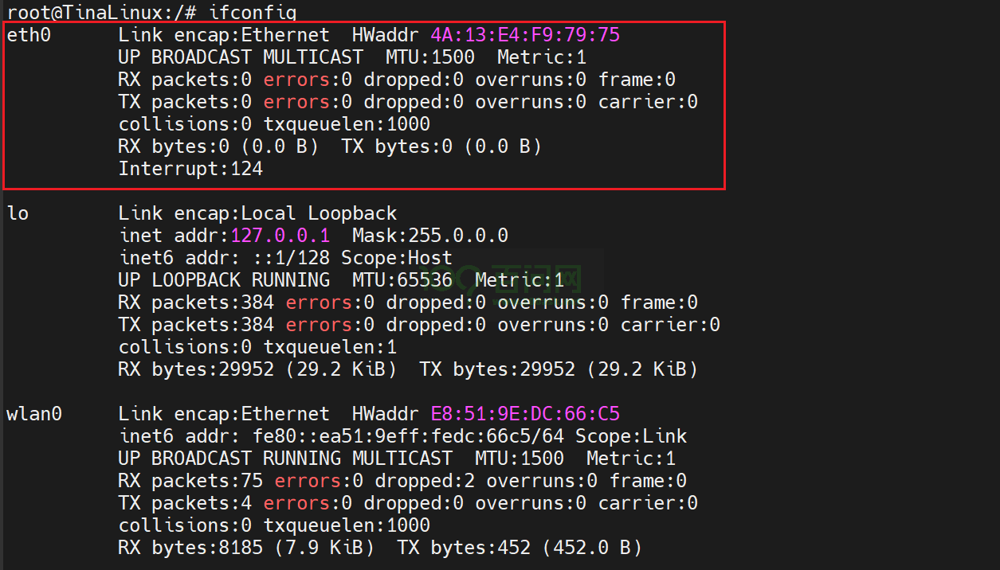
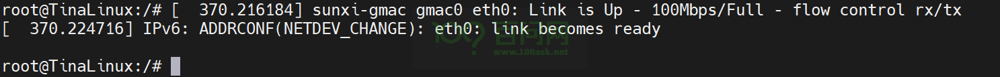
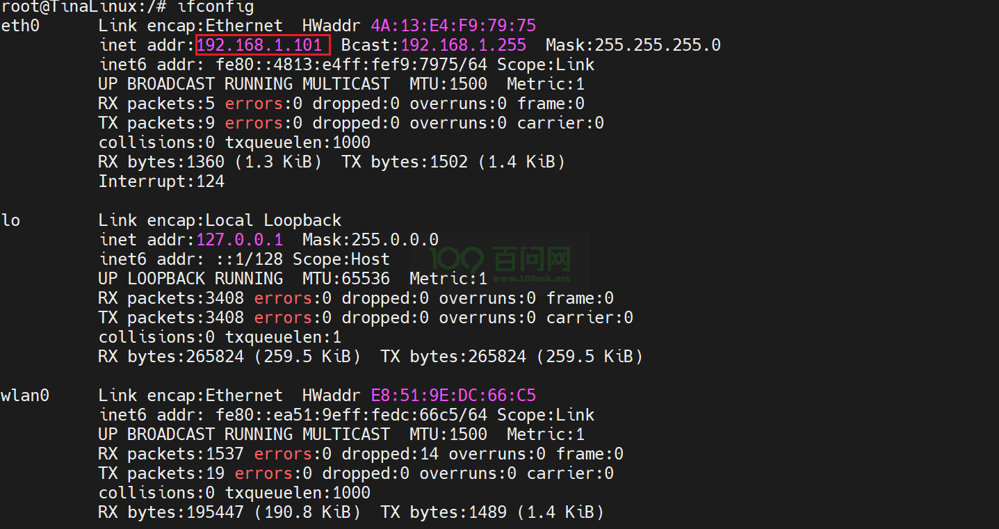
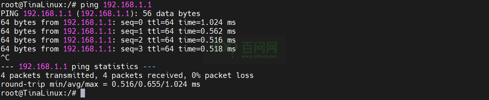

# 以太网测试

## 引言

欢迎来到 R818-DshanPI-ROSx 的以太网测试指南。在本教程中，我们将引导您完成设备通过以太网连接到网络的步骤。无论您是初学者还是有一定经验的用户，本指南都将为您提供必要的信息和步骤。

## 准备工作

为了确保您能够顺利进行WiFi联网配置，请准备以下硬件和软件准备：

### 硬件要求

- **typeC线:** 2根。 
- **OTG&串口二合一模块：** 1块。同时实现OTG(可烧录与使用ADB)和串口功能。
- **网线：** 1根。 

### 软件要求

- **Mobaxterm:** 用于登录串口。

接下来将讲解如何实现以太网通信，在这之前先登录串口终端(也可以使用ADB登录)，请参考前面快速启动的《启动开发板》章节。

## 以太网通信测试

开发板启动系统之后，默认打开eth0接口，执行 **ifconfig** ，可以看到如下信息：

用一根能用于上网的网线接入网口，系统会打印相应信息。

接入网线后，系统会自动获取ip地址，再次执行 **ifconfig** ，可以看到如下信息。

最后测试一下是否能ping通，如果接的网线能访问外网可以直接ping百度来测试，这里ping网关地址，

能ping通，表明以太网接口可用。

## 常见问题解答 (FAQ)

暂无。

## 总结

恭喜您！您已经成功地将 R818-DshanPI-ROSx 通过以太网连接到网络。现在，您可以开始使用设备进行网络通信了。

## 反馈和改进

如果您有任何疑问或建议，请随时联系我们。我们期待您的反馈，以便我们不断改进本指南。有任何学习上的问题可以在论坛上发帖子。

论坛地址：[最新Allwinner话题 - 嵌入式开发问答社区](https://forums.100ask.net/c/aw/15)