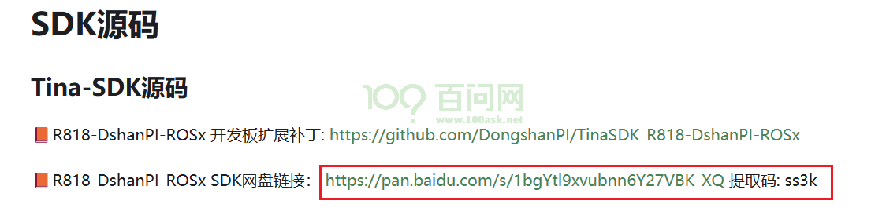
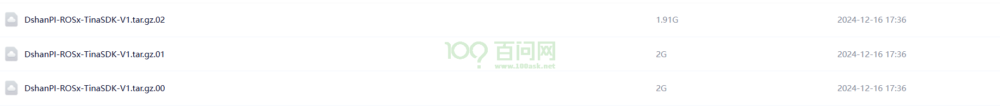
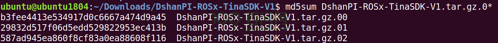
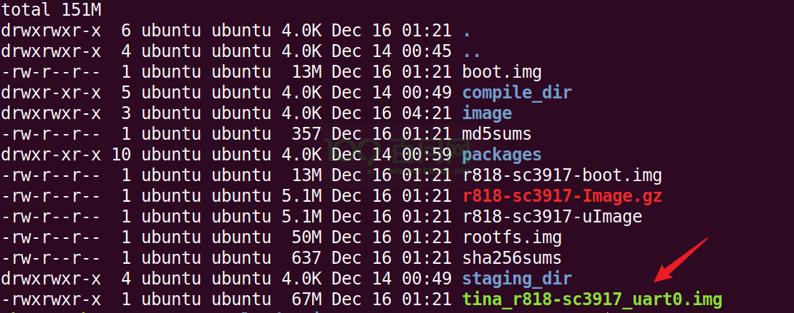

# 开发环境搭建

本章节将讲解如何在 **ubuntu18.04.6** 搭建 R818-DshanPI-ROSx 的开发环境。

## 获取SDK源码

首先，在 Windows 上，打开前面的章节《源码工具文档手册》，找到SDK源码。

如下：

SDK源码需要通过百度网盘下载，一共有三个压缩包，如下所示：

下载完成后，通过网络等方式拷贝到 Ubuntu 虚拟机目录下(路径自行选择)。

拷贝完成之后，先比对一下MD5值，查看是否拷贝完整，执行以下指令:

~~~bash
md5sum DshanPI-ROSx-TinaSDK-V1.tar.gz.0*
~~~

比对值应如下：

比对完整之后，执行以下指令，进行解压。

~~~bash
cat DshanPI-ROSx-TinaSDK-V1.tar.gz.0* | tar -xzvf -
~~~

解压后，SDK包名是**DshanPI-ROSx-TinaSDK-V1** 。

## 获取补丁包

基于 R818-DshanPI-ROSx 开发板，我们提供了一个扩展补丁包，执行以下指令，获取扩展支持仓库，然后加以应用，这里把SDK源码放在**用户目录下 ~/** 。

~~~bash
cd ~/
git clone https://github.com/DongshanPI/TinaSDK_R818-DshanPI-ROSx.git
cd TinaSDK_R818-DshanPI-ROSx
git submodule update --init
cp ./* -rfvd ~/DshanPI-ROSx-TinaSDK-V1/
~~~

## 编译固件

进入SDK源码目录下，执行以下指令，选择相应板卡**r818_sc3917-tina**。

~~~bash
ubuntu@ubuntu1804:~/$ cd ~/DshanPI-ROSx-TinaSDK-V1/
ubuntu@ubuntu1804:~/DshanPI-ROSx-TinaSDK-V1$ source build/envsetup.sh
ubuntu@ubuntu1804:~/DshanPI-ROSx-TinaSDK-V1$ lunch

You're building on Linux

Lunch menu... pick a combo:
     1. r818_sc3917-tina

Which would you like?: 1
============================================
TINA_BUILD_TOP=/home/ubuntu/Downloads/DshanPI-ROSx-TinaSDK-V1/DshanPI-ROSx-TinaSDK-V1
TINA_TARGET_ARCH=aarch64
TARGET_PRODUCT=r818_sc3917
TARGET_PLATFORM=r818
TARGET_BOARD=r818-sc3917
TARGET_PLAN=sc3917
TARGET_BUILD_VARIANT=tina
TARGET_BUILD_TYPE=release
TARGET_KERNEL_VERSION=4.9
TARGET_UBOOT=u-boot-2018
TARGET_CHIP=sun50iw10p1
============================================
no buildserver to clean
[1] 10014
~~~

选完板卡之后，继续在当前路径下，执行以下指令，进行编译。

~~~bash
ubuntu@ubuntu1804:~/DshanPI-ROSx-TinaSDK-V1$ make
~~~

编译时间大概是20~30分钟，具体编译时间，依据电脑性能决定。

## 生成镜像

编译完成之后，继续在当前路径下，执行以下指令，进行打包。

~~~bash
ubuntu@ubuntu1804:~/DshanPI-ROSx-TinaSDK-V1$ pack
~~~

打包成功后，会在SDK源码的 **out/r818-sc3917/** 路径下，生成一个用于烧录的镜像 **tina_r818-sc3917_uart0.img** 。

如下所示：

