# 更新系统固件

## 烧写固件至SPINand
### 准备工作

**硬件：**

* USB TypeC线 X2

**软件：**

* 全志线刷工具：[AllwinnertechPhoeniSuit.zip](https://dl.100ask.net/Hardware/MPU/T113i-Industrial/Tools/AllwinnertechPhoeniSuit.zip)
* 全志USB烧录驱动：[AllwinnerUSBFlashDeviceDriver.zip](https://dl.100ask.net/Hardware/MPU/T113i-Industrial/Tools/AllwinnerUSBFlashDeviceDriver.zip)
* 镜像：[T113i-DevKit-DefaultSystem.7z](https://dl.100ask.net/Hardware/MPU/T113i-Industrial/Images/T113i-DevKit-DefaultSystem.7z)
> 镜像说明：该镜像T113i-DevKit-DefaultSystem.7z，不支持tvd，spi-tft，4g功能（需要到相应板载功能文档里下载对应的镜像），其他功能基本支持。md5值：50bc57d6f3ab185394d433871c0d4bbf

### 连接开发板
更新系统固件前，先连接开发板，TypeC线连接接口位置如下图所示：

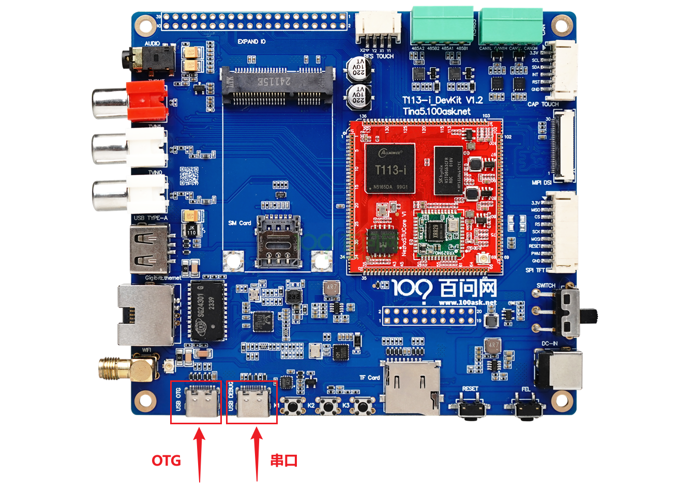

将两个TypeC线分别连至T113-i开发板 `OTG烧录接口 ` `调试&串口接口`  Typec线另一端 连接至 电脑USB接口，连接成功后，可以先获取软件 `全志线刷工具` 、`全志USB烧录驱动` 和 `镜像` 安装包进行解压缩操作。

> 注意：连接至OTG接口的Typec线的另一端需要接到电脑的usb口，不要接入usb hub口，一些usb hub口不足5V，容易导致后面烧录出现失败。

### 安装usb驱动
在我们连接好开发板以后，打开开关，按住 T113-i开发板 `烧录模式按键` 也称为**FEL** 烧写模式按键，不要松开，之后按一下 `系统复位按键`也称 **RESET** 复位键，再松开FEL键，就可以自动进入烧写模式。如下图：

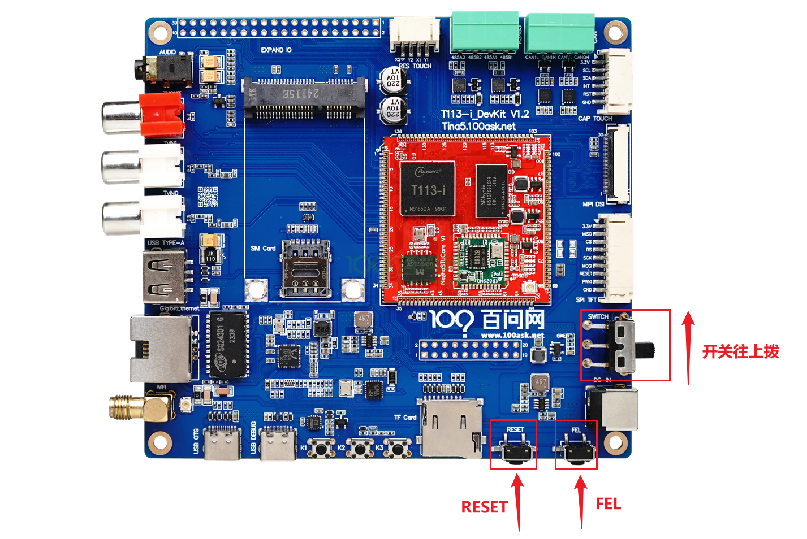

这时我们可以看到电脑设备管理器  **通用串行总线控制器** 部分弹出一个  未知设备 ，这个时候我们就需要把我们提前下载好的 **全志USB烧录驱动** 进行修改，然后将解压缩过的 **全志USB烧录驱动**  压缩包，解压缩，可以看到里面有这么几个文件。

```bash
InstallUSBDrv.exe
drvinstaller_IA64.exe
drvinstaller_X86.exe
UsbDriver/          
drvinstaller_X64.exe   
install.bat
```

对于wind7系统的同学，只需要以管理员 打开   `install.bat` 脚本，等待安装，在弹出的 是否安装驱动的对话框里面，点击安装即可。

对于wind10/wind11系统的同学，需要在设备管理器里面进行手动安装驱动。

如下图所示，在第一次插入OTG设备，进入烧写模式设备管理器会弹出一个未知设备。

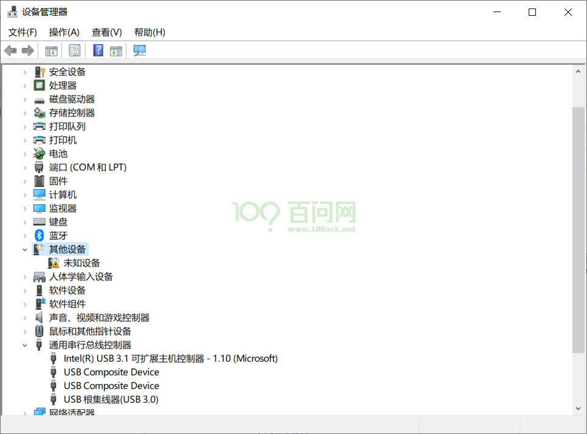

接下来鼠标右键点击这个未知设备，在弹出的对话框里， 点击浏览我计算机以查找驱动程序软件。

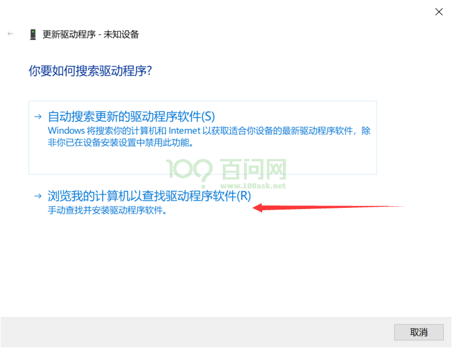

之后在弹出新的对话框里，点击浏览找到我们之前下载好的 usb烧录驱动文件夹内，找到 `UsbDriver/` 这个目录，并进入，之后点击确定即可。

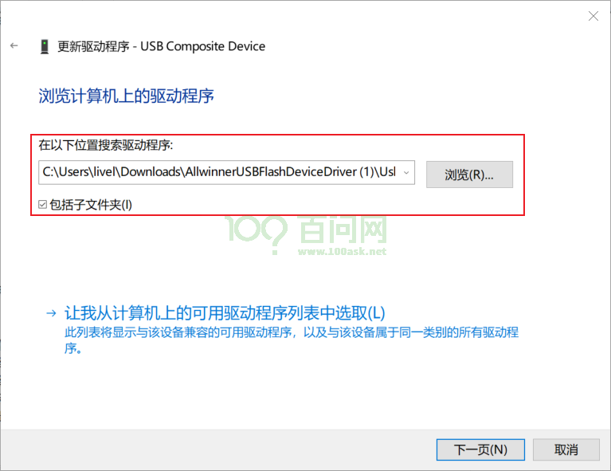

注意进入到  `UsbDriver/`  文件夹，然后点击确定，如下图所示。

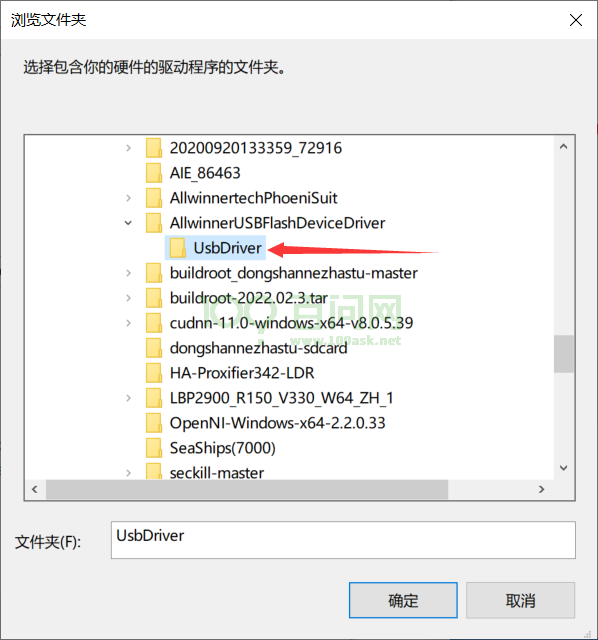

此时，我们继续点击 **下一页** 按钮，这时系统就会提示安装一个驱动程序。 

在弹出的对话框里，我们点击 始终安装此驱动程序软件 等待安装完成。

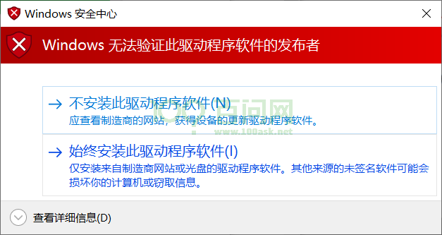

安装完成后，会提示，Windows已成功更新你的驱动程序。

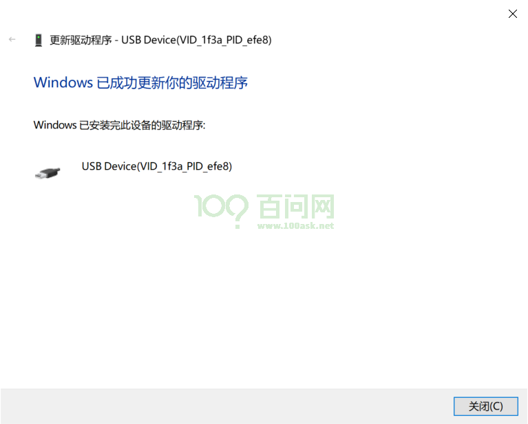


最后我们可以看到，设备管理器 里面的未知设备 变成了一个 `USB Device(VID_1f3a_efe8)`的设备，这时就表明设备驱动已经安装成功。


### 运行软件烧写
将下载下来的全志线刷工具 **AllwinnertechPhoeniSuit** 解压缩，同时将**SPI Nand系统镜像 T113i-DevKit-DefaultSystem.7z**下载下来也进行解压缩。

解压后，得到一个**T113i-DevKit-DefaultSystem.img** 镜像，用于烧录到SPI NAND镜像。另一个是**AllwinnertechPhoeniSuit**文件夹。

首先我们进入到 **AllwinnertechPhoeniSuit** 目录下 找到 **PhoenixSuit.exe** 双击运行。

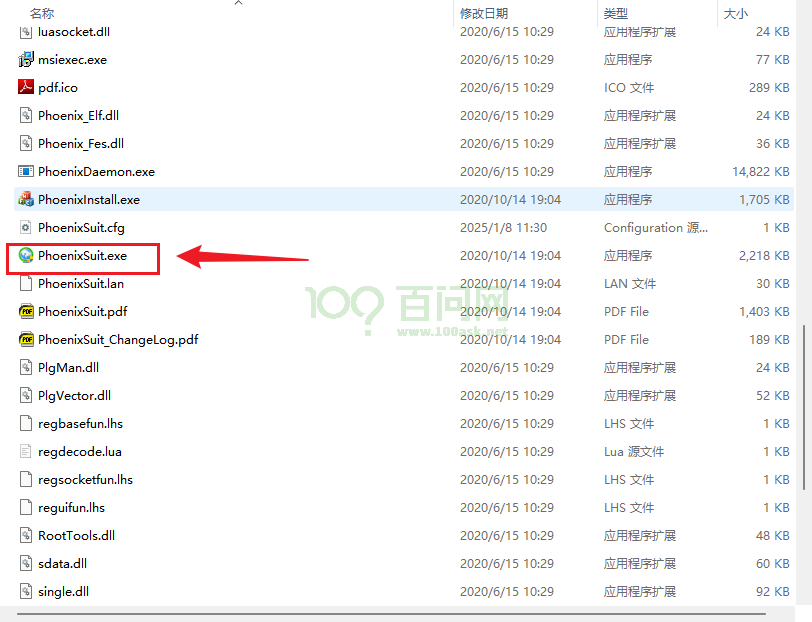

打开软件后，软件主界面如下图所示。

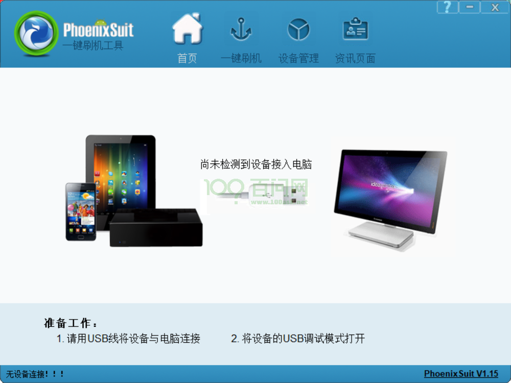

接下来 我们需要切换到 **一键刷机**窗口，如下图所示，点击红框标号①，在弹出的新窗口内，我们点击 红框② **浏览** 找到我们的 SPI Nand 系统镜像  **T113i-DevKit-DefaultSystem.img** ，选中镜像后，最后点击红框③ **全盘擦除升级** 。

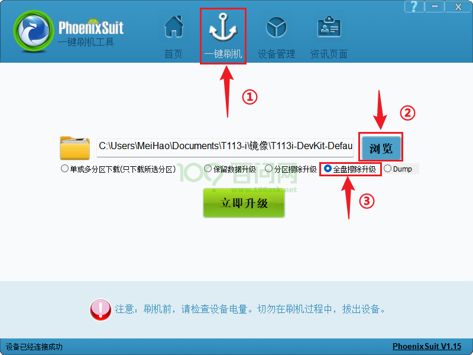

点击完成后，**不需要理会弹出的信息**，**也不用点击立即升级**，这时我们拿起已经连接好的开发板，先按住 **FEL** 烧写模式按键，之后按一下 **RESET** 系统复位键，就可以自动进入烧写模式并开始烧写。烧写时会提示烧写进度条，烧写完成后 开发板会自己重启。

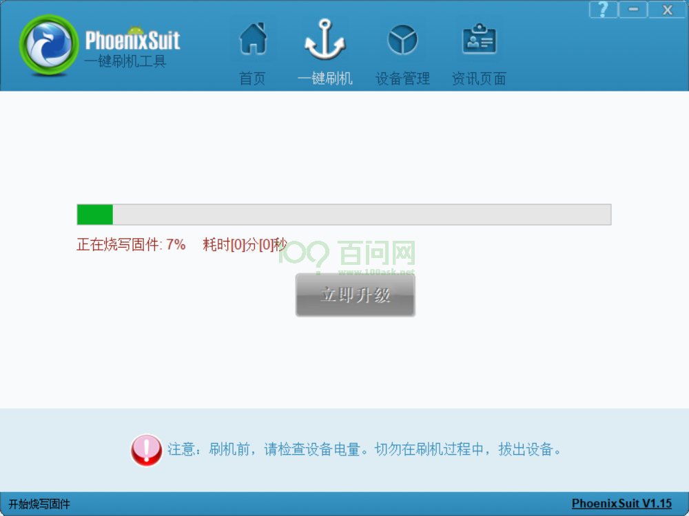


### 启动系统

一般情况下，烧写成功后 都会自动重启 启动系统，此时我们进入到 串口终端，可以看到它的启动信息，等所有启动信息加载完成。

~~~bash
[27]HELLO! BOOT0 is starting!
[30]BOOT0 commit : 069ed30b88
[33]set pll start
[38]periph0 has been enabled
[41]set pll end
[43][pmu]: bus read error
[45]board init ok
[47]enable_jtag
[49]get_pmu_exist() = -1
[51]DRAM BOOT DRIVE INFO: V0.34
[54]DRAM CLK = 792 MHz
[56]DRAM Type = 3 (2:DDR2,3:DDR3)
[60]DRAMC ZQ value: 0x7b7bfb
[62]DRAM ODT value: 0x42.
[65]ddr_efuse_type: 0x0
[68]DRAM SIZE = 512 MB
[75]DRAM simple test OK.
[77]rtc standby flag is 0x0, super standby flag is 0x0
[82]dram size =512
[85]card no is 2
[86]sdcard 2 line count 4
[89][mmc]: mmc driver ver 2021-05-21 14:47
[98][mmc]: Wrong media type 0x0, but host sdc2, try mmc first
[103][mmc]: ***Try MMC card 2***
[111][mmc]: mmc 2 cmd 1 timeout, err 100
[114][mmc]: mmc 2 cmd 1 err 100
[117][mmc]: mmc 2 send op cond failed
[121][mmc]: MMC card 2 Card did not respond to voltage select!
[126][mmc]: ***SD/MMC 2 init error!!!***
[133][mmc]: ***Try SD card 2***
[147][mmc]: HSSDR52/SDR25 4 bit
[149][mmc]: 50000000 Hz
[152][mmc]: 3696 MB
[154][mmc]: ***SD/MMC 2 init OK!!!***
[249]Loading boot-pkg Succeed(index=0).
[253]Entry_name        = u-boot
[260]Entry_name        = optee
[264]Entry_name        = dtb
[267]mmc not para
[269]Jump to second Boot.
M/TC: OP-TEE version: 2a99a16f (gcc version 5.3.1 20160412 (Linaro GCC 5.3-2016.05)) #1 Thu Aug 17 11:13:02 UTC 2023 arm
E/TC:0 0 platform_standby_fdt_parse:126 no pmu0 node
E/TC:0 0 sunxi_twi_parse_from_dt:121 no pmu node


U-Boot 2018.07-g6047f84-dirty (Jul 19 2024 - 10:05:01 +0800) Allwinner Technology

[00.340]CPU:   Allwinner Family
[00.343]Model: sun8iw20
[00.345]DRAM:  512 MiB
[00.348]Relocation Offset is: 1cebd000
[00.376]secure enable bit: 0
E/TC:0   fdt_getprop_u32:336 prop trace_level not found
[00.389]CPU=1008 MHz,PLL6=600 Mhz,AHB=200 Mhz, APB1=100Mhz  MBus=300Mhz
[00.396]gic: sec monitor mode
SPI ALL:   ready
[00.401]line:703 init_clocks
[00.404]flash init start
[00.406]workmode = 0,storage type = 2
[00.409][mmc]: mmc driver ver uboot2018:2023-07-4 16:18:00
[00.415][mmc]: get sdly from uboot header fail
[00.420][mmc]: Is not EXT_PARA0_ID or EXT_PARA0_TUNING_SUCCESS_FLAG!
[00.426][mmc]: SUNXI SDMMC Controller Version:0x50310
[00.447][mmc]: card_caps:0x3000000a
[00.450][mmc]: host_caps:0x3000003f
[00.457][mmc]: read mmc 2 info ok
[00.460]sunxi flash init ok
[00.462]drv_disp_init
partno erro : can't find partition bootloader
[00.508]drv_disp_init finish
[00.518]Loading Environment from SUNXI_FLASH... OK
[00.537]boot_gui_init:start
partno erro : can't find partition Reserve0
[00.545]lcd_open_flow
[00.548]lcd_cfg_panel_info
[00.551]lcd_power_on
bad fb1_cfg[w=0,h=0,bpp=32,format=0]
[00.581]boot_gui_init:finish
partno erro : can't find partition bootloader
[00.590]bmp_name=bootlogo.bmp size 1152054
[00.651]Item0 (Map) magic is bad
[00.654]the secure storage item0 copy0 magic is bad
[00.659]Item0 (Map) magic is bad
[00.662]the secure storage item0 copy1 magic is bad
[00.667]Item0 (Map) magic is bad
secure storage read widevine fail
secure storage read ec_key fail
secure storage read ec_cert1 fail
secure storage read ec_cert2 fail
secure storage read ec_cert3 fail
secure storage read rsa_key fail
secure storage read rsa_cert1 fail
secure storage read rsa_cert2 fail
secure storage read rsa_cert3 fail
[00.697] tft08006 drivers/video/sunxi/disp2/disp/lcd/tft08006.c lcd_panel_init 162
[00.704]lcd_panel_init
[01.180]usb burn from boot
delay time 0
weak:otg_phy_config
[01.191]usb prepare ok
[01.241]lcd_bl_open
[01.244]LCD open finish
[01.381]usb sof ok
[01.383]usb probe ok
[01.385]usb setup ok
set address 0x3e
set address 0x3e ok
try to update
[01.790]do_burn_from_boot usb : have no handshake
List file under ULI/factory
** Unrecognized filesystem type **
[01.801]update part info
[01.804]update bootcmd
[01.810]change working_fdt 0x5c87ce68 to 0x5c85ce68
[01.815][mmc]: can't find node "sunxi-mmc2" try "mmc"
[01.820][mmc]: no mmc-hs400-1_8v!
[01.823][mmc]: no mmc-hs200-1_8v!
[01.826][mmc]: no mmc-ddr-1_8v!
[01.829][mmc]: get sunxi-mmc2 string failed
[01.834]The storage not support sample function
[01.858]update dts
Hit any key to stop autoboot:  0
[02.267]no vendor_boot partition is found
Android's image name: sun8i_arm
The loading address of the kernel is not in the boot image
ERROR: reserving fdt memory region failed (addr=41b00000 size=100000)
ERROR: reserving fdt memory region failed (addr=5c907000 size=177000)
[02.316]Starting kernel ...

[02.319][mmc]: mmc exit start
[02.332][mmc]: mmc 2 exit ok
[    0.000000] Booting Linux on physical CPU 0x0
[    0.000000] Linux version 5.4.61 (ubuntu@dshanpi) (arm-linux-gnueabi-gcc (Linaro GCC 5.3-2016.05) 5.3.1 20160412, GNU ld (Linaro_Binutils-2016.05) 2.25.0 Linaro 2016_02) #9 SMP PREEMPT Fri Jul 19 09:54:27 CST 2024
[    0.000000] CPU: ARMv7 Processor [410fc075] revision 5 (ARMv7), cr=10c5387d
[    0.000000] CPU: div instructions available: patching division code
[    0.000000] CPU: PIPT / VIPT nonaliasing data cache, VIPT aliasing instruction cache
[    0.000000] OF: fdt: Machine model: sun8iw20
[    0.000000] Memory policy: Data cache writealloc
[    0.000000] Reserved memory: created DMA memory pool at 0x42200000, size 0 MiB
[    0.000000] OF: reserved mem: initialized node vdev0buffer@42200000, compatible id shared-dma-pool
[    0.000000] Reserved memory: created DMA memory pool at 0x42244000, size 0 MiB
[    0.000000] OF: reserved mem: initialized node dsp0_rpbuf@42244000, compatible id shared-dma-pool
[    0.000000] Reserved memory: created DMA memory pool at 0x42900000, size 0 MiB
[    0.000000] OF: reserved mem: initialized node vdev0buffer@42900000, compatible id shared-dma-pool
[    0.000000] cma: Reserved 16 MiB at 0x5f000000
[    0.000000] On node 0 totalpages: 129120
[    0.000000]   Normal zone: 1024 pages used for memmap
[    0.000000]   Normal zone: 0 pages reserved
[    0.000000]   Normal zone: 129120 pages, LIFO batch:31
[    0.000000] psci: probing for conduit method from DT.
[    0.000000] psci: PSCIv1.0 detected in firmware.
[    0.000000] psci: Using standard PSCI v0.2 function IDs
[    0.000000] psci: MIGRATE_INFO_TYPE not supported.
[    0.000000] psci: SMC Calling Convention v1.0
[    0.000000] percpu: Embedded 15 pages/cpu s30976 r8192 d22272 u61440
[    0.000000] pcpu-alloc: s30976 r8192 d22272 u61440 alloc=15*4096
[    0.000000] pcpu-alloc: [0] 0 [0] 1
[    0.000000] Built 1 zonelists, mobility grouping on.  Total pages: 128096
[    0.000000] Kernel command line: earlycon=uart8250,mmio32,0x02500000 clk_ignore_unused initcall_debug=0 console=ttyS0,115200 loglevel=8 root=/dev/mmcblk0p5 rootwait init=/init partitions=boot-resource@mmcblk0p1:env@mmcblk0p2:env-redund@mmcblk0p3:boot@mmcblk0p4:rootfs@mmcblk0p5:riscv@mmcblk0p6:private@mmcblk0p7:UDISK@mmcblk0p8 cma=16M snum= mac_addr= wifi_mac= bt_mac= specialstr= gpt=1 androidboot.mode=normal androidboot.hardware=sun8iw20p1 boot_type=2 androidboot.boot_type=2 gpt=1 uboot_message=2018.07-g6047f84-dirty(07/19/2024-10:05:01) mbr_offset=1032192 disp_reserve=1536000,0x5c907000 androidboot.dramfreq=792 androidboot.dramsize=512 mtdparts=<NULL> uboot_backup=ubootA
[    0.000000] Dentry cache hash table entries: 65536 (order: 6, 262144 bytes, linear)
[    0.000000] Inode-cache hash table entries: 32768 (order: 5, 131072 bytes, linear)
[    0.000000] mem auto-init: stack:off, heap alloc:off, heap free:off
[    0.000000] Memory: 470400K/516480K available (7168K kernel code, 426K rwdata, 2580K rodata, 1024K init, 195K bss, 29696K reserved, 16384K cma-reserved, 0K highmem)
[    0.000000] SLUB: HWalign=64, Order=0-3, MinObjects=0, CPUs=2, Nodes=1
[    0.000000] rcu: Preemptible hierarchical RCU implementation.
[    0.000000]  Tasks RCU enabled.
[    0.000000] rcu: RCU calculated value of scheduler-enlistment delay is 10 jiffies.
[    0.000000] NR_IRQS: 16, nr_irqs: 16, preallocated irqs: 16
[    0.000000] random: get_random_bytes called from start_kernel+0x250/0x3d0 with crng_init=0
[    0.000000] arch_timer: cp15 timer(s) running at 24.00MHz (phys).
[    0.000000] clocksource: arch_sys_counter: mask: 0xffffffffffffff max_cycles: 0x588fe9dc0, max_idle_ns: 440795202592 ns
[    0.000006] sched_clock: 56 bits at 24MHz, resolution 41ns, wraps every 4398046511097ns
[    0.000018] Switching to timer-based delay loop, resolution 41ns
[    0.000206] clocksource: timer: mask: 0xffffffff max_cycles: 0xffffffff, max_idle_ns: 79635851949 ns
[    0.000885] Console: colour dummy device 80x30
[    0.000927] Calibrating delay loop (skipped), value calculated using timer frequency.. 48.00 BogoMIPS (lpj=240000)
[    0.000942] pid_max: default: 32768 minimum: 301
[    0.001098] Mount-cache hash table entries: 1024 (order: 0, 4096 bytes, linear)
[    0.001114] Mountpoint-cache hash table entries: 1024 (order: 0, 4096 bytes, linear)
[    0.001779] CPU: Testing write buffer coherency: ok
[    0.002130] /cpus/cpu@0 missing clock-frequency property
[    0.002154] /cpus/cpu@1 missing clock-frequency property
[    0.002167] CPU0: thread -1, cpu 0, socket 0, mpidr 80000000
[    0.002774] Setting up static identity map for 0x40100000 - 0x40100060
[    0.002906] rcu: Hierarchical SRCU implementation.
[    0.003227] BOOTEVENT:         3.218790: ON
[    0.003437] smp: Bringing up secondary CPUs ...
[    0.004678] CPU1: thread -1, cpu 1, socket 0, mpidr 80000001
[    0.004836] smp: Brought up 1 node, 2 CPUs
[    0.004850] SMP: Total of 2 processors activated (96.00 BogoMIPS).
[    0.004857] CPU: All CPU(s) started in SVC mode.
[    0.005397] devtmpfs: initialized
[    0.019458] VFP support v0.3: implementor 41 architecture 2 part 30 variant 7 rev 5
[    0.020099] clocksource: jiffies: mask: 0xffffffff max_cycles: 0xffffffff, max_idle_ns: 19112604462750000 ns
[    0.020130] futex hash table entries: 512 (order: 3, 32768 bytes, linear)
[    0.021019] pinctrl core: initialized pinctrl subsystem
[    0.022526] NET: Registered protocol family 16
[    0.024639] DMA: preallocated 256 KiB pool for atomic coherent allocations
[    0.065877] rtc_ccu: sunxi ccu init OK
[    0.068286] ccu: sunxi ccu init OK
[    0.068817] r_ccu: sunxi ccu init OK
[    0.112768] sun6i-dma 3002000.dma-controller: sunxi dma probed
[    0.115723] iommu: Default domain type: Translated
[    0.115953] sunxi iommu: irq = 24
[    0.117148] SCSI subsystem initialized
[    0.117533] usbcore: registered new interface driver usbfs
[    0.117637] usbcore: registered new interface driver hub
[    0.118195] usbcore: registered new device driver usb
[    0.118396] mc: Linux media interface: v0.10
[    0.118465] videodev: Linux video capture interface: v2.00
[    0.119869] Advanced Linux Sound Architecture Driver Initialized.
[    0.120677] Bluetooth: Core ver 2.22
[    0.120767] NET: Registered protocol family 31
[    0.120778] Bluetooth: HCI device and connection manager initialized
[    0.120800] Bluetooth: HCI socket layer initialized
[    0.120813] Bluetooth: L2CAP socket layer initialized
[    0.120843] Bluetooth: SCO socket layer initialized
[    0.121121] pwm module init!
[    0.126518] g2d 5410000.g2d: Adding to iommu group 0
[    0.127015] G2D: rcq version initialized.major:250
[    0.127775] input: sunxi-keyboard as /devices/virtual/input/input0
[    0.129467] clocksource: Switched to clocksource arch_sys_counter
[    0.139171] sun8iw20-pinctrl pio: initialized sunXi PIO driver
[    0.155105] thermal_sys: Registered thermal governor 'step_wise'
[    0.155114] thermal_sys: Registered thermal governor 'user_space'
[    0.155129] thermal_sys: Registered thermal governor 'power_allocator'
[    0.155687] NET: Registered protocol family 2
[    0.156455] tcp_listen_portaddr_hash hash table entries: 512 (order: 0, 6144 bytes, linear)
[    0.156507] TCP established hash table entries: 4096 (order: 2, 16384 bytes, linear)
[    0.156560] TCP bind hash table entries: 4096 (order: 3, 32768 bytes, linear)
[    0.156623] TCP: Hash tables configured (established 4096 bind 4096)
[    0.156732] UDP hash table entries: 256 (order: 1, 8192 bytes, linear)
[    0.156769] UDP-Lite hash table entries: 256 (order: 1, 8192 bytes, linear)
[    0.156947] NET: Registered protocol family 1
[    0.159942] Initialise system trusted keyrings
[    0.160115] workingset: timestamp_bits=30 max_order=17 bucket_order=0
[    0.171108] squashfs: version 4.0 (2009/01/31) Phillip Lougher
[    0.171400] ntfs: driver 2.1.32 [Flags: R/W].
[    0.171731] fuse: init (API version 7.31)
[    0.200434] NET: Registered protocol family 38
[    0.200461] Key type asymmetric registered
[    0.200471] Asymmetric key parser 'x509' registered
[    0.200581] Block layer SCSI generic (bsg) driver version 0.4 loaded (major 248)
[    0.200594] io scheduler mq-deadline registered
[    0.200603] io scheduler kyber registered
[    0.200900] atomic64_test: passed
[    0.202531] [DISP]disp_module_init
[    0.203156] disp 5000000.disp: Adding to iommu group 0
[    0.203798] [DISP] disp_init,line:2372:
[    0.203803] smooth display screen:0 type:1 mode:4
[    0.220874] lcd_cfg_panel_info
[    0.220889] tft08006
[    0.220927] display_fb_request,fb_id:0
[    0.227050] disp_al_manager_apply ouput_type:1
[    0.227230] [DISP] lcd_clk_config,line:777:
[    0.227241] disp 0, clk: pll(300000000),clk(300000000),dclk(25000000) dsi_rate(25000000)
[    0.227241]      clk real:pll(300000000),clk(300000000),dclk(75000000) dsi_rate(150000000)
[    0.227553] sun8iw20-pinctrl pio: pio supply vcc-pb not found, using dummy regulator
[    0.228436] [DISP]disp_module_init finish
[    0.229925] sunxi_sid_init()783 - insmod ok
[    0.230664] pwm-regulator: supplied by regulator-dummy
[    0.232456] uart uart0: uart0 supply uart not found, using dummy regulator
[    0.232810] uart0: ttyS0 at MMIO 0x2500000 (irq = 34, base_baud = 1500000) is a SUNXI
[    0.232840] sw_console_setup()1831 - console setup baud 115200 parity n bits 8, flow n
[    1.155146] printk: console [ttyS0] enabled
[    1.160649] sun8iw20-pinctrl pio: pio supply vcc-pg not found, using dummy regulator
[    1.169720] uart uart1: uart1 supply uart not found, using dummy regulator
[    1.177773] uart1: ttyS1 at MMIO 0x2500400 (irq = 35, base_baud = 1500000) is a SUNXI
[    1.187337] uart uart2: uart2 supply uart not found, using dummy regulator
[    1.195411] uart2: ttyS2 at MMIO 0x2500800 (irq = 36, base_baud = 1500000) is a SUNXI
[    1.205000] uart uart3: uart3 supply uart not found, using dummy regulator
[    1.213071] uart3: ttyS3 at MMIO 0x2500c00 (irq = 37, base_baud = 1500000) is a SUNXI
[    1.222966] misc dump reg init
[    1.226924] deinterlace 5400000.deinterlace: Adding to iommu group 0
[    1.234620] deinterlace 5400000.deinterlace: version[1.0.0], ip=0x110
[    1.243578] sunxi-rfkill soc@3000000:rfkill@0: module version: v1.0.9
[    1.250846] sunxi-rfkill soc@3000000:rfkill@0: get gpio chip_en failed
[    1.258128] sunxi-rfkill soc@3000000:rfkill@0: get gpio power_en failed
[    1.265539] sunxi-rfkill soc@3000000:rfkill@0: wlan_busnum (1)
[    1.272058] sunxi-rfkill soc@3000000:rfkill@0: Missing wlan_power.
[    1.278958] sunxi-rfkill soc@3000000:rfkill@0: wlan clock[0] (32k-fanout1)
[    1.286665] sunxi-rfkill soc@3000000:rfkill@0: wlan_regon gpio=44 assert=1
[    1.294384] sunxi-rfkill soc@3000000:rfkill@0: wlan_hostwake gpio=202 assert=1
[    1.302474] sunxi-rfkill soc@3000000:rfkill@0: wakeup source is enabled
[    1.310142] sunxi-rfkill soc@3000000:rfkill@0: Missing bt_power.
[    1.316877] sunxi-rfkill soc@3000000:rfkill@0: bt clock[0] (32k-fanout1)
[    1.324401] sunxi-rfkill soc@3000000:rfkill@0: bt_rst gpio=210 assert=0
[    1.332823] [ADDR_MGT] addr_mgt_probe: module version: v1.0.11
[    1.340138] [ADDR_MGT] addr_init: Failed to get type_def_bt, use default: 0
[    1.347931] [ADDR_MGT] addr_mgt_probe: success.
[    1.354567] libphy: Fixed MDIO Bus: probed
[    1.359151] CAN device driver interface
[    1.364620] sunxi-awlink awlink@0x0: awlink driver probe ok ...
[    1.372298] sunxi-awlink awlink@0x1: awlink driver probe ok ...
[    1.379935] sun8iw20-pinctrl pio: pio supply vcc-pe not found, using dummy regulator
[    1.389039] gmac-power0: NULL
[    1.392382] gmac-power1: NULL
[    1.395688] gmac-power2: NULL
[    1.398992] random: fast init done
[    1.403757] Freeing logo buffer memory: 1500K
[    1.409978] Failed to alloc md5
[    1.413503] eth0: Use random mac address
[    1.418378] usbcore: registered new interface driver asix
[    1.424549] usbcore: registered new interface driver ax88179_178a
[    1.431441] usbcore: registered new interface driver cdc_ether
[    1.438025] usbcore: registered new interface driver net1080
[    1.444415] usbcore: registered new interface driver cdc_subset
[    1.451101] usbcore: registered new interface driver zaurus
[    1.457415] usbcore: registered new interface driver cdc_ncm
[    1.463741] ehci_hcd: USB 2.0 'Enhanced' Host Controller (EHCI) Driver
[    1.471036] sunxi-ehci: EHCI SUNXI driver
[    1.476004] get drvvbus-en is fail, 22
[    1.480214] get ehci0-controller wakeup-source is fail.
[    1.486170] sunxi ehci0-controller don't init wakeup source
[    1.492405] [sunxi-ehci0]: probe, pdev->name: 4101000.ehci0-controller, sunxi_ehci: 0xc0c911a8, 0x:e083d000, irq_no:3a
[    1.504343] [sunxi-ehci0]: Not init ehci0
[    1.509148] get drvvbus-en is fail, 22
[    1.513356] get ehci1-controller wakeup-source is fail.
[    1.519297] sunxi ehci1-controller don't init wakeup source
[    1.525530] [sunxi-ehci1]: probe, pdev->name: 4200000.ehci1-controller, sunxi_ehci: 0xc0c91708, 0x:e0883000, irq_no:3c
[    1.537740] sunxi-ehci 4200000.ehci1-controller: 4200000.ehci1-controller supply hci not found, using dummy regulator
[    1.550045] sunxi-ehci 4200000.ehci1-controller: EHCI Host Controller
[    1.557281] sunxi-ehci 4200000.ehci1-controller: new USB bus registered, assigned bus number 1
[    1.567368] sunxi-ehci 4200000.ehci1-controller: irq 60, io mem 0x04200000
[    1.609489] sunxi-ehci 4200000.ehci1-controller: USB 2.0 started, EHCI 1.00
[    1.617253] sunxi-ehci 4200000.ehci1-controller: ehci_irq: highspeed device connect
[    1.626840] hub 1-0:1.0: USB hub found
[    1.631105] hub 1-0:1.0: 1 port detected
[    1.636361] ohci_hcd: USB 1.1 'Open' Host Controller (OHCI) Driver
[    1.643344] sunxi-ohci: OHCI SUNXI driver
[    1.648315] get drvvbus-en is fail, 22
[    1.652530] get ohci0-controller wakeup-source is fail.
[    1.658495] sunxi ohci0-controller don't init wakeup source
[    1.664732] [sunxi-ohci0]: probe, pdev->name: 4101400.ohci0-controller, sunxi_ohci: 0xc0c91458
[    1.674346] [sunxi-ohci0]: Not init ohci0
[    1.679152] get drvvbus-en is fail, 22
[    1.683363] get ohci1-controller wakeup-source is fail.
[    1.689294] sunxi ohci1-controller don't init wakeup source
[    1.695544] [sunxi-ohci1]: probe, pdev->name: 4200400.ohci1-controller, sunxi_ohci: 0xc0c919b8
[    1.705441] sunxi-ohci 4200400.ohci1-controller: 4200400.ohci1-controller supply hci not found, using dummy regulator
[    1.717746] sunxi-ohci 4200400.ohci1-controller: OHCI Host Controller
[    1.724997] sunxi-ohci 4200400.ohci1-controller: new USB bus registered, assigned bus number 2
[    1.734925] sunxi-ohci 4200400.ohci1-controller: irq 61, io mem 0x04200400
[    1.814505] hub 2-0:1.0: USB hub found
[    1.818750] hub 2-0:1.0: 1 port detected
[    1.824292] usbcore: registered new interface driver uas
[    1.830407] usbcore: registered new interface driver usb-storage
[    1.837174] usbcore: registered new interface driver ums-alauda
[    1.843877] usbcore: registered new interface driver ums-cypress
[    1.850829] usbcore: registered new interface driver ums-datafab
[    1.857605] usbcore: registered new interface driver ums_eneub6250
[    1.864613] usbcore: registered new interface driver ums-freecom
[    1.871410] usbcore: registered new interface driver ums-isd200
[    1.878107] usbcore: registered new interface driver ums-jumpshot
[    1.884988] usbcore: registered new interface driver ums-karma
[    1.891582] usbcore: registered new interface driver ums-onetouch
[    1.898473] usbcore: registered new interface driver ums-realtek
[    1.905250] usbcore: registered new interface driver ums-sddr09
[    1.911981] usbcore: registered new interface driver ums-sddr55
[    1.918652] usbcore: registered new interface driver ums-usbat
[    1.926245] input: sunxi-ts as /devices/platform/soc@3000000/2009c00.rtp/input/input1
[    1.935986] sunxi_gpadc_init,2228, success
[    1.941240] sunxi_gpadc_setup: get channel scan data failed
[    1.947770] input: sunxi-gpadc0 as /devices/virtual/input/input2
[    1.956731] sunxi-rtc 7090000.rtc: registered as rtc0
[    1.962547] sunxi-rtc 7090000.rtc: setting system clock to 1970-01-01T00:00:40 UTC (40)
[    1.971515] sunxi-rtc 7090000.rtc: Fail to read dts property 'gpr_bootcount_pos'
[    1.979791] reasonbase NULL
[    1.982907] reason large than max, fix to hot reboot, save boot reason
[    1.990193] invalid reason or reasonbase NULL
[    1.995057] sunxi-rtc 7090000.rtc: sunxi rtc probed
[    2.000539] usb 1-1: new high-speed USB device number 2 using sunxi-ehci
[    2.008669] i2c /dev entries driver
[    2.012834] IR NEC protocol handler initialized
[    2.017931] IR RC5(x/sz) protocol handler initialized
[    2.026238] usbcore: registered new interface driver uvcvideo
[    2.032709] USB Video Class driver (1.1.1)
[    2.037286] gspca_main: v2.14.0 registered
[    2.041870] sunxi cedar version 1.1
[    2.045994] sunxi-cedar 1c0e000.ve: Adding to iommu group 0
[    2.052325] VE: sunxi_cedar_probe power-domain init!!!
[    2.058054] VE: install start!!!
[    2.058054]
[    2.063632] VE: cedar-ve the get irq is 45
[    2.063632]
[    2.070119] VE: ve_debug_proc_info:(ptrval), data:(ptrval), lock:(ptrval)
[    2.070119]
[    2.079334] VE: install end!!!
[    2.079334]
[    2.084415] VE: sunxi_cedar_probe
[    2.089726] sunxi-wdt 20500a0.watchdog: Watchdog enabled (timeout=16 sec, nowayout=0)
[    2.098893] Bluetooth: HCI UART driver ver 2.3
[    2.104033] Bluetooth: HCI UART protocol H4 registered
[    2.110108] Bluetooth: XRadio Bluetooth LPM Mode Driver Ver 1.0.10
[    2.117322] [XR_BT_LPM] bluesleep_probe: bt_wake polarity: 1
[    2.123767] [XR_BT_LPM] bluesleep_probe: host_wake polarity: 1
[    2.130324] [XR_BT_LPM] bluesleep_probe: wakeup source is disabled!
[    2.130324]
[    2.138946] [XR_BT_LPM] bluesleep_probe: uart_index(1)
[    2.147267] sun8iw20-pinctrl pio: pio supply vcc-pc not found, using dummy regulator
[    2.156176] sunxi-mmc 4022000.sdmmc: SD/MMC/SDIO Host Controller Driver(v4.25 2022-6-21 13:40)
[    2.166107] sunxi-mmc 4022000.sdmmc: ***ctl-spec-caps*** 8
[    2.172306] sunxi-mmc 4022000.sdmmc: No vmmc regulator found
[    2.178608] sunxi-mmc 4022000.sdmmc: No vqmmc regulator found
[    2.185038] sunxi-mmc 4022000.sdmmc: No vdmmc regulator found
[    2.191456] sunxi-mmc 4022000.sdmmc: No vd33sw regulator found
[    2.197960] sunxi-mmc 4022000.sdmmc: No vd18sw regulator found
[    2.204474] sunxi-mmc 4022000.sdmmc: No vq33sw regulator found
[    2.210978] sunxi-mmc 4022000.sdmmc: No vq18sw regulator found
[    2.217519] sunxi-mmc 4022000.sdmmc: Cann't get pin bias hs pinstate,check if needed
[    2.227019] sunxi-mmc 4022000.sdmmc: sdc set ios:clk 0Hz bm PP pm UP vdd 21 width 1 timing LEGACY(SDR12) dt B
[    2.231029] hub 1-1:1.0: USB hub found
[    2.238227] sunxi-mmc 4022000.sdmmc: no vqmmc,Check if there is regulator
[    2.242784] hub 1-1:1.0: 4 ports detected
[    2.262415] sunxi-mmc 4022000.sdmmc: sdc set ios:clk 400000Hz bm PP pm ON vdd 21 width 1 timing LEGACY(SDR12) dt B
[    2.285029] sunxi-mmc 4022000.sdmmc: detmode:alway in(non removable)
[    2.292171] sunxi-mmc 4022000.sdmmc: sdc set ios:clk 400000Hz bm PP pm ON vdd 21 width 1 timing LEGACY(SDR12) dt B
[    2.300753] sunxi-mmc 4020000.sdmmc: SD/MMC/SDIO Host Controller Driver(v4.25 2022-6-21 13:40)
[    2.313617] sunxi-mmc 4020000.sdmmc: ***ctl-spec-caps*** 8
[    2.314606] sunxi-mmc 4022000.sdmmc: sdc set ios:clk 400000Hz bm PP pm ON vdd 21 width 1 timing LEGACY(SDR12) dt B
[    2.319865] sunxi-mmc 4020000.sdmmc: No vmmc regulator found
[    2.337643] sunxi-mmc 4020000.sdmmc: No vqmmc regulator found
[    2.344080] sunxi-mmc 4020000.sdmmc: No vdmmc regulator found
[    2.350507] sunxi-mmc 4020000.sdmmc: No vd33sw regulator found
[    2.350516] sunxi-mmc 4022000.sdmmc: sdc set ios:clk 400000Hz bm PP pm ON vdd 21 width 1 timing LEGACY(SDR12) dt B
[    2.358289] sunxi-mmc 4022000.sdmmc: sdc set ios:clk 400000Hz bm PP pm ON vdd 21 width 1 timing LEGACY(SDR12) dt B
[    2.368569] sunxi-mmc 4020000.sdmmc: No vd18sw regulator found
[    2.386637] sunxi-mmc 4020000.sdmmc: No vq33sw regulator found
[    2.393234] sunxi-mmc 4020000.sdmmc: No vq18sw regulator found
[    2.400205] sunxi-mmc 4020000.sdmmc: Got CD GPIO
[    2.405793] sunxi-mmc 4020000.sdmmc: sdc set ios:clk 0Hz bm PP pm UP vdd 21 width 1 timing LEGACY(SDR12) dt B
[    2.416947] sunxi-mmc 4020000.sdmmc: no vqmmc,Check if there is regulator
[    2.437115] sunxi-mmc 4020000.sdmmc: sdc set ios:clk 400000Hz bm PP pm ON vdd 21 width 1 timing LEGACY(SDR12) dt B
[    2.458323] mmc0: host does not support reading read-only switch, assuming write-enable
[    2.467293] sunxi-mmc 4022000.sdmmc: sdc set ios:clk 25000000Hz bm PP pm ON vdd 21 width 1 timing LEGACY(SDR12) dt B
[    2.467297] sunxi-mmc 4020000.sdmmc: detmode:gpio polling
[    2.468004] sunxi-mmc 4021000.sdmmc: SD/MMC/SDIO Host Controller Driver(v4.25 2022-6-21 13:40)
[    2.485163] sunxi-mmc 4022000.sdmmc: sdc set ios:clk 25000000Hz bm PP pm ON vdd 21 width 4 timing LEGACY(SDR12) dt B
[    2.494807] sunxi-mmc 4020000.sdmmc: sdc set ios:clk 0Hz bm PP pm OFF vdd 0 width 1 timing LEGACY(SDR12) dt B
[    2.506598] mmc0: new SDHC card at address 1388
[    2.517923] sunxi-mmc 4021000.sdmmc: ***ctl-spec-caps*** 8
[    2.524067] mmcblk0: mmc0:1388 MK    3.61 GiB
[    2.528932] sunxi-mmc 4021000.sdmmc: No vmmc regulator found
[    2.540162] sunxi-mmc 4021000.sdmmc: No vqmmc regulator found
[    2.546699] sunxi-mmc 4021000.sdmmc: No vdmmc regulator found
[    2.553219] sunxi-mmc 4021000.sdmmc: No vd33sw regulator found
[    2.559802] sunxi-mmc 4021000.sdmmc: No vd18sw regulator found
[    2.566377] sunxi-mmc 4021000.sdmmc: No vq33sw regulator found
[    2.566417]  mmcblk0: p1 p2 p3 p4 p5 p6 p7 p8
[    2.572899] sunxi-mmc 4021000.sdmmc: No vq18sw regulator found
[    2.572934] sunxi-mmc 4021000.sdmmc: Cann't get pin bias hs pinstate,check if needed
[    2.593829] sunxi-mmc 4021000.sdmmc: sdc set ios:clk 0Hz bm PP pm UP vdd 21 width 1 timing LEGACY(SDR12) dt B
[    2.604980] sunxi-mmc 4021000.sdmmc: no vqmmc,Check if there is regulator
[    2.625100] sunxi-mmc 4021000.sdmmc: sdc set ios:clk 400000Hz bm PP pm ON vdd 21 width 1 timing LEGACY(SDR12) dt B
[    2.649278] sunxi-mmc 4021000.sdmmc: detmode:manually by software
[    2.656930] sunxi-mmc 4021000.sdmmc: smc 2 p1 err, cmd 52, RTO !!
[    2.657470] usbcore: registered new interface driver usbhid
[    2.670008] usbhid: USB HID core driver
[    2.670816] sunxi-mmc 4021000.sdmmc: smc 2 p1 err, cmd 52, RTO !!
[    2.674293] exFAT: Version 1.3.0
[    2.684693] sunxi-mmc 4021000.sdmmc: sdc set ios:clk 400000Hz bm PP pm ON vdd 21 width 1 timing LEGACY(SDR12) dt B
[    2.696804] sunxi-msgbox 3003000.msgbox: sunxi_msgbox_probe(): sunxi msgbox start probe
[    2.706206] sunxi-msgbox 3003000.msgbox: sunxi_msgbox_probe(): sunxi msgbox probe success
[    2.716072] sunxi-rproc 3000008.dsp_rproc: sunxi rproc driver 2.2.1
[    2.723106] sunxi-mmc 4021000.sdmmc: sdc set ios:clk 400000Hz bm PP pm ON vdd 21 width 1 timing LEGACY(SDR12) dt B
[    2.729489] sunxi-rproc 3000008.dsp_rproc: failed to get firmware-name
[    2.741946] sunxi-mmc 4021000.sdmmc: smc 2 p1 err, cmd 5, RTO !!
[    2.748687] sunxi-mmc 4021000.sdmmc: smc 2 p1 err, cmd 5, RTO !!
[    2.755407] sunxi-mmc 4021000.sdmmc: smc 2 p1 err, cmd 5, RTO !!
[    2.762135] sunxi-mmc 4021000.sdmmc: smc 2 p1 err, cmd 5, RTO !!
[    2.762165] sunxi-mmc 4021000.sdmmc: sdc set ios:clk 0Hz bm PP pm OFF vdd 0 width 1 timing LEGACY(SDR12) dt B
[    2.769354] remoteproc remoteproc0: dsp_rproc is available
[    2.786138] sunxi-rproc 3000008.dsp_rproc: sunxi rproc driver probe ok
[    2.793683] sunxi-rproc 6010000.c906_rproc: sunxi rproc driver 2.2.1
[    2.801348] remoteproc remoteproc1: c906_rproc is available
[    2.807630] sunxi-rproc 6010000.c906_rproc: sunxi rproc driver probe ok
[    2.815824] sunxi-rpbuf-controller rpbuf_controller@0: assigned reserved memory node dsp0_rpbuf@42244000
[    2.831726] NET: Registered protocol family 10
[    2.837914] Segment Routing with IPv6
[    2.842123] sit: IPv6, IPv4 and MPLS over IPv4 tunneling driver
[    2.850481] NET: Registered protocol family 17
[    2.855491] NET: Registered protocol family 15
[    2.860497] can: controller area network core (rev 20170425 abi 9)
[    2.867488] NET: Registered protocol family 29
[    2.872491] can: raw protocol (rev 20170425)
[    2.877250] can: broadcast manager protocol (rev 20170425 t)
[    2.883585] can: netlink gateway (rev 20190810) max_hops=1
[    2.890075] Bluetooth: RFCOMM TTY layer initialized
[    2.895534] Bluetooth: RFCOMM socket layer initialized
[    2.901329] Bluetooth: RFCOMM ver 1.11
[    2.906390] Registering SWP/SWPB emulation handler
[    2.912188] Loading compiled-in X.509 certificates
[    2.936933] sunxi-twi 2502800.twi: 2502800.twi supply twi not found, using dummy regulator
[    2.947602] sunxi:i2c_sunxi@2502800.twi[INFO]: v2.6.5 probe success
[    2.955899] sunxi-thermal 2009400.ths: sun8iw20 cp version:15
[    2.966282] sun8iw20-pinctrl pio: pio supply vcc-pd not found, using dummy regulator
[    3.001189] get det_vbus is fail, -84
[    3.005300] get id is fail, -84
[    3.008843] otg manager soc@3000000:usbc0@0: soc@3000000:usbc0@0 supply usbc not found, using dummy regulator
[    3.022935] cfg80211: Loading compiled-in X.509 certificates for regulatory database
[    3.034089] cfg80211: Loaded X.509 cert 'sforshee: 00b28ddf47aef9cea7'
[    3.041584] platform regulatory.0: Direct firmware load for regulatory.db failed with error -2
[    3.051273] clk: Not disabling unused clocks
[    3.056062] ALSA device list:
[    3.059383]   No soundcards found.
[    3.063224] cfg80211: failed to load regulatory.db
[    3.068680] alloc_fd: slot 0 not NULL!
[    3.077246] EXT4-fs (mmcblk0p5): INFO: recovery required on readonly filesystem
[    3.085482] EXT4-fs (mmcblk0p5): write access will be enabled during recovery
[    3.300748] EXT4-fs (mmcblk0p5): recovery complete
[    3.308499] EXT4-fs (mmcblk0p5): mounted filesystem with ordered data mode. Opts: (null)
[    3.317706] VFS: Mounted root (ext4 filesystem) readonly on device 179:5.
[    3.326457] devtmpfs: mounted
[    3.331484] Freeing unused kernel memory: 1024K
[    3.359615] Kernel init done
[    3.362842] Run /init as init process
can't run '/etc/preinit': No such file or directory
[    3.601909] EXT4-fs (mmcblk0p5): re-mounted. Opts: (null)
Starting syslogd: OK
Starting klogd: OK
Populating /dev using udev: [    3.899715] udevd[1178]: starting version 3.2.7
[    3.927462] random: udevd: uninitialized urandom read (16 bytes read)
[    3.936908] random: udevd: uninitialized urandom read (16 bytes read)
[    3.944287] random: udevd: uninitialized urandom read (16 bytes read)
[    3.961542] udevd[1178]: specified group 'input' unknown
[    3.968289] udevd[1178]: specified group 'kvm' unknown
[    4.005748] udevd[1179]: starting eudev-3.2.7
done
Initializing random number generator... [    4.968206] urandom_read: 2 callbacks suppressed
[    4.968216] random: dd: uninitialized urandom read (512 bytes read)
done.
Starting system message bus: [    5.046999] random: dbus-uuidgen: uninitialized urandom read (12 bytes read)
[    5.055148] random: dbus-uuidgen: uninitialized urandom read (8 bytes read)
done
Starting network: OK
usb0 current mode: null
Starting switch usb0 to device mode.
[    6.329483]
[    6.329483] insmod_device_driver
[    6.329483]
[    6.336699] sunxi_usb_udc 4100000.udc-controller: 4100000.udc-controller supply udc not found, using dummy regulator
device_chose finished!
Starting adb: [    6.411275] file system registered
OK
init adb main[    6.462695] read descriptors

Handling main()
[    6.466220] read strings
Initializing postgresql data base...
su: unknown user postgres
done
Starting postgresql: su: unknown user postgres
OK
/etc/init.d/S50powerkey_display: line 12: powerkey_display: command not found
/etc/init.d/S50powerkey_suspend: line 12: powerkey_suspend: command not found
[    6.612328] FAT-fs (mmcblk0p8): Volume was not properly unmounted. Some data may be corrupt. Please run fsck.
/dev/by-name/UDISK already format
[    6.653704] sunxi_set_cur_vol_work()422 WARN: get power supply failed
[    6.666523] FAT-fs (mmcblk0p8): Volume was not properly unmounted. Some data may be corrupt. Please run fsck.
[    6.696717] android_work: sent uevent USB_STATE=CONNECTED
Starting dnsmasq: [    6.714004] configfs-gadget gadget: high-speed config #1: c
[    6.720514] android_work: sent uevent USB_STATE=CONFIGURED
OK
Trying to connect to SWUpdate...
swu_param: ####
swu_software: ####
swu_mode: ####
no swupdate_cmd to run, wait for next swupdate
#
~~~

## 烧写固件至TF卡

### 准备工作
**硬件：**

* USB Type-C线 x2
* TF卡读卡器  x1
* 8GB以上的 Micro TF卡 x1

**软件：**

* Tina系统TF卡烧录工具: [PhoenixCard-V2.8.zip](https://dl.100ask.net/Hardware/MPU/T113i-Industrial/Tools/PhoenixCard-V2.8.zip)
* SDcard格式化工具：[SDCardFormatter5.0.1Setup.exe.7z](https://dl.100ask.net/Hardware/MPU/T113i-Industrial/Tools/SDCardFormatter5.0.1Setup.exe.7z)


### 运行烧写软件烧写

首先需要下载  **win32diskimage  SDcard专用格式化** 这两个烧写TF卡的工具，然后可以根据开发环境搭建章节，打包出相应的镜像文件，这个文件就是我们要烧写的镜像。 同时解压缩 **Tina系统TF卡烧录工具 PhoenixCard-V2.8**，解压完成后，进入到烧写工具目录内，双击运行 `PhoenixCard.exe`烧录工具。

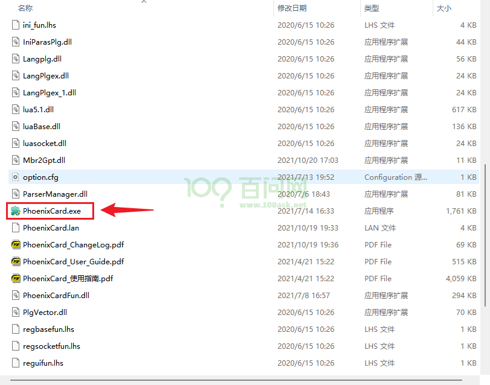


步骤一： 将TF卡插进读卡器内，同时将读卡器插到电脑USB接口，使用SD CatFormat格式化TF卡，注意备份卡内数据。参考下图所示，点击刷新找到TF卡，然后点击 Format 在弹出的 对话框 点击 **是(Yes)**等待格式完成即可。


步骤二：格式化完成后，使用**PhoenixCard.exe**工具来烧录镜像，参考下图步骤，找到自己的TF卡盘符，点击 `左上角红框1` 固件，选择已经解压过的 `T113i-DevKit-DefaultSystem.img` 镜像，然后点击 `红框2 启动卡`，最后点击`红框3 烧录` 等待烧录完成即可。(下面图片仅供参考)

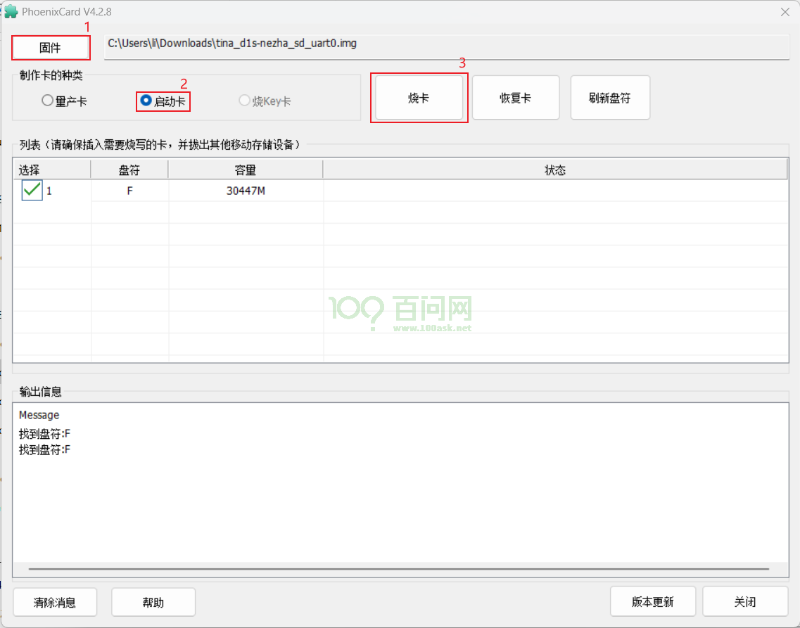

如下图为烧录成功示意图。

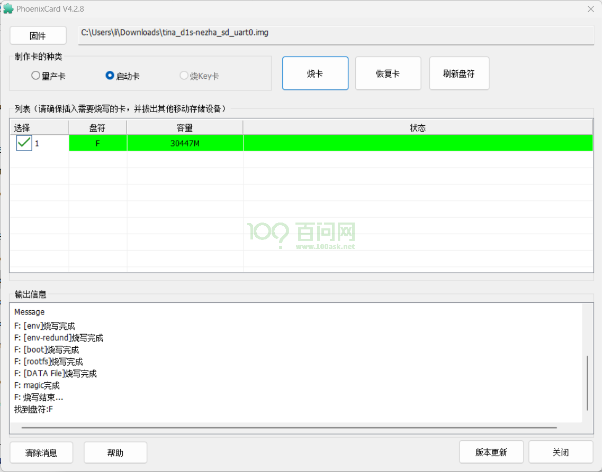


烧录完成以后，就可以弹出TF卡，并将其插到开发板正面 `TF卡卡槽`位置处，使用串口进行登录，也可以使用 adb shell 直接连接 ADB进行登录访问。

**注意：T113-i插上TF卡默认TF卡优先启动**

### 启动系统

如下启动信息。
``` shell
[198]HELLO! BOOT0 is starting!
[201]BOOT0 commit : 069ed30b88
[204]set pll start
[206]fix vccio detect value:0xc0
[214]periph0 has been enabled
[217]set pll end
[218][pmu]: bus read error
[221]board init ok
[223]enable_jtag
[224]get_pmu_exist() = -1
[227]ddr_efuse_type: 0x0
[229]trefi:7.8ms
[232][AUTO DEBUG] single rank and full DQ!
[236]ddr_efuse_type: 0x0
[238]trefi:7.8ms
[241][AUTO DEBUG] rank 0 row = 15
[244][AUTO DEBUG] rank 0 bank = 8
[247][AUTO DEBUG] rank 0 page size = 2 KB
[251]DRAM BOOT DRIVE INFO: V0.34
[255]DRAM CLK = 792 MHz
[257]DRAM Type = 3 (2:DDR2,3:DDR3)
[260]DRAMC ZQ value: 0x7b7bfb
[263]DRAM ODT value: 0x42.
[266]ddr_efuse_type: 0x0
[269]DRAM SIZE = 512 MB
[276]DRAM simple test OK.
[278]rtc standby flag is 0x0, super standby flag is 0x0
[283]dram size =512
[286]card no is 0
[288]sdcard 0 line count 4
[290][mmc]: mmc driver ver 2021-05-21 14:47
[299][mmc]: Wrong media type 0x0
[302][mmc]: ***Try SD card 0***
[323][mmc]: HSSDR52/SDR25 4 bit
[326][mmc]: 50000000 Hz
[328][mmc]: 30436 MB
[330][mmc]: ***SD/MMC 0 init OK!!!***
[426]Loading boot-pkg Succeed(index=0).
[430]Entry_name        = u-boot
[437]Entry_name        = optee
[441]Entry_name        = dtb
[444]mmc not para
[445]Jump to second Boot.
M/TC: OP-TEE version: 2a99a16f (gcc version 5.3.1 20160412 (Linaro GCC 5.3-2016.05)) #1 Thu Aug 17 11:13:02 UTC 2023 arm
E/TC:0 0 platform_standby_fdt_parse:126 no pmu0 node
E/TC:0 0 sunxi_twi_parse_from_dt:121 no pmu node


U-Boot 2018.07-g6047f84-dirty (Jul 20 2024 - 14:56:41 +0800) Allwinner Technology

[00.516]CPU:   Allwinner Family
[00.519]Model: sun8iw20
[00.521]DRAM:  512 MiB
[00.525]Relocation Offset is: 1cebd000
[00.553]secure enable bit: 0
E/TC:0   fdt_getprop_u32:336 prop trace_level not found
[00.566]CPU=1008 MHz,PLL6=600 Mhz,AHB=200 Mhz, APB1=100Mhz  MBus=300Mhz
[00.572]gic: sec monitor mode
SPI ALL:   ready
[00.578]line:703 init_clocks
[00.581]flash init start
[00.583]workmode = 0,storage type = 1
[00.586][mmc]: mmc driver ver uboot2018:2023-07-4 16:18:00
[00.592][mmc]: get sdc_type fail and use default host:tm1.
[00.598][mmc]: can't find node "mmc0",will add new node
[00.602][mmc]: fdt err returned <no error>
[00.606][mmc]: Using default timing para
[00.610][mmc]: SUNXI SDMMC Controller Version:0x50310
[00.638][mmc]: card_caps:0x3000000a
[00.641][mmc]: host_caps:0x3000003f
[00.646]sunxi flash init ok
get value error
[00.650]drv_disp_init
partno erro : can't find partition bootloader
** Unable to read file lcd_compatible_index.txt **
[00.676]disp_fat_load for lcd config failed
[00.704]drv_disp_init finish
[00.713]Loading Environment from SUNXI_FLASH... OK
[00.732]boot_gui_init:start
partno erro : can't find partition Reserve0
[00.739]lcd_open_flow
[00.742]lcd_cfg_panel_info
[00.745]lcd_power_on
bad fb1_cfg[w=0,h=0,bpp=32,format=0]
[00.775]boot_gui_init:finish
partno erro : can't find partition bootloader
[00.784]bmp_name=bootlogo.bmp size 1152054
[00.845]Item0 (Map) magic is bad
[00.848]the secure storage item0 copy0 magic is bad
[00.853]Item0 (Map) magic is bad
[00.855]the secure storage item0 copy1 magic is bad
[00.860]Item0 (Map) magic is bad
secure storage read widevine fail
secure storage read ec_key fail
secure storage read ec_cert1 fail
secure storage read ec_cert2 fail
secure storage read ec_cert3 fail
secure storage read rsa_key fail
secure storage read rsa_cert1 fail
secure storage read rsa_cert2 fail
secure storage read rsa_cert3 fail
[00.890]u[00.891] tft08006 drivers/video/sunxi/disp2/disp/lcd/tft08006.c lcd_panel_init 162
[00.898]lcd_panel_init
sb burn from boot
delay time 0
weak:otg_phy_config
[01.384]usb prepare ok
[01.435]lcd_bl_open
[01.438]LCD open finish
[01.688]overtime
[01.691]do_burn_from_boot usb : no usb exist
List file under ULI/factory
** Unrecognized filesystem type **
[01.702]update part info
[01.705]update bootcmd
[01.711]change working_fdt 0x5c87ce68 to 0x5c85ce68
get value error
[01.717][mmc]: get sunxi-mmc0 string failed
[01.722]The storage not support sample function
partno erro : can't find partition bootloader
** Unable to read file lcd_compatible_index.txt **
[01.755]disp_fat_load for lcd config failed
partno erro : can't find partition bootloader
writing lcd_compatible_index.txt
16 bytes written
save lcd compatible disp0 index 0 to flash
partno erro : can't find partition bootloader
[01.793]update dts
Hit any key to stop autoboot:  0
[02.205]no vendor_boot partition is found
Android's image name: sun8i_arm
The loading address of the kernel is not in the boot image
ERROR: reserving fdt memory region failed (addr=41b00000 size=100000)
ERROR: reserving fdt memory region failed (addr=5c907000 size=177000)
[02.254]Starting kernel ...

[02.256][mmc]: MMC Device 2 not found
[02.260][mmc]: mmc 2 not find, so not exit
[    0.000000] Booting Linux on physical CPU 0x0
[    0.000000] Linux version 5.4.61 (ubuntu@dshanpi) (arm-linux-gnueabi-gcc (Linaro GCC 5.3-2016.05) 5.3.1 20160412, GNU ld (Linaro_Binutils-2016.05) 2.25.0 Linaro 2016_02) #14 SMP PREEMPT Mon Jul 22 11:47:15 CST 2024
[    0.000000] CPU: ARMv7 Processor [410fc075] revision 5 (ARMv7), cr=10c5387d
[    0.000000] CPU: div instructions available: patching division code
[    0.000000] CPU: PIPT / VIPT nonaliasing data cache, VIPT aliasing instruction cache
[    0.000000] OF: fdt: Machine model: sun8iw20
[    0.000000] Memory policy: Data cache writealloc
[    0.000000] Reserved memory: created DMA memory pool at 0x42200000, size 0 MiB
[    0.000000] OF: reserved mem: initialized node vdev0buffer@42200000, compatible id shared-dma-pool
[    0.000000] Reserved memory: created DMA memory pool at 0x42244000, size 0 MiB
[    0.000000] OF: reserved mem: initialized node dsp0_rpbuf@42244000, compatible id shared-dma-pool
[    0.000000] Reserved memory: created DMA memory pool at 0x42900000, size 0 MiB
[    0.000000] OF: reserved mem: initialized node vdev0buffer@42900000, compatible id shared-dma-pool
[    0.000000] cma: Reserved 16 MiB at 0x5f000000
[    0.000000] On node 0 totalpages: 129120
[    0.000000]   Normal zone: 1024 pages used for memmap
[    0.000000]   Normal zone: 0 pages reserved
[    0.000000]   Normal zone: 129120 pages, LIFO batch:31
[    0.000000] psci: probing for conduit method from DT.
[    0.000000] psci: PSCIv1.0 detected in firmware.
[    0.000000] psci: Using standard PSCI v0.2 function IDs
[    0.000000] psci: MIGRATE_INFO_TYPE not supported.
[    0.000000] psci: SMC Calling Convention v1.0
[    0.000000] percpu: Embedded 15 pages/cpu s30976 r8192 d22272 u61440
[    0.000000] pcpu-alloc: s30976 r8192 d22272 u61440 alloc=15*4096
[    0.000000] pcpu-alloc: [0] 0 [0] 1
[    0.000000] Built 1 zonelists, mobility grouping on.  Total pages: 128096
[    0.000000] Kernel command line: earlycon=uart8250,mmio32,0x02500000 clk_ignore_unused initcall_debug=0 console=ttyS0,115200 loglevel=8 root=/dev/mmcblk0p5 rootwait init=/init partitions=boot-resource@mmcblk0p1:env@mmcblk0p2:env-redund@mmcblk0p3:boot@mmcblk0p4:rootfs@mmcblk0p5:riscv@mmcblk0p6:private@mmcblk0p7:UDISK@mmcblk0p8 cma=16M snum= mac_addr= wifi_mac= bt_mac= specialstr= gpt=1 androidboot.mode=normal androidboot.hardware=sun8iw20p1 boot_type=1 androidboot.boot_type=1 gpt=1 uboot_message=2018.07-g6047f84-dirty(07/20/2024-14:56:41) mbr_offset=1032192 disp_reserve=1536000,0x5c907000 androidboot.dramfreq=792 androidboot.dramsize=512 mtdparts=<NULL> uboot_backup=ubootA
[    0.000000] Dentry cache hash table entries: 65536 (order: 6, 262144 bytes, linear)
[    0.000000] Inode-cache hash table entries: 32768 (order: 5, 131072 bytes, linear)
[    0.000000] mem auto-init: stack:off, heap alloc:off, heap free:off
[    0.000000] Memory: 470324K/516480K available (7168K kernel code, 426K rwdata, 2608K rodata, 1024K init, 270K bss, 29772K reserved, 16384K cma-reserved, 0K highmem)
[    0.000000] SLUB: HWalign=64, Order=0-3, MinObjects=0, CPUs=2, Nodes=1
[    0.000000] rcu: Preemptible hierarchical RCU implementation.
[    0.000000]  Tasks RCU enabled.
[    0.000000] rcu: RCU calculated value of scheduler-enlistment delay is 10 jiffies.
[    0.000000] NR_IRQS: 16, nr_irqs: 16, preallocated irqs: 16
[    0.000000] random: get_random_bytes called from start_kernel+0x250/0x3d0 with crng_init=0
[    0.000000] arch_timer: cp15 timer(s) running at 24.00MHz (phys).
[    0.000000] clocksource: arch_sys_counter: mask: 0xffffffffffffff max_cycles: 0x588fe9dc0, max_idle_ns: 440795202592 ns
[    0.000006] sched_clock: 56 bits at 24MHz, resolution 41ns, wraps every 4398046511097ns
[    0.000017] Switching to timer-based delay loop, resolution 41ns
[    0.000203] clocksource: timer: mask: 0xffffffff max_cycles: 0xffffffff, max_idle_ns: 79635851949 ns
[    0.000882] Console: colour dummy device 80x30
[    0.000922] Calibrating delay loop (skipped), value calculated using timer frequency.. 48.00 BogoMIPS (lpj=240000)
[    0.000936] pid_max: default: 32768 minimum: 301
[    0.001092] Mount-cache hash table entries: 1024 (order: 0, 4096 bytes, linear)
[    0.001106] Mountpoint-cache hash table entries: 1024 (order: 0, 4096 bytes, linear)
[    0.001764] CPU: Testing write buffer coherency: ok
[    0.002118] /cpus/cpu@0 missing clock-frequency property
[    0.002141] /cpus/cpu@1 missing clock-frequency property
[    0.002153] CPU0: thread -1, cpu 0, socket 0, mpidr 80000000
[    0.002767] Setting up static identity map for 0x40100000 - 0x40100060
[    0.002896] rcu: Hierarchical SRCU implementation.
[    0.003222] BOOTEVENT:         3.213874: ON
[    0.003429] smp: Bringing up secondary CPUs ...
[    0.004678] CPU1: thread -1, cpu 1, socket 0, mpidr 80000001
[    0.004835] smp: Brought up 1 node, 2 CPUs
[    0.004849] SMP: Total of 2 processors activated (96.00 BogoMIPS).
[    0.004856] CPU: All CPU(s) started in SVC mode.
[    0.005387] devtmpfs: initialized
[    0.019415] VFP support v0.3: implementor 41 architecture 2 part 30 variant 7 rev 5
[    0.020042] clocksource: jiffies: mask: 0xffffffff max_cycles: 0xffffffff, max_idle_ns: 19112604462750000 ns
[    0.020070] futex hash table entries: 512 (order: 3, 32768 bytes, linear)
[    0.020959] pinctrl core: initialized pinctrl subsystem
[    0.022458] NET: Registered protocol family 16
[    0.024567] DMA: preallocated 256 KiB pool for atomic coherent allocations
[    0.064795] rtc_ccu: sunxi ccu init OK
[    0.067424] ccu: sunxi ccu init OK
[    0.067972] r_ccu: sunxi ccu init OK
[    0.109210] sun6i-dma 3002000.dma-controller: sunxi dma probed
[    0.112035] iommu: Default domain type: Translated
[    0.112259] sunxi iommu: irq = 24
[    0.113462] SCSI subsystem initialized
[    0.113853] usbcore: registered new interface driver usbfs
[    0.113936] usbcore: registered new interface driver hub
[    0.114264] usbcore: registered new device driver usb
[    0.114489] mc: Linux media interface: v0.10
[    0.114549] videodev: Linux video capture interface: v2.00
[    0.116982] Advanced Linux Sound Architecture Driver Initialized.
[    0.117727] Bluetooth: Core ver 2.22
[    0.117811] NET: Registered protocol family 31
[    0.117820] Bluetooth: HCI device and connection manager initialized
[    0.117840] Bluetooth: HCI socket layer initialized
[    0.117853] Bluetooth: L2CAP socket layer initialized
[    0.117883] Bluetooth: SCO socket layer initialized
[    0.118140] pwm module init!
[    0.123223] g2d 5410000.g2d: Adding to iommu group 0
[    0.123705] G2D: rcq version initialized.major:250
[    0.124463] input: sunxi-keyboard as /devices/virtual/input/input0
[    0.126214] clocksource: Switched to clocksource arch_sys_counter
[    0.136043] sun8iw20-pinctrl pio: initialized sunXi PIO driver
[    0.150772] thermal_sys: Registered thermal governor 'step_wise'
[    0.150778] thermal_sys: Registered thermal governor 'user_space'
[    0.150795] thermal_sys: Registered thermal governor 'power_allocator'
[    0.151382] NET: Registered protocol family 2
[    0.152125] tcp_listen_portaddr_hash hash table entries: 512 (order: 0, 6144 bytes, linear)
[    0.152158] TCP established hash table entries: 4096 (order: 2, 16384 bytes, linear)
[    0.152216] TCP bind hash table entries: 4096 (order: 3, 32768 bytes, linear)
[    0.152278] TCP: Hash tables configured (established 4096 bind 4096)
[    0.152384] UDP hash table entries: 256 (order: 1, 8192 bytes, linear)
[    0.152420] UDP-Lite hash table entries: 256 (order: 1, 8192 bytes, linear)
[    0.152594] NET: Registered protocol family 1
[    0.155354] Initialise system trusted keyrings
[    0.155600] workingset: timestamp_bits=30 max_order=17 bucket_order=0
[    0.167460] squashfs: version 4.0 (2009/01/31) Phillip Lougher
[    0.167766] ntfs: driver 2.1.32 [Flags: R/W].
[    0.168129] fuse: init (API version 7.31)
[    0.199405] NET: Registered protocol family 38
[    0.199446] Key type asymmetric registered
[    0.199456] Asymmetric key parser 'x509' registered
[    0.199553] Block layer SCSI generic (bsg) driver version 0.4 loaded (major 248)
[    0.199567] io scheduler mq-deadline registered
[    0.199575] io scheduler kyber registered
[    0.199715] atomic64_test: passed
[    0.201334] [DISP]disp_module_init
[    0.201962] disp 5000000.disp: Adding to iommu group 0
[    0.202580] [DISP] disp_init,line:2372:
[    0.202585] smooth display screen:0 type:1 mode:4
[    0.219701] lcd_cfg_panel_info
[    0.219714] tft08006
[    0.219754] display_fb_request,fb_id:0
[    0.225832] disp_al_manager_apply ouput_type:1
[    0.226012] [DISP] lcd_clk_config,line:777:
[    0.226023] disp 0, clk: pll(300000000),clk(300000000),dclk(25000000) dsi_rate(25000000)
[    0.226023]      clk real:pll(300000000),clk(300000000),dclk(75000000) dsi_rate(150000000)
[    0.226503] sun8iw20-pinctrl pio: pio supply vcc-pb not found, using dummy regulator
[    0.226991] [DISP]disp_module_init finish
[    0.228424] sunxi_sid_init()783 - insmod ok
[    0.229162] pwm-regulator: supplied by regulator-dummy
[    0.230898] uart uart0: uart0 supply uart not found, using dummy regulator
[    0.231263] uart0: ttyS0 at MMIO 0x2500000 (irq = 34, base_baud = 1500000) is a SUNXI
[    0.231293] sw_console_setup()1831 - console setup baud 115200 parity n bits 8, flow n
[    0.927605] Freeing logo buffer memory: 1500K
[    0.931580] printk: console [ttyS0] enabled
[    1.165082] sun8iw20-pinctrl pio: pio supply vcc-pg not found, using dummy regulator
[    1.174204] uart uart1: uart1 supply uart not found, using dummy regulator
[    1.182241] uart1: ttyS1 at MMIO 0x2500400 (irq = 35, base_baud = 1500000) is a SUNXI
[    1.191849] uart uart2: uart2 supply uart not found, using dummy regulator
[    1.199913] uart2: ttyS2 at MMIO 0x2500800 (irq = 36, base_baud = 1500000) is a SUNXI
[    1.209519] uart uart3: uart3 supply uart not found, using dummy regulator
[    1.217629] uart3: ttyS3 at MMIO 0x2500c00 (irq = 37, base_baud = 1500000) is a SUNXI
[    1.227557] misc dump reg init
[    1.231499] deinterlace 5400000.deinterlace: Adding to iommu group 0
[    1.239197] deinterlace 5400000.deinterlace: version[1.0.0], ip=0x110
[    1.248108] sunxi-rfkill soc@3000000:rfkill@0: module version: v1.0.9
[    1.255349] sunxi-rfkill soc@3000000:rfkill@0: get gpio chip_en failed
[    1.262682] sunxi-rfkill soc@3000000:rfkill@0: get gpio power_en failed
[    1.270103] sunxi-rfkill soc@3000000:rfkill@0: wlan_busnum (1)
[    1.276625] sunxi-rfkill soc@3000000:rfkill@0: Missing wlan_power.
[    1.283535] sunxi-rfkill soc@3000000:rfkill@0: wlan clock[0] (32k-fanout1)
[    1.291249] sunxi-rfkill soc@3000000:rfkill@0: wlan_regon gpio=44 assert=1
[    1.298979] sunxi-rfkill soc@3000000:rfkill@0: wlan_hostwake gpio=202 assert=1
[    1.307077] sunxi-rfkill soc@3000000:rfkill@0: wakeup source is enabled
[    1.314730] sunxi-rfkill soc@3000000:rfkill@0: Missing bt_power.
[    1.321495] sunxi-rfkill soc@3000000:rfkill@0: bt clock[0] (32k-fanout1)
[    1.329013] sunxi-rfkill soc@3000000:rfkill@0: bt_rst gpio=210 assert=0
[    1.337449] [ADDR_MGT] addr_mgt_probe: module version: v1.0.11
[    1.344654] [ADDR_MGT] addr_init: Failed to get type_def_bt, use default: 0
[    1.352472] [ADDR_MGT] addr_mgt_probe: success.
[    1.359541] libphy: Fixed MDIO Bus: probed
[    1.364117] CAN device driver interface
[    1.369576] sunxi-awlink awlink@0x0: awlink driver probe ok ...
[    1.377262] sunxi-awlink awlink@0x1: awlink driver probe ok ...
[    1.384841] sun8iw20-pinctrl pio: pio supply vcc-pe not found, using dummy regulator
[    1.394018] gmac-power0: NULL
[    1.397369] gmac-power1: NULL
[    1.400675] gmac-power2: NULL
[    1.405188] Failed to alloc md5
[    1.408767] eth0: Use random mac address
[    1.413605] usbcore: registered new interface driver asix
[    1.419753] usbcore: registered new interface driver ax88179_178a
[    1.426665] usbcore: registered new interface driver cdc_ether
[    1.433246] usbcore: registered new interface driver net1080
[    1.439685] usbcore: registered new interface driver cdc_subset
[    1.446372] usbcore: registered new interface driver zaurus
[    1.452673] usbcore: registered new interface driver cdc_ncm
[    1.459022] ehci_hcd: USB 2.0 'Enhanced' Host Controller (EHCI) Driver
[    1.466316] sunxi-ehci: EHCI SUNXI driver
[    1.471276] get drvvbus-en is fail, 22
[    1.475482] get ehci0-controller wakeup-source is fail.
[    1.481447] sunxi ehci0-controller don't init wakeup source
[    1.487684] [sunxi-ehci0]: probe, pdev->name: 4101000.ehci0-controller, sunxi_ehci: 0xc0c911a8, 0x:e083d000, irq_no:39
[    1.499644] [sunxi-ehci0]: Not init ehci0
[    1.504442] get drvvbus-en is fail, 22
[    1.508667] get ehci1-controller wakeup-source is fail.
[    1.514596] sunxi ehci1-controller don't init wakeup source
[    1.520833] [sunxi-ehci1]: probe, pdev->name: 4200000.ehci1-controller, sunxi_ehci: 0xc0c91708, 0x:e0883000, irq_no:3b
[    1.533068] sunxi-ehci 4200000.ehci1-controller: 4200000.ehci1-controller supply hci not found, using dummy regulator
[    1.545407] sunxi-ehci 4200000.ehci1-controller: EHCI Host Controller
[    1.552682] sunxi-ehci 4200000.ehci1-controller: new USB bus registered, assigned bus number 1
[    1.562829] sunxi-ehci 4200000.ehci1-controller: irq 59, io mem 0x04200000
[    1.596245] sunxi-ehci 4200000.ehci1-controller: USB 2.0 started, EHCI 1.00
[    1.604018] sunxi-ehci 4200000.ehci1-controller: ehci_irq: highspeed device connect
[    1.613608] hub 1-0:1.0: USB hub found
[    1.617868] hub 1-0:1.0: 1 port detected
[    1.623079] ohci_hcd: USB 1.1 'Open' Host Controller (OHCI) Driver
[    1.630064] sunxi-ohci: OHCI SUNXI driver
[    1.635039] get drvvbus-en is fail, 22
[    1.639251] get ohci0-controller wakeup-source is fail.
[    1.645224] sunxi ohci0-controller don't init wakeup source
[    1.651460] [sunxi-ohci0]: probe, pdev->name: 4101400.ohci0-controller, sunxi_ohci: 0xc0c91458
[    1.661074] [sunxi-ohci0]: Not init ohci0
[    1.665865] get drvvbus-en is fail, 22
[    1.670071] get ohci1-controller wakeup-source is fail.
[    1.676009] sunxi ohci1-controller don't init wakeup source
[    1.682265] [sunxi-ohci1]: probe, pdev->name: 4200400.ohci1-controller, sunxi_ohci: 0xc0c919b8
[    1.692144] sunxi-ohci 4200400.ohci1-controller: 4200400.ohci1-controller supply hci not found, using dummy regulator
[    1.704515] sunxi-ohci 4200400.ohci1-controller: OHCI Host Controller
[    1.711757] sunxi-ohci 4200400.ohci1-controller: new USB bus registered, assigned bus number 2
[    1.721673] sunxi-ohci 4200400.ohci1-controller: irq 60, io mem 0x04200400
[    1.801252] hub 2-0:1.0: USB hub found
[    1.805486] hub 2-0:1.0: 1 port detected
[    1.810986] usbcore: registered new interface driver uas
[    1.817104] usbcore: registered new interface driver usb-storage
[    1.823869] usbcore: registered new interface driver ums-alauda
[    1.830560] usbcore: registered new interface driver ums-cypress
[    1.837545] usbcore: registered new interface driver ums-datafab
[    1.844310] usbcore: registered new interface driver ums_eneub6250
[    1.851327] usbcore: registered new interface driver ums-freecom
[    1.858124] usbcore: registered new interface driver ums-isd200
[    1.864785] usbcore: registered new interface driver ums-jumpshot
[    1.871682] usbcore: registered new interface driver ums-karma
[    1.878269] usbcore: registered new interface driver ums-onetouch
[    1.885168] usbcore: registered new interface driver ums-realtek
[    1.891953] usbcore: registered new interface driver ums-sddr09
[    1.898659] usbcore: registered new interface driver ums-sddr55
[    1.905349] usbcore: registered new interface driver ums-usbat
[    1.913084] input: sunxi-ts as /devices/platform/soc@3000000/2009c00.rtp/input/input1
[    1.922953] sunxi_gpadc_init,2228, success
[    1.928184] sunxi_gpadc_setup: get channel scan data failed
[    1.934675] input: sunxi-gpadc0 as /devices/virtual/input/input2
[    1.942514] sunxi-rtc 7090000.rtc: errata__fix_alarm_day_reg_default_value(): ALARM0_DAY_REG=0, set it to 1
[    1.954911] sunxi-rtc 7090000.rtc: registered as rtc0
[    1.960724] sunxi-rtc 7090000.rtc: setting system clock to 1970-01-01T00:00:04 UTC (4)
[    1.969629] sunxi-rtc 7090000.rtc: Fail to read dts property 'gpr_bootcount_pos'
[    1.977916] reasonbase NULL
[    1.981027] reason large than max, fix to hot reboot, save boot reason
[    1.988355] usb 1-1: new high-speed USB device number 2 using sunxi-ehci
[    1.995889] invalid reason or reasonbase NULL
[    2.000873] sunxi-rtc 7090000.rtc: sunxi rtc probed
[    2.006907] i2c /dev entries driver
[    2.011138] IR NEC protocol handler initialized
[    2.016191] IR RC5(x/sz) protocol handler initialized
[    2.024462] usbcore: registered new interface driver uvcvideo
[    2.030913] USB Video Class driver (1.1.1)
[    2.035480] gspca_main: v2.14.0 registered
[    2.040083] sunxi cedar version 1.1
[    2.044199] sunxi-cedar 1c0e000.ve: Adding to iommu group 0
[    2.050514] VE: sunxi_cedar_probe power-domain init!!!
[    2.056282] VE: install start!!!
[    2.056282]
[    2.061856] VE: cedar-ve the get irq is 44
[    2.061856]
[    2.068323] VE: ve_debug_proc_info:(ptrval), data:(ptrval), lock:(ptrval)
[    2.068323]
[    2.077701] VE: install end!!!
[    2.077701]
[    2.082752] VE: sunxi_cedar_probe
[    2.087951] sunxi-wdt 20500a0.watchdog: Watchdog enabled (timeout=16 sec, nowayout=0)
[    2.097186] Bluetooth: HCI UART driver ver 2.3
[    2.102145] Bluetooth: HCI UART protocol H4 registered
[    2.108184] Bluetooth: XRadio Bluetooth LPM Mode Driver Ver 1.0.10
[    2.115390] [XR_BT_LPM] bluesleep_probe: bt_wake polarity: 1
[    2.121790] [XR_BT_LPM] bluesleep_probe: host_wake polarity: 1
[    2.128348] [XR_BT_LPM] bluesleep_probe: wakeup source is disabled!
[    2.128348]
[    2.136998] [XR_BT_LPM] bluesleep_probe: uart_index(1)
[    2.146025] sunxi-mmc 4020000.sdmmc: SD/MMC/SDIO Host Controller Driver(v4.25 2022-6-21 13:40)
[    2.156044] sunxi-mmc 4020000.sdmmc: ***ctl-spec-caps*** 8
[    2.162311] sunxi-mmc 4020000.sdmmc: No vmmc regulator found
[    2.168674] sunxi-mmc 4020000.sdmmc: No vqmmc regulator found
[    2.175103] sunxi-mmc 4020000.sdmmc: No vdmmc regulator found
[    2.181535] sunxi-mmc 4020000.sdmmc: No vd33sw regulator found
[    2.188055] sunxi-mmc 4020000.sdmmc: No vd18sw regulator found
[    2.194569] sunxi-mmc 4020000.sdmmc: No vq33sw regulator found
[    2.201141] sunxi-mmc 4020000.sdmmc: No vq18sw regulator found
[    2.209226] hub 1-1:1.0: USB hub found
[    2.213509] sunxi-mmc 4020000.sdmmc: Got CD GPIO
[    2.218746] hub 1-1:1.0: 4 ports detected
[    2.223915] sunxi-mmc 4020000.sdmmc: sdc set ios:clk 0Hz bm PP pm UP vdd 21 width 1 timing LEGACY(SDR12) dt B
[    2.235123] sunxi-mmc 4020000.sdmmc: no vqmmc,Check if there is regulator
[    2.255768] sunxi-mmc 4020000.sdmmc: sdc set ios:clk 400000Hz bm PP pm ON vdd 21 width 1 timing LEGACY(SDR12) dt B
[    2.278462] sunxi-mmc 4020000.sdmmc: detmode:gpio polling
[    2.284520] sunxi-mmc 4020000.sdmmc: sdc set ios:clk 400000Hz bm PP pm ON vdd 21 width 1 timing LEGACY(SDR12) dt B
[    2.286918] sunxi-mmc 4021000.sdmmc: SD/MMC/SDIO Host Controller Driver(v4.25 2022-6-21 13:40)
[    2.299331] sunxi-mmc 4020000.sdmmc: sdc set ios:clk 400000Hz bm PP pm ON vdd 21 width 1 timing LEGACY(SDR12) dt B
[    2.305960] sunxi-mmc 4021000.sdmmc: ***ctl-spec-caps*** 8
[    2.319605] sunxi-mmc 4020000.sdmmc: sdc set ios:clk 400000Hz bm PP pm ON vdd 21 width 1 timing LEGACY(SDR12) dt B
[    2.323401] sunxi-mmc 4021000.sdmmc: No vmmc regulator found
[    2.337876] sunxi-mmc 4020000.sdmmc: sdc set ios:clk 400000Hz bm PP pm ON vdd 21 width 1 timing LEGACY(SDR12) dt B
[    2.341206] sunxi-mmc 4021000.sdmmc: No vqmmc regulator found
[    2.359163] sunxi-mmc 4021000.sdmmc: No vdmmc regulator found
[    2.365570] sunxi-mmc 4021000.sdmmc: No vd33sw regulator found
[    2.372091] sunxi-mmc 4021000.sdmmc: No vd18sw regulator found
[    2.378607] sunxi-mmc 4021000.sdmmc: No vq33sw regulator found
[    2.385110] sunxi-mmc 4021000.sdmmc: No vq18sw regulator found
[    2.391649] sunxi-mmc 4021000.sdmmc: Cann't get pin bias hs pinstate,check if needed
[    2.400211] mmc0: host does not support reading read-only switch, assuming write-enable
[    2.409623] sunxi-mmc 4021000.sdmmc: sdc set ios:clk 0Hz bm PP pm UP vdd 21 width 1 timing LEGACY(SDR12) dt B
[    2.412068] sunxi-mmc 4020000.sdmmc: sdc set ios:clk 400000Hz bm PP pm ON vdd 21 width 1 timing SD-HS(SDR25) dt B
[    2.420759] sunxi-mmc 4021000.sdmmc: no vqmmc,Check if there is regulator
[    2.432333] sunxi-mmc 4020000.sdmmc: sdc set ios:clk 50000000Hz bm PP pm ON vdd 21 width 1 timing SD-HS(SDR25) dt B
[    2.451630] sunxi-mmc 4020000.sdmmc: sdc set ios:clk 50000000Hz bm PP pm ON vdd 21 width 4 timing SD-HS(SDR25) dt B
[    2.452316] sunxi-mmc 4021000.sdmmc: sdc set ios:clk 400000Hz bm PP pm ON vdd 21 width 1 timing LEGACY(SDR12) dt B
[    2.463357] mmc0: new high speed SDHC card at address aaaa
[    2.482080] mmcblk0: mmc0:aaaa SD32G 29.7 GiB
[    2.486302] sunxi-mmc 4021000.sdmmc: detmode:manually by software
[    2.490431]  mmcblk0: p1 p2 p3 p4 p5 p6 p7 p8
[    2.494892] usbcore: registered new interface driver usbhid
[    2.505018] usbhid: USB HID core driver
[    2.505797] sunxi-mmc 4021000.sdmmc: smc 1 p1 err, cmd 52, RTO !!
[    2.509330] exFAT: Version 1.3.0
[    2.520236] sunxi-msgbox 3003000.msgbox: sunxi_msgbox_probe(): sunxi msgbox start probe
[    2.520518] sunxi-mmc 4021000.sdmmc: smc 1 p1 err, cmd 52, RTO !!
[    2.529547] sunxi-msgbox 3003000.msgbox: sunxi_msgbox_probe(): sunxi msgbox probe success
[    2.545134] sunxi-mmc 4021000.sdmmc: sdc set ios:clk 400000Hz bm PP pm ON vdd 21 width 1 timing LEGACY(SDR12) dt B
[    2.547068] sunxi-rproc 3000008.dsp_rproc: sunxi rproc driver 2.2.1
[    2.563769] sunxi-rproc 3000008.dsp_rproc: failed to get firmware-name
[    2.571125] sunxi-mmc 4021000.sdmmc: sdc set ios:clk 400000Hz bm PP pm ON vdd 21 width 1 timing LEGACY(SDR12) dt B
[    2.576854] remoteproc remoteproc0: dsp_rproc is available
[    2.588815] sunxi-mmc 4021000.sdmmc: smc 1 p1 err, cmd 5, RTO !!
[    2.595569] sunxi-mmc 4021000.sdmmc: smc 1 p1 err, cmd 5, RTO !!
[    2.602296] sunxi-mmc 4021000.sdmmc: smc 1 p1 err, cmd 5, RTO !!
[    2.609031] sunxi-mmc 4021000.sdmmc: smc 1 p1 err, cmd 5, RTO !!
[    2.609059] sunxi-mmc 4021000.sdmmc: sdc set ios:clk 0Hz bm PP pm OFF vdd 0 width 1 timing LEGACY(SDR12) dt B
[    2.615808] sunxi-rproc 3000008.dsp_rproc: sunxi rproc driver probe ok
[    2.634297] sunxi-rproc 6010000.c906_rproc: sunxi rproc driver 2.2.1
[    2.641901] remoteproc remoteproc1: c906_rproc is available
[    2.648252] sunxi-rproc 6010000.c906_rproc: sunxi rproc driver probe ok
[    2.656757] sunxi-rpbuf-controller rpbuf_controller@0: assigned reserved memory node dsp0_rpbuf@42244000
[    2.672441] NET: Registered protocol family 10
[    2.678672] Segment Routing with IPv6
[    2.682851] sit: IPv6, IPv4 and MPLS over IPv4 tunneling driver
[    2.691195] NET: Registered protocol family 17
[    2.696182] NET: Registered protocol family 15
[    2.701178] can: controller area network core (rev 20170425 abi 9)
[    2.708221] NET: Registered protocol family 29
[    2.713182] can: raw protocol (rev 20170425)
[    2.717969] can: broadcast manager protocol (rev 20170425 t)
[    2.724299] can: netlink gateway (rev 20190810) max_hops=1
[    2.730876] Bluetooth: RFCOMM TTY layer initialized
[    2.736377] Bluetooth: RFCOMM socket layer initialized
[    2.742150] Bluetooth: RFCOMM ver 1.11
[    2.747264] Registering SWP/SWPB emulation handler
[    2.752988] Loading compiled-in X.509 certificates
[    2.777588] sun8iw20-pinctrl pio: pio supply vcc-pd not found, using dummy regulator
[    2.786675] sunxi-twi 2502800.twi: 2502800.twi supply twi not found, using dummy regulator
[    2.797495] input: fts_ts as /devices/platform/soc@3000000/2502800.twi/i2c-2/2-0038/input/input3
[    2.836397] fts_ts 2-0038: 2-0038 supply  not found, using dummy regulator
[    2.844321] fts_ts 2-0038: 2-0038 supply  not found, using dummy regulator
[    2.852062] debugfs: Directory '2-0038-' with parent 'reg-dummy-regulator-dummy' already present!
[    3.354467] random: fast init done
[    3.716619] sunxi:i2c_sunxi@2502800.twi[INFO]: v2.6.5 probe success
[    3.724778] sunxi-thermal 2009400.ths: sun8iw20 cp version:15
[    3.767971] get det_vbus is fail, -84
[    3.772048] get id is fail, -84
[    3.775562] otg manager soc@3000000:usbc0@0: soc@3000000:usbc0@0 supply usbc not found, using dummy regulator
[    3.789499] cfg80211: Loading compiled-in X.509 certificates for regulatory database
[    3.800586] cfg80211: Loaded X.509 cert 'sforshee: 00b28ddf47aef9cea7'
[    3.808071] platform regulatory.0: Direct firmware load for regulatory.db failed with error -2
[    3.816245] clk: Not disabling unused clocks
[    3.817757] cfg80211: failed to load regulatory.db
[    3.822431] ALSA device list:
[    3.831052]   No soundcards found.
[    3.834837] alloc_fd: slot 0 not NULL!
[    3.850650] EXT4-fs (mmcblk0p5): mounted filesystem with ordered data mode. Opts: (null)
[    3.859789] VFS: Mounted root (ext4 filesystem) readonly on device 179:5.
[    3.868426] devtmpfs: mounted
[    3.873394] Freeing unused kernel memory: 1024K
[    3.896389] Kernel init done
[    3.899596] Run /init as init process
can't run '/etc/preinit': No such file or directory
[    4.040002] EXT4-fs (mmcblk0p5): re-mounted. Opts: (null)
Starting syslogd: OK
Starting klogd: OK
Populating /dev using udev: [    4.350067] udevd[1179]: starting version 3.2.7
[    4.370122] random: udevd: uninitialized urandom read (16 bytes read)
[    4.379021] random: udevd: uninitialized urandom read (16 bytes read)
[    4.386336] random: udevd: uninitialized urandom read (16 bytes read)
[    4.401245] udevd[1179]: specified group 'input' unknown
[    4.408029] udevd[1179]: specified group 'kvm' unknown
[    4.440122] udevd[1181]: starting eudev-3.2.7
done
Initializing random number generator... done.
Starting system message bus: done
Starting network: OK
usb0 current mode: null
Starting switch usb0 to device mode.
[    6.566236]
[    6.566236] insmod_device_driver
[    6.566236]
[    6.573428] sunxi_usb_udc 4100000.udc-controller: 4100000.udc-controller supply udc not found, using dummy regulator
device_chose finished!
Starting adb: [    6.651817] file system registered
OK
init adb main
[    6.700692] read descriptors
Handling main()
[    6.704297] read strings
Initializing postgresql data base...
su: unknown user postgres
done
Starting postgresql: su: unknown user postgres
OK
/etc/init.d/S50powerkey_display: line 12: powerkey_display: command not found
/etc/init.d/S50powerkey_suspend: line 12: powerkey_suspend: command not found
[    6.848720] [EXFAT] trying to mount...
formating  /dev/by-name/UDISK to vfat...
mkfs.fat 4.1 (2017-01-24)
[   13.050669] random: crng init done
[   13.054467] random: 7 urandom warning(s) missed due to ratelimiting

Starting dnsmasq: OK
Trying to connect to SWUpdate...
swu_param: ####
swu_software: ####
swu_mode: ####
no swupdate_cmd to run, wait for next swupdate
#
```

**系统默认会自己登录 没有用户名 没有密码。**
**系统默认会自己登录 没有用户名 没有密码。**
**系统默认会自己登录 没有用户名 没有密码。**