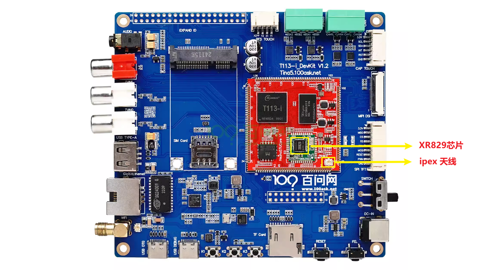
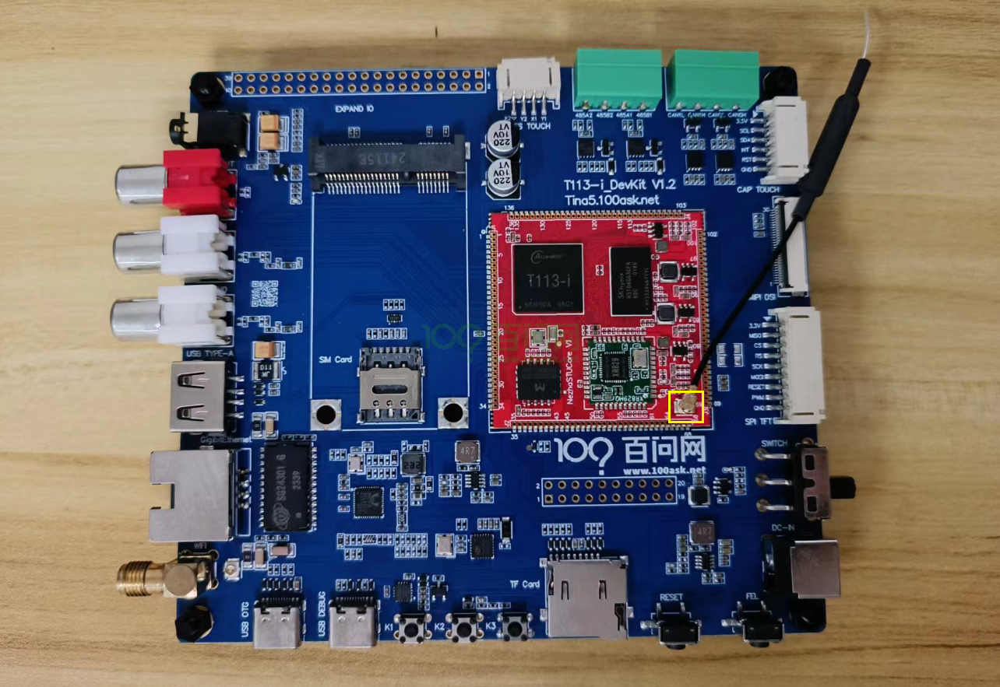
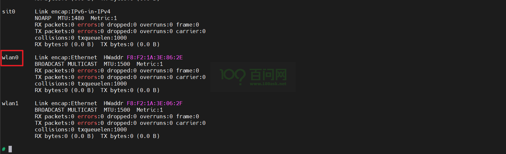
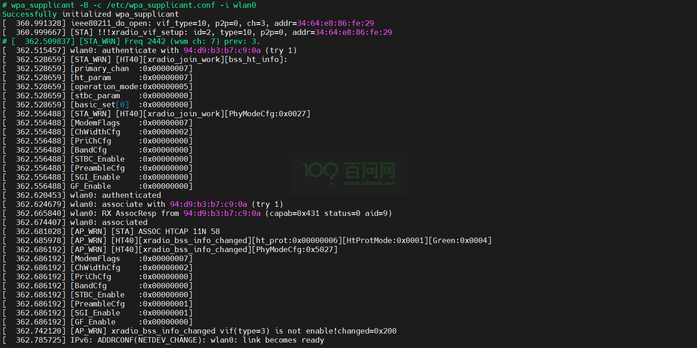
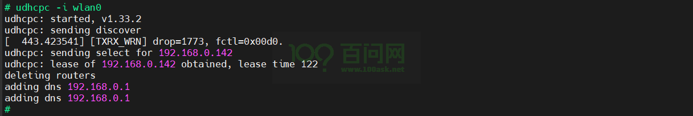
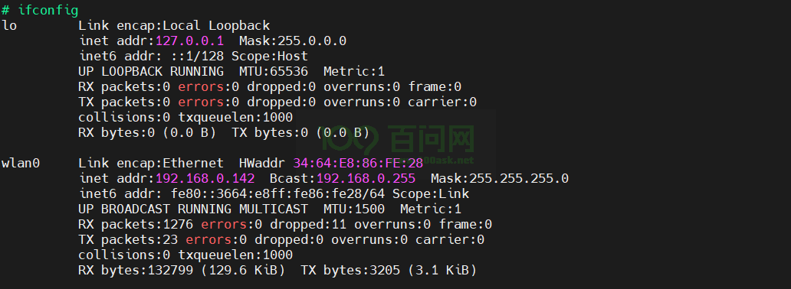

# WiFi联网

本章节来讲解如何连接wifi进行上网，T113i-Industrial开发板板载的是 [XradioTech](http://www.xradiotech.com/) 所设计的 XR829 Wi-Fi 模组。

## 前提条件

> 在进入本章节学习之前，请做好以下准备。

当前版本`xr829 Wi-Fi模组`和`天线接口`硬件位置图，如下：

**准备工作：**

**硬件：**
1. T113i-Industrial开发板
2. usb typeC线 X2 
3. ipex 2.4G天线 X1

**软件：**
1. 全志线刷工具：[AllwinnertechPhoeniSuit.zip](https://dl.100ask.net/Hardware/MPU/T113i-Industrial/Tools/AllwinnertechPhoeniSuit.zip)
2. 全志USB烧录驱动：[AllwinnerUSBFlashDeviceDriver.zip](https://dl.100ask.net/Hardware/MPU/T113i-Industrial/Tools/AllwinnerUSBFlashDeviceDriver.zip)

## 硬件介绍

### Wi-Fi功能特性

XR829 Wi-Fi模组是一款集成了**2.4G IEEE 802.11b/g/n标准**的无线连接解决方案，并且支持**蓝牙2.1/4.0/4.1协议标准**。它主要应用于短距离无线连接，如平板电脑、智能电视等设备。以下是XR829 Wi-Fi模组的一些功能特性：

1. **STA模式管理**：支持STA（Station）模式，允许设备连接到无线网络。
2. **AP模式管理**：支持AP（Access Point）模式，允许设备作为无线热点供其他设备连接。
3. **Monitor模式管理**：提供Monitor模式，用于监听无线网络的流量。
4. **配网管理**：支持多种配网方式，如softap、soundwave、xconfig等，方便用户连接到无线网络。
5. **P2P模式管理**：正在考虑支持P2P（Peer to Peer）模式，用于设备间的直接连接。
6. **软件结构**：wifimanger2.0支持AP模式和monitor模式，集成了多种配网模式，方便用户使用。
7. **硬件资源适配**：需要根据硬件原理图进行配置，包括时钟、电源、SDIO等资源的适配。
8. **内核驱动适配**：需要在内核中添加Kconfig和Makefile配置，并通过menuconfig启用XR829 WLAN支持。
9. **Firmware支持**：根据不同晶振（24M或40M）提供相应的固件支持。
10. **应用工具适配**：提供了wifimanager、smartlinkd、softap等应用工具的适配，以方便进行Wi-Fi功能测试和使用。

### Wi-Fi软件结构

- **wifimanger**：主要用于STATION模式，提供Wi-Fi连接扫描等功能。
- **softap manager**：提供启动AP的功能。
- **smartlink**：对于 `NoInput` 的设备，通过借助第三方设备（如手机）实现透传配网的功能,包括 `softap/soundwave/xconfig/airkiss/` 等多种配网方式。
- **wpa_supplicant**：开源的无线网络配置工具，主要用来支持WEP，WPA/WPA2和WAPI无线协议和加密认证的，实际上的工作内容是通过 `socket` 与驱动交互上报数据给用户。
- **hostapd**：是一个用户态用于AP和认证服务器的守护进程。
- **monitor**：Wi-Fi处于混杂设备监听模式的处理应用。

### Wi-Fi天线安装

要使用Wi-Fi，需要连接一根ipex 2.4G天线，下面是将天线连接到T113i-Industrial开发板的指南图。

参考上图，拿到一根天线，对准天线接口，稍微用点力摁下去，听到咔擦一声，即可安装完毕。

## 装载驱动模块

### 登录开发板终端

看到这里，如果不知道怎么连接硬件，怎么打开串口终端，请参考前面《快速启动》章节里的启动开发板文章。

地址链接：[启动开发板 | 东山Π (100ask.org)](https://dshanpi.100ask.org/docs/T113i-Industrial/part1/QuickStart)

### 加载Wi-Fi驱动模块

本章节提供的镜像已经移植好了 XR829 Wi-Fi 模组和 Wi-Fi 的使用工具。所以只需要在开发板上进行wifi连接即可。

进入开发板串口终端，执行`ifconfig -a`，查看节点信息，想使用wifi，就需要有 `wlan0`节点。

~~~bash
# ifconfig -a
awlink0   Link encap:UNSPEC  HWaddr 00-00-00-00-00-00-00-00-00-00-00-00-00-00-00-00
          NOARP  MTU:16  Metric:1
          RX packets:0 errors:0 dropped:0 overruns:0 frame:0
          TX packets:0 errors:0 dropped:0 overruns:0 carrier:0
          collisions:0 txqueuelen:10
          RX bytes:0 (0.0 B)  TX bytes:0 (0.0 B)
          Interrupt:255

awlink1   Link encap:UNSPEC  HWaddr 00-00-00-00-00-00-00-00-00-00-00-00-00-00-00-00
          NOARP  MTU:16  Metric:1
          RX packets:0 errors:0 dropped:0 overruns:0 frame:0
          TX packets:0 errors:0 dropped:0 overruns:0 carrier:0
          collisions:0 txqueuelen:10
          RX bytes:0 (0.0 B)  TX bytes:0 (0.0 B)

eth0      Link encap:Ethernet  HWaddr 9A:47:64:F5:A8:4E
          BROADCAST MULTICAST  MTU:1500  Metric:1
          RX packets:0 errors:0 dropped:0 overruns:0 frame:0
          TX packets:0 errors:0 dropped:0 overruns:0 carrier:0
          collisions:0 txqueuelen:1000
          RX bytes:0 (0.0 B)  TX bytes:0 (0.0 B)
          Interrupt:40

ip6tnl0   Link encap:UNSPEC  HWaddr 00-00-00-00-00-00-00-00-00-00-00-00-00-00-00-00
          NOARP  MTU:1452  Metric:1
          RX packets:0 errors:0 dropped:0 overruns:0 frame:0
          TX packets:0 errors:0 dropped:0 overruns:0 carrier:0
          collisions:0 txqueuelen:1000
          RX bytes:0 (0.0 B)  TX bytes:0 (0.0 B)

lo        Link encap:Local Loopback
          inet addr:127.0.0.1  Mask:255.0.0.0
          inet6 addr: ::1/128 Scope:Host
          UP LOOPBACK RUNNING  MTU:65536  Metric:1
          RX packets:0 errors:0 dropped:0 overruns:0 frame:0
          TX packets:0 errors:0 dropped:0 overruns:0 carrier:0
          collisions:0 txqueuelen:1000
          RX bytes:0 (0.0 B)  TX bytes:0 (0.0 B)

sit0      Link encap:IPv6-in-IPv4
          NOARP  MTU:1480  Metric:1
          RX packets:0 errors:0 dropped:0 overruns:0 frame:0
          TX packets:0 errors:0 dropped:0 overruns:0 carrier:0
          collisions:0 txqueuelen:1000
          RX bytes:0 (0.0 B)  TX bytes:0 (0.0 B)

#
~~~

上面并没有看到 `wlan0` 节点，因为驱动没有被加载，需要手动执行 `insmod /lib/modules/5.4.61/xr829.ko` 装载驱动。

~~~bash
# insmod /lib/modules/5.4.61/xr829.ko
[  173.496018] ======== XRADIO WIFI OPEN ========
[  173.501856] [XRADIO] Driver Label:XR_V02.16.88_P2P_HT40_01.31
[  173.508696] [XRADIO] Allocated hw_priv @ (ptrval)
[  173.514978] sunxi-rfkill soc@3000000:rfkill@0: bus_index: 1
[  173.531312] sunxi-rfkill soc@3000000:rfkill@0: wlan power on success
[  173.738498] sunxi-mmc 4021000.sdmmc: sdc set ios:clk 0Hz bm PP pm UP vdd 21 width 1 timing LEGACY(SDR12) dt B
[  173.746231] [XRADIO] Detect SDIO card 1
[  173.749727] sunxi-mmc 4021000.sdmmc: no vqmmc,Check if there is regulator
[  173.774101] sunxi-mmc 4021000.sdmmc: sdc set ios:clk 400000Hz bm PP pm ON vdd 21 width 1 timing LEGACY(SDR12) dt B
[  173.797213] sunxi-mmc 4021000.sdmmc: sdc set ios:clk 400000Hz bm PP pm ON vdd 21 width 1 timing LEGACY(SDR12) dt B
[  173.811824] sunxi-mmc 4021000.sdmmc: sdc set ios:clk 400000Hz bm PP pm ON vdd 21 width 1 timing LEGACY(SDR12) dt B
[  173.834060] sunxi-mmc 4021000.sdmmc: sdc set ios:clk 400000Hz bm PP pm ON vdd 21 width 1 timing SD-HS(SDR25) dt B
[  173.845657] sunxi-mmc 4021000.sdmmc: sdc set ios:clk 50000000Hz bm PP pm ON vdd 21 width 1 timing SD-HS(SDR25) dt B
[  173.857505] sunxi-mmc 4021000.sdmmc: sdc set ios:clk 50000000Hz bm PP pm ON vdd 21 width 4 timing SD-HS(SDR25) dt B
[  173.870081] mmc1: new high speed SDIO card at address 0001
[  173.877097] [SBUS] XRadio Device:sdio clk=50000000
[  173.890482] [XRADIO] XRADIO_HW_REV 1.0 detected.
[  173.947031] [XRADIO] xradio_update_dpllctrl: DPLL_CTRL Sync=0x01400000.
[  173.980161] [XRADIO] Bootloader complete
[  174.002859] random: crng init done
[  174.006676] random: 2 urandom warning(s) missed due to ratelimiting
[  174.094363] [XRADIO] Firmware completed.
[  174.100603] [WSM] Firmware Label:XR_C09.08.52.64_DBG_02.100 2GHZ HT40 Jan  3 2020 13:14:37
[  174.109975] [XRADIO] Firmware Startup Done.
[  174.114975] [XRADIO_WRN] enable Multi-Rx!
[  174.122681] ieee80211 phy0: Selected rate control algorithm 'minstrel_ht'
#
~~~

如上所示，驱动模块已经安装成功。

## 连接Wi-Fi网络

### 开启Wi-Fi功能

加载驱动没有出现问题之后，执行`ifconfig -a`，即可看到 `wlan0` 节点。

使用wifi功能还需要执行指令`ifconfig wlan0 up`，来打开 `wlan0` 节点。

~~~bash
# ifconfig wlan0 up
[  324.579646] ieee80211_do_open: vif_type=2, p2p=0, ch=3, addr=f8:f2:1a:3e:86:2e
[  324.587897] [STA] !!!xradio_vif_setup: id=0, type=2, p2p=0, addr=f8:f2:1a:3e:86:2e
[  324.603169] [AP_WRN] BSS_CHANGED_ASSOC but driver is unjoined.

          RX bytes:0 (0.0 B)  TX bytes:0 (0.0 B)
~~~

打开完成后，执行`ifconfig`，即可看到 `wlan0` 节点。

~~~bash
# ifconfig
lo        Link encap:Local Loopback
          inet addr:127.0.0.1  Mask:255.0.0.0
          inet6 addr: ::1/128 Scope:Host
          UP LOOPBACK RUNNING  MTU:65536  Metric:1
          RX packets:0 errors:0 dropped:0 overruns:0 frame:0
          TX packets:0 errors:0 dropped:0 overruns:0 carrier:0
          collisions:0 txqueuelen:1000
          RX bytes:0 (0.0 B)  TX bytes:0 (0.0 B)

wlan0     Link encap:Ethernet  HWaddr F8:F2:1A:3E:86:2E
          UP BROADCAST MULTICAST  MTU:1500  Metric:1
          RX packets:0 errors:0 dropped:0 overruns:0 frame:0
          TX packets:0 errors:0 dropped:0 overruns:0 carrier:0
          collisions:0 txqueuelen:1000
~~~

### 扫描附近Wi-Fi

打开 `wlan0` 节点后，就可以在开发板上使用已经适配上的 `iw` 工具来扫描附近的Wi-Fi。

执行指令如下：

~~~bash
iw dev wlan0 scan | grep SSID
~~~

扫描到附近的wifi节点，结果显示：

~~~bash
# iw dev wlan0 scan | grep SSID
        SSID: Programmers
                 * SSID List
        SSID: ChinaNet-kRAH
        SSID: \xe9\xa1\xba\xe6\x88\x90\xe5\x8a\xb3\xe5\x8a\xa1
        SSID: Voform
        SSID: Guest_An
        SSID: Redmi_83D1
        SSID: pobo
                 * SSID List
        SSID: ChinaNet-ec7h
        SSID: ChinaNet-ccXn
        SSID: MERCURY_62A2
        SSID:
        SSID: ChinaNet-sqJr
        SSID: VANTEN
                 * SSID List
        SSID: HUAWEI-1619
        SSID: HUAWEI-yuanyuan
        SSID:
        SSID:
        SSID: WiFi
~~~

能扫描到附近的Wi-Fi节点，即可证明 XR829 Wi-Fi 模组可以正常使用。接下来就可以开始连接Wi-Fi节点了。

### 连接Wi-Fi

连接Wi-Fi节点，需要使用 `wpa_supplican`，该工具也已适配上。

`wpa_supplicant` 连接Wi-Fi节点的时候会从配置文件中读取账号和密码，以及加密方式等， 所以我们在运行wpa_supplicant工具的时候要提前写好配置文件。 配置文件名称自定，但是要以 .conf 为后缀，并保存在 /etc/ 目录下，这边给出一个配置文件的例子。

---

执行以下指令，进入配置文件：

~~~bash
vim /etc/wpa_supplicant.conf
~~~

添加如下内容：

~~~bash
ctrl_interface=/var/run/wpa_supplicant
update_config=1

network={
        ssid="Programmers"
        psk="100askxxx"
}
~~~

- **ctrl_interface**：这是 `wpa_supplicant` 的配置选项，用于定义一个 Unix 域套接字的路径，通过这个套接字，其他程序可以与 `wpa_supplicant` 进行通信，发送命令和查询状态。`/var/run/wpa_supplicant` 是 `wpa_supplicant` 配置文件中的一个参数，用于指定控制接口的路径。
- **update_config** : 这个配置项指示 `wpa_supplicant` 在网络连接成功或失败时更新配置文件。当设置为 `1` 时，任何通过控制接口添加或修改的网络配置都会被永久保存到配置文件中，这样在下次启动 `wpa_supplicant` 时，这些更改仍然有效。
- **ssid** : 这里指定了要连接的无线网络的 SSID（服务集标识符），即网络名称。（需要根据实际情况填写）
- **psk** ：`psk`（预共享密钥）是用于 WPA/WPA2 加密的密码。（需要根据实际情况填写）

---

在开发板上，执行以下指令，创建一个socket通信的目录，命名需要和上面配置文件里`ctrl_interface`的路径一样。

~~~bash
mkdir -p /var/log/wpa_supplicant
~~~

---

完成以上操作，执行以下指令，连接Wi-Fi节点：

~~~bash
wpa_supplicant -B -c /etc/wpa_supplicant.conf -i wlan0
~~~

### 获取IP地址

有以上这一些log信息打印，表明连接成功，但是还需要使用`udhcpc`工具来分配ip地址，否则无法连接外网。

执行以下指令，分配ip地址：

~~~bash
udhcpc -i wlan0
~~~

ip地址分配成功，即可连接外网，测试如下：

~~~bash
# ping www.baidu.com
PING www.baidu.com (183.2.172.185): 56 data bytes
64 bytes from 183.2.172.185: seq=0 ttl=52 time=10.186 ms
64 bytes from 183.2.172.185: seq=1 ttl=52 time=11.189 ms
64 bytes from 183.2.172.185: seq=2 ttl=52 time=78.292 ms
64 bytes from 183.2.172.185: seq=3 ttl=52 time=105.430 ms
64 bytes from 183.2.172.185: seq=4 ttl=52 time=15.267 ms
^C
--- www.baidu.com ping statistics ---
5 packets transmitted, 5 packets received, 0% packet loss
round-trip min/avg/max = 10.186/44.072/105.430 ms
#
~~~

分配的ip地址，也成功显示，如下。

