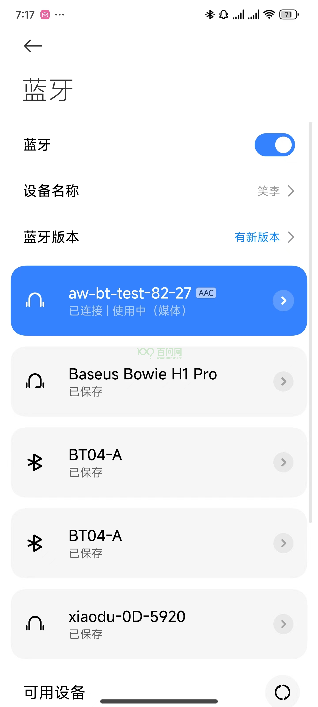

# 蓝牙配对

本章节来讲解如何配对蓝牙，T113i-Industrial开发板板载的是 [XradioTech](http://www.xradiotech.com/) 所设计的 XR829 蓝牙 模组。

## 前提条件

> 在进入本章节学习之前，请做好以下准备。

**准备工作：**

**硬件：**
1. T113i-Industrial开发板
2. usb typeC线 X2 

**软件：**
1. 全志线刷工具：[AllwinnertechPhoeniSuit.zip](https://dl.100ask.net/Hardware/MPU/T113i-Industrial/Tools/AllwinnertechPhoeniSuit.zip)
2. 全志USB烧录驱动：[AllwinnerUSBFlashDeviceDriver.zip](https://dl.100ask.net/Hardware/MPU/T113i-Industrial/Tools/AllwinnerUSBFlashDeviceDriver.zip)

## 硬件介绍

### 蓝牙功能特性

XR829 模组是一款集成了**2.4G IEEE 802.11b/g/n标准**的无线连接解决方案，并且支持**蓝牙2.1/4.0/4.1协议标准**。它主要应用于短距离无线连接，如平板电脑、智能电视等设备。以下是 XR829 模组蓝牙的一些功能特性：

1. 兼容IEEE 802.11b/g/n标准，最高速率可达150Mbps，同时支持蓝牙V2.1/4.0/4.1双模模式 。
2. 具有2.7-5.5V的宽电压输入范围，集成了高效的SMPS和LDO电源系统 。
3. 领先的功耗水平和高集成度，外围设备精简 。
4. 内置PTA电路，有效增强BT共存场景的性能 。
5. 支持多种时钟输入，包括XTAL时钟输入和32768低频时钟 。
6. 蓝牙功能支持包括Class1、2、3，高速UART接口，最大波特率达到4Mbps，自适应跳频技术，以及SCO和eSCO支持 。
7. 支持A-law，μ-law和CVSD语音的转码器，以及sniff / hold / sniff-sub-rating低功耗模式 。
8. 提供SDIO2.0接口，适用于多种应用场景，如平板电脑、便携式多媒体播放器、智能电视及电视盒等 。

## 登录开发板终端

看到这里，如果不知道怎么连接硬件，怎么打开串口终端，请参考前面《快速启动》章节里的启动开发板文章。

地址链接：[启动开发板 | 东山Π (100ask.org)](https://dshanpi.100ask.org/docs/T113i-Industrial/part1/QuickStart)

## 配对蓝牙

打开串口终端后，开机进入开发板，执行`bt_test -i`，发现蓝牙起不来，报错。

查看`/etc/bluetooth/bt_init.sh`

~~~bash
start_hci_attach()
{
        h=`ps | grep "$bt_hciattach" | grep -v grep`
        [ -n "$h" ] && {
                killall "$bt_hciattach"
        }

        # reset_bluetooth_power

        "$bt_hciattach" -n ttyAS1 xradio >/dev/null 2>&1 &

        wait_hci0_count=0
        while true
        do
                [ -d /sys/class/bluetooth/hci0 ] && break
                usleep 100000
                let wait_hci0_count++
                [ $wait_hci0_count -eq 70 ] && {
                        echo "bring up hci0 failed"
                        exit 1
                }
        done
}
~~~

发现脚本有错：`"$bt_hciattach" -n ttyAS1 xradio >/dev/null 2>&1 &`

串口1的设备节点是`/dev/ttyS1`：

~~~bash
# ls /dev/tty
tty    tty14  tty20  tty27  tty33  tty4   tty46  tty52  tty59  tty8
tty0   tty15  tty21  tty28  tty34  tty40  tty47  tty53  tty6   tty9
tty1   tty16  tty22  tty29  tty35  tty41  tty48  tty54  tty60  ttyS0
tty10  tty17  tty23  tty3   tty36  tty42  tty49  tty55  tty61  ttyS1
tty11  tty18  tty24  tty30  tty37  tty43  tty5   tty56  tty62  ttyS2
tty12  tty19  tty25  tty31  tty38  tty44  tty50  tty57  tty63  ttyS3
tty13  tty2   tty26  tty32  tty39  tty45  tty51  tty58  tty7
# ls /dev/tty
~~~

修改如下：

~~~bash
start_hci_attach()
{
        h=`ps | grep "$bt_hciattach" | grep -v grep`
        [ -n "$h" ] && {
                killall "$bt_hciattach"
        }

        # reset_bluetooth_power

        "$bt_hciattach" -n ttyS1 xradio >/dev/null 2>&1 &

        wait_hci0_count=0
        while true
        do
                [ -d /sys/class/bluetooth/hci0 ] && break
                usleep 100000
                let wait_hci0_count++
                [ $wait_hci0_count -eq 70 ] && {
                        echo "bring up hci0 failed"
                        exit 1
                }
        done
}
~~~

重启开发板。

再次执行`bt_test -i`

~~~bash
# bt_test -i
[ACT D][ring_buff_init,27]enter

[ACT D][ring_buff_start,173]ring buffer start enter

[ACT D][ring_buff_start,187]ring buffer start quit

[ACT D][ring_buff_init,27]enter

[ACT D][ring_buff_start,173]ring buffer start enter

[ACT D][ring_buff_start,187]ring buffer start quit

1970-01-01 09:55:24:756: BTMG[_bt_manager_set_default_profile:374]:  enable default profile from bt config
1970-01-01 09:55:24:756: BTMG[_bt_manager_enable:258]:  btmanager version: Version:4.0.4.20231208, builed time: Jul 16 2024-16:53:44
1970-01-01 09:55:24:756: BTMG[_bt_manager_enable:259]:  enable state: 1, now bt adapter state : 0
197[  286.262531] sunxi-rfkill soc@3000000:rfkill@0: block state already is 1
0-01-01 09:55:24:757: BTMG[bt_test_adapter_status_cb:74]:  bt is turnning on.
[  286.471759] sunxi-rfkill soc@3000000:rfkill@0: set block: 0
[  286.488049] sunxi-rfkill soc@3000000:rfkill@0: bt power on success
[  286.515417] [XR_BT_LPM] bluedroid_write_proc_btwake: bluedroid_write_proc_btwake 1
[  286.523960] [XR_BT_LPM] bluedroid_write_proc_btwake: wakeup bt device
[  286.531339] [XR_BT_LPM] bluedroid_write_proc_lpm: disable lpm mode
Starting bluetoothd: OK
1970-01-01 09:55:29:953: BTMG[bt_routine:102]:  bt adapter info:
             address:6E:D6:22:1F:82:27
             Name: BlueZ 5.54
             Alias: aw-bt-test-82-27
             Discoverable: 1
             DiscoverableTimeout: 180

[ACT D][ring_buff_init,27]enter

1970-01-01 09:55:30:199: BTMG[bt_test_adapter_status_cb:59]:  BT is ON
1970-01-01 09:55:30:202: BTMG[bt_agent_register:226]:  set io capability: KeyboardDisplay
1970-01-01 09:55:30:208: BTMG[bt_manager_set_scan_mode:208]:  enter
1970-01-01 09:55:30:209: BTMG[pfd1_thread_process:1008]:  enter
[BT]:
~~~

成功启动蓝牙，这样就可以打开手机配对蓝牙`aw-bt-test-82-27`了。

配对成功后，串口终端打印信息如下：

~~~bash
[BT]:1970-01-01 09:56:01:896: BTMG[bt_test_agent_authorize_service_cb:192]:  AGENT: 04:10:6B:F9:43:23 Authorize Service 0000110d-0000-1000-8000-00805f9b34fb
1970-01-01 09:56:02:183: BTMG[supervise_pcm_worker_start:131]:  transport A2DP:AAC
1970-01-01 09:56:02:184: BTMG[a2dp_pcm_worker_routine:115]:  codec:AAC, sampling:44100, channels:2, format_size:2
1970-01-01 09:56:02:191: BTMG[a2dp_pcm_worker_routine:149]:  Starting PCM loop
1970-01-01 09:56:02:545: BTMG[bt_test_agent_authorize_service_cb:192]:  AGENT: 04:10:6B:F9:43:23 Authorize Service 0000110e-0000-1000-8000-00805f9b34fb
1970-01-01 09:56:02:590: BTMG[bt_test_a2dp_sink_connection_state_cb:205]:  A2DP sink connected with device: 04:10:6B:F9:43:23
1970-01-01 09:56:02:626: BTMG[bluez_signal_mediatransport_properties_changed:506]:  Volume is :59
1970-01-01 09:56:02:626: BTMG[bt_test_avrcp_audio_volume_cb:287]:  AVRCP audio volume:04:10:6B:F9:43:23 : 59
1970-01-01 09:56:03:058: BTMG[bt_test_avrcp_play_state_cb:260]:  BT palying music paused with device: 04:10:6B:F9:43:23
1970-01-01 09:56:03:061: BTMG[bt_test_avrcp_track_changed_cb:276]:  BT playing music title: Not Provided
1970-01-01 09:56:03:061: BTMG[bt_test_avrcp_track_changed_cb:277]:  BT playing music artist:
1970-01-01 09:56:03:061: BTMG[bt_test_avrcp_track_changed_cb:278]:  BT playing music album:

[BT]:
~~~