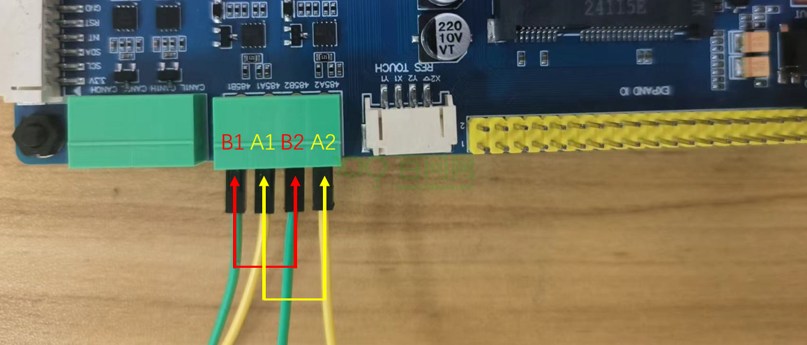

# RS485通信

本章节将讲解如何测试T113i-Industrial开发板的RS485通信功能。

## RS485通信协议概述

RS485，全称为"Recommended Standard 485"，是一种由电子工业联盟（EIA）定义的电气特性标准，广泛用于实现可靠的串行数据通信。它支持多点通信，允许多个设备共享同一通信总线，通过差分信号传输方式来提高数据传输的抗干扰能力，适用于长距离和噪声环境下的数据通信。具备以下特性：

- 支持**多点通信**，允许多个设备在同一总线上进行数据交换。
- 采用**半双工模式**，确保在同一时间内设备只能进行发送或接收操作，但不能同时进行。
- 使用**两根导线（A线和B线）**传输差分信号，增强了抗干扰能力。
- 接收器依据A线和B线间的电压差来识别二进制数据（逻辑"1"或"0"）。
- 通过**终端电阻**减少信号反射，确保信号在长距离传输中的完整性。
- 利用**奇偶校验位**进行错误检测，保障数据传输的准确性。
- 传输速率最高可达**10Mbps**，传输距离可达**1200米**。
- 长距离和高数据速率的特性使其在多种环境下均能保持稳定的通信能力。

## 硬件连接

在进行RS485功能测试前，需要使用两根接线端子(杜邦线)连接开发板的RS485接口，RS485_A1 连接 RS485_A2，RS485_B1 连接 RS485_B2。硬件连接如下图：

RS485 是半双工，连接设备的时候一般接 A/B/GND，即源端的 A 连接目标设备的 A，源端的 B 连接目标设备的 B。

## 登录串口终端

连接成功后，看到这里，如果不知道如何上电，如何打开串口终端，请参考前面《快速启动》章节里的启动开发板文章。

地址链接：[启动开发板 | 东山Π (100ask.org)](https://dshanpi.100ask.org/docs/T113i-Industrial/part1/QuickStart)

## 设置波特率

由原理图可知：

uart2 ==> 端口1（RS485_A1，RS485_B1）

uart3 ==> 端口2（RS485_A2，RS485_B2）

进入串口终端后，想要两个rs485互相通信，首先就得设置相同的波特率，在开发板上执行以下几步：

**配置uart2、uart3的波特率**

- 设置uart2波特率。

~~~bash
# stty -F /dev/ttyS2 speed 115200
9600
# stty -F /dev/ttyS2 speed 115200
115200
#
~~~

执行两次，才可以成功设置波特率为115200。

- 设置uart3波特率。

~~~bash
# stty -F /dev/ttyS3 speed 115200
9600
# stty -F /dev/ttyS3 speed 115200
115200
~~~

## 测试RS485通信

波特率设置好后，即可进行通信测试。下面将进行**端口2**发送数据，**端口1**负责接收。

**后台监测端口1**

~~~bash
# cat /dev/ttyS2 &
[1] 1372
#
~~~

**控制端口2发送数据**

~~~bash
# echo 100ask > /dev/ttyS3
100ask

~~~

可以看到有`100ask`打印出来。

同样可以控制**端口1**发送数据给**端口2**，因为上面已经设置过一次波特率了，不用再次设置。

**后台监测端口2**

在这之前先杀掉之前后台监测的端口1

~~~bash
# ps
...
1372 root     cat /dev/ttyS2
...
# kill -9 1372
#
[1]+  Killed                  cat /dev/ttyS2
#
~~~

再执行以下指令：

~~~bash
# cat /dev/ttyS3 &
[1] 1374
#
~~~

**控制端口1发送数据**

~~~bash
# echo 123456 > /dev/ttyS2
123456

#
~~~

也有数据出来，自此测试完成。
