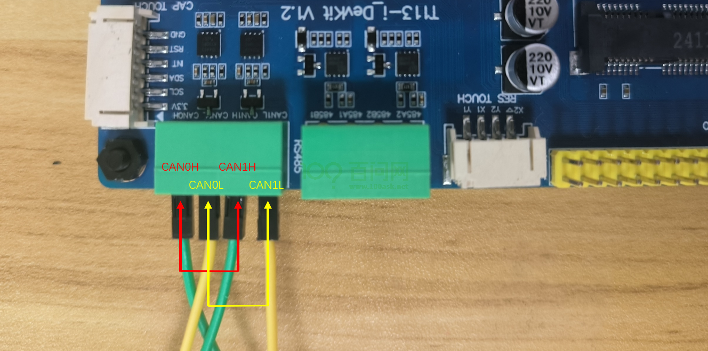

# CAN通信

本章节将讲解如何测试 T113i-Industrial 开发板的CAN通信功能。

## CAN通信协议概述

CAN通信协议，全称为Controller Area Network，是一种支持实时控制的串行通信协议，它专为满足汽车和工业环境中的高可靠性和网络灵活性而设计。以下是简要的概述：

- CAN协议由Bosch公司在1980年代开发，主要用于汽车电子系统中的电子控制单元（ECUs）之间的通信。
- CAN使用**多主站模式**，网络上的任何节点都可以在任何时间点开始发送数据。
- 它采用**非破坏性仲裁机制**，确保高优先级的消息能够优先传输。
- CAN协议的数据帧结构紧凑，包括帧起始、仲裁场、控制场、数据场、CRC校验、帧结束等部分。
- 支持最高**8个字节**的数据载荷，适用于传输控制命令和传感器数据。
- 集成了强大的错误检测机制，包括循环冗余校验（CRC）和位填充。
- 在检测到错误时，网络可以自动重传损坏的消息，提高了数据传输的可靠性。
- CAN网络**支持不同的波特率**，从最低的10kbps到最高的1Mbps，根据不同的应用需求进行配置。

## 硬件连接

测试之前，先使用两根杜邦线，一根将 `CAN0 L` 连接至 `CAN1 L`，另一根将 `CAN0 H`连接 `CAN1 H`。

连接如下图：

## 登录串口终端

看到这里，如果不知道如何上电，如何打开串口终端，请参考前面《快速启动》章节里的启动开发板文章。

地址链接：[启动开发板 | 东山Π (100ask.org)](https://dshanpi.100ask.org/docs/T113i-Industrial/part1/QuickStart)

## 测试CAN通信

烧录完成后，进入开发板。

在开发板上，执行`ifconfig -a`，查看是否存在`awlink0`和`awlink1`。

~~~bash
# ifconfig  -a
awlink0   Link encap:UNSPEC  HWaddr 00-00-00-00-00-00-00-00-00-00-00-00-00-00-00-00
          NOARP  MTU:16  Metric:1
          RX packets:0 errors:0 dropped:0 overruns:0 frame:0
          TX packets:0 errors:0 dropped:0 overruns:0 carrier:0
          collisions:0 txqueuelen:10
          RX bytes:0 (0.0 B)  TX bytes:0 (0.0 B)

awlink1   Link encap:UNSPEC  HWaddr 00-00-00-00-00-00-00-00-00-00-00-00-00-00-00-00
          NOARP  MTU:16  Metric:1
          RX packets:0 errors:0 dropped:0 overruns:0 frame:0
          TX packets:0 errors:0 dropped:0 overruns:0 carrier:0
          collisions:0 txqueuelen:10
          RX bytes:0 (0.0 B)  TX bytes:0 (0.0 B)
          Interrupt:1

eth0      Link encap:Ethernet  HWaddr 42:5A:1A:01:32:43
          BROADCAST MULTICAST  MTU:1500  Metric:1
          RX packets:0 errors:0 dropped:0 overruns:0 frame:0
          TX packets:0 errors:0 dropped:0 overruns:0 carrier:0
          collisions:0 txqueuelen:1000
          RX bytes:0 (0.0 B)  TX bytes:0 (0.0 B)
          Interrupt:40

ip6tnl0   Link encap:UNSPEC  HWaddr 00-00-00-00-00-00-00-00-00-00-00-00-00-00-00-00
          NOARP  MTU:1452  Metric:1
          RX packets:0 errors:0 dropped:0 overruns:0 frame:0
          TX packets:0 errors:0 dropped:0 overruns:0 carrier:0
          collisions:0 txqueuelen:1000
          RX bytes:0 (0.0 B)  TX bytes:0 (0.0 B)

lo        Link encap:Local Loopback
          inet addr:127.0.0.1  Mask:255.0.0.0
          inet6 addr: ::1/128 Scope:Host
          UP LOOPBACK RUNNING  MTU:65536  Metric:1
          RX packets:0 errors:0 dropped:0 overruns:0 frame:0
          TX packets:0 errors:0 dropped:0 overruns:0 carrier:0
          collisions:0 txqueuelen:1000
          RX bytes:0 (0.0 B)  TX bytes:0 (0.0 B)

sit0      Link encap:IPv6-in-IPv4
          NOARP  MTU:1480  Metric:1
          RX packets:0 errors:0 dropped:0 overruns:0 frame:0
          TX packets:0 errors:0 dropped:0 overruns:0 carrier:0
          collisions:0 txqueuelen:1000
          RX bytes:0 (0.0 B)  TX bytes:0 (0.0 B)

#
~~~

可以看到，通过ifconfig命令查看CAN接口功能为正常，下面进行CAN功能的收发测试。

连接好线后，做以下几个步骤进行测试。

**①使用ip命令设置awlink接口的速度为500Kb/s**

> 注意：需要设置完成awlink接口速度才能使能awlink接口！！！

~~~bash
# ip link set awlink0 type can bitrate 500000
# ip link set awlink1 type can bitrate 500000
~~~

**②打开awlink网卡**

~~~bash
# ifconfig awlink0 up
[ 1105.138598] IPv6: ADDRCONF(NETDEV_CHANGE): awlink0: link becomes ready
# ifconfig awlink1 up
[ 1106.368692] IPv6: ADDRCONF(NETDEV_CHANGE): awlink1: link becomes ready
#
~~~

**③设置awlink0接收数据**

~~~bash
# candump awlink0 &
[1] 1386
~~~

**④向awlink0发送数据**

~~~bash
# cansend awlink0 5A1#11.22.33.44.55.66.77.88
  awlink0  5A1   [8]  11 22 33 44 55 66 77 88
~~~

上述cansend命令中，“5A1”是帧ID，“#”后面的“11.22.33.44.55.66.77.88”是要发送的数据，十六进制。CAN2.0一次最多发送8个字节的数据，8字节数据之间用英文点号`“.”`隔开，can-utils会对数据进行解析。

