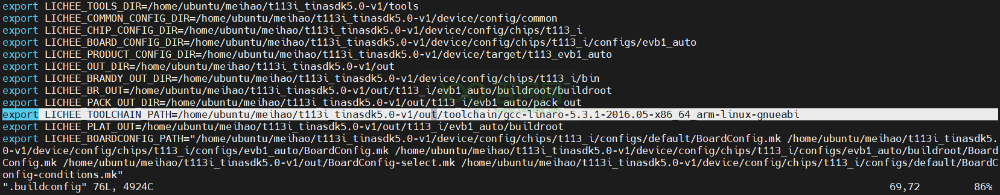
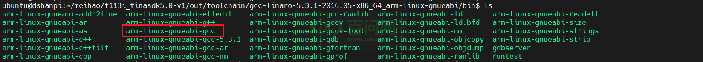

# GPADC按键

本章节将讲解如何测试 T113i-Industrial 开发板的GPADC按键功能。

## GPADC按键概述

GPADC（General Purpose ADC Keys）是一种通用的模拟数字转换按键，它通常用于将模拟信号转换为数字信号，从而实现对按键的检测。

- GPADC可以被想象成一个能够把按压按键的动作转换成开发板能懂的数字信号的“翻译官”。
- 当你按下一个按键时，按键之间会形成一个电路连接，这个连接会产生一个**模拟信号**
- GPADC的作用就是把这个连续变化的模拟电压信号**转换**成离散的数字信号
- GPADC按键广泛应用于遥控器、游戏手柄、家用电器等设备，提供用户输入接口。
- GPADC按键相比传统的机械开关，具有更低的磨损、更长的使用寿命和更精确的信号识别能力。

## 登录串口终端

看到这里，如果不知道如何上电，如何打开串口终端，请参考前面《快速启动》章节里的启动开发板文章。

地址链接：[启动开发板 | 东山Π (100ask.org)](https://dshanpi.100ask.org/docs/T113i-Industrial/part1/QuickStart)

## 测试按键

进入串口终端后，执行`cat /proc/bus/input/devices`,查看对应的设备节点。

~~~bash
# cat /proc/bus/input/devices
I: Bus=0019 Vendor=0001 Product=0001 Version=0100
N: Name="sunxi-keyboard"
P: Phys=sunxikbd/input0
S: Sysfs=/devices/virtual/input/input0
U: Uniq=
H: Handlers=kbd event0
B: PROP=0
B: EV=3
B: KEY=1000 800 c0000 0 0 10000000

I: Bus=0019 Vendor=0001 Product=0001 Version=0100
N: Name="sunxi-ts"
P: Phys=sunxi_ts/input0
S: Sysfs=/devices/platform/soc@3000000/2009c00.rtp/input/input1
U: Uniq=
H: Handlers=event1
B: PROP=0
B: EV=b
B: KEY=400 0 0 0 0 0 0 0 0 0 0
B: ABS=3

I: Bus=0019 Vendor=0001 Product=0001 Version=0100
N: Name="sunxi-gpadc0"
P: Phys=sunxigpadc0/input0
S: Sysfs=/devices/virtual/input/input2
U: Uniq=
H: Handlers=kbd event2
B: PROP=0
B: EV=100003
B: KEY=200000 0 0 0 0 0 0 0 8c0000 0 0 10000000

#
~~~

可以看到`sunxi-gpadc0`对应的设备节点是`/dev/input/event2`。

### hexdump测试

在串口终端上，执行`/dev/input/event2`，检测按键按下状态：

~~~bash
# hexdump /dev/input/event2
0000000 1dcd 0000 b22e 0004 0001 0073 0001 0000
0000010 1dcd 0000 b22e 0004 0000 0000 0000 0000
0000020 1dcd 0000 5e10 0007 0001 0073 0000 0000
0000030 1dcd 0000 5e10 0007 0000 0000 0000 0000
0000040 1dce 0000 5bbf 0007 0001 0072 0001 0000
0000050 1dce 0000 5bbf 0007 0000 0000 0000 0000
0000060 1dce 0000 6374 0009 0001 0072 0000 0000
0000070 1dce 0000 6374 0009 0000 0000 0000 0000
0000080 1dcf 0000 4dc5 0005 0001 0077 0001 0000
0000090 1dcf 0000 4dc5 0005 0000 0000 0000 0000
00000a0 1dcf 0000 f5bb 0007 0001 0077 0000 0000
00000b0 1dcf 0000 f5bb 0007 0000 0000 0000 0000
~~~

`0073` 、`0072` 和 `0077` 分别是对应不同按键按下后返回的值。

### C程序测试(可选)

为了更加直观分辨哪个按键按下和松开，编写一个c文件用于读取按键。

在Ubuntu上，创建一个.c文件。

~~~bash
ubuntu@dshanpi:~/meihao/gpadc_test$ ls -la
total 24
drwxrwxr-x 2 ubuntu ubuntu  4096 7月  17 10:48 .
drwxrwxr-x 4 ubuntu ubuntu  4096 7月  17 10:21 ..
-rw-rw-r-- 1 ubuntu ubuntu  1181 7月  17 10:48 gpadc_test.c
ubuntu@dshanpi:~/meihao/gpadc_test$
~~~

写入以下内容：

~~~c
#include <stdio.h>
#include <linux/input.h>
#include <stdlib.h>
#include <sys/types.h>
#include <sys/stat.h>
#include <fcntl.h>
#include <sys/time.h>
#include <limits.h>
#include <unistd.h>
#include <signal.h>

#define DEV_PATH "/dev/input/event2"

static int g_igpadc_fd = 0;

static int test_gpadc(const char *event_file)
{
        int code = 0;
        int i = 0;

        struct input_event data;

        g_igpadc_fd = open(DEV_PATH,O_RDONLY);
        if(g_igpadc_fd <= 0)
        {
                printf("open %s error!\n",DEV_PATH);
                return -1;
        }

        for(i = 0;i < 20;i++)
        {
                read(g_igpadc_fd,&data,sizeof(data));

                /*如果按下按键*/
                if(data.type == EV_KEY && data.value == 1)
                {
                        if(data.code == 115)
                        {
                                code = 1;
                        }else if(data.code == 114)
                        {
                                code = 2;
                        }else if(data.code == 119)
                        {
                                code = 3;
                        }
                        printf("k%d pressed\n",code);
                        code = 0;
                }
                else if(data.type == EV_KEY && data.value == 0)
                {
                        if(data.code == 115)
                        {
                                code = 1;
                        }else if(data.code == 114)
                        {
                                code = 2;
                        }else if(data.code == 119)
                        {
                                code = 3;
                        }
                        printf("k%d releaseed\n",code);
                        code = 0;
                }
        }

        close(g_igpadc_fd);
        return 0;
}

int main()
{
        return test_gpadc(DEV_PATH);
}
~~~

写完程序当然就需要去编译，但是编译之前，先找到相应的交叉编译工具，在源码根目录`t113i_tinasdk5.0-v1/`上，查看`.buildconfig`。

~~~bash
ubuntu@dshanpi:~/meihao/t113i_tinasdk5.0-v1$ vim .buildconfig
...
export LICHEE_TOOLCHAIN_PATH=/home/ubuntu/meihao/t113i_tinasdk5.0-v1/out/toolchain/gcc-linaro-5.3.1-2016.05-x86_64_arm-linux-gnueabi
~~~

可以看到交叉编译工具是`t113i_tinasdk5.0-v1/out/toolchain/gcc-linaro-5.3.1-2016.05-x86_64_arm-linux-gnueabi/bin/arm-linux-gnueabi-gcc`。

执行`t113i_tinasdk5.0-v1/out/toolchain/gcc-linaro-5.3.1-2016.05-x86_64_arm-linux-gnueabi/bin/arm-linux-gnueabi-gcc gpadc_test.c -o gpadc_test`编译应用程序，这里的交叉编译工具路径需要改为实际的路径。

~~~bash
ubuntu@dshanpi:~/meihao/gpadc_test$ /home/ubuntu/meihao/t113i_tinasdk5.0-v1/out/toolchain/gcc-linaro-5.3.1-2016.05-x86_64_arm-linux-gnueabi/bin/arm-linux-gnueabi-gcc gpadc_test.c -o gpadc_test
ubuntu@dshanpi:~/meihao/gpadc_test$
ubuntu@dshanpi:~/meihao/gpadc_test$ ls -la
total 24
drwxrwxr-x 2 ubuntu ubuntu  4096 7月  17 12:07 .
drwxrwxr-x 4 ubuntu ubuntu  4096 7月  17 10:21 ..
-rwxrwxr-x 1 ubuntu ubuntu 10652 7月  17 12:07 gpadc_test
-rw-rw-r-- 1 ubuntu ubuntu  1181 7月  17 10:48 gpadc_test.c
ubuntu@dshanpi:~/meihao/gpadc_test$ file gpadc_test
gpadc_test: ELF 32-bit LSB executable, ARM, EABI5 version 1 (SYSV), dynamically linked, interpreter /lib/ld-linux.so.3, for GNU/Linux 2.6.32, BuildID[sha1]=b8a92558e4a8aa4ea8ef04018054c8d4e55de7ff, with debug_info, not stripped
ubuntu@dshanpi:~/meihao/gpadc_test$
~~~

编译成功后，把可执行程序 `gpadc_test` 通过ADB上传到开发板。

~~~bash
ubuntu@dshanpi:~/meihao/gpadc_test$ adb push gpadc_test /mnt/UDISK/
~~~

执行程序：

~~~bash
# cd /mnt/UDISK/
# ls
gpadc_test
## cd gpadc_test/
# ls
gpadc_test    gpadc_test.c
# ./gpadc_test
k1 pressed
k1 releaseed
k2 pressed
k2 releaseed
k3 pressed
k3 releaseed
k1 pressed
k1 releaseed
k2 pressed
k2 releaseed
#
~~~

