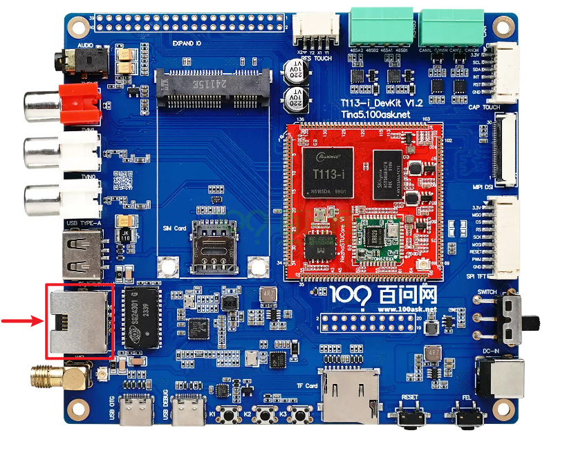
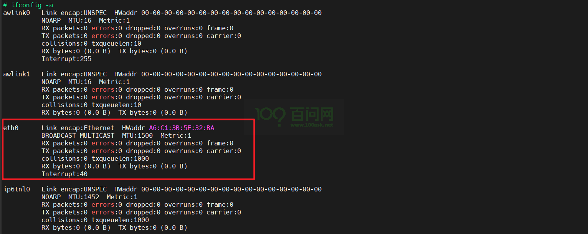
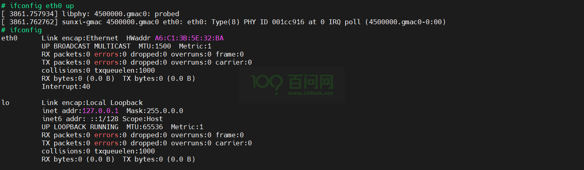
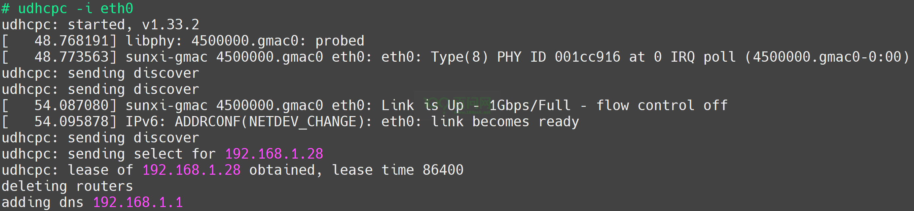

# 千兆网口通信

本章节将讲解如何测试千兆网口。源码Tina5-SDK编译出的镜像中默认支持千兆网口通信功能。

## 准备工作

在进入本章节实验之前，请做好以下准备。

**硬件：**
1. T113i-Industrial开发板
2. usb typeC线 X2 
3. 一根能用来上网的网线

**软件：**
1. 全志线刷工具：[AllwinnertechPhoeniSuit.zip](https://dl.100ask.net/Hardware/MPU/T113i-Industrial/Tools/AllwinnertechPhoeniSuit.zip)
2. 全志USB烧录驱动：[AllwinnerUSBFlashDeviceDriver.zip](https://dl.100ask.net/Hardware/MPU/T113i-Industrial/Tools/AllwinnerUSBFlashDeviceDriver.zip)

## 登录开发板终端

看到这里，如果不知道怎么连接硬件，怎么打开串口终端，请参考前面《快速启动》章节里的启动开发板文章。

地址链接：[启动开发板 | 东山Π (100ask.org)](https://dshanpi.100ask.org/docs/T113i-Industrial/part1/QuickStart)

## 联网测试

在进行千兆网卡功能测试前，查看网卡的位置如下图所示：

> 注意：请确保网线可以正常通过路由器进行联网

1.网线安装完成后，上电启动系统，进入串口终端，查看eth0节点是否存在，输入：

~~~bash
ifconfig -a
~~~

输入完成之后。即可看到eth0节点，如下图所示：

2.使能eth0网络设备节点，输入：

~~~bash
ifconfig eth0 up
~~~

输入完成后，即可通过`ifconfig`查看到使能后的网络设备节点，如下图所示：

3.将网线插入网卡之后，可以看到网卡座子处的绿色灯亮起，此时可以去获取eth0的IP地址，输入：

~~~bash
udhcpc -i eth0
~~~

输入完成后即可获取到路由器分配的ip地址，如下图所示：

可以看到1Gbps/Full。