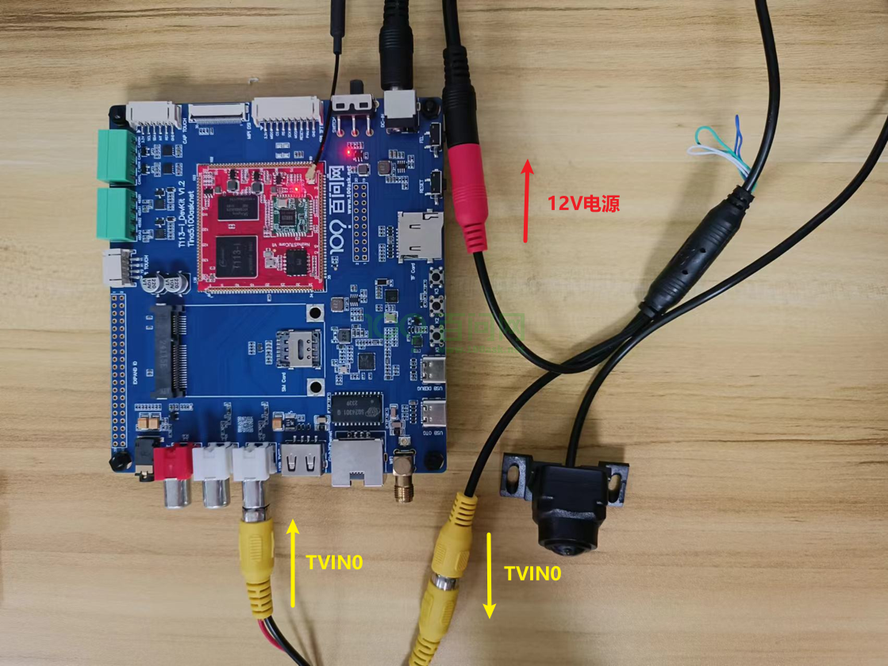
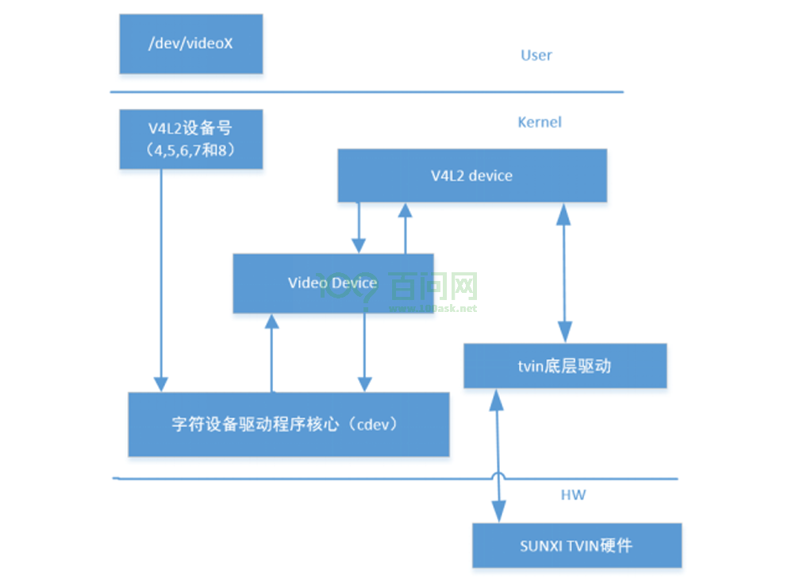
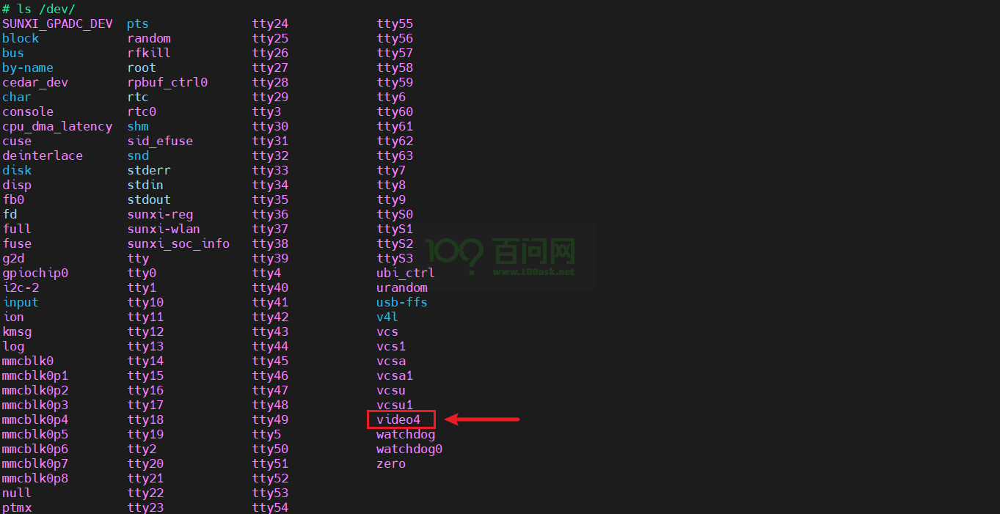
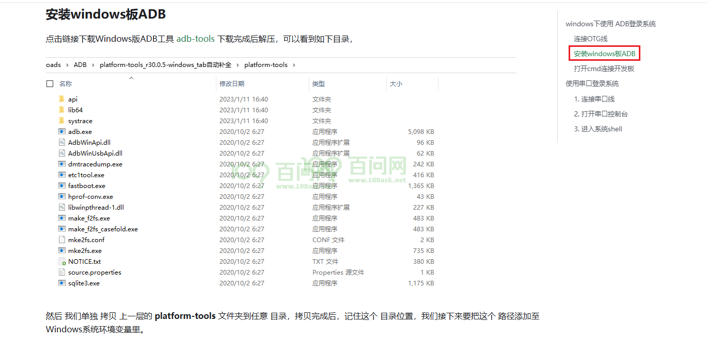
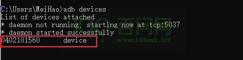
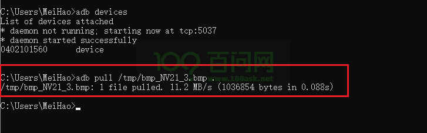
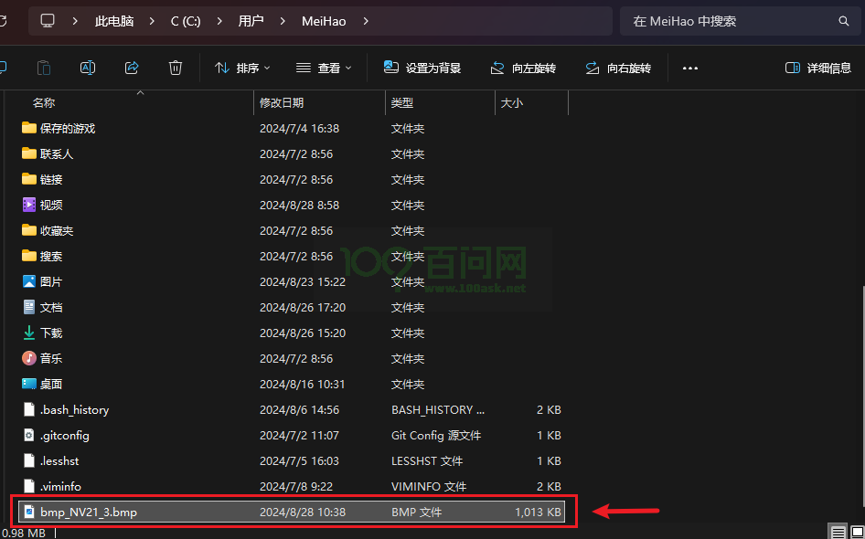
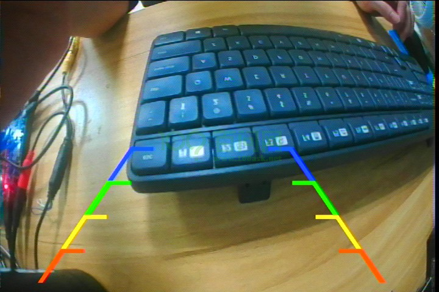

# CVBS摄像头抓图

本章节将讲解如何在 T113i-Industrial 开发板上使用cvbs摄像头抓取图像数据。

## 前提条件

> 操作之前，先做好以下准备。

**硬件：**
1. T113i-Industrial 开发板
2. usb typeC线 X2
3. cvbs摄像头

**软件：**
1. 全志线刷工具：[AllwinnertechPhoeniSuit.zip](https://dl.100ask.net/Hardware/MPU/T113i-Industrial/Tools/AllwinnertechPhoeniSuit.zip)
2. 全志USB烧录驱动：[AllwinnerUSBFlashDeviceDriver.zip](https://dl.100ask.net/Hardware/MPU/T113i-Industrial/Tools/AllwinnerUSBFlashDeviceDriver.zip)
3. 镜像（支持tvd）：[T113i-DevKit-Support-TVD.7z](https://dl.100ask.net/Hardware/MPU/T113i-Industrial/Images/T113i-DevKit-Support-TVD.7z)
> 镜像说明：支持tvd功能，md5值：855c07003183cfe2d26a7339f962ca0e

## 硬件连接

要使用cvbs摄像头获取图像数据，如果只单独购买了 T113i-Industrial 开发板，还需另外购买cvbs摄像头。下面图片是将cvbs摄像头连接到 T113i-Industrial 开发板的指南。

## 硬件介绍

### TVD功能特性

在全志内部，通常把 CVBS IN 模块称为 TVD 或者 TVIN 模块，是一个用于采集模拟 CVBS 视频的硬件模块，可将输入的 CVBS 信号或 YPbPr 信号转换成 YUV 信号。

### 驱动框架

tvd 驱动只是负责把tvd的硬件描述完成并注册进V4L2框架，具体对tvd的使用还是放在用户态的应用层。这里归纳关于用户态操作使用tvd模块的流程。

## 登录开发板终端

进行抓图前，先登录开发板终端，如果不知道如何登录，请参考前面《快速启动》章节里的启动开发板文章。

参考地址：[启动开发板 | 东山Π (100ask.org)](https://dshanpi.100ask.org/docs/T113i-Industrial/part1/QuickStart)

## 获取抓图工具

在Ubuntu上，执行以下指令，获取资源：
~~~bash
git clone https://e.coding.net/weidongshan/tina5/APP-DevExample.git
~~~

下载的资源里面，源码在文件夹 `V4L2/camera_demo_v1`。

~~~bash
ubuntu@dshanpi:~/meihao/APP-DevExample/V4L2/camera_demo_v1$ tree -L 1
.
├── camerademo   #一个准备好的应用程序
├── makefile
├── Makefile
├── README.md
└── src

1 directory, 4 files
~~~

这个文件夹下的`README.md` 文档里有编译抓图工具的使用教程。

## 抓图工具使用介绍

抓图工具是使用一个 camerademo 应用测试程序，下面将讲解如何使用。

进入串口终端，执行以下指令，查看 camerademo 使用方法：

~~~bash
camerademo --help
~~~

查看结果如下：

~~~bash
[CAMERA]**********************************************************
[CAMERA]*                                                        *
[CAMERA]*              this is camera test.                      *
[CAMERA]*                                                        *
[CAMERA]**********************************************************
[CAMERA]******************** camerademo help *********************
[CAMERA] This program is a test camera.
[CAMERA] It will query the sensor to support the resolution, output format and test frame rate.
[CAMERA] At the same time you can modify the data to save the path and get the number of photos.
[CAMERA] When the last parameter is debug, the output will be more detailed information
[CAMERA] There are eight ways to run:
[CAMERA]    1.camerademo --- use the default parameters.
[CAMERA]    2.camerademo debug --- use the default parameters and output debug information.
[CAMERA]    3.camerademo setting --- can choose the resolution and data format.
[CAMERA]    4.camerademo setting debug --- setting and output debug information.
[CAMERA]    5.camerademo NV21 640 480 30 bmp /tmp 5 --- param input mode,can save bmp or yuv.
[CAMERA]    6.camerademo NV21 640 480 30 bmp /tmp 5 debug --- output debug information.
[CAMERA]    7.camerademo NV21 640 480 30 bmp /tmp 5 Num --- /dev/videoNum param input mode,can save bmp or yuv.
[CAMERA]    8.camerademo NV21 640 480 30 bmp /tmp 5 Num debug --- /dev/videoNum output debug information.
[CAMERA]    8.camerademo NV21 640 480 30 bmp /tmp 5 Num 1 --- 1/2: chose memory: V4L2_MEMORY_MMAP/USERPTR
[CAMERA]**********************************************************
~~~

1. **camerademo ：** 使用默认参数进行摄像头测试，不输出调试信息。
2. **camerademo debug ：** 使用默认参数进行摄像头测试，并输出更多的调试信息。
3. **camerademo setting ：** 允许用户选择分辨率和数据格式进行测试，不输出调试信息。
4. **camerademo setting debug ：** 允许用户选择分辨率和数据格式进行测试，并输出调试信息。
5. **camerademo NV21 640 480 30 bmp /tmp 5 ：** 使用指定的像素格式（NV21）、分辨率（640x480）、帧率（30fps）、图像格式（bmp）、保存路径（/tmp）和保存图片数量（5）进行测试，可以保存为bmp或yuv格式。
6. **camerademo NV21 640 480 30 bmp /tmp 5 debug ：** 与第5点相同，但额外输出调试信息。
7. **camerademo NV21 640 480 30 bmp /tmp 5 Num ：** 与第5点相同，但允许指定摄像头设备号（Num），用于多摄像头系统。
8. **camerademo NV21 640 480 30 bmp /tmp 5 Num debug ：** 与第6点相同，但允许指定摄像头设备号。
9. **camerademo NV21 640 480 30 bmp /tmp 5 Num 1 ：** 与第8点相同，但额外选择内存管理机制（1代表V4L2_MEMORY_MMAP或USERPTR）。

## 抓图测试

camerademo 抓图工具，默认情况下，使用的设备号是/dev/video0，查看开发板的tvd设备节点是否满足默认节点。

在串口终端中，执行以下指令：

~~~bash
ls /dev/
~~~

可以看到设备号是/dev/video4，不是默认的设备节点，所以不可以直接执行 camerademo 指令抓图。需要使用`camerademo NV21 640 480 30 bmp /tmp 5 4`，来指定设备号为/dev/video4。

准备工作完成后，现在来进行抓图测试，执行以下指令：

~~~bash
camerademo NV21 720 480 30 bmp /tmp 5
~~~

> 注意：
>
> 该分辨率，只支持 “640 480” 和 “720 480” ，摄像头能否使用 camerademo 抓图也与分辨率有关。

执行结果如下：

~~~bash
# ./camerademo NV21 720 480 30 bmp /tmp 5 4
[1970-01-01 00:18:05] WARNING: awplayer <cdx_log_set_level:30>: Set log level to 3
[1970-01-01 00:18:05] ERROR  : awplayer <ReadPluginEntry:198>: read plugin entry adecoder-14 fail!
[1970-01-01 00:18:05] ERROR  : awplayer <ReadPluginEntry:198>: read plugin entry vdecoder-10 fail!
INFO   : cedarc <CedarPluginVDInit:80>: register h264 decoder success!
INFO   : cedarc <CedarPluginVDInit:84>: register mjpeg decoder success!
INFO   : cedarc <CedarPluginVDInit:86>: register mpeg2 decoder success!
[1970-01-01 00:18:05] WARNING: awplayer <DlOpenPlugin:112>: Invalid plugin,function CedarPluginVDInit not found.
INFO   : cedarc <CedarPluginVDInit:98>: register mpeg4dx decoder success!
INFO   : cedarc <CedarPluginVDInit:79>: register mpeg4H263 decoder success!
INFO   : cedarc <CedarPluginVDInit:90>: register mpeg4Normal decoder success!
[1970-01-01 00:18:05] ERROR  : awplayer <DlOpenPlugin:103>: dlopen 'libawwmv3.so' fail: libawwmv3.so: cannot open shared object file: No such file or directory
[1970-01-01 00:18:05] ERROR  : awplayer <CdxPluginLoadList:235>: load vdecoder id vdecoder.wmv3 fail!
INFO   : cedarc <CedarPluginVDInit:85>: register h265 decoder success!
INFO   : cedarc <CedarPluginVDInit:73>: register vp8 decoder success!
[1970-01-01 00:18:05] ERROR  : awplayer <ReadPluginEntry:198>: read plugin entry plugin-0 fail!
[CAMERA]**********************************************************
[CAMERA]*                                                        *
[CAMERA]*              this is camera test.                      *
[CAMERA]*                                                        *
[CAMERA]**********************************************************
[CAMERA]**********************************************************
[CAMERA] open /dev/video4!
[CAMERA]**********************************************************
[CAMERA]**********************************************************
[CAMERA] The path to data saving is /tmp.
[CAMERA] The number of captured photos is 5.
[CAMERA] save bmp format
[CAMERA]************************[  506.457851] [tvd] vidioc_s_fmt_vid_cap:1623
[  506.457851] interface=0
[  506.457851] system=NTSC
[  506.457851] format=0
[  506.457851] output_fmt=YUV420
********************************[  506.476529] [tvd] vidioc_s_fmt_vid_cap:1627
[  506.476529] row=1
[  506.476529] column=1
[  506.476529] ch[0]=0
[  506.476529] ch[1]=0
[  506.476529] ch[2]=0
[  506.476529] ch[3]=0
**
[CAMERA] Using format parame[  506.498019] [tvd] vidioc_s_fmt_vid_cap:1629
[  506.498019] width=720
[  506.498019] height=480
[  506.498019] dev->sel=0
ters NV21.
[CAMERA] camera pixe[  506.513595] [tvd] tvd_cagc_and_3d_config:1481 tvd0 agc auto mode
lformat: NV21
[CAMERA] Resoluti[  506.523037] [tvd] tvd_cagc_and_3d_config:1490 tvd0 CAGC enable:0x1
on size : 720 * 480
[CAMERA] The photo save path is /tmp.
[CAMERA] The number of photos taken [  506.540539] [tvd] tvd_cagc_and_3d_config:1517 tvd0 3d enable :0x5f100000
is 5.
[CAMERA] Camera capture framerate is 0/0
[CAMERA] VIDIOC[  506.551252] [tvd] vidioc_streamon:1712 Out vidioc_streamon:0
_S_FMT succeed
[CAMERA] fmt.type = 1
[CAMERA] fmt.fmt.pix.width = 720
[CAMERA] fmt.fmt.pix.height = 480
[CAMERA] fmt.fmt.pix.pixelformat = NV21
[CAMERA] fmt.fmt.pix.field = 1
[CAMERA] stream on succeed
[CAMERA] camera4 capture num is [0]
[  506.604952] [tvd] tvd_isr:810 In tvd_isr
[CAMERA_PROMPT] the time interval from the start to the first frame is 78 ms
[CAMERA] camera4 capture num is [1]
[CAMERA] camera4 capture num is [2]
[CAMERA] camera4 capture num is [3]
[CAMERA] camera4 capture num is [4]
[CAMERA] Capture thread finish
[CAMERA] close /dev/video4
~~~

图片保存的路径在`/tmp`目录下，

~~~bash
# ls /tmp/
bmp_NV21_1.bmp    bmp_NV21_4.bmp    dnsmasq.leases    subsys
bmp_NV21_2.bmp    bmp_NV21_5.bmp    fw_printenv.lock
bmp_NV21_3.bmp    dbus              messages
#
~~~

## 查看图片

图片抓图后，如何去查看图片呢？

强烈建议使用adb工具，拉取到Windows，直接使用Windows默认的查看图片工具打开图片。

如果不知道在Windows上使用adb工具，请参考[启动开发板 | 东山Π (100ask.org)](https://dshanpi.100ask.org/docs/T113i-Industrial/part1/QuickStart#安装windows板adb)

执行 `win + r`，打开对话框，执行`adb devices`

可以看到识别到开发板的adb设备，接下来，拉取一张图片，在对话框上，执行以下指令

~~~bash
adb pull /tmp/bmp_NV21_3.bmp .
~~~

拉取成功，找到相应的位置。

双击直接打开，即可查看图片：

