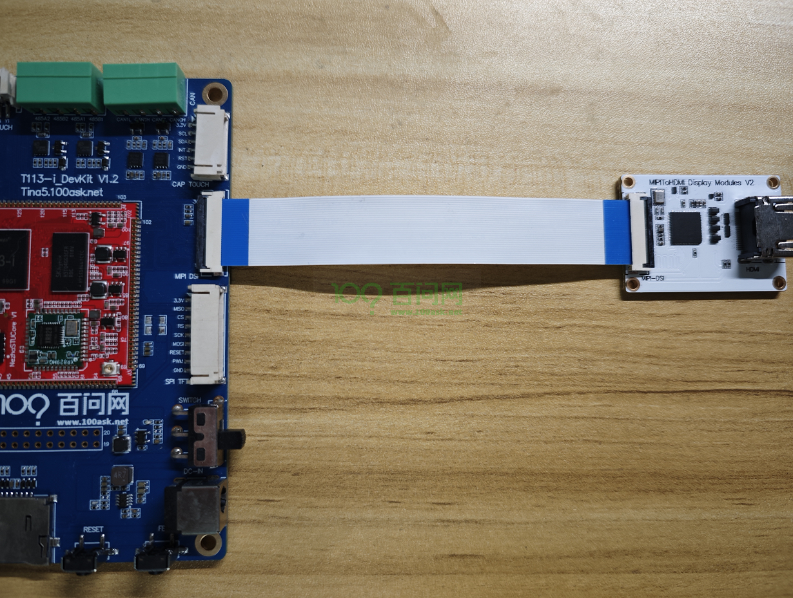
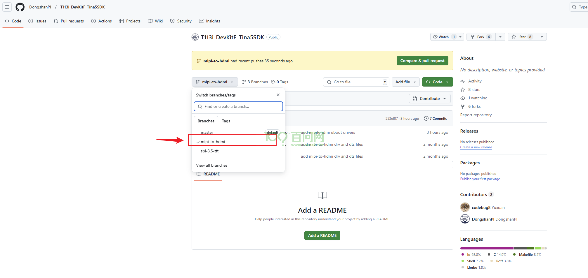

# MIPI转HDMI功能测试

本章节将讲解如何使用百问网MIPI转HDMI模块，在 T113i 上实现HDMI显示功能。

## 准备资源

**硬件：**

- T113i-DevKit 开发板
- USB TypeC线 x2
- [MIPI转HDMI模块](https://detail.tmall.com/item.htm?abbucket=7&id=864978100644&ns=1&priceTId=213e36ff17394966460815694e39ab&spm=a21n57.1.item.2.4905523cIMMHxS&utparam={"aplus_abtest"%3A"ccda33308f543f03536dbd01cb326987"}&xxc=taobaoSearch) x1

**软件：**

- 全志线刷工具：[AllwinnertechPhoeniSuit.zip](https://dl.100ask.net/Hardware/MPU/T113i-Industrial/Tools/AllwinnertechPhoeniSuit.zip)
- 全志USB烧录驱动：[AllwinnerUSBFlashDeviceDriver.zip](https://dl.100ask.net/Hardware/MPU/T113i-Industrial/Tools/AllwinnerUSBFlashDeviceDriver.zip)
- 镜像（支持mipi转hdmi）：[T113i-DevKit-Support-MIPI-To-HDMI.7z](https://dl.100ask.net/Hardware/MPU/T113i-Industrial/Images/T113i-DevKit-Support-MIPI-To-HDMI.7z)

> 镜像说明：该镜像仅支持mipi转hdmi功能。MD5值：`058d3463160d6b9fd0888d3f408bacdf`

## 硬件连接说明

开发板上电前，先参考mipi转hdmi模块与开发板连接图，如下：

## 更新系统镜像

接着下载镜像 T113i-DevKit-Support-MIPI-To-HDMI.7z，并解压，参考 [更新系统固件](/docs/T113i-Industrial/part1/03-1_FlashSystem) 章节，把镜像烧录至开发板中。然后连接hdmi显示屏，启动开发板，即可看见hdmi显示屏显示LOGO。

## 源码地址

由于该镜像 T113i-DevKit-Support-MIPI-To-HDMI.7z 仅支持mipi-to-hdmi 功能，而默认系统镜像支持mipi显示，需要把mipi功能修改成mipi-to-hdmi功能，参考驱动源码：[地址链接](https://github.com/DongshanPI/T113i_DevKitF_Tina5SDK/tree/mipi-to-hdmi)

