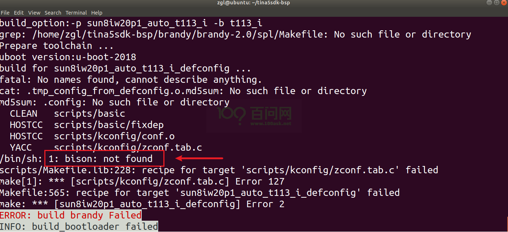

# 开发环境搭建

本章节将讲解如何在Ubuntu上搭建一个Tina5-SDK开发环境。

> 注意：虚拟机的`内存`和`处理器`都要 >= 4，否则会编译固件会出现报错。

## 获取Tina5-SDK源码

首先，在Windows上访问下面的论坛地址，

- 打开Tina5-SDK基础包获取：

  https://forums.100ask.net/t/topic/7393

  - 通过百度网盘下载，大小约3.3G，名称为tina5sdk-bsp-50ae436fe556be2253856af283b1e094.tar.gz 下载完成后通过网络等方式拷贝到虚拟机目录下。

把基础包拷贝到虚拟机之后，解压：

~~~bash
ubuntu@ubuntu1804:~$ tar -xvf  tina5sdk-bsp-50ae436fe556be2253856af283b1e094.tar.gz 
~~~

解压后，基础包的命名是`tina5sdk-bsp`。

以上只是获取一个Tina5-SDK的一个基础包，并**不是完整**的SDK源码，还需要获取执行以下几步，才可以得到一个完整的Tina5-SDK源码包。

~~~bash
ubuntu@ubuntu1804:~$ cd tina5sdk-bsp 
ubuntu@ubuntu1804:~/tina5sdk-bsp$ git clone https://e.coding.net/weidongshan/tina5/buildroot.git
ubuntu@ubuntu1804:~/tina5sdk-bsp$ git clone https://e.coding.net/weidongshan/tina5/openwrt.git
ubuntu@ubuntu1804:~/tina5sdk-bsp$ git clone https://e.coding.net/weidongshan/tina5/platform.git
ubuntu@ubuntu1804:~/tina5sdk-bsp$ ls
brandy  build  buildroot  build.sh  device  kernel  openwrt    platform  prebuilt    tools
ubuntu@ubuntu1804:~/tina5sdk-bsp$ 
~~~

看到以上文件，说明Tina5-SDK源码获取成功。

基于T113i-Industrial开发板，我们提供了一个扩展补丁包，获取地址：https://github.com/DongshanPI/T113i_DevKitF_Tina5SDK/

在虚拟机上，拉取扩展补丁：

~~~bash
ubuntu@ubuntu1804:~$ git clone https://github.com/DongshanPI/T113i_DevKitF_Tina5SDK.git 
~~~

进入Tina-SDK5源码根目录`tina5sdk-bsp/`，拷贝扩展补丁：

~~~bash
ubuntu@ubuntu1804:~/tina5sdk-bsp$ cp ~/T113i_DevKitF_Tina5SDK/* -rfvd .
~~~

自此获取资源完成，接下来将讲解如何编译固件，和存在的问题。

## 编译固件

在Ubuntu上，进入源码根目录`tina5sdk-bsp/`。

① 先删除配置文件`rm .buildconfig`

② 接着执行 `source build/envsetup.sh` 初始化环境变量；

③ 最后执行 `./build.sh` 选择开发板选项。

- platform : **linux**
- linux_dev : **buildroot**
- ic : **t113_i**
- board : **evb1_auto**
- flash : **default**

~~~bash
ubuntu@ubuntu1804:~/tina5sdk-bsp$ source build/envsetup.sh
NOTE: The SDK(/home/ubuntu/tina5sdk-bsp) was successfully loaded
load openwrt... ok
Please run lunch next for openwrt.
load buildroot,bsp...ok
Invoke . build/quick.sh from your shell to add the following functions to your environment:
    croot                          - Changes directory to the top of the tree
    cbsp                           - Changes directory to the bsp
    cbsptest                       - Changes directory to the bsptest
    ckernel                        - Changes directory to the kernel
    cbrandy                        - Changes directory to the brandy
    cboot                          - Changes directory to the uboot
    cbr                            - Changes directory to the buildroot
    cchips                         - Changes directory to the board
    cconfigs                       - Changes directory to the board's config
    cbin                           - Changes directory to the board's bin
    cdts                           - Changes directory to the kernel's dts
    ckernelout                     - Changes directory to the kernel output
    cout                           - Changes directory to the product's output
    copenssl                       - Changes directory to the product's openssl-1.0.0
Usage: build.sh [args]
    build.sh                       - default build all
    build.sh bootloader            - only build bootloader
    build.sh kernel                - only build kernel
    build.sh buildroot_rootfs      - only build buildroot
    build.sh menuconfig            - edit kernel menuconfig
    build.sh saveconfig            - save kernel menuconfig
    build.sh recovery_menuconfig   - edit recovery menuconfig
    build.sh recovery_saveconfig   - save recovery menuconfig
    build.sh buildroot_menuconfig  - edit buildroot menuconfig
    build.sh buildroot_saveconfig  - save buildroot menuconfig
    build.sh clean                 - clean all
    build.sh distclean             - distclean all
    build.sh pack                  - pack firmware
    build.sh pack_debug            - pack firmware with debug info output to card0
    build.sh pack_secure           - pack firmware with secureboot
Usage: pack [args]
    pack                           - pack firmware
    pack -d                        - pack firmware with debug info output to card0
    pack -s                        - pack firmware with secureboot
    pack -sd                       - pack firmware with secureboot and debug info output to card0
ubuntu@ubuntu1804:~/tina5sdk-bsp$
ubuntu@ubuntu1804:~/tina5sdk-bsp$ ./build.sh
All available platform:
   0. android
   1. linux
Choice [android]: 1
All available linux_dev:
   0. bsp
   1. buildroot
   2. openwrt
Choice [bsp]: 1
All available ic:
   0. t113_i
   1. t113_s4
Choice [t113_i]: 0
All available board:
   0. evb1
   1. evb1_auto
   2. evb1_auto_nand
   3. evb1_auto_nor
Choice [evb1]: 1
All available flash:
   0. default
   1. nor
Choice [default]: 0
~~~

选择完，按下`Enter`键之后，会自动开始编译。

~~~bash
Choice [default]: 0
INFO: kernel relative recovery defconfig: ../../../../../device/config/chips/t113_i/configs/evb1_auto/linux-5.4/config-5.4-recovery
INFO: kernel absolute recovery defconfig: /home/ubuntu/tina5sdk-bspdevice/config/chips/t113_i/configs/evb1_auto/linux-5.4/config-5.4-recovery
INFO: Prepare toolchain ...
INFO: kernel defconfig: generate /home/ubuntu/tina5sdk-bspout/t113_i/kernel/build/.config by /home/ubuntu/tina5sdk-bspdevice/config/chips/t113_i/configs/evb1_auto/linux-5.4/config-5.4
INFO: Prepare toolchain ...
make: Entering directory '/home/ubuntu/tina5sdk-bspkernel/linux-5.4'
make[1]: Entering directory '/home/ubuntu/tina5sdk-bspout/t113_i/kernel/build'
  GEN     Makefile
*** Default configuration is based on '../../../../../device/config/chips/t113_i/configs/evb1_auto/linux-5.4/config-5.4'
#
# No change to .config
#
make[1]: Leaving directory '/home/ubuntu/tina5sdk-bspout/t113_i/kernel/build'
make: Leaving directory '/home/ubuntu/tina5sdk-bspkernel/linux-5.4'
make: Entering directory '/home/ubuntu/tina5sdk-bspbuildroot/buildroot-201902'
  GEN     /home/ubuntu/tina5sdk-bspout/t113_i/evb1_auto/buildroot/buildroot/Makefile
Config.in.legacy:1769:warning: choice value used outside its choice group
#
# configuration written to /home/ubuntu/tina5sdk-bspout/t113_i/evb1_auto/buildroot/buildroot/.config
#
make: Leaving directory '/home/ubuntu/tina5sdk-bspbuildroot/buildroot-201902'
INFO: buildroot defconfig is sun8iw20p1_t113_defconfig
INFO: clean buildserver
INFO: prepare_buildserver
========ACTION List: build_linuxdev;========
options :
INFO: ----------------------------------------
INFO: build linuxdev ...
INFO: chip: sun8iw20p1
INFO: platform: linux
INFO: kernel: linux-5.4
INFO: board: evb1_auto
INFO: output: /home/ubuntu/tina5sdk-bspout/t113_i/evb1_auto/buildroot
INFO: ----------------------------------------
INFO: don't build dtbo ...
INFO: build arisc
find: '/home/ubuntu/tina5sdk-bspbrandy/brandy-2.0/spl': No such file or directory
find: '/home/ubuntu/tina5sdk-bspbrandy/dramlib': No such file or directory
INFO: build_bootloader: brandy_path=/home/ubuntu/tina5sdk-bspbrandy/brandy-2.0
INFO: skip build brandy.
INFO: build kernel ...
INFO: prepare_buildserver
INFO: Prepare toolchain ...
Makefile:681: arch//Makefile: No such file or directory
make: *** No rule to make target 'arch//Makefile'.  Stop.
ERROR: build  Failed
INFO: build kernel failed
ubuntu@ubuntu1804:~/tina5sdk-bsp$
~~~

如果出现以上错误，加上 `-d` 参数，强行编译，就不会出现报错了（如果是别的错误，强制也无效，可以看看下面的**常见问题**里是否有答案）。

~~~bash
ubuntu@ubuntu1804:~/tina5sdk-bsp$ ./build.sh -d
========ACTION List: build_linuxdev;========
options :
INFO: ----------------------------------------
INFO: build linuxdev ...
INFO: chip: sun8iw20p1
INFO: platform: linux
INFO: kernel: linux-5.4
INFO: board: evb1_auto
INFO: output: /home/ubuntu/tina5sdk-bspout/t113_i/evb1_auto/buildroot
INFO: ----------------------------------------
INFO: don't build dtbo ...
INFO: build arisc
find: '/home/ubuntu/tina5sdk-bspbrandy/brandy-2.0/spl': No such file or directory
find: '/home/ubuntu/tina5sdk-bspbrandy/dramlib': No such file or directory
INFO: build_bootloader: brandy_path=/home/ubuntu/tina5sdk-bspbrandy/brandy-2.0
INFO: skip build brandy.
INFO: build kernel ...
INFO: prepare_buildserver
INFO: Prepare toolchain ...
Building kernel
make[1]: Entering directory '/home/ubuntu/tina5sdk-bspout/t113_i/kernel/build'
  GEN     Makefile
  DTC     arch/arm/boot/dts/board.dtb
  CALL    /home/ubuntu/tina5sdk-bspkernel/linux-5.4/scripts/atomic/check-atomics.sh
  CALL    /home/ubuntu/tina5sdk-bspkernel/linux-5.4/scripts/checksyscalls.sh
  CHK     include/generated/compile.h
  Kernel: arch/arm/boot/Image is ready
  Building modules, stage 2.
  MODPOST 6 modules
  Kernel: arch/arm/boot/zImage is ready
  Kernel: arch/arm/boot/uImage is ready
...

Exportable Squashfs 4.0 filesystem, xz compressed, data block size 131072
        compressed data, compressed metadata, compressed fragments, no xattrs
        duplicates are removed
Filesystem size 56902.63 Kbytes (55.57 Mbytes)
        38.88% of uncompressed filesystem size (146336.84 Kbytes)
Inode table size 54158 bytes (52.89 Kbytes)
        23.54% of uncompressed inode table size (230025 bytes)
Directory table size 70804 bytes (69.14 Kbytes)
        48.95% of uncompressed directory table size (144657 bytes)
Number of duplicate files found 37
Number of inodes 6686
Number of files 5571
Number of fragments 397
Number of symbolic links  813
Number of device nodes 0
Number of fifo nodes 0
Number of socket nodes 0
Number of directories 302
Number of ids (unique uids + gids) 1
Number of uids 1
        root (0)
Number of gids 1
        root (0)
INFO: pack rootfs ok ...
INFO: ----------------------------------------
INFO: build Tina OK.
INFO: ----------------------------------------
ubuntu@ubuntu1804:~/tina5sdk-bsp$
~~~

等待一段时间，编译成功后，执行 `./build.sh pack` 进行打包。

~~~bash
ubuntu@ubuntu1804:~/tina5sdk-bsp$ ./build.sh pack
========ACTION List: mk_pack ;========
options :
INFO: packing firmware ...
INFO: /home/ubuntu/tina5sdk-bspout/t113_i/common/keys
copying tools file
copying configs file
copying product configs file
linux copying boardt&linux_kernel_version configs file
ls: cannot access '/home/ubuntu/tina5sdk-bspdevice/config/chips/t113_i/configs/evb1_auto/linux-5.4/env*': No such file or directory
Use u-boot env file:
Warning: u-boot env file '' not exist! use file in default directory other than 'evb1_auto' directory
/home/ubuntu/tina5sdk-bspout/t113_i/evb1_auto/pack_out/aultls32.fex
/home/ubuntu/tina5sdk-bspout/t113_i/evb1_auto/pack_out/aultools.fex
/home/ubuntu/tina5sdk-bspout/t113_i/evb1_auto/pack_out/boot_package.cfg
/home/ubuntu/tina5sdk-bspout/t113_i/evb1_auto/pack_out/boot_package.fex
/home/ubuntu/tina5sdk-bspout/t113_i/evb1_auto/pack_out/boot_package_nor.cfg
/home/ubuntu/tina5sdk-bspout/t113_i/evb1_auto/pack_out/cardscript.fex
/home/ubuntu/tina5sdk-bspout/t113_i/evb1_auto/pack_out/cardscript_secure.fex
/home/ubuntu/tina5sdk-bspout/t113_i/evb1_auto/pack_out/cardtool.fex
/home/ubuntu/tina5sdk-bspout/t113_i/evb1_auto/pack_out/diskfs.fex
/home/ubuntu/tina5sdk-bspout/t113_i/evb1_auto/pack_out/dragon_toc.cfg
/home/ubuntu/tina5sdk-bspout/t113_i/evb1_auto/pack_out/env-recovery.cfg
/home/ubuntu/tina5sdk-bspout/t113_i/evb1_auto/pack_out/env.cfg
/home/ubuntu/tina5sdk-bspout/t113_i/evb1_auto/pack_out/env_ab.cfg
/home/ubuntu/tina5sdk-bspout/t113_i/evb1_auto/pack_out/env_burn.cfg
/home/ubuntu/tina5sdk-bspout/t113_i/evb1_auto/pack_out/env_dragon.cfg
/home/ubuntu/tina5sdk-bspout/t113_i/evb1_auto/pack_out/env_nor.cfg
/home/ubuntu/tina5sdk-bspout/t113_i/evb1_auto/pack_out/esm.fex
/home/ubuntu/tina5sdk-bspout/t113_i/evb1_auto/pack_out/image.cfg
/home/ubuntu/tina5sdk-bspout/t113_i/evb1_auto/pack_out/image_crashdump.cfg
/home/ubuntu/tina5sdk-bspout/t113_i/evb1_auto/pack_out/image_linux.cfg
/home/ubuntu/tina5sdk-bspout/t113_i/evb1_auto/pack_out/image_nor.cfg
/home/ubuntu/tina5sdk-bspout/t113_i/evb1_auto/pack_out/parameter.fex
/home/ubuntu/tina5sdk-bspout/t113_i/evb1_auto/pack_out/split_xxxx.fex
/home/ubuntu/tina5sdk-bspout/t113_i/evb1_auto/pack_out/sunxi.fex
/home/ubuntu/tina5sdk-bspout/t113_i/evb1_auto/pack_out/sw-subimgs-ab-rdiff.cfg
/home/ubuntu/tina5sdk-bspout/t113_i/evb1_auto/pack_out/sw-subimgs-ab.cfg
/home/ubuntu/tina5sdk-bspout/t113_i/evb1_auto/pack_out/sw-subimgs-recovery.cfg
/home/ubuntu/tina5sdk-bspout/t113_i/evb1_auto/pack_out/sys_config.fex
/home/ubuntu/tina5sdk-bspout/t113_i/evb1_auto/pack_out/sys_partition-recovery.fex
/home/ubuntu/tina5sdk-bspout/t113_i/evb1_auto/pack_out/sys_partition.fex
/home/ubuntu/tina5sdk-bspout/t113_i/evb1_auto/pack_out/sys_partition_ab.fex
/home/ubuntu/tina5sdk-bspout/t113_i/evb1_auto/pack_out/sys_partition_dump.fex
/home/ubuntu/tina5sdk-bspout/t113_i/evb1_auto/pack_out/sys_partition_nor.fex
/home/ubuntu/tina5sdk-bspout/t113_i/evb1_auto/pack_out/sys_partition_private.fex
/home/ubuntu/tina5sdk-bspout/t113_i/evb1_auto/pack_out/sysrecovery.fex
/home/ubuntu/tina5sdk-bspout/t113_i/evb1_auto/pack_out/toc0.fex
/home/ubuntu/tina5sdk-bspout/t113_i/evb1_auto/pack_out/toc0_ft.fex
/home/ubuntu/tina5sdk-bspout/t113_i/evb1_auto/pack_out/toc0_nand.fex
/home/ubuntu/tina5sdk-bspout/t113_i/evb1_auto/pack_out/toc0_sdcard.fex
/home/ubuntu/tina5sdk-bspout/t113_i/evb1_auto/pack_out/toc0_ufs.fex
/home/ubuntu/tina5sdk-bspout/t113_i/evb1_auto/pack_out/toc1.fex
/home/ubuntu/tina5sdk-bspout/t113_i/evb1_auto/pack_out/usbtool.fex
/home/ubuntu/tina5sdk-bspout/t113_i/evb1_auto/pack_out/usbtool_crash.fex
/home/ubuntu/tina5sdk-bspout/t113_i/evb1_auto/pack_out/usbtool_test.fex
copying boot resource
copying boot file
'/home/ubuntu/tina5sdk-bspdevice/config/chips/t113_i/bin/boot0_nand_sun8iw20p1.bin' -> '/home/ubuntu/tina5sdk-bspout/t113_i/evb1_auto/pack_out/boot0_nand.fex'
'/home/ubuntu/tina5sdk-bspdevice/config/chips/t113_i/bin/boot0_sdcard_sun8iw20p1.bin' -> '/home/ubuntu/tina5sdk-bspout/t113_i/evb1_auto/pack_out/boot0_sdcard.fex'
'/home/ubuntu/tina5sdk-bspdevice/config/chips/t113_i/bin/boot0_spinor_sun8iw20p1.bin' -> '/home/ubuntu/tina5sdk-bspout/t113_i/evb1_auto/pack_out/boot0_spinor.fex'
'/home/ubuntu/tina5sdk-bspdevice/config/chips/t113_i/bin/fes1_sun8iw20p1.bin' -> '/home/ubuntu/tina5sdk-bspout/t113_i/evb1_auto/pack_out/fes1.fex'
'/home/ubuntu/tina5sdk-bspdevice/config/chips/t113_i/bin/u-boot-sun8iw20p1.bin' -> '/home/ubuntu/tina5sdk-bspout/t113_i/evb1_auto/pack_out/u-boot.fex'
'/home/ubuntu/tina5sdk-bspdevice/config/chips/t113_i/bin/optee_sun8iw20p1.bin' -> '/home/ubuntu/tina5sdk-bspout/t113_i/evb1_auto/pack_out/optee.fex'
'/home/ubuntu/tina5sdk-bspdevice/config/chips/t113_i//bin/boot0_nand_sun8iw20p1.bin' -> '/home/ubuntu/tina5sdk-bspout/t113_i/evb1_auto/pack_out/boot0_nand.fex'
'/home/ubuntu/tina5sdk-bspdevice/config/chips/t113_i//bin/boot0_sdcard_sun8iw20p1.bin' -> '/home/ubuntu/tina5sdk-bspout/t113_i/evb1_auto/pack_out/boot0_sdcard.fex'
'/home/ubuntu/tina5sdk-bspdevice/config/chips/t113_i//bin/boot0_spinor_sun8iw20p1.bin' -> '/home/ubuntu/tina5sdk-bspout/t113_i/evb1_auto/pack_out/boot0_spinor.fex'
'/home/ubuntu/tina5sdk-bspdevice/config/chips/t113_i//bin/fes1_sun8iw20p1.bin' -> '/home/ubuntu/tina5sdk-bspout/t113_i/evb1_auto/pack_out/fes1.fex'
'/home/ubuntu/tina5sdk-bspdevice/config/chips/t113_i//bin/u-boot-sun8iw20p1.bin' -> '/home/ubuntu/tina5sdk-bspout/t113_i/evb1_auto/pack_out/u-boot.fex'
'/home/ubuntu/tina5sdk-bspdevice/config/chips/t113_i//bin/optee_sun8iw20p1.bin' -> '/home/ubuntu/tina5sdk-bspout/t113_i/evb1_auto/pack_out/optee.fex'
'/home/ubuntu/tina5sdk-bspdevice/config/chips/t113_i/configs/evb1_auto/bin/amp_rv0.bin' -> '/home/ubuntu/tina5sdk-bspout/t113_i/evb1_auto/pack_out/amp_rv0.fex'
'/home/ubuntu/tina5sdk-bspdevice/config/chips/t113_i/configs/evb1_auto//bin/amp_rv0.bin' -> '/home/ubuntu/tina5sdk-bspout/t113_i/evb1_auto/pack_out/amp_rv0.fex'
copying boot file 2.0
'/home/ubuntu/tina5sdk-bspout/t113_i/evb1_auto/buildroot/arisc' -> '/home/ubuntu/tina5sdk-bspout/t113_i/evb1_auto/pack_out/arisc.fex'
'/home/ubuntu/tina5sdk-bspout/t113_i/evb1_auto/buildroot/sunxi.dtb' -> '/home/ubuntu/tina5sdk-bspout/t113_i/evb1_auto/pack_out/sunxi.fex'
'/home/ubuntu/tina5sdk-bspout/t113_i/evb1_auto/buildroot/boot0_nand_sun8iw20p1.bin' -> '/home/ubuntu/tina5sdk-bspout/t113_i/evb1_auto/pack_out/boot0_nand.fex'
'/home/ubuntu/tina5sdk-bspout/t113_i/evb1_auto/buildroot/boot0_sdcard_sun8iw20p1.bin' -> '/home/ubuntu/tina5sdk-bspout/t113_i/evb1_auto/pack_out/boot0_sdcard.fex'
'/home/ubuntu/tina5sdk-bspout/t113_i/evb1_auto/buildroot/boot0_spinor_sun8iw20p1.bin' -> '/home/ubuntu/tina5sdk-bspout/t113_i/evb1_auto/pack_out/boot0_spinor.fex'
'/home/ubuntu/tina5sdk-bspout/t113_i/evb1_auto/buildroot/fes1_sun8iw20p1.bin' -> '/home/ubuntu/tina5sdk-bspout/t113_i/evb1_auto/pack_out/fes1.fex'
'/home/ubuntu/tina5sdk-bspout/t113_i/evb1_auto/buildroot/sboot_sun8iw20p1.bin' -> '/home/ubuntu/tina5sdk-bspout/t113_i/evb1_auto/pack_out/sboot.bin'
'/home/ubuntu/tina5sdk-bspout/t113_i/evb1_auto/buildroot/u-boot-sun8iw20p1.bin' -> '/home/ubuntu/tina5sdk-bspout/t113_i/evb1_auto/pack_out/u-boot.fex'
'/home/ubuntu/tina5sdk-bspout/t113_i/evb1_auto/buildroot/vmlinux.tar.bz2' -> '/home/ubuntu/tina5sdk-bspout/t113_i/evb1_auto/pack_out/vmlinux.fex'
copying arm secure boot file
copying additional files
handle partition_size
/home/ubuntu/tina5sdk-bspout/t113_i/evb1_auto/pack_out/.uboot.dtb.dts.tmp: Warning (spi_bus_reg): /soc@29000000/spi@4025000/spi_board0: SPI bus unit address format error, expected "0"
/home/ubuntu/tina5sdk-bspout/t113_i/evb1_auto/pack_out/.uboot.dtb.dts.tmp:661.15-670.6: Warning (spi_bus_reg): /soc@29000000/spi@4025000/spi_board0: SPI bus unit address format error, expected "0"
'/home/ubuntu/tina5sdk-bspout/t113_i/evb1_auto/pack_out/temp_ubootnodtb.bin' -> '/home/ubuntu/tina5sdk-bspout/t113_i/evb1_auto/pack_out/u-boot.fex'
/home/ubuntu/tina5sdk-bspout/t113_i/evb1_auto/pack_out/.uboot.dts: Warning (spi_bus_reg): /soc@29000000/spi@4025000/spi_board0: SPI bus unit address format error, expected "0"
/home/ubuntu/tina5sdk-bspout/t113_i/evb1_auto/buildroot/.sunxi.dts: Warning (alias_paths): /aliases: aliases property name must include only lowercase and '-'
update optee
do not set LINUX_DTBO_FILE
pack boot package
content_count=3
2:LICHEE_REDUNDANT_ENV_SIZE:0x20000
--mkenvimage create redundant env data!--
--redundant env data size 0x20000---
verity not supported yet
packing for linux
normal
commit : f7388902e9-dirty
mbr count = 4

partitation file Path=/home/ubuntu/tina5sdk-bspout/t113_i/evb1_auto/pack_out/sys_partition.bin
mbr_name file Path=/home/ubuntu/tina5sdk-bspout/t113_i/evb1_auto/pack_out/sunxi_mbr.fex
download_name file Path=/home/ubuntu/tina5sdk-bspout/t113_i/evb1_auto/pack_out/dlinfo.fex

mbr size = 16384
mbr magic softw411
disk name=boot-resource
disk name=env
disk name=env-redund
disk name=boot
disk name=rootfs
disk name=riscv
disk name=private
disk name=UDISK
this is not a partition key
update_for_part_info 0
crc 0 = fd3908da
crc 1 = 68845987
crc 2 = d32ac21
crc 3 = 988ffd7c
MBR addr = 0x8000,logic_offset = 0xa000 GPT:boot-resource: 12000         1a685
MBR addr = 0x10686,logic_offset = 0xa000 GPT:env         : 1a686         1ae85
MBR addr = 0x10e86,logic_offset = 0xa000 GPT:env-redund  : 1ae86         1b685
MBR addr = 0x11686,logic_offset = 0xa000 GPT:boot        : 1b686         24005
MBR addr = 0x1a006,logic_offset = 0xa000 GPT:rootfs      : 24006         224005
MBR addr = 0x21a006,logic_offset = 0xa000 GPT:riscv       : 224006        224805
MBR addr = 0x21a806,logic_offset = 0xa000 GPT:private     : 224806        22c805
MBR addr = 0x222806,logic_offset = 0xa000 GPT:UDISK       : 22c806        ffffffde
gpt_head->header_crc32 = 0xc0b73d8e
GPT----part num 8---
gpt_entry: 128
gpt_header: 92
GPT:boot-resource: 12000         1a685
GPT:env         : 1a686         1ae85
GPT:env-redund  : 1ae86         1b685
GPT:boot        : 1b686         24005
GPT:rootfs      : 24006         224005
GPT:riscv       : 224006        224805
GPT:private     : 224806        22c805
GPT:UDISK       : 22c806        ffffffde
update gpt file ok
update mbr file ok
commit : f7388902e9-dirty
temp = 40960
mbr count = 4 total_sectors = 15269888 logic_offset = 40960 media = 0

partitation file Path=/home/ubuntu/tina5sdk-bspout/t113_i/evb1_auto/pack_out/sys_partition.bin
mbr_name file Path=/home/ubuntu/tina5sdk-bspout/t113_i/evb1_auto/pack_out/sunxi_mbr.fex
download_name file Path=/home/ubuntu/tina5sdk-bspout/t113_i/evb1_auto/pack_out/dlinfo.fex

mbr size = 16384
mbr magic softw411
disk name=boot-resource
disk name=env
disk name=env-redund
disk name=boot
disk name=rootfs
disk name=riscv
disk name=private
disk name=UDISK
this is not a partition key
update_for_part_info 0
crc 0 = fd3908da
crc 1 = 68845987
crc 2 = d32ac21
crc 3 = 988ffd7c
MBR addr = 0x8000,logic_offset = 0xa000 GPT:boot-resource: 12000         1a685
MBR addr = 0x10686,logic_offset = 0xa000 GPT:env         : 1a686         1ae85
MBR addr = 0x10e86,logic_offset = 0xa000 GPT:env-redund  : 1ae86         1b685
MBR addr = 0x11686,logic_offset = 0xa000 GPT:boot        : 1b686         24005
MBR addr = 0x1a006,logic_offset = 0xa000 GPT:rootfs      : 24006         224005
MBR addr = 0x21a006,logic_offset = 0xa000 GPT:riscv       : 224006        224805
MBR addr = 0x21a806,logic_offset = 0xa000 GPT:private     : 224806        22c805
MBR addr = 0x222806,logic_offset = 0xa000 GPT:UDISK       : 22c806        e8ffde
gpt_head->header_crc32 = 0x5ab3941c
GPT----part num 8---
gpt_entry: 128
gpt_header: 92
GPT:boot-resource: 12000         1a685
GPT:env         : 1a686         1ae85
GPT:env-redund  : 1ae86         1b685
GPT:boot        : 1b686         24005
GPT:rootfs      : 24006         224005
GPT:riscv       : 224006        224805
GPT:private     : 224806        22c805
GPT:UDISK       : 22c806        e8ffde
update gpt file ok
update mbr file ok
/home/ubuntu/tina5sdk-bsptools/pack/pctools/linux/eDragonEx/
/home/ubuntu/tina5sdk-bspout/t113_i/evb1_auto/pack_out
Begin Parse sys_partion.fex
Add partion boot-resource.fex BOOT-RESOURCE_FEX
Add partion very boot-resource.fex BOOT-RESOURCE_FEX
FilePath: boot-resource.fex
FileLength=dad400Add partion env.fex ENV_FEX000000000
Add partion very env.fex ENV_FEX000000000
FilePath: env.fex
FileLength=20000Add partion env.fex ENV_FEX000000000
Add partion very env.fex ENV_FEX000000000
FilePath: env.fex
FileLength=20000Add partion boot.fex BOOT_FEX00000000
Add partion very boot.fex BOOT_FEX00000000
FilePath: boot.fex
FileLength=912800Add partion rootfs.fex ROOTFS_FEX000000
Add partion very rootfs.fex ROOTFS_FEX000000
FilePath: rootfs.fex
FileLength=b20d850Add partion amp_rv0.fex AMP_RV0_FEX00000
Add partion very amp_rv0.fex AMP_RV0_FEX00000
FilePath: amp_rv0.fex
FileLength=29eb8BuildImg 0
Dragon execute image.cfg SUCCESS !
----------image is at----------

264M    /home/ubuntu/tina5sdk-bspout/t113_i_linux_evb1_auto_uart0.img

pack finish
ubuntu@ubuntu1804:~/tina5sdk-bsp$
~~~

打包成功后，镜像文件保存在 `t113i_tinasdk5.0-v1/out/t113_i/evb1_auto/buildroot/t113_i_linux_evb1_auto_uart0.img` 

~~~bash
ubuntu@ubuntu1804:~/tina5sdk-bspout/t113_i/evb1_auto/buildroot$ ls -la
total 825068
drwxrwxr-x 4 ubuntu ubuntu      4096 7月  16 18:10 .
drwxrwxr-x 4 ubuntu ubuntu      4096 7月  16 18:10 ..
-rw-rw-r-- 1 ubuntu ubuntu         6 7月  16 18:07 arisc
-rwxrwxr-x 1 ubuntu ubuntu  12985488 7月  16 18:07 bImage
-rw-rw-r-- 1 ubuntu ubuntu        66 7月  16 18:07 .board.dtb.d.dtc.tmp
-rw-rw-r-- 1 ubuntu ubuntu     79218 7月  16 18:07 .board.dtb.dts.tmp
-rw-rw-r-- 1 ubuntu ubuntu     40960 7月  16 16:31 boot0_mmc_car_fastboot_sun8iw20p1.bin
-rw-rw-r-- 1 ubuntu ubuntu     45056 7月  16 16:31 boot0_mmcfastboot_sun8iw20p1.bin
-rw-rw-r-- 1 ubuntu ubuntu     49152 7月  16 16:31 boot0_nand_car_fastboot_sun8iw20p1.bin
-rw-rw-r-- 1 ubuntu ubuntu     53248 7月  16 16:31 boot0_nandfastboot_sun8iw20p1.bin
-rw-rw-r-- 1 ubuntu ubuntu     49152 7月  16 16:31 boot0_nand_sun8iw20p1.bin
-rw-rw-r-- 1 ubuntu ubuntu     40960 7月  16 16:31 boot0_sdcard_sun8iw20p1.bin
-rw-rw-r-- 1 ubuntu ubuntu     32768 7月  16 16:31 boot0_spinor_sun8iw20p1.bin
-rw-rw-r-- 1 ubuntu ubuntu   9512960 7月  16 18:07 boot.img
-rw-rw-r-- 1 ubuntu ubuntu      4924 7月  16 18:07 .buildconfig
drwxrwxr-x 7 ubuntu ubuntu      4096 7月  16 18:07 buildroot
-rw-rw-r-- 1 ubuntu ubuntu    127053 7月  16 18:07 .config
lrwxrwxrwx 1 ubuntu ubuntu        18 7月  16 18:07 dist -> lib/modules/5.4.61
-rwxrwxr-x 1 ubuntu ubuntu    168392 7月  16 18:07 dtc
-rw-rw-r-- 1 ubuntu ubuntu     21152 7月  16 16:31 fes1_sun8iw20p1.bin
drwxrwxr-x 3 ubuntu ubuntu      4096 7月  16 18:07 lib
-rw-rw-r-- 1 ubuntu ubuntu   4000287 7月  16 18:07 rootfs.cpio.gz
-rw-r--r-- 1 ubuntu ubuntu 186701904 7月  16 18:07 rootfs.ext4
-rw-r--r-- 1 ubuntu ubuntu  58269696 7月  16 18:08 rootfs.squashfs
-rw-rw-r-- 1 ubuntu ubuntu  86446080 7月  16 18:08 rootfs.ubifs
-rw-rw-r-- 1 ubuntu ubuntu     86016 7月  16 16:31 sboot_sun8iw20p1.bin
-rw-rw-r-- 1 ubuntu ubuntu     57824 7月  16 18:07 sunxi.dtb
-rw-rw-r-- 1 ubuntu ubuntu     67864 7月  16 18:10 .sunxi.dts
-rw-rw-r-- 1 ubuntu ubuntu   2351698 7月  16 18:07 System.map
-rwxrwxr-x 2 ubuntu ubuntu 276633600 7月  16 18:10 t113_i_linux_evb1_auto_uart0.img
-rw-rw-r-- 1 ubuntu ubuntu    981756 7月  16 16:31 u-boot-sun8iw20p1.bin
-rw-rw-r-- 1 ubuntu ubuntu   5162016 7月  16 18:07 uImage
-rwxrwxr-x 1 ubuntu ubuntu 136244496 7月  16 18:07 vmlinux
-rw-rw-r-- 1 ubuntu ubuntu  62033866 7月  16 18:07 vmlinux.tar.bz2
-rwxrwxr-x 1 ubuntu ubuntu   5161952 7月  16 18:07 zImage
ubuntu@ubuntu1804:~/tina5sdk-bspout/t113_i/evb1_auto/buildroot$
~~~

## 常见问题

编译报错：

如果你是新弄的ubuntu，大概率会遇见上面的问题。这个是ubuntu里缺少了bison这个语法分析器。执行以下指令下载即可：

~~~bash
sudo apt update
sudo apt install bison
~~~

下次完成后，再次`./build.sh -d`重新编译。

## 烧写固件

编译完成后，如果不知道如何去烧写固件，可以参考《快速启动》里面的**更新系统固件**文档进行烧写。

文档地址：[快速开始使用 | 东山Π (100ask.org)](https://dshanpi.100ask.org/docs/T113i-Industrial/part1/03-1_FlashSystem)

等待烧写完成，串口打印信息如下：

~~~bash
[27]HELLO! BOOT0 is starting!
[30]BOOT0 commit : 069ed30b88
[33]set pll start
[38]periph0 has been enabled
[41]set pll end
[43][pmu]: bus read error
[45]board init ok
[47]enable_jtag
[49]get_pmu_exist() = -1
[51]DRAM BOOT DRIVE INFO: V0.34
[54]DRAM CLK = 792 MHz
[56]DRAM Type = 3 (2:DDR2,3:DDR3)
[60]DRAMC ZQ value: 0x7b7bfb
[62]DRAM ODT value: 0x42.
[65]ddr_efuse_type: 0x0
[68]DRAM SIZE = 512 MB
[75]DRAM simple test OK.
[77]rtc standby flag is 0x0, super standby flag is 0x0
[82]dram size =512
[85]card no is 2
[86]sdcard 2 line count 4
[89][mmc]: mmc driver ver 2021-05-21 14:47
[98][mmc]: Wrong media type 0x0, but host sdc2, try mmc first
[104][mmc]: ***Try MMC card 2***
[111][mmc]: mmc 2 cmd 1 timeout, err 100
[115][mmc]: mmc 2 cmd 1 err 100
[117][mmc]: mmc 2 send op cond failed
[121][mmc]: MMC card 2 Card did not respond to voltage select!
[127][mmc]: ***SD/MMC 2 init error!!!***
[134][mmc]: ***Try SD card 2***
[147][mmc]: HSSDR52/SDR25 4 bit
[150][mmc]: 50000000 Hz
[152][mmc]: 3696 MB
[154][mmc]: ***SD/MMC 2 init OK!!!***
[249]Loading boot-pkg Succeed(index=0).
[253]Entry_name        = u-boot
[260]Entry_name        = optee
[264]Entry_name        = dtb
[267]mmc not para
[269]Jump to second Boot.
M/TC: OP-TEE version: 2a99a16f (gcc version 5.3.1 20160412 (Linaro GCC 5.3-2016.05)) #1 Thu Aug 17 11:13:02 UTC 2023 arm
E/TC:0 0 platform_standby_fdt_parse:126 no pmu0 node
E/TC:0 0 sunxi_twi_parse_from_dt:121 no pmu node

U-Boot 2018.07-g6047f84-dirty (Jul 16 2024 - 16:30:57 +0800) Allwinner Technology

[00.340]CPU:   Allwinner Family
[00.342]Model: sun8iw20
[00.345]DRAM:  512 MiB
[00.348]Relocation Offset is: 1cebd000
[00.376]secure enable bit: 0
E/TC:0   fdt_getprop_u32:336 prop trace_level not found
[00.389]CPU=1008 MHz,PLL6=600 Mhz,AHB=200 Mhz, APB1=100Mhz  MBus=300Mhz
[00.396]gic: sec monitor mode
SPI ALL:   ready
[00.401]line:703 init_clocks
[00.404]flash init start
[00.406]workmode = 0,storage type = 2
[00.409][mmc]: mmc driver ver uboot2018:2023-07-4 16:18:00
[00.415][mmc]: get sdly from uboot header fail
[00.420][mmc]: Is not EXT_PARA0_ID or EXT_PARA0_TUNING_SUCCESS_FLAG!
[00.426][mmc]: SUNXI SDMMC Controller Version:0x50310
[00.447][mmc]: card_caps:0x3000000a
[00.450][mmc]: host_caps:0x3000003f
[00.457][mmc]: read mmc 2 info ok
[00.460]sunxi flash init ok
[00.462]drv_disp_init
partno erro : can't find partition bootloader
[00.509]drv_disp_init finish
[00.520]Loading Environment from SUNXI_FLASH... OK
[00.539]boot_gui_init:start
partno erro : can't find partition Reserve0
[00.548]LCD open finish
bad fb1_cfg[w=0,h=0,bpp=32,format=0]
[00.555]boot_gui_init:finish
partno erro : can't find partition bootloader
[00.564]bmp_name=bootlogo.bmp size 1152054
[00.626]Item0 (Map) magic is bad
[00.629]the secure storage item0 copy0 magic is bad
[00.634]Item0 (Map) magic is bad
[00.637]the secure storage item0 copy1 magic is bad
[00.641]Item0 (Map) magic is bad
secure storage read widevine fail
secure storage read ec_key fail
secure storage read ec_cert1 fail
secure storage read ec_cert2 fail
secure storage read ec_cert3 fail
secure storage read rsa_key fail
secure storage read rsa_cert1 fail
secure storage read rsa_cert2 fail
secure storage read rsa_cert3 fail
[00.672]usb burn from boot
delay time 0
weak:otg_phy_config
[00.683]usb prepare ok
[00.873]usb sof ok
[00.874]usb probe ok
[00.876]usb setup ok
set address 0x20
set address 0x20 ok
set address 0x27
set address 0x27 ok
try to update
[01.281]do_burn_from_boot usb : have no handshake
List file under ULI/factory
** Unrecognized filesystem type **
[01.292]update part info
[01.295]update bootcmd
[01.301]change working_fdt 0x5c87ce68 to 0x5c85ce68
[01.306][mmc]: can't find node "sunxi-mmc2" try "mmc"
[01.311][mmc]: no mmc-hs400-1_8v!
[01.314][mmc]: no mmc-hs200-1_8v!
[01.317][mmc]: no mmc-ddr-1_8v!
[01.320][mmc]: get sunxi-mmc2 string failed
[01.325]The storage not support sample function
[01.349]update dts
Hit any key to stop autoboot:  0
[01.758]no vendor_boot partition is found
Android's image name: sun8i_arm
The loading address of the kernel is not in the boot image
ERROR: reserving fdt memory region failed (addr=41b00000 size=100000)
ERROR: reserving fdt memory region failed (addr=5c907000 size=3e8000)
[01.806]Starting kernel ...

[01.809][mmc]: mmc exit start
[01.822][mmc]: mmc 2 exit ok
[    0.000000] Booting Linux on physical CPU 0x0
[    0.000000] Linux version 5.4.61 (ubuntu@dshanpi) (arm-linux-gnueabi-gcc (Linaro GCC 5.3-2016.05) 5.3.1 20160412, GNU ld (Linaro_Binutils-2016.05) 2.25.0 Linaro 2016_02) #1 SMP PREEMPT Tue Jul 16 16:31:37 CST 2024
[    0.000000] CPU: ARMv7 Processor [410fc075] revision 5 (ARMv7), cr=10c5387d
[    0.000000] CPU: div instructions available: patching division code
[    0.000000] CPU: PIPT / VIPT nonaliasing data cache, VIPT aliasing instruction cache
[    0.000000] OF: fdt: Machine model: sun8iw20
[    0.000000] Memory policy: Data cache writealloc
[    0.000000] Reserved memory: created DMA memory pool at 0x42200000, size 0 MiB
[    0.000000] OF: reserved mem: initialized node vdev0buffer@42200000, compatible id shared-dma-pool
[    0.000000] Reserved memory: created DMA memory pool at 0x42244000, size 0 MiB
[    0.000000] OF: reserved mem: initialized node dsp0_rpbuf@42244000, compatible id shared-dma-pool
[    0.000000] Reserved memory: created DMA memory pool at 0x42900000, size 0 MiB
[    0.000000] OF: reserved mem: initialized node vdev0buffer@42900000, compatible id shared-dma-pool
[    0.000000] cma: Reserved 16 MiB at 0x5f000000
[    0.000000] On node 0 totalpages: 129120
[    0.000000]   Normal zone: 1024 pages used for memmap
[    0.000000]   Normal zone: 0 pages reserved
[    0.000000]   Normal zone: 129120 pages, LIFO batch:31
[    0.000000] psci: probing for conduit method from DT.
[    0.000000] psci: PSCIv1.0 detected in firmware.
[    0.000000] psci: Using standard PSCI v0.2 function IDs
[    0.000000] psci: MIGRATE_INFO_TYPE not supported.
[    0.000000] psci: SMC Calling Convention v1.0
[    0.000000] percpu: Embedded 15 pages/cpu s30976 r8192 d22272 u61440
[    0.000000] pcpu-alloc: s30976 r8192 d22272 u61440 alloc=15*4096
[    0.000000] pcpu-alloc: [0] 0 [0] 1
[    0.000000] Built 1 zonelists, mobility grouping on.  Total pages: 128096
[    0.000000] Kernel command line: earlycon=uart8250,mmio32,0x02500000 clk_ignore_unused initcall_debug=0 console=ttyS0,115200 loglevel=8 root=/dev/mmcblk0p5 rootwait init=/init partitions=boot-resource@mmcblk0p1:env@mmcblk0p2:env-redund@mmcblk0p3:boot@mmcblk0p4:rootfs@mmcblk0p5:riscv@mmcblk0p6:private@mmcblk0p7:UDISK@mmcblk0p8 cma=16M snum= mac_addr= wifi_mac= bt_mac= specialstr= gpt=1 androidboot.mode=normal androidboot.hardware=sun8iw20p1 boot_type=2 androidboot.boot_type=2 gpt=1 uboot_message=2018.07-g6047f84-dirty(07/16/2024-16:30:57) mbr_offset=1032192 disp_reserve=4096000,0x5c907000 androidboot.dramfreq=792 androidboot.dramsize=512 mtdparts=<NULL> uboot_backup=ubootA
[    0.000000] Dentry cache hash table entries: 65536 (order: 6, 262144 bytes, linear)
[    0.000000] Inode-cache hash table entries: 32768 (order: 5, 131072 bytes, linear)
[    0.000000] mem auto-init: stack:off, heap alloc:off, heap free:off
[    0.000000] Memory: 467904K/516480K available (7168K kernel code, 425K rwdata, 2572K rodata, 1024K init, 195K bss, 32192K reserved, 16384K cma-reserved, 0K highmem)
[    0.000000] SLUB: HWalign=64, Order=0-3, MinObjects=0, CPUs=2, Nodes=1
[    0.000000] rcu: Preemptible hierarchical RCU implementation.
[    0.000000]  Tasks RCU enabled.
[    0.000000] rcu: RCU calculated value of scheduler-enlistment delay is 10 jiffies.
[    0.000000] NR_IRQS: 16, nr_irqs: 16, preallocated irqs: 16
[    0.000000] random: get_random_bytes called from start_kernel+0x250/0x3d0 with crng_init=0
[    0.000000] arch_timer: cp15 timer(s) running at 24.00MHz (phys).
[    0.000000] clocksource: arch_sys_counter: mask: 0xffffffffffffff max_cycles: 0x588fe9dc0, max_idle_ns: 440795202592 ns
[    0.000006] sched_clock: 56 bits at 24MHz, resolution 41ns, wraps every 4398046511097ns
[    0.000018] Switching to timer-based delay loop, resolution 41ns
[    0.000204] clocksource: timer: mask: 0xffffffff max_cycles: 0xffffffff, max_idle_ns: 79635851949 ns
[    0.000888] Console: colour dummy device 80x30
[    0.000928] Calibrating delay loop (skipped), value calculated using timer frequency.. 48.00 BogoMIPS (lpj=240000)
[    0.000942] pid_max: default: 32768 minimum: 301
[    0.001099] Mount-cache hash table entries: 1024 (order: 0, 4096 bytes, linear)
[    0.001113] Mountpoint-cache hash table entries: 1024 (order: 0, 4096 bytes, linear)
[    0.001760] CPU: Testing write buffer coherency: ok
[    0.002111] /cpus/cpu@0 missing clock-frequency property
[    0.002133] /cpus/cpu@1 missing clock-frequency property
[    0.002145] CPU0: thread -1, cpu 0, socket 0, mpidr 80000000
[    0.002755] Setting up static identity map for 0x40100000 - 0x40100060
[    0.002883] rcu: Hierarchical SRCU implementation.
[    0.003207] BOOTEVENT:         3.198416: ON
[    0.003409] smp: Bringing up secondary CPUs ...
[    0.004649] CPU1: thread -1, cpu 1, socket 0, mpidr 80000001
[    0.004807] smp: Brought up 1 node, 2 CPUs
[    0.004821] SMP: Total of 2 processors activated (96.00 BogoMIPS).
[    0.004828] CPU: All CPU(s) started in SVC mode.
[    0.005356] devtmpfs: initialized
[    0.019691] VFP support v0.3: implementor 41 architecture 2 part 30 variant 7 rev 5
[    0.020311] clocksource: jiffies: mask: 0xffffffff max_cycles: 0xffffffff, max_idle_ns: 19112604462750000 ns
[    0.020343] futex hash table entries: 512 (order: 3, 32768 bytes, linear)
[    0.021226] pinctrl core: initialized pinctrl subsystem
[    0.022699] NET: Registered protocol family 16
[    0.024867] DMA: preallocated 256 KiB pool for atomic coherent allocations
[    0.066145] rtc_ccu: sunxi ccu init OK
[    0.068603] ccu: sunxi ccu init OK
[    0.069134] r_ccu: sunxi ccu init OK
[    0.109032] sun6i-dma 3002000.dma-controller: sunxi dma probed
[    0.113709] iommu: Default domain type: Translated
[    0.113943] sunxi iommu: irq = 24
[    0.115106] SCSI subsystem initialized
[    0.115473] usbcore: registered new interface driver usbfs
[    0.115568] usbcore: registered new interface driver hub
[    0.116143] usbcore: registered new device driver usb
[    0.116341] mc: Linux media interface: v0.10
[    0.116400] videodev: Linux video capture interface: v2.00
[    0.117735] Advanced Linux Sound Architecture Driver Initialized.
[    0.118516] Bluetooth: Core ver 2.22
[    0.118617] NET: Registered protocol family 31
[    0.118629] Bluetooth: HCI device and connection manager initialized
[    0.118649] Bluetooth: HCI socket layer initialized
[    0.118663] Bluetooth: L2CAP socket layer initialized
[    0.118695] Bluetooth: SCO socket layer initialized
[    0.118970] pwm module init!
[    0.129846] g2d 5410000.g2d: Adding to iommu group 0
[    0.130640] G2D: rcq version initialized.major:250
[    0.131431] input: sunxi-keyboard as /devices/virtual/input/input0
[    0.133145] clocksource: Switched to clocksource arch_sys_counter
[    0.143019] sun8iw20-pinctrl pio: initialized sunXi PIO driver
[    0.157993] thermal_sys: Registered thermal governor 'step_wise'
[    0.158001] thermal_sys: Registered thermal governor 'user_space'
[    0.158018] thermal_sys: Registered thermal governor 'power_allocator'
[    0.158586] NET: Registered protocol family 2
[    0.159467] tcp_listen_portaddr_hash hash table entries: 512 (order: 0, 6144 bytes, linear)
[    0.159500] TCP established hash table entries: 4096 (order: 2, 16384 bytes, linear)
[    0.159553] TCP bind hash table entries: 4096 (order: 3, 32768 bytes, linear)
[    0.159615] TCP: Hash tables configured (established 4096 bind 4096)
[    0.159720] UDP hash table entries: 256 (order: 1, 8192 bytes, linear)
[    0.159756] UDP-Lite hash table entries: 256 (order: 1, 8192 bytes, linear)
[    0.159930] NET: Registered protocol family 1
[    0.162695] Initialise system trusted keyrings
[    0.162936] workingset: timestamp_bits=30 max_order=17 bucket_order=0
[    0.174068] squashfs: version 4.0 (2009/01/31) Phillip Lougher
[    0.174358] ntfs: driver 2.1.32 [Flags: R/W].
[    0.174686] fuse: init (API version 7.31)
[    0.204938] NET: Registered protocol family 38
[    0.204963] Key type asymmetric registered
[    0.204972] Asymmetric key parser 'x509' registered
[    0.205071] Block layer SCSI generic (bsg) driver version 0.4 loaded (major 248)
[    0.205087] io scheduler mq-deadline registered
[    0.205095] io scheduler kyber registered
[    0.205242] atomic64_test: passed
[    0.206836] [DISP]disp_module_init
[    0.207462] disp 5000000.disp: Adding to iommu group 0
[    0.208093] [DISP] disp_init,line:2372:
[    0.208098] smooth display screen:0 type:1 mode:4
[    0.225066] display_fb_request,fb_id:0
[    0.236835] disp_al_manager_apply ouput_type:1
[    0.237011] [DISP] lcd_clk_config,line:777:
[    0.237023] disp 0, clk: pll(420000000),clk(420000000),dclk(70000000) dsi_rate(70000000)
[    0.237023]      clk real:pll(420000000),clk(420000000),dclk(105000000) dsi_rate(150000000)
[    0.237330] sun8iw20-pinctrl pio: pio supply vcc-pb not found, using dummy regulator
[    0.238163] [DISP]disp_module_init finish
[    0.239563] sunxi_sid_init()783 - insmod ok
[    0.240322] pwm-regulator: supplied by regulator-dummy
[    0.242115] uart uart0: uart0 supply uart not found, using dummy regulator
[    0.242464] uart0: ttyS0 at MMIO 0x2500000 (irq = 34, base_baud = 1500000) is a SUNXI
[    0.242494] sw_console_setup()1831 - console setup baud 115200 parity n bits 8, flow n
[    1.164971] printk: console [ttyS0] enabled
[    1.170468] sun8iw20-pinctrl pio: pio supply vcc-pg not found, using dummy regulator
[    1.179614] uart uart1: uart1 supply uart not found, using dummy regulator
[    1.187704] uart1: ttyS1 at MMIO 0x2500400 (irq = 35, base_baud = 1500000) is a SUNXI
[    1.197333] uart uart2: uart2 supply uart not found, using dummy regulator
[    1.205441] uart2: ttyS2 at MMIO 0x2500800 (irq = 36, base_baud = 1500000) is a SUNXI
[    1.215051] uart uart3: uart3 supply uart not found, using dummy regulator
[    1.223084] uart3: ttyS3 at MMIO 0x2500c00 (irq = 37, base_baud = 1500000) is a SUNXI
[    1.233080] misc dump reg init
[    1.237157] deinterlace 5400000.deinterlace: Adding to iommu group 0
[    1.244909] deinterlace 5400000.deinterlace: version[1.0.0], ip=0x110
[    1.253914] sunxi-rfkill soc@3000000:rfkill@0: module version: v1.0.9
[    1.261163] sunxi-rfkill soc@3000000:rfkill@0: get gpio chip_en failed
[    1.268536] sunxi-rfkill soc@3000000:rfkill@0: get gpio power_en failed
[    1.275987] sunxi-rfkill soc@3000000:rfkill@0: wlan_busnum (1)
[    1.282535] sunxi-rfkill soc@3000000:rfkill@0: Missing wlan_power.
[    1.289499] sunxi-rfkill soc@3000000:rfkill@0: wlan clock[0] (32k-fanout1)
[    1.297255] sunxi-rfkill soc@3000000:rfkill@0: wlan_regon gpio=44 assert=1
[    1.305023] sunxi-rfkill soc@3000000:rfkill@0: wlan_hostwake gpio=202 assert=1
[    1.313159] sunxi-rfkill soc@3000000:rfkill@0: wakeup source is enabled
[    1.320896] sunxi-rfkill soc@3000000:rfkill@0: Missing bt_power.
[    1.327683] sunxi-rfkill soc@3000000:rfkill@0: bt clock[0] (32k-fanout1)
[    1.335243] sunxi-rfkill soc@3000000:rfkill@0: bt_rst gpio=210 assert=0
[    1.343717] [ADDR_MGT] addr_mgt_probe: module version: v1.0.11
[    1.350959] [ADDR_MGT] addr_init: Failed to get type_def_bt, use default: 0
[    1.358848] [ADDR_MGT] addr_mgt_probe: success.
[    1.365825] libphy: Fixed MDIO Bus: probed
[    1.370431] CAN device driver interface
[    1.375603] sun8iw20-pinctrl pio: pio supply vcc-pe not found, using dummy regulator
[    1.384772] gmac-power0: NULL
[    1.388104] gmac-power1: NULL
[    1.391429] gmac-power2: NULL
[    1.395982] Failed to alloc md5
[    1.399518] eth0: Use random mac address
[    1.404424] usbcore: registered new interface driver asix
[    1.410581] usbcore: registered new interface driver ax88179_178a
[    1.417528] usbcore: registered new interface driver cdc_ether
[    1.424158] usbcore: registered new interface driver net1080
[    1.430568] usbcore: registered new interface driver cdc_subset
[    1.437292] usbcore: registered new interface driver zaurus
[    1.443647] usbcore: registered new interface driver cdc_ncm
[    1.449998] ehci_hcd: USB 2.0 'Enhanced' Host Controller (EHCI) Driver
[    1.457335] sunxi-ehci: EHCI SUNXI driver
[    1.462284] ohci_hcd: USB 1.1 'Open' Host Controller (OHCI) Driver
[    1.469266] sunxi-ohci: OHCI SUNXI driver
[    1.474436] usbcore: registered new interface driver uas
[    1.480485] usbcore: registered new interface driver usb-storage
[    1.487321] usbcore: registered new interface driver ums-alauda
[    1.494082] usbcore: registered new interface driver ums-cypress
[    1.500875] usbcore: registered new interface driver ums-datafab
[    1.507692] usbcore: registered new interface driver ums_eneub6250
[    1.514700] usbcore: registered new interface driver ums-freecom
[    1.521491] usbcore: registered new interface driver ums-isd200
[    1.528217] usbcore: registered new interface driver ums-jumpshot
[    1.535136] usbcore: registered new interface driver ums-karma
[    1.541736] usbcore: registered new interface driver ums-onetouch
[    1.548665] usbcore: registered new interface driver ums-realtek
[    1.555477] usbcore: registered new interface driver ums-sddr09
[    1.562173] usbcore: registered new interface driver ums-sddr55
[    1.568893] usbcore: registered new interface driver ums-usbat
[    1.576554] input: sunxi-ts as /devices/platform/soc@3000000/2009c00.rtp/input/input1
[    1.587610] sunxi-rtc 7090000.rtc: registered as rtc0
[    1.593463] sunxi-rtc 7090000.rtc: setting system clock to 1970-01-01T00:06:05 UTC (365)
[    1.602551] sunxi-rtc 7090000.rtc: Fail to read dts property 'gpr_bootcount_pos'
[    1.610884] reasonbase NULL
[    1.614028] reason large than max, fix to hot reboot, save boot reason
[    1.621348] invalid reason or reasonbase NULL
[    1.626256] sunxi-rtc 7090000.rtc: sunxi rtc probed
[    1.632285] i2c /dev entries driver
[    1.636455] IR NEC protocol handler initialized
[    1.641540] IR RC5(x/sz) protocol handler initialized
[    1.649745] usbcore: registered new interface driver uvcvideo
[    1.656239] USB Video Class driver (1.1.1)
[    1.660833] gspca_main: v2.14.0 registered
[    1.665446] sunxi cedar version 1.1
[    1.669590] sunxi-cedar 1c0e000.ve: Adding to iommu group 0
[    1.675945] VE: sunxi_cedar_probe power-domain init!!!
[    1.681714] VE: install start!!!
[    1.681714]
[    1.687305] VE: cedar-ve the get irq is 45
[    1.687305]
[    1.693817] VE: ve_debug_proc_info:(ptrval), data:(ptrval), lock:(ptrval)
[    1.693817]
[    1.703090] VE: install end!!!
[    1.703090]
[    1.708195] VE: sunxi_cedar_probe
[    1.713464] sunxi-wdt 20500a0.watchdog: Watchdog enabled (timeout=16 sec, nowayout=0)
[    1.722673] Bluetooth: HCI UART driver ver 2.3
[    1.727702] Bluetooth: HCI UART protocol H4 registered
[    1.733772] Bluetooth: XRadio Bluetooth LPM Mode Driver Ver 1.0.10
[    1.741035] [XR_BT_LPM] bluesleep_probe: bt_wake polarity: 1
[    1.747493] [XR_BT_LPM] bluesleep_probe: host_wake polarity: 1
[    1.754075] [XR_BT_LPM] bluesleep_probe: wakeup source is disabled!
[    1.754075]
[    1.762764] [XR_BT_LPM] bluesleep_probe: uart_index(1)
[    1.771263] sun8iw20-pinctrl pio: pio supply vcc-pc not found, using dummy regulator
[    1.780222] sunxi-mmc 4022000.sdmmc: SD/MMC/SDIO Host Controller Driver(v4.25 2022-6-21 13:40)
[    1.790139] sunxi-mmc 4022000.sdmmc: ***ctl-spec-caps*** 8
[    1.796381] sunxi-mmc 4022000.sdmmc: No vmmc regulator found
[    1.802731] sunxi-mmc 4022000.sdmmc: No vqmmc regulator found
[    1.809201] sunxi-mmc 4022000.sdmmc: No vdmmc regulator found
[    1.815666] sunxi-mmc 4022000.sdmmc: No vd33sw regulator found
[    1.822209] sunxi-mmc 4022000.sdmmc: No vd18sw regulator found
[    1.828767] sunxi-mmc 4022000.sdmmc: No vq33sw regulator found
[    1.835324] sunxi-mmc 4022000.sdmmc: No vq18sw regulator found
[    1.841887] sunxi-mmc 4022000.sdmmc: Cann't get pin bias hs pinstate,check if needed
[    1.851555] sunxi-mmc 4022000.sdmmc: sdc set ios:clk 0Hz bm PP pm UP vdd 21 width 1 timing LEGACY(SDR12) dt B
[    1.862783] sunxi-mmc 4022000.sdmmc: no vqmmc,Check if there is regulator
[    1.882970] sunxi-mmc 4022000.sdmmc: sdc set ios:clk 400000Hz bm PP pm ON vdd 21 width 1 timing LEGACY(SDR12) dt B
[    1.907238] sunxi-mmc 4022000.sdmmc: detmode:alway in(non removable)
[    1.914414] sunxi-mmc 4022000.sdmmc: sdc set ios:clk 400000Hz bm PP pm ON vdd 21 width 1 timing LEGACY(SDR12) dt B
[    1.924771] sunxi-mmc 4020000.sdmmc: SD/MMC/SDIO Host Controller Driver(v4.25 2022-6-21 13:40)
[    1.929105] sunxi-mmc 4022000.sdmmc: sdc set ios:clk 400000Hz bm PP pm ON vdd 21 width 1 timing LEGACY(SDR12) dt B
[    1.935972] sunxi-mmc 4020000.sdmmc: ***ctl-spec-caps*** 8
[    1.949742] sunxi-mmc 4022000.sdmmc: sdc set ios:clk 400000Hz bm PP pm ON vdd 21 width 1 timing LEGACY(SDR12) dt B
[    1.953586] sunxi-mmc 4020000.sdmmc: No vmmc regulator found
[    1.968198] sunxi-mmc 4022000.sdmmc: sdc set ios:clk 400000Hz bm PP pm ON vdd 21 width 1 timing LEGACY(SDR12) dt B
[    1.971534] sunxi-mmc 4020000.sdmmc: No vqmmc regulator found
[    1.989596] sunxi-mmc 4020000.sdmmc: No vdmmc regulator found
[    1.996063] sunxi-mmc 4020000.sdmmc: No vd33sw regulator found
[    2.002606] sunxi-mmc 4020000.sdmmc: No vd18sw regulator found
[    2.009167] sunxi-mmc 4020000.sdmmc: No vq33sw regulator found
[    2.015727] sunxi-mmc 4020000.sdmmc: No vq18sw regulator found
[    2.021189] mmc0: host does not support reading read-only switch, assuming write-enable
[    2.022737] sunxi-mmc 4020000.sdmmc: Got CD GPIO
[    2.031329] sunxi-mmc 4022000.sdmmc: sdc set ios:clk 25000000Hz bm PP pm ON vdd 21 width 1 timing LEGACY(SDR12) dt B
[    2.048518] sunxi-mmc 4022000.sdmmc: sdc set ios:clk 25000000Hz bm PP pm ON vdd 21 width 4 timing LEGACY(SDR12) dt B
[    2.048859] sunxi-mmc 4020000.sdmmc: sdc set ios:clk 0Hz bm PP pm UP vdd 21 width 1 timing LEGACY(SDR12) dt B
[    2.060434] mmc0: new SDHC card at address 1388
[    2.071681] sunxi-mmc 4020000.sdmmc: no vqmmc,Check if there is regulator
[    2.077907] mmcblk0: mmc0:1388 MK    3.61 GiB
[    2.094611]  mmcblk0: p1 p2 p3 p4 p5 p6 p7 p8
[    2.096877] sunxi-mmc 4020000.sdmmc: sdc set ios:clk 400000Hz bm PP pm ON vdd 21 width 1 timing LEGACY(SDR12) dt B
[    2.123191] sunxi-mmc 4020000.sdmmc: detmode:gpio polling
[    2.129280] sunxi-mmc 4020000.sdmmc: sdc set ios:clk 0Hz bm PP pm OFF vdd 0 width 1 timing LEGACY(SDR12) dt B
[    2.133832] sunxi-mmc 4021000.sdmmc: SD/MMC/SDIO Host Controller Driver(v4.25 2022-6-21 13:40)
[    2.150354] sunxi-mmc 4021000.sdmmc: ***ctl-spec-caps*** 8
[    2.156619] sunxi-mmc 4021000.sdmmc: No vmmc regulator found
[    2.162970] sunxi-mmc 4021000.sdmmc: No vqmmc regulator found
[    2.169437] sunxi-mmc 4021000.sdmmc: No vdmmc regulator found
[    2.175898] sunxi-mmc 4021000.sdmmc: No vd33sw regulator found
[    2.182441] sunxi-mmc 4021000.sdmmc: No vd18sw regulator found
[    2.188998] sunxi-mmc 4021000.sdmmc: No vq33sw regulator found
[    2.195554] sunxi-mmc 4021000.sdmmc: No vq18sw regulator found
[    2.202117] sunxi-mmc 4021000.sdmmc: Cann't get pin bias hs pinstate,check if needed
[    2.211710] sunxi-mmc 4021000.sdmmc: sdc set ios:clk 0Hz bm PP pm UP vdd 21 width 1 timing LEGACY(SDR12) dt B
[    2.222898] sunxi-mmc 4021000.sdmmc: no vqmmc,Check if there is regulator
[    2.243062] sunxi-mmc 4021000.sdmmc: sdc set ios:clk 400000Hz bm PP pm ON vdd 21 width 1 timing LEGACY(SDR12) dt B
[    2.267312] sunxi-mmc 4021000.sdmmc: detmode:manually by software
[    2.275008] sunxi-mmc 4021000.sdmmc: smc 2 p1 err, cmd 52, RTO !!
[    2.282184] usbcore: registered new interface driver usbhid
[    2.288470] sunxi-mmc 4021000.sdmmc: smc 2 p1 err, cmd 52, RTO !!
[    2.295369] sunxi-mmc 4021000.sdmmc: sdc set ios:clk 400000Hz bm PP pm ON vdd 21 width 1 timing LEGACY(SDR12) dt B
[    2.303168] usbhid: USB HID core driver
[    2.310044] sunxi-mmc 4021000.sdmmc: sdc set ios:clk 400000Hz bm PP pm ON vdd 21 width 1 timing LEGACY(SDR12) dt B
[    2.311290] exFAT: Version 1.3.0
[    2.325044] sunxi-mmc 4021000.sdmmc: smc 2 p1 err, cmd 5, RTO !!
[    2.327100] sunxi-msgbox 3003000.msgbox: sunxi_msgbox_probe(): sunxi msgbox start probe
[    2.334267] sunxi-mmc 4021000.sdmmc: smc 2 p1 err, cmd 5, RTO !!
[    2.342636] sunxi-msgbox 3003000.msgbox: sunxi_msgbox_probe(): sunxi msgbox probe success
[    2.349892] sunxi-mmc 4021000.sdmmc: smc 2 p1 err, cmd 5, RTO !!
[    2.358877] sunxi-rproc 3000008.dsp_rproc: sunxi rproc driver 2.2.1
[    2.366017] sunxi-mmc 4021000.sdmmc: smc 2 p1 err, cmd 5, RTO !!
[    2.372035] sunxi-rproc 3000008.dsp_rproc: failed to get firmware-name
[    2.378809] sunxi-mmc 4021000.sdmmc: sdc set ios:clk 0Hz bm PP pm OFF vdd 0 width 1 timing LEGACY(SDR12) dt B
[    2.386648] remoteproc remoteproc0: dsp_rproc is available
[    2.403551] sunxi-rproc 3000008.dsp_rproc: sunxi rproc driver probe ok
[    2.411065] sunxi-rproc 6010000.c906_rproc: sunxi rproc driver 2.2.1
[    2.418676] remoteproc remoteproc1: c906_rproc is available
[    2.425112] sunxi-rproc 6010000.c906_rproc: sunxi rproc driver probe ok
[    2.433658] sunxi-rpbuf-controller rpbuf_controller@0: assigned reserved memory node dsp0_rpbuf@42244000
[    2.449273] NET: Registered protocol family 10
[    2.455565] Segment Routing with IPv6
[    2.459756] sit: IPv6, IPv4 and MPLS over IPv4 tunneling driver
[    2.468062] NET: Registered protocol family 17
[    2.473077] NET: Registered protocol family 15
[    2.478102] can: controller area network core (rev 20170425 abi 9)
[    2.485148] NET: Registered protocol family 29
[    2.490138] can: raw protocol (rev 20170425)
[    2.494944] can: broadcast manager protocol (rev 20170425 t)
[    2.501298] can: netlink gateway (rev 20190810) max_hops=1
[    2.507811] Bluetooth: RFCOMM TTY layer initialized
[    2.513335] Bluetooth: RFCOMM socket layer initialized
[    2.519123] Bluetooth: RFCOMM ver 1.11
[    2.524211] Registering SWP/SWPB emulation handler
[    2.529978] Loading compiled-in X.509 certificates
[    2.554633] sunxi-twi 2502800.twi: 2502800.twi supply twi not found, using dummy regulator
[    2.565135] sunxi:i2c_sunxi@2502800.twi[INFO]: v2.6.5 probe success
[    2.573933] sunxi-thermal 2009400.ths: sun8iw20 cp version:15
[    2.581340] sun8iw20-pinctrl pio: pio supply vcc-pd not found, using dummy regulator
[    2.624206] get drvvbus-en is fail, 22
[    2.628414] get ehci0-controller wakeup-source is fail.
[    2.634445] sunxi ehci0-controller don't init wakeup source
[    2.640696] [sunxi-ehci0]: probe, pdev->name: 4101000.ehci0-controller, sunxi_ehci: 0xc0c911a0, 0x:e08e1000, irq_no:3a
[    2.652702] [sunxi-ehci0]: Not init ehci0
[    2.657613] get drvvbus-en is fail, 22
[    2.661819] get ohci0-controller wakeup-source is fail.
[    2.667793] sunxi ohci0-controller don't init wakeup source
[    2.674059] [sunxi-ohci0]: probe, pdev->name: 4101400.ohci0-controller, sunxi_ohci: 0xc0c91450
[    2.683720] [sunxi-ohci0]: Not init ohci0
[    2.688615] get drvvbus-en is fail, 22
[    2.692820] get ehci1-controller wakeup-source is fail.
[    2.698792] sunxi ehci1-controller don't init wakeup source
[    2.705057] [sunxi-ehci1]: probe, pdev->name: 4200000.ehci1-controller, sunxi_ehci: 0xc0c91700, 0x:e08f5000, irq_no:3c
[    2.717318] sunxi-ehci 4200000.ehci1-controller: 4200000.ehci1-controller supply hci not found, using dummy regulator
[    2.730776] sunxi-ehci 4200000.ehci1-controller: EHCI Host Controller
[    2.738056] sunxi-ehci 4200000.ehci1-controller: new USB bus registered, assigned bus number 1
[    2.748037] sunxi-ehci 4200000.ehci1-controller: irq 60, io mem 0x04200000
[    2.783164] sunxi-ehci 4200000.ehci1-controller: USB 2.0 started, EHCI 1.00
[    2.790975] sunxi-ehci 4200000.ehci1-controller: ehci_irq: highspeed device connect
[    2.800467] hub 1-0:1.0: USB hub found
[    2.804737] hub 1-0:1.0: 1 port detected
[    2.810002] get drvvbus-en is fail, 22
[    2.814243] get ohci1-controller wakeup-source is fail.
[    2.820236] sunxi ohci1-controller don't init wakeup source
[    2.826503] [sunxi-ohci1]: probe, pdev->name: 4200400.ohci1-controller, sunxi_ohci: 0xc0c919b0
[    2.836416] sunxi-ohci 4200400.ohci1-controller: 4200400.ohci1-controller supply hci not found, using dummy regulator
[    2.848750] sunxi-ohci 4200400.ohci1-controller: OHCI Host Controller
[    2.856034] sunxi-ohci 4200400.ohci1-controller: new USB bus registered, assigned bus number 2
[    2.865947] sunxi-ohci 4200400.ohci1-controller: irq 61, io mem 0x04200400
[    2.948017] hub 2-0:1.0: USB hub found
[    2.952265] hub 2-0:1.0: 1 port detected
[    2.958190] otg manager soc@3000000:usbc0@0: soc@3000000:usbc0@0 supply usbc not found, using dummy regulator
[    2.972234] cfg80211: Loading compiled-in X.509 certificates for regulatory database
[    2.983438] cfg80211: Loaded X.509 cert 'sforshee: 00b28ddf47aef9cea7'
[    2.990786] clk: Not disabling unused clocks
[    2.995721] platform regulatory.0: Direct firmware load for regulatory.db failed with error -2
[    3.003180] ALSA device list:
[    3.005536] cfg80211: failed to load regulatory.db
[    3.008694]   No soundcards found.
[    3.017919] alloc_fd: slot 0 not NULL!
[    3.026778] EXT4-fs (mmcblk0p5): INFO: recovery required on readonly filesystem
[    3.035062] EXT4-fs (mmcblk0p5): write access will be enabled during recovery
[    3.144876] EXT4-fs (mmcblk0p5): recovery complete
[    3.152655] EXT4-fs (mmcblk0p5): mounted filesystem with ordered data mode. Opts: (null)
[    3.161856] VFS: Mounted root (ext4 filesystem) readonly on device 179:5.
[    3.169652] devtmpfs: mounted
[    3.173193] usb 1-1: new high-speed USB device number 2 using sunxi-ehci
[    3.174658] Freeing unused kernel memory: 1024K
[    3.203304] Kernel init done
[    3.206532] Run /init as init process
[    3.273168] [DISP] fb_free_reserve_mem,line:2316:
[    3.273174] [DISP] fb_free_reserve_mem wait for sync timeout
[    3.287007] Freeing logo buffer memory: 4000K
[    3.374687] hub 1-1:1.0: USB hub found
[    3.379072] hub 1-1:1.0: 4 ports detected
can't run '/etc/preinit': No such file or directory
[    3.447981] EXT4-fs (mmcblk0p5): re-mounted. Opts: (null)
Starting syslogd: OK
Starting klogd: OK
Populating /dev using udev: [    3.743916] udevd[1162]: starting version 3.2.7
[    3.771610] random: udevd: uninitialized urandom read (16 bytes read)
[    3.781043] random: udevd: uninitialized urandom read (16 bytes read)
[    3.788442] random: udevd: uninitialized urandom read (16 bytes read)
[    3.805652] udevd[1162]: specified group 'input' unknown
[    3.812380] udevd[1162]: specified group 'kvm' unknown
[    3.849785] udevd[1163]: starting eudev-3.2.7
[    4.429043] random: fast init done
done
Initializing random number generator... done.
Starting system message bus: [    4.836615] urandom_read: 3 callbacks suppressed
[    4.836626] random: dbus-uuidgen: uninitialized urandom read (12 bytes read)
[    4.849986] random: dbus-uuidgen: uninitialized urandom read (8 bytes read)
[    4.900173] random: dbus-daemon: uninitialized urandom read (12 bytes read)
done
Starting network: OK
usb0 current mode: null
Starting switch usb0 to device mode.
[    6.153157]
[    6.153157] insmod_device_driver
[    6.153157]
[    6.160368] sunxi_usb_udc 4100000.udc-controller: 4100000.udc-controller supply udc not found, using dummy regulator
device_chose finished!
Starting adb: [    6.231496] file system registered
OK
init adb main
[    6.284384] read descriptors
Handling main()
[    6.288091] read strings
Initializing postgresql data base...
su: unknown user postgres
done
Starting postgresql: su: unknown user postgres
OK
/etc/init.d/S50powerkey_display: line 12: powerkey_display: command not found
/etc/init.d/S50powerkey_suspend: line 12: powerkey_suspend: command not found
[    6.432894] FAT-fs (mmcblk0p8): Volume was not properly unmounted. Some data may be corrupt. Please run fsck.
/dev/by-name/UDISK already format
[    6.475666] sunxi_set_cur_vol_work()422 WARN: get power supply failed
[    6.488543] FAT-fs (mmcblk0p8): Volume was not properly unmounted. Some data may be corrupt. Please run fsck.
[    6.522283] android_work: sent uevent USB_STATE=CONNECTED
Starting dnsmasq: OK
[    6.678764] sunxi_set_cur_vol_work()422 WARN: get power supply failed
Trying to connect to SWUpdate...
[    6.739147] configfs-gadget gadget: high-speed config #1: c
[    6.745614] android_work: sent uevent USB_STATE=CONFIGURED
[    6.773181] sunxi_vbus_det_work()3439 WARN: get power supply failed
[    6.780440] android_work: sent uevent USB_STATE=DISCONNECTED
swu_param: ####
swu_software: ####
swu_mode: ####
no swupdate_cmd to run, wait for next swupdate
# [    7.115243] android_work: sent uevent USB_STATE=CONNECTED
~~~

