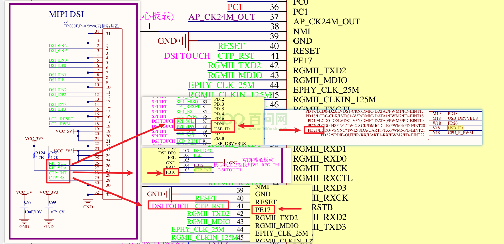

# MIPI屏适配

本章节主要介绍如何在T113-i开发板中适配4寸MIPI屏，[MIPI屏购买地址](https://detail.tmall.com/item.htm?spm=a1z10.5-b-s.w4011-23041403056.21.3ced6794vsHBY0&id=732427203033&rn=171cc12ced4df871c4ce3983596aef13&abbucket=1)

下面操作步骤需要相对应的uboot屏驱动、kernel屏驱动。这里有相应的下载链接 ==> [资源包](https://forums.100ask.net/uploads/short-url/hb8CVlNtxiORhdm5fd298PnPhrB.zip)

## 1.显示部分适配

### 1.1 配置内核屏驱动

在Ubuntu上，进入目录`t113i_tinasdk5.0-v1/kernel/linux-5.4/drivers/video/fbdev/sunxi/disp2/disp/lcd/`

需要使用上面资源包`kerneldriver`文件夹里面的`tft08006.c`和`tft08006.h`，替换掉当前目录下的`tft08006.c`和`tft08006.h`

还需要修改`tft08006.c`，执行`vim tft08006.c `，点击键盘上的大写`G`，跳到文件的最后，对比原来的`tft08006.c`文件，如下：

把`ili9806e`改为`tft08006`，当然也可以不改，只要设备树上的名字和这里的对应就可以。这里选择修改。

按`esc`，然后`:wq`退出保存。

回到SDK源码根目录`t113i_tinasdk5.0-v1/`，执行`./build.sh menuconfig`进入内核配置界面。

找到` Device Drivers`，进入。

找到`Graphics support`，进入。

找到`Frame buffer Devices`，进入。

找到`Video support for sunxi`，进入。

找到` LCD panels select`，进入。

找到`LCD support TFT08006 panel`，点击键盘`y`，选上。

保存退出。

回到SDK源码根目录`t113i_tinasdk5.0-v1/`，执行`./build.sh kernel`，单独编译内核。

~~~bash
ubuntu@dshanpi:~/meihao/t113i_tinasdk5.0-v1$ ./build.sh kernel
========ACTION List: build_kernel ;========
options :
INFO: build kernel ...
INFO: prepare_buildserver
INFO: Prepare toolchain ...
Building kernel
...
Copy boot.img to output directory ...

sun8iw20p1 compile all(Kernel+modules+boot.img) successful

INFO: build dts ...
INFO: Prepare toolchain ...
removed '/home/ubuntu/meihao/t113i_tinasdk5.0-v1/out/t113_i/evb1_auto/buildroot/.board.dtb.d.dtc.tmp'
removed '/home/ubuntu/meihao/t113i_tinasdk5.0-v1/out/t113_i/evb1_auto/buildroot/.board.dtb.dts.tmp'
'/home/ubuntu/meihao/t113i_tinasdk5.0-v1/out/t113_i/kernel/build/arch/arm/boot/dts/.board.dtb.d.dtc.tmp' -> '/home/ubuntu/meihao/t113i_tinasdk5.0-v1/out/t113_i/evb1_auto/buildroot/.board.dtb.d.dtc.tmp'
'/home/ubuntu/meihao/t113i_tinasdk5.0-v1/out/t113_i/kernel/build/arch/arm/boot/dts/.board.dtb.dts.tmp' -> '/home/ubuntu/meihao/t113i_tinasdk5.0-v1/out/t113_i/evb1_auto/buildroot/.board.dtb.dts.tmp'
'/home/ubuntu/meihao/t113i_tinasdk5.0-v1/out/t113_i/kernel/staging/sunxi.dtb' -> '/home/ubuntu/meihao/t113i_tinasdk5.0-v1/out/t113_i/evb1_auto/buildroot/sunxi.dtb'
ubuntu@dshanpi:~/meihao/t113i_tinasdk5.0-v1$
~~~

这样内核里就支持了MIPI屏幕的驱动，想要该MIPI屏幕的驱动程序工作，还需要在设备树上添加相应的设备树节点。

### 1.2 修改内核设备树

进入目录`t113i_tinasdk5.0-v1/device/config/chips/t113_i/configs/evb1_auto/linux-5.4`。

可以看到目录下有一个`board.dts`设备树文件。

输入`vim board.dts`

在普通模式下执行`/lcd0`，找到原本已存在的lcd0设备树节点，复制以下内容，在附近点击键盘`p`粘贴，：

~~~bash
&lcd0 {
        lcd_used            = <1>;

        lcd_driver_name     = "tft08006";
        lcd_backlight       = <100>;
        lcd_if              = <4>;

        lcd_x               = <480>;
        lcd_y               = <800>;
        lcd_width           = <52>;
        lcd_height          = <52>;
        lcd_dclk_freq       = <25>;

        lcd_pwm_used        = <1>;
        lcd_pwm_ch          = <2>;
        lcd_pwm_freq        = <1000>;
        lcd_pwm_pol         = <0>;
        lcd_pwm_max_limit   = <255>;

        lcd_hbp             = <10>;
        lcd_ht              = <515>;
        lcd_hspw            = <5>;
        lcd_vbp             = <20>;
        lcd_vt              = <830>;
        lcd_vspw            = <5>;

        lcd_dsi_if          = <0>;
        lcd_dsi_lane        = <2>;
        lcd_lvds_if         = <0>;
        lcd_lvds_colordepth = <0>;
        lcd_lvds_mode       = <0>;
        lcd_frm             = <0>;
        lcd_hv_clk_phase    = <0>;
        lcd_hv_sync_polarity= <0>;
        lcd_io_phase        = <0x0000>;
        lcd_gamma_en        = <0>;
        lcd_bright_curve_en = <0>;
        lcd_cmap_en         = <0>;
        lcd_fsync_en        = <0>;
        lcd_fsync_act_time  = <1000>;
        lcd_fsync_dis_time  = <1000>;
        lcd_fsync_pol       = <0>;

        deu_mode            = <0>;
        lcdgamma4iep        = <22>;
        smart_color         = <90>;

        lcd_gpio_0 =  <&pio PD 19 GPIO_ACTIVE_HIGH>;
        pinctrl-0 = <&dsi4lane_pins_a>;
        pinctrl-1 = <&dsi4lane_pins_b>;
};
~~~

原本的设备树文件中，还有lcd0设备树节点存在，需要**把多余的lcd0设备树节点注释或者删除**。

通过查看原理图：

MIPI屏的pwm引脚是PB11，需要确保PB11引脚没有被其他设备树节点使用。

在设备树里可以看到，usbc0设备树节点占用了PB11引脚，而该设备树节点对应的是OTG的接口，不过只作为usb device使用，所以只需要把`usb_id_gpio`和`usb_det_vbus_gpio`注释或者删除即可。

这里选择删除。

继续查看原理图：

MIPI屏的reset引脚是PD19，需要确保PD19引脚没有被其他设备树节点使用。

在设备树里可以看到，被`reg_usb1_vbus`占用了PD19，选择注释。

执行`:wq`，退出保存。

### 1.3 配置uboot屏驱动

想要开机进入系统后，屏幕能直接支持显示，不用执行重置屏幕操作，就需要在uboot阶段添加相应的屏驱动，这样也能在uboot阶段显示LOGO图。

在Ubuntu上，进入目录`t113i_tinasdk5.0-v1/brandy/brandy-2.0/u-boot-2018/drivers/video/sunxi/disp2/disp/lcd`

需要使用上面资源包`ubootdriver`文件夹里面的`tft08006.c`和`tft08006.h`，替换掉当前目录下的`tft08006.c`和`tft08006.h`

还需要修改`tft08006.c`，执行`vim tft08006.c `，点击键盘上的大写`G`，跳到文件的最后，对比原来的`tft08006.c`文件，如下：

把`ili9806e`改为`tft08006`，当然也可以不改，只要设备树上的名字和这里的对应就可以。这里选择修改。

按`esc`，然后`:wq`退出保存。

执行`cboot`，进入uboot源码目录`t113i_tinasdk5.0-v1/brandy/brandy-2.0/u-boot-2018`。

输入`make menuconfig`，进入uboot配置界面。

找到` Device Drivers`，进入。

找到`Graphics support`，进入。

找到` LCD panels select`，进入。

找到`LCD support TFT08006 panel`，点击键盘`y`，选上。

保存退出。

在当前目录上`t113i_tinasdk5.0-v1/brandy/brandy-2.0/u-boot-2018`，执行`mboot`编译uboot源码

~~~bash
ubuntu@dshanpi:~/meihao/t113i_tinasdk5.0-v1/brandy/brandy-2.0/u-boot-2018$ mboot
========ACTION List: build_bootloader all force;========
options :
find: '/home/ubuntu/meihao/t113i_tinasdk5.0-v1/brandy/brandy-2.0/spl': No such file or directory
find: '/home/ubuntu/meihao/t113i_tinasdk5.0-v1/brandy/dramlib': No such file or directory
INFO: build_bootloader: brandy_path=/home/ubuntu/meihao/t113i_tinasdk5.0-v1/brandy/brandy-2.0
INFO: uboot-board.dts updated.
build_option:-p sun8iw20p1_auto_t113_i -b t113_i -o all
grep: /home/ubuntu/meihao/t113i_tinasdk5.0-v1/brandy/brandy-2.0/spl/Makefile: No such file or directory
Prepare toolchain ...
Prepare toolchain ...
uboot version:u-boot-2018
build for sun8iw20p1_auto_t113_i_defconfig ...
...
bootaddr is 0x20480
/home/ubuntu/meihao/t113i_tinasdk5.0-v1/brandy/brandy-2.0/spl-pub/../tools/toolchain/gcc-linaro-7.2.1-2017.11-x86_64_arm-linux-gnueabi/bin/arm-linux-gnueabi-ld /home/ubuntu/meihao/t113i_tinasdk5.0-v1/brandy/brandy-2.0/spl-pub/board/t113_i/libsun8iw20p1_sboot.a /home/ubuntu/meihao/t113i_tinasdk5.0-v1/brandy/brandy-2.0/spl-pub/sboot/main/sboot_main.o  -L /home/ubuntu/meihao/t113i_tinasdk5.0-v1/brandy/brandy-2.0/tools/toolchain/gcc-linaro-7.2.1-2017.11-x86_64_arm-linux-gnueabi/bin/../lib/gcc/arm-linux-gnueabi/7.2.1 -lgcc  --gc-sections --gc-sections -Tsboot.lds -o sboot.elf -Map sboot.map
/home/ubuntu/meihao/t113i_tinasdk5.0-v1/brandy/brandy-2.0/spl-pub/../tools/toolchain/gcc-linaro-7.2.1-2017.11-x86_64_arm-linux-gnueabi/bin/arm-linux-gnueabi-objcopy  -O binary  sboot.elf sboot.bin
'sboot_sun8iw20p1.bin' -> '/home/ubuntu/meihao/t113i_tinasdk5.0-v1/brandy/brandy-2.0/spl-pub/out/sun8iw20p1/bin/sboot_sun8iw20p1.bin'
'sboot_sun8iw20p1.bin' -> '/home/ubuntu/meihao/t113i_tinasdk5.0-v1/device/config/chips/t113_i/bin/sboot_sun8iw20p1.bin'
'sboot_sun8iw20p1.bin' -> '/home/ubuntu/meihao/t113i_tinasdk5.0-v1/out/t113_i/evb1_auto/buildroot/sboot_sun8iw20p1.bin'
INFO: build brandy OK.
ubuntu@dshanpi:~/meihao/t113i_tinasdk5.0-v1/brandy/brandy-2.0/u-boot-2018$
~~~

### 1.4 修改uboot设备树

同样的，uboot的设备树也需要添加相应的设备树节点。

进入目录`t113i_tinasdk5.0-v1/device/config/chips/t113_i/configs/evb1_auto`

可以看到当前目录有一个`uboot-board.dts`设备树文件。

输入`vim uboot-board.dts `

在普通模式下执行`/lcd0`，找到原本已存在的lcd0设备树节点，复制以下内容，在附近点击键盘`p`粘贴，：

~~~bash
&lcd0 {
        lcd_used            = <1>;

        lcd_driver_name     = "tft08006";
        lcd_backlight       = <100>;
        lcd_if              = <4>;

        lcd_x               = <480>;
        lcd_y               = <800>;
        lcd_width           = <52>;
        lcd_height          = <52>;
        lcd_dclk_freq       = <25>;

        lcd_pwm_used        = <1>;
        lcd_pwm_ch          = <2>;
        lcd_pwm_freq        = <1000>;
        lcd_pwm_pol         = <0>;
        lcd_pwm_max_limit   = <255>;

        lcd_hbp             = <10>;
        lcd_ht              = <515>;
        lcd_hspw            = <5>;
        lcd_vbp             = <20>;
        lcd_vt              = <830>;
        lcd_vspw            = <5>;

        lcd_dsi_if          = <0>;
        lcd_dsi_lane        = <2>;
        lcd_lvds_if         = <0>;
        lcd_lvds_colordepth = <0>;
        lcd_lvds_mode       = <0>;
        lcd_frm             = <0>;
        lcd_hv_clk_phase    = <0>;
        lcd_hv_sync_polarity= <0>;
        lcd_io_phase        = <0x0000>;
        lcd_gamma_en        = <0>;
        lcd_bright_curve_en = <0>;
        lcd_cmap_en         = <0>;
        lcd_fsync_en        = <0>;
        lcd_fsync_act_time  = <1000>;
        lcd_fsync_dis_time  = <1000>;
        lcd_fsync_pol       = <0>;

        deu_mode            = <0>;
        lcdgamma4iep        = <22>;
        smart_color         = <90>;

        lcd_gpio_0 =  <&pio PD 19 GPIO_ACTIVE_HIGH>;
        pinctrl-0 = <&dsi4lane_pins_a>;
        pinctrl-1 = <&dsi4lane_pins_b>;
};
~~~

执行`:wq`，退出保存。

### 1.5 添加LOGO图

MIPI的分辨率大小是480*800，所以需要准备一张类似大小的logo图。

制作一张分辨率为480*800大小的logo图，保存格式是`.bmp`格式，并且命名为`bootlogo`

制作好图片后，把图片拉取到目录`t113i_tinasdk5.0-v1/device/config/chips/t113_i/boot-resource/boot-resource`下。

还需要确保`t113i_tinasdk5.0-v1/brandy/brandy-2.0/u-boot-2018/configs/sun8iw20p1_auto_t113_i_defconfig`文件中，以下选项是否打开：

~~~bash
CONFIG_CMD_SUNXI_BMP=y
CONFIG_LZMA=y
CONFIG_DISP2_SUNXI=y
CONFIG_AW_PHY=y
CONFIG_BOOT_GUI=y
~~~

进入SDK源码目录`t113i_tinasdk5.0-v1/`，输入`./build.sh`，编译固件。

~~~bash
ubuntu@dshanpi:~/meihao/t113i_tinasdk5.0-v1$ ./build.sh
========ACTION List: build_linuxdev;========
options :
INFO: ----------------------------------------
INFO: build linuxdev ...
INFO: chip: sun8iw20p1
INFO: platform: linux
INFO: kernel: linux-5.4
INFO: board: evb1_auto
INFO: output: /home/ubuntu/meihao/t113i_tinasdk5.0-v1/out/t113_i/evb1_auto/buildroot
INFO: ----------------------------------------
INFO: don't build dtbo ...
INFO: build arisc
find: '/home/ubuntu/meihao/t113i_tinasdk5.0-v1/brandy/brandy-2.0/spl': No such file or directory
find: '/home/ubuntu/meihao/t113i_tinasdk5.0-v1/brandy/dramlib': No such file or directory
INFO: build_bootloader: brandy_path=/home/ubuntu/meihao/t113i_tinasdk5.0-v1/brandy/brandy-2.0
INFO: skip build brandy.
INFO: build kernel ...
INFO: prepare_buildserver
INFO: Prepare toolchain ...
Building kernel
...
Number of duplicate files found 37
Number of inodes 6686
Number of files 5571
Number of fragments 397
Number of symbolic links  813
Number of device nodes 0
Number of fifo nodes 0
Number of socket nodes 0
Number of directories 302
Number of ids (unique uids + gids) 1
Number of uids 1
        root (0)
Number of gids 1
        root (0)
INFO: pack rootfs ok ...
INFO: ----------------------------------------
INFO: build Tina OK.
INFO: ----------------------------------------
ubuntu@dshanpi:~/meihao/t113i_tinasdk5.0-v1$
~~~

编译完成后，进行打包`./build.sh pack`，最后根据之前的烧录方式烧录到开发板。

如果进入内核阶段没有logo图显示，可以执行重置屏幕操作：

~~~bash
mount -t debugfs none /sys/kernel/debug
cd /sys/kernel/debug/dispdbg
echo suspend> command
echo disp0 > name
echo 1 > start

echo resume > command
echo disp0 > name
echo 1 > start

echo 8 > /sys/class/disp/disp/attr/colorbar
~~~

## 2.触摸部分适配

### 2.1 修改内核设备树

查看原理图：

由原理图可以看出：

**RPI_SCL  对应的引脚是 PD20;**

**RPI_SDA 对应的引脚是 PD21;**

**CTP_INT 对应的引脚是 PB10;**

**CTP_RST 对应的引脚是 PE17;**

在Ubuntu上，进入目录`t113i_tinasdk5.0-v1/device/config/chips/t113_i/configs/evb1_auto/linux-5.4`

可以看到目录下有一个`board.dts`设备树文件。

输入`vim board.dts`

PD20 和 PD21 对应的是IIC适配器2。修改`twi2_pins_a`和`twi2_pins_b`里面的引脚为PD20 、PD21。

在`twi2`设备树节点内添加触摸设备树节点，写入以下内容：

~~~bash
ctp@38 {
    compatible = "focaltech,fts";
    reg = <0x38>;
    status = "okay";
    interrupt-parent = <&pio>;
    interrupts = <PB 10 IRQ_TYPE_LEVEL_LOW>;
    focaltech,reset-gpio = <&pio PE 17 GPIO_ACTIVE_HIGH>;
    focaltech,irq-gpio = <&pio PB 10 IRQ_TYPE_LEVEL_LOW>;
    focaltech,max-touch-number = <5>;
    //focaltech,display-coords = <0 0 800 480>;
    focaltech,display-coords = <0 0 480 800>;
    //focaltech,reg_vdd = <0x0000001f>;
    //focaltech,reg_avdd = <0x0000001f>;
    focaltech,reg_vdd = <&reg_3v3>;
    focaltech,reg_avdd = <&reg_3v3>;
};
~~~

CTP_INT 对应的引脚是 PB10；CTP_RST 对应的引脚是 PE17。

执行`:wq`，退出保存。

### 2.2 修改触摸驱动

> 在测试过程中，发现触摸点（x,y）不对，需要修改驱动程序。

进入目录`t113i_tinasdk5.0-v1/kernel/linux-5.4/drivers/input/touchscreen/focaltech_touch`

执行`vim focaltech_core.c`，修改文件`focaltech_core.c`

两处修改：

- 在`fts_input_dev_report_a`函数中修改，找到相应的位置：

  ~~~bash
  #原来的
  input_report_abs(data->input_dev, ABS_MT_POSITION_X, event->au16_x[i]);
  input_report_abs(data->input_dev, ABS_MT_POSITION_Y, event->au16_y[i]);
  
  #修改的
  input_report_abs(data->input_dev, ABS_MT_POSITION_X, -(event->au16_x[i] - 480));
  input_report_abs(data->input_dev, ABS_MT_POSITION_Y, -(event->au16_y[i] - 800));
  ~~~

- 在`fts_input_dev_report_b`函数中修改，找到相应的位置：

  ~~~bash
  #原来的
  input_report_abs(data->input_dev, ABS_MT_POSITION_X, event->au16_x[i]);
  input_report_abs(data->input_dev, ABS_MT_POSITION_Y, event->au16_y[i]);
  
  #修改的
  input_report_abs(data->input_dev, ABS_MT_POSITION_X, -(event->au16_x[i] - 480));
  input_report_abs(data->input_dev, ABS_MT_POSITION_Y, -(event->au16_y[i] - 800));
  ~~~

### 2.3 添加触摸驱动

回到SDK源码根目录`t113i_tinasdk5.0-v1/`，输入`./build.sh menuconfig`，进入内核配置界面

找到` Device Drivers`，进入。

找到`Input device support`，进入。

找到`Touchscreens`，进入。

找到`Focaltech Touchscreen`，点击键盘`y`，选上。

保存退出。

执行`./build.sh kernel`编译内核，再输入`./build.sh`，最后打包`./build.sh pack`。

~~~bash
ubuntu@dshanpi:~/meihao/t113i_tinasdk5.0-v1$ ./build.sh pack
...
/home/ubuntu/meihao/t113i_tinasdk5.0-v1/tools/pack/pctools/linux/eDragonEx/
/home/ubuntu/meihao/t113i_tinasdk5.0-v1/out/t113_i/evb1_auto/pack_out
Begin Parse sys_partion.fex
Add partion boot-resource.fex BOOT-RESOURCE_FEX
Add partion very boot-resource.fex BOOT-RESOURCE_FEX
FilePath: boot-resource.fex
FileLength=dad400Add partion env.fex ENV_FEX000000000
Add partion very env.fex ENV_FEX000000000
FilePath: env.fex
FileLength=20000Add partion env.fex ENV_FEX000000000
Add partion very env.fex ENV_FEX000000000
FilePath: env.fex
FileLength=20000Add partion boot.fex BOOT_FEX00000000
Add partion very boot.fex BOOT_FEX00000000
FilePath: boot.fex
FileLength=920800Add partion rootfs.fex ROOTFS_FEX000000
Add partion very rootfs.fex ROOTFS_FEX000000
FilePath: rootfs.fex
FileLength=b20d850Add partion amp_rv0.fex AMP_RV0_FEX00000
Add partion very amp_rv0.fex AMP_RV0_FEX00000
FilePath: amp_rv0.fex
FileLength=29eb8BuildImg 0
Dragon execute image.cfg SUCCESS !
----------image is at----------

265M    /home/ubuntu/meihao/t113i_tinasdk5.0-v1/out/t113_i_linux_evb1_auto_uart0.img

pack finish
ubuntu@dshanpi:~/meihao/t113i_tinasdk5.0-v1$ 
~~~

最后根据之前的烧录方式烧录到开发板。

烧录完成后，在开发板上，输入`cat /proc/bus/input/devices`

~~~bash
# cat /proc/bus/input/devices
I: Bus=0019 Vendor=0001 Product=0001 Version=0100
N: Name="sunxi-keyboard"
P: Phys=sunxikbd/input0
S: Sysfs=/devices/virtual/input/input0
U: Uniq=
H: Handlers=kbd event0
B: PROP=0
B: EV=3
B: KEY=1000 800 c0000 0 0 10000000

I: Bus=0019 Vendor=0001 Product=0001 Version=0100
N: Name="sunxi-ts"
P: Phys=sunxi_ts/input0
S: Sysfs=/devices/platform/soc@3000000/2009c00.rtp/input/input1
U: Uniq=
H: Handlers=event1
B: PROP=0
B: EV=b
B: KEY=400 0 0 0 0 0 0 0 0 0 0
B: ABS=3

I: Bus=0019 Vendor=0001 Product=0001 Version=0100
N: Name="sunxi-gpadc0"
P: Phys=sunxigpadc0/input0
S: Sysfs=/devices/virtual/input/input2
U: Uniq=
H: Handlers=kbd event2
B: PROP=0
B: EV=100003
B: KEY=200000 0 0 0 0 0 0 0 8c0000 0 0 10000000

I: Bus=0018 Vendor=0000 Product=0000 Version=0000
N: Name="fts_ts"
P: Phys=
S: Sysfs=/devices/platform/soc@3000000/2502800.twi/i2c-2/2-0038/input/input3
U: Uniq=
H: Handlers=event3
B: PROP=2
B: EV=b
B: KEY=400 0 0 0 0 0 0 0 0 0 0
B: ABS=6618000 0

#
~~~

可以看到`/dev/input/event3`对应的是MIPI屏上的触摸设备节点。

执行`hexdump /dev/input/event3`，用手指在MIPI屏点击几下，会有如下信息出现：

~~~bash
# hexdump /dev/input/event3
0000000 5896 0000 f76d 0003 0003 0039 0006 0000
0000010 5896 0000 f76d 0003 0003 003a 007f 0000
0000020 5896 0000 f76d 0003 0003 0030 0004 0000
0000030 5896 0000 f76d 0003 0003 0035 0143 0000
0000040 5896 0000 f76d 0003 0003 0036 0246 0000
0000050 5896 0000 f76d 0003 0001 014a 0001 0000
0000060 5896 0000 f76d 0003 0000 0000 0000 0000
0000070 5896 0000 1ff9 0004 0003 0039 ffff ffff
0000080 5896 0000 1ff9 0004 0001 014a 0000 0000
0000090 5896 0000 1ff9 0004 0000 0000 0000 0000

~~~

