# XR829模组适配

本章节将讲解如何在 TinaSDK5 适配 xr829 模组，并生成镜像。

## 获取环境变量

在ubuntu上，新建一个终端，进入TinaSDK5根目录，执行以下指令：

~~~bash
source build/envsetup.sh
~~~

其中：

- source build/envsetup.sh ：获取环境变量。

~~~bash
ubuntu@ubuntu1804:~/T113-i/tina5sdk-bsp$ source build/envsetup.sh 
NOTE: The SDK(/home/ubuntu/T113-i/tina5sdk-bsp) was successfully loaded
load openwrt... ok
Please run lunch next for openwrt.
load buildroot,bsp...ok
Invoke . build/quick.sh from your shell to add the following functions to your environment:
    croot                          - Changes directory to the top of the tree
    cbsp                           - Changes directory to the bsp
    cbsptest                       - Changes directory to the bsptest
    ckernel                        - Changes directory to the kernel
    cbrandy                        - Changes directory to the brandy
    cboot                          - Changes directory to the uboot
    cbr                            - Changes directory to the buildroot
    cchips                         - Changes directory to the board
    cconfigs                       - Changes directory to the board's config
    cbin                           - Changes directory to the board's bin
    cdts                           - Changes directory to the kernel's dts
    ckernelout                     - Changes directory to the kernel output
    cout                           - Changes directory to the product's output
    copenssl                       - Changes directory to the product's openssl-1.0.0
Usage: build.sh [args]
    build.sh                       - default build all
    build.sh bootloader            - only build bootloader
    build.sh kernel                - only build kernel
    build.sh buildroot_rootfs      - only build buildroot
    build.sh menuconfig            - edit kernel menuconfig
    build.sh saveconfig            - save kernel menuconfig
    build.sh recovery_menuconfig   - edit recovery menuconfig
    build.sh recovery_saveconfig   - save recovery menuconfig
    build.sh buildroot_menuconfig  - edit buildroot menuconfig
    build.sh buildroot_saveconfig  - save buildroot menuconfig
    build.sh clean                 - clean all
    build.sh distclean             - distclean all
    build.sh pack                  - pack firmware
    build.sh pack_debug            - pack firmware with debug info output to card0
    build.sh pack_secure           - pack firmware with secureboot
Usage: pack [args]
    pack                           - pack firmware
    pack -d                        - pack firmware with debug info output to card0
    pack -s                        - pack firmware with secureboot
    pack -sd                       - pack firmware with secureboot and debug info output to card0
ubuntu@ubuntu1804:~/T113-i/tina5sdk-bsp$
~~~

这样，就可以使用相应的指令来配置xr829模组。

## 内核设备树修改

**查看原理图**

对于wifi功能需要查看的引脚：

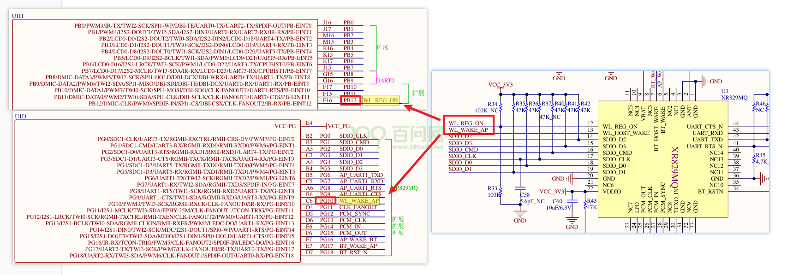

由图可知，

`WL_REG_ON`   对应的引脚是 ==> `PB12`

`WL_WAKE_AP` 对应的引脚是 ==> `PG10`

对于蓝牙功能需要查看的引脚：

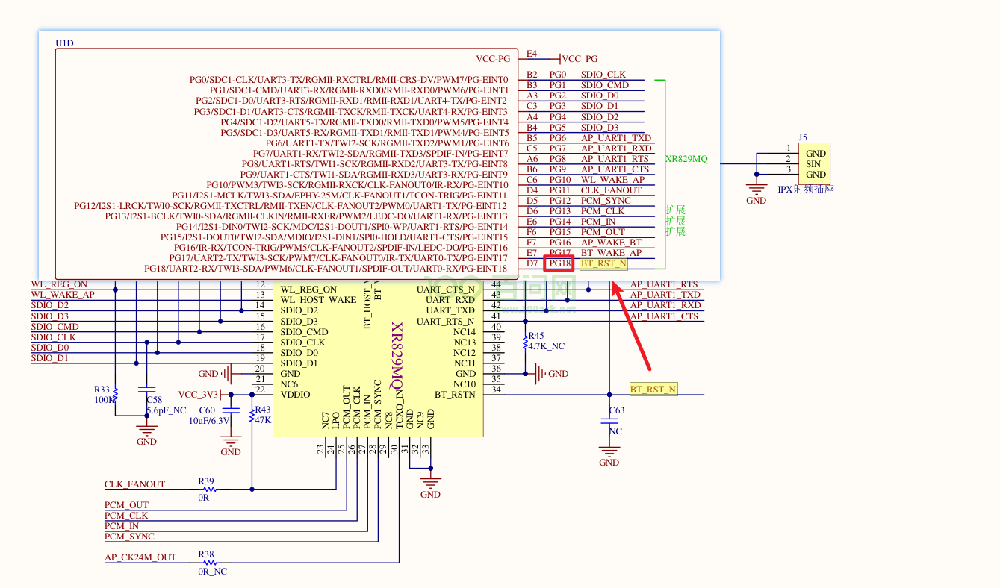

由图可知，

`BT_RST_N` 对应的引脚是 ==> `PG18`

**修改内核设备树**

在TinaSDK源码中，进入目录`/device/config/chips/t113_i/configs/evb1_auto/linux-5.4`

修改目录下的内核设备树文件`board.dts`

~~~bash
vim board.dts
~~~

对于wifi设备树节点修改对应的引脚：

在普通模式下，键盘输入`/wlan`，找到wlan设备树节点，点击键盘上的`i`键，进入编辑模式，修改如下：

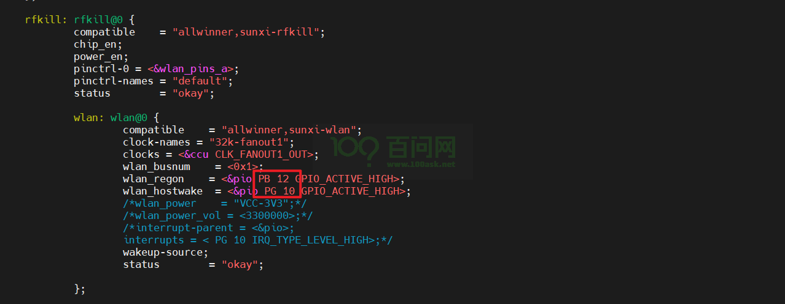

对于蓝牙设备树节点修改对应的引脚：

点击键盘的`esc`键进入普通模式，输入`/bt`，找到蓝牙设备树节点，点击键盘上的`i`键，进入编辑模式，修改如下：

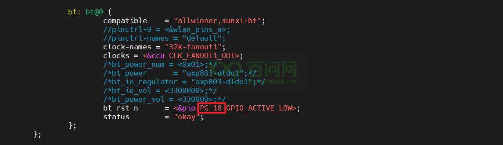

修改完成后，普通模式下，输入`:wq`，回车之后，即可保存退出。

## 内核配置选择

进入TinaSDK源码目录，

执行`./build.sh menuconfig`进入内核配置界面。

找到`Device Drivers`，回车进入。

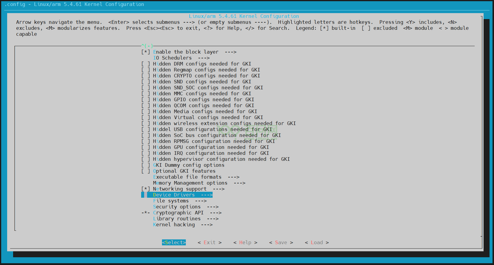

找到` Network device support`，回车进入。

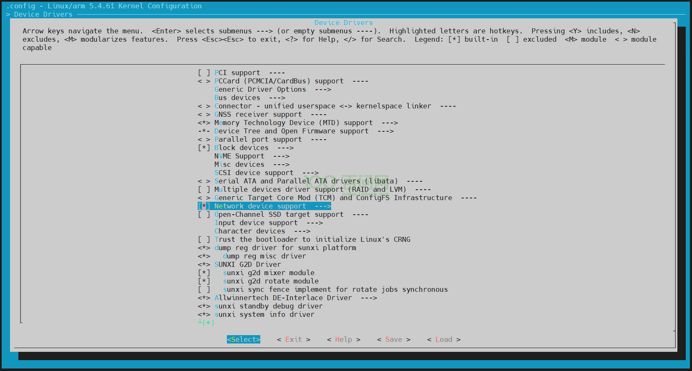

找到` Wireless LAN`，回车进入。

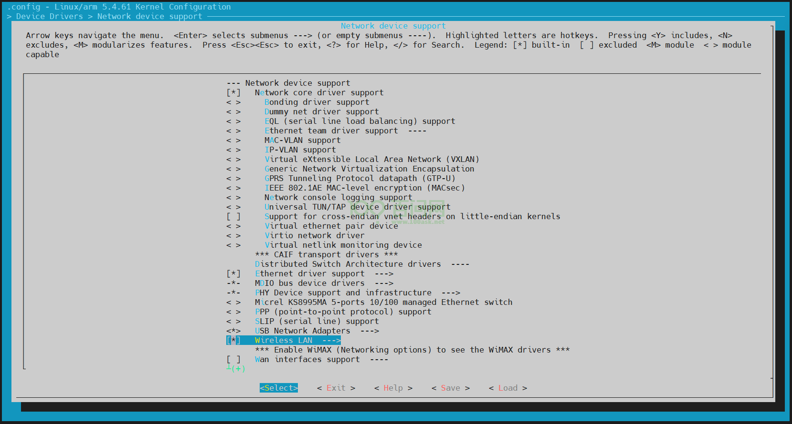

找到`XR829 WLAN support`，按住键盘`M`，选为编译成内核模块。

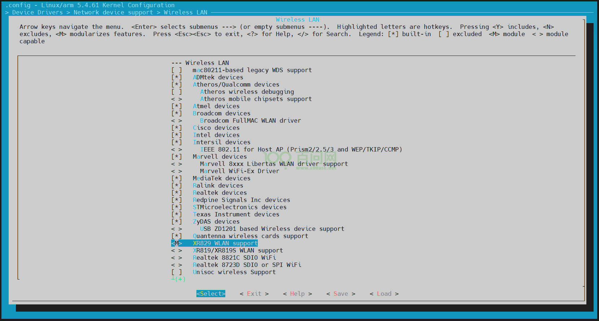

控制键盘上的方向键，选择`Save`，一路回车，保存完毕后，最后选择`Exit`，直到退出为止退出。

在TinaSDK源码目录下，执行`./build.sh kernel`

~~~bash
ubuntu@dshanpi:~/meihao/t113i_tinasdk5.0-v1$ ./build.sh kernel
========ACTION List: build_kernel ;========
options :
INFO: build kernel ...
INFO: prepare_buildserver
INFO: Prepare toolchain ...
Building kernel
...
Copy boot.img to output directory ...

sun8iw20p1 compile all(Kernel+modules+boot.img) successful

INFO: build dts ...
INFO: Prepare toolchain ...
removed '/home/ubuntu/meihao/t113i_tinasdk5.0-v1/out/t113_i/evb1_auto/buildroot/.board.dtb.d.dtc.tmp'
removed '/home/ubuntu/meihao/t113i_tinasdk5.0-v1/out/t113_i/evb1_auto/buildroot/.board.dtb.dts.tmp'
'/home/ubuntu/meihao/t113i_tinasdk5.0-v1/out/t113_i/kernel/build/arch/arm/boot/dts/.board.dtb.d.dtc.tmp' -> '/home/ubuntu/meihao/t113i_tinasdk5.0-v1/out/t113_i/evb1_auto/buildroot/.board.dtb.d.dtc.tmp'
'/home/ubuntu/meihao/t113i_tinasdk5.0-v1/out/t113_i/kernel/build/arch/arm/boot/dts/.board.dtb.dts.tmp' -> '/home/ubuntu/meihao/t113i_tinasdk5.0-v1/out/t113_i/evb1_auto/buildroot/.board.dtb.dts.tmp'
'/home/ubuntu/meihao/t113i_tinasdk5.0-v1/out/t113_i/kernel/staging/sunxi.dtb' -> '/home/ubuntu/meihao/t113i_tinasdk5.0-v1/out/t113_i/evb1_auto/buildroot/sunxi.dtb'
ubuntu@dshanpi:~/meihao/t113i_tinasdk5.0-v1$
~~~

## Tina配置选择

### 1.添加xr829固件

在TinaSDK源码目录下，执行`./build.sh buildroot_menuconfig`，进入Tina配置界面。

找到`Target packages`，回车进入。

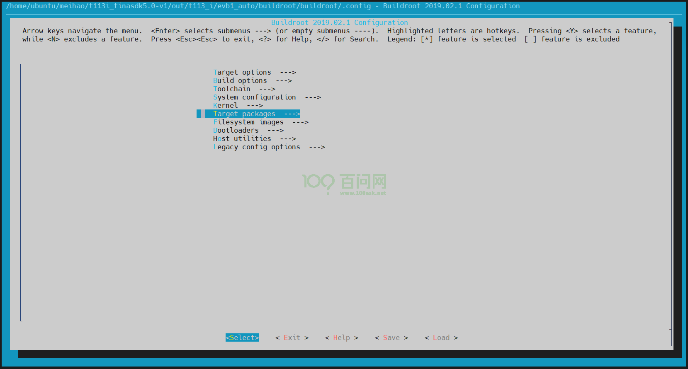

找到`allwinner platform private package select`，回车进入。

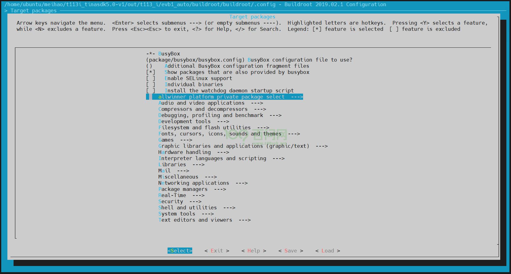

找到`wireless`，回车进入。

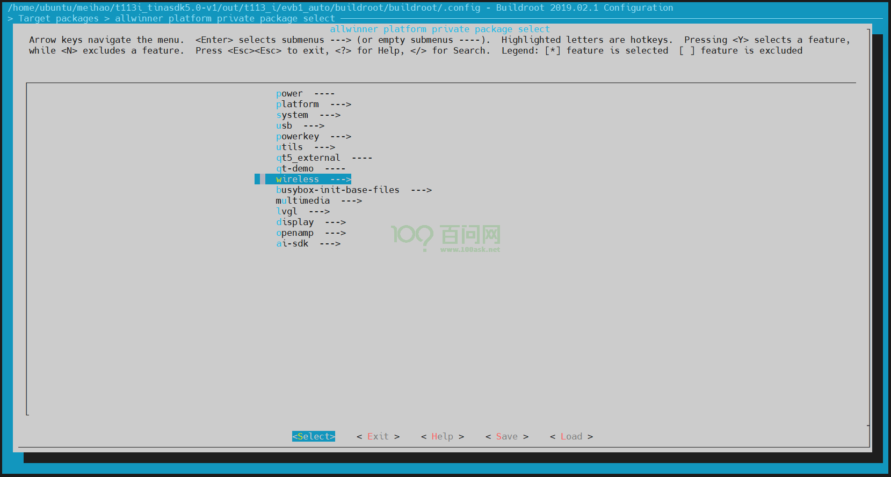

找到`firmware`，回车进入。

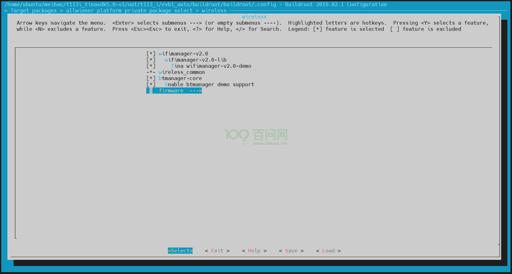

先点击键盘`y`，选择`xr829-firmware`，然后选择`xr829_24M`，因为板子上xr829芯片旁边用的晶振是24M的。

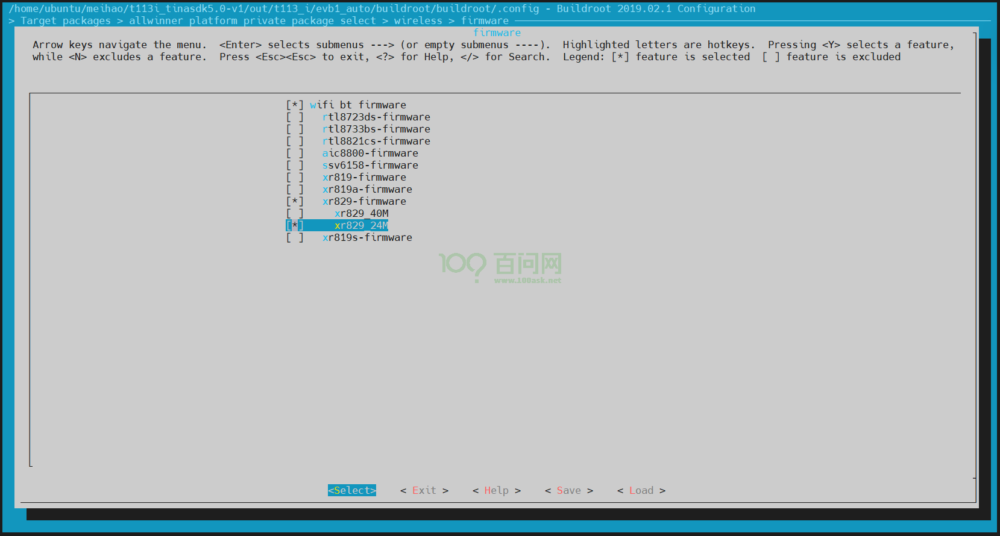

### 2.开启odhcp6c

odhcp6c的核心作用在于简化并自动化IPv6网络环境下的地址配置过程，确保设备能够顺利接入并通信。

接着上面的操作，退出到`Target packages`下，找到`Networking applications`，进入。

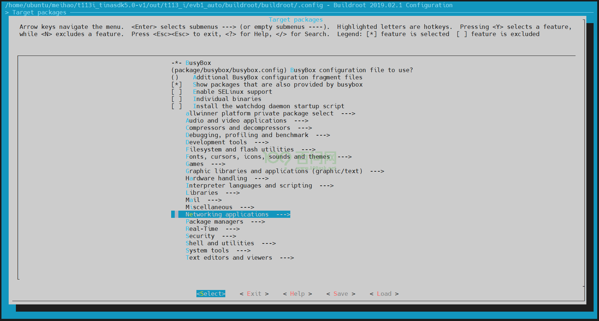

找到`odhcp6c`，点击键盘`y`，选上。

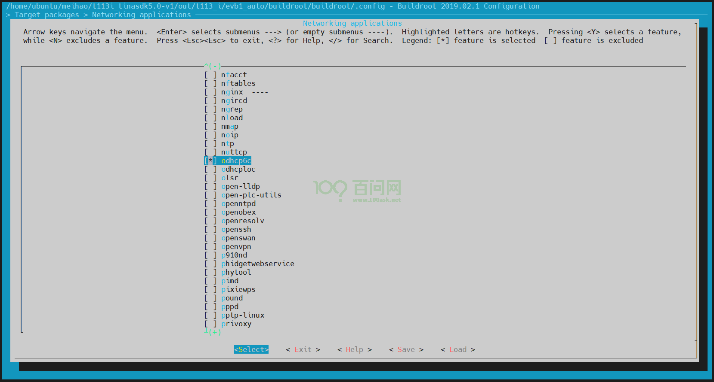

控制键盘的方向键，选择`Save`，一路回车，保存完毕后，最后选择`Exit`，直到退出为止。

## 编译打包更新

在TinaSDK源码目录下，执行`./build.sh`编译。

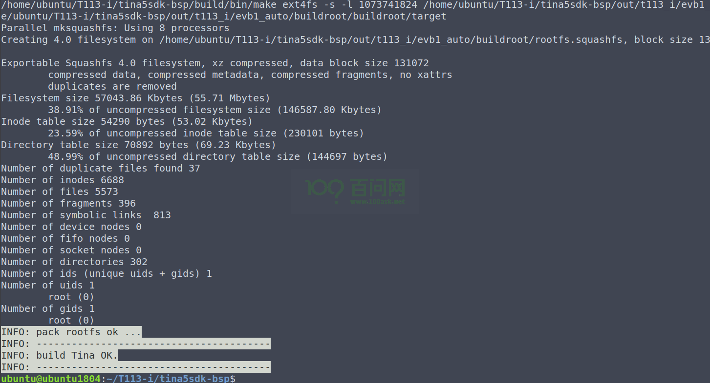

编译完成后，输入`./build.sh pack`

~~~bash
ubuntu@dshanpi:~/meihao/t113i_tinasdk5.0-v1$ ./build.sh pack
========ACTION List: mk_pack ;========
options :
INFO: packing firmware ...
INFO: /home/ubuntu/meihao/t113i_tinasdk5.0-v1/out/t113_i/common/keys
copying tools file
copying configs file
copying product configs file
linux copying boardt&linux_kernel_version configs file
...
update gpt file ok
update mbr file ok
/home/ubuntu/meihao/t113i_tinasdk5.0-v1/tools/pack/pctools/linux/eDragonEx/
/home/ubuntu/meihao/t113i_tinasdk5.0-v1/out/t113_i/evb1_auto/pack_out
Begin Parse sys_partion.fex
Add partion boot-resource.fex BOOT-RESOURCE_FEX
Add partion very boot-resource.fex BOOT-RESOURCE_FEX
FilePath: boot-resource.fex
FileLength=dad400Add partion env.fex ENV_FEX000000000
Add partion very env.fex ENV_FEX000000000
FilePath: env.fex
FileLength=20000Add partion env.fex ENV_FEX000000000
Add partion very env.fex ENV_FEX000000000
FilePath: env.fex
FileLength=20000Add partion boot.fex BOOT_FEX00000000
Add partion very boot.fex BOOT_FEX00000000
FilePath: boot.fex
FileLength=920800Add partion rootfs.fex ROOTFS_FEX000000
Add partion very rootfs.fex ROOTFS_FEX000000
FilePath: rootfs.fex
FileLength=b260880Add partion amp_rv0.fex AMP_RV0_FEX00000
Add partion very amp_rv0.fex AMP_RV0_FEX00000
FilePath: amp_rv0.fex
FileLength=29eb8BuildImg 0
Dragon execute image.cfg SUCCESS !
----------image is at----------

266M    /home/ubuntu/meihao/t113i_tinasdk5.0-v1/out/t113_i_linux_evb1_auto_uart0.img

pack finish
ubuntu@dshanpi:~/meihao/t113i_tinasdk5.0-v1$
~~~

打包完成后，根据前面`开发环境搭建`章节的烧写方式把镜像 `t113_i_linux_evb1_auto_uart0.img` 烧写到开发板上。