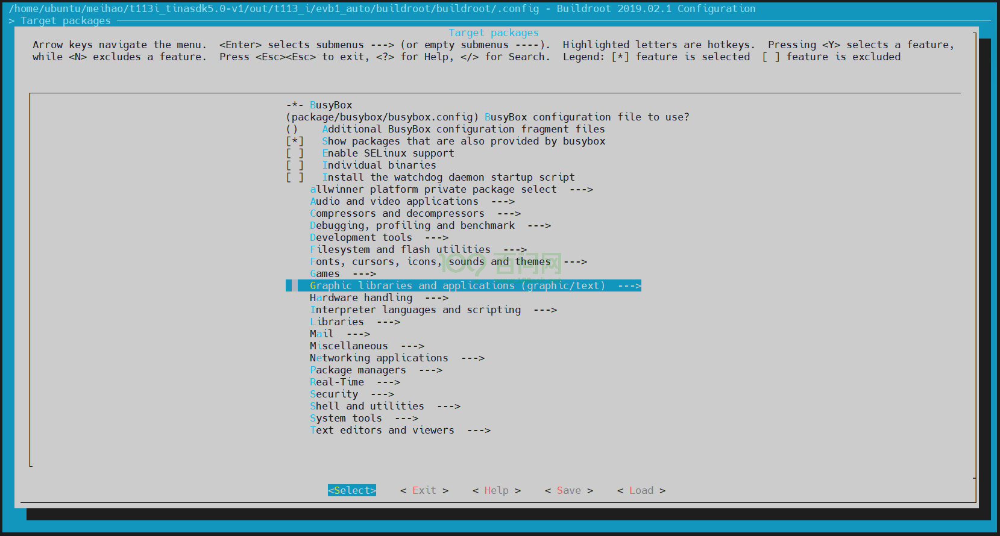
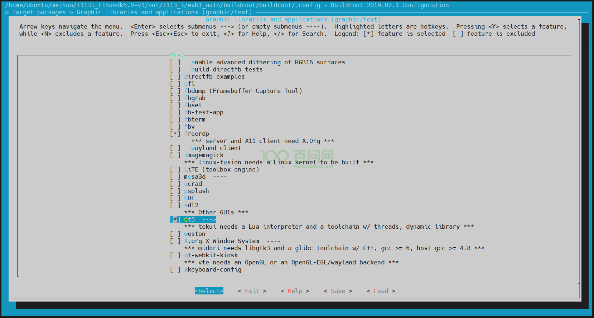
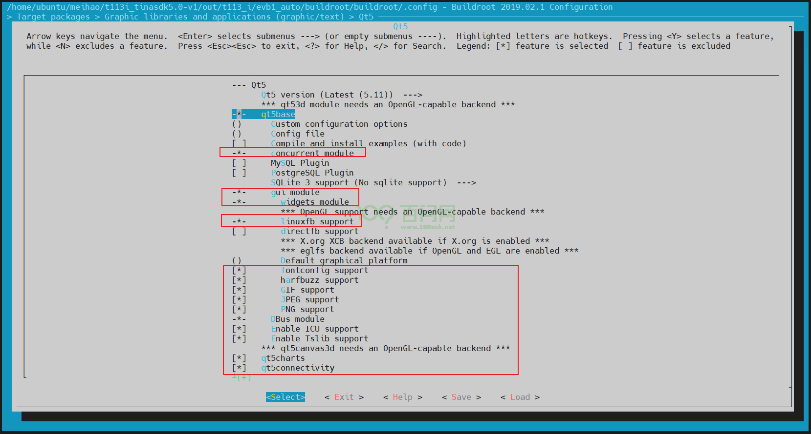
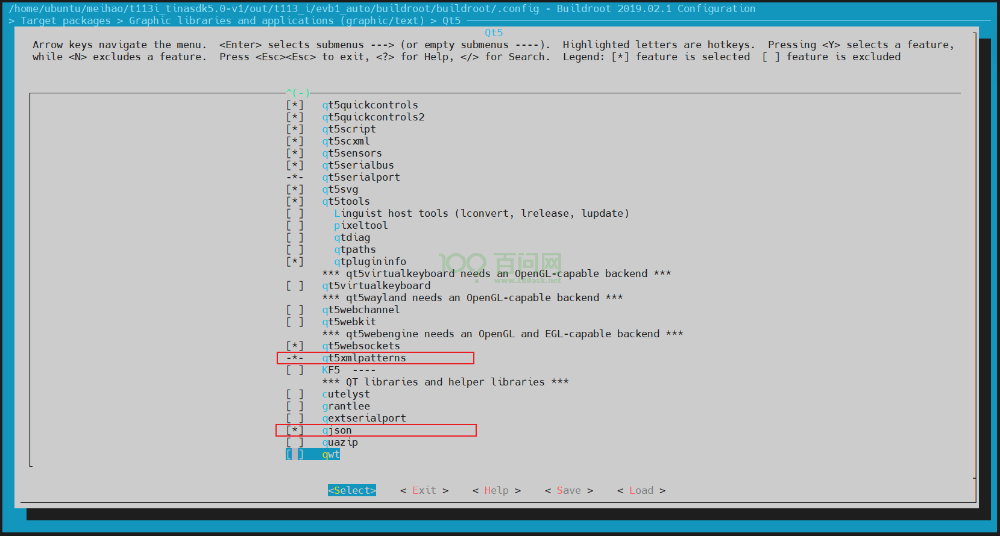
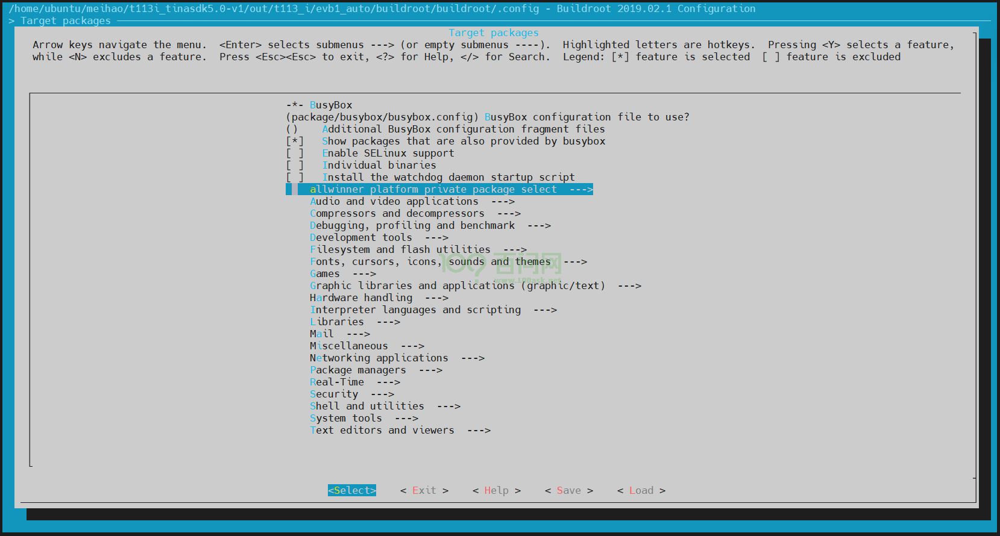
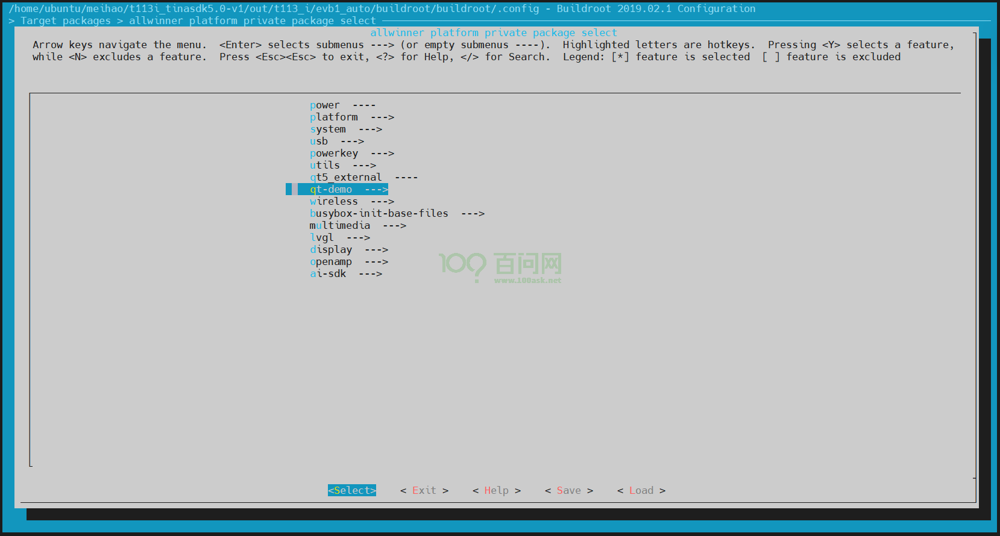
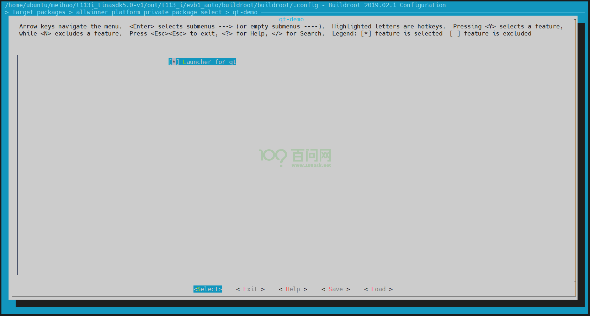
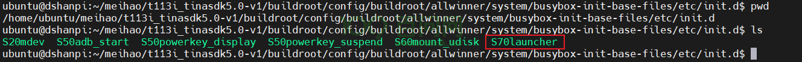
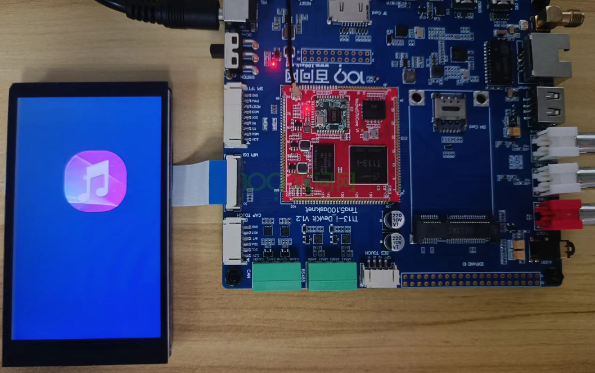

# QT适配

本章节将讲解如何在Tina5-SDK中编译QT动态库，并成功编译一个qtdemo。

## 搭建QT编译环境

前面已经搭建好了开发环境，如果未搭建，请参考 [更新系统固件](https://dshanpi.100ask.org/docs/T113i-Industrial/part3/DevelopmentEnvironmentSetup)

在ubuntu上，进入Tina5-SDK根目录`tina5sdk-bsp`，先执行` source build/envsetup.sh`，获取环境变量，再执行`./build.sh buildroot_menuconfig  `，进入buildroot配置界面。

找到`Target packages`，回车进入。

找到`Graphic libraries and applications`，回车进入。

找到`QT5`，点击键盘`y`键，并回车进入。

点击键盘`y`键，选上以下选项。

> 注意：先不要编译例程，因为目前交叉编译工具链中还没有相应的库文件，编译例程会出现错误。要把以上的库文件先编译。
>
> 如果前面误操作选上了例程，编译时会出现报错（即便把例程取消再编译），需要到`out/t113_i/evb1_auto/buildroot/buildroot/build`目录下，把相应的库文件和例程文件删除，再重新编译。

控制键盘方向键，找到`Save`，一路回车，保存，并找到`Exit`，一直退出Tina配置界面。

执行`./build.sh`，编译刚刚选上的库文件。编译完成后，才会有相对应的库，这样就可以去编译qt应用程序了。

## 编译QT应用程序

进入Tina5-SDK根目录`tina5sdk-bsp`，

执行`./build.sh buildroot_menuconfig`，进入buildroot配置界面。

找到`Target packages`，回车进入。

找到` allwinner platform private package select`，回车进入。

找到`qt_demo`，回车进入。

点击键盘`y`键，选上以下选项。

保存退出。

执行 `./build.sh` 编译程序。

SDK中已为qt-demo编写了一份开机自启动的脚本，脚本保存在`tina5sdk-bsp/buildroot/config/buildroot/allwinner/system/busybox-init-base-files/etc/init.d/S70launcher`

~~~bash
ubuntu@dshanpi:~/tina5sdk-bsp/buildroot/config/buildroot/allwinner/system/busybox-init-base-files/etc/init.d$ pwd
/home/ubuntu/tina5sdk-bsp/buildroot/config/buildroot/allwinner/system/busybox-init-base-files/etc/init.d
ubuntu@dshanpi:~/tina5sdk-bsp/buildroot/config/buildroot/allwinner/system/busybox-init-base-files/etc/init.d$ ls
S20mdev  S50adb_start  S50powerkey_display  S50powerkey_suspend  S60mount_udisk  S70launcher
ubuntu@dshanpi:~/tina5sdk-bsp/buildroot/config/buildroot/allwinner/system/busybox-init-base-files/etc/init.d$
~~~

可以在该脚本`S70launcher`中修改或者配置**显示设备节点**和**触摸设备节点**。

~~~bash
#!/bin/sh
#
# Start the launcher
#

case "$1" in
    start)
                if [ ! -f "/usr/bin/Launcher" ];then
                        exit 1
                fi

                if [ -d "/usr/local/Qt_5.12.5" ];then
                        export  QTDIR=/usr/local/Qt_5.12.5
                else
                        export  QTDIR=/usr/lib
                fi

                if [ -d $QTDIR ];then

                        export  QT_ROOT=$QTDIR
                        export  PATH=$QTDIR/bin:$PATH
                        export  LD_LIBRARY_PATH=$QTDIR/lib:/usr/lib/cedarx/:$LD_LIBRARY_PATH

                        export QT_QPA_PLATFORM_PLUGIN_PATH=$QT_ROOT/plugins
                        export QT_QPA_PLATFORM=linuxfb:tty=/dev/fb0
                        export QT_QPA_FONTDIR=$QT_ROOT/fonts

                        TouchDevice=fts_ts
                        for InputDevices in /sys/class/input/input*
                        do
                                DeviceName=`cat $InputDevices/name`
                                if [ "$DeviceName" == "$TouchDevice" ];then
                                        TouchDeviceNum=${InputDevices##*input}
                                        export QT_QPA_EVDEV_TOUCHSCREEN_PARAMETERS=/dev/input/event$TouchDeviceNum
                                        echo "add "/dev/input/event$TouchDeviceNum "to Qt Application."
                                        break
                                fi
                        done
                        if [ ! -n "$TouchDeviceNum" ]; then
                                echo "Error:Input device $TouchDevice can not be found,plz check it!"
                        fi

                        if [ -d "/usr/local/Qt_5.12.5" ];then
                                export QT_QPA_PLATFORM=eglfs
                                export QT_QPA_GENERIC_PLUGINS=evdevtouch
                                export QT_QPA_EGLFS_INTEGRATION=eglfs_mali
                        else
                                export QT_QPA_FONTDIR=/usr/lib/fonts
                                export QT_QPA_GENERIC_PLUGINS=tslib
                                #export QT_QPA_GENERIC_PLUGINS=evdevmouse:/dev/input/event4
                                export TSLIB_FBDEVICE=/dev/fb0
                                export TSLIB_CONSOLEDEVICE=none
                                export TSLIB_TSDEVICE=/dev/input/event3
                                export TSLIB_CONFFILE=/etc/ts.conf
                                export TSLIB_CALIBFILE=/etc/pointercal
                                export TSLIB_PLUGINDIR=/usr/lib/ts
                        fi

                        export QWS_MOUSE_PROTO=
                        mkdir -p /dev/shm
                        ulimit -c unlimited
                        Launcher &
                fi
        ;;
    stop)]
        ;;
    *)
        echo "Usage: $0 {start}"
        exit 1
        ;;
esac

exit 0
~~~

修改完成后，回到Tina5-SDK根目录`tina5sdk-bsp`

执行`./build.sh`编译程序。

> 注意：要确保 **out/t113_i/evb1_auto/buildroot/buildroot/build/busybox-init-base-files/etc/init.d** 目录下的 **S70launcher** 脚本文件与上面的修改的相对应，否则需要删除 **busybox-init-base-files** 文件，再重新编译。

## 运行QT程序

编译成功后，执行 `./build.sh pack` 进行打包。烧写到开发板上。

如果不知道如何烧写到开发板上，参考：[快速开始使用 | 东山Π (100ask.org)](https://dshanpi.100ask.org/docs/T113i-Industrial/part1/03-1_FlashSystem)

~~~bash
...
Starting adb: [    7.930514] file system registered
OK
init adb main[    7.981491] read descriptors

Handling main()
[    7.985095] read strings
Initializing postgresql data base...
su: unknown user postgres
done
Starting postgresql: su: unknown user postgres
OK
/etc/init.d/S50powerkey_display: line 12: powerkey_display: command not found
/etc/init.d/S50powerkey_suspend: line 12: powerkey_suspend: command not found
[    8.130511] FAT-fs (mmcblk0p8): Volume was not properly unmounted. Some data may be corrupt. Please run fsck.
/dev/by-name/UDISK already forma[    8.144528] sunxi_set_cur_vol_work()422 WARN: get power supply failed
t
[    8.187954] FAT-fs (mmcblk0p8): Volume was not properly unmounted. Some data may be corrupt. Please run fsck.
[    8.230945] android_work: sent uevent USB_STATE=CONNECTED
add /dev/input/event3 to Qt Application.
Starting dnsmasq: [    8.324039] configfs-gadget gadget: high-speed config #1: c
[    8.330520] android_work: sent uevent USB_STATE=CONFIGURED
[    8.484259] urandom_read: 2 callbacks suppressed
[    8.484270] random: dnsmasq: uninitialized urandom read (128 bytes read)
OK
Trying to connect to SWUpdate...
swu_param: ####
swu_software: ####
swu_mode: ####
no swupdate_cmd to run, wait for next swupdate
# [   14.056782] random: crng init done
QStandardPaths: XDG_RUNTIME_DIR not set, defaulting to '/tmp/runtime-root'
xkbcommon: ERROR: failed to add default include path /usr/share/X11/xkb
Failed to create xkb context
load filemanager_zh ok;
load qt_zh_CN ok;
load qfile_zh ok;
libpng warning: iCCP: known incorrect sRGB profile
libpng warning: iCCP: known incorrect sRGB profile
#
~~~

可以看到 qt-demo 已经在后台中运行。

