# LVGL-v9.2移植

本章节将讲解如何移植 LVGL-v9.2 版本官方 demo 到 T113i-Industrial 开发板。

## 移植前准备

进行移植前，请做好以下准备。

### 硬件准备

1. T113i-Industrial [购买链接](https://item.taobao.com/item.htm?spm=a21n57.1.item.4.7a34523cQFFK9o&priceTId=2147825717249009788255384e1bd6&utparam={"aplus_abtest":"22d7c177efb38df542a2dbab417f24bd"}&id=756032410469&ns=1&abbucket=7&skuId=5214922077238&pisk=fRBnLQ2TT6RQrBew_cJQw5yu4XVtOD9WOaHJyLLz_F8spQ88OaAlyNOPppIdSU7Ar3BdeTfsEis5pk98ApsBFLzYk-QlAM95a8GxZTvNbn-3eXJyTyIeeDaYk-euTcJu-rCJCowybnx2UHRyUVrMAngeUB8Eblxy22lrLarGbFtkzvJyzGuwAHxeUv-E_G-y2Y-eUUlaQFtyUUkuvY8cUO6a8-xevnWlZOxH_CIe7-jdQHxkoMl-UYoWxBYVYF4vJ4l6_gOlF0MkjM5fPn7E8rdC41bMxL2tTKSGaZx1L-3Hf6INPFSmqxsBKHd2UCojhGfpSCX990DPjpI6_9pt8X-DKeAVLCioKMAPsOvdLzGfXGYeidCT1ydJKwfXlBP_5ajMJaWH_249ysIOLCb4WAbWZssJqw2nLZSrbfl4BOHWbuBZNbOefhYvYOBomqK1LNqgjjNBThtLklqiNbOefhYYjlcjRB-6vrC..)
2. MIPI屏(480*800) [购买链接](https://detail.tmall.com/item.htm?spm=a21n57.1.item.47.7a34523cQFFK9o&priceTId=2147815317249010973624408e1cac&utparam={"aplus_abtest":"be747d2137a72f53186e76e1e5eb9fdc"}&id=732427203033&ns=1&abbucket=7&xxc=taobaoSearch&pisk=fTiiKIxp7Vz6LLtU89r6ke-D3NYpWOZb5jIYMoF28WPCXrPv5j4mMXaqXlHttSl-i-ntDm0CmYMjXdZvClM_coRJw3hmCAZjun_RocjULRHF0irVsAr1QoRJwnbdLPOT0qFBFzeF88NUQ-z4upxUh8Z43rSwKWy0FZ5ZgjkeK-eVbSP406WUB-qV_5z4LyyzHSSa05PeK-NUgcCC07mqADRwqRyTUD-iXR4gimelmRoF2yVPdWScmKegSNHatiSqx2TkjeFwP9FbX5gzIjt5flzmPxemshjZiYiItJlymgFZdY385c-5lzqaOrnavt-ZLkFgzPaGIMMTb5zrfc6NXXU0s2oa-tSqdlP0uqcMsNNZWX47LyWDVJh8TAiZ-K1EQbFgbJzp4LDUu2n_PcdFjuuSBl3qGUQQjxuaxg7N8a-KviweHD7flPyQK7eZvmXlwJiZtpvhPFaadRdJKpbflPyQK7pHKa1_7Jw9w)
3. usb typeC线 X2
4. 12v电源适配器 x1

### 软件准备

1. lvgl-Linux对应的github仓库：[lvgl/lv_port_linux: LVGL configured to work with a standard Linux framebuffer](https://github.com/lvgl/lv_port_linux)

## 硬件接线指南

想要实现显示 LVGL demo，首先要连接好屏幕，下面是连接屏幕的指南图：

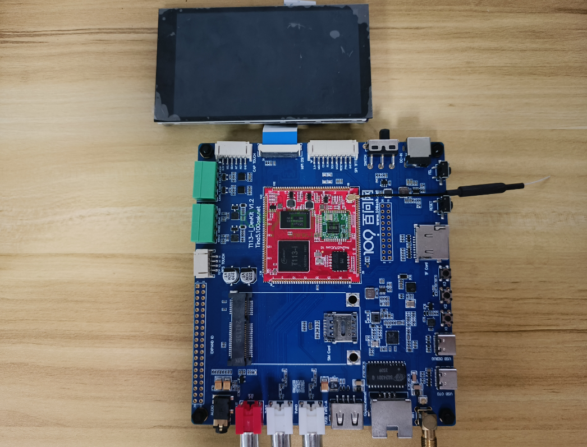

排线的蓝色面朝上，插入开发板的mipi接口。

## 编译LVGL例程

### 搭建开发环境

编译示例程序，要用到Tina5-SDK里面的交叉编译工具，所以需要先在ubuntu上搭建好开发环境。

如果不清楚如何搭建开发环境，参考 [开发环境搭建](https://dshanpi.100ask.org/docs/T113i-Industrial/part3/DevelopmentEnvironmentSetup)

### 获取资源

进入ubuntu（已搭建好相应开发环境），新建终端，获取 LVGL Framebuffer Demo（一个示例项目，展示了如何在Linux图形栈之上使用LVGL。），执行以下指令：

~~~bash
git clone https://github.com/lvgl/lv_port_linux.git
cd lv_port_linux/
git submodule update --init --recursive
~~~

记录信息如下：

~~~bash
ubuntu@ubuntu1804:~/T113-i/lvgl_demo$ git clone https://github.com/lvgl/lv_port_linux.git
Cloning into 'lv_port_linux'...
remote: Enumerating objects: 206, done.
remote: Counting objects: 100% (103/103), done.
remote: Compressing objects: 100% (63/63), done.
remote: Total 206 (delta 62), reused 55 (delta 40), pack-reused 103 (from 1)
Receiving objects: 100% (206/206), 967.99 KiB | 932.00 KiB/s, done.
Resolving deltas: 100% (96/96), done.
ubuntu@ubuntu1804:~/T113-i/lvgl_demo$ ls
lv_port_linux
ubuntu@ubuntu1804:~/T113-i/lvgl_demo$ cd lv_port_linux/
ubuntu@ubuntu1804:~/T113-i/lvgl_demo/lv_port_linux$ git submodule update --init --recursive
Submodule 'lvgl' (https://github.com/littlevgl/lvgl.git) registered for path 'lvgl'
Cloning into '/home/ubuntu/T113-i/lvgl_demo/lv_port_linux/lvgl'...
Submodule path 'lvgl': checked out '72dfc1d75198a126dd495483d9cbc5b27c6c882b'
~~~

查看目录结构：

~~~bash
ubuntu@ubuntu1804:~/T113-i/lvgl_demo/lv_port_linux$ tree -L 2
.
├── CMakeLists.txt
├── LICENSE
├── lv_conf.defaults
├── lv_conf.h
├── lvgl
│   ├── CMakeLists.txt
│   ├── CMakePresets.json
│   ├── component.mk
│   ├── demos
│   ├── docs
│   ├── env_support
│   ├── examples
│   ├── idf_component.yml
│   ├── Kconfig
│   ├── library.json
│   ├── library.properties
│   ├── LICENCE.txt
│   ├── lv_conf_template.h
│   ├── lvgl.h
│   ├── lvgl.mk
│   ├── lvgl.pc.in
│   ├── lv_version.h
│   ├── lv_version.h.in
│   ├── README.md
│   ├── SConscript
│   ├── scripts
│   ├── src
│   ├── tests
│   └── zephyr
├── main.c
├── Makefile
├── manifest.json
├── mouse_cursor_icon.c
└── README.md

9 directories, 25 files
~~~

### 交叉编译准备

示例项目准备好之后，接下来就是准备编译了。

> 这个示例项目是运行在开发板上，并不是运行在Ubuntu上，需要在Ubuntu上，根据前面搭建好的开发环境，在里面找到交叉编译工具链的位置，编译出可以在开发板上运行的可执行程序。

在**Tina5-SDK源码根目录**上，查看文件`.buildconfig`，

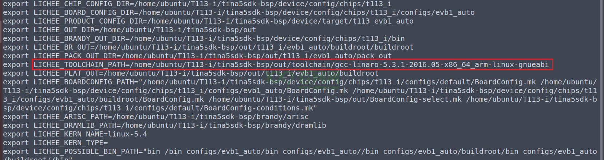

可以看到交叉编译工具链的位置（**根据实际位置为主**）：

~~~bash
/home/ubuntu/T113-i/tina5sdk-bsp/out/toolchain/gcc-linaro-5.3.1-2016.05-x86_64_arm-linux-gnueabi/bin
~~~

`ls`查看交叉编译工具如下：

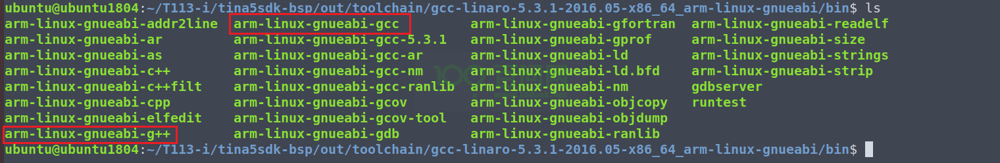

示例项目使用 Cmake 来生成的 Makefile，再进行编译，这里不使用示例项目自带的 Makefile 文件。

在示例项目文件`lv_port_linux`里，创建一个文件`toolchain.cmake`，用来指定交叉编译工具。

~~~bash
ubuntu@ubuntu1804:~/T113-i/lvgl_demo/lv_port_linux$ vim toolchain.cmake
~~~

根据实际的交叉编译工具链路径，写入以下内容：

~~~bash
set(CMAKE_SYSTEM_NAME Linux)
set(CMAKE_SYSTEM_PROCESSOR arm)

set(tools "/home/ubuntu/T113-i/tina5sdk-bsp/out/toolchain/gcc-linaro-5.3.1-2016.05-x86_64_arm-linux-gnueabi")
set(CMAKE_C_COMPILER ${tools}/bin/arm-linux-gnueabi-gcc)
set(CMAKE_CXX_COMPILER ${tools}/bin/arm-linux-gnueabi-g++)
~~~

写入完成后，在vim普通模式下，输入`:wq`保存退出。

修改 `CMakeLists.txt` 文件，注释无需使用的库，否则编译会报错。

~~~bash
ubuntu@ubuntu1804:~/T113-i/lvgl_demo/lv_port_linux$ vim CMakeLists.txt
~~~

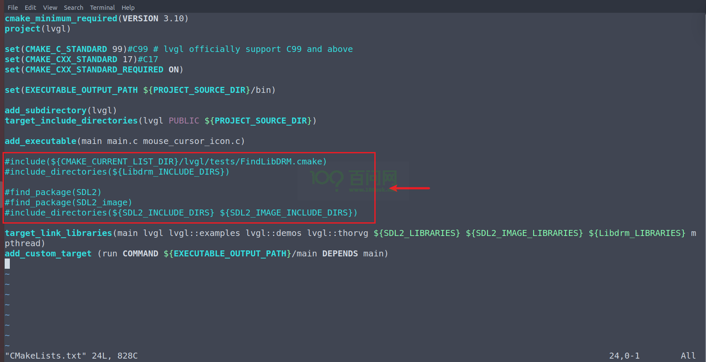

注释完成后，在vim普通模式下，输入`:wq`保存退出。

### 编译例程

为了方便执行编译操作，在示例项目文件`lv_port_linux`里，编写一个脚本`build.sh`，

~~~bash
ubuntu@ubuntu1804:~/T113-i/lvgl_demo/lv_port_linux$ vim build.sh
~~~

写入以下内容：

~~~bash
rm -rf build
mkdir -p build
cd build/
cmake -DCMAKE_TOOLCHAIN_FILE="../toolchain.cmake" ..
make -j8
~~~

写入完成后，在vim普通模式下，输入`:wq`保存退出。

为了让系统能够直接执行脚本文件，还需要给它设置执行权限，执行以下指令：

~~~bash
sudo chmod +x build.sh
~~~

做完以上操作，即可开始执行脚本编译：

~~~bash
ubuntu@ubuntu1804:~/T113-i/lvgl_demo/lv_port_linux$ ./build.sh
~~~

> 注意：
>
> cmake 版本要大于 3.12.4，否则编译会报错，本教程使用的 cmake 版本是3.28.3

编译如下：

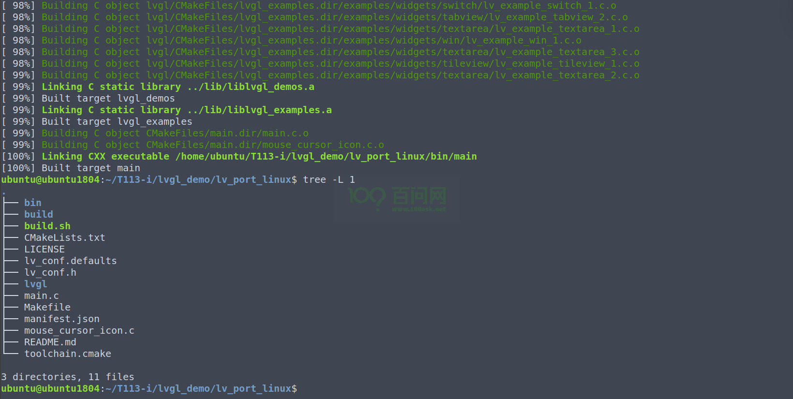

## 运行示例程序

编译完成后，可执行程序保存在`bin`目录下。

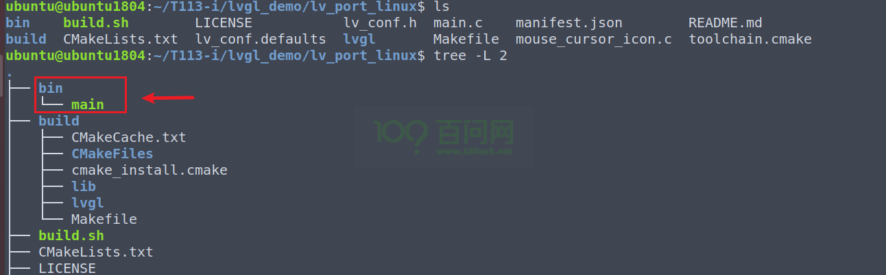

进入 `bin` 目录里，查看可执行程序`main`文件信息：

~~~bash
ubuntu@ubuntu1804:~/T113-i/lvgl_demo/lv_port_linux/bin$ file main 
main: ELF 32-bit LSB executable, ARM, EABI5 version 1 (GNU/Linux), dynamically linked, interpreter /lib/ld-linux.so.3, for GNU/Linux 2.6.32, BuildID[sha1]=46eb92718f7205586815c7f4d53495fd13b93be5, with debug_info, not stripped
~~~

从以上信息可以看到，`main` 是一个为 ARM 架构编译的 32 位 ELF（Executable and Linkable Format）可执行文件，可以在开发板上运行。

### adb上传程序

在Ubuntu上，使用 adb 工具把可执行程序`main`上传到开发板的`/mnt/UDISK/`底下，

执行以下指令：

~~~bash
adb push main /mnt/UDISK/
~~~

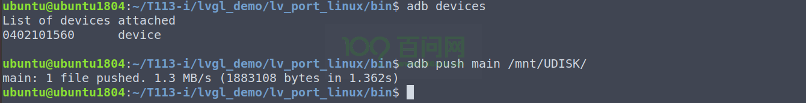

### 登录开发板终端

如果不清楚如何登录开发板终端，请参考 [启动开发板 | 东山Π (100ask.org)](https://dshanpi.100ask.org/docs/T113i-Industrial/part1/QuickStart)

### 运行程序

进入开发板终端之后，执行以下指令，运行程序：

~~~bash
/mnt/UDISK/main
~~~

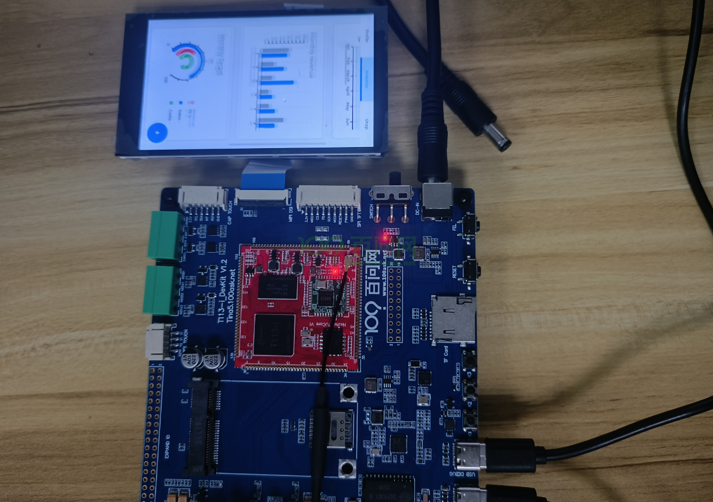

## 支持触摸

示例项目提供了framebuffer显示，也提供触摸输入，下面将讲解如何支持触摸（**前提：开发板已适配屏幕的触摸功能**）。

首先需要确定哪个设备节点是支持触摸的，在开发板上，执行以下指令：

~~~bash
cat /proc/bus/input/devices
~~~

可以看到，支持触摸的设备节点是 `/dev/input/evnet3`

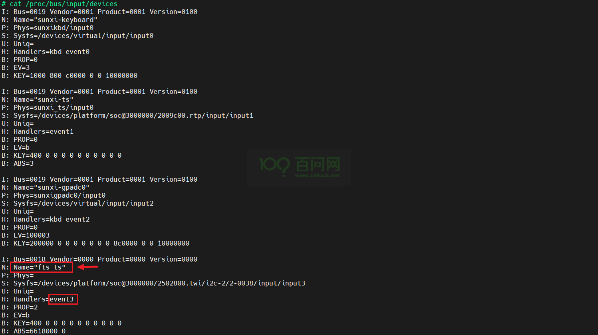

如果不知道哪个是触摸的设备节点，可以使用 `hexdump` 或者 `cat`工具一个一个输入设备节点进行测试，点击触摸屏幕，有数据的往往就是了，如下：

~~~bash
# hexdump /dev/input/event3
0000000 5896 0000 f76d 0003 0003 0039 0006 0000
0000010 5896 0000 f76d 0003 0003 003a 007f 0000
0000020 5896 0000 f76d 0003 0003 0030 0004 0000
0000030 5896 0000 f76d 0003 0003 0035 0143 0000
0000040 5896 0000 f76d 0003 0003 0036 0246 0000
0000050 5896 0000 f76d 0003 0001 014a 0001 0000
0000060 5896 0000 f76d 0003 0000 0000 0000 0000
0000070 5896 0000 1ff9 0004 0003 0039 ffff ffff
0000080 5896 0000 1ff9 0004 0001 014a 0000 0000
0000090 5896 0000 1ff9 0004 0000 0000 0000 0000
~~~

使用 `cat` 工具测试，则是返回一堆乱码，这里就不测试了。

经过测试，可以确定支持触摸的设备节点是 `/dev/input/event3`，在Ubuntu上，进入示例项目`lv_port_linux`目录底下，修改`main.c`。

添加如下代码：

~~~c
lv_indev_t * indev = lv_evdev_create(LV_INDEV_TYPE_POINTER, "/dev/input/event3")
~~~

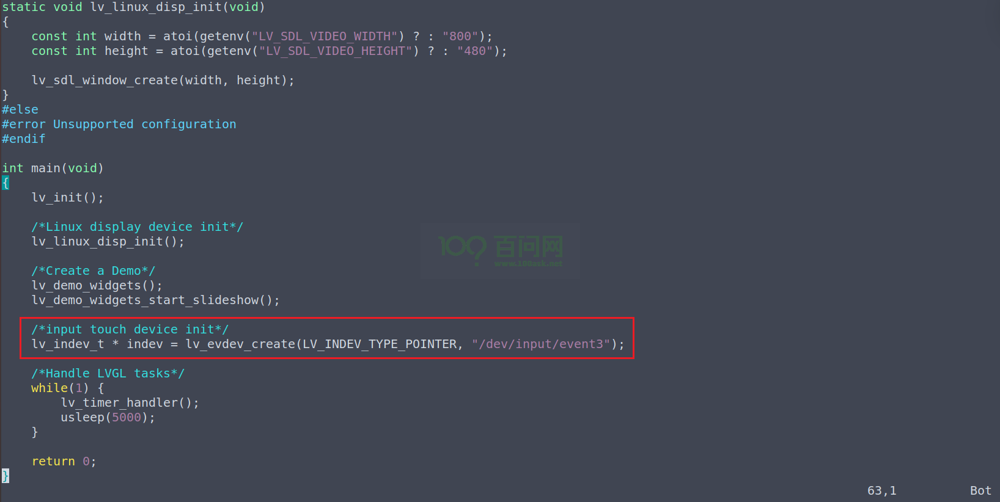

添加完成后，在vim的普通模式下，执行 `:wq`退出保存。

还不能马上编译，还需要修改示例项目`lv_port_linux`目录底下的配置文件 `lv_conf.h`，

~~~bash
vim lv_conf.h
~~~

找到`LV_USE_EVDEV`，把 **0** 修改成 **1**，表示启用对 Linux 输入设备（通过 evdev 接口）支持的宏定义。

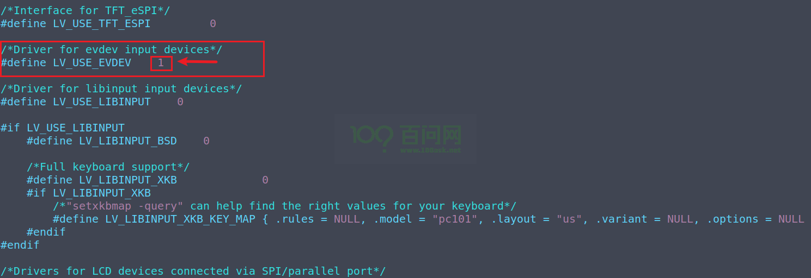

修改完成后，在vim的普通模式下，执行 `:wq`退出保存。

根据之前的步骤，执行编译程序、上传程序和运行程序等操作，这样就屏幕可以支持触摸了。
