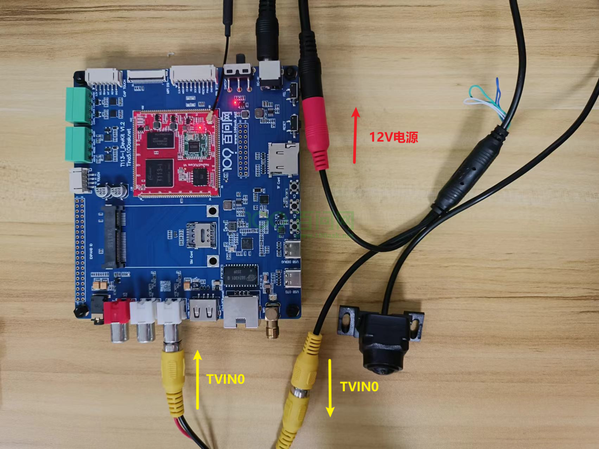
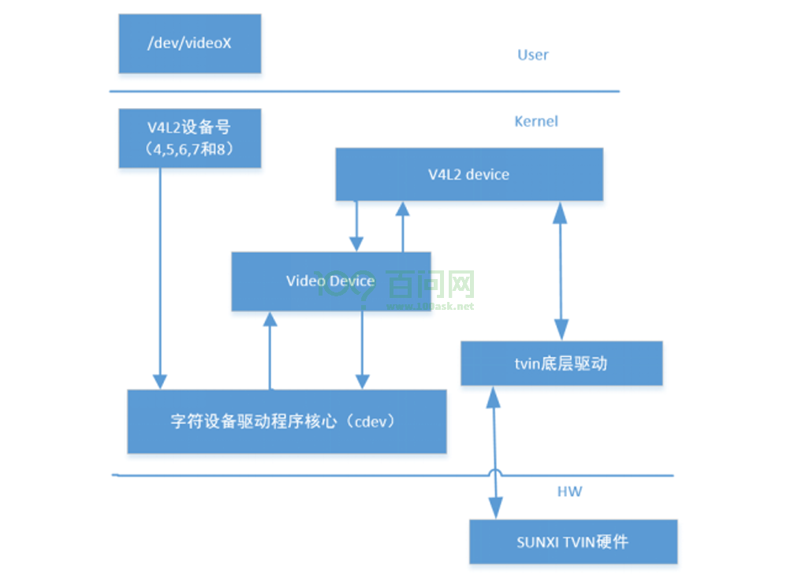
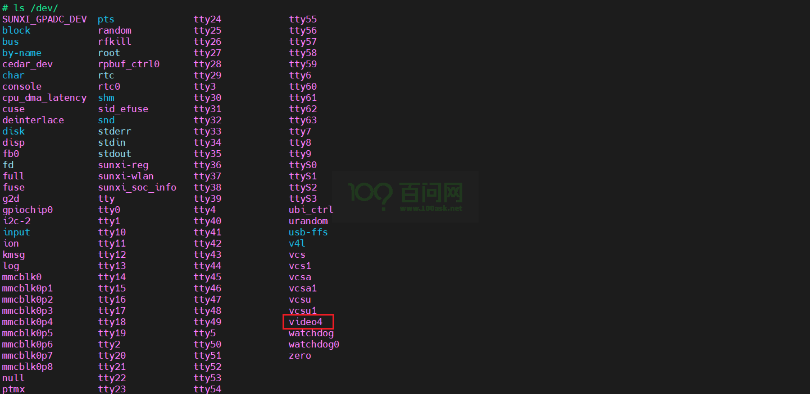
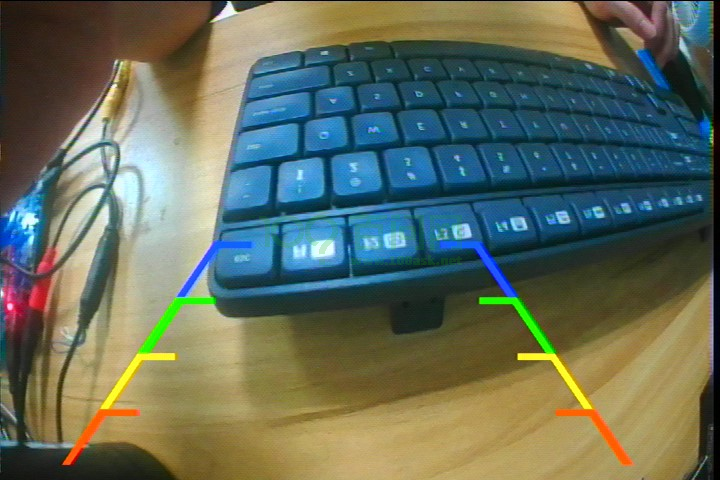

# V4L2摄像头抓图实现

本章节将讲解如何使用 Video4Linux2 (V4L2) 框架来捕获CVBS摄像头图像。

## **硬件与软件准备**

> 学习之前，先做好以下准备。

1. 硬件：T113i-Industrial 开发板
2. 硬件：typeC线 X2
3. 硬件：cvbs摄像头
4. 软件：全志线刷工具：[AllwinnertechPhoeniSuit](https://gitlab.com/dongshanpi/tools/-/raw/main/AllwinnertechPhoeniSuit.zip)
5. 软件：全志USB烧录驱动：[AllwinnerUSBFlashDeviceDriver](https://gitlab.com/dongshanpi/tools/-/raw/main/AllwinnerUSBFlashDeviceDriver.zip)
6. 软件：镜像（支持tvd）：t113_i_linux_evb1_auto_uart0.img

## 硬件连接指南

先把摄像头接上，下面图片是将cvbs摄像头连接到 T113i-Industrial 开发板的指南。



## TVD驱动框架

CVBS摄像头连接的模块是TVD硬件模块，也叫TVIN模块。它负责接收CVBS信号并将其解码为可显示的视频格式。



由上图可以知道，TVD 驱动只是负责把 TVD 的硬件描述完成并注册进 V4L2 框架，所以并不需要关心TVD驱动，具体还是放在用户态
的应用层，基于V4L2的框架去编程，实现抓图功能。

## 抓图流程

> 接下来，将讲解基于V4L2的框架去编程实现抓图的流程

### 什么是V4L2框架

V4L2（Video for Linux 2）框架是 Linux 内核中用于处理视频设备的一套 API 和驱动程序框架。它提供了对视频设备的统一访问接口，使得应用程序能够方便地捕获和处理视频数据。

### 打开设备

一般，当摄像头插入开发板上，在/dev目录里，会出现相应的video节点，但是这里即使摄像头没有插上，也会出现相应的/dev/video节点，因为，芯片已经集成了TVIN硬件模块。



确定了摄像头设备节点/dev/video4，接下来一步步写程序，先打开设备。

~~~c
#include <sys/ioctl.h>
#include <sys/mman.h>
#include <sys/time.h>
#include <fcntl.h>
#include <unistd.h>
#include <string.h>
#include <errno.h>
#include <stdlib.h>
#include <stdio.h>
#include <sys/types.h>
#include <sys/stat.h>
#include <time.h>
#include <linux/videodev2.h>
#include <pthread.h>
#include <semaphore.h>
#include <ctype.h>
#include <errno.h>
#include <stdio.h>

int main()
{
    /*open /dev/video4*/
    int fd = open("/dev/video4",O_RDWR);
    if (fd < 0)
    {
        perror("open /dev/video4 error");
        return -1;
    }
    
    close(fd);
    printf("> closed /dev/video4\n");
    return 0;
} 
~~~

### 获取支持格式

打开设备成功后，想知道这个摄像头所支持的格式有哪些，这里需要用到 ioctl 函数，传入 `VIDIOC_ENUM_FMT ` 命令，得到的信息将会保存在结构体 `struct v4l2_fmtdesc` 里，v4l2_fmtdesc 成员如下：

- `index`: 格式编号索引，用于枚举设备支持的多个格式。
- `type`: 缓冲区类型，通常设置为 `V4L2_BUF_TYPE_VIDEO_CAPTURE`。
- `flags`: 格式描述标志。
- `description`: 一个字符串数组，用于存储格式的描述信息。
- `pixelformat`: 表示图像格式的四字符代码（fourcc），如 `V4L2_PIX_FMT_YUYV`。
- `reserved`: 保留字段，用于未来扩展。

~~~c
#include <sys/ioctl.h>
#include <sys/mman.h>
#include <sys/time.h>
#include <fcntl.h>
#include <unistd.h>
#include <string.h>
#include <errno.h>
#include <stdlib.h>
#include <stdio.h>
#include <sys/types.h>
#include <sys/stat.h>
#include <time.h>
#include <linux/videodev2.h>
#include <pthread.h>
#include <semaphore.h>
#include <ctype.h>
#include <errno.h>
#include <stdio.h>

int main()
{
    struct v4l2_fmtdesc fmtdesc;
    
    /*open /dev/video4*/
    int fd = open("/dev/video4",O_RDWR);
    if (fd < 0)
    {
        perror("open /dev/video4 error");
        return -1;
    }
    
    /*Enumerate Camera Formats*/
    memset(&fmtdesc, 0, sizeof(fmtdesc));
    fmtdesc.type = V4L2_BUF_TYPE_VIDEO_CAPTURE;
    int i = 0;
    while(1)         //从0开始测试index索引值
    {
        fmtdesc.index = i;
        i++;
        int ret = ioctl(fd,VIDIOC_ENUM_FMT,&fmtdesc);
        if (ret < 0)
        {
            perror(" fmtdesc error");
            break;
        }
        printf("> index=%d\n",fmtdesc.index);
        printf("> flags=%d\n",fmtdesc.flags);
        printf("> discription=%s\n",fmtdesc.description);
        unsigned char *p = (unsigned char *)&fmtdesc.pixelformat;
        printf("> pixelformat=%c%c%c%c\n",p[0],p[1],p[2],p[3]);
        printf("> reserved=%d\n",fmtdesc.reserved[0]);
    }
    
    close(fd);
    printf("> closed /dev/video4\n");
    return 0;
} 
~~~

运行结果如下：

~~~bash
> index=0
> flags=0
> discription=Y/CbCr 4:2:0
> pixelformat=NV12
> reserved=0
> index=1
> flags=0
> discription=Y/CrCb 4:2:0
> pixelformat=NV21
> reserved=0
> index=2
> flags=0
> discription=Y/CbCr 4:2:2
> pixelformat=NV16
> reserved=0
> index=3
> flags=0
> discription=Y/CrCb 4:2:2
> pixelformat=NV61
> reserved=0
> index=4
> flags=0
> discription=planar PACK
> pixelformat=
> reserved=0
 fmtdesc error: Invalid argument
~~~

说明这个摄像头支持四种格式。

### 查询设备能力

我们还可以使用 `VIDIOC_QUERYCAP` 指令，配合 ioctl 函数，查询视频设备有哪些能力和特性，这些信息保存在结构体 `v4l2_capability` 里，该结构体的成员如下：

- `driver[16]`：驱动模块的名称，例如 "bttv"。
- `card[32]`：设备卡的名称，例如 "Hauppauge WinTV"。
- `bus_info[32]`：总线信息，例如 "PCI:" 加上 PCI 设备的名称。
- `version`：内核版本。
- `capabilities`：设备的整体能力，例如是否支持视频捕获 `V4L2_CAP_VIDEO_CAPTURE` 或视频输出 `V4L2_CAP_VIDEO_OUTPUT`。
- `device_caps`：通过特定设备（节点）访问的能力。
- `reserved[3]`：保留字段。

~~~c
#include <sys/ioctl.h>
#include <sys/mman.h>
#include <sys/time.h>
#include <fcntl.h>
#include <unistd.h>
#include <string.h>
#include <errno.h>
#include <stdlib.h>
#include <stdio.h>
#include <sys/types.h>
#include <sys/stat.h>
#include <time.h>
#include <linux/videodev2.h>
#include <pthread.h>
#include <semaphore.h>
#include <ctype.h>
#include <errno.h>
#include <stdio.h>

int main()
{
    struct v4l2_fmtdesc fmtdesc;
    struct v4l2_capability cap;
    
    /*open /dev/video4*/
    int fd = open("/dev/video4",O_RDWR);
    if (fd < 0)
    {
        perror("open /dev/video4 error");
        return -1;
    }
    
    /*Enumerate Camera Formats*/
    memset(&fmtdesc, 0, sizeof(fmtdesc));
    fmtdesc.type = V4L2_BUF_TYPE_VIDEO_CAPTURE;
    int i = 0;
    while(1)         //从0开始测试index索引值
    {
        fmtdesc.index = i;
        i++;
        int ret = ioctl(fd,VIDIOC_ENUM_FMT,&fmtdesc);
        if (ret < 0)
        {
            perror(" fmtdesc error");
            break;
        }
        printf("> index=%d\n",fmtdesc.index);
        printf("> flags=%d\n",fmtdesc.flags);
        printf("> discription=%s\n",fmtdesc.description);
        unsigned char *p = (unsigned char *)&fmtdesc.pixelformat;
        printf("> pixelformat=%c%c%c%c\n",p[0],p[1],p[2],p[3]);
        printf("> reserved=%d\n",fmtdesc.reserved[0]);
    }
    
    /*query device capabilities*/
    memset(&cap, 0, sizeof(cap));
	if (ioctl(fd, VIDIOC_QUERYCAP, &cap) < 0) {
		printf(" Query device capabilities fail!!!\n");
	} else {
		printf("> Querey device capabilities succeed\n");
		printf("> cap.driver=%s\n", cap.driver);
		printf("> cap.card=%s\n", cap.card);
		printf("> cap.bus_info=%s\n", cap.bus_info);
		printf("> cap.version=0x%08x\n", cap.version);
		printf("> cap.capabilities=0x%08x\n", cap.capabilities);
	}
    
	if ((cap.capabilities & V4L2_CAP_VIDEO_CAPTURE) >= 0) {
		printf("> The device is supports the Video Capture interface V4L2_CAP_VIDEO_CAPTURE!!!\n");
	}
    
    close(fd);
    printf("> closed /dev/video4\n");
    return 0;
} 
~~~

运行结果如下：

~~~bash
> index=0
> flags=0
> discription=Y/CbCr 4:2:0
> pixelformat=NV12
> reserved=0
> index=1
> flags=0
> discription=Y/CrCb 4:2:0
> pixelformat=NV21
> reserved=0
> index=2
> flags=0
> discription=Y/CbCr 4:2:2
> pixelformat=NV16
> reserved=0
> index=3
> flags=0
> discription=Y/CrCb 4:2:2
> pixelformat=NV61
> reserved=0
> index=4
> flags=0
> discription=planar PACK
> pixelformat=
> reserved=0
 fmtdesc error: Invalid argument
> Querey device capabilities succeed
> cap.driver=sunxi-tvd
> cap.card=sunxi-tvd
> cap.bus_info=tvd_v4l2_dev0
> cap.version=0x00010000
> cap.capabilities=0x85200001
> The device is supports the Video Capture interface V4L2_CAP_VIDEO_CAPTURE!!!
~~~

如果只是简单抓一下图，这一步可以不用操作。

### 配置摄像头

我们要实现的功能是抓图，这个摄像头的输入源，应该设置为相机类型，把参数存到结构体 `v4l2_input` 里 ，使用 `VIDIOC_S_INPUT` 命令设置视频设备的视频输入源。

~~~c
#include <sys/ioctl.h>
#include <sys/mman.h>
#include <sys/time.h>
#include <fcntl.h>
#include <unistd.h>
#include <string.h>
#include <errno.h>
#include <stdlib.h>
#include <stdio.h>
#include <sys/types.h>
#include <sys/stat.h>
#include <time.h>
#include <linux/videodev2.h>
#include <pthread.h>
#include <semaphore.h>
#include <ctype.h>
#include <errno.h>
#include <stdio.h>

int main()
{
    struct v4l2_fmtdesc fmtdesc;
    struct v4l2_capability cap;
    struct v4l2_input inp;
    
    /*open /dev/video4*/
    int fd = open("/dev/video4",O_RDWR);
    if (fd < 0)
    {
        perror("open /dev/video4 error");
        return -1;
    }
    
    /*enumerate Camera Formats*/
    memset(&fmtdesc, 0, sizeof(fmtdesc));
    fmtdesc.type = V4L2_BUF_TYPE_VIDEO_CAPTURE;
    int i = 0;
    while(1)         //从0开始测试index索引值
    {
        fmtdesc.index = i;
        i++;
        int ret = ioctl(fd,VIDIOC_ENUM_FMT,&fmtdesc);
        if (ret < 0)
        {
            perror(" fmtdesc error");
            break;
        }
        printf("> index=%d\n",fmtdesc.index);
        printf("> flags=%d\n",fmtdesc.flags);
        printf("> discription=%s\n",fmtdesc.description);
        unsigned char *p = (unsigned char *)&fmtdesc.pixelformat;
        printf("> pixelformat=%c%c%c%c\n",p[0],p[1],p[2],p[3]);
        printf("> reserved=%d\n",fmtdesc.reserved[0]);
    }
    
    /*query device capabilities*/
    memset(&cap, 0, sizeof(cap));
	if (ioctl(fd, VIDIOC_QUERYCAP, &cap) < 0) {
		printf(" Query device capabilities fail!!!\n");
	} else {
		printf("> Querey device capabilities succeed\n");
		printf("> cap.driver=%s\n", cap.driver);
		printf("> cap.card=%s\n", cap.card);
		printf("> cap.bus_info=%s\n", cap.bus_info);
		printf("> cap.version=0x%08x\n", cap.version);
		printf("> cap.capabilities=0x%08x\n", cap.capabilities);
	}
    
	if ((cap.capabilities & V4L2_CAP_VIDEO_CAPTURE) >= 0) {
		printf("> The device is supports the Video Capture interface V4L2_CAP_VIDEO_CAPTURE!!!\n");
	}
    
    /*set input source*/
    memset(&inp, 0, sizeof(inp));
	inp.index = 0;                       //设置输入索引，通常0是默认输入
	inp.type = V4L2_INPUT_TYPE_CAMERA;   //设置输入类型，这里是相机
	if (ioctl(fd, VIDIOC_S_INPUT, &inp) < 0) {
		printf(" VIDIOC_S_INPUT failed! s_input: %d\n", inp.index);
		close(fd);
		return -1;
	}else{
        printf("> select the current video input successfully!\n");
    }
    
    
    close(fd);
    printf("> closed /dev/video4\n");
    return 0;
} 
~~~

想抓取什么样的图片数据，这需要我们进一步设置相应的格式，把参数储存在结构体 `v4l2_format` 里，使用 `VIDIOC_S_FMT` 指令，设置视频捕获设备的视频格式。有哪些参数可以设置呢？

```c
struct v4l2_format {
    enum v4l2_buf_type type;  // 视频流的类型，如 V4L2_BUF_TYPE_VIDEO_CAPTURE

    union {
        struct v4l2_pix_format      pix;      // 图像数据格式（用于图像捕获）
        struct v4l2_pix_format_mplane pix_mp; // 多平面图像数据格式（用于图像捕获）
        struct v4l2_window           win;     // 视频窗口（用于视频叠加）
        struct v4l2_vbi_format       vbi;     // VBI 数据格式（用于 VBI 捕获）
        struct v4l2_sliced_vbi_format sliced; // 分片 VBI 数据格式（用于分片 VBI 捕获）
        __u8 raw_data[200];                   // 用于用户定义的格式
    } fmt;
};
```

实现抓图，最主要设置其成员中的结构体 `v4l2_pix_format` ，其成员有：

~~~c
struct v4l2_pix_format {
    __u32          width;        // 图像宽度
    __u32          height;       // 图像高度
    __u32          pixelformat;  // 像素格式
    __u32          field;        // 图像场
    __u32          bytesperline; // 每行的字节数
    __u32          sizeimage;    // 图像的总字节数
    __u32          colorspace;   // 颜色空间
    __u32          priv;         // 私有数据
    __u32          flags;        // 标志
    __u32          ycbcr_enc;    // YCbCr 编码
    __u32          hsv_enc;      // HSV 编码
    __u32          quantization; // 量化
    __u32          xeight;       // X 轴的扩展高度
};
~~~

添加代码如下：

~~~c
#include <sys/ioctl.h>
#include <sys/mman.h>
#include <sys/time.h>
#include <fcntl.h>
#include <unistd.h>
#include <string.h>
#include <errno.h>
#include <stdlib.h>
#include <stdio.h>
#include <sys/types.h>
#include <sys/stat.h>
#include <time.h>
#include <linux/videodev2.h>
#include <pthread.h>
#include <semaphore.h>
#include <ctype.h>
#include <errno.h>
#include <stdio.h>

int main()
{
    struct v4l2_fmtdesc fmtdesc;
    struct v4l2_capability cap;
    struct v4l2_input inp;
    struct v4l2_format fmt;
    
    /*open /dev/video4*/
    int fd = open("/dev/video4",O_RDWR);
    if (fd < 0)
    {
        perror("open /dev/video4 error");
        return -1;
    }
    
    /*enumerate Camera Formats*/
    memset(&fmtdesc, 0, sizeof(fmtdesc));
    fmtdesc.type = V4L2_BUF_TYPE_VIDEO_CAPTURE;
    int i = 0;
    while(1)         //从0开始测试index索引值
    {
        fmtdesc.index = i;
        i++;
        int ret = ioctl(fd,VIDIOC_ENUM_FMT,&fmtdesc);
        if (ret < 0)
        {
            perror(" fmtdesc error");
            break;
        }
        printf("> index=%d\n",fmtdesc.index);
        printf("> flags=%d\n",fmtdesc.flags);
        printf("> discription=%s\n",fmtdesc.description);
        unsigned char *p = (unsigned char *)&fmtdesc.pixelformat;
        printf("> pixelformat=%c%c%c%c\n",p[0],p[1],p[2],p[3]);
        printf("> reserved=%d\n",fmtdesc.reserved[0]);
    }
    
    /*query device capabilities*/
    memset(&cap, 0, sizeof(cap));
	if (ioctl(fd, VIDIOC_QUERYCAP, &cap) < 0) {
		printf(" Query device capabilities fail!!!\n");
	} else {
		printf("> Querey device capabilities succeed\n");
		printf("> cap.driver=%s\n", cap.driver);
		printf("> cap.card=%s\n", cap.card);
		printf("> cap.bus_info=%s\n", cap.bus_info);
		printf("> cap.version=0x%08x\n", cap.version);
		printf("> cap.capabilities=0x%08x\n", cap.capabilities);
	}
    
	if ((cap.capabilities & V4L2_CAP_VIDEO_CAPTURE) >= 0) {
		printf("> The device is supports the Video Capture interface V4L2_CAP_VIDEO_CAPTURE!!!\n");
	}
    
    /*set input source*/
    memset(&inp, 0, sizeof(inp));
	inp.index = 0;                       //设置输入索引，通常0是默认输入
	inp.type = V4L2_INPUT_TYPE_CAMERA;   //设置输入类型，这里是相机
	if (ioctl(fd, VIDIOC_S_INPUT, &inp) < 0) {
		printf(" VIDIOC_S_INPUT failed! s_input: %d\n", inp.index);
		close(fd);
		return -1;
	}else{
        printf("> select the current video input successfully!\n");
    }
    
    /*set input format*/
    width  = 720;
    height = 480;

    memset(&fmt, 0, sizeof(struct v4l2_format));
    fmt.type = V4L2_BUF_TYPE_VIDEO_CAPTURE;
    fmt.fmt.pix.width = width;
    fmt.fmt.pix.height = height;
    fmt.fmt.pix.pixelformat = V4L2_PIX_FMT_NV21;
    fmt.fmt.pix.field = V4L2_FIELD_NONE;

    char fourcc[5];

    if (ioctl(fd, VIDIOC_S_FMT, &fmt) < 0) {
		printf(" setting the data format failed!\n");
		close(fd);
		return -1;
	}else{
        printf("> VIDIOC_S_FMT succeed\n");
		printf("> fmt.type = %d\n", fmt.type);
		printf("> fmt.fmt.pix.width = %d\n", fmt.fmt.pix.width);
		printf("> fmt.fmt.pix.height = %d\n", fmt.fmt.pix.height);
		printf("> fmt.fmt.pix.field = %d\n", fmt.fmt.pix.field);
        sprintf(fourcc, "%c%c%c%c", 
        ((fmt.fmt.pix.pixelformat >> 0) & 0xff),
        ((fmt.fmt.pix.pixelformat >> 8) & 0xff),
        ((fmt.fmt.pix.pixelformat >> 16) & 0xff),
        ((fmt.fmt.pix.pixelformat >> 24) & 0xff));
        printf("> The pixel format fourcc is: %s\n", fourcc);
    }
    
    close(fd);
    printf("> closed /dev/video4\n");
    return 0;
} 
~~~

运行结果：

~~~bash
> index=0
> flags=0
> discription=Y/CbCr 4:2:0
> pixelformat=NV12
> reserved=0
> index=1
> flags=0
> discription=Y/CrCb 4:2:0
> pixelformat=NV21
> reserved=0
> index=2
> flags=0
> discription=Y/CbCr 4:2:2
> pixelformat=NV16
> reserved=0
> index=3
> flags=0
> discription=Y/CrCb 4:2:2
> pixelformat=NV61
> reserved=0
> index=4
> flags=0
> discription=planar PACK
> pixelformat=
> reserved=0
 fmtdesc error: Invalid argument
> Querey device capabilities succeed
> cap.driver=sunxi-tvd
> cap.card=sunxi-tvd
> cap.bus_info=tvd_v4l2_dev0
> cap.version=0x00010000
> cap.capabilities=0x85200001
> The device is supports the Video Capture interface V4L2_CAP_VIDEO_CAPTURE!!!
> select the current video input successfully!
> VIDIOC_S_FMT succeed
> fmt.type = 1
> fmt.fmt.pix.width = 720
> fmt.fmt.pix.height = 480
> fmt.fmt.pix.field = 1
> The pixel format fourcc is: NV21
~~~

### 申请内核缓冲区

为了在用户空间和内核空间之间高效地传输数据，使用 `VIDIOC_REQBUFS` 命令申请内核缓冲区，指定缓冲区的数量、缓冲区的类型和缓冲区的内存类型，这些参数保存在结构体`v4l2_requestbuffers` 。

~~~c
#include <sys/ioctl.h>
#include <sys/mman.h>
#include <sys/time.h>
#include <fcntl.h>
#include <unistd.h>
#include <string.h>
#include <errno.h>
#include <stdlib.h>
#include <stdio.h>
#include <sys/types.h>
#include <sys/stat.h>
#include <time.h>
#include <linux/videodev2.h>
#include <pthread.h>
#include <semaphore.h>
#include <ctype.h>
#include <errno.h>
#include <stdio.h>

int main()
{
    struct v4l2_fmtdesc fmtdesc;
    struct v4l2_capability cap;
    struct v4l2_input inp;
    struct v4l2_format fmt;
    struct v4l2_requestbuffers req;
    
    /*open /dev/video4*/
    int fd = open("/dev/video4",O_RDWR);
    if (fd < 0)
    {
        perror("open /dev/video4 error");
        return -1;
    }
    
    /*enumerate Camera Formats*/
    memset(&fmtdesc, 0, sizeof(fmtdesc));
    fmtdesc.type = V4L2_BUF_TYPE_VIDEO_CAPTURE;
    int i = 0;
    while(1)         //从0开始测试index索引值
    {
        fmtdesc.index = i;
        i++;
        int ret = ioctl(fd,VIDIOC_ENUM_FMT,&fmtdesc);
        if (ret < 0)
        {
            perror(" fmtdesc error");
            break;
        }
        printf("> index=%d\n",fmtdesc.index);
        printf("> flags=%d\n",fmtdesc.flags);
        printf("> discription=%s\n",fmtdesc.description);
        unsigned char *p = (unsigned char *)&fmtdesc.pixelformat;
        printf("> pixelformat=%c%c%c%c\n",p[0],p[1],p[2],p[3]);
        printf("> reserved=%d\n",fmtdesc.reserved[0]);
    }
    
    /*query device capabilities*/
    memset(&cap, 0, sizeof(cap));
	if (ioctl(fd, VIDIOC_QUERYCAP, &cap) < 0) {
		printf(" Query device capabilities fail!!!\n");
	} else {
		printf("> Querey device capabilities succeed\n");
		printf("> cap.driver=%s\n", cap.driver);
		printf("> cap.card=%s\n", cap.card);
		printf("> cap.bus_info=%s\n", cap.bus_info);
		printf("> cap.version=0x%08x\n", cap.version);
		printf("> cap.capabilities=0x%08x\n", cap.capabilities);
	}
    
	if ((cap.capabilities & V4L2_CAP_VIDEO_CAPTURE) >= 0) {
		printf("> The device is supports the Video Capture interface V4L2_CAP_VIDEO_CAPTURE!!!\n");
	}
    
    /*set input source*/
    memset(&inp, 0, sizeof(inp));
	inp.index = 0;                       //设置输入索引，通常0是默认输入
	inp.type = V4L2_INPUT_TYPE_CAMERA;   //设置输入类型，这里是相机
	if (ioctl(fd, VIDIOC_S_INPUT, &inp) < 0) {
		printf(" VIDIOC_S_INPUT failed! s_input: %d\n", inp.index);
		close(fd);
		return -1;
	}else{
        printf("> select the current video input successfully!\n");
    }
    
    /*set input format*/
    width  = 720;
    height = 480;

    memset(&fmt, 0, sizeof(struct v4l2_format));
    fmt.type = V4L2_BUF_TYPE_VIDEO_CAPTURE;
    fmt.fmt.pix.width = width;
    fmt.fmt.pix.height = height;
    fmt.fmt.pix.pixelformat = V4L2_PIX_FMT_NV21;
    fmt.fmt.pix.field = V4L2_FIELD_NONE;

    char fourcc[5];

    if (ioctl(fd, VIDIOC_S_FMT, &fmt) < 0) {
		printf(" setting the data format failed!\n");
		close(fd);
		return -1;
	}else{
        printf("> VIDIOC_S_FMT succeed\n");
		printf("> fmt.type = %d\n", fmt.type);
		printf("> fmt.fmt.pix.width = %d\n", fmt.fmt.pix.width);
		printf("> fmt.fmt.pix.height = %d\n", fmt.fmt.pix.height);
		printf("> fmt.fmt.pix.field = %d\n", fmt.fmt.pix.field);
        sprintf(fourcc, "%c%c%c%c", 
        ((fmt.fmt.pix.pixelformat >> 0) & 0xff),
        ((fmt.fmt.pix.pixelformat >> 8) & 0xff),
        ((fmt.fmt.pix.pixelformat >> 16) & 0xff),
        ((fmt.fmt.pix.pixelformat >> 24) & 0xff));
        printf("> The pixel format fourcc is: %s\n", fourcc);
    }
    
    /*request for a kernel buffer*/
    memset(&req, 0, sizeof(struct v4l2_requestbuffers));
    req.count = 3;                             //缓冲区数量
    req.type = V4L2_BUF_TYPE_VIDEO_CAPTURE;    //缓冲区类型
    req.memory = V4L2_MEMORY_MMAP;             //缓冲区内存类型
    if (ioctl(fd, VIDIOC_REQBUFS, &req) < 0) {
		printf("> VIDIOC_REQBUFS failed\n");
		close(fd);
		return -1;
	}else{
        printf("> request buffer sccessfully!\n");
    }

    int buf_count = req.count;
    printf("> buf_count is : %d\n",buf_count);  
    
    
    close(fd);
    printf("> closed /dev/video4\n");
    return 0;
} 
~~~

成功申请到内核buffer：

~~~bash
> index=0
> flags=0
> discription=Y/CbCr 4:2:0
> pixelformat=NV12
> reserved=0
> index=1
> flags=0
> discription=Y/CrCb 4:2:0
> pixelformat=NV21
> reserved=0
> index=2
> flags=0
> discription=Y/CbCr 4:2:2
> pixelformat=NV16
> reserved=0
> index=3
> flags=0
> discription=Y/CrCb 4:2:2
> pixelformat=NV61
> reserved=0
> index=4
> flags=0
> discription=planar PACK
> pixelformat=
> reserved=0
 fmtdesc error: Invalid argument
> Querey device capabilities succeed
> cap.driver=sunxi-tvd
> cap.card=sunxi-tvd
> cap.bus_info=tvd_v4l2_dev0
> cap.version=0x00010000
> cap.capabilities=0x85200001
> The device is supports the Video Capture interface V4L2_CAP_VIDEO_CAPTURE!!!
> select the current video input successfully!
> VIDIOC_S_FMT succeed
> fmt.type = 1
> fmt.fmt.pix.width = 720
> fmt.fmt.pix.height = 480
> fmt.fmt.pix.field = 1
> The pixel format fourcc is: NV21
> request buffer sccessfully!
> buf_count is : 3
~~~

### 映射内核缓冲区

请求内核缓冲区成功后，需要为每个请求的缓冲区进行初始化，包括查询缓冲区信息，内存映射和排队缓冲区。这是抓图过程中的一个重要步骤，确保缓冲区准备好并可以被内核使用。

~~~c
#include <sys/ioctl.h>
#include <sys/mman.h>
#include <sys/time.h>
#include <fcntl.h>
#include <unistd.h>
#include <string.h>
#include <errno.h>
#include <stdlib.h>
#include <stdio.h>
#include <sys/types.h>
#include <sys/stat.h>
#include <time.h>
#include <linux/videodev2.h>
#include <pthread.h>
#include <semaphore.h>
#include <ctype.h>
#include <errno.h>
#include <stdio.h>

struct buffer{
    unsigned char *start[3];
    unsigned int length[3];
};

int main()
{
    struct v4l2_fmtdesc fmtdesc;
    struct v4l2_capability cap;
    struct v4l2_input inp;
    struct v4l2_format fmt;
    struct v4l2_requestbuffers req;
    struct v4l2_buffer buf;
    
    /*open /dev/video4*/
    int fd = open("/dev/video4",O_RDWR);
    if (fd < 0)
    {
        perror("open /dev/video4 error");
        return -1;
    }
    
    /*enumerate Camera Formats*/
    memset(&fmtdesc, 0, sizeof(fmtdesc));
    fmtdesc.type = V4L2_BUF_TYPE_VIDEO_CAPTURE;
    int i = 0;
    while(1)         //从0开始测试index索引值
    {
        fmtdesc.index = i;
        i++;
        int ret = ioctl(fd,VIDIOC_ENUM_FMT,&fmtdesc);
        if (ret < 0)
        {
            perror(" fmtdesc error");
            break;
        }
        printf("> index=%d\n",fmtdesc.index);
        printf("> flags=%d\n",fmtdesc.flags);
        printf("> discription=%s\n",fmtdesc.description);
        unsigned char *p = (unsigned char *)&fmtdesc.pixelformat;
        printf("> pixelformat=%c%c%c%c\n",p[0],p[1],p[2],p[3]);
        printf("> reserved=%d\n",fmtdesc.reserved[0]);
    }
    
    /*query device capabilities*/
    memset(&cap, 0, sizeof(cap));
	if (ioctl(fd, VIDIOC_QUERYCAP, &cap) < 0) {
		printf(" Query device capabilities fail!!!\n");
	} else {
		printf("> Querey device capabilities succeed\n");
		printf("> cap.driver=%s\n", cap.driver);
		printf("> cap.card=%s\n", cap.card);
		printf("> cap.bus_info=%s\n", cap.bus_info);
		printf("> cap.version=0x%08x\n", cap.version);
		printf("> cap.capabilities=0x%08x\n", cap.capabilities);
	}
    
	if ((cap.capabilities & V4L2_CAP_VIDEO_CAPTURE) >= 0) {
		printf("> The device is supports the Video Capture interface V4L2_CAP_VIDEO_CAPTURE!!!\n");
	}
    
    /*set input source*/
    memset(&inp, 0, sizeof(inp));
	inp.index = 0;                       //设置输入索引，通常0是默认输入
	inp.type = V4L2_INPUT_TYPE_CAMERA;   //设置输入类型，这里是相机
	if (ioctl(fd, VIDIOC_S_INPUT, &inp) < 0) {
		printf(" VIDIOC_S_INPUT failed! s_input: %d\n", inp.index);
		close(fd);
		return -1;
	}else{
        printf("> select the current video input successfully!\n");
    }
    
    /*set input format*/
    width  = 720;
    height = 480;

    memset(&fmt, 0, sizeof(struct v4l2_format));
    fmt.type = V4L2_BUF_TYPE_VIDEO_CAPTURE;
    fmt.fmt.pix.width = width;
    fmt.fmt.pix.height = height;
    fmt.fmt.pix.pixelformat = V4L2_PIX_FMT_NV21;
    fmt.fmt.pix.field = V4L2_FIELD_NONE;

    char fourcc[5];

    if (ioctl(fd, VIDIOC_S_FMT, &fmt) < 0) {
		printf(" setting the data format failed!\n");
		close(fd);
		return -1;
	}else{
        printf("> VIDIOC_S_FMT succeed\n");
		printf("> fmt.type = %d\n", fmt.type);
		printf("> fmt.fmt.pix.width = %d\n", fmt.fmt.pix.width);
		printf("> fmt.fmt.pix.height = %d\n", fmt.fmt.pix.height);
		printf("> fmt.fmt.pix.field = %d\n", fmt.fmt.pix.field);
        sprintf(fourcc, "%c%c%c%c", 
        ((fmt.fmt.pix.pixelformat >> 0) & 0xff),
        ((fmt.fmt.pix.pixelformat >> 8) & 0xff),
        ((fmt.fmt.pix.pixelformat >> 16) & 0xff),
        ((fmt.fmt.pix.pixelformat >> 24) & 0xff));
        printf("> The pixel format fourcc is: %s\n", fourcc);
    }
    
    /*request for a kernel buffer*/
    memset(&req, 0, sizeof(struct v4l2_requestbuffers));
    req.count = 3;                             //缓冲区数量
    req.type = V4L2_BUF_TYPE_VIDEO_CAPTURE;    //缓冲区类型
    req.memory = V4L2_MEMORY_MMAP;             //缓冲区内存类型
    if (ioctl(fd, VIDIOC_REQBUFS, &req) < 0) {
		printf("> VIDIOC_REQBUFS failed\n");
		close(fd);
		return -1;
	}else{
        printf("> request buffer sccessfully!\n");
    }

    int buf_count = req.count;
    printf("> buf_count is : %d\n",buf_count);
    
    
    /*map kernel buffer*/
    struct buffer *buffers = calloc(buf_count,sizeof(struct buffer));

    for(i = 0; i < buf_count; i++)
    {
        buf.type   = V4L2_BUF_TYPE_VIDEO_CAPTURE;
        buf.index  = i;
        buf.memory = V4L2_MEMORY_MMAP;

        if(ioctl(fd, VIDIOC_QUERYBUF, &buf) == -1)
        {
            printf("> VIDIOC_QUERYBUF error\n");
            free(buffers);
            close(fd);

            return -1;
        }

        buffers[i].length[0] = buf.length;
        buffers[i].start[0]  = (unsigned char *)mmap(NULL ,buf.length ,PROT_READ | PROT_WRITE ,MAP_SHARED ,fd ,buf.m.offset);
        printf("> map buffer index: %d, mem: %p, len: %x, offset: %x\n", \
					i, buffers[i].start[0], buf.length, buf.m.offset); 

        if(ioctl(fd,VIDIOC_QBUF,&buf) < 0)
        {
            printf("> Failed to queue buf\n");
        } 
    }
    
    
    close(fd);
    printf("> closed /dev/video4\n");
    return 0;
} 
~~~

成功运行如下：

~~~bash
> index=0
> flags=0
> discription=Y/CbCr 4:2:0
> pixelformat=NV12
> reserved=0
> index=1
> flags=0
> discription=Y/CrCb 4:2:0
> pixelformat=NV21
> reserved=0
> index=2
> flags=0
> discription=Y/CbCr 4:2:2
> pixelformat=NV16
> reserved=0
> index=3
> flags=0
> discription=Y/CrCb 4:2:2
> pixelformat=NV61
> reserved=0
> index=4
> flags=0
> discription=planar PACK
> pixelformat=
> reserved=0
 fmtdesc error: Invalid argument
> Querey device capabilities succeed
> cap.driver=sunxi-tvd
> cap.card=sunxi-tvd
> cap.bus_info=tvd_v4l2_dev0
> cap.version=0x00010000
> cap.capabilities=0x85200001
> The device is supports the Video Capture interface V4L2_CAP_VIDEO_CAPTURE!!!
> select the current video input successfully!
> VIDIOC_S_FMT succeed
> fmt.type = 1
> fmt.fmt.pix.width = 720
> fmt.fmt.pix.height = 480
> fmt.fmt.pix.field = 1
> The pixel format fourcc is: NV21
> request buffer sccessfully!
> buf_count is : 3
> map buffer index: 0, mem: 0xb6e0b000, len: 7e900, offset: 0
> map buffer index: 1, mem: 0xb6d8c000, len: 7e900, offset: 7f000
> map buffer index: 2, mem: 0xb6d0d000, len: 7e900, offset: fe000
~~~

### 采集数据

做好以上相应的准备后，我们就可以去采集每一帧的数据，一帧通常指的是视频流中的单个静态图像，可以被视为一张图片。

采集的流程：

1. VIDIOC_STREAMON ：开始采集数据到缓冲区
2. VIDIOC_DQBUF ：获取一个采集完数据的缓冲区(没采集完时，这个过程会阻塞，直到采集完毕)
3. VIDIOC_QBUF ：将一个缓冲区标记为空闲并重新排队
4. VIDIOC_STREAMOFF ：清除所有当前排队的缓冲区，并停止设备的数据流

~~~c
#include <sys/ioctl.h>
#include <sys/mman.h>
#include <sys/time.h>
#include <fcntl.h>
#include <unistd.h>
#include <string.h>
#include <errno.h>
#include <stdlib.h>
#include <stdio.h>
#include <sys/types.h>
#include <sys/stat.h>
#include <time.h>
#include <linux/videodev2.h>
#include <pthread.h>
#include <semaphore.h>
#include <ctype.h>
#include <errno.h>
#include <stdio.h>

#include "convert.h"

struct buffer{
    unsigned char *start[3];
    unsigned int length[3];
};

static long long secs_to_msecs(long secs, long usecs)
{
	long long msecs;

	msecs = ((long long)usecs) / 1000 + ((long long)secs) * 1000;

	return msecs;
}

int main()
{
    struct v4l2_fmtdesc fmtdesc;
    struct v4l2_capability cap;
    struct v4l2_input inp;
    struct v4l2_format fmt;
    struct v4l2_requestbuffers req;
    struct v4l2_buffer buf;
    
    /*open /dev/video4*/
    int fd = open("/dev/video4",O_RDWR);
    if (fd < 0)
    {
        perror("open /dev/video4 error");
        return -1;
    }
    
    /*enumerate Camera Formats*/
    memset(&fmtdesc, 0, sizeof(fmtdesc));
    fmtdesc.type = V4L2_BUF_TYPE_VIDEO_CAPTURE;
    int i = 0;
    while(1)         //从0开始测试index索引值
    {
        fmtdesc.index = i;
        i++;
        int ret = ioctl(fd,VIDIOC_ENUM_FMT,&fmtdesc);
        if (ret < 0)
        {
            perror(" fmtdesc error");
            break;
        }
        printf("> index=%d\n",fmtdesc.index);
        printf("> flags=%d\n",fmtdesc.flags);
        printf("> discription=%s\n",fmtdesc.description);
        unsigned char *p = (unsigned char *)&fmtdesc.pixelformat;
        printf("> pixelformat=%c%c%c%c\n",p[0],p[1],p[2],p[3]);
        printf("> reserved=%d\n",fmtdesc.reserved[0]);
    }
    
    /*query device capabilities*/
    memset(&cap, 0, sizeof(cap));
	if (ioctl(fd, VIDIOC_QUERYCAP, &cap) < 0) {
		printf(" Query device capabilities fail!!!\n");
	} else {
		printf("> Querey device capabilities succeed\n");
		printf("> cap.driver=%s\n", cap.driver);
		printf("> cap.card=%s\n", cap.card);
		printf("> cap.bus_info=%s\n", cap.bus_info);
		printf("> cap.version=0x%08x\n", cap.version);
		printf("> cap.capabilities=0x%08x\n", cap.capabilities);
	}
    
	if ((cap.capabilities & V4L2_CAP_VIDEO_CAPTURE) >= 0) {
		printf("> The device is supports the Video Capture interface V4L2_CAP_VIDEO_CAPTURE!!!\n");
	}
    
    /*set input source*/
    memset(&inp, 0, sizeof(inp));
	inp.index = 0;                       //设置输入索引，通常0是默认输入
	inp.type = V4L2_INPUT_TYPE_CAMERA;   //设置输入类型，这里是相机
	if (ioctl(fd, VIDIOC_S_INPUT, &inp) < 0) {
		printf(" VIDIOC_S_INPUT failed! s_input: %d\n", inp.index);
		close(fd);
		return -1;
	}else{
        printf("> select the current video input successfully!\n");
    }
    
    /*set input format*/
    width  = 720;
    height = 480;

    memset(&fmt, 0, sizeof(struct v4l2_format));
    fmt.type = V4L2_BUF_TYPE_VIDEO_CAPTURE;
    fmt.fmt.pix.width = width;
    fmt.fmt.pix.height = height;
    fmt.fmt.pix.pixelformat = V4L2_PIX_FMT_NV21;
    fmt.fmt.pix.field = V4L2_FIELD_NONE;

    char fourcc[5];

    if (ioctl(fd, VIDIOC_S_FMT, &fmt) < 0) {
		printf(" setting the data format failed!\n");
		close(fd);
		return -1;
	}else{
        printf("> VIDIOC_S_FMT succeed\n");
		printf("> fmt.type = %d\n", fmt.type);
		printf("> fmt.fmt.pix.width = %d\n", fmt.fmt.pix.width);
		printf("> fmt.fmt.pix.height = %d\n", fmt.fmt.pix.height);
		printf("> fmt.fmt.pix.field = %d\n", fmt.fmt.pix.field);
        sprintf(fourcc, "%c%c%c%c", 
        ((fmt.fmt.pix.pixelformat >> 0) & 0xff),
        ((fmt.fmt.pix.pixelformat >> 8) & 0xff),
        ((fmt.fmt.pix.pixelformat >> 16) & 0xff),
        ((fmt.fmt.pix.pixelformat >> 24) & 0xff));
        printf("> The pixel format fourcc is: %s\n", fourcc);
    }
    
    /*request for a kernel buffer*/
    memset(&req, 0, sizeof(struct v4l2_requestbuffers));
    req.count = 3;                             //缓冲区数量
    req.type = V4L2_BUF_TYPE_VIDEO_CAPTURE;    //缓冲区类型
    req.memory = V4L2_MEMORY_MMAP;             //缓冲区内存类型
    if (ioctl(fd, VIDIOC_REQBUFS, &req) < 0) {
		printf("> VIDIOC_REQBUFS failed\n");
		close(fd);
		return -1;
	}else{
        printf("> request buffer sccessfully!\n");
    }

    int buf_count = req.count;
    printf("> buf_count is : %d\n",buf_count);
    
    
    /*map kernel buffer*/
    struct buffer *buffers = calloc(buf_count,sizeof(struct buffer));

    for(i = 0; i < buf_count; i++)
    {
        buf.type   = V4L2_BUF_TYPE_VIDEO_CAPTURE;
        buf.index  = i;
        buf.memory = V4L2_MEMORY_MMAP;

        if(ioctl(fd, VIDIOC_QUERYBUF, &buf) == -1)
        {
            printf("> VIDIOC_QUERYBUF error\n");
            free(buffers);
            close(fd);

            return -1;
        }

        buffers[i].length[0] = buf.length;
        buffers[i].start[0]  = (unsigned char *)mmap(NULL ,buf.length ,PROT_READ | PROT_WRITE ,MAP_SHARED ,fd ,buf.m.offset);
        printf("> map buffer index: %d, mem: %p, len: %x, offset: %x\n", \
					i, buffers[i].start[0], buf.length, buf.m.offset); 

        if(ioctl(fd,VIDIOC_QBUF,&buf) < 0)
        {
            printf("> Failed to queue buf\n");
        } 
    }
    
    /*capture screenshot*/
    type = V4L2_BUF_TYPE_VIDEO_CAPTURE;
	
    /*1.VIDIOC_STREAMON*/
    if (ioctl(fd, VIDIOC_STREAMON, &type) == -1) {
		printf("> VIDIOC_STREAMON error! %s\n", strerror(errno));
		goto EXIT;
	} else
		printf(" stream on succeed\n");

    gettimeofday(&tv, NULL);
    long long streamon_time = secs_to_msecs(tv.tv_sec, tv.tv_usec);
    memset(&buf, 0, sizeof(struct v4l2_buffer));
    buf.type = V4L2_BUF_TYPE_VIDEO_CAPTURE;
    buf.memory = V4L2_MEMORY_MMAP;

    int np  = 0;
    int ret = 0;
    long long timestamp_now, timestamp_save;
    char bmp_data_path[128];
    fd_set fds;

    while(np < 5)
    {
        printf("> camera%d capture num is [%d]\n", 1, np);
        tv.tv_sec = 2;
		tv.tv_usec = 0;

        FD_ZERO(&fds);
		FD_SET(fd, &fds);
		ret = select(fd + 1, &fds, NULL, NULL, &tv);
		if (ret == -1) {
			printf("> select error\n");
			continue;
		} else if (ret == 0) {
			printf("> camera%d select timeout,end capture thread!\n", np);
			ret = -1;
			break;
		}
		/*2.VIDIOC_DQBUF*/
        ret = ioctl(fd, VIDIOC_DQBUF, &buf);
		if (ret == 0)
			printf("*****DQBUF[%d] FINISH*****\n", buf.index);
		else
			printf("****DQBUF FAIL*****\n");
        
        gettimeofday(&tv, NULL);
		timestamp_now = secs_to_msecs(tv.tv_sec, tv.tv_usec);
		if (np == 0) {
			printf("> the time interval from the start to the first frame is %lld ms\n", timestamp_now - streamon_time);
			timestamp_save = timestamp_now;
		}
		printf("> the interval of two frames is %lld ms\n", timestamp_now - timestamp_save);
		timestamp_save = timestamp_now;

        sprintf(bmp_data_path, "%s/bmp_%s_%d.bmp", "/mnt/UDISK", "NV21", np + 1);
        printf("> buf.index = %d\n",buf.index);
        YUVToBMP(bmp_data_path,buffers[buf.index].start[0],NV21ToRGB24,width,height);

        /*3.VIDIOC_QBUF*/
		if (ioctl(fd, VIDIOC_QBUF, &buf) == 0)
			printf("************QBUF[%d] FINISH**************\n", buf.index);
		else
			printf("*****QBUF FAIL*****\n");

        np++;
    }
    
	/*4.VIDIOC_STREAMOFF*/
    type = V4L2_BUF_TYPE_VIDEO_CAPTURE;
	if (ioctl(fd, VIDIOC_STREAMOFF, &type) == -1)
		printf("> VIDIOC_STREAMOFF error! %s\n", strerror(errno));


EXIT:    
    for (i = 0; i < buf_count; i++) {
		if (munmap(buffers[i].start[0], buffers[i].length[0]) == -1) {
			printf("> munmap error\n");
			return -1;
		}
	}
    
    
    close(fd);
    printf("> closed /dev/video4\n");
    return 0;
} 
~~~

上面一共抓取5张图片，图片保存在/mnt/UDISK/，还加入了抓取一张图片需要多少时间的功能，并且把YUV格式的数据转换为BMP图像等处理，具体代码查看源码。

~~~bash
> index=0
> flags=0
> discription=Y/CbCr 4:2:0
> pixelformat=NV12
> reserved=0
> index=1
> flags=0
> discription=Y/CrCb 4:2:0
> pixelformat=NV21
> reserved=0
> index=2
> flags=0
> discription=Y/CbCr 4:2:2
> pixelformat=NV16
> reserved=0
> index=3
> flags=0
> discription=Y/CrCb 4:2:2
> pixelformat=NV61
> reserved=0
> index=4
> flags=0
> discription=planar PACK
> pixelformat=
> reserved=0
 fmtdesc error: Invalid argument
> Querey device capabilities succeed
> cap.driver=sunxi-tvd
> cap.card=sunxi-tvd
> cap.bus_info=tvd_v4l2_dev0
> cap.version=0x00010000
> cap.capabilities=0x85200001
> The device is supports the Video Capture interface V4L2_CAP_VIDEO_CAPTURE!!!
> select the current video input successfully!
> VIDIOC_S_FMT succeed
> fmt.type = 1
> fmt.fmt.pix.width = 720
> fmt.fmt.pix.height = 480
> fmt.fmt.pix.field = 1
> The pixel format fourcc is: NV21
> request buffer sccessfully!
> buf_count is : 3
> map buffer index: 0, mem: 0xb6e0b000, len: 7e900, offset: 0
> map buffer index: 1, mem: 0xb6d8c000, len: 7e900, offset: 7f000
> map buffer index: 2, mem: 0xb6d0d000, len: 7e900, offset: fe000
 stream on succeed
> camera1 capture num is [0]
*****DQBUF[0] FINISH*****
> the time interval from the start to the first frame is 76 ms
> the interval of two frames is 0 ms
> buf.index = 0
************QBUF[0] FINISH**************
> camera1 capture num is [1]
*****DQBUF[1] FINISH*****
> the interval of two frames is 390 ms
> buf.index = 1
************QBUF[1] FINISH**************
> camera1 capture num is [2]
*****DQBUF[2] FINISH*****
> the interval of two frames is 390 ms
> buf.index = 2
************QBUF[2] FINISH**************
> camera1 capture num is [3]
*****DQBUF[0] FINISH*****
> the interval of two frames is 389 ms
> buf.index = 0
************QBUF[0] FINISH**************
> camera1 capture num is [4]
*****DQBUF[1] FINISH*****
> the interval of two frames is 390 ms
> buf.index = 1
************QBUF[1] FINISH**************
> closed /dev/video4
~~~

## 源码使用方法

以上，讲解了抓图的流程，只要你的摄像头适配了v4l2驱动框架，上面的流程基本都适用。下面将讲解如何获取本次例程的源码。

进入Ubuntu，获取资源：

~~~bash
git clone https://e.coding.net/weidongshan/tina5/APP-DevExample.git
~~~

下载的资源里面，源码在文件夹 `V4L2/camera_capture_demo_v1`。

~~~bash
ubuntu@dshanpi:~/meihao/APP-DevExample/V4L2/camera_capture_demo_v1$ tree
.
├── build.sh
├── cameratest
├── cameratest.c
├── convert.c
├── convert.h
└── README.md

0 directories, 6 files
~~~

这个文件夹下的`README.md` 里面有讲解怎么去编译。接下来讲解如何使用这个 `cameratest` 应用程序，其实很简单。

把 `cameratest` 应用程序通过 ADB 工具上传到开发板的 `/mnt/UDISK/` 目录下，

~~~bash
adb push cameratest /mnt/UDISK/
~~~

登录开发板。如果不清楚怎么去登录开发板终端，请参考：[启动开发板 | 东山Π (100ask.org)](https://dshanpi.100ask.org/docs/T113i-Industrial/part1/QuickStart#使用串口登录系统)

在开发板终端上，执行以下指令：

~~~bash
/mnt/UDSIK/cameratest
~~~

这个程序默认抓取5张图片（如果需要修改抓图数量，根据上面代码修改），图片保存的路径是/mnt/UDISK/

查看图片如下，如果不清楚如何查看图片，请参考：[CVBS摄像头抓图 | 东山Π (100ask.org)](https://dshanpi.100ask.org/docs/T113i-Industrial/part2/CVBSCameraCapture#查看图片)

 
