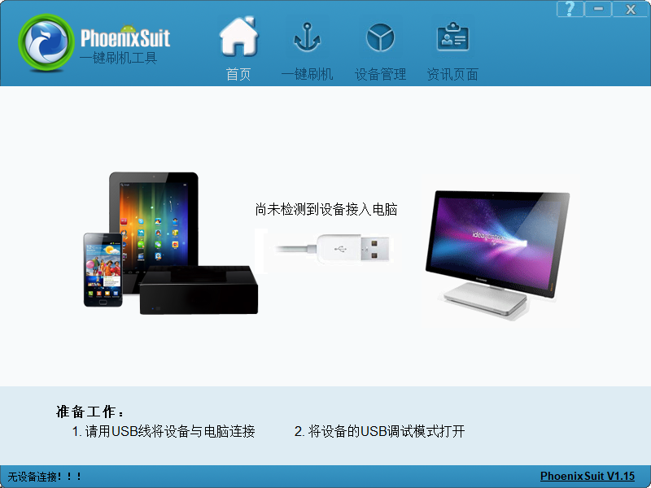
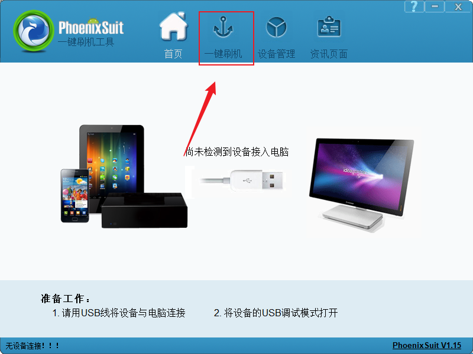
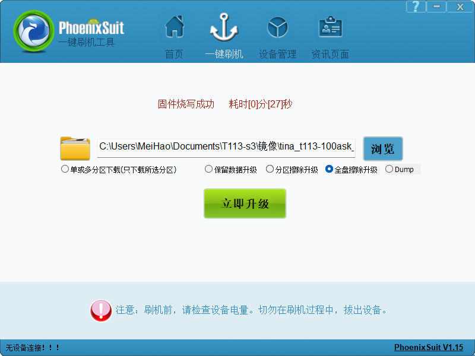
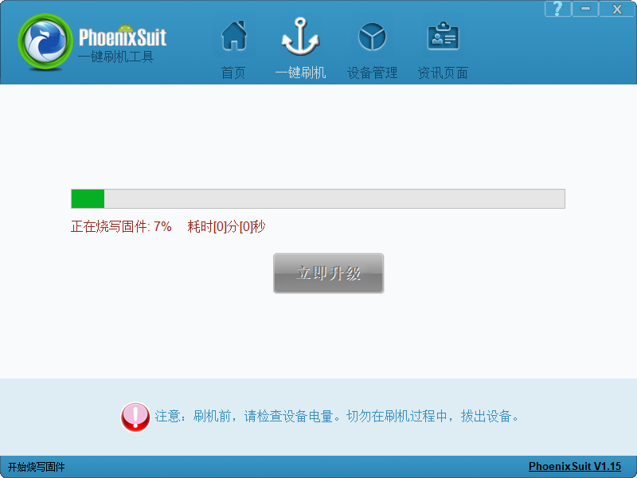

# 开发环境搭建

### 获取TinaSDK源码

查看上面源码工具文档手册，下载TinaSDK源码：

Tina-SDKV2.0源码网盘链接：https://pan.baidu.com/s/13uKlqDXImmMl9cgKc41tZg?pwd=qcw7
T113-Pro开发板扩展补丁： https://github.com/DongshanPI/100ASK_T113-Pro_TinaSDK

上传到ubuntu，创建文件夹用来保存源码：

~~~bash
ubuntu@ubuntu1804:~$ mkdir Tina_SDK
ubuntu@ubuntu1804:~$ cd Tina_SDK/
ubuntu@ubuntu1804:~/Tina_SDK$ tree -L 1
.
├── tina-d1-h.tar.bz2.00
├── tina-d1-h.tar.bz2.01
├── tina-d1-h.tar.bz2.02
├── tina-d1-h.tar.bz2.03
├── tina-d1-h.tar.bz2.04
├── tina-d1-h.tar.bz2.05
├── tina-d1-h.tar.bz2.06
├── tina-d1-h.tar.bz2.07
└── tina-d1-h.tar.bz2.08

0 directories, 9 files
~~~

查看所有文件MD5校验值：

~~~ bash
ubuntu@ubuntu1804:~/Tina_SDK$ md5sum tina-d1-h.tar.bz2.*
e755bae00cd76afc3fb276b4e3fd86ba  tina-d1-h.tar.bz2.00
cb60ecfdb51c624ff3cbd7b24552866f  tina-d1-h.tar.bz2.01
54e56a4cf1cef46ca0a94b85ea1d33a1  tina-d1-h.tar.bz2.02
4988fa08827c0f7af2dc170145e24b26  tina-d1-h.tar.bz2.03
a0463bcf8e73db27b5ecafaac593a919  tina-d1-h.tar.bz2.04
a87382ca16a8c12b3a94f1cad99ce77e  tina-d1-h.tar.bz2.05
5973530baa3b282108351818641c27fd  tina-d1-h.tar.bz2.06
ccd63e1d16534b364a101d2d44416261  tina-d1-h.tar.bz2.07
e0d72713565f4424ea43c07e15a38139  tina-d1-h.tar.bz2.08
~~~

确保校验值对上。否则需要重新上传。

解压源码：

~~~bash
ubuntu@ubuntu1804:~/Tina_SDK$ cat tina-d1-h.tar.bz2.* | tar -jxv
~~~

等待一段时间，即可解压完成。

~~~bash
ubuntu@ubuntu1804:~/Tina_SDK$ tree -L 1
.
├── tina-d1-h
├── tina-d1-h.tar.bz2.00
├── tina-d1-h.tar.bz2.01
├── tina-d1-h.tar.bz2.02
├── tina-d1-h.tar.bz2.03
├── tina-d1-h.tar.bz2.04
├── tina-d1-h.tar.bz2.05
├── tina-d1-h.tar.bz2.06
├── tina-d1-h.tar.bz2.07
└── tina-d1-h.tar.bz2.08

1 directory, 9 files
ubuntu@ubuntu1804:~/Tina_SDK$ mv tina-d1-h ../
~~~

获取扩展支持仓库，然后加以应用：

~~~bash
ubuntu@ubuntu1804:~$ git clone https://github.com/DongshanPI/100ASK_T113s3-Industrial-Devkit_TinaSDK
ubuntu@ubuntu1804:~$ cd 100ASK_T113s3-Industrial-Devkit_TinaSDK/
ubuntu@ubuntu1804:~/100ASK_T113s3-Industrial-Devkit_TinaSDK$ ls
device  lichee  package  prebuilt  README.md  target
ubuntu@ubuntu1804:~/100ASK_T113s3-Industrial-Devkit_TinaSDK$ git submodule update --init
ubuntu@ubuntu1804:~/100ASK_T113s3-Industrial-Devkit_TinaSDK$ cp ./* -rfvd ~/tina-d1-h
~~~

编译固件之前，先安装一些依赖，否则编译会报错：

~~~bash
sudo apt-get install build-essential subversion git libncurses5-dev zlib1g-dev gawk flex quilt libssl-dev xsltproc libxml-parser-perl mercurial bzr ecj cvs unzip lib32z1 lib32z1-dev lib32stdc++6 libstdc++6 libc6:i386 libstdc++6:i386 lib32ncurses5 lib32z1 -y
~~~

### 编译出固件

进入源码目录，执行：

~~~bash
ubuntu@ubuntu1804:~$ cd tina-d1-h/
ubuntu@ubuntu1804:~/tina-d1-h$ source build/envsetup.sh 
Setup env done! Please run lunch next.
ubuntu@ubuntu1804:~/tina-d1-h$ lunch

You're building on Linux

Lunch menu... pick a combo:
     1. d1-h_nezha_min-tina
     2. d1-h_nezha-tina
     3. d1s_cvbs-tina
     4. d1s_nezha-tina
     5. t113_100ask-tina

Which would you like? [Default t113_100ask]: 5
============================================
TINA_BUILD_TOP=/home/ubuntu/tina-d1-h
TINA_TARGET_ARCH=arm
TARGET_PRODUCT=t113_100ask
TARGET_PLATFORM=t113
TARGET_BOARD=t113-100ask
TARGET_PLAN=100ask
TARGET_BUILD_VARIANT=tina
TARGET_BUILD_TYPE=release
TARGET_KERNEL_VERSION=5.4
TARGET_UBOOT=u-boot-2018
TARGET_CHIP=sun8iw20p1
============================================
clean buildserver
[1] 24251
ubuntu@ubuntu1804:~/tina-d1-h$ make
...
#### make completed successfully (01:16 (mm:ss)) ####
ubuntu@ubuntu1804:~/tina-d1-h$ pack
~~~

打包成功后，镜像文件保存在`/home/ubuntu/tina-d1-h/out/t113-100ask/tina_t113-100ask_uart3.img`。

### 烧录固件

把镜像文件传到PC端，打开全志线刷工具 **AllwinnertechPhoeniSuit**，找到**PhoenixSuit.exe** ，双击运行：

选择`一键刷机`:

找到镜像路径，选择全盘擦除升级：

点击完成后，不需要其他界面操作，这时拿起已经连接好的开发板，先按住 **FEL** 烧写模式按键，之后按一下 **RESET** 系统复位键，就可以自动进入烧写模式并开始烧写。

串口打印信息，如下：

~~~bash
...
insmod: can't insert '/lib/modules/5.4.61/xr829.ko': Operation timed out
Successfully initialized wpa_supplicant
Could not read interface wlan0 flags: No such device
nl80211: Driver does not support authentication/association or connect commands
nl80211: deinit ifname=wlan0 disabled_11b_rates=0
Could not read interface wlan0 flags: No such device
wlan0: Failed to initialize driver interface
------run rc.final file-----
numid=30,iface=MIXER,name='Headphone Switch'
  ; type=BOOLEAN,access=rw------,values=1
  : values=on

BusyBox v1.27.2 () built-in shell (ash)

------run profile file-----
 _____  _              __     _
|_   _||_| ___  _ _   |  |   |_| ___  _ _  _ _
  | |   _ |   ||   |  |  |__ | ||   || | ||_'_|
  | |  | || | || _ |  |_____||_||_|_||___||_,_|
  |_|  |_||_|_||_|_|  Tina is Based on OpenWrt!
 ---------------------------[    9.916991] file system registered
-------------------
 Tina Linux (Neptune, 61CC0487)
 ----------------------------------------------
Mon Feb  6 00:00:00 GMT 2023
nodev   debugfs
root@TinaLinux:/# [    9.941016] configfs-gadget 4100000.udc-controller: failed to start g1: -19
sh: write error: No such device
[   11.008518] sunxi_usb_udc 4100000.udc-controller: 4100000.udc-controller supply udc not found, using dummy regulator
[   11.024290] read descriptors
[   11.027508] read strings
[   11.254062] android_work: sent uevent USB_STATE=CONNECTED
[   11.471404] configfs-gadget gadget: high-speed config #1: c
[   11.477684] android_work: sent uevent USB_STATE=CONFIGURED
[   11.498279] android_work: sent uevent USB_STATE=DISCONNECTED
[   11.555679] android_work: sent uevent USB_STATE=CONNECTED

root@TinaLinux:/#
~~~