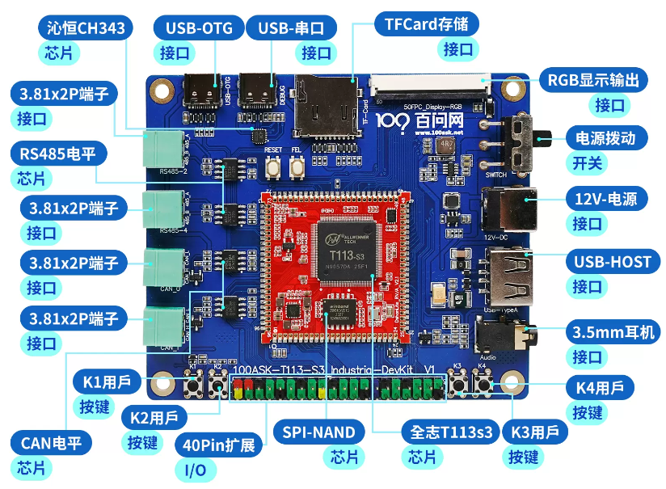

# TinaSDKV2.0 Kernel基本开发

Tina-SDK Linux系统启动流程：


## Linux Kerenl目录结构

### 设备树配置文件位置

- 100ASK_T113s3-Industrial-DevKit开发板LinuxKernel配置文件： **device/config/chips/t113/configs/100ask/linux/config-5.4**


- 100ASK_T113s3-Industrial-DevKit开发板LinuxKernel设备树文件： **device/config/chips/t113/configs/100ask/board.dts**


可以在tina-sdk source后，在tina-sdk任意目录内执行 `cconfigs`命令直接切换到板级 Linux 设备树 和 配置文件目录。


- 100ASK_T113s3-Industrial-DevKit开发板设备树 board.dts 父级设备树名称 `sun8iw20p1.dtsi`


### 内核源码位置

- Linux-5.4内核源码：**lichee/linux-5.4**


可以在tina-sdk source后，在tina-sdk任意目录内执行 `ckernel`命令直接切换到linux内核源码目录下。


- 100ASK_T113s3-Industrial-DevKit开发板父级设备树  `sun8iw20p1.dtsi`所在位置  **lichee/linux-5.4/arch/arm/boot/dts**


可以在tina-sdk source后，在tina-sdk任意目录内执行 `cdts`命令直接切换到linux内核源码设备树目录下。


### env环境变量

- 100ASK_T113s3-Industrial-DevKit开发板启动环境变量：**device/config/chips/t113/configs/100ask/env.cfg**


### 设备树打包

boot_package.cfg 文件描述了，Linux内核设备树所在位置。

1. 为了在启动内核前更新参数到内核dts 和可以在U-Boot 控制台查看修改dts。按阶段划分可以分为使用内部dts 阶段和使用内核dts 阶段。如下图所示。


2. 可以通过命令set_working_fdt来切换当前生效的fdt。

```shell
[04.562]update bootcmd
[04.576]change working_fdt 0x7bebee58 to 0x7be8ee58
[04.587]update dts
Hit any key to stop autoboot: 0
=> set
set_working_fdt setenv setexpr
=> set_working_fdt 0x7bebee58
change working_fdt 0x7be8ee58 to 0x7bebee58
=>
```

> 参考：D1-H_Tina_Linux_U-Boot_开发指南.pdf

## 单独编译Linux

在TinaSDK内，单独编译LinuxKernel 只需要在源码 根 目录下执行 ` mkernel`命令即可开始针对于 kernel的编译操作，这里需要注意的是，mkernel  命令默认是没有生效的，您如果关闭了之前编译的终端/host系统，则需要重新 执行 `source build/envsetup.sh `命令来初始化 TinaSDK的编译环境。并且因为缓存问题，强烈建议 你 执行`make clean` 后执行，`lunch `命令，输入 4  重新选择我们的 **4. t113_100ask-tina** 单板 

``` shell
ubuntu@ubuntu1804:~/tina-d1-h$ source build/envsetup.sh 
Setup env done! Please run lunch next.
ubuntu@ubuntu1804:~/tina-d1-h$ lunch 

You're building on Linux

Lunch menu... pick a combo:
     1. d1-h_nezha_min-tina
     2. d1-h_nezha-tina
     3. d1s_nezha-tina
     4. t113_100ask-tina

Which would you like? [Default t113_100ask]: 4
============================================
TINA_BUILD_TOP=/home/ubuntu/tina-d1-h
TINA_TARGET_ARCH=arm
TARGET_PRODUCT=t113_100ask
TARGET_PLATFORM=t113
TARGET_BOARD=t113-100ask
TARGET_PLAN=100ask
TARGET_BUILD_VARIANT=tina
TARGET_BUILD_TYPE=release
TARGET_KERNEL_VERSION=5.4
TARGET_UBOOT=u-boot-2018
TARGET_CHIP=sun8iw20p1
============================================
clean buildserver
[2]+  Killed                  $T/tools/build/buildserver --path $T 2> /dev/null 1>&2
[1] 49529
ubuntu@ubuntu1804:~/tina-d1-h$ 
```

### 单独编译kernel

前面介绍，在TinaSDK 环境内，单独编译 Linux kernel只需要 `mkernel`一个命令即可，如下图所示：

```shell
ubuntu@ubuntu1804:~/tina-d1-h$ mkernel
===This's tina environment.===
special target, skip mboot,marisc
make[1]: Entering directory '/home/ubuntu/tina-d1-h'
make[2]: Entering directory '/home/ubuntu/tina-d1-h/target/allwinner'
make[3]: Entering directory '/home/ubuntu/tina-d1-h/target/allwinner/t113-100ask'
/home/ubuntu/tina-d1-h/scripts/kconfig.pl  + /home/ubuntu/tina-d1-h/target/allwinner/generic/config-5.4 /home/ubuntu/tina-d1-h/device/config/chips/t113/configs/100ask/linux/config-5.4 > /home/ubuntu/tina-d1-h/out/t113-100ask/compile_dir/target/linux-t113-100ask/linux-5.4.61/.config.target
awk '/^(#[[:space:]]+)?CONFIG_KERNEL/{sub("CONFIG_KERNEL_","CONFIG_");print}' /home/ubuntu/tina-d1-h/.config >> /home/ubuntu/tina-d1-h/out/t113-100ask/compile_dir/target/linux-t113-100ask/linux-5.4.61/.config.target
echo "# CONFIG_KALLSYMS_EXTRA_PASS is not set" >> /home/ubuntu/tina-d1-h/out/t113-100ask/compile_dir/target/linux-t113-100ask/linux-5.4.61/.config.target
echo "# CONFIG_KALLSYMS_ALL is not set" >> /home/ubuntu/tina-d1-h/out/t113-100ask/compile_dir/target/linux-t113-100ask/linux-5.4.61/.config.target
echo "CONFIG_KALLSYMS_UNCOMPRESSED=y" >> /home/ubuntu/tina-d1-h/out/t113-100ask/compile_dir/target/linux-t113-100ask/linux-5.4.61/.config.target
/home/ubuntu/tina-d1-h/scripts/metadata.pl kconfig /home/ubuntu/tina-d1-h/tmp/.packageinfo /home/ubuntu/tina-d1-h/.config 5.4 > /home/ubuntu/tina-d1-h/out/t113-100ask/compile_dir/target/linux-t113-100ask/linux-5.4.61/.config.override
/home/ubuntu/tina-d1-h/scripts/kconfig.pl 'm+' '+' /home/ubuntu/tina-d1-h/out/t113-100ask/compile_dir/target/linux-t113-100ask/linux-5.4.61/.config.target /dev/null /home/ubuntu/tina-d1-h/out/t113-100ask/compile_dir/target/linux-t113-100ask/linux-5.4.61/.config.override > /home/ubuntu/tina-d1-h/out/t113-100ask/compile_dir/target/linux-t113-100ask/linux-5.4.61/.config.set
......
rm -f /home/ubuntu/tina-d1-h/out/t113-100ask/rootfs.img
rm -f /home/ubuntu/tina-d1-h/out/t113-100ask/usr.img
dd if=/home/ubuntu/tina-d1-h/out/t113-100ask/compile_dir/target/linux-t113-100ask/root.squashfs of=/home/ubuntu/tina-d1-h/out/t113-100ask/rootfs.img bs=128k conv=sync
282+1 records in
283+0 records out
37093376 bytes (37 MB, 35 MiB) copied, 0.0216129 s, 1.7 GB/s
( cd /home/ubuntu/tina-d1-h/out/t113-100ask ; find -maxdepth 1 -type f \! -name 'md5sums'  -printf "%P\n" | sort | xargs md5sum --binary > md5sums )
( cd /home/ubuntu/tina-d1-h/out/t113-100ask ; find -maxdepth 1 -type f \! -name 'md5sums'  -printf "%P\n" | sort | xargs openssl dgst -sha256 > sha256sums )
make[4]: Leaving directory '/home/ubuntu/tina-d1-h/target/allwinner/generic/image'
make[3]: Leaving directory '/home/ubuntu/tina-d1-h/target/allwinner/t113-100ask'
make[2]: Leaving directory '/home/ubuntu/tina-d1-h/target/allwinner'
make[1]: Leaving directory '/home/ubuntu/tina-d1-h'

#### make completed successfully (25 seconds) ####

```

如果你得 kernel没有修改，整个编译过程非常快，TinaSDK系统默认会检查配置文件，看是否有改动，如果有改动，则会编译改动位置，如果无改动，就会直接跳过进行后续的头处理 打包处理。

### Kconfig 配置方法
如果你需要修改内核配置项，可以在TinaSDK源码目录下执行 `make kernel_menuconfig`命令来进入到 内核的菜单选项界面。

对于menuconfig是一种图形化配置工具，这里以 `kernel menuconfig` 作为例子，讲解如何使用 Kconfig 基础配置方法。

首先我们进入 `kernel menuconfig`

```
make kernel_menuconfig
```
```shell
ubuntu@ubuntu1804:~/tina-d1-h$ make kernel_menuconfig
===This's tina environment.===
special target, skip mboot,marisc
export MAKEFLAGS= ;make V=ss -C target/allwinner menuconfig
make[1]: Entering directory '/home/ubuntu/tina-d1-h/target/allwinner'
make[2]: Entering directory '/home/ubuntu/tina-d1-h/target/allwinner/t113-100ask'
rm -f /home/ubuntu/tina-d1-h/out/t113-100ask/compile_dir/target/linux-t113-100ask/linux-5.4.61/.config.prev
rm -f /home/ubuntu/tina-d1-h/out/t113-100ask/compile_dir/target/linux-t113-100ask/linux-5.4.61/.configured
/home/ubuntu/tina-d1-h/scripts/kconfig.pl  + /home/ubuntu/tina-d1-h/target/allwinner/generic/config-5.4 /home/ubuntu/tina-d1-h/device/config/chips/t113/configs/100ask/linux/config-5.4 > /home/ubuntu/tina-d1-h/out/t113-100ask/compile_dir/target/linux-t113-100ask/linux-5.4.61/.config
export MAKEFLAGS= ;make -C /home/ubuntu/tina-d1-h/out/t113-100ask/compile_dir/target/linux-t113-100ask/linux-5.4.61 -C /home/ubuntu/tina-d1-h/out/t113-100ask/compile_dir/target/linux-t113-100ask/linux-5.4.61 HOSTCFLAGS="-O2 -I/home/ubuntu/tina-d1-h/out/host/include -I/home/ubuntu/tina-d1-h/out/host/usr/include  -Wall -Wmissing-prototypes -Wstrict-prototypes" CROSS_COMPILE="arm-openwrt-linux-muslgnueabi-" ARCH="arm" KBUILD_HAVE_NLS=no KBUILD_BUILD_USER="" KBUILD_BUILD_HOST="" CONFIG_SHELL="bash" V=''  CC="arm-openwrt-linux-muslgnueabi-gcc" menuconfig
make[3]: Entering directory '/home/ubuntu/tina-d1-h/lichee/linux-5.4'
--define-variable argument does not have a value for the variable
--define-variable argument does not have a value for the variable
scripts/kconfig/mconf  Kconfig
configuration written to .config

*** End of the configuration.
*** Execute 'make' to start the build or try 'make help'.

make[3]: Leaving directory '/home/ubuntu/tina-d1-h/lichee/linux-5.4'
make[2]: Leaving directory '/home/ubuntu/tina-d1-h/target/allwinner/t113-100ask'
make[1]: Leaving directory '/home/ubuntu/tina-d1-h/target/allwinner'

#### make completed successfully (6 seconds) ####

```
这里就是 `kernel menuconfig` 的主目录。其具体的操作方法如下图所示。


我们再进入较为常用的 `Device Driver` ，看一下各个符号的含义。


其中，可以使用 `空格键` 选中各个选项，这里以 `Multimedia support` 选项为例：


也可以使用 `Y` `M` `N` 键来修改选项：


遇到被其他依赖选择的选项，可以查看 Help 页面检查被什么选项所依赖。


进入 Help 页面后，便可以查看这个选项的依赖情况。需要注意的是，有些选项是作为底层依赖无法随意取消，例如这里示例的 `Hardware Monitoring support` 选项。


Kconfig 所创建的界面还有一个功能，就是搜索功能，方便快速的找到目标选项。这里以搜索 LCD 屏幕 `icn6202` 驱动为例。

在 Kconfig 的界面中按 `/` 键，进入搜索页面。


### Kconfig修改配置示例

调整 kernel打印等级默认为7


默认不知道 kernel的printk打印等级配置在哪里，通过搜索得到路径，上面那个  Enable support for printk 并不是 我们要找到的 调整系统默认打印等级的配置项。继续往下，找到了 一个 Delay each boot printk message by N milliseconds 通过查看这个也不是，这个配置和是 用来 调整 因为系统信息显示过快 而 调整 每个 printk的打印间隔时间的。

还有一个 Early printk  看着类似，但是也不是，不过我们可以大概 知道 是在  Kernel hacking这个 类目内，


CONFIG_MESSAGE_LOGLEVEL_DEFAULT


### 打包kernel

编译完成后，执行 `pack` 命令即可开始打包系统操作，打包完成后，最后会 提示 **pack finish** 以及使用 红色背景色 告诉你 最终输出的镜像文件。

我们通过 ssh / vmware 拖拽等工具，将其 copy 出来即可。


### 烧写更新

根据之前烧写的文章进行镜像烧录操作。

### 启动验证

启动系统后，执行 `cat /proc/sys/kernel/printk`来查看系统默认是否已经把 printk 打印等级调整到了最高。如果如下图 红色箭头 7 所示，就表示已经成功。


## 增加一个已有的内核模块

7寸1024x600分辨率+电容触摸屏：https://item.taobao.com/item.htm?id=611156659477&

### 查看原理图


通过对比原理图，可以得到触摸屏信号和主控 对应的引脚关系为如下表格所示：

| 电路图引脚标号 | T113s3引脚名 |
| -------------- | ------------ |
| CTP_INT        | PE1          |
| CTP_RST        | PE0          |
| RPI_SCL        | PE12         |
| RPI_SDA        | PE13         |

> 注意：此内容假设您已经了解I2C驱动开发，熟悉input子系统，可以看懂电路图等基础，如果不具备 建议 观看 韦老师的视频 I2C子系统开发 https://ldd.100ask.net/04_I2C/01/     Input子系统开发： https://ldd.100ask.net/05_Input/04_5/ 
>
> 全志TinaSDK TWI 开发参考文档： https://tina.100ask.net/SdkModule/Linux_TWI_DevelopmentGuide-01/

通过查看数据手册  **T113-s3_datasheet_v1.6.pdf**  P41 可以看出来，PE12 PE13  复用模式为 function2 时为 I2c(全志这里叫TWI) ，由此 我们知道 需要在内核设备树内 twi2 节点下进行初始化，并增加 gt911 触摸设备书节点。


### 确认设备树

> TinaSDK dts设备树语法定义使用等可以参考文档： https://tina.100ask.net/SdkModule/Linux_Deploy_DevelopmentGuide-03/  如果希望深入学习 dts 可以参考视频深入学习 https://www.100ask.net/video/detail/p_5e61a9f374112_5P2wQoy0

在最开始我们知道内核的设备树文件在  **device/config/chips/t113/configs/100ask/**  目录下，名为  board.dts ，通过 vim /gedit等工具编译 board.dts文件

1. 先找到 引脚定义 `&pio `节点，在里面添加 **twi2**  引脚复用，把PE12 PE13 复用为 twi2 模式。
2. 在底部增加 &twi2  节点路径，并参考其他节点设置，将其启用。
3. 节点内 增加 我们的gt911 触摸屏的触摸设备节点，并根据节点属性 和实际的 屏幕参数 添加对应值，需要 注意 **ctp_int_port** 就是我们的 **CTP_INT** 引脚，**ctp_wakeup** 就是我们原理图上 **CTP_RST** 引脚。
4. 保存后，退出即可，**需要注意的是，如果您自行添加 类似的触摸屏节点，则需要检查一下 你增加的 设备树节点 引脚 是否和默认的存在冲突，如果存在冲突需要解决后 才能正确添加并使用**。


```shell
&pio {
		twi2_pins_a: twi2@0 {
                pins = "PE12", "PE13";
                function = "twi2";
                drive-strength = <10>;
        };

        twi2_pins_b: twi2@1 {
                pins = "PE12", "PE13";
                function = "gpio_in";
        };
};
```


``` shell
&twi2 {
        clock-frequency = <400000>;
        pinctrl-0 = <&twi2_pins_a>;
        pinctrl-1 = <&twi2_pins_b>;
        pinctrl-names = "default", "sleep";
        dmas = <&dma 45>, <&dma 45>;
        dma-names = "tx", "rx";
        status = "okay";

        ctp@14 {
                compatible = "allwinner,goodix";
                device_type = "ctp";
                reg = <0x14>;
                status = "okay";
                ctp_name = "gt9xxnew_ts";
                ctp_twi_id = <0x2>;
                ctp_twi_addr = <0x14>;
                ctp_screen_max_x = <0x400>;
                ctp_screen_max_y = <0x258>;
                ctp_revert_x_flag = <0x0>;
                ctp_revert_y_flag = <0x0>;
                ctp_exchange_x_y_flag = <0x0>;
                ctp_int_port = <&pio PE 1 GPIO_ACTIVE_HIGH>;
                ctp_wakeup = <&pio PE 0 GPIO_ACTIVE_HIGH>;
        };
};
```


​	在TinaSDK 内Linux kernel的设备树 会默认和 boot0  uboot optee保存在一起，以便加速启动，所以 没有办法 单独编译设备树，去打包升级，我们只能通过在TinaSDK目录下使用  make 命令 来打包整个系统 系统会自动帮你编译 Linux设备树文件。

### 配置内核模块

在上一章节，介绍了如何使用Kconfig修改配置，举例使用在 tina-sdk 源码目录下 通过 `make kernel_menuconfig`命令直接进入内核菜单选项，进行配置内核选项，但是这种做法，只能保证本次编译有效，一旦使用了 make distclean 或者 make clean 过内核源码目录缓存，配置就会失效。

在TinaSDK 里面，整套编译系统框架基于 openwrt 14版本进行扩展支持，所以在内核选项配置层面，也延续了 原有的编译修改方式。如果我们需要修改内核配置项，并保存生效，则需要了解清楚openwrt对内核模块/配置文件是如何进行处理的。

----

内核默认配置文件在 `device/config/chips/t113/configs/100ask/linux/`目录下，一般情况下原厂提供SDK都会提供，默认的config文件和 tinasdk的关联性很强，一般情况下不能直接去 修改这里的 config文件，修改过后导致你编译kernel时出现很多选项依赖问题。

如果遇到修改内核配置并保存，我们应该如何操作呢？


如下所示，我们以增加 选择 默认支持的 gt911驱动模块为例，不使用` make kernel_menuconfig`进入内核菜单配置界面，而是直接在 TinaSDK源码根目录下 执行 `make  menuconfig` 进入 到 kernel modules 一层层找到 我们的 驱动模块。

你可以理解为 TinaSDK 帮我们提前把 模块之间的依赖都处理好了，我们只需要选择 使用那个模块就可以。


如上所示，TinaSDK提前帮我们把内核模块配置项依赖关系帮我们处理好了，那么在哪里处理呢？  对于我们的100ASK_T113s3-Industrial-DevKit开发板 在 **target/allwinner/t113-common/**目录内  这里有个 **modules.mk** 文件。


打开 **modules.mk**文件 找到 gt911驱动模块驱动的TinaSDK选项位置，可以看到如下图所示，系统已经帮我们提前配置好了 这个模块的依赖关系，以及生成的模块驱动，我们只需要 在TinaSDK config内选中就可以直接用了。


配置成功后，保存推出主界面，就可以继续执行 `make `命令来完整的编译系统了。

### 编译打包 

编译完成后，执行 `pack` 命令即可开始打包系统操作，打包完成后，最后会 提示 **pack finish** 以及使用 红色背景色 告诉你 最终输出的镜像文件。

我们通过 ssh / vmware 拖拽等工具，将其 copy 出来即可。


### 烧录更新

根据之前烧写的文章进行镜像烧录操作。

### 重启验证

首先：确保屏幕和100ASK_T113s3-Industrial-DevKit 开发板 fpc连接好,屏幕背光启动后会自动亮，等待系统启动，

启动过程中，可以看到 一些 关于gt9xx 模块的装载信息


当一个系统内有很多input输入设备在dev目录下可看到很多个 event 节点，我们不知道设备之间对应关系，就可以执行 `cat /proc/bus/input/devices` 来查看你得设备具体对应的 event节点是那个。


通过下图，列出了系统所有的input 设备，可以看到 蓝框所示，是我们的 gt9xx驱动模块，对应的 event节点是2.


此时通过 `cat  /dev/input/event2`命令，同时手放在触摸屏上，就可以看到触摸驱动已经正常，硬件也正常，但是我们现在没有 tslib / ui工具来验证 坐标是否和实物一致，后期可以通过 libinput evtest等开源工具进行验证。


## 增加按键驱动

以开发板上 K1 K2 K3 K4 为例，通过查看原理图，增加设备树， 增加驱动支持，编译烧写启动，通过 getevent  验证。

### 查看开发板硬件接口

参考底板原理图：[T113-S3_Industrial-DevKit_V11.pdf](https://dl.100ask.net/Hardware/MPU/T113s3-Industrial/T113-S3_Industrial-DevKit_V11.pdf)


对应开发板 实物图



### GPADC

GPADC（General Purpose Analog to Digital Converter）是指高精度数模转换模块，拥有12bit分辨率，8位采集精度。模拟输入范围0~1.8V，最高采样率1MHz。

GPADC 驱动路径：

~~~bash
/home/ubuntu/tina-d1-h/lichee/linux-5.4/drivers/input/sensor/sunxi_gpadc.c
/home/ubuntu/tina-d1-h/lichee/linux-5.4/drivers/input/sensor/sunxi_gpadc.h
~~~

### GPADC硬件介绍


AVCC 为 1.8V 电源供电，通过一个电阻串联到GPADC的按键组。按键通过不同阻值的电阻相连接，按下不同的按键，GPADC0 口的电压不同，CPU 通过对这个电压的采样来决定具体是哪一个按键被按下。上图按键与电压的对应关系如下表所示：

| 0.21V | 0.41V | 0.59V | 0.75V |
| :---- | :---- | :---- | :---- |
| VOL+  | VOL-  | MENU  | ENTER |

当按键按下时，会触发 GPADC 模块的中断，CPU 会采集 GPADC 的数据，采集到的数据转换成相应的键值之后通过 input 子系统上传到 `/dev/input/event` 节点，程序便可以从相应的节点获取数据。

### GPADC软件介绍

**设备树配置：**

GPADC 的设备树配置分为两个部分：

第一部分包括基础的寄存器配置、设备驱动绑定配置和时钟中断配置。这一部分的配置位于 `linux-5.4/arch/arm/boot/dts/sun8iw20p1.dtsi` 文件内。**这一部分通常不需要修改。**

~~~bash
gpadc: gpadc@2009000 {
        compatible = "allwinner,sunxi-gpadc";
        reg = <0x0 0x02009000 0x0 0x400>;
        interrupts = <GIC_SPI 57 IRQ_TYPE_LEVEL_HIGH>;
        clocks = <&ccu CLK_BUS_GPADC>;
        clock-names = "bus";
        resets = <&ccu RST_BUS_GPADC>;
        status = "okay";
};
~~~

第二部分包括采样相关的配置，键值，电压数据等等，在 `config/chips/t113/configs/100ask_devkit/linux-5.4/board.dts` 文件内

~~~bash&gpadc {
&gpadc {
        channel_num = <1>;
        channel_select = <0x1>;
        channel_data_select = <0>;
        channel_compare_select = <0x1>;
        channel_cld_select = <0x1>;
        channel_chd_select = <0>;
        channel0_compare_lowdata = <1700000>;
        channel0_compare_higdata = <1200000>;
        channel1_compare_lowdata = <460000>;
        channel1_compare_higdata = <1200000>;
        key_cnt = <5>;
        key0_vol = <210>;
        key0_val = <115>;
        key1_vol = <410>;
        key1_val = <114>;
        key2_vol = <590>;
        key2_val = <119>;
        key3_vol = <750>;
        key3_val = <373>;
        key4_vol = <880>;
        key4_val = <28>;
        status = "okay";
};
~~~

**内核驱动配置：**

`make kernel_menuconfig` 进入内核配置界面，找到`Device Drivers`，进入。


找到 `Input device support `，进入。


找到 `Sensors` 空格勾选并进入。


空格选中 `<*> sunxi gpadc driver support` ，保存并退出配置页面。


之后编译内核，打包烧录即可。

烧写方式 有两种，一种是线刷，使用 `PhoenixSuit` 将编译生成的镜像烧录至 spi nand 存储设备上，另一种是通过 [PhoenixCard-V2.8](https://gitlab.com/dongshanpi/tools/-/raw/main/PhoenixCard-V2.8.zip) 工具将系统镜像烧录至TF卡启动。 我们推荐使用 线刷 烧录至 spi nand 方便快速实验。

参考文档：https://allwinner-docs.100ask.net/Board/100ASK_T113-PRO/03-1_FlashSystem.html

参考视频：https://www.bilibili.com/video/BV1Nx4y1w7AF/?p=11&share_source=copy_web&vd_source=e3bf42462ab8667ad5a5469f71947458

### 测试 GPADC

`make menuconfig` 进入 openWrt 配置页面，找到 `getevent` 软件包。


之后编译打包烧录到开发板上，运行 `getevent`，可以看到`sunxi-gpadc`。此时按下按键，可以看到按键键值显示出来了。


烧写方式 有两种，一种是线刷，使用 `PhoenixSuit` 将编译生成的镜像烧录至 spi nand 存储设备上，另一种是通过 [PhoenixCard-V2.8](https://gitlab.com/dongshanpi/tools/-/raw/main/PhoenixCard-V2.8.zip) 工具将系统镜像烧录至TF卡启动。 我们推荐使用 线刷 烧录至 spi nand 方便快速实验。

参考文档：https://allwinner-docs.100ask.net/Board/100ASK_T113-PRO/03-1_FlashSystem.html

参考视频：https://www.bilibili.com/video/BV1Nx4y1w7AF/?p=11&share_source=copy_web&vd_source=e3bf42462ab8667ad5a5469f71947458
