# TinaSDKV2.0 自定义系统开发

## 什么是自定义系统？

## TinaSDK Kconfig界面配置

Tina Linux采用 Kconfig 机制对 SDK 和内核进行配置。

Kconfig 是一种固定格式的配置文件。Linux 编译环境中的 menuconfig 程序可以识别这种格式的配置文件，并提取出有效信息生成可视化的配置菜单。

Tina Linux 包含两个 menuconfig，一个是对内核进行管理和配置的 `kernel_menuconfig`，一个是对软件包进行管理和配置的 `Tina menuconfig`。

### kernel menuconfig

在 `Tina Linux` 的配置环境中配置好环境变量进入可编译状态后，输入

```
make kernel_menuconfig
```

即可进入 `kernel menuconfig` 配置菜单。

配置菜单源文件为：

```
/home/ubuntu/tina-d1-h/device/config/chips/t113/configs/100ask/linux #t113和100ask分别为芯片名和实际方案名，根据当前选择的编译方案决定
```

输出 `cconfig` 可快速转跳到该目录。

### Tina menuconfig

在 `Tina Linux` 的配置环境中配置好环境变量进入可编译状态后，输入

```
make menuconfig
```

即可进入Tina menuconfig配置菜单。

配置菜单源文件为  **target/allwinner/t113-100ask/defconfig**  ：

```
ubuntu@ubuntu1804:~/tina-d1-h/target/allwinner/t113-100ask$ ls
base-files  BoardConfig.mk  busybox-init-base-files  defconfig  defconfig_ota  Makefile  modules.mk  swupdate  t113_100ask.mk  TinaProducts.mk  vendorsetup.s
```

输出 `cdevice` 可快速转跳到该目录。


## 增加自定义程序到系统内

### 确定系统的init服务

通过 make menuconfig方式 来确认 自己系统默认的init服务是哪一个。


通过查看TinaSDk系统默认的 defconfig 找到**INIT**选项，（配置文件在 **target/allwinner/t113-100ask** 目录可以使用 `cdevice` 快捷命令）。

通过查看那个使能来确定是busybox-init 还是 proc init  由此我们可以知道自己的程序 需要添加到那个TinaSDK rootfs覆盖目录内，才能打包成功。


通过查看配置文件/选项可以知道 我们使用的是busybox- init 其中rootfs覆盖文件夹在   **target/allwinner/t113-100ask/busybox-init-base-files** 目录内。


```shell
ubuntu@ubuntu1804:~/tina-d1-h/target/allwinner/t113-100ask/busybox-init-base-files$ tree
.
├── bin
│   └── setusbconfig
└── etc
    ├── asound.conf
    ├── device.prop
    ├── init.d
    │   ├── adbd
    │   ├── load_script.conf
    │   ├── rc.final
    │   ├── rcK
    │   ├── rc.modules
    │   ├── rc.preboot
    │   ├── S00mpp
    │   ├── S01logging
    │   ├── S10udev
    │   ├── S11dev
    │   ├── S20urandom
    │   ├── S40network
    │   ├── S41netparam
    │   └── S50telnet
    ├── inittab
    ├── profile
    ├── swupdate_public.pem
    ├── udhcpd.conf
    └── wpa_supplicant.conf

3 directories, 22 files
```

### 添加一个自定义hellowrod

```c
#include <stdio.h>

int main(int argc, char const *argv[])
{
    printf("Hello World TinaSDK V2.0\n");
    return 0;
}
```


使用TinaSDK GCC编译

```she
~/tina-d1-h/prebuilt/gcc/linux-x86/arm/toolchain-sunxi-musl/toolchain/bin/arm-openwrt-linux-gcc helloword.c  -o helloword
```


将目标可执行程序 复制到  busybox-init rootfs覆盖目录内，因为是一个 可执行程序，所以直接复制到 bin目录

```
 cp helloword  tina-d1-h/target/allwinner/t113-100ask/busybox-init-base-files/bin/
```


操作完成后，回到TinaSDK 根目录下，继续执行 `make `命令来编译完整系统。

### 编译打包烧录

编译完成后，执行 `pack` 命令即可开始打包系统操作，打包完成后，最后会 提示 **pack finish** 以及使用 红色背景色 告诉你 最终输出的镜像文件。

我们通过 ssh / vmware 拖拽等工具，将其 copy 出来即可。


烧写方式 有两种，一种是线刷，使用 `PhoenixSuit` 将编译生成的镜像烧录至 spi nand 存储设备上，另一种是通过 [PhoenixCard-V2.8](https://gitlab.com/dongshanpi/tools/-/raw/main/PhoenixCard-V2.8.zip) 工具将系统镜像烧录至TF卡启动。 我们推荐使用 线刷 烧录至 spi nand 方便快速实验。

参考文档：https://allwinner-docs.100ask.net/Board/100ASK_T113-PRO/03-1_FlashSystem.html

参考视频：https://www.bilibili.com/video/BV1Nx4y1w7AF/?p=11&share_source=copy_web&vd_source=e3bf42462ab8667ad5a5469f71947458

### 启动验证


### 开机自动执行

在系统 rc.final 增加自定义命令 **target/allwinner/t113-100ask/busybox-init-base-files/etc/init.d** 编辑 ` rc.final` 文件


### 编译打包烧录	

​	执行make 编译完成后，就可以执行 `pack` 命令即可开始打包系统操作，打包完成后，最后会 提示 **pack finish** 以及使用 红色背景色 告诉你 最终输出的镜像文件。 我们通过 ssh / vmware 拖拽等工具，将其 copy 出来即可。


​	烧写方式 有两种，一种是线刷，使用 `PhoenixSuit` 将编译生成的镜像烧录至 spi nand 存储设备上，另一种是通过 [PhoenixCard-V2.8](https://gitlab.com/dongshanpi/tools/-/raw/main/PhoenixCard-V2.8.zip) 工具将系统镜像烧录至TF卡启动。 我们推荐使用 线刷 烧录至 spi nand 方便快速实验。

参考文档：https://allwinner-docs.100ask.net/Board/100ASK_T113-PRO/03-1_FlashSystem.html

参考视频：https://www.bilibili.com/video/BV1Nx4y1w7AF/?p=11&share_source=copy_web&vd_source=e3bf42462ab8667ad5a5469f71947458

### 启动验证


## 添加自定义TinaSDK Package

​	在 Tina 里新增一个 Hello World 软件包，使用 Tina 编译 Hello World 并一同打包进入 Tina Linux。这个方法不但适用于 Hello World 程序，同样也适用于所以希望将自己的软件包整合进入 Tina Linux 的情况。通过这个方法，可以很方便的管理多库编译链接，解决编译链接的难题，也可以提供Tina Linux 的底层调用库函数的接口，免去单独交叉编译的麻烦。

### 创建Helloword Package

​	首先，在 Tina Linux SDK 的 `openwrt/package` 文件夹新建一个存放项目文件的 `helloworld` 文件夹，并准备 外层 `Makefile` 和 `src` 文件夹，在 `src` 文件夹里建立一个编译使用的 `Makefile`，把源码放到 `src` 文件夹里目录结构如下：


​	首先编写外层 `Makefile` 供 Tina Linux 检索查找。**需要注意的是 Makefile 有非常严格的缩进要求，直接复制代码的话，容易导致缩进混乱,编译报错。**

```makefile
include $(TOPDIR)/rules.mk
include $(BUILD_DIR)/package.mk

PKG_NAME:=helloworld
PKG_RELEASE:=1

PKG_BUILD_DIR := $(BUILD_DIR)/$(PKG_NAME)
SRC_CODE_DIR := ./src/

define Package/$(PKG_NAME)
    SECTION:=hello
    CATEGORY:=Hello World
    TITLE:=hello world test
endef

define Package/$(PKG_NAME)/description
    Hello World
endef

define Build/Prepare
	mkdir -p $(PKG_BUILD_DIR)
	$(CP) -r ./src/*  $(PKG_BUILD_DIR)/
endef

define Build/Compile
	$(MAKE) -C $(PKG_BUILD_DIR)/ \
		ARCH="$(TARGET_ARCH)" \
		AR="$(TARGET_AR)" \
		CC="$(TARGET_CC)" \
		CFLAGS="$(TARGET_CFLAGS)" \
		LDFLAGS="$(TARGET_LDFLAGS)"
endef

define Package/helloworld/install
	$(INSTALL_DIR) $(1)/usr/bin
	$(INSTALL_BIN) $(PKG_BUILD_DIR)/helloworld $(1)/usr/bin/
endef

$(eval $(call BuildPackage,$(PKG_NAME)))

```

​	然后编写用于编译 `helloworld` 的 `Makefile`   **需要注意的是 Makefile 有非常严格的缩进要求，直接复制代码的话，容易导致缩进混乱,编译报错。**

```makefile
main: main.o
	$(CC) $(LDFLAGS) main.o -o helloworld

main.o: main.c
	$(CC) $(CFLAGS) -c main.c

clean:
	rm *.o helloworld
```

​	和 `main.c` 的 `helloworld` 源码

```c
#include <stdio.h>

int main(int argc, char const *argv[])
{
    printf("Hello World Tina Package!\r\n");
    return 0;
}
```

编写完成后，我们可以单独通过 mm 命令来单独编译验证。首先确保已经 `source build/envsetup.sh` 并已经 `lunch` 选择了单板，之后进入**package/myapp/helloword** 文件夹下执行命令 `mm -B`   其中`-B` 参数是先 `clean` 再编译，如果不加这个参数就是直接编译。

如下Logs为 单独编译安装 我们自定义 helloword软件包的log过程

```shel
ubuntu@ubuntu1804:~/tina-d1-h/package/myapp/helloword$ mm -B

make package/myapp/helloword/clean V=s

make[1]: Entering directory '/home/ubuntu/tina-d1-h'
make[2]: Entering directory '/home/ubuntu/tina-d1-h/package/myapp/helloword'
rm -f /home/ubuntu/tina-d1-h/out/t113-100ask_pro/packages/base/helloworld_*
rm -f /home/ubuntu/tina-d1-h/out/t113-100ask_pro/staging_dir/target/stamp/.helloword_installed
rm -f /home/ubuntu/tina-d1-h/out/t113-100ask_pro/staging_dir/target/packages/helloword.list /home/ubuntu/tina-d1-h/out/host/packages/helloword.list
rm -rf /home/ubuntu/tina-d1-h/build/helloworld
make[2]: Leaving directory '/home/ubuntu/tina-d1-h/package/myapp/helloword'
make[1]: Leaving directory '/home/ubuntu/tina-d1-h'

make package/myapp/helloword/install V=s

make[1]: Entering directory '/home/ubuntu/tina-d1-h'
make[2]: Entering directory '/home/ubuntu/tina-d1-h/package/myapp/helloword'
mkdir -p /home/ubuntu/tina-d1-h/build/helloworld
cp -fpR -r ./src/*  /home/ubuntu/tina-d1-h/build/helloworld/
touch /home/ubuntu/tina-d1-h/build/helloworld/.prepared_7459c25d246379212db0c52c445a2843
rm -f /home/ubuntu/tina-d1-h/build/helloworld/.configured_*
rm -f /home/ubuntu/tina-d1-h/out/t113-100ask_pro/staging_dir/target/stamp/.helloword_installed
(cd /home/ubuntu/tina-d1-h/build/helloworld/./; if [ -x ./configure ]; then find /home/ubuntu/tina-d1-h/build/helloworld/ -name config.guess | xargs -r chmod u+w; find /home/ubuntu/tina-d1-h/build/helloworld/ -name config.guess | xargs -r -n1 cp --remove-destination /home/ubuntu/tina-d1-h/scripts/config.guess; find /home/ubuntu/tina-d1-h/build/helloworld/ -name config.sub | xargs -r chmod u+w; find /home/ubuntu/tina-d1-h/build/helloworld/ -name config.sub | xargs -r -n1 cp --remove-destination /home/ubuntu/tina-d1-h/scripts/config.sub; AR="arm-openwrt-linux-muslgnueabi-ar" AS="arm-openwrt-linux-muslgnueabi-gcc -c -Os -pipe -march=armv7-a -mtune=cortex-a7 -mfpu=neon -fno-caller-saves -Wno-unused-result -mfloat-abi=hard  -Wformat -Werror=format-security -fPIC -fstack-protector -D_FORTIFY_SOURCE=2 -Wl,-z,now -Wl,-z,relro" LD=arm-openwrt-linux-muslgnueabi-ld NM="arm-openwrt-linux-muslgnueabi-nm" CC="arm-openwrt-linux-muslgnueabi-gcc" GCC="arm-openwrt-linux-muslgnueabi-gcc" CXX="arm-openwrt-linux-muslgnueabi-g++" RANLIB="arm-openwrt-linux-muslgnueabi-ranlib" STRIP=arm-openwrt-linux-muslgnueabi-strip OBJCOPY=arm-openwrt-linux-muslgnueabi-objcopy OBJDUMP=arm-openwrt-linux-muslgnueabi-objdump SIZE=arm-openwrt-linux-muslgnueabi-size CFLAGS="-Os -pipe -march=armv7-a -mtune=cortex-a7 -mfpu=neon -fno-caller-saves -Wno-unused-result -mfloat-abi=hard  -Wformat -Werror=format-security -fPIC -fstack-protector -D_FORTIFY_SOURCE=2 -Wl,-z,now -Wl,-z,relro " CXXFLAGS="-Os -pipe -march=armv7-a -mtune=cortex-a7 -mfpu=neon -fno-caller-saves -Wno-unused-result -mfloat-abi=hard  -Wformat -Werror=format-security -fPIC -fstack-protector -D_FORTIFY_SOURCE=2 -Wl,-z,now -Wl,-z,relro -Wno-virtual-dtor " CPPFLAGS="-I/home/ubuntu/tina-d1-h/out/t113-100ask_pro/staging_dir/target/usr/include -I/home/ubuntu/tina-d1-h/out/t113-100ask_pro/staging_dir/target/include -I/home/ubuntu/tina-d1-h/prebuilt/gcc/linux-x86/arm/toolchain-sunxi-musl/toolchain/usr/include -I/home/ubuntu/tina-d1-h/prebuilt/gcc/linux-x86/arm/toolchain-sunxi-musl/toolchain/include -I/home/ubuntu/tina-d1-h/prebuilt/gcc/linux-x86/arm/toolchain-sunxi-musl/toolchain/include/fortify " LDFLAGS="-L/home/ubuntu/tina-d1-h/out/t113-100ask_pro/staging_dir/target/usr/lib -L/home/ubuntu/tina-d1-h/out/t113-100ask_pro/staging_dir/target/lib -L/home/ubuntu/tina-d1-h/prebuilt/gcc/linux-x86/arm/toolchain-sunxi-musl/toolchain/usr/lib -L/home/ubuntu/tina-d1-h/prebuilt/gcc/linux-x86/arm/toolchain-sunxi-musl/toolchain/lib -specs=/home/ubuntu/tina-d1-h/build/hardened-ld-pie.specs -znow -zrelro " LIBS=""  ./configure --target=arm-openwrt-linux --host=arm-openwrt-linux --build=x86_64-linux-gnu --program-prefix="" --program-suffix="" --prefix=/usr --exec-prefix=/usr --bindir=/usr/bin --sbindir=/usr/sbin --libexecdir=/usr/lib --sysconfdir=/etc --datadir=/usr/share --localstatedir=/var --mandir=/usr/man --infodir=/usr/info --disable-nls   ; fi; )
touch /home/ubuntu/tina-d1-h/build/helloworld/.configured_yyy
make -C /home/ubuntu/tina-d1-h/build/helloworld/ ARCH="arm" AR="arm-openwrt-linux-muslgnueabi-ar" CC="arm-openwrt-linux-muslgnueabi-gcc" CFLAGS="-Os -pipe -march=armv7-a -mtune=cortex-a7 -mfpu=neon -fno-caller-saves -Wno-unused-result -mfloat-abi=hard  -Wformat -Werror=format-security -fPIC -fstack-protector -D_FORTIFY_SOURCE=2 -Wl,-z,now -Wl,-z,relro" LDFLAGS="-L/home/ubuntu/tina-d1-h/out/t113-100ask_pro/staging_dir/target/usr/lib -L/home/ubuntu/tina-d1-h/out/t113-100ask_pro/staging_dir/target/lib -L/home/ubuntu/tina-d1-h/prebuilt/gcc/linux-x86/arm/toolchain-sunxi-musl/toolchain/usr/lib -L/home/ubuntu/tina-d1-h/prebuilt/gcc/linux-x86/arm/toolchain-sunxi-musl/toolchain/lib -specs=/home/ubuntu/tina-d1-h/build/hardened-ld-pie.specs -znow -zrelro"
make[3]: Entering directory '/home/ubuntu/tina-d1-h/build/helloworld'
arm-openwrt-linux-muslgnueabi-gcc -Os -pipe -march=armv7-a -mtune=cortex-a7 -mfpu=neon -fno-caller-saves -Wno-unused-result -mfloat-abi=hard  -Wformat -Werror=format-security -fPIC -fstack-protector -D_FORTIFY_SOURCE=2 -Wl,-z,now -Wl,-z,relro -c main.c
arm-openwrt-linux-muslgnueabi-gcc -L/home/ubuntu/tina-d1-h/out/t113-100ask_pro/staging_dir/target/usr/lib -L/home/ubuntu/tina-d1-h/out/t113-100ask_pro/staging_dir/target/lib -L/home/ubuntu/tina-d1-h/prebuilt/gcc/linux-x86/arm/toolchain-sunxi-musl/toolchain/usr/lib -L/home/ubuntu/tina-d1-h/prebuilt/gcc/linux-x86/arm/toolchain-sunxi-musl/toolchain/lib -specs=/home/ubuntu/tina-d1-h/build/hardened-ld-pie.specs -znow -zrelro main.o -o helloworld
make[3]: Leaving directory '/home/ubuntu/tina-d1-h/build/helloworld'
touch /home/ubuntu/tina-d1-h/out/t113-100ask_pro/compile_dir/target//.built
mkdir -p /home/ubuntu/tina-d1-h/out/t113-100ask_pro/packages /home/ubuntu/tina-d1-h/build/helloworld/ipkg-sunxi/helloworld/CONTROL /home/ubuntu/tina-d1-h/out/t113-100ask_pro/staging_dir/target/pkginfo
install -d -m0755 /home/ubuntu/tina-d1-h/build/helloworld/ipkg-sunxi/helloworld/usr/bin
install -m0755 /home/ubuntu/tina-d1-h/build/helloworld/helloworld /home/ubuntu/tina-d1-h/build/helloworld/ipkg-sunxi/helloworld/usr/bin/
find /home/ubuntu/tina-d1-h/build/helloworld/ipkg-sunxi/helloworld -name 'CVS' -o -name '.svn' -o -name '.#*' -o -name '*~'| xargs -r rm -rf
export CROSS="arm-openwrt-linux-muslgnueabi-"  NO_RENAME=1 ; NM="arm-openwrt-linux-muslgnueabi-nm" STRIP="arm-openwrt-linux-muslgnueabi-strip --strip-all" STRIP_KMOD="/home/ubuntu/tina-d1-h/scripts/strip-kmod.sh" PATCHELF="/home/ubuntu/tina-d1-h/out/host/bin/patchelf" /home/ubuntu/tina-d1-h/scripts/rstrip.sh /home/ubuntu/tina-d1-h/build/helloworld/ipkg-sunxi/helloworld
rstrip.sh: /home/ubuntu/tina-d1-h/build/helloworld/ipkg-sunxi/helloworld/usr/bin/helloworld: shared object
(cd /home/ubuntu/tina-d1-h/build/helloworld/ipkg-sunxi/helloworld/CONTROL; ( echo "$CONTROL"; printf "Description: "; echo "$DESCRIPTION" | sed -e 's,^[[:space:]]*, ,g'; ) > control; chmod 644 control; ( echo "#!/bin/sh"; echo "[ \"\${IPKG_NO_SCRIPT}\" = \"1\" ] && exit 0"; echo ". \${IPKG_INSTROOT}/lib/functions.sh"; echo "default_postinst \$0 \$@"; ) > postinst; ( echo "#!/bin/sh"; echo ". \${IPKG_INSTROOT}/lib/functions.sh"; echo "default_prerm \$0 \$@"; ) > prerm; chmod 0755 postinst prerm;  )
install -d -m0755 /home/ubuntu/tina-d1-h/out/t113-100ask_pro/packages/base
/home/ubuntu/tina-d1-h/scripts/ipkg-build -c -o 0 -g 0 /home/ubuntu/tina-d1-h/build/helloworld/ipkg-sunxi/helloworld /home/ubuntu/tina-d1-h/out/t113-100ask_pro/packages/base
Packaged contents of /home/ubuntu/tina-d1-h/build/helloworld/ipkg-sunxi/helloworld into /home/ubuntu/tina-d1-h/out/t113-100ask_pro/packages/base/helloworld_1_sunxi.ipk
rm -rf /home/ubuntu/tina-d1-h/out/t113-100ask_pro/staging_dir/target/rootfs/tmp-helloworld
mkdir -p /home/ubuntu/tina-d1-h/out/t113-100ask_pro/staging_dir/target/rootfs/stamp /home/ubuntu/tina-d1-h/out/t113-100ask_pro/staging_dir/target/rootfs/tmp-helloworld
install -d -m0755 /home/ubuntu/tina-d1-h/out/t113-100ask_pro/staging_dir/target/rootfs/tmp-helloworld/usr/bin
install -m0755 /home/ubuntu/tina-d1-h/build/helloworld/helloworld /home/ubuntu/tina-d1-h/out/t113-100ask_pro/staging_dir/target/rootfs/tmp-helloworld/usr/bin/
SHELL= flock /home/ubuntu/tina-d1-h/tmp/.root-copy.flock -c 'cp -fpR /home/ubuntu/tina-d1-h/out/t113-100ask_pro/staging_dir/target/rootfs/tmp-helloworld/. /home/ubuntu/tina-d1-h/out/t113-100ask_pro/staging_dir/target/rootfs/'
rm -rf /home/ubuntu/tina-d1-h/out/t113-100ask_pro/staging_dir/target/rootfs/tmp-helloworld
touch /home/ubuntu/tina-d1-h/out/t113-100ask_pro/staging_dir/target/rootfs/stamp/.helloworld_installed
if [ -f /home/ubuntu/tina-d1-h/out/t113-100ask_pro/staging_dir/target/pkginfo/helloword.default.install.clean ]; then rm -f /home/ubuntu/tina-d1-h/out/t113-100ask_pro/staging_dir/target/pkginfo/helloword.default.install /home/ubuntu/tina-d1-h/out/t113-100ask_pro/staging_dir/target/pkginfo/helloword.default.install.clean; fi; echo "helloworld" >> /home/ubuntu/tina-d1-h/out/t113-100ask_pro/staging_dir/target/pkginfo/helloword.default.install
make[2]: Leaving directory '/home/ubuntu/tina-d1-h/package/myapp/helloword'
make[1]: Leaving directory '/home/ubuntu/tina-d1-h'
ubuntu@ubuntu1804:~/tina-d1-h/package/myapp/helloword$ 
```


### 配置选中Helloword包

之后 `make menuconfig` 里就可以找到 `Hello World` 了,可以进入并勾选它


配置成功后，保存推出主界面，就可以继续执行 `make `命令来完整的编译系统了。


### 编译打包烧录

执行make 编译完成后，就可以执行 `pack` 命令即可开始打包系统操作，打包完成后，最后会 提示 **pack finish** 以及使用 红色背景色 告诉你 最终输出的镜像文件。

我们通过 ssh / vmware 拖拽等工具，将其 copy 出来即可。


烧写方式 有两种，一种是线刷，使用 `PhoenixSuit` 将编译生成的镜像烧录至 spi nand 存储设备上，另一种是通过 [PhoenixCard-V2.8](https://gitlab.com/dongshanpi/tools/-/raw/main/PhoenixCard-V2.8.zip) 工具将系统镜像烧录至TF卡启动。 我们推荐使用 线刷 烧录至 spi nand 方便快速实验。

参考文档：https://allwinner-docs.100ask.net/Board/100ASK_T113-PRO/03-1_FlashSystem.html

参考视频：https://www.bilibili.com/video/BV1Nx4y1w7AF/?p=11&share_source=copy_web&vd_source=e3bf42462ab8667ad5a5469f71947458

### 烧写启动验证

就可以直接运行 `helloworld` 命令了

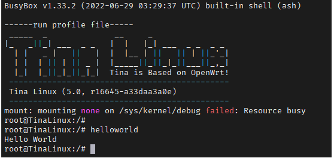

### 开机自动执行

在系统 rc.final 增加自定义命令 **target/allwinner/t113-100ask/busybox-init-base-files/etc/init.d** 编辑 ` rc.final` 文件


### 编译打包烧录	

​	执行make 编译完成后，就可以执行 `pack` 命令即可开始打包系统操作，打包完成后，最后会 提示 **pack finish** 以及使用 红色背景色 告诉你 最终输出的镜像文件。 我们通过 ssh / vmware 拖拽等工具，将其 copy 出来即可。


​	烧写方式 有两种，一种是线刷，使用 `PhoenixSuit` 将编译生成的镜像烧录至 spi nand 存储设备上，另一种是通过 [PhoenixCard-V2.8](https://gitlab.com/dongshanpi/tools/-/raw/main/PhoenixCard-V2.8.zip) 工具将系统镜像烧录至TF卡启动。 我们推荐使用 线刷 烧录至 spi nand 方便快速实验。

参考文档：https://allwinner-docs.100ask.net/Board/100ASK_T113-PRO/03-1_FlashSystem.html

参考视频：https://www.bilibili.com/video/BV1Nx4y1w7AF/?p=11&share_source=copy_web&vd_source=e3bf42462ab8667ad5a5469f71947458

### 启动验证


## 创建一个自己的TinaSDK单板

### 了解TinaSDK单板框架

在TinaSDK V2.0的SDK内，如果我们需要增加一个自己的单板配置，需要首先 确定一下 这个SDK是否有支持你得单板主芯片，如果没有 就无法自己添加。

举例，我们自己添加T113 开发板，也是基于 默认已有的 T113板级支持包 进行添加操作的，如果增加自己的 单板，整体涉及两部分。

1. device 内 找到自己的主控芯片，里面的 configs 看是否存在同型号芯片，进行参考
2. target/allwinner 目录内，找到是否存在 默认的同型号芯片系统配置文件夹。

如上两个是非常重要的文件，在TinaSDK V2.0 里面，我们可以看到，这个SDK 支持了 d1-h d1s t113三款主控芯片，进入T113 主控芯片内，存在 bin  boot-resource configs tools 这几个目录，其中 bin tools 这两个目录是系统的一些默认配置/工具，一般不要去动，boot-resource 是存放 开机图片的 文件夹，可以自定义选择修改，我们主要关心 configs 目录

这里面默认存放了 100ask 这个单板配置。对于 default 不用理会，这些是当你的单板没有存在某些配置时，会自动选择选择使用 default 内的文件。


对于 target/allwinner 目录，默认存在 t113-common  t113-100ask 两个目录， t113-common 为 t113芯片的默认配置项，t113-100ask 是我们自己单板相关的配置项文件夹。


### 自定义单板100ask_devkit

前面简单介绍了 在 TinaSDK 一个单板都涉及到了那些重要文件，接下来直接参考现有的 t113 100ask 配置创建我们自己的单板，名字为 100ask_devkit.

1. 在 **device/config/chips/t113/configs/**   复制一份 100ask/ 配置到  100ask_devkit/

```shell
ubuntu@ubuntu1804:~/tina-d1-h/device/config/chips/t113/configs$ cp 100ask/ 100ask_devkit -rfd
ubuntu@ubuntu1804:~/tina-d1-h/device/config/chips/t113/configs$ cd 100ask_devkit/
ubuntu@ubuntu1804:~/tina-d1-h/device/config/chips/t113/configs/100ask_devkit$ ls
BoardConfig.mk  board.dts  env.cfg  linux  linux-5.4  sys_config.fex  sys_partition.fex  uboot-board.dts
ubuntu@ubuntu1804:~/tina-d1-h/device/config/chips/t113/configs/100ask_devkit$ 
```

修改`sys_config.fex`：

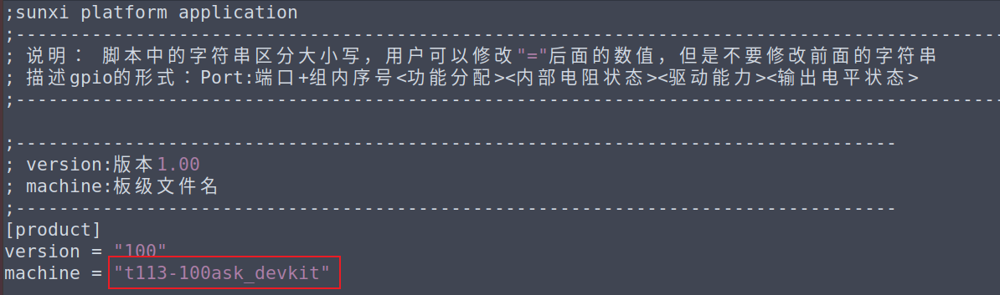

2. 在 **target/allwinner **下复制一份 t113-100ask 配置到 t113-100ask_devkit ，并修改 文件中的内容，使其指向100ask_devkit项目。

- 2.1  重命名单板.mk 如下图所示：
  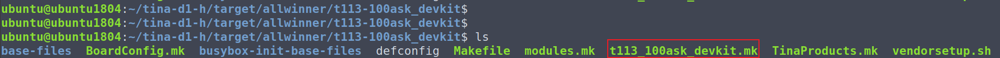

- 2.2 修改  **t113_100ask_devkit.mk**  里面的 **PRODUCT_NAME**  和 **PRODUCT_DEVICE** 两个关键属性。必须要和 前面的单板名称  **.mk**  名称保持一致。

  ~~~bash
  PRODUCT_NAME := t113_100ask_devkit
  PRODUCT_DEVICE := t113-100ask_devkit
  ~~~

  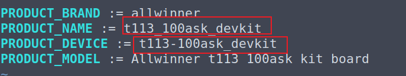

- 2.3 makefile中修改 **BOARD  BOARDNAME** 这里必须要保证和device configs 内的 新增 单板名称保持一致（T113- 表示 t113主芯片- 后面是你的新增单板名称）。

  ~~~bash
  BOARD:=t113-100ask_devkit
  BOARDNAME:=t113-100ask_devkit
  ~~~

  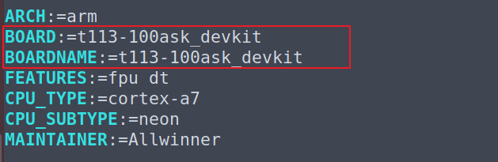

- 2.4 修改 TinaProducts.mk  使其引用我们刚才创建的  t113_100ask_devkit.mk 文件。

  ~~~bash
  $(LOCAL_DIR)/t113_100ask_devkit.mk
  ~~~

  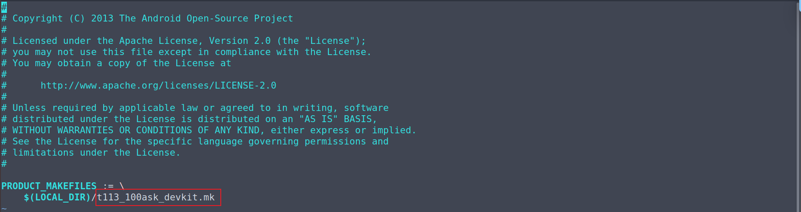

- 2.5  修改 **vendorsetup.sh** 可以在lunch 选项中显示我们新增的单板。 

  ~~~bash
  add_lunch_combo t113_100ask_devkit-tina
  ~~~

  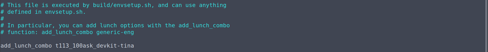

- 2.6 因为整个配置涉及到了一些音频相关操作，需要将 **package/allwinner/alsa-conf-aw/files/t113**  下新建文件夹t113-100ask_devkit ，同样将同文件下t113-100ask/中的内容复制过去，要不会导致报错。

  ~~~bash
  ubuntu@ubuntu1804:~/tina-d1-h/package/allwinner/alsa-conf-aw/files$ cd t113/
  ubuntu@ubuntu1804:~/tina-d1-h/package/allwinner/alsa-conf-aw/files/t113$ ls
  t113-100ask
  ubuntu@ubuntu1804:~/tina-d1-h/package/allwinner/alsa-conf-aw/files/t113$ cp t113-100ask/ t113-100ask_devkit -rfd
  ~~~

- 2.7 可选： 当我们做完上述步骤后，执行 lunch 命令 选择到 我们的 新增单板，这时 还不能编译，需要 使用 make menuconfig 进入配置界面，选中我们新增的单板  为 Target System  保存退出才可以继续执行 make 编译命令。
  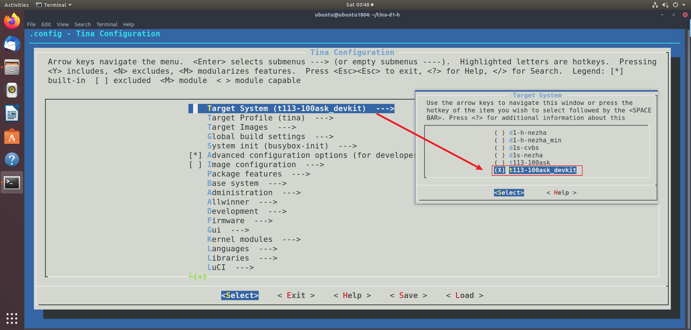

  也可以直接修改 defconfig 文件 `tina-d1-h/target/allwinner/t113-100ask_devkit$ vi defconfig` 参考下图所示。

  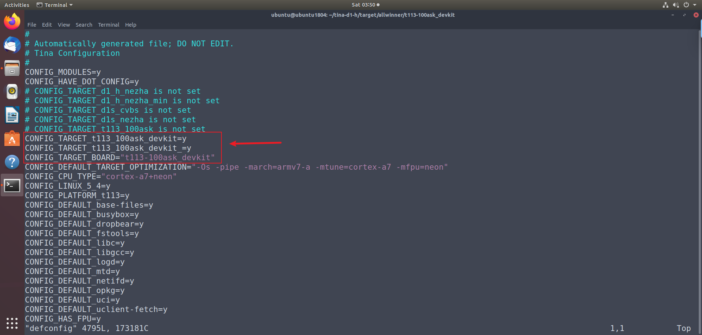

### lunch选择100ask_devkit

3. 根目录执行  `souce build/envsetup.sh`   ` lunch` 后可以看到有新增的编译target。

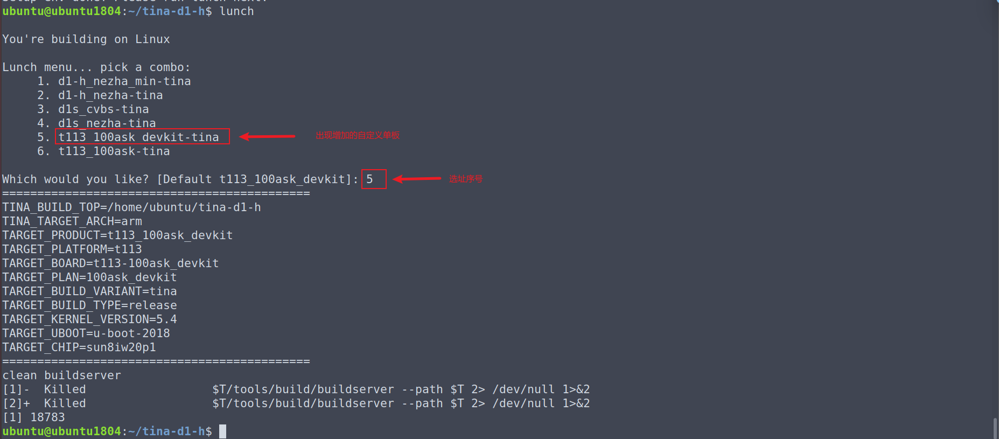

### 编译100ask_devkit单板

编译生成镜像，pack打包后用PhoenixSuit烧录。

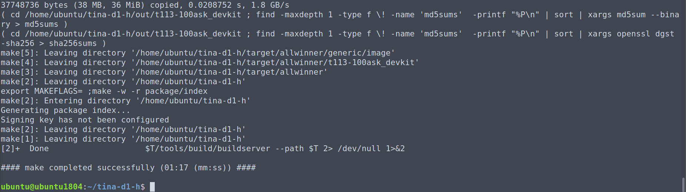

### 烧写更新系统

编译完成后，执行 `pack` 命令即可开始打包系统操作，打包完成后，最后会 提示 **pack finish** 以及使用 红色背景色 告诉你 最终输出的镜像文件。

我们通过 ssh / vmware 拖拽等工具，将其 copy 出来即可。

```shell
ubuntu@ubuntu1804:~/tina-d1-h$ pack
--==========--
PACK_CHIP         sun8iw20p1
PACK_PLATFORM     tina
PACK_BOARD        t113-100ask_devkit
PACK_KERN        
PACK_DEBUG        uart3
PACK_SIG          none
PACK_SECURE       none
PACK_MODE         normal
PACK_FUNC         android
PACK_PROGRAMMER   none
PACK_TAR_IMAGE    none
PACK_TOPDIR       /home/ubuntu/tina-d1-h
--==========--
No kernel param, parse it from t113
copying tools file
copying configs file
storage_type value is 5
rm /home/ubuntu/tina-d1-h/out/t113-100ask_devkit/image/sys_partition_nor.fex
rm /home/ubuntu/tina-d1-h/out/t113-100ask_devkit/image/image_nor.cfg
copying boot resource

LZMA 4.65 : Igor Pavlov : Public domain : 2009-02-03
copying boot file
make user resource for : /home/ubuntu/tina-d1-h/out/t113-100ask_devkit/image/sys_partition.fex
handle partition user-res
no user resource partitions
APP_PART_DOWNLOAD_FILE = /home/ubuntu/tina-d1-h/out/t113-100ask_devkit/image/app.fex
Need size of filesystem
no data resource partitions
don't build dtbo ...
update_chip
pack boot package
GetPrivateProfileSection read to end
content_count=3
LICHEE_REDUNDANT_ENV_SIZE config in BoardConfig.mk
--mkenvimage create redundant env data!--
---redundant env data size 0x20000---
packing for tina linux
normal
mbr count = 4

partitation file Path=/home/ubuntu/tina-d1-h/out/t113-100ask_devkit/image/sys_partition.bin
mbr_name file Path=/home/ubuntu/tina-d1-h/out/t113-100ask_devkit/image/sunxi_mbr.fex
download_name file Path=/home/ubuntu/tina-d1-h/out/t113-100ask_devkit/image/dlinfo.fex

mbr size = 16384
mbr magic softw411
disk name=boot-resource
disk name=env
disk name=env-redund
disk name=boot
disk name=rootfs
disk name=private
disk name=rootfs_data
disk name=UDISK
this is not a partition key
update_for_part_info 0
crc 0 = 2e2d961c
crc 1 = bb90c741
crc 2 = de2632e7
crc 3 = 4b9b63ba
gpt_head->header_crc32 = 0xd18a5848
GPT----part num 8---
gpt_entry: 128
gpt_header: 92
GPT:boot-resource: 12000         12fd9       
GPT:env         : 12fda         131d1       
GPT:env-redund  : 131d2         133c9       
GPT:boot        : 133ca         154fd       
GPT:rootfs      : 154fe         2a105       
GPT:private     : 2a106         2c905       
GPT:rootfs_data : 2c906         2f105       
GPT:UDISK       : 2f106         ffffffde    
update gpt file ok
update mbr file ok
temp = 20
mbr count = 4 total_sectors = 15269888 logic_offset = 40960

partitation file Path=/home/ubuntu/tina-d1-h/out/t113-100ask_devkit/image/sys_partition.bin
mbr_name file Path=/home/ubuntu/tina-d1-h/out/t113-100ask_devkit/image/sunxi_mbr.fex
download_name file Path=/home/ubuntu/tina-d1-h/out/t113-100ask_devkit/image/dlinfo.fex

mbr size = 16384
mbr magic softw411
disk name=boot-resource
disk name=env
disk name=env-redund
disk name=boot
disk name=rootfs
disk name=private
disk name=rootfs_data
disk name=UDISK
this is not a partition key
update_for_part_info 0
crc 0 = 2e2d961c
crc 1 = bb90c741
crc 2 = de2632e7
crc 3 = 4b9b63ba
gpt_head->header_crc32 = 0x4b8ef1da
GPT----part num 8---
gpt_entry: 128
gpt_header: 92
GPT:boot-resource: 12000         12fd9       
GPT:env         : 12fda         131d1       
GPT:env-redund  : 131d2         133c9       
GPT:boot        : 133ca         154fd       
GPT:rootfs      : 154fe         2a105       
GPT:private     : 2a106         2c905       
GPT:rootfs_data : 2c906         2f105       
GPT:UDISK       : 2f106         e8ffde      
update gpt file ok
update mbr file ok
====================================
show "sys_partition_for_dragon.fex" message
------------------------------------
  [mbr]
  mbr_size  : 16384 Kbyte
------------------------------------
  partition_name  : boot-resource
  partition_size  : 4058
  downloadfile  : boot-resource.fex
  boot-resource.fex size : 2.0M byte
------------------------------------
  partition_name  : env
  partition_size  : 504
  downloadfile  : env.fex
  env.fex size : 128K byte
------------------------------------
  partition_name  : env-redund
  partition_size  : 504
  downloadfile  : env.fex
  env.fex size : 128K byte
------------------------------------
  partition_name  : boot
  partition_size  : 8500
  downloadfile  : boot.fex
  boot.fex -> /home/ubuntu/tina-d1-h/out/t113-100ask_devkit/boot.img
  boot.img size : 4.0M byte
------------------------------------
  partition_name  : rootfs
  partition_size  : 85000
  downloadfile  : rootfs.fex
  rootfs.fex -> /home/ubuntu/tina-d1-h/out/t113-100ask_devkit/rootfs.img
  rootfs.img size : 36M byte
------------------------------------
  partition_name  : private
  partition_size  : 10240
------------------------------------
  partition_name  : rootfs_data
  partition_size  : 10240
------------------------------------
  partition_name  : UDISK
  partition_name  : rootfs_data
  partition_size  : 10240
------------------------------------
/home/ubuntu/tina-d1-h/out/host/bin/
/home/ubuntu/tina-d1-h/out/t113-100ask_devkit/image
Begin Parse sys_partion.fex
Add partion boot-resource.fex BOOT-RESOURCE_FEX
Add partion very boot-resource.fex BOOT-RESOURCE_FEX
FilePath: boot-resource.fex
FileLength=1fb400Add partion env.fex ENV_FEX000000000
Add partion very env.fex ENV_FEX000000000
FilePath: env.fex
FileLength=20000Add partion env.fex ENV_FEX000000000
Add partion very env.fex ENV_FEX000000000
FilePath: env.fex
FileLength=20000Add partion boot.fex BOOT_FEX00000000
Add partion very boot.fex BOOT_FEX00000000
FilePath: boot.fex
FileLength=3e9000Add partion rootfs.fex ROOTFS_FEX000000
Add partion very rootfs.fex ROOTFS_FEX000000
FilePath: rootfs.fex
FileLength=2400000BuildImg 0
Dragon execute image.cfg SUCCESS !
----------image is for nand/emmc----------
----------image is at----------

/home/ubuntu/tina-d1-h/out/t113-100ask_devkit/tina_t113-100ask_devkit_uart3.img

pack finish
ubuntu@ubuntu1804:~/tina-d1-h$
```

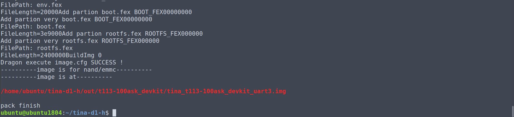

烧写方式 有两种，一种是线刷，使用 `PhoenixSuit` 将编译生成的镜像烧录至 spi nand 存储设备上，另一种是通过 [PhoenixCard-V2.8](https://gitlab.com/dongshanpi/tools/-/raw/main/PhoenixCard-V2.8.zip) 工具将系统镜像烧录至TF卡启动。 我们推荐使用 线刷 烧录至 spi nand 方便快速实验。

参考文档：https://allwinner-docs.100ask.net/Board/100ASK_T113-PRO/03-1_FlashSystem.html

参考视频：https://www.bilibili.com/video/BV1Nx4y1w7AF/?p=11&share_source=copy_web&vd_source=e3bf42462ab8667ad5a5469f71947458

### 启动验证

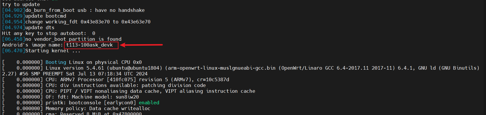

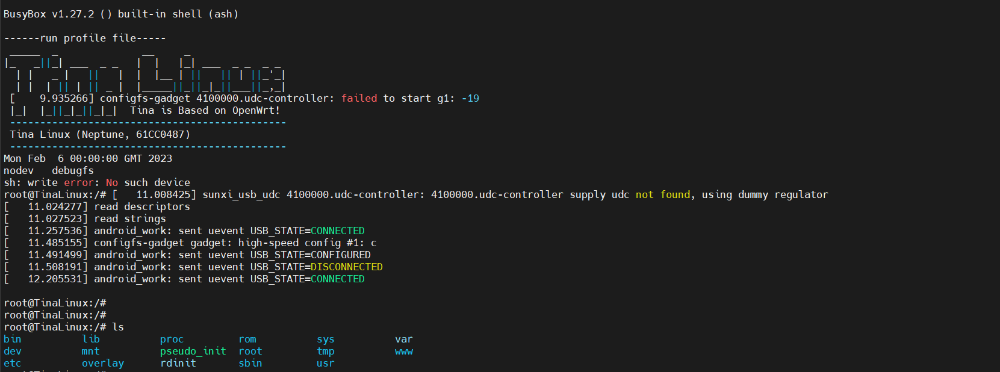

因为系统差异很小，所以只能通过加载kernel的image name信息 看到 我们当前的设备名称。

