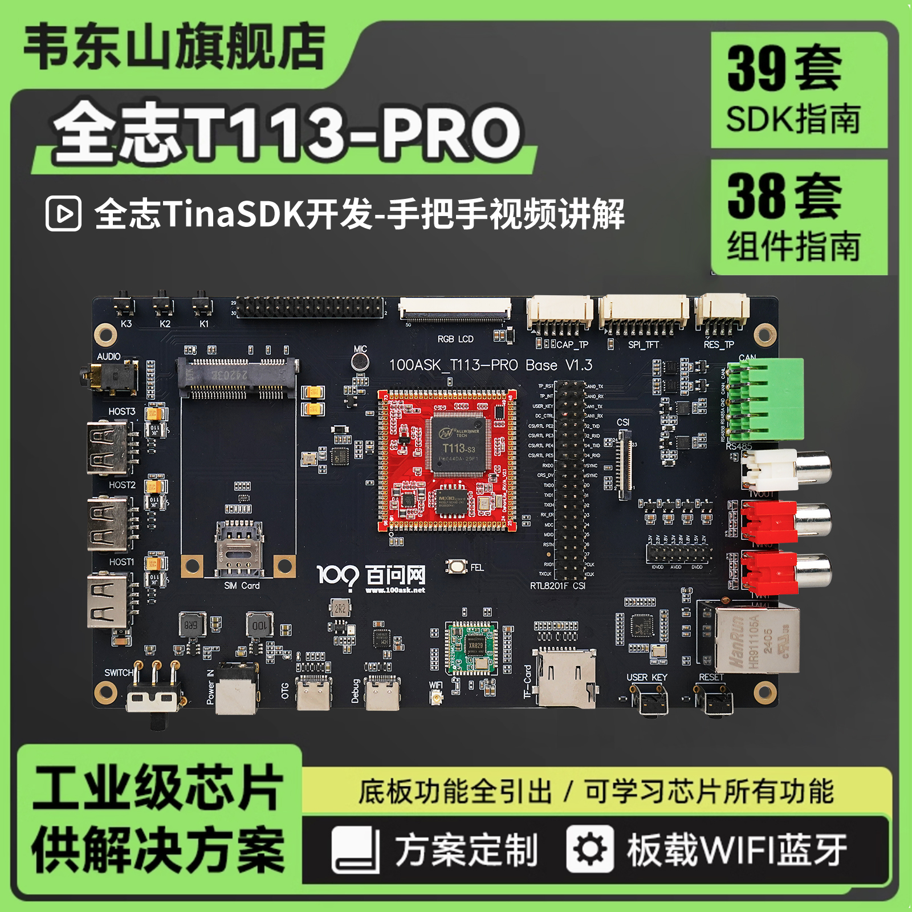

# T113s-Pro V1.3

* 此开发板的任何问题都可以在我们的论坛交流讨论 https://forums.100ask.net/c/aw/t113s3/19

## 硬件简述

### T113s3芯片
主芯片参数简述：T113-S3 是一款先进的应用处理器，专为汽车和工业控制市场而设计。 它集成了双核CortexTM-A7 CPU和单核HiFi4 DSP，提供高效的计算能力。 T113-S3 支持 H.265、H.264、MPEG-1/2/4、JPEG、VC1 等全格式解码。 独立的硬件编码器可以编码为 JPEG 或 MJPEG。 集成多个 ADC/DAC 和 I2S/PCM/DMIC/OWA 音频接口，可提供完美的语音交互解决方案。 T113-S3具有丰富的连接性，方便产品扩展，如USB、SDIO、EMAC、TWI、UART、SPI、PWM、GPADC、IR TX&RX等。

## 配套模块
### 7寸RGB显示屏

* 韦东山个人店购买地址： https://item.taobao.com/item.htm?&id=611156659477

