# 快速开始使用

## 烧写固件至SpiNand
### 准备工作

**硬件：**

* 12v电源适配器
* TypeC线 x2

**软件：**

* 全志线刷工具：[AllwinnertechPhoeniSuit.zip](https://dl.100ask.net/Hardware/MPU/T113i-Industrial/Tools/AllwinnertechPhoeniSuit.zip)
* 全志USB烧录驱动：[AllwinnerUSBFlashDeviceDriver.zip](https://dl.100ask.net/Hardware/MPU/T113i-Industrial/Tools/AllwinnerUSBFlashDeviceDriver.zip)
* SpiNand Tina4SDK系统镜像（XR829版本）：[Tina-T113s3-Pro-DefaultSystem.7z](https://dl.100ask.net/Hardware/MPU/100ask_t113-pro/Images/Tina-T113s3-Pro-DefaultSystem.7z)
* SpiNand Tina4SDK系统镜像（WiFi6增强版本）：[T113s3-WiFi6-DefaultSysterm.7z](https://dl.100ask.net/Hardware/MPU/100ask_t113-pro/Images/T113s3-WiFi6-DefaultSysterm.7z)
* SpiNand Tina5SDK系统镜像（WiFi6增强版本）：[T113s3-WiFi6-Tina5-DefaultSysterm.7z](https://dl.100ask.net/Hardware/MPU/100ask_t113-pro/Images/T113s3-WiFi6-Tina5-DefaultSysterm.7z)

> 镜像说明：购买哪款开发板，就下载对应的系统镜像。烧录步骤是一致的，下面以SpiNand系统镜像（XR829版本）举例。

### 连接开发板

更新系统固件前，先连接开发板，TypeC线连接接口位置如下图所示：

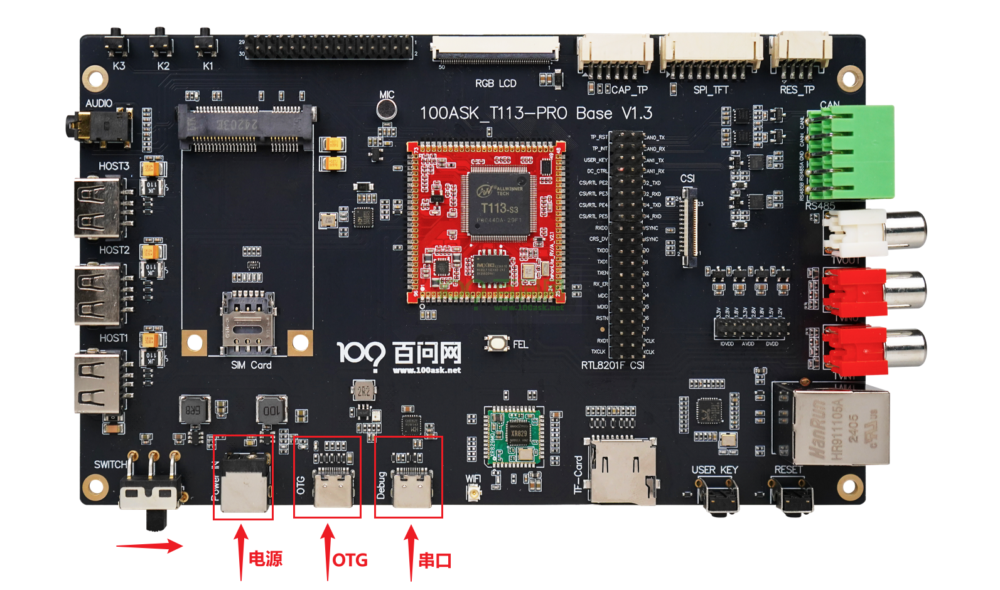

将两个TypeC线分别连至 T113s3-Pro 开发板 `OTG烧录接口 `,`调试&串口接口` Typec线另一端 连接至 电脑USB接口，最后接入12v电源，开关往右拨动，启动开发板。

连接成功后，可以先获取软件 `全志线刷工具` `SPI Nand系统镜像` `全志USB烧录驱动`安装包 进行解压缩操作。

### 安装usb驱动
在我们连接好开发板以后，先按住 T113s3-Pro 开发板 `烧录默认` 也称为**FEL** 烧写模式按键，不要松开，之后按一下 `系统复位按键`也称 **RESET** 复位键，再松开FEL键，就可以自动进入烧写模式。

这时我们可以看到电脑设备管理器  **通用串行总线控制器** 部分弹出一个  未知设备 ，这个时候我们就需要把我们提前下载好的 **全志USB烧录驱动** 进行修改，然后将解压缩过的 **全志USB烧录驱动**  压缩包，解压缩，可以看到里面有这么几个文件。

```bash
InstallUSBDrv.exe
drvinstaller_IA64.exe
drvinstaller_X86.exe
UsbDriver/          
drvinstaller_X64.exe   
install.bat
```

对于wind7系统的同学，只需要以管理员 打开   `install.bat` 脚本，等待安装，在弹出的 是否安装驱动的对话框里面，点击安装即可。

对于wind10/wind11系统的同学，需要在设备管理器里面进行手动安装驱动。

如下图所示，在第一次插入OTG设备，进入烧写模式设备管理器会弹出一个未知设备。


接下来鼠标右键点击这个未知设备，在弹出的对话框里， 点击浏览我计算机以查找驱动程序软件。

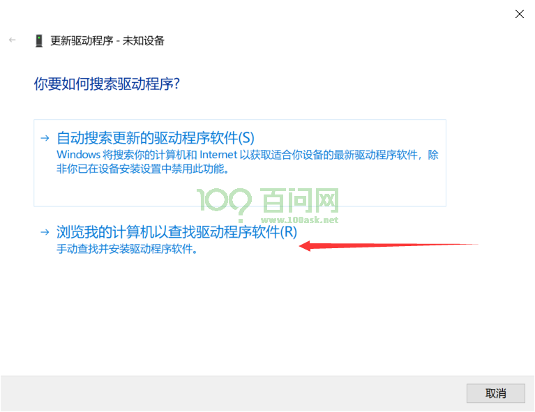

之后在弹出新的对话框里，点击浏览找到我们之前下载好的 usb烧录驱动文件夹内，找到 `UsbDriver/` 这个目录，并进入，之后点击确定即可。

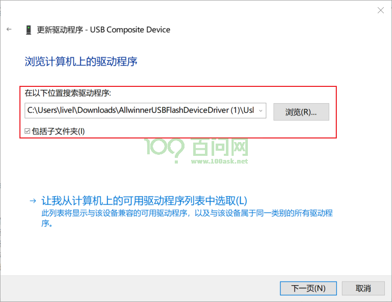

注意进入到  `UsbDriver/`  文件夹，然后点击确定，如下图所示。

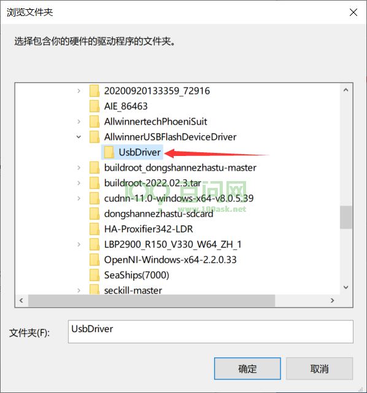

此时，我们继续点击 **下一页** 按钮，这时系统就会提示安装一个驱动程序。 

在弹出的对话框里，我们点击 始终安装此驱动程序软件 等待安装完成。

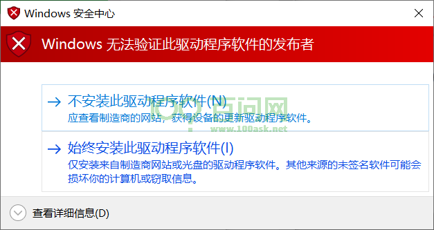

安装完成后，会提示，Windows已成功更新你的驱动程序。

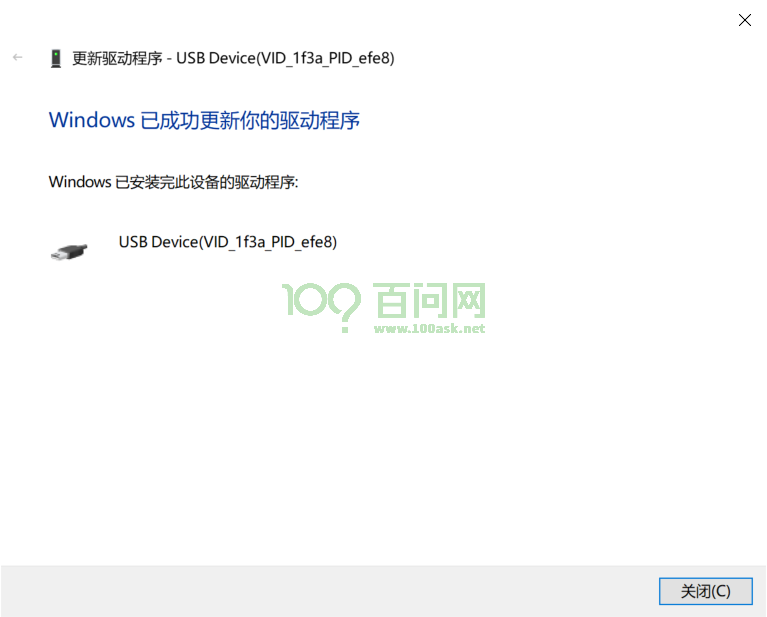


最后我们可以看到，设备管理器 里面的未知设备 变成了一个 `USB Device(VID_1f3a_efe8)`的设备，这时就表明设备驱动已经安装成功。

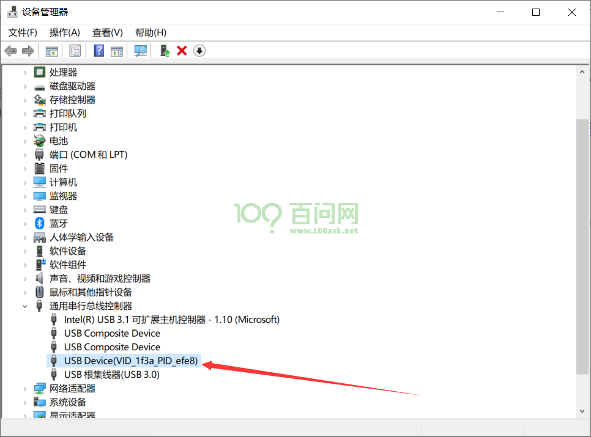


### 运行软件烧写
将下载下来的全志线刷工具 **AllwinnertechPhoeniSuit** 解压缩，同时将**SPI Nand系统镜像**下载下来也进行解压缩。

解压后，得到一个 **Tina-T113s3-Pro-DefaultSystem.img** 镜像，是用于烧录到SPI NAND镜像，对应的MD5值是`189e301d30a96659c015839517e1a753`。另一个是**AllwinnertechPhoeniSuit**文件夹。

首先我们进入到 **AllwinnertechPhoeniSuit\AllwinnertechPhoeniSuitRelease20201225** 目录下 找到 **PhoenixSuit.exe** 双击运行。

打开软件后 软件主界面如下图所示

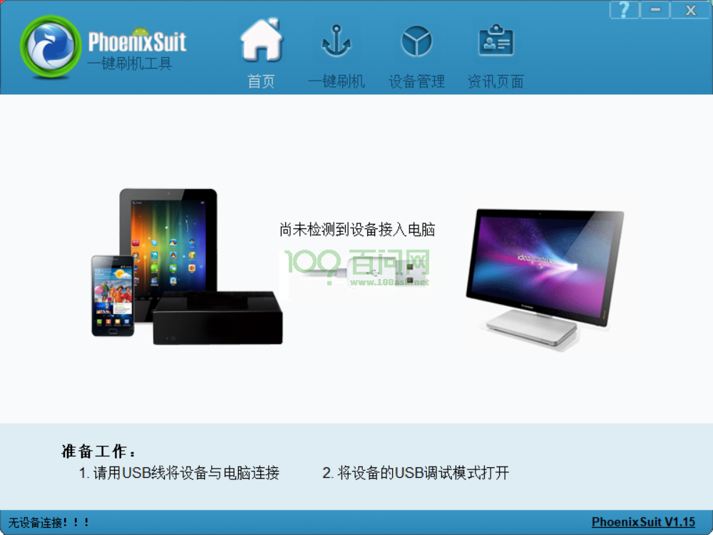


接下来 我们需要切换到 **一键刷机**窗口，如下图所示，点击红框标号1，在弹出的新窗口内，我们点击 红框2 **浏览** 找到我们刚才解压过的 SPI nand镜像  **Tina-T113s3-Pro-DefaultSystem.img** ，选中镜像后，最后点击红框3 **全盘擦除升级** 

点击完成后，不需要理会 弹出的信息，这时 我们拿起已经连接好的开发板，先按住 **FEL** 烧写模式按键，之后按一下 **RESET** 系统复位键，就可以自动进入烧写模式并开始烧写。

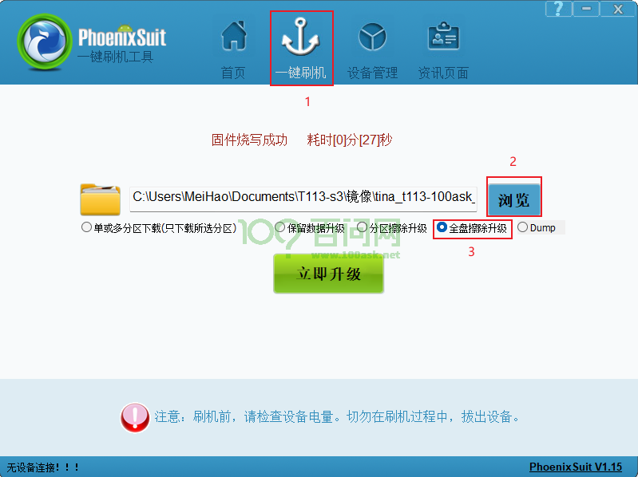


 烧写时会提示烧写进度条，烧写完成后 开发板会自己重启。

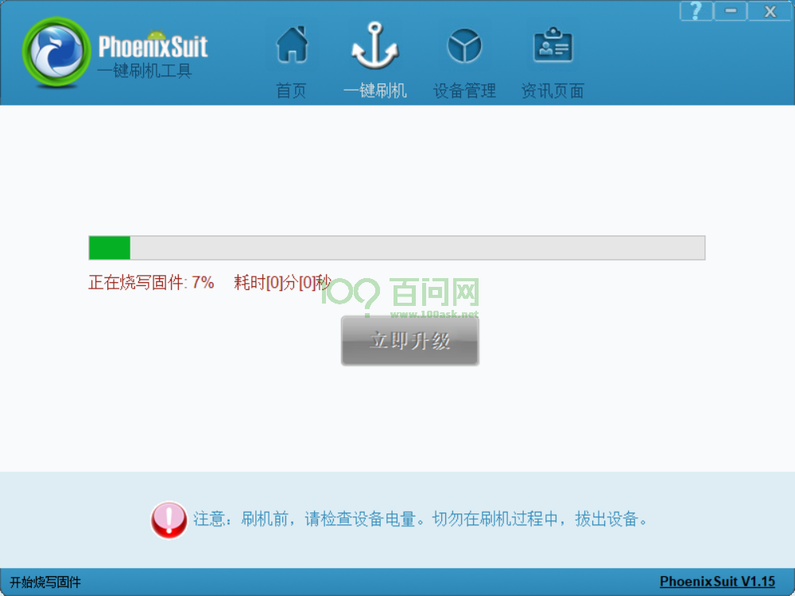


### 启动系统

一般情况下，烧写成功后 都会自动重启 启动系统，此时我们进入到 串口终端，可以看到它的启动信息。

## 烧写固件至TF卡

### 准备工作
**硬件：**

* USB Type-C线 x2
* TF卡读卡器  x1
* 8GB以上的 Micro TF卡 x1

**软件：**

* Tina系统TF卡烧录工具: [PhoenixCard-V2.8.zip](https://dl.100ask.net/Hardware/MPU/T113i-Industrial/Tools/PhoenixCard-V2.8.zip)
* SDcard格式化工具：[SDCardFormatter5.0.1Setup.exe.7z](https://dl.100ask.net/Hardware/MPU/T113i-Industrial/Tools/SDCardFormatter5.0.1Setup.exe.7z)


### 运行烧写软件烧写

首先需要下载  **win32diskimage  SDcard专用格式化** 这两个烧写TF卡的工具，然后可以根据开发环境搭建章节，打包出相应的镜像文件，这个文件就是我们要烧写的镜像。 同时解压缩 **Tina系统TF卡烧录工具 PhoenixCard-V2.8**，解压完成后，进入到烧写工具目录内，双击运行 `PhoenixCard.exe`烧录工具。

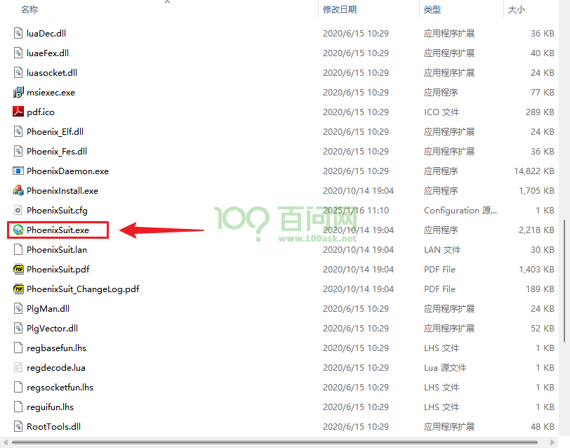

步骤一： 将TF卡插进读卡器内，同时将读卡器插到电脑USB接口，使用SD CatFormat格式化TF卡，注意备份卡内数据。参考下图所示，点击刷新找到TF卡，然后点击 Format 在弹出的 对话框 点击 **是(Yes)**等待格式完成即可。

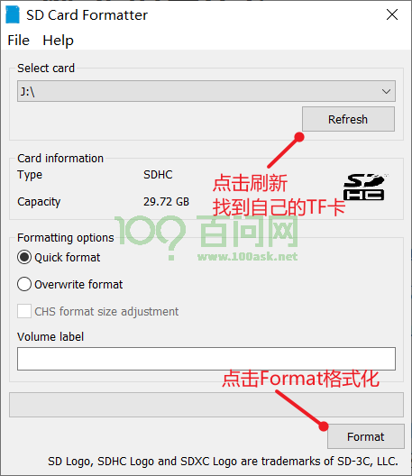


步骤二：格式化完成后，使用**PhoenixCard.exe**工具来烧录镜像，参考下图步骤，找到自己的TF卡盘符，点击 `左上角红框1` 固件，选择已经解压过的 `Tina-T113s3-Pro-DefaultSystem.img` 镜像，然后点击 `红框2 启动卡`，最后点击`红框3 烧录` 等待烧录完成即可。

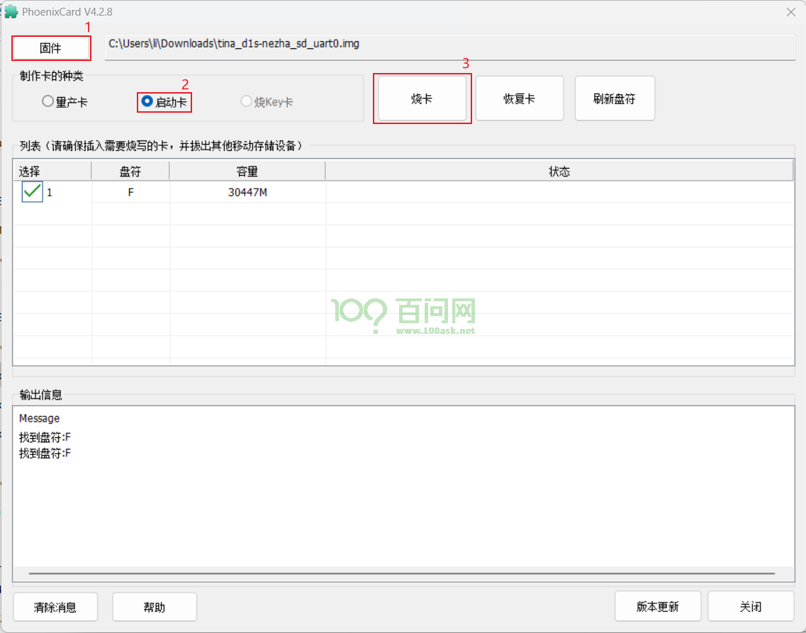

如下图为烧录成功示意图。

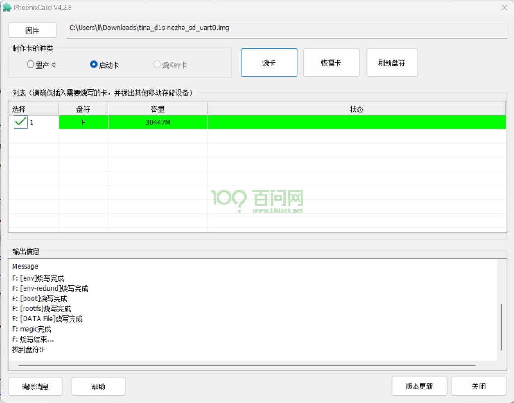


烧录完成以后，就可以弹出TF卡，并将其插到开发板正面 `TF卡卡槽`位置处，此时可以使用串口进行登录，也可以使用 adb shell 直接连接 ADB进行登录访问。

### 启动系统

如下启动信息：

~~~bash
[29]HELLO! BOOT0 is starting!
[32]BOOT0 commit : 88480af-dirty
[35]set pll start
[41]periph0 has been enabled
[44]set pll end
[45][pmu]: bus read error
[48]board init ok
[50]ZQ value = 0x2d
[51]get_pmu_exist() = -1
[54]DRAM BOOT DRIVE INFO: V0.33
[57]DRAM CLK = 936 MHz
[59]DRAM Type = 3 (2:DDR2,3:DDR3)
[62]DRAMC read ODT  off.
[65]DRAM ODT value: 0x42.
[67]ddr_efuse_type: 0xa
[70]DRAM SIZE =128 M
[72]dram_tpr4:0x0
[74]PLL_DDR_CTRL_REG:0xf8004d00
[77]DRAM_CLK_REG:0xc0000000
[80][TIMING DEBUG] MR2= 0x20
[87]DRAM simple test OK.
[89]rtc standby flag is 0x0, super standby flag is 0x0
[94]dram size =128
[97]spinand UBOOT_START_BLK_NUM 8 UBOOT_LAST_BLK_NUM 32
[102]block from 8 to 32
[235]Check is correct.
[237]dma 0x29c0c int is not used yet
[240]dma 0x29c0c int is free, you do not need to free it again
[246]Entry_name        = u-boot
[253]Entry_name        = optee
[256]Entry_name        = dtb
[259]Jump to second Boot.
M/TC: OP-TEE version: 6aef7bb2-dirty (gcc version 5.3.1 20160412 (Linaro GCC 5.3-2016.05)) #1 Fri Jul 23 09:25:11 UTC 2021 arm


U-Boot 2018.05-g24521d6-dirty (Jul 08 2024 - 22:02:57 -0400) Allwinner Technology

[00.313]CPU:   Allwinner Family
[00.316]Model: sun8iw20
I2C:   FDT ERROR:fdt_set_all_pin:[twi0]-->FDT_ERR_BADPATH
FDT ERROR:fdt_set_all_pin:[twi1]-->FDT_ERR_BADPATH
ready
[00.337]DRAM:  128 MiB
[00.340]Relocation Offset is: 04ec4000
[00.365]secure enable bit: 0
[00.367]smc_tee_inform_fdt failed with: -65526[00.372]CPU=1008 MHz,PLL6=600 Mhz,AHB=200 Mhz, APB1=100Mhz  MBus=300Mhz
[00.378]gic: sec monitor mode
[00.381]flash init start
[00.383]workmode = 0,storage type = 0
sspi->base_addr = 0x4025000, the SPI control register:
[VER] 0x4025000 = 0x00010001, [GCR] 0x4025004 = 0x00000083, [TCR] 0x4025008 = 0x00000184
[ICR] 0x4025010 = 0x00000f00, [ISR] 0x4025014 = 0x00000032, [FCR] 0x4025018 = 0x00200020
[FSR] 0x402501c = 0x00000000, [WCR] 0x4025020 = 0x00000000, [CCR] 0x4025024 = 0x00000002
[SDC] 0x4025028 = 0x00002000, [BCR] 0x4025030 = 0x00000000, [TCR] 0x4025034 = 0x00000000
[BCC] 0x4025038 = 0x10000000, [DMA] 0x4025088 = 0x000000e5

[00.430]sunxi-spinand-phy: not detect any munufacture from id table
[00.436]sunxi-spinand-phy: get spi-nand Model from fdt fail
[00.441]sunxi-spinand-phy: get phy info from fdt fail

device nand0 <nand>, # parts = 4
 #: name                size            offset          mask_flags
 0: boot0               0x00100000      0x00000000      1
 1: uboot               0x00300000      0x00100000      1
 2: secure_storage      0x00100000      0x00400000      1
 3: sys                 0x07b00000      0x00500000      0

active partition: nand0,0 - (boot0) 0x00100000 @ 0x00000000

defaults:
mtdids  : nand0=nand
mtdparts: mtdparts=nand:1024k@0(boot0)ro,3072k@1048576(uboot)ro,1024k@4194304(secure_storage)ro,-(sys)
[00.559]ubi0: attaching mtd4
[00.784]ubi0: scanning is finished
[00.793]ubi0: attached mtd4 (name "sys", size 123 MiB)
[00.798]ubi0: PEB size: 262144 bytes (256 KiB), LEB size: 258048 bytes
[00.804]ubi0: min./max. I/O unit sizes: 4096/4096, sub-page size 2048
[00.810]ubi0: VID header offset: 2048 (aligned 2048), data offset: 4096
[00.817]ubi0: good PEBs: 492, bad PEBs: 0, corrupted PEBs: 0
[00.822]ubi0: user volume: 9, internal volumes: 1, max. volumes count: 128
[00.829]ubi0: max/mean erase counter: 2/1, WL threshold: 4096, image sequence number: 0
[00.836]ubi0: available PEBs: 0, total reserved PEBs: 492, PEBs reserved for bad PEB handling: 20
[00.845]sunxi flash init ok
[00.847]line:703 init_clocks
[00.850]drv_disp_init
[00.862]drv_disp_init finish
[00.864]boot_gui_init:start
[00.867]set disp.dev2_output_type fail. using defval=0
[00.873]boot_gui_init:finish
[01.054]LCD open finish
partno erro : can't find partition bootloader
54 bytes read in 0 ms
[01.134]bmp_name=bootlogo.bmp size 1843254
1843254 bytes read in 121 ms (14.5 MiB/s)
[01.500]Loading Environment from SUNXI_FLASH... OK
[01.539]Item0 (Map) magic is bad
secure storage read widevine fail
[01.544]secure storage read widevine fail with:-1
secure storage read ec_key fail
[01.552]secure storage read ec_key fail with:-1
secure storage read ec_cert1 fail
[01.559]secure storage read ec_cert1 fail with:-1
secure storage read ec_cert2 fail
[01.566]secure storage read ec_cert2 fail with:-1
secure storage read ec_cert3 fail
[01.574]secure storage read ec_cert3 fail with:-1
secure storage read rsa_key fail
[01.581]secure storage read rsa_key fail with:-1
secure storage read rsa_cert1 fail
[01.589]secure storage read rsa_cert1 fail with:-1
secure storage read rsa_cert2 fail
[01.596]secure storage read rsa_cert2 fail with:-1
secure storage read rsa_cert3 fail
[01.604]secure storage read rsa_cert3 fail with:-1
[01.609]usb burn from boot
delay time 0
weak:otg_phy_config
[01.620]usb prepare ok
[01.810]usb sof ok
[01.812]usb probe ok
[01.814]usb setup ok
set address 0x1a
set address 0x1a ok
set address 0x1b
set address 0x1b ok
try to update
[04.819]do_burn_from_boot usb : have no handshake
[04.846]update bootcmd
[04.871]change working_fdt 0x43e83e70 to 0x43e63e70
[04.891]update dts
Hit any key to stop autoboot:  0
[06.375]no vendor_boot partition is found
Android's image name: t113-100ask
[06.386]Starting kernel ...

[    0.000000] Booting Linux on physical CPU 0x0
[    0.000000] Linux version 5.4.61 (ubuntu@ubuntu1804) (arm-openwrt-linux-muslgnueabi-gcc.bin (OpenWrt/Linaro GCC 6.4-2017.11 2017-11) 6.4.1, GNU ld (GNU Binutils) 2.27) #50 SMP PREEMPT Tue Jul 9 02:15:30 UTC 2024
[    0.000000] CPU: ARMv7 Processor [410fc075] revision 5 (ARMv7), cr=10c5387d
[    0.000000] CPU: div instructions available: patching division code
[    0.000000] CPU: PIPT / VIPT nonaliasing data cache, VIPT aliasing instruction cache
[    0.000000] OF: fdt: Machine model: sun8iw20
[    0.000000] printk: bootconsole [earlycon0] enabled
[    0.000000] Memory policy: Data cache writealloc
[    0.000000] cma: Reserved 8 MiB at 0x47800000
[    0.000000] On node 0 totalpages: 32768
[    0.000000]   Normal zone: 256 pages used for memmap
[    0.000000]   Normal zone: 0 pages reserved
[    0.000000]   Normal zone: 32768 pages, LIFO batch:7
[    0.000000] psci: probing for conduit method from DT.
[    0.000000] psci: PSCIv1.0 detected in firmware.
[    0.000000] psci: Using standard PSCI v0.2 function IDs
[    0.000000] psci: MIGRATE_INFO_TYPE not supported.
[    0.000000] psci: SMC Calling Convention v1.0
[    0.000000] percpu: Embedded 15 pages/cpu s30348 r8192 d22900 u61440
[    0.000000] pcpu-alloc: s30348 r8192 d22900 u61440 alloc=15*4096
[    0.000000] pcpu-alloc: [0] 0 [0] 1
[    0.000000] Built 1 zonelists, mobility grouping on.  Total pages: 32512
[    0.000000] Kernel command line: ubi.mtd=sys ubi.block=0,rootfs earlyprintk=sunxi-uart,0x02500C00 clk_ignore_unused initcall_debug=0 console=ttyS3,115200 loglevel=8 root=/dev/ubiblock0_5 rootfstype=squashfs init=/pseudo_init partitions=mbr@ubi0_0:boot-resource@ubi0_1:env@ubi0_2:env-redund@ubi0_3:boot@ubi0_4:rootfs@ubi0_5:private@ubi0_6:rootfs_data@ubi0_7:UDISK@ubi0_8: cma=8M snum= mac_addr= wifi_mac= bt_mac= specialstr= gpt=1 androidboot.hardware=sun8iw20p1 boot_type=5 androidboot.boot_type=5 gpt=1 uboot_message=2018.05-g24521d6-dirty(07/08/2024-22:02:57) disp_reserve=2457600,0x43f07000 aw-ubi-spinand.ubootblks=24 androidboot.dramsize=128
[    0.000000] Dentry cache hash table entries: 16384 (order: 4, 65536 bytes, linear)
[    0.000000] Inode-cache hash table entries: 8192 (order: 3, 32768 bytes, linear)
[    0.000000] mem auto-init: stack:off, heap alloc:off, heap free:off
[    0.000000] Memory: 99996K/131072K available (6144K kernel code, 275K rwdata, 1664K rodata, 1024K init, 1164K bss, 22884K reserved, 8192K cma-reserved)
[    0.000000] SLUB: HWalign=64, Order=0-3, MinObjects=0, CPUs=2, Nodes=1
[    0.000000] rcu: Preemptible hierarchical RCU implementation.
[    0.000000]  Tasks RCU enabled.
[    0.000000] rcu: RCU calculated value of scheduler-enlistment delay is 10 jiffies.
[    0.000000] NR_IRQS: 16, nr_irqs: 16, preallocated irqs: 16
[    0.000000] random: get_random_bytes called from start_kernel+0x264/0x3e8 with crng_init=0
[    0.000000] arch_timer: cp15 timer(s) running at 24.00MHz (phys).
[    0.000000] clocksource: arch_sys_counter: mask: 0xffffffffffffff max_cycles: 0x588fe9dc0, max_idle_ns: 440795202592 ns
[    0.000006] sched_clock: 56 bits at 24MHz, resolution 41ns, wraps every 4398046511097ns
[    0.007999] Switching to timer-based delay loop, resolution 41ns
[    0.014175] clocksource: timer: mask: 0xffffffff max_cycles: 0xffffffff, max_idle_ns: 79635851949 ns
[    0.023886] Calibrating delay loop (skipped), value calculated using timer frequency.. 48.00 BogoMIPS (lpj=240000)
[    0.034242] pid_max: default: 32768 minimum: 301
[    0.038975] Mount-cache hash table entries: 1024 (order: 0, 4096 bytes, linear)
[    0.046307] Mountpoint-cache hash table entries: 1024 (order: 0, 4096 bytes, linear)
[    0.054629] CPU: Testing write buffer coherency: ok
[    0.059830] /cpus/cpu@0 missing clock-frequency property
[    0.065144] /cpus/cpu@1 missing clock-frequency property
[    0.070492] CPU0: thread -1, cpu 0, socket 0, mpidr 80000000
[    0.076644] Setting up static identity map for 0x40100000 - 0x40100060
[    0.083295] rcu: Hierarchical SRCU implementation.
[    0.088503] smp: Bringing up secondary CPUs ...
[    0.094125] CPU1: thread -1, cpu 1, socket 0, mpidr 80000001
[    0.094243] smp: Brought up 1 node, 2 CPUs
[    0.104055] SMP: Total of 2 processors activated (96.00 BogoMIPS).
[    0.110233] CPU: All CPU(s) started in SVC mode.
[    0.115324] devtmpfs: initialized
[    0.130032] VFP support v0.3: implementor 41 architecture 2 part 30 variant 7 rev 5
[    0.138147] clocksource: jiffies: mask: 0xffffffff max_cycles: 0xffffffff, max_idle_ns: 19112604462750000 ns
[    0.148022] futex hash table entries: 512 (order: 3, 32768 bytes, linear)
[    0.155235] pinctrl core: initialized pinctrl subsystem
[    0.161391] NET: Registered protocol family 16
[    0.167335] DMA: preallocated 256 KiB pool for atomic coherent allocations
[    0.202541] rtc_ccu: sunxi ccu init OK
[    0.208490] ccu: sunxi ccu init OK
[    0.212231] r_ccu: sunxi ccu init OK
[    0.247030] iommu: Default domain type: Translated
[    0.252144] sunxi iommu: irq = 24
[    0.256307] SCSI subsystem initialized
[    0.260296] usbcore: registered new interface driver usbfs
[    0.265862] usbcore: registered new interface driver hub
[    0.271281] usbcore: registered new device driver usb
[    0.276486] mc: Linux media interface: v0.10
[    0.280780] videodev: Linux video capture interface: v2.00
[    0.286981] Advanced Linux Sound Architecture Driver Initialized.
[    0.293566] Bluetooth: Core ver 2.22
[    0.297260] NET: Registered protocol family 31
[    0.301698] Bluetooth: HCI device and connection manager initialized
[    0.308079] Bluetooth: HCI socket layer initialized
[    0.312960] Bluetooth: L2CAP socket layer initialized
[    0.318035] Bluetooth: SCO socket layer initialized
[    0.323154] pwm module init!
[    0.327203] g2d 5410000.g2d: Adding to iommu group 0
[    0.332485] G2D: rcq version initialized.major:251
[    0.338143] clocksource: Switched to clocksource arch_sys_counter
[    0.352625] sun8iw20-pinctrl 2000000.pinctrl: initialized sunXi PIO driver
[    0.361875] NET: Registered protocol family 2
[    0.366790] tcp_listen_portaddr_hash hash table entries: 512 (order: 0, 6144 bytes, linear)
[    0.375233] TCP established hash table entries: 1024 (order: 0, 4096 bytes, linear)
[    0.382921] TCP bind hash table entries: 1024 (order: 1, 8192 bytes, linear)
[    0.389993] TCP: Hash tables configured (established 1024 bind 1024)
[    0.396437] UDP hash table entries: 256 (order: 1, 8192 bytes, linear)
[    0.403010] UDP-Lite hash table entries: 256 (order: 1, 8192 bytes, linear)
[    0.410200] NET: Registered protocol family 1
[    0.415495] sun8iw20-pinctrl 2000000.pinctrl: 2000000.pinctrl supply vcc-pc not found, using dummy regulator
[    0.425781] spi spi0: spi0 supply spi not found, using dummy regulator
[    0.432513] sunxi_spi_resource_get()2151 - [spi0] SPI MASTER MODE
[    0.438667] sunxi_spi_resource_get()2189 - Failed to get sample mode
[    0.445020] sunxi_spi_resource_get()2194 - Failed to get sample delay
[    0.451483] sunxi_spi_resource_get()2198 - sample_mode:-1431633921 sample_delay:-1431633921
[    0.459890] sunxi_spi_clk_init()2240 - [spi0] mclk 100000000
[    0.466083] sunxi_spi_probe()2653 - [spi0]: driver probe succeed, base c881f000, irq 42
[    0.475705] workingset: timestamp_bits=30 max_order=15 bucket_order=0
[    0.486266] squashfs: version 4.0 (2009/01/31) Phillip Lougher
[    0.492294] ntfs: driver 2.1.32 [Flags: R/W].
[    0.525875] io scheduler mq-deadline registered
[    0.530439] io scheduler kyber registered
[    0.535685] [DISP]disp_module_init
[    0.539551] disp 5000000.disp: Adding to iommu group 0
[    0.545196] [DISP] disp_init,line:2386:
[    0.545201] smooth display screen:0 type:1 mode:4
[    0.564914] disp 5000000.disp: 5000000.disp supply vcc-lcd not found, using dummy regulator
[    0.573491] disp 5000000.disp: 5000000.disp supply vcc-pd not found, using dummy regulator
[    0.587123] display_fb_request,fb_id:0
[    0.598429] Freeing logo buffer memory: 2400K
[    0.603291] disp_al_manager_apply ouput_type:1
[    0.607871] [DISP] lcd_clk_config,line:732:
[    0.607881] disp 0, clk: pll(306000000),clk(306000000),dclk(51000000) dsi_rate(306000000)
[    0.607881]      clk real:pll(300000000),clk(300000000),dclk(50000000) dsi_rate(0)
[    0.608475] [DISP]disp_module_init finish
[    0.612412] sun8iw20-pinctrl 2000000.pinctrl: 2000000.pinctrl supply vcc-pd not found, using dummy regulator
[    0.628856] sunxi_sid_init()551 - insmod ok
[    0.646816] sun8iw20-pinctrl 2000000.pinctrl: 2000000.pinctrl supply vcc-pe not found, using dummy regulator
[    0.656966] uart uart2: get regulator failed
[    0.661287] uart uart2: uart2 supply uart not found, using dummy regulator
[    0.668405] uart2: ttyS2 at MMIO 0x2500800 (irq = 35, base_baud = 1500000) is a SUNXI
[    0.676763] sun8iw20-pinctrl 2000000.pinctrl: 2000000.pinctrl supply vcc-pb not found, using dummy regulator
[    0.686942] uart uart3: get regulator failed
[    0.691248] uart uart3: uart3 supply uart not found, using dummy regulator
[    0.698365] uart3: ttyS3 at MMIO 0x2500c00 (irq = 36, base_baud = 1500000) is a SUNXI
[    0.706224] sw_console_setup()1808 - console setup baud 115200 parity n bits 8, flow n
▒[    0.714223] printk: console [ttyS3] enabled
[    0.714223] printk: console [ttyS3] enabled
[    0.723163] printk: bootconsole [earlycon0] disabled
[    0.723163] printk: bootconsole [earlycon0] disabled
[    0.734477] misc dump reg init
[    0.738912] sun8iw20-pinctrl 2000000.pinctrl: 2000000.pinctrl supply vcc-pg not found, using dummy regulator
[    0.750134] sunxi-rfkill soc@3000000:rfkill@0: module version: v1.0.9
[    0.757395] sunxi-rfkill soc@3000000:rfkill@0: get gpio chip_en failed
[    0.764748] sunxi-rfkill soc@3000000:rfkill@0: get gpio power_en failed
[    0.772195] sunxi-rfkill soc@3000000:rfkill@0: wlan_busnum (1)
[    0.778768] sunxi-rfkill soc@3000000:rfkill@0: Missing wlan_power.
[    0.785716] sunxi-rfkill soc@3000000:rfkill@0: wlan clock[0] (32k-fanout1)
[    0.793468] sunxi-rfkill soc@3000000:rfkill@0: wlan_regon gpio=204 assert=1
[    0.801331] sunxi-rfkill soc@3000000:rfkill@0: wlan_hostwake gpio=202 assert=1
[    0.809469] sunxi-rfkill soc@3000000:rfkill@0: wakeup source is enabled
[    0.817082] sunxi-rfkill soc@3000000:rfkill@0: Missing bt_power.
[    0.823870] sunxi-rfkill soc@3000000:rfkill@0: bt clock[0] (32k-fanout1)
[    0.831419] sunxi-rfkill soc@3000000:rfkill@0: bt_rst gpio=207 assert=0
[    0.839639] dma-buf: Running sanitycheck
[    0.844040] dma-buf: Running dma_fence
[    0.848271] sizeof(dma_fence)=48
[    0.851983] dma-buf: Running dma_fence/sanitycheck
[    0.857383] dma-buf: Running dma_fence/test_signaling
[    0.863104] dma-buf: Running dma_fence/test_add_callback
[    0.869077] dma-buf: Running dma_fence/test_late_add_callback
[    0.875530] dma-buf: Running dma_fence/test_rm_callback
[    0.881435] dma-buf: Running dma_fence/test_late_rm_callback
[    0.887783] dma-buf: Running dma_fence/test_status
[    0.893177] dma-buf: Running dma_fence/test_error
[    0.898464] dma-buf: Running dma_fence/test_wait
[    0.903634] dma-buf: Running dma_fence/test_wait_timeout
[    0.948157] dma-buf: Running dma_fence/test_stub
[    0.953353] dma-buf: Running dma_fence/race_signal_callback
[    1.028153] thread_signal_callback[0] completed 37638 passes, 41 misses
[    1.035606] thread_signal_callback[1] completed 37619 passes, 22 misses
[    1.108175] thread_signal_callback[0] completed 40452 passes, 40449 misses
[    1.115914] thread_signal_callback[1] completed 40438 passes, 40437 misses
[    1.124149] sunxi-spinand: AW SPINand MTD Layer Version: 2.0 20201228
[    1.131454] sunxi-spinand-phy: AW SPINand Phy Layer Version: 1.10 20200306
[    1.139463] sunxi-spinand-phy: not detect any munufacture from id table
[    1.146886] sunxi-spinand-phy: get spi-nand Model from fdt fail
[    1.153544] sunxi-spinand-phy: get phy info from fdt fail
[    1.159653] sunxi-spinand-phy: not detect munufacture from fdt
[    1.166373] sunxi-spinand-phy: detect munufacture from id table: Winbond
[    1.173927] sunxi-spinand-phy: detect spinand id: ff21aaef ffffffff
[    1.180969] sunxi-spinand-phy: ========== arch info ==========
[    1.187509] sunxi-spinand-phy: Model:               W25N01GVZEIG
[    1.194252] sunxi-spinand-phy: Munufacture:         Winbond
[    1.200506] sunxi-spinand-phy: DieCntPerChip:       1
[    1.206167] sunxi-spinand-phy: BlkCntPerDie:        1024
[    1.212134] sunxi-spinand-phy: PageCntPerBlk:       64
[    1.217893] sunxi-spinand-phy: SectCntPerPage:      4
[    1.223562] sunxi-spinand-phy: OobSizePerPage:      64
[    1.229328] sunxi-spinand-phy: BadBlockFlag:        0x0
[    1.235184] sunxi-spinand-phy: OperationOpt:        0x7
[    1.241048] sunxi-spinand-phy: MaxEraseTimes:       65000
[    1.247098] sunxi-spinand-phy: EccFlag:             0x0
[    1.252961] sunxi-spinand-phy: EccType:             2
[    1.258629] sunxi-spinand-phy: EccProtectedType:    3
[    1.264290] sunxi-spinand-phy: ========================================
[    1.271712] sunxi-spinand-phy:
[    1.275228] sunxi-spinand-phy: ========== physical info ==========
[    1.282164] sunxi-spinand-phy: TotalSize:    128 M
[    1.287533] sunxi-spinand-phy: SectorSize:   512 B
[    1.292911] sunxi-spinand-phy: PageSize:     2 K
[    1.298085] sunxi-spinand-phy: BlockSize:    128 K
[    1.303468] sunxi-spinand-phy: OOBSize:      64 B
[    1.308752] sunxi-spinand-phy: ========================================
[    1.316168] sunxi-spinand-phy:
[    1.319694] sunxi-spinand-phy: ========== logical info ==========
[    1.326525] sunxi-spinand-phy: TotalSize:    128 M
[    1.331904] sunxi-spinand-phy: SectorSize:   512 B
[    1.337273] sunxi-spinand-phy: PageSize:     4 K
[    1.342455] sunxi-spinand-phy: BlockSize:    256 K
[    1.347823] sunxi-spinand-phy: OOBSize:      128 B
[    1.353199] sunxi-spinand-phy: ========================================
[    1.360761] sunxi-spinand-phy: block lock register: 0x00
[    1.366912] sunxi-spinand-phy: feature register: 0x19
[    1.372599] sunxi-spinand-phy: sunxi physic nand init end
[    1.379116] Creating 4 MTD partitions on "sunxi_mtd_nand":
[    1.385284] 0x000000000000-0x000000100000 : "boot0"
[    1.399074] 0x000000100000-0x000000400000 : "uboot"
[    1.408716] random: fast init done
[    1.419009] 0x000000400000-0x000000500000 : "secure_storage"
[    1.439020] 0x000000500000-0x000008000000 : "sys"
[    1.639428] libphy: Fixed MDIO Bus: probed
[    1.644291] CAN device driver interface
[    1.649488] sunxi_can 2504400.can: device registered ( base=(ptrval), irq=34 )
[    1.657984] ehci_hcd: USB 2.0 'Enhanced' Host Controller (EHCI) Driver
[    1.665339] sunxi-ehci: EHCI SUNXI driver
[    1.670233] get ehci0-controller wakeup-source is fail.
[    1.676185] sunxi ehci0-controller don't init wakeup source
[    1.682470] [sunxi-ehci0]: probe, pdev->name: 4101000.ehci0-controller, sunxi_ehci: 0xc0b5ff98, 0x:c8834000, irq_no:3a
[    1.694480] [sunxi-ehci0]: Not init ehci0
[    1.699215] get ehci1-controller wakeup-source is fail.
[    1.705148] sunxi ehci1-controller don't init wakeup source
[    1.711440] [sunxi-ehci1]: probe, pdev->name: 4200000.ehci1-controller, sunxi_ehci: 0xc0b604b8, 0x:c8838000, irq_no:3c
[    1.723653] sunxi-ehci 4200000.ehci1-controller: 4200000.ehci1-controller supply hci not found, using dummy regulator
[    1.735913] sunxi-ehci 4200000.ehci1-controller: EHCI Host Controller
[    1.743205] sunxi-ehci 4200000.ehci1-controller: new USB bus registered, assigned bus number 1
[    1.753177] sunxi-ehci 4200000.ehci1-controller: irq 60, io mem 0x04200000
[    1.788174] sunxi-ehci 4200000.ehci1-controller: USB 2.0 started, EHCI 1.00
[    1.796793] hub 1-0:1.0: USB hub found
[    1.801055] hub 1-0:1.0: 1 port detected
[    1.806020] ohci_hcd: USB 1.1 'Open' Host Controller (OHCI) Driver
[    1.813010] sunxi-ohci: OHCI SUNXI driver
[    1.817936] get ohci0-controller wakeup-source is fail.
[    1.823931] sunxi ohci0-controller don't init wakeup source
[    1.830200] [sunxi-ohci0]: probe, pdev->name: 4101400.ohci0-controller, sunxi_ohci: 0xc0b60228
[    1.839874] [sunxi-ohci0]: Not init ohci0
[    1.844605] get ohci1-controller wakeup-source is fail.
[    1.850568] sunxi ohci1-controller don't init wakeup source
[    1.856821] [sunxi-ohci1]: probe, pdev->name: 4200400.ohci1-controller, sunxi_ohci: 0xc0b60748
[    1.866728] sunxi-ohci 4200400.ohci1-controller: 4200400.ohci1-controller supply hci not found, using dummy regulator
[    1.878993] sunxi-ohci 4200400.ohci1-controller: OHCI Host Controller
[    1.886249] sunxi-ohci 4200400.ohci1-controller: new USB bus registered, assigned bus number 2
[    1.896150] sunxi-ohci 4200400.ohci1-controller: irq 61, io mem 0x04200400
[    1.972968] hub 2-0:1.0: USB hub found
[    1.977211] hub 2-0:1.0: 1 port detected
[    1.982335] i2c /dev entries driver
[    1.989066] usbcore: registered new interface driver uvcvideo
[    1.995515] USB Video Class driver (1.1.1)
[    2.000191] Bluetooth: HCI UART driver ver 2.3
[    2.005176] Bluetooth: HCI UART protocol H4 registered
[    2.010969] Bluetooth: HCI UART protocol BCSP registered
[    2.016941] Bluetooth: XRadio Bluetooth LPM Mode Driver Ver 1.0.10
[    2.024120] [XR_BT_LPM] bluesleep_probe: bt_wake polarity: 1
[    2.030529] [XR_BT_LPM] bluesleep_probe: host_wake polarity: 1
[    2.037096] [XR_BT_LPM] bluesleep_probe: wakeup source is disabled!
[    2.037096]
[    2.045799] [XR_BT_LPM] bluesleep_probe: uart_index(1)
[    2.053546] sunxi-mmc 4020000.sdmmc: SD/MMC/SDIO Host Controller Driver(v4.21 2021-11-18 10:02)
[    2.063530] sunxi-mmc 4020000.sdmmc: ***ctl-spec-caps*** 8
[    2.069773] sunxi-mmc 4020000.sdmmc: No vmmc regulator found
[    2.076121] sunxi-mmc 4020000.sdmmc: No vqmmc regulator found
[    2.082581] sunxi-mmc 4020000.sdmmc: No vdmmc regulator found
[    2.089047] sunxi-mmc 4020000.sdmmc: No vd33sw regulator found
[    2.095589] sunxi-mmc 4020000.sdmmc: No vd18sw regulator found
[    2.102144] sunxi-mmc 4020000.sdmmc: No vq33sw regulator found
[    2.108702] sunxi-mmc 4020000.sdmmc: No vq18sw regulator found
[    2.115686] sunxi-mmc 4020000.sdmmc: Got CD GPIO
[    2.121102] sunxi-mmc 4020000.sdmmc: set cd-gpios as 24M fail
[    2.127718] sunxi-mmc 4020000.sdmmc: sdc set ios:clk 0Hz bm PP pm UP vdd 21 width 1 timing LEGACY(SDR12) dt B
[    2.138952] sunxi-mmc 4020000.sdmmc: no vqmmc,Check if there is regulator
[    2.159099] sunxi-mmc 4020000.sdmmc: sdc set ios:clk 400000Hz bm PP pm ON vdd 21 width 1 timing LEGACY(SDR12) dt B
[    2.183580] sunxi-mmc 4020000.sdmmc: sdc set ios:clk 0Hz bm PP pm OFF vdd 0 width 1 timing LEGACY(SDR12) dt B
[    2.194752] sunxi-mmc 4020000.sdmmc: detmode:gpio irq
[    2.200926] sunxi-mmc 4021000.sdmmc: SD/MMC/SDIO Host Controller Driver(v4.21 2021-11-18 10:02)
[    2.210903] sunxi-mmc 4021000.sdmmc: ***ctl-spec-caps*** 8
[    2.217103] sunxi-mmc 4021000.sdmmc: No vmmc regulator found
[    2.223469] sunxi-mmc 4021000.sdmmc: No vqmmc regulator found
[    2.229926] sunxi-mmc 4021000.sdmmc: No vdmmc regulator found
[    2.236371] sunxi-mmc 4021000.sdmmc: No vd33sw regulator found
[    2.242922] sunxi-mmc 4021000.sdmmc: No vd18sw regulator found
[    2.249473] sunxi-mmc 4021000.sdmmc: No vq33sw regulator found
[    2.256015] sunxi-mmc 4021000.sdmmc: No vq18sw regulator found
[    2.262595] sunxi-mmc 4021000.sdmmc: Cann't get pin bias hs pinstate,check if needed
[    2.271982] sunxi-mmc 4021000.sdmmc: sdc set ios:clk 0Hz bm PP pm UP vdd 21 width 1 timing LEGACY(SDR12) dt B
[    2.283169] sunxi-mmc 4021000.sdmmc: no vqmmc,Check if there is regulator
[    2.303326] sunxi-mmc 4021000.sdmmc: sdc set ios:clk 400000Hz bm PP pm ON vdd 21 width 1 timing LEGACY(SDR12) dt B
[    2.327558] sunxi-mmc 4021000.sdmmc: detmode:manually by software
[    2.335250] sunxi-mmc 4021000.sdmmc: smc 1 p1 err, cmd 52, RTO !!
[    2.335299] exFAT: Version 1.3.0
[    2.346562] sunxi-mmc 4021000.sdmmc: smc 1 p1 err, cmd 52, RTO !!
[    2.347802] sunxi-spdif 2036000.spdif: request pinctrl handle for audio failed
[    2.361599] sunxi-spdif 2036000.spdif: [sunxi_spdif_dev_probe] failed
[    2.361608] sunxi-mmc 4021000.sdmmc: sdc set ios:clk 400000Hz bm PP pm ON vdd 21 width 1 timing LEGACY(SDR12) dt B
[    2.370135] sunxi-mmc 4021000.sdmmc: sdc set ios:clk 400000Hz bm PP pm ON vdd 21 width 1 timing LEGACY(SDR12) dt B
[    2.380608] sunxi-spdif: probe of 2036000.spdif failed with error -22
[    2.399357] sunxi-mmc 4021000.sdmmc: smc 1 p1 err, cmd 5, RTO !!
[    2.406130] sunxi-mmc 4021000.sdmmc: smc 1 p1 err, cmd 5, RTO !!
[    2.412891] sunxi-mmc 4021000.sdmmc: smc 1 p1 err, cmd 5, RTO !!
[    2.419658] sunxi-mmc 4021000.sdmmc: smc 1 p1 err, cmd 5, RTO !!
[    2.419684] sunxi-mmc 4021000.sdmmc: sdc set ios:clk 0Hz bm PP pm OFF vdd 0 width 1 timing LEGACY(SDR12) dt B
[    2.427559] [AUDIOCODEC][sunxi_codec_parse_params][2412]:digital_vol:0, lineout_vol:26, mic1gain:31, mic2gain:31 pa_msleep:120, pa_level:1, pa_pwr_level:1
[    2.427559]
[    2.454746] [AUDIOCODEC][sunxi_codec_parse_params][2448]:adcdrc_cfg:0, adchpf_cfg:1, dacdrc_cfg:0, dachpf:0
[    2.466122] [AUDIOCODEC][sunxi_internal_codec_probe][2609]:codec probe finished
[    2.475201] debugfs: Directory '203034c.dummy_cpudai' with parent 'audiocodec' already present!
[    2.485059] [SNDCODEC][sunxi_card_init][583]:card init finished
[    2.492185] sunxi-codec-machine 2030340.sound: 2030000.codec <-> 203034c.dummy_cpudai mapping ok
[    2.503082] input: audiocodec sunxi Audio Jack as /devices/platform/soc@3000000/2030340.sound/sound/card0/input0
[    2.515058] [SNDCODEC][sunxi_card_dev_probe][836]:register card finished
[    2.523442] NET: Registered protocol family 10
[    2.528472] [SNDCODEC][sunxi_hs_init_work][259]:resume-->report switch
[    2.536688] Segment Routing with IPv6
[    2.540919] NET: Registered protocol family 17
[    2.545945] can: controller area network core (rev 20170425 abi 9)
[    2.553056] NET: Registered protocol family 29
[    2.558043] can: raw protocol (rev 20170425)
[    2.562863] can: broadcast manager protocol (rev 20170425 t)
[    2.569248] can: netlink gateway (rev 20190810) max_hops=1
[    2.575656] Bluetooth: RFCOMM TTY layer initialized
[    2.581172] Bluetooth: RFCOMM socket layer initialized
[    2.586962] Bluetooth: RFCOMM ver 1.11
[    2.591813] Registering SWP/SWPB emulation handler
[    2.611927] sunxi-i2c sunxi-i2c2: sunxi-i2c2 supply twi not found, using dummy regulator
[    2.621899] sunxi-i2c sunxi-i2c2: probe success
[    2.628007] sunxi-spdif 2036000.spdif: request pinctrl handle for audio failed
[    2.636165] sunxi-spdif 2036000.spdif: [sunxi_spdif_dev_probe] failed
[    2.643503] sunxi-spdif: probe of 2036000.spdif failed with error -22
[    2.651839] debugfs: Directory '2031000.dmic' with parent 'snddmic' already present!
[    2.661099] sunxi-audio-card 2031060.sounddmic: dmic-hifi <-> 2031000.dmic mapping ok
[    2.671459] ubi0: attaching mtd3
[    2.973641] random: crng init done
[    3.019599] ubi0: scanning is finished
[    3.035381] ubi0: attached mtd3 (name "sys", size 123 MiB)
[    3.041573] ubi0: PEB size: 262144 bytes (256 KiB), LEB size: 258048 bytes
[    3.049300] ubi0: min./max. I/O unit sizes: 4096/4096, sub-page size 2048
[    3.056913] ubi0: VID header offset: 2048 (aligned 2048), data offset: 4096
[    3.064732] ubi0: good PEBs: 492, bad PEBs: 0, corrupted PEBs: 0
[    3.071480] ubi0: user volume: 9, internal volumes: 1, max. volumes count: 128
[    3.079591] ubi0: max/mean erase counter: 2/1, WL threshold: 4096, image sequence number: 0
[    3.089006] ubi0: available PEBs: 0, total reserved PEBs: 492, PEBs reserved for bad PEB handling: 20
[    3.099379] ubi0: background thread "ubi_bgt0d" started, PID 72
[    3.107146] block ubiblock0_5: created from ubi0:5(rootfs)
[    3.117210] platform regulatory.0: Direct firmware load for regulatory.db failed with error -2
[    3.126939] cfg80211: failed to load regulatory.db
[    3.126955] clk: Not disabling unused clocks
[    3.137118] ALSA device list:
[    3.140456]   #0: audiocodec
[    3.143703]   #1: snddmic
[    3.146645] alloc_fd: slot 0 not NULL!
[    3.154537] VFS: Mounted root (squashfs filesystem) readonly on device 254:0.
[    3.164663] devtmpfs: mounted
[    3.169971] Freeing unused kernel memory: 1024K
[    3.178304] Run /pseudo_init as init process
mount: mounting none on /dev failed: Resource busy
[    3.402899] UBIFS (ubi0:7): Mounting in unauthenticated mode
[    3.409453] UBIFS (ubi0:7): background thread "ubifs_bgt0_7" started, PID 101
[    3.489026] UBIFS (ubi0:7): recovery needed
[    3.602963] UBIFS (ubi0:7): recovery completed
[    3.608155] UBIFS (ubi0:7): UBIFS: mounted UBI device 0, volume 7, name "rootfs_data"
[    3.616966] UBIFS (ubi0:7): LEB size: 258048 bytes (252 KiB), min./max. I/O unit sizes: 4096 bytes/4096 bytes
[    3.628121] UBIFS (ubi0:7): FS size: 3096576 bytes (2 MiB, 12 LEBs), journal size 1806337 bytes (1 MiB, 5 LEBs)
[    3.639465] UBIFS (ubi0:7): reserved for root: 146258 bytes (142 KiB)
[    3.646700] UBIFS (ubi0:7): media format: w5/r0 (latest is w5/r0), UUID 9475F815-57FB-4C50-A41A-3795C6BFBC64, small LPT model
can't run '/etc/preinit': No such file or directory
mount: mounting proc on /proc failed: Resource busy
mount: mounting tmpfs on /run failed: No such file or directory
hostname: can't open '/etc/hostname': No such file or directory
------run rc.preboot file-----
[    3.779252] UBIFS (ubi0:8): Mounting in unauthenticated mode
[    3.785754] UBIFS (ubi0:8): background thread "ubifs_bgt0_8" started, PID 130
[    3.877253] UBIFS (ubi0:8): recovery needed
[    3.938029] UBIFS (ubi0:8): recovery completed
[    3.943133] UBIFS (ubi0:8): UBIFS: mounted UBI device 0, volume 8, name "UDISK"
[    3.951354] UBIFS (ubi0:8): LEB size: 258048 bytes (252 KiB), min./max. I/O unit sizes: 4096 bytes/4096 bytes
[    3.962490] UBIFS (ubi0:8): FS size: 39481344 bytes (37 MiB, 153 LEBs), journal size 2064385 bytes (1 MiB, 8 LEBs)
[    3.974109] UBIFS (ubi0:8): reserved for root: 1864801 bytes (1821 KiB)
[    3.981539] UBIFS (ubi0:8): media format: w5/r0 (latest is w5/r0), UUID 20525102-FA2A-4511-9930-391292D63E9E, small LPT model
------run rc.modules file-----
[    4.069232] usbcore: registered new interface driver usb-storage
[    4.080104] sunxi_gpadc_init,2151, success
[    4.085021] sunxi_gpadc_setup: get channel scan data failed
[    4.091573] input: sunxi-gpadc0 as /devices/virtual/input/input1
[    4.103670] get ctp_power is fail, -22
[    4.107881] get ctp_power_ldo_vol is fail, -22
[    4.112911] sunxi_ctp_startup: ctp_power_io is invalid.
[    4.119956] get ctp_gesture_wakeup fail, no gesture wakeup
[    4.126129] gt9xxnew_ts 2-0014: 2-0014 supply ctp not found, using dummy regulator
[    4.318363] input: gt9xxnew_ts as /devices/virtual/input/input2
[    4.391558] ======== XRADIO WIFI OPEN ========
[    4.397103] [XRADIO] Driver Label:XR_V02.16.85_P2P_HT40_01.31
[    4.403915] [XRADIO] Allocated hw_priv @ 9c7bb6ae
[    4.409209] [ADDR_MGT] get_addr_by_name: t->addr:
[    4.415136] sunxi-rfkill soc@3000000:rfkill@0: bus_index: 1
[    4.431460] sunxi-rfkill soc@3000000:rfkill@0: wlan power on success
[    4.638657] sunxi-mmc 4021000.sdmmc: sdc set ios:clk 0Hz bm PP pm UP vdd 21 width 1 timing LEGACY(SDR12) dt B
[    4.649815] [XRADIO] Detect SDIO card 1
[    4.649919] sunxi-mmc 4021000.sdmmc: no vqmmc,Check if there is regulator
[    4.674268] sunxi-mmc 4021000.sdmmc: sdc set ios:clk 400000Hz bm PP pm ON vdd 21 width 1 timing LEGACY(SDR12) dt B
[    4.699322] sunxi-mmc 4021000.sdmmc: smc 1 p1 err, cmd 52, RTO !!
[    4.706987] sunxi-mmc 4021000.sdmmc: smc 1 p1 err, cmd 52, RTO !!
[    4.713856] sunxi-mmc 4021000.sdmmc: sdc set ios:clk 400000Hz bm PP pm ON vdd 21 width 1 timing LEGACY(SDR12) dt B
[    4.728454] sunxi-mmc 4021000.sdmmc: sdc set ios:clk 400000Hz bm PP pm ON vdd 21 width 1 timing LEGACY(SDR12) dt B
[    4.742219] sunxi-mmc 4021000.sdmmc: smc 1 p1 err, cmd 5, RTO !!
[    4.749788] sunxi-mmc 4021000.sdmmc: smc 1 p1 err, cmd 5, RTO !!
[    4.757348] sunxi-mmc 4021000.sdmmc: smc 1 p1 err, cmd 5, RTO !!
[    4.764908] sunxi-mmc 4021000.sdmmc: smc 1 p1 err, cmd 5, RTO !!
[    4.771673] sunxi-mmc 4021000.sdmmc: sdc set ios:clk 0Hz bm PP pm OFF vdd 0 width 1 timing LEGACY(SDR12) dt B
[    6.688211] sunxi-rfkill soc@3000000:rfkill@0: wlan power off success
[    6.795474] sunxi-mmc 4021000.sdmmc: sdc set ios:clk 0Hz bm PP pm UP vdd 21 width 1 timing LEGACY(SDR12) dt B
[    6.806616] [XRADIO] Remove SDIO card 1
[    6.818220] sunxi-mmc 4021000.sdmmc: no vqmmc,Check if there is regulator
[    6.820926] [SBUS_ERR] sdio probe timeout!
[    6.830449] [XRADIO_ERR] sbus_sdio_init failed
[    6.835719] xradio_core_init failed (-110)!
[    6.838192] sunxi-mmc 4021000.sdmmc: sdc set ios:clk 400000Hz bm PP pm ON vdd 21 width 1 timing LEGACY(SDR12) dt B
[    6.865460] sunxi-mmc 4021000.sdmmc: smc 1 p1 err, cmd 52, RTO !!
[    6.873125] sunxi-mmc 4021000.sdmmc: smc 1 p1 err, cmd 52, RTO !!
[    6.879978] sunxi-mmc 4021000.sdmmc: sdc set ios:clk 400000Hz bm PP pm ON vdd 21 width 1 timing LEGACY(SDR12) dt B
[    6.894574] sunxi-mmc 4021000.sdmmc: sdc set ios:clk 400000Hz bm PP pm ON vdd 21 width 1 timing LEGACY(SDR12) dt B
[    6.908338] sunxi-mmc 4021000.sdmmc: smc 1 p1 err, cmd 5, RTO !!
[    6.915899] sunxi-mmc 4021000.sdmmc: smc 1 p1 err, cmd 5, RTO !!
[    6.923460] sunxi-mmc 4021000.sdmmc: smc 1 p1 err, cmd 5, RTO !!
[    6.931022] sunxi-mmc 4021000.sdmmc: smc 1 p1 err, cmd 5, RTO !!
[    6.937780] sunxi-mmc 4021000.sdmmc: sdc set ios:clk 0Hz bm PP pm OFF vdd 0 width 1 timing LEGACY(SDR12) dt B
[    6.986612] ======== XRADIO WIFI OPEN ========
[    6.992209] [XRADIO] Driver Label:XR_V02.16.85_P2P_HT40_01.31
[    6.999019] [XRADIO] Allocated hw_priv @ 7e48ac11
[    7.004319] [ADDR_MGT] get_addr_by_name: t->addr:
[    7.010301] sunxi-rfkill soc@3000000:rfkill@0: bus_index: 1
[    7.026582] sunxi-rfkill soc@3000000:rfkill@0: wlan power on success
[    7.233767] sunxi-mmc 4021000.sdmmc: sdc set ios:clk 0Hz bm PP pm UP vdd 21 width 1 timing LEGACY(SDR12) dt B
[    7.244925] [XRADIO] Detect SDIO card 1
[    7.245024] sunxi-mmc 4021000.sdmmc: no vqmmc,Check if there is regulator
[    7.269387] sunxi-mmc 4021000.sdmmc: sdc set ios:clk 400000Hz bm PP pm ON vdd 21 width 1 timing LEGACY(SDR12) dt B
[    7.294440] sunxi-mmc 4021000.sdmmc: smc 1 p1 err, cmd 52, RTO !!
[    7.302109] sunxi-mmc 4021000.sdmmc: smc 1 p1 err, cmd 52, RTO !!
[    7.308973] sunxi-mmc 4021000.sdmmc: sdc set ios:clk 400000Hz bm PP pm ON vdd 21 width 1 timing LEGACY(SDR12) dt B
[    7.323569] sunxi-mmc 4021000.sdmmc: sdc set ios:clk 400000Hz bm PP pm ON vdd 21 width 1 timing LEGACY(SDR12) dt B
[    7.337336] sunxi-mmc 4021000.sdmmc: smc 1 p1 err, cmd 5, RTO !!
[    7.344905] sunxi-mmc 4021000.sdmmc: smc 1 p1 err, cmd 5, RTO !!
[    7.352468] sunxi-mmc 4021000.sdmmc: smc 1 p1 err, cmd 5, RTO !!
[    7.360028] sunxi-mmc 4021000.sdmmc: smc 1 p1 err, cmd 5, RTO !!
[    7.366786] sunxi-mmc 4021000.sdmmc: sdc set ios:clk 0Hz bm PP pm OFF vdd 0 width 1 timing LEGACY(SDR12) dt B
[    9.328233] sunxi-rfkill soc@3000000:rfkill@0: wlan power off success
[    9.435500] sunxi-mmc 4021000.sdmmc: sdc set ios:clk 0Hz bm PP pm UP vdd 21 width 1 timing LEGACY(SDR12) dt B
[    9.446658] [XRADIO] Remove SDIO card 1
[    9.446749] sunxi-mmc 4021000.sdmmc: no vqmmc,Check if there is regulator
[    9.460970] [SBUS_ERR] sdio probe timeout!
[    9.465559] [XRADIO_ERR] sbus_sdio_init failed
[    9.470845] xradio_core_init failed (-110)!
[    9.471117] sunxi-mmc 4021000.sdmmc: sdc set ios:clk 400000Hz bm PP pm ON vdd 21 width 1 timing LEGACY(SDR12) dt B
[    9.498982] sunxi-mmc 4021000.sdmmc: smc 1 p1 err, cmd 52, RTO !!
[    9.506648] sunxi-mmc 4021000.sdmmc: smc 1 p1 err, cmd 52, RTO !!
[    9.513537] sunxi-mmc 4021000.sdmmc: sdc set ios:clk 400000Hz bm PP pm ON vdd 21 width 1 timing LEGACY(SDR12) dt B
[    9.528155] sunxi-mmc 4021000.sdmmc: sdc set ios:clk 400000Hz bm PP pm ON vdd 21 width 1 timing LEGACY(SDR12) dt B
[    9.541913] sunxi-mmc 4021000.sdmmc: smc 1 p1 err, cmd 5, RTO !!
[    9.549502] sunxi-mmc 4021000.sdmmc: smc 1 p1 err, cmd 5, RTO !!
[    9.557056] sunxi-mmc 4021000.sdmmc: smc 1 p1 err, cmd 5, RTO !!
[    9.564645] sunxi-mmc 4021000.sdmmc: smc 1 p1 err, cmd 5, RTO !!
[    9.571407] sunxi-mmc 4021000.sdmmc: sdc set ios:clk 0Hz bm PP pm OFF vdd 0 width 1 timing LEGACY(SDR12) dt B
insmod: can't insert '/lib/modules/5.4.61/xr829.ko': Operation timed out
Successfully initialized wpa_supplicant
Could not read interface wlan0 flags: No such device
nl80211: Driver does not support authentication/association or connect commands
nl80211: deinit ifname=wlan0 disabled_11b_rates=0
Could not read interface wlan0 flags: No such device
wlan0: Failed to initialize driver interface
------run rc.final file-----
numid=30,iface=MIXER,name='Headphone Switch'
  ; type=BOOLEAN,access=rw------,values=1
  : values=on


BusyBox v1.27.2 () built-in shell (ash)

------run profile file-----
 _____  _              __     _
|_   _||_| ___  _ _   |  |   |_| ___  _ _  _ _
  | |   _ |   ||   |  |  |__ | ||   || | ||_'_|
  | |  | || | || _ |  |_____||_||_|_||___||_,_|
  |_|  |_||_|_||_|_|  Tina is Based on OpenWrt!
 ----------------------------------------------
 Tina Linux (Neptune, 61CC0487)
 ----------------------------------------------
Mon Feb  6 00:00:00 GMT 2[    9.990842] file system registered
023
nodev   debugfs
root@TinaLinux:/# [   10.019475] configfs-gadget 4100000.udc-controller: failed to start g1: -19
sh: write error: No such device
[   11.088427] sunxi_usb_udc 4100000.udc-controller: 4100000.udc-controller supply udc not found, using dummy regulator
[   11.104327] read descriptors
[   11.107574] read strings
[   11.333306] android_work: sent uevent USB_STATE=CONNECTED
[   11.545504] configfs-gadget gadget: high-speed config #1: c
[   11.551828] android_work: sent uevent USB_STATE=CONFIGURED
[   11.578190] android_work: sent uevent USB_STATE=DISCONNECTED
[   11.595617] android_work: sent uevent USB_STATE=CONNECTED

root@TinaLinux:/#
~~~

