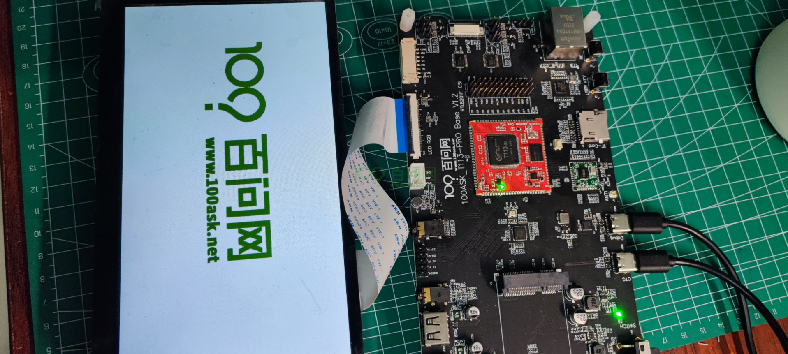
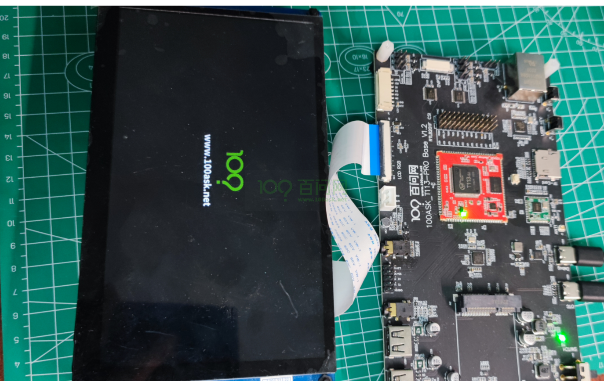

# Uboot下增加启动LOGO图

### 1.  准备合适尺寸图片

在Tina-SDK uboot下，如果增加 logo图片，则需要准备一个 和屏幕分辨率大小类似 或者比他小的BMP图片。

我们已知 7寸RGB屏幕的分辨率是1024 x 600 ，那么就需要先找到一张 小于或等于 1024 x 600 的图（为了加快显示，尽量准备小于500k的图，图片会自动等比例居中显示）。

如下 我准备了 一张 分辨率 尺寸 为 782x276 分辨率的图，那么我需要先调整图片尺寸大小，再进行转换。


### 2.  转换图片格式


### 3.  拷贝到特定目录

~/tina-d1-h/device/config/chips/t113/configs/100ask/configs


### 4.  编译打包使用

```bash
ubuntu@ubuntu1804:~/tina-d1-h/device/config/chips/t113/configs/100ask/configs$ cd ~/tina-d1-h/
ubuntu@ubuntu1804:~/tina-d1-h$ ls
build  config  Config.in  device  dl  lichee  Makefile  out  package  prebuilt  README.md  rules.mk  scripts  target  tmp  toolchain  tools
ubuntu@ubuntu1804:~/tina-d1-h$ make -j32
```


```bash
#### make completed successfully (01:24 (mm:ss)) ####

ubuntu@ubuntu1804:~/tina-d1-h$
ubuntu@ubuntu1804:~/tina-d1-h$ pack
--==========--
PACK_CHIP         sun8iw20p1
PACK_PLATFORM     tina
PACK_BOARD        t113-100ask
PACK_KERN
PACK_DEBUG        uart3
PACK_SIG          none
PACK_SECURE       none
PACK_MODE         normal
PACK_FUNC         android
PACK_PROGRAMMER   none
PACK_TAR_IMAGE    none
PACK_TOPDIR       /home/ubuntu/tina-d1-h
--==========--
No kernel param, parse it from t113
copying tools file
copying configs file
storage_type value is 5
rm /home/ubuntu/tina-d1-h/out/t113-100ask/image/sys_partition_nor.fex
rm /home/ubuntu/tina-d1-h/out/t113-100ask/image/image_nor.cfg
copying boot resource

LZMA 4.65 : Igor Pavlov : Public domain : 2009-02-03
copying boot file
make user resource for : /home/ubuntu/tina-d1-h/out/t113-100ask/image/sys_partition.fex
handle partition user-res
no user resource partitions
APP_PART_DOWNLOAD_FILE = /home/ubuntu/tina-d1-h/out/t113-100ask/image/app.fex
Need size of filesystem
no data resource partitions
don't build dtbo ...
update_chip
pack boot package
GetPrivateProfileSection read to end
content_count=3
LICHEE_REDUNDANT_ENV_SIZE config in BoardConfig.mk
--mkenvimage create redundant env data!--
---redundant env data size 0x20000---
packing for tina linux
normal
mbr count = 4

partitation file Path=/home/ubuntu/tina-d1-h/out/t113-100ask/image/sys_partition.bin
mbr_name file Path=/home/ubuntu/tina-d1-h/out/t113-100ask/image/sunxi_mbr.fex
download_name file Path=/home/ubuntu/tina-d1-h/out/t113-100ask/image/dlinfo.fex

mbr size = 16384
mbr magic softw411
disk name=boot-resource
disk name=env
disk name=env-redund
disk name=boot
disk name=rootfs
disk name=private
disk name=rootfs_data
disk name=UDISK
this is not a partition key
update_for_part_info 0
crc 0 = 619ffc7
crc 1 = 93a4ae9a
crc 2 = f6125b3c
crc 3 = 63af0a61
gpt_head->header_crc32 = 0x5b727ca2
GPT----part num 8---
gpt_entry: 128
gpt_header: 92
GPT:boot-resource: 12000         137c5
GPT:env         : 137c6         139bd
GPT:env-redund  : 139be         13bb5
GPT:boot        : 13bb6         159b5
GPT:rootfs      : 159b6         27ac5
GPT:private     : 27ac6         2a2c5
GPT:rootfs_data : 2a2c6         2cac5
GPT:UDISK       : 2cac6         ffffffde
update gpt file ok
update mbr file ok
temp = 20
mbr count = 4 total_sectors = 15269888 logic_offset = 40960

partitation file Path=/home/ubuntu/tina-d1-h/out/t113-100ask/image/sys_partition.bin
mbr_name file Path=/home/ubuntu/tina-d1-h/out/t113-100ask/image/sunxi_mbr.fex
download_name file Path=/home/ubuntu/tina-d1-h/out/t113-100ask/image/dlinfo.fex

mbr size = 16384
mbr magic softw411
disk name=boot-resource
disk name=env
disk name=env-redund
disk name=boot
disk name=rootfs
disk name=private
disk name=rootfs_data
disk name=UDISK
this is not a partition key
update_for_part_info 0
crc 0 = 619ffc7
crc 1 = 93a4ae9a
crc 2 = f6125b3c
crc 3 = 63af0a61
gpt_head->header_crc32 = 0xc176d530
GPT----part num 8---
gpt_entry: 128
gpt_header: 92
GPT:boot-resource: 12000         137c5
GPT:env         : 137c6         139bd
GPT:env-redund  : 139be         13bb5
GPT:boot        : 13bb6         159b5
GPT:rootfs      : 159b6         27ac5
GPT:private     : 27ac6         2a2c5
GPT:rootfs_data : 2a2c6         2cac5
GPT:UDISK       : 2cac6         e8ffde
update gpt file ok
update mbr file ok
====================================
show "sys_partition_for_dragon.fex" message
------------------------------------
  [mbr]
  mbr_size  : 16384 Kbyte
------------------------------------
  partition_name  : boot-resource
  partition_size  : 6086
  downloadfile  : boot-resource.fex
  boot-resource.fex size : 2.0M byte
------------------------------------
  partition_name  : env
  partition_size  : 504
  downloadfile  : env.fex
  env.fex size : 128K byte
------------------------------------
  partition_name  : env-redund
  partition_size  : 504
  downloadfile  : env.fex
  env.fex size : 128K byte
------------------------------------
  partition_name  : boot
  partition_size  : 7680
  downloadfile  : boot.fex
  boot.fex -> /home/ubuntu/tina-d1-h/out/t113-100ask/boot.img
  boot.img size : 3.7M byte
------------------------------------
  partition_name  : rootfs
  partition_size  : 74000
  downloadfile  : rootfs.fex
  rootfs.fex -> /home/ubuntu/tina-d1-h/out/t113-100ask/rootfs.img
  rootfs.img size : 37M byte
------------------------------------
  partition_name  : private
  partition_size  : 10240
------------------------------------
  partition_name  : rootfs_data
  partition_size  : 10240
------------------------------------
  partition_name  : UDISK
  partition_name  : rootfs_data
  partition_size  : 10240
------------------------------------
/home/ubuntu/tina-d1-h/out/host/bin/
/home/ubuntu/tina-d1-h/out/t113-100ask/image
Begin Parse sys_partion.fex
Add partion boot-resource.fex BOOT-RESOURCE_FEX
Add partion very boot-resource.fex BOOT-RESOURCE_FEX
FilePath: boot-resource.fex
FileLength=1fb400Add partion env.fex ENV_FEX000000000
Add partion very env.fex ENV_FEX000000000
FilePath: env.fex
FileLength=20000Add partion env.fex ENV_FEX000000000
Add partion very env.fex ENV_FEX000000000
FilePath: env.fex
FileLength=20000Add partion boot.fex BOOT_FEX00000000
Add partion very boot.fex BOOT_FEX00000000
FilePath: boot.fex
FileLength=3ad800Add partion rootfs.fex ROOTFS_FEX000000
Add partion very rootfs.fex ROOTFS_FEX000000
FilePath: rootfs.fex
FileLength=2420000BuildImg 0
Dragon execute image.cfg SUCCESS !
----------image is for nand/emmc----------
----------image is at----------

/home/ubuntu/tina-d1-h/out/t113-100ask/tina_t113-100ask_uart3.img

pack finish
ubuntu@ubuntu1804:~/tina-d1-h$

```

拷贝此镜像至Windows系统  /home/ubuntu/tina-d1-h/out/t113-100ask/tina_t113-100ask_uart3.img  使用 PhoenixSuit烧录。

### 启动开发板查看



### 调整图像大小

7寸屏幕尺寸是1024x600那么我们可以做一个 2/1尺寸大小的图像，并且背景色改为 黑色，也就是需要做一个 512 x 300分辨率左右的黑色背景 logo 图。

类似下图所示，只有 312KB 


之后，我们将原来的 bootlogo.bmp 替换，然后编译烧录进去，启动系统可以看到 新的图片 加载启动都很快。

