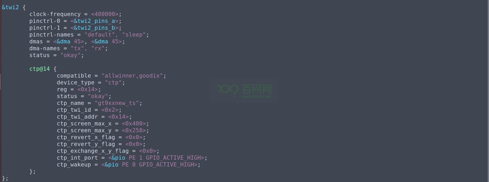

# TinaLinux增加内核模块

## 增加一个已有的内核模块

7寸1024x600分辨率+电容触摸屏：https://item.taobao.com/item.htm?id=611156659477&

### 查看原理图


通过对比原理图，可以得到触摸屏信号和主控 对应的引脚关系为如下表格所示：

| 电路图引脚标号 | T113s3引脚名 |
| -------------- | ------------ |
| CTP_INT        | PE1          |
| CTP_RST        | PE0          |
| RPI_SCL        | PE12         |
| RPI_SDA        | PE13         |

> 注意：此内容假设您已经了解I2C驱动开发，熟悉input子系统，可以看懂电路图等基础，如果不具备 建议 观看 韦老师的视频 I2C子系统开发 https://ldd.100ask.net/04_I2C/01/     Input子系统开发： https://ldd.100ask.net/05_Input/04_5/ 
>
> 全志TinaSDK TWI 开发参考文档： https://tina.100ask.net/SdkModule/Linux_TWI_DevelopmentGuide-01/

通过查看数据手册  **T113-s3_datasheet_v1.6.pdf**  P41 可以看出来，PE12 PE13  复用模式为 function2 时为 I2c(全志这里叫TWI) ，由此 我们知道 需要在内核设备树内 twi2 节点下进行初始化，并增加 gt911 触摸设备书节点。


### 确认设备树

> TinaSDK dts设备树语法定义使用等可以参考文档： https://tina.100ask.net/SdkModule/Linux_Deploy_DevelopmentGuide-03/  如果希望深入学习 dts 可以参考视频深入学习 https://www.100ask.net/video/detail/p_5e61a9f374112_5P2wQoy0

在最开始我们知道内核的设备树文件在  **device/config/chips/t113/configs/100ask/**  目录下，名为  board.dts ，通过 vim /gedit等工具编译 board.dts文件

1. 先找到 引脚定义 `&pio `节点，在里面添加 **twi2**  引脚复用，把PE12 PE13 复用为 twi2 模式。
2. 在底部增加 &twi2  节点路径，并参考其他节点设置，将其启用。
3. 节点内 增加 我们的gt911 触摸屏的触摸设备节点，并根据节点属性 和实际的 屏幕参数 添加对应值，需要 注意 **ctp_int_port** 就是我们的 **CTP_INT** 引脚，**ctp_wakeup** 就是我们原理图上 **CTP_RST** 引脚。
4. 保存后，退出即可，**需要注意的是，如果您自行添加 类似的触摸屏节点，则需要检查一下 你增加的 设备树节点 引脚 是否和默认的存在冲突，如果存在冲突需要解决后 才能正确添加并使用**。


```shell
&pio {
		twi2_pins_a: twi2@0 {
                pins = "PE12", "PE13";
                function = "twi2";
                drive-strength = <10>;
        };

        twi2_pins_b: twi2@1 {
                pins = "PE12", "PE13";
                function = "gpio_in";
        };
};
```


``` shell
&twi2 {
        clock-frequency = <400000>;
        pinctrl-0 = <&twi2_pins_a>;
        pinctrl-1 = <&twi2_pins_b>;
        pinctrl-names = "default", "sleep";
        dmas = <&dma 45>, <&dma 45>;
        dma-names = "tx", "rx";
        status = "okay";

        ctp@14 {
                compatible = "allwinner,goodix";
                device_type = "ctp";
                reg = <0x14>;
                status = "okay";
                ctp_name = "gt9xxnew_ts";
                ctp_twi_id = <0x2>;
                ctp_twi_addr = <0x14>;
                ctp_screen_max_x = <0x400>;
                ctp_screen_max_y = <0x258>;
                ctp_revert_x_flag = <0x0>;
                ctp_revert_y_flag = <0x0>;
                ctp_exchange_x_y_flag = <0x0>;
                ctp_int_port = <&pio PE 1 GPIO_ACTIVE_HIGH>;
                ctp_wakeup = <&pio PE 0 GPIO_ACTIVE_HIGH>;
        };
};
```


​	在TinaSDK 内Linux kernel的设备树 会默认和 boot0  uboot optee保存在一起，以便加速启动，所以 没有办法 单独编译设备树，去打包升级，我们只能通过在TinaSDK目录下使用  make 命令 来打包整个系统 系统会自动帮你编译 Linux设备树文件。

### 配置内核模块

在上一章节，介绍了如何使用Kconfig修改配置，举例使用在 tina-sdk 源码目录下 通过 `make kernel_menuconfig`命令直接进入内核菜单选项，进行配置内核选项，但是这种做法，只能保证本次编译有效，一旦使用了 make distclean 或者 make clean 过内核源码目录缓存，配置就会失效。

在TinaSDK 里面，整套编译系统框架基于 openwrt 14版本进行扩展支持，所以在内核选项配置层面，也延续了 原有的编译修改方式。如果我们需要修改内核配置项，并保存生效，则需要了解清楚openwrt对内核模块/配置文件是如何进行处理的。

----

内核默认配置文件在 `device/config/chips/t113/configs/100ask/linux/`目录下，一般情况下原厂提供SDK都会提供，默认的config文件和 tinasdk的关联性很强，一般情况下不能直接去 修改这里的 config文件，修改过后导致你编译kernel时出现很多选项依赖问题。

如果遇到修改内核配置并保存，我们应该如何操作呢？


如下所示，我们以增加 选择 默认支持的 gt911驱动模块为例，不使用` make kernel_menuconfig`进入内核菜单配置界面，而是直接在 TinaSDK源码根目录下 执行 `make  menuconfig` 进入 到 kernel modules 一层层找到 我们的 驱动模块。

你可以理解为 TinaSDK 帮我们提前把 模块之间的依赖都处理好了，我们只需要选择 使用那个模块就可以。


如上所示，TinaSDK提前帮我们把内核模块配置项依赖关系帮我们处理好了，那么在哪里处理呢？  对于我们的100ASK_T113s3-Pro开发板 在 **target/allwinner/t113-common/**目录内  这里有个 **modules.mk** 文件。


打开 **modules.mk**文件 找到 gt911驱动模块驱动的TinaSDK选项位置，可以看到如下图所示，系统已经帮我们提前配置好了 这个模块的依赖关系，以及生成的模块驱动，我们只需要 在TinaSDK config内选中就可以直接用了。


配置成功后，保存推出主界面，就可以继续执行 `make `命令来完整的编译系统了。

### 编译打包 

编译完成后，执行 `pack` 命令即可开始打包系统操作，打包完成后，最后会 提示 **pack finish** 以及使用 红色背景色 告诉你 最终输出的镜像文件。

我们通过 ssh / vmware 拖拽等工具，将其 copy 出来即可。


### 烧录更新

根据之前烧写的文章进行镜像烧录操作。

### 重启验证

首先：确保屏幕和100ASK_T113s3-Pro 开发板 fpc连接好,屏幕背光启动后会自动亮，等待系统启动，

启动过程中，可以看到 一些 关于gt9xx 模块的装载信息


当一个系统内有很多input输入设备在dev目录下可看到很多个 event 节点，我们不知道设备之间对应关系，就可以执行 `cat /proc/bus/input/devices` 来查看你得设备具体对应的 event节点是那个。


通过下图，列出了系统所有的input 设备，可以看到 蓝框所示，是我们的 gt9xx驱动模块，对应的 event节点是2.


此时通过 `cat  /dev/input/event2`命令，同时手放在触摸屏上，就可以看到触摸驱动已经正常，硬件也正常，但是我们现在没有 tslib / ui工具来验证 坐标是否和实物一致，后期可以通过 libinput evtest等开源工具进行验证。


