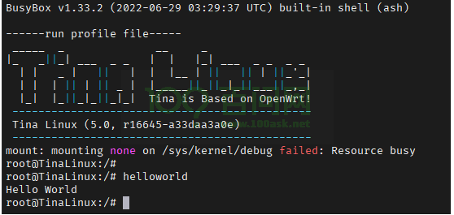

# 添加自定义TinaSDK Package

## 添加自定义TinaSDK Package

​	在 Tina 里新增一个 Hello World 软件包，使用 Tina 编译 Hello World 并一同打包进入 Tina Linux。这个方法不但适用于 Hello World 程序，同样也适用于所以希望将自己的软件包整合进入 Tina Linux 的情况。通过这个方法，可以很方便的管理多库编译链接，解决编译链接的难题，也可以提供Tina Linux 的底层调用库函数的接口，免去单独交叉编译的麻烦。

### 创建Helloword Package

​	首先，在 Tina Linux SDK 的 `openwrt/package` 文件夹新建一个存放项目文件的 `helloworld` 文件夹，并准备 外层 `Makefile` 和 `src` 文件夹，在 `src` 文件夹里建立一个编译使用的 `Makefile`，把源码放到 `src` 文件夹里目录结构如下：


​	首先编写外层 `Makefile` 供 Tina Linux 检索查找。**需要注意的是 Makefile 有非常严格的缩进要求，直接复制代码的话，容易导致缩进混乱,编译报错。**

```makefile
include $(TOPDIR)/rules.mk
include $(BUILD_DIR)/package.mk

PKG_NAME:=helloworld
PKG_RELEASE:=1

PKG_BUILD_DIR := $(BUILD_DIR)/$(PKG_NAME)
SRC_CODE_DIR := ./src/

define Package/$(PKG_NAME)
    SECTION:=hello
    CATEGORY:=Hello World
    TITLE:=hello world test
endef

define Package/$(PKG_NAME)/description
    Hello World
endef

define Build/Prepare
	mkdir -p $(PKG_BUILD_DIR)
	$(CP) -r ./src/*  $(PKG_BUILD_DIR)/
endef

define Build/Compile
	$(MAKE) -C $(PKG_BUILD_DIR)/ \
		ARCH="$(TARGET_ARCH)" \
		AR="$(TARGET_AR)" \
		CC="$(TARGET_CC)" \
		CFLAGS="$(TARGET_CFLAGS)" \
		LDFLAGS="$(TARGET_LDFLAGS)"
endef

define Package/helloworld/install
	$(INSTALL_DIR) $(1)/usr/bin
	$(INSTALL_BIN) $(PKG_BUILD_DIR)/helloworld $(1)/usr/bin/
endef

$(eval $(call BuildPackage,$(PKG_NAME)))

```

​	然后编写用于编译 `helloworld` 的 `Makefile`   **需要注意的是 Makefile 有非常严格的缩进要求，直接复制代码的话，容易导致缩进混乱,编译报错。**

```makefile
main: main.o
	$(CC) $(LDFLAGS) main.o -o helloworld

main.o: main.c
	$(CC) $(CFLAGS) -c main.c

clean:
	rm *.o helloworld
```

​	和 `main.c` 的 `helloworld` 源码

```c
#include <stdio.h>

int main(int argc, char const *argv[])
{
    printf("Hello World Tina Package!\r\n");
    return 0;
}
```

编写完成后，我们可以单独通过 mm 命令来单独编译验证。首先确保已经 `source build/envsetup.sh` 并已经 `lunch` 选择了单板，之后进入**package/myapp/helloword** 文件夹下执行命令 `mm -B`   其中`-B` 参数是先 `clean` 再编译，如果不加这个参数就是直接编译。

如下Logs为 单独编译安装 我们自定义 helloword软件包的log过程

```shel
ubuntu@ubuntu1804:~/tina-d1-h/package/myapp/helloword$ mm -B

make package/myapp/helloword/clean V=s

make[1]: Entering directory '/home/ubuntu/tina-d1-h'
make[2]: Entering directory '/home/ubuntu/tina-d1-h/package/myapp/helloword'
rm -f /home/ubuntu/tina-d1-h/out/t113-100ask_pro/packages/base/helloworld_*
rm -f /home/ubuntu/tina-d1-h/out/t113-100ask_pro/staging_dir/target/stamp/.helloword_installed
rm -f /home/ubuntu/tina-d1-h/out/t113-100ask_pro/staging_dir/target/packages/helloword.list /home/ubuntu/tina-d1-h/out/host/packages/helloword.list
rm -rf /home/ubuntu/tina-d1-h/build/helloworld
make[2]: Leaving directory '/home/ubuntu/tina-d1-h/package/myapp/helloword'
make[1]: Leaving directory '/home/ubuntu/tina-d1-h'

make package/myapp/helloword/install V=s

make[1]: Entering directory '/home/ubuntu/tina-d1-h'
make[2]: Entering directory '/home/ubuntu/tina-d1-h/package/myapp/helloword'
mkdir -p /home/ubuntu/tina-d1-h/build/helloworld
cp -fpR -r ./src/*  /home/ubuntu/tina-d1-h/build/helloworld/
touch /home/ubuntu/tina-d1-h/build/helloworld/.prepared_7459c25d246379212db0c52c445a2843
rm -f /home/ubuntu/tina-d1-h/build/helloworld/.configured_*
rm -f /home/ubuntu/tina-d1-h/out/t113-100ask_pro/staging_dir/target/stamp/.helloword_installed
(cd /home/ubuntu/tina-d1-h/build/helloworld/./; if [ -x ./configure ]; then find /home/ubuntu/tina-d1-h/build/helloworld/ -name config.guess | xargs -r chmod u+w; find /home/ubuntu/tina-d1-h/build/helloworld/ -name config.guess | xargs -r -n1 cp --remove-destination /home/ubuntu/tina-d1-h/scripts/config.guess; find /home/ubuntu/tina-d1-h/build/helloworld/ -name config.sub | xargs -r chmod u+w; find /home/ubuntu/tina-d1-h/build/helloworld/ -name config.sub | xargs -r -n1 cp --remove-destination /home/ubuntu/tina-d1-h/scripts/config.sub; AR="arm-openwrt-linux-muslgnueabi-ar" AS="arm-openwrt-linux-muslgnueabi-gcc -c -Os -pipe -march=armv7-a -mtune=cortex-a7 -mfpu=neon -fno-caller-saves -Wno-unused-result -mfloat-abi=hard  -Wformat -Werror=format-security -fPIC -fstack-protector -D_FORTIFY_SOURCE=2 -Wl,-z,now -Wl,-z,relro" LD=arm-openwrt-linux-muslgnueabi-ld NM="arm-openwrt-linux-muslgnueabi-nm" CC="arm-openwrt-linux-muslgnueabi-gcc" GCC="arm-openwrt-linux-muslgnueabi-gcc" CXX="arm-openwrt-linux-muslgnueabi-g++" RANLIB="arm-openwrt-linux-muslgnueabi-ranlib" STRIP=arm-openwrt-linux-muslgnueabi-strip OBJCOPY=arm-openwrt-linux-muslgnueabi-objcopy OBJDUMP=arm-openwrt-linux-muslgnueabi-objdump SIZE=arm-openwrt-linux-muslgnueabi-size CFLAGS="-Os -pipe -march=armv7-a -mtune=cortex-a7 -mfpu=neon -fno-caller-saves -Wno-unused-result -mfloat-abi=hard  -Wformat -Werror=format-security -fPIC -fstack-protector -D_FORTIFY_SOURCE=2 -Wl,-z,now -Wl,-z,relro " CXXFLAGS="-Os -pipe -march=armv7-a -mtune=cortex-a7 -mfpu=neon -fno-caller-saves -Wno-unused-result -mfloat-abi=hard  -Wformat -Werror=format-security -fPIC -fstack-protector -D_FORTIFY_SOURCE=2 -Wl,-z,now -Wl,-z,relro -Wno-virtual-dtor " CPPFLAGS="-I/home/ubuntu/tina-d1-h/out/t113-100ask_pro/staging_dir/target/usr/include -I/home/ubuntu/tina-d1-h/out/t113-100ask_pro/staging_dir/target/include -I/home/ubuntu/tina-d1-h/prebuilt/gcc/linux-x86/arm/toolchain-sunxi-musl/toolchain/usr/include -I/home/ubuntu/tina-d1-h/prebuilt/gcc/linux-x86/arm/toolchain-sunxi-musl/toolchain/include -I/home/ubuntu/tina-d1-h/prebuilt/gcc/linux-x86/arm/toolchain-sunxi-musl/toolchain/include/fortify " LDFLAGS="-L/home/ubuntu/tina-d1-h/out/t113-100ask_pro/staging_dir/target/usr/lib -L/home/ubuntu/tina-d1-h/out/t113-100ask_pro/staging_dir/target/lib -L/home/ubuntu/tina-d1-h/prebuilt/gcc/linux-x86/arm/toolchain-sunxi-musl/toolchain/usr/lib -L/home/ubuntu/tina-d1-h/prebuilt/gcc/linux-x86/arm/toolchain-sunxi-musl/toolchain/lib -specs=/home/ubuntu/tina-d1-h/build/hardened-ld-pie.specs -znow -zrelro " LIBS=""  ./configure --target=arm-openwrt-linux --host=arm-openwrt-linux --build=x86_64-linux-gnu --program-prefix="" --program-suffix="" --prefix=/usr --exec-prefix=/usr --bindir=/usr/bin --sbindir=/usr/sbin --libexecdir=/usr/lib --sysconfdir=/etc --datadir=/usr/share --localstatedir=/var --mandir=/usr/man --infodir=/usr/info --disable-nls   ; fi; )
touch /home/ubuntu/tina-d1-h/build/helloworld/.configured_yyy
make -C /home/ubuntu/tina-d1-h/build/helloworld/ ARCH="arm" AR="arm-openwrt-linux-muslgnueabi-ar" CC="arm-openwrt-linux-muslgnueabi-gcc" CFLAGS="-Os -pipe -march=armv7-a -mtune=cortex-a7 -mfpu=neon -fno-caller-saves -Wno-unused-result -mfloat-abi=hard  -Wformat -Werror=format-security -fPIC -fstack-protector -D_FORTIFY_SOURCE=2 -Wl,-z,now -Wl,-z,relro" LDFLAGS="-L/home/ubuntu/tina-d1-h/out/t113-100ask_pro/staging_dir/target/usr/lib -L/home/ubuntu/tina-d1-h/out/t113-100ask_pro/staging_dir/target/lib -L/home/ubuntu/tina-d1-h/prebuilt/gcc/linux-x86/arm/toolchain-sunxi-musl/toolchain/usr/lib -L/home/ubuntu/tina-d1-h/prebuilt/gcc/linux-x86/arm/toolchain-sunxi-musl/toolchain/lib -specs=/home/ubuntu/tina-d1-h/build/hardened-ld-pie.specs -znow -zrelro"
make[3]: Entering directory '/home/ubuntu/tina-d1-h/build/helloworld'
arm-openwrt-linux-muslgnueabi-gcc -Os -pipe -march=armv7-a -mtune=cortex-a7 -mfpu=neon -fno-caller-saves -Wno-unused-result -mfloat-abi=hard  -Wformat -Werror=format-security -fPIC -fstack-protector -D_FORTIFY_SOURCE=2 -Wl,-z,now -Wl,-z,relro -c main.c
arm-openwrt-linux-muslgnueabi-gcc -L/home/ubuntu/tina-d1-h/out/t113-100ask_pro/staging_dir/target/usr/lib -L/home/ubuntu/tina-d1-h/out/t113-100ask_pro/staging_dir/target/lib -L/home/ubuntu/tina-d1-h/prebuilt/gcc/linux-x86/arm/toolchain-sunxi-musl/toolchain/usr/lib -L/home/ubuntu/tina-d1-h/prebuilt/gcc/linux-x86/arm/toolchain-sunxi-musl/toolchain/lib -specs=/home/ubuntu/tina-d1-h/build/hardened-ld-pie.specs -znow -zrelro main.o -o helloworld
make[3]: Leaving directory '/home/ubuntu/tina-d1-h/build/helloworld'
touch /home/ubuntu/tina-d1-h/out/t113-100ask_pro/compile_dir/target//.built
mkdir -p /home/ubuntu/tina-d1-h/out/t113-100ask_pro/packages /home/ubuntu/tina-d1-h/build/helloworld/ipkg-sunxi/helloworld/CONTROL /home/ubuntu/tina-d1-h/out/t113-100ask_pro/staging_dir/target/pkginfo
install -d -m0755 /home/ubuntu/tina-d1-h/build/helloworld/ipkg-sunxi/helloworld/usr/bin
install -m0755 /home/ubuntu/tina-d1-h/build/helloworld/helloworld /home/ubuntu/tina-d1-h/build/helloworld/ipkg-sunxi/helloworld/usr/bin/
find /home/ubuntu/tina-d1-h/build/helloworld/ipkg-sunxi/helloworld -name 'CVS' -o -name '.svn' -o -name '.#*' -o -name '*~'| xargs -r rm -rf
export CROSS="arm-openwrt-linux-muslgnueabi-"  NO_RENAME=1 ; NM="arm-openwrt-linux-muslgnueabi-nm" STRIP="arm-openwrt-linux-muslgnueabi-strip --strip-all" STRIP_KMOD="/home/ubuntu/tina-d1-h/scripts/strip-kmod.sh" PATCHELF="/home/ubuntu/tina-d1-h/out/host/bin/patchelf" /home/ubuntu/tina-d1-h/scripts/rstrip.sh /home/ubuntu/tina-d1-h/build/helloworld/ipkg-sunxi/helloworld
rstrip.sh: /home/ubuntu/tina-d1-h/build/helloworld/ipkg-sunxi/helloworld/usr/bin/helloworld: shared object
(cd /home/ubuntu/tina-d1-h/build/helloworld/ipkg-sunxi/helloworld/CONTROL; ( echo "$CONTROL"; printf "Description: "; echo "$DESCRIPTION" | sed -e 's,^[[:space:]]*, ,g'; ) > control; chmod 644 control; ( echo "#!/bin/sh"; echo "[ \"\${IPKG_NO_SCRIPT}\" = \"1\" ] && exit 0"; echo ". \${IPKG_INSTROOT}/lib/functions.sh"; echo "default_postinst \$0 \$@"; ) > postinst; ( echo "#!/bin/sh"; echo ". \${IPKG_INSTROOT}/lib/functions.sh"; echo "default_prerm \$0 \$@"; ) > prerm; chmod 0755 postinst prerm;  )
install -d -m0755 /home/ubuntu/tina-d1-h/out/t113-100ask_pro/packages/base
/home/ubuntu/tina-d1-h/scripts/ipkg-build -c -o 0 -g 0 /home/ubuntu/tina-d1-h/build/helloworld/ipkg-sunxi/helloworld /home/ubuntu/tina-d1-h/out/t113-100ask_pro/packages/base
Packaged contents of /home/ubuntu/tina-d1-h/build/helloworld/ipkg-sunxi/helloworld into /home/ubuntu/tina-d1-h/out/t113-100ask_pro/packages/base/helloworld_1_sunxi.ipk
rm -rf /home/ubuntu/tina-d1-h/out/t113-100ask_pro/staging_dir/target/rootfs/tmp-helloworld
mkdir -p /home/ubuntu/tina-d1-h/out/t113-100ask_pro/staging_dir/target/rootfs/stamp /home/ubuntu/tina-d1-h/out/t113-100ask_pro/staging_dir/target/rootfs/tmp-helloworld
install -d -m0755 /home/ubuntu/tina-d1-h/out/t113-100ask_pro/staging_dir/target/rootfs/tmp-helloworld/usr/bin
install -m0755 /home/ubuntu/tina-d1-h/build/helloworld/helloworld /home/ubuntu/tina-d1-h/out/t113-100ask_pro/staging_dir/target/rootfs/tmp-helloworld/usr/bin/
SHELL= flock /home/ubuntu/tina-d1-h/tmp/.root-copy.flock -c 'cp -fpR /home/ubuntu/tina-d1-h/out/t113-100ask_pro/staging_dir/target/rootfs/tmp-helloworld/. /home/ubuntu/tina-d1-h/out/t113-100ask_pro/staging_dir/target/rootfs/'
rm -rf /home/ubuntu/tina-d1-h/out/t113-100ask_pro/staging_dir/target/rootfs/tmp-helloworld
touch /home/ubuntu/tina-d1-h/out/t113-100ask_pro/staging_dir/target/rootfs/stamp/.helloworld_installed
if [ -f /home/ubuntu/tina-d1-h/out/t113-100ask_pro/staging_dir/target/pkginfo/helloword.default.install.clean ]; then rm -f /home/ubuntu/tina-d1-h/out/t113-100ask_pro/staging_dir/target/pkginfo/helloword.default.install /home/ubuntu/tina-d1-h/out/t113-100ask_pro/staging_dir/target/pkginfo/helloword.default.install.clean; fi; echo "helloworld" >> /home/ubuntu/tina-d1-h/out/t113-100ask_pro/staging_dir/target/pkginfo/helloword.default.install
make[2]: Leaving directory '/home/ubuntu/tina-d1-h/package/myapp/helloword'
make[1]: Leaving directory '/home/ubuntu/tina-d1-h'
ubuntu@ubuntu1804:~/tina-d1-h/package/myapp/helloword$ 
```


### 配置选中Helloword包

之后 `make menuconfig` 里就可以找到 `Hello World` 了,可以进入并勾选它


配置成功后，保存推出主界面，就可以继续执行 `make `命令来完整的编译系统了。


### 编译打包烧录

执行make 编译完成后，就可以执行 `pack` 命令即可开始打包系统操作，打包完成后，最后会 提示 **pack finish** 以及使用 红色背景色 告诉你 最终输出的镜像文件。

我们通过 ssh / vmware 拖拽等工具，将其 copy 出来即可。


烧写方式 有两种，一种是线刷，使用 `PhoenixSuit` 将编译生成的镜像烧录至 spi nand 存储设备上，另一种是通过 [PhoenixCard-V2.8](https://gitlab.com/dongshanpi/tools/-/raw/main/PhoenixCard-V2.8.zip) 工具将系统镜像烧录至TF卡启动。 我们推荐使用 线刷 烧录至 spi nand 方便快速实验。

参考文档：https://allwinner-docs.100ask.net/Board/100ASK_T113-PRO/03-1_FlashSystem.html

参考视频：https://www.bilibili.com/video/BV1Nx4y1w7AF/?p=11&share_source=copy_web&vd_source=e3bf42462ab8667ad5a5469f71947458

### 烧写启动验证

就可以直接运行 `helloworld` 命令了



### 开机自动执行

在系统 rc.final 增加自定义命令 **target/allwinner/t113-100ask/busybox-init-base-files/etc/init.d** 编辑 ` rc.final` 文件


### 编译打包烧录	

​	执行make 编译完成后，就可以执行 `pack` 命令即可开始打包系统操作，打包完成后，最后会 提示 **pack finish** 以及使用 红色背景色 告诉你 最终输出的镜像文件。 我们通过 ssh / vmware 拖拽等工具，将其 copy 出来即可。


​	烧写方式 有两种，一种是线刷，使用 `PhoenixSuit` 将编译生成的镜像烧录至 spi nand 存储设备上，另一种是通过 [PhoenixCard-V2.8](https://gitlab.com/dongshanpi/tools/-/raw/main/PhoenixCard-V2.8.zip) 工具将系统镜像烧录至TF卡启动。 我们推荐使用 线刷 烧录至 spi nand 方便快速实验。

参考文档：https://allwinner-docs.100ask.net/Board/100ASK_T113-PRO/03-1_FlashSystem.html

参考视频：https://www.bilibili.com/video/BV1Nx4y1w7AF/?p=11&share_source=copy_web&vd_source=e3bf42462ab8667ad5a5469f71947458

### 启动验证


