# 创建一个自己的TinaSDK单板

## 创建一个自己的TinaSDK单板

### 了解TinaSDK单板框架

在TinaSDK V2.0的SDK内，如果我们需要增加一个自己的单板配置，需要首先 确定一下 这个SDK是否有支持你得单板主芯片，如果没有 就无法自己添加。

举例，我们自己添加T113 开发板，也是基于 默认已有的 T113板级支持包 进行添加操作的，如果增加自己的 单板，整体涉及两部分。

1. device 内 找到自己的主控芯片，里面的 configs 看是否存在同型号芯片，进行参考
2. target/allwinner 目录内，找到是否存在 默认的同型号芯片系统配置文件夹。

如上两个是非常重要的文件，在TinaSDK V2.0 里面，我们可以看到，这个SDK 支持了 d1-h d1s t113三款主控芯片，进入T113 主控芯片内，存在 bin  boot-resource configs tools 这几个目录，其中 bin tools 这两个目录是系统的一些默认配置/工具，一般不要去动，boot-resource 是存放 开机图片的 文件夹，可以自定义选择修改，我们主要关心 configs 目录

这里面默认存放了 100ask 这个单板配置。对于 default 不用理会，这些是当你的单板没有存在某些配置时，会自动选择选择使用 default 内的文件。


对于 target/allwinner 目录，默认存在 t113-common  t113-100ask 两个目录， t113-common 为 t113芯片的默认配置项，t113-100ask 是我们自己单板相关的配置项文件夹。


### 自定义单板100ask_devkit

前面简单介绍了 在 TinaSDK 一个单板都涉及到了那些重要文件，接下来直接参考现有的 t113 100ask 配置创建我们自己的单板，名字为 100ask_devkit.

1. 在 **device/config/chips/t113/configs/**   复制一份 100ask/ 配置到  100ask_devkit/

```shell
ubuntu@ubuntu1804:~/tina-d1-h/device/config/chips/t113/configs$ cp 100ask/ 100ask_devkit -rfd
ubuntu@ubuntu1804:~/tina-d1-h/device/config/chips/t113/configs$ cd 100ask_devkit/
ubuntu@ubuntu1804:~/tina-d1-h/device/config/chips/t113/configs/100ask_devkit$ ls
BoardConfig.mk  board.dts  env.cfg  linux  linux-5.4  sys_config.fex  sys_partition.fex  uboot-board.dts
ubuntu@ubuntu1804:~/tina-d1-h/device/config/chips/t113/configs/100ask_devkit$ 
```

修改`sys_config.fex`：

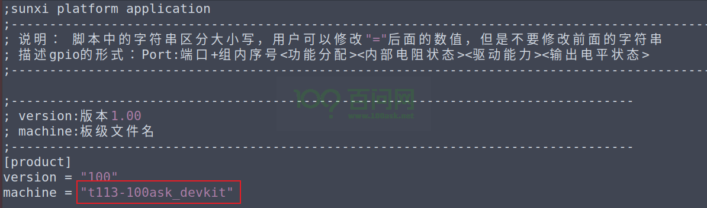

2. 在 **target/allwinner **下复制一份 t113-100ask 配置到 t113-100ask_devkit ，并修改 文件中的内容，使其指向100ask_devkit项目。

- 2.1  重命名单板.mk 如下图所示：
  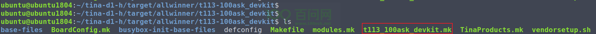

- 2.2 修改  **t113_100ask_devkit.mk**  里面的 **PRODUCT_NAME**  和 **PRODUCT_DEVICE** 两个关键属性。必须要和 前面的单板名称  **.mk**  名称保持一致。

  ~~~bash
  PRODUCT_NAME := t113_100ask_devkit
  PRODUCT_DEVICE := t113-100ask_devkit
  ~~~

  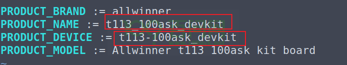

- 2.3 makefile中修改 **BOARD  BOARDNAME** 这里必须要保证和device configs 内的 新增 单板名称保持一致（T113- 表示 t113主芯片- 后面是你的新增单板名称）。

  ~~~bash
  BOARD:=t113-100ask_devkit
  BOARDNAME:=t113-100ask_devkit
  ~~~

  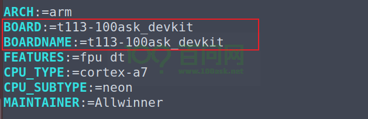

- 2.4 修改 TinaProducts.mk  使其引用我们刚才创建的  t113_100ask_devkit.mk 文件。

  ~~~bash
  $(LOCAL_DIR)/t113_100ask_devkit.mk
  ~~~

  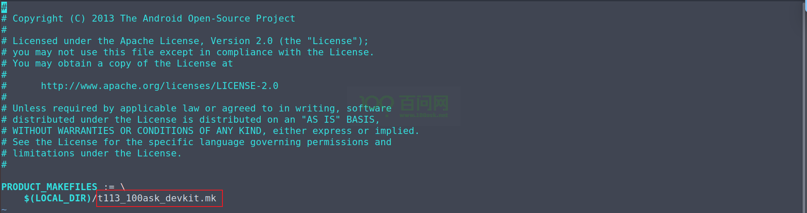

- 2.5  修改 **vendorsetup.sh** 可以在lunch 选项中显示我们新增的单板。 

  ~~~bash
  add_lunch_combo t113_100ask_devkit-tina
  ~~~

  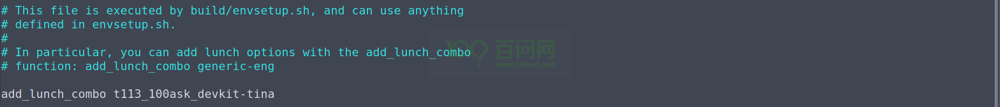

- 2.6 因为整个配置涉及到了一些音频相关操作，需要将 **package/allwinner/alsa-conf-aw/files/t113**  下新建文件夹t113-100ask_devkit ，同样将同文件下t113-100ask/中的内容复制过去，要不会导致报错。

  ~~~bash
  ubuntu@ubuntu1804:~/tina-d1-h/package/allwinner/alsa-conf-aw/files$ cd t113/
  ubuntu@ubuntu1804:~/tina-d1-h/package/allwinner/alsa-conf-aw/files/t113$ ls
  t113-100ask
  ubuntu@ubuntu1804:~/tina-d1-h/package/allwinner/alsa-conf-aw/files/t113$ cp t113-100ask/ t113-100ask_devkit -rfd
  ~~~

- 2.7 可选： 当我们做完上述步骤后，执行 lunch 命令 选择到 我们的 新增单板，这时 还不能编译，需要 使用 make menuconfig 进入配置界面，选中我们新增的单板  为 Target System  保存退出才可以继续执行 make 编译命令。
  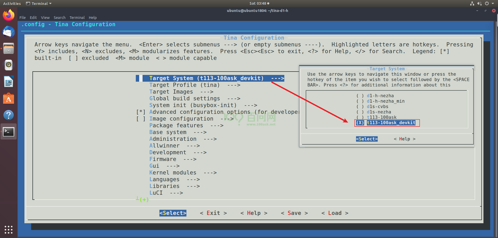

  也可以直接修改 defconfig 文件 `tina-d1-h/target/allwinner/t113-100ask_devkit$ vi defconfig` 参考下图所示。

  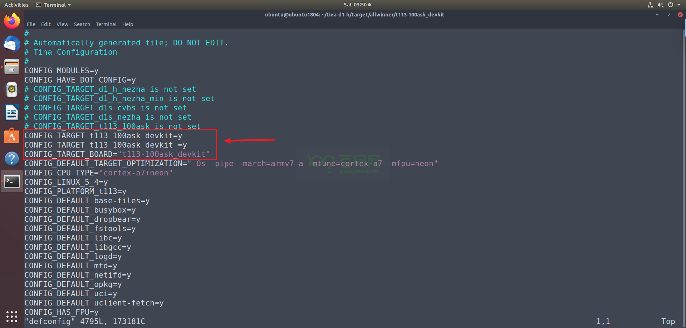

### lunch选择100ask_devkit

3. 根目录执行  `souce build/envsetup.sh`   ` lunch` 后可以看到有新增的编译target。

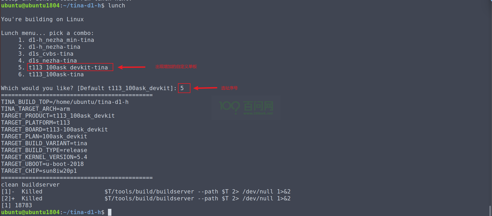

### 编译100ask_devkit单板

编译生成镜像，pack打包后用PhoenixSuit烧录。

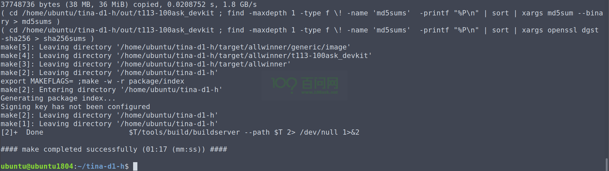

### 烧写更新系统

编译完成后，执行 `pack` 命令即可开始打包系统操作，打包完成后，最后会 提示 **pack finish** 以及使用 红色背景色 告诉你 最终输出的镜像文件。

我们通过 ssh / vmware 拖拽等工具，将其 copy 出来即可。

```shell
ubuntu@ubuntu1804:~/tina-d1-h$ pack
--==========--
PACK_CHIP         sun8iw20p1
PACK_PLATFORM     tina
PACK_BOARD        t113-100ask_devkit
PACK_KERN        
PACK_DEBUG        uart3
PACK_SIG          none
PACK_SECURE       none
PACK_MODE         normal
PACK_FUNC         android
PACK_PROGRAMMER   none
PACK_TAR_IMAGE    none
PACK_TOPDIR       /home/ubuntu/tina-d1-h
--==========--
No kernel param, parse it from t113
copying tools file
copying configs file
storage_type value is 5
rm /home/ubuntu/tina-d1-h/out/t113-100ask_devkit/image/sys_partition_nor.fex
rm /home/ubuntu/tina-d1-h/out/t113-100ask_devkit/image/image_nor.cfg
copying boot resource

LZMA 4.65 : Igor Pavlov : Public domain : 2009-02-03
copying boot file
make user resource for : /home/ubuntu/tina-d1-h/out/t113-100ask_devkit/image/sys_partition.fex
handle partition user-res
no user resource partitions
APP_PART_DOWNLOAD_FILE = /home/ubuntu/tina-d1-h/out/t113-100ask_devkit/image/app.fex
Need size of filesystem
no data resource partitions
don't build dtbo ...
update_chip
pack boot package
GetPrivateProfileSection read to end
content_count=3
LICHEE_REDUNDANT_ENV_SIZE config in BoardConfig.mk
--mkenvimage create redundant env data!--
---redundant env data size 0x20000---
packing for tina linux
normal
mbr count = 4

partitation file Path=/home/ubuntu/tina-d1-h/out/t113-100ask_devkit/image/sys_partition.bin
mbr_name file Path=/home/ubuntu/tina-d1-h/out/t113-100ask_devkit/image/sunxi_mbr.fex
download_name file Path=/home/ubuntu/tina-d1-h/out/t113-100ask_devkit/image/dlinfo.fex

mbr size = 16384
mbr magic softw411
disk name=boot-resource
disk name=env
disk name=env-redund
disk name=boot
disk name=rootfs
disk name=private
disk name=rootfs_data
disk name=UDISK
this is not a partition key
update_for_part_info 0
crc 0 = 2e2d961c
crc 1 = bb90c741
crc 2 = de2632e7
crc 3 = 4b9b63ba
gpt_head->header_crc32 = 0xd18a5848
GPT----part num 8---
gpt_entry: 128
gpt_header: 92
GPT:boot-resource: 12000         12fd9       
GPT:env         : 12fda         131d1       
GPT:env-redund  : 131d2         133c9       
GPT:boot        : 133ca         154fd       
GPT:rootfs      : 154fe         2a105       
GPT:private     : 2a106         2c905       
GPT:rootfs_data : 2c906         2f105       
GPT:UDISK       : 2f106         ffffffde    
update gpt file ok
update mbr file ok
temp = 20
mbr count = 4 total_sectors = 15269888 logic_offset = 40960

partitation file Path=/home/ubuntu/tina-d1-h/out/t113-100ask_devkit/image/sys_partition.bin
mbr_name file Path=/home/ubuntu/tina-d1-h/out/t113-100ask_devkit/image/sunxi_mbr.fex
download_name file Path=/home/ubuntu/tina-d1-h/out/t113-100ask_devkit/image/dlinfo.fex

mbr size = 16384
mbr magic softw411
disk name=boot-resource
disk name=env
disk name=env-redund
disk name=boot
disk name=rootfs
disk name=private
disk name=rootfs_data
disk name=UDISK
this is not a partition key
update_for_part_info 0
crc 0 = 2e2d961c
crc 1 = bb90c741
crc 2 = de2632e7
crc 3 = 4b9b63ba
gpt_head->header_crc32 = 0x4b8ef1da
GPT----part num 8---
gpt_entry: 128
gpt_header: 92
GPT:boot-resource: 12000         12fd9       
GPT:env         : 12fda         131d1       
GPT:env-redund  : 131d2         133c9       
GPT:boot        : 133ca         154fd       
GPT:rootfs      : 154fe         2a105       
GPT:private     : 2a106         2c905       
GPT:rootfs_data : 2c906         2f105       
GPT:UDISK       : 2f106         e8ffde      
update gpt file ok
update mbr file ok
====================================
show "sys_partition_for_dragon.fex" message
------------------------------------
  [mbr]
  mbr_size  : 16384 Kbyte
------------------------------------
  partition_name  : boot-resource
  partition_size  : 4058
  downloadfile  : boot-resource.fex
  boot-resource.fex size : 2.0M byte
------------------------------------
  partition_name  : env
  partition_size  : 504
  downloadfile  : env.fex
  env.fex size : 128K byte
------------------------------------
  partition_name  : env-redund
  partition_size  : 504
  downloadfile  : env.fex
  env.fex size : 128K byte
------------------------------------
  partition_name  : boot
  partition_size  : 8500
  downloadfile  : boot.fex
  boot.fex -> /home/ubuntu/tina-d1-h/out/t113-100ask_devkit/boot.img
  boot.img size : 4.0M byte
------------------------------------
  partition_name  : rootfs
  partition_size  : 85000
  downloadfile  : rootfs.fex
  rootfs.fex -> /home/ubuntu/tina-d1-h/out/t113-100ask_devkit/rootfs.img
  rootfs.img size : 36M byte
------------------------------------
  partition_name  : private
  partition_size  : 10240
------------------------------------
  partition_name  : rootfs_data
  partition_size  : 10240
------------------------------------
  partition_name  : UDISK
  partition_name  : rootfs_data
  partition_size  : 10240
------------------------------------
/home/ubuntu/tina-d1-h/out/host/bin/
/home/ubuntu/tina-d1-h/out/t113-100ask_devkit/image
Begin Parse sys_partion.fex
Add partion boot-resource.fex BOOT-RESOURCE_FEX
Add partion very boot-resource.fex BOOT-RESOURCE_FEX
FilePath: boot-resource.fex
FileLength=1fb400Add partion env.fex ENV_FEX000000000
Add partion very env.fex ENV_FEX000000000
FilePath: env.fex
FileLength=20000Add partion env.fex ENV_FEX000000000
Add partion very env.fex ENV_FEX000000000
FilePath: env.fex
FileLength=20000Add partion boot.fex BOOT_FEX00000000
Add partion very boot.fex BOOT_FEX00000000
FilePath: boot.fex
FileLength=3e9000Add partion rootfs.fex ROOTFS_FEX000000
Add partion very rootfs.fex ROOTFS_FEX000000
FilePath: rootfs.fex
FileLength=2400000BuildImg 0
Dragon execute image.cfg SUCCESS !
----------image is for nand/emmc----------
----------image is at----------

/home/ubuntu/tina-d1-h/out/t113-100ask_devkit/tina_t113-100ask_devkit_uart3.img

pack finish
ubuntu@ubuntu1804:~/tina-d1-h$
```

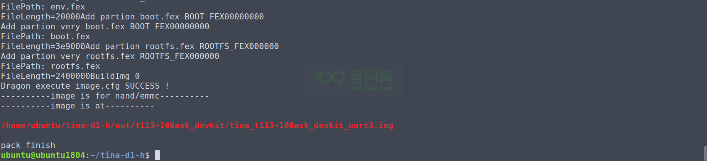

烧写方式 有两种，一种是线刷，使用 `PhoenixSuit` 将编译生成的镜像烧录至 spi nand 存储设备上，另一种是通过 [PhoenixCard-V2.8](https://gitlab.com/dongshanpi/tools/-/raw/main/PhoenixCard-V2.8.zip) 工具将系统镜像烧录至TF卡启动。 我们推荐使用 线刷 烧录至 spi nand 方便快速实验。

参考文档：https://allwinner-docs.100ask.net/Board/100ASK_T113-PRO/03-1_FlashSystem.html

参考视频：https://www.bilibili.com/video/BV1Nx4y1w7AF/?p=11&share_source=copy_web&vd_source=e3bf42462ab8667ad5a5469f71947458

### 启动验证

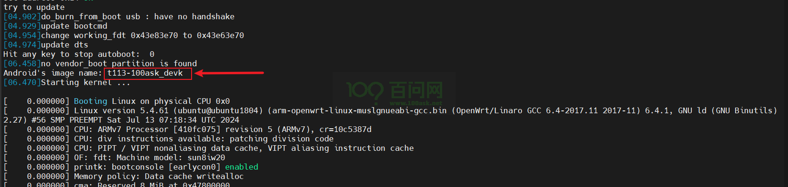

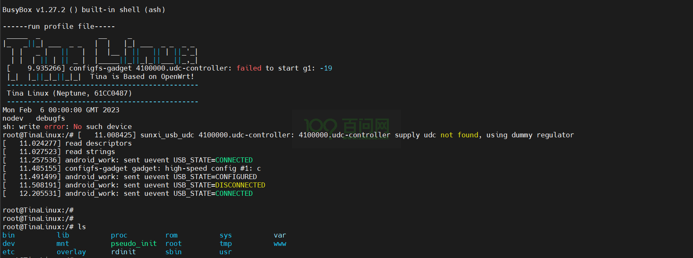

因为系统差异很小，所以只能通过加载kernel的image name信息 看到 我们当前的设备名称。

