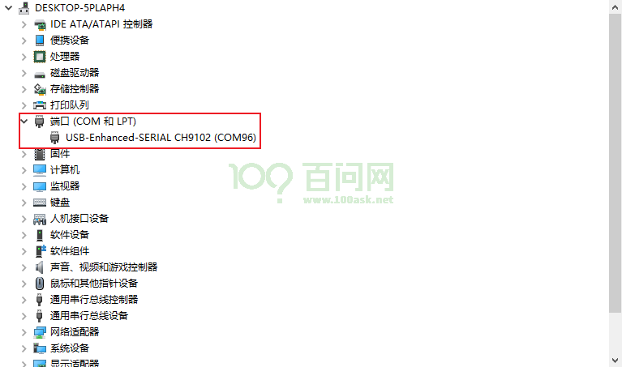

# 启动开发板

开发板启动连接接口如下：


接入**③12v电源接口**、**①OTG**和**②串口**。拨动电源开关（拨动开关朝上图的右边拨动，OTG线不供电），即可启动开发板。

## windows下使用 ADB登录系统
### 连接OTG线

将开发板配套的两根typec线，一根 直接连接至 开发板 `OTG烧录接口` 另一头连接至电脑的USB接口，开发板默认有系统，接通otg电源线就会通电并直接启动。

### 安装windows板ADB
点击链接下载Windows版ADB工具 [ADB.7z](https://dl.100ask.net/Hardware/MPU/T113i-Industrial/Tools/ADB.7z)
下载完成后解压，可以看到如下目录，


然后 我们单独 拷贝 上一层的 **platform-tools** 文件夹到任意 目录，拷贝完成后，记住这个 目录位置，我们接下来要把这个 路径添加至 Windows系统环境变量里。


我这里是把它单独拷贝到了 D盘，我的目录是 `D:\platform-tools` 接下来 我需要把它单独添加到Windows系统环境变量里面才可以在任意位置使用adb命令。


添加到 Windows系统环境变量里面


### 打开cmd连接开发板
打开CMD Windows 命令提示符方式有两种
方式1：直接在Windows10/11搜索对话框中输入  cmd 在弹出的软件中点击  `命令提示符`
方式2：同时按下 wind + r 键，输入 cmd 命令，按下确认 就可以自动打开 `命令提示符`


打开命令提示符，输出 adb命令可以直接看到我们的adb已经配置成功


连接好开发板的 OTG 并将其连接至电脑上，然后 输入 adb shell就可以自动登录系统

``` shell
C:\Users\MeiHao>adb shell
# ls
THIS_IS_NOT_YOUR_ROOT_FILESYSTEM  opt
bin                               proc
dev                               root
etc                               run
init                              sbin
lib                               sys
lib32                             system
linuxrc                           tmp
lost+found                        usr
media                             var
mnt
# ifconfig
lo        Link encap:Local Loopback
          inet addr:127.0.0.1  Mask:255.0.0.0
          inet6 addr: ::1/128 Scope:Host
          UP LOOPBACK RUNNING  MTU:65536  Metric:1
          RX packets:0 errors:0 dropped:0 overruns:0 frame:0
          TX packets:0 errors:0 dropped:0 overruns:0 carrier:0
          collisions:0 txqueuelen:1000
          RX bytes:0 (0.0 B)  TX bytes:0 (0.0 B)

wlan0     Link encap:Ethernet  HWaddr E8:51:9E:DC:9D:C5
          inet addr:192.168.1.31  Bcast:192.168.1.255  Mask:255.255.255.0
          inet6 addr: fe80::ea51:9eff:fedc:9dc5/64 Scope:Link
          UP BROADCAST RUNNING MULTICAST  MTU:1500  Metric:1
          RX packets:6965 errors:0 dropped:136 overruns:0 frame:0
          TX packets:100 errors:0 dropped:0 overruns:0 carrier:0
          collisions:0 txqueuelen:1000
          RX bytes:1039615 (1015.2 KiB)  TX bytes:7046 (6.8 KiB)

#
```
ADB 也可以作为文件传输使用，例如：
``` shell
C:\System> adb push badapple.mp4 /mnt/UDISK   # 将 badapple.mp4 上传到开发板 /mnt/UDISK 目录内
C:\System> adb pull /mnt/UDISK/badapple.mp4   # 将 /mnt/UDISK/badapple.mp4 下拉到当前目录内
```

## 使用串口登录系统
### 1. 连接串口线
将配套的TypeC线一段连接至开发板的串口/供电接口，另一端连接至电脑USB接口，连接成功后板载的红色电源灯会亮起。
默认情况下系统会自动安装串口设备驱动，如果没有自动安装，可以使用驱动精灵来自动安装。
* 对于Windows系统
此时Windows设备管理器 在 端口(COM和LPT) 处会多出一个串口设备，一般是以 `USB-Enhanced-SERIAL CH9102`开头，您需要留意一下后面的具体COM编号，用于后续连接使用。



如上图，COM号是96，我们接下来连接所使用的串口号就是96。

* 对于Linux系统
可以查看是否多出一个/dev/tty 设备,一般情况设备节点为 /dev/ttyACM0  。


### 2. 打开串口控制台
#### 获取串口工具
使用Putty或者MobaXterm等串口工具来开发板设备。

* 其中putty工具可以访问页面  https://www.chiark.greenend.org.uk/~sgtatham/putty/  来获取。
* MobaXterm可以通过访问页面 https://mobaxterm.mobatek.net/ 获取 (推荐使用)。

#### 使用putty登录串口


#### 使用Mobaxterm登录串口
打开MobaXterm，点击左上角的“Session”，在弹出的界面选中“Serial”，如下图所示选择端口号（前面设备管理器显示的端口号COM21）、波特率（Speed 115200）、流控（Flow Control: none）,最后点击“OK”即可。步骤如下图所示。
**注意：流控（Flow Control）一定要选择none，否则你将无法在MobaXterm中向串口输入数据**


### 3. 进入系统shell
使用串口工具成功打开串口后，可以直接按下 Enter 键 进入shell，当然您也可以按下板子上的 `Reset`复位键，来查看完整的系统信息。

``` bash
[27]HELLO! BOOT0 is starting!
[29]BOOT0 commit : 1417090655
[32]set pll start
[38]periph0 has been enabled
[41]set pll end
[43][pmu]: bus read error
[45]board init ok
[47]enable_jtag
[48]ZQ value = 0x30
[50]get_pmu_exist() = -1
[53]DRAM BOOT DRIVE INFO: V0.33
[56]DRAM CLK = 792 MHz
[58]DRAM Type = 3 (2:DDR2,3:DDR3)
[61]DRAMC read ODT  off.
[63]DRAM ODT value: 0x42.
[66]ddr_efuse_type: 0xa
[69]DRAM SIZE =128 M
[71]dram_tpr4:0x0
[73]PLL_DDR_CTRL_REG:0xf8004100
[76]DRAM_CLK_REG:0xc0000000
[78][TIMING DEBUG] MR2= 0x18
[86]DRAM simple test OK.
[89]rtc standby flag is 0x0, super standby flag is 0x0
[94]dram size =128
[96]card no is 2
[98]sdcard 2 line count 4
[100][mmc]: mmc driver ver 2021-05-21 14:47
[110][mmc]: Wrong media type 0x0, but host sdc2, try mmc first
[115][mmc]: ***Try MMC card 2***
[123][mmc]: mmc 2 cmd 1 timeout, err 100
[126][mmc]: mmc 2 cmd 1 err 100
[129][mmc]: mmc 2 send op cond failed
[133][mmc]: MMC card 2 Card did not respond to voltage select!
[138][mmc]: ***SD/MMC 2 init error!!!***
[145][mmc]: ***Try SD card 2***
[158][mmc]: HSSDR52/SDR25 4 bit
[161][mmc]: 50000000 Hz
[163][mmc]: 3696 MB
[165][mmc]: ***SD/MMC 2 init OK!!!***
[259]Loading boot-pkg Succeed(index=0).
[262]Entry_name        = u-boot
[269]Entry_name        = optee
[273]Entry_name        = dtb
[276]mmc not para
[278]Jump to second Boot.
M/TC: OP-TEE version: 8b49ce62-dirty (gcc version 5.3.1 20160412 (Linaro GCC 5.3-2016.05)) #1 Fri Aug 12 08:24:15 UTC 2022 arm


U-Boot 2018.07-g37ec4fd-dirty (Jul 20 2024 - 08:22:54 +0000) Allwinner Technology

[00.330]CPU:   Allwinner Family
[00.333]Model: sun8iw20
[00.335]DRAM:  128 MiB
[00.338]Relocation Offset is: 04ec3000
[00.365]secure enable bit: 0
E/TC:0   fdt_getprop_u32:343 prop trace_level not found
[00.379]CPU=1008 MHz,PLL6=600 Mhz,AHB=200 Mhz, APB1=100Mhz  MBus=300Mhz
[00.385]gic: sec monitor mode
[00.388]line:703 init_clocks
[00.391]flash init start
[00.393]workmode = 0,storage type = 2
[00.397][mmc]: mmc driver ver uboot2018:2023-07-4 16:18:00
[00.403][mmc]: get sdly from uboot header fail
[00.407][mmc]: Is not EXT_PARA0_ID or EXT_PARA0_TUNING_SUCCESS_FLAG!
[00.413][mmc]: SUNXI SDMMC Controller Version:0x50310
[00.434][mmc]: card_caps:0x3000000a
[00.437][mmc]: host_caps:0x3000003f
[00.444][mmc]: read mmc 2 info ok
[00.447]sunxi flash init ok
[00.450]drv_disp_init
partno erro : can't find partition bootloader
[00.495]drv_disp_init finish
[00.505]Loading Environment from SUNXI_FLASH... OK
[00.524]boot_gui_init:start
partno erro : can't find partition Reserve0
bad fb1_cfg[w=0,h=0,bpp=32,format=0]
[00.540]boot_gui_init:finish
partno erro : can't find partition bootloader
[00.549]bmp_name=bootlogo.bmp size 1843254
[00.646]Item0 (Map) magic is bad
[00.649]the secure storage item0 copy0 magic is bad
[00.657]Item0 (Map) magic is bad
[00.660]the secure storage item0 copy1 magic is bad
[00.665]Item0 (Map) magic is bad
secure storage read widevine fail
secure storage read ec_key fail
secure storage read ec_cert1 fail
secure storage read ec_cert2 fail
secure storage read ec_cert3 fail
secure storage read rsa_key fail
secure storage read rsa_cert1 fail
secure storage read rsa_cert2 fail
secure storage read rsa_cert3 fail
[00.695]usb burn from boot
delay time 0
weak:otg_phy_config
[00.706]usb prepare ok
[00.717]LCD open finish
[00.913]usb sof ok
[00.915]usb probe ok
[00.917]usb setup ok
set address 0x11
set address 0x11 ok
set address 0x12
set address 0x12 ok
[01.322]do_burn_from_boot usb : have no handshake
List file under ULI/factory
** Unrecognized filesystem type **
root_partition is rootfs
set root to /dev/mmcblk0p5
[01.338]update part info
[01.341]update bootcmd
[01.347]change working_fdt 0x44882e68 to 0x44862e68
[01.351][mmc]: can't find node "sunxi-mmc2" try "mmc"
[01.356][mmc]: no mmc-hs400-1_8v!
[01.359][mmc]: no mmc-hs200-1_8v!
[01.362][mmc]: no mmc-ddr-1_8v!
[01.365][mmc]: get max-frequency ok 50000000 Hz
[01.370][mmc]: get sunxi-mmc2 string failed
[01.396]update dts
Hit any key to stop autoboot:  0
boot  addr 0x43000000 0x4390b800 exceed dsp0 scope
dsp0  addr 0x43000000 0x43100000
[01.849]no vendor_boot partition is found
Android's image name: sun8i_arm
The loading address of the kernel is not in the boot image
   Loading Ramdisk to 4441e000, end 4485e39a ... OK
ERROR: reserving fdt memory region failed (addr=41b00000 size=100000)
ERROR: reserving fdt memory region failed (addr=4490d000 size=258000)
[01.905]Starting kernel ...

[01.907][mmc]: mmc exit start
[01.921][mmc]: mmc 2 exit ok
[    0.000000] Booting Linux on physical CPU 0x0
[    0.000000] Linux version 5.4.61 (ubuntu@ubuntu1804) (arm-linux-gnueabi-gcc (Linaro GCC 5.3-2016.05) 5.3.1 20160412, GNU ld (Linaro_Binutils-2016.05) 2.25.0 Linaro 2016_02) #5 SMP PREEMPT Tue Nov 26 01:16:41 EST 2024
[    0.000000] CPU: ARMv7 Processor [410fc075] revision 5 (ARMv7), cr=10c5387d
[    0.000000] CPU: div instructions available: patching division code
[    0.000000] CPU: PIPT / VIPT nonaliasing data cache, VIPT aliasing instruction cache
[    0.000000] OF: fdt: Machine model: sun8iw20
[    0.000000] printk: bootconsole [earlycon0] enabled
[    0.000000] Memory policy: Data cache writealloc
[    0.000000] cma: Reserved 16 MiB at 0x47000000
[    0.000000] On node 0 totalpages: 32768
[    0.000000]   Normal zone: 256 pages used for memmap
[    0.000000]   Normal zone: 0 pages reserved
[    0.000000]   Normal zone: 32768 pages, LIFO batch:7
[    0.000000] psci: probing for conduit method from DT.
[    0.000000] psci: PSCIv1.0 detected in firmware.
[    0.000000] psci: Using standard PSCI v0.2 function IDs
[    0.000000] psci: MIGRATE_INFO_TYPE not supported.
[    0.000000] psci: SMC Calling Convention v1.0
[    0.000000] percpu: Embedded 15 pages/cpu s30912 r8192 d22336 u61440
[    0.000000] pcpu-alloc: s30912 r8192 d22336 u61440 alloc=15*4096
[    0.000000] pcpu-alloc: [0] 0 [0] 1
[    0.000000] Built 1 zonelists, mobility grouping on.  Total pages: 32512
[    0.000000] Kernel command line: ubi.block=0,rootfs earlyprintk= clk_ignore_unused initcall_debug=0 console=ttyS3,115200 loglevel=8 root=/dev/mmcblk0p5 init=/init partitions=boot-resource@mmcblk0p1:env@mmcblk0p2:env-redund@mmcblk0p3:boot@mmcblk0p4:rootfs@mmcblk0p5:dsp0@mmcblk0p6:private@mmcblk0p7:UDISK@mmcblk0p8 cma=16M snum= mac_addr= wifi_mac= bt_mac= specialstr= gpt=1 androidboot.hardware=sun8iw20p1 boot_type=2 androidboot.boot_type=2 gpt=1 uboot_message=2018.07-g37ec4fd-dirty(07/20/2024-08:22:54) disp_reserve=2457600,0x4490d000 androidboot.dramfreq=792 androidboot.dramsize=128 mtdparts=<NULL> uboot_backup=ubootA
[    0.000000] Dentry cache hash table entries: 16384 (order: 4, 65536 bytes, linear)
[    0.000000] Inode-cache hash table entries: 8192 (order: 3, 32768 bytes, linear)
[    0.000000] mem auto-init: stack:off, heap alloc:off, heap free:off
[    0.000000] Memory: 87312K/131072K available (7168K kernel code, 419K rwdata, 2500K rodata, 1024K init, 171K bss, 27376K reserved, 16384K cma-reserved)
[    0.000000] SLUB: HWalign=64, Order=0-3, MinObjects=0, CPUs=2, Nodes=1
[    0.000000] rcu: Preemptible hierarchical RCU implementation.
[    0.000000] rcu:     RCU restricting CPUs from NR_CPUS=4 to nr_cpu_ids=2.
[    0.000000]  Tasks RCU enabled.
[    0.000000] rcu: RCU calculated value of scheduler-enlistment delay is 10 jiffies.
[    0.000000] rcu: Adjusting geometry for rcu_fanout_leaf=16, nr_cpu_ids=2
[    0.000000] NR_IRQS: 16, nr_irqs: 16, preallocated irqs: 16
[    0.000000] random: get_random_bytes called from start_kernel+0x24c/0x3cc with crng_init=0
[    0.000000] arch_timer: cp15 timer(s) running at 24.00MHz (phys).
[    0.000000] clocksource: arch_sys_counter: mask: 0xffffffffffffff max_cycles: 0x588fe9dc0, max_idle_ns: 440795202592 ns
[    0.000005] sched_clock: 56 bits at 24MHz, resolution 41ns, wraps every 4398046511097ns
[    0.008000] Switching to timer-based delay loop, resolution 41ns
[    0.014201] clocksource: timer: mask: 0xffffffff max_cycles: 0xffffffff, max_idle_ns: 79635851949 ns
[    0.024000] Console: colour dummy device 80x30
[    0.028496] Calibrating delay loop (skipped), value calculated using timer frequency.. 48.00 BogoMIPS (lpj=240000)
[    0.038873] pid_max: default: 32768 minimum: 301
[    0.043633] Mount-cache hash table entries: 1024 (order: 0, 4096 bytes, linear)
[    0.050981] Mountpoint-cache hash table entries: 1024 (order: 0, 4096 bytes, linear)
[    0.059354] CPU: Testing write buffer coherency: ok
[    0.064623] /cpus/cpu@0 missing clock-frequency property
[    0.069959] /cpus/cpu@1 missing clock-frequency property
[    0.075313] CPU0: thread -1, cpu 0, socket 0, mpidr 80000000
[    0.081570] Setting up static identity map for 0x40100000 - 0x40100060
[    0.088264] rcu: Hierarchical SRCU implementation.
[    0.093376] BOOTEVENT:        93.366707: ON
[    0.097776] smp: Bringing up secondary CPUs ...
[    0.103597] CPU1: thread -1, cpu 1, socket 0, mpidr 80000001
[    0.103753] smp: Brought up 1 node, 2 CPUs
[    0.113599] SMP: Total of 2 processors activated (96.00 BogoMIPS).
[    0.119778] CPU: All CPU(s) started in SVC mode.
[    0.124917] devtmpfs: initialized
[    0.141293] VFP support v0.3: implementor 41 architecture 2 part 30 variant 7 rev 5
[    0.149495] clocksource: jiffies: mask: 0xffffffff max_cycles: 0xffffffff, max_idle_ns: 19112604462750000 ns
[    0.159362] futex hash table entries: 512 (order: 3, 32768 bytes, linear)
[    0.166959] pinctrl core: initialized pinctrl subsystem
[    0.173644] NET: Registered protocol family 16
[    0.179990] DMA: preallocated 256 KiB pool for atomic coherent allocations
[    0.227297] rtc_ccu: sunxi ccu init OK
[    0.233484] ccu: sunxi ccu init OK
[    0.237479] r_ccu: sunxi ccu init OK
[    0.285543] sun6i-dma 3002000.dma-controller: sunxi dma probed
[    0.294006] iommu: Default domain type: Translated
[    0.299107] sunxi iommu: irq = 24
[    0.303640] SCSI subsystem initialized
[    0.307856] usbcore: registered new interface driver usbfs
[    0.314231] usbcore: registered new interface driver hub
[    0.319689] usbcore: registered new device driver usb
[    0.325291] mc: Linux media interface: v0.10
[    0.329635] videodev: Linux video capture interface: v2.00
[    0.336261] Advanced Linux Sound Architecture Driver Initialized.
[    0.343151] Bluetooth: Core ver 2.22
[    0.346887] NET: Registered protocol family 31
[    0.351354] Bluetooth: HCI device and connection manager initialized
[    0.357743] Bluetooth: HCI socket layer initialized
[    0.362627] Bluetooth: L2CAP socket layer initialized
[    0.367699] Bluetooth: SCO socket layer initialized
[    0.372886] pwm module init!
[    0.382866] g2d 5410000.g2d: Adding to iommu group 0
[    0.388283] G2D: rcq version initialized.major:250
[    0.394160] input: sunxi-keyboard as /devices/virtual/input/input0
[    0.402002] clocksource: Switched to clocksource arch_sys_counter
[    0.417248] sun8iw20-pinctrl pio: initialized sunXi PIO driver
[    0.437569] thermal_sys: Registered thermal governor 'step_wise'
[    0.437576] thermal_sys: Registered thermal governor 'user_space'
[    0.443647] thermal_sys: Registered thermal governor 'power_allocator'
[    0.450346] NET: Registered protocol family 2
[    0.462044] tcp_listen_portaddr_hash hash table entries: 512 (order: 0, 6144 bytes, linear)
[    0.470435] TCP established hash table entries: 1024 (order: 0, 4096 bytes, linear)
[    0.478188] TCP bind hash table entries: 1024 (order: 1, 8192 bytes, linear)
[    0.485284] TCP: Hash tables configured (established 1024 bind 1024)
[    0.491762] UDP hash table entries: 256 (order: 1, 8192 bytes, linear)
[    0.498345] UDP-Lite hash table entries: 256 (order: 1, 8192 bytes, linear)
[    0.505544] NET: Registered protocol family 1
[    0.512705] Initialise system trusted keyrings
[    0.517306] workingset: timestamp_bits=30 max_order=15 bucket_order=0
[    0.536552] squashfs: version 4.0 (2009/01/31) Phillip Lougher
[    0.542933] ntfs: driver 2.1.32 [Flags: R/W].
[    0.547706] fuse: init (API version 7.31)
[    0.582892] NET: Registered protocol family 38
[    0.587354] Key type asymmetric registered
[    0.591463] Asymmetric key parser 'x509' registered
[    0.596551] Block layer SCSI generic (bsg) driver version 0.4 loaded (major 248)
[    0.603973] io scheduler mq-deadline registered
[    0.608499] io scheduler kyber registered
[    0.612650] atomic64_test: passed
[    0.617721] [DISP]disp_module_init
[    0.621730] disp 5000000.disp: Adding to iommu group 0
[    0.627521] [DISP] parser_disp_init_para,line:1272:
[    0.627525] parse amp preview error
[    0.635937] [DISP] disp_init,line:2372:
[    0.635942] smooth display screen:0 type:1 mode:4
[    0.661547] display_fb_request,fb_id:0
[    0.665350] [DISP] __disp_ion_alloc_coherent,line:1550:
[    0.665357] __disp_ion_alloc_coherent: ion_alloc failed, size=0 dmabuf=0xffffffea
[    0.678118] [DISP] disp_ion_malloc,line:1620:
[    0.678122] fail to alloc ion, ret=-2
[    0.686166] [DISP] fb_map_video_memory,line:165:
[    0.686169] disp_malloc fail!
[    0.694200] [DISP] lcd_clk_config,line:777:
[    0.694213] disp 0, clk: pll(306000000),clk(306000000),dclk(51000000) dsi_rate(306000000)
[    0.694213]      clk real:pll(300000000),clk(300000000),dclk(50000000) dsi_rate(0)
[    0.702600] [DISP]disp_module_init finish
[    0.714703] sun8iw20-pinctrl pio: pio supply vcc-pd not found, using dummy regulator
[    0.719836] sunxi_sid_init()783 - insmod ok
[    0.731171] pwm-regulator: supplied by regulator-dummy
[    0.738197] sun8iw20-pinctrl pio: pio supply vcc-pe not found, using dummy regulator
[    0.741583] L1 PageTable Invalid
[    0.746370] uart uart2: uart2 supply uart not found, using dummy regulator
[    0.749192] 0x40000000 is not mapped!
[    0.756432] uart2: ttyS2 at MMIO 0x2500800 (irq = 34, base_baud = 1500000) is a SUNXI
[    0.759740] DE invalid address: 0x40000000, data:0x0, id:0x4
[    0.768266] sun8iw20-pinctrl pio: pio supply vcc-pb not found, using dummy regulator
[    0.773280] L1 PageTable Invalid
[    0.773284] 0x40000000 is not mapped!
[    0.773290] DE invalid address: 0x40000000, data:0x0, id:0x4
[    0.773301] L1 PageTable Invalid
[    0.781403] uart uart3: uart3 supply uart not found, using dummy regulator
[    0.784262] 0x40054000 is not mapped!
[    0.784267] DE invalid address: 0x40054000, data:0x0, id:0x4
[    0.813463] uart3: ttyS3 at MMIO 0x2500c00 (irq = 35, base_baud = 1500000) is a SUNXI
[    0.821327] sw_console_setup()1831 - console setup baud 115200 parity n bits 8, flow n
▒[    0.829335] printk: console [ttyS3] enabled
[    0.829335] printk: console [ttyS3] enabled
[    0.838300] printk: bootconsole [earlycon0] disabled
[    0.838300] printk: bootconsole [earlycon0] disabled
[    0.849750] uart uart4: uart4 supply uart not found, using dummy regulator
[    0.857860] uart4: ttyS4 at MMIO 0x2501000 (irq = 36, base_baud = 1500000) is a SUNXI
[    0.867820] misc dump reg init
[    0.871771] deinterlace 5400000.deinterlace: Adding to iommu group 0
[    0.879498] deinterlace 5400000.deinterlace: version[1.0.0], ip=0x110
[    0.888432] sun8iw20-pinctrl pio: pio supply vcc-pg not found, using dummy regulator
[    0.897361] sunxi-rfkill soc@3000000:rfkill@0: module version: v1.0.9
[    0.904638] sunxi-rfkill soc@3000000:rfkill@0: get gpio chip_en failed
[    0.911972] sunxi-rfkill soc@3000000:rfkill@0: get gpio power_en failed
[    0.919416] sunxi-rfkill soc@3000000:rfkill@0: wlan_busnum (1)
[    0.925976] sunxi-rfkill soc@3000000:rfkill@0: Missing wlan_power.
[    0.932939] sunxi-rfkill soc@3000000:rfkill@0: wlan clock[0] (32k-fanout1)
[    0.940675] sunxi-rfkill soc@3000000:rfkill@0: wlan_regon gpio=204 assert=1
[    0.948547] sunxi-rfkill soc@3000000:rfkill@0: wlan_hostwake gpio=202 assert=1
[    0.956683] sunxi-rfkill soc@3000000:rfkill@0: wakeup source is enabled
[    0.964405] sunxi-rfkill soc@3000000:rfkill@0: Missing bt_power.
[    0.971166] sunxi-rfkill soc@3000000:rfkill@0: bt clock[0] (32k-fanout1)
[    0.978739] sunxi-rfkill soc@3000000:rfkill@0: bt_rst gpio=207 assert=0
[    0.988220] libphy: Fixed MDIO Bus: probed
[    0.992851] CAN device driver interface
[    0.998243] sunxi-awlink awlink@0x0: awlink driver probe ok ...
[    1.005884] sunxi-awlink awlink@0x1: awlink driver probe ok ...
[    1.013239] sun8iw20-pinctrl pio: pin PE2 already requested by 2500800.uart; cannot claim for 4500000.gmac0
[    1.024236] sun8iw20-pinctrl pio: pin-130 (4500000.gmac0) status -22
[    1.031369] sun8iw20-pinctrl pio: could not request pin 130 (PE2) from group PE2  on device pio
[    1.041155] sunxi-gmac 4500000.gmac0: Error applying setting, reverse things back
[    1.049636] sunxi-gmac: probe of 4500000.gmac0 failed with error -22
[    1.057126] usbcore: registered new interface driver asix
[    1.063290] usbcore: registered new interface driver ax88179_178a
[    1.070189] usbcore: registered new interface driver cdc_ether
[    1.076825] usbcore: registered new interface driver net1080
[    1.083254] usbcore: registered new interface driver cdc_subset
[    1.089954] usbcore: registered new interface driver zaurus
[    1.096334] usbcore: registered new interface driver cdc_ncm
[    1.102706] ehci_hcd: USB 2.0 'Enhanced' Host Controller (EHCI) Driver
[    1.110030] sunxi-ehci: EHCI SUNXI driver
[    1.115060] get drvvbus-en is fail, 22
[    1.119269] get ehci0-controller wakeup-source is fail.
[    1.125264] sunxi ehci0-controller don't init wakeup source
[    1.131525] [sunxi-ehci0]: probe, pdev->name: 4101000.ehci0-controller, sunxi_ehci: 0xc0c899b8, 0x:c8831000, irq_no:3c
[    1.143540] [sunxi-ehci0]: Not init ehci0
[    1.148364] get drvvbus-en is fail, 22
[    1.152600] get ehci1-controller wakeup-source is fail.
[    1.158560] sunxi ehci1-controller don't init wakeup source
[    1.164870] [sunxi-ehci1]: probe, pdev->name: 4200000.ehci1-controller, sunxi_ehci: 0xc0c89f18, 0x:c8835000, irq_no:3e
[    1.177154] sunxi-ehci 4200000.ehci1-controller: 4200000.ehci1-controller supply hci not found, using dummy regulator
[    1.189536] sunxi-ehci 4200000.ehci1-controller: EHCI Host Controller
[    1.196832] sunxi-ehci 4200000.ehci1-controller: new USB bus registered, assigned bus number 1
[    1.206773] sunxi-ehci 4200000.ehci1-controller: irq 62, io mem 0x04200000
[    1.242031] sunxi-ehci 4200000.ehci1-controller: USB 2.0 started, EHCI 1.00
[    1.249853] sunxi-ehci 4200000.ehci1-controller: ehci_irq: highspeed device connect
[    1.259047] hub 1-0:1.0: USB hub found
[    1.263336] hub 1-0:1.0: 1 port detected
[    1.268494] ohci_hcd: USB 1.1 'Open' Host Controller (OHCI) Driver
[    1.275494] sunxi-ohci: OHCI SUNXI driver
[    1.280534] get drvvbus-en is fail, 22
[    1.284770] get ohci0-controller wakeup-source is fail.
[    1.290780] sunxi ohci0-controller don't init wakeup source
[    1.297055] [sunxi-ohci0]: probe, pdev->name: 4101400.ohci0-controller, sunxi_ohci: 0xc0c89c68
[    1.306728] [sunxi-ohci0]: Not init ohci0
[    1.311550] get drvvbus-en is fail, 22
[    1.315782] get ohci1-controller wakeup-source is fail.
[    1.321757] sunxi ohci1-controller don't init wakeup source
[    1.328030] [sunxi-ohci1]: probe, pdev->name: 4200400.ohci1-controller, sunxi_ohci: 0xc0c8a1c8
[    1.337983] sunxi-ohci 4200400.ohci1-controller: 4200400.ohci1-controller supply hci not found, using dummy regulator
[    1.350352] sunxi-ohci 4200400.ohci1-controller: OHCI Host Controller
[    1.357640] sunxi-ohci 4200400.ohci1-controller: new USB bus registered, assigned bus number 2
[    1.367591] sunxi-ohci 4200400.ohci1-controller: irq 63, io mem 0x04200400
[    1.446995] hub 2-0:1.0: USB hub found
[    1.451257] hub 2-0:1.0: 1 port detected
[    1.456750] usbcore: registered new interface driver uas
[    1.462878] usbcore: registered new interface driver usb-storage
[    1.469685] usbcore: registered new interface driver ums-alauda
[    1.476417] usbcore: registered new interface driver ums-cypress
[    1.483402] usbcore: registered new interface driver ums-datafab
[    1.490220] usbcore: registered new interface driver ums_eneub6250
[    1.497261] usbcore: registered new interface driver ums-freecom
[    1.504111] usbcore: registered new interface driver ums-isd200
[    1.510822] usbcore: registered new interface driver ums-jumpshot
[    1.517751] usbcore: registered new interface driver ums-karma
[    1.524375] usbcore: registered new interface driver ums-onetouch
[    1.531290] usbcore: registered new interface driver ums-realtek
[    1.538115] usbcore: registered new interface driver ums-sddr09
[    1.544839] usbcore: registered new interface driver ums-sddr55
[    1.551541] usbcore: registered new interface driver ums-usbat
[    1.558264] usbcore: registered new interface driver option
[    1.564944] usbserial: USB Serial support registered for GSM modem (1-port)
[    1.573958] input: sunxi-ts as /devices/platform/soc@3000000/2009c00.rtp/input/input1
[    1.583509] sunxi_gpadc_init,2228, success
[    1.588691] sunxi_gpadc_setup: get channel scan data failed
[    1.595270] input: sunxi-gpadc0 as /devices/virtual/input/input2
[    1.603352] sunxi-rtc 7090000.rtc: Warning: Using internal RC 16M clock source. Time may be inaccurate!
[    1.614128] sunxi-rtc 7090000.rtc: Warning: Using internal RC 16M clock source. Time may be inaccurate!
[    1.625416] sunxi-rtc 7090000.rtc: registered as rtc0
[    1.631117] sunxi-rtc 7090000.rtc: Warning: Using internal RC 16M clock source. Time may be inaccurate!
[    1.641715] usb 1-1: new high-speed USB device number 2 using sunxi-ehci
[    1.649368] sunxi-rtc 7090000.rtc: setting system clock to 1970-01-01T10:55:59 UTC (39359)
[    1.658700] sunxi-rtc 7090000.rtc: Fail to read dts property 'gpr_bootcount_pos'
[    1.667146] reasonbase NULL
[    1.670279] reason large than max, fix to hot reboot, save boot reason
[    1.677636] invalid reason or reasonbase NULL
[    1.682572] sunxi-rtc 7090000.rtc: sunxi rtc probed
[    1.688594] i2c /dev entries driver
[    1.692787] IR NEC protocol handler initialized
[    1.697912] IR RC5(x/sz) protocol handler initialized
[    1.704068] sunxi-rc-recv 7040000.s_cir: sunxi_irrx_resource_get: get ir protocol failed
[    1.713256] Registered IR keymap rc_map_sunxi
[    1.718312] rc rc0: sunxi-ir as /devices/platform/soc@3000000/7040000.s_cir/rc/rc0
[    1.727047] input: sunxi-ir as /devices/platform/soc@3000000/7040000.s_cir/rc/rc0/s_cir_rx
[    1.739485] usbcore: registered new interface driver uvcvideo
[    1.745980] USB Video Class driver (1.1.1)
[    1.750601] gspca_main: v2.14.0 registered
[    1.755215] sunxi cedar version 1.1
[    1.759353] sunxi-cedar 1c0e000.ve: Adding to iommu group 0
[    1.765677] VE: sunxi_cedar_probe power-domain init!!!
[    1.771445] VE: install start!!!
[    1.771445]
[    1.777036] VE: cedar-ve the get irq is 44
[    1.777036]
[    1.783582] VE: ve_debug_proc_info:(ptrval), data:(ptrval), lock:(ptrval)
[    1.783582]
[    1.792905] VE: install end!!!
[    1.792905]
[    1.797984] VE: sunxi_cedar_probe
[    1.803127] sunxi-wdt 20500a0.watchdog: Watchdog enabled (timeout=16 sec, nowayout=0)
[    1.812442] Bluetooth: HCI UART driver ver 2.3
[    1.817465] Bluetooth: HCI UART protocol H4 registered
[    1.825544] sun8iw20-pinctrl pio: pio supply vcc-pc not found, using dummy regulator
[    1.834569] sunxi-mmc 4022000.sdmmc: SD/MMC/SDIO Host Controller Driver(v4.25 2022-6-21 13:40)
[    1.844481] sunxi-mmc 4022000.sdmmc: ***ctl-spec-caps*** 308
[    1.850937] sunxi-mmc 4022000.sdmmc: No vmmc regulator found
[    1.857310] sunxi-mmc 4022000.sdmmc: No vqmmc regulator found
[    1.863781] sunxi-mmc 4022000.sdmmc: No vdmmc regulator found
[    1.870239] sunxi-mmc 4022000.sdmmc: No vd33sw regulator found
[    1.876838] sunxi-mmc 4022000.sdmmc: No vd18sw regulator found
[    1.883433] sunxi-mmc 4022000.sdmmc: No vq33sw regulator found
[    1.890009] sunxi-mmc 4022000.sdmmc: No vq18sw regulator found
[    1.896616] sunxi-mmc 4022000.sdmmc: Cann't get pin bias hs pinstate,check if needed
[    1.906173] hub 1-1:1.0: USB hub found
[    1.910564] hub 1-1:1.0: 4 ports detected
[    1.910745] sunxi-mmc 4022000.sdmmc: sdc set ios:clk 0Hz bm PP pm UP vdd 21 width 1 timing LEGACY(SDR12) dt B
[    1.926421] sunxi-mmc 4022000.sdmmc: no vqmmc,Check if there is regulator
[    1.946654] sunxi-mmc 4022000.sdmmc: sdc set ios:clk 400000Hz bm PP pm ON vdd 21 width 1 timing LEGACY(SDR12) dt B
[    1.969435] sunxi-mmc 4022000.sdmmc: detmode:alway in(non removable)
[    1.976635] sunxi-mmc 4022000.sdmmc: sdc set ios:clk 400000Hz bm PP pm ON vdd 21 width 1 timing LEGACY(SDR12) dt B
[    1.983287] sunxi-mmc 4020000.sdmmc: SD/MMC/SDIO Host Controller Driver(v4.25 2022-6-21 13:40)
[    1.991753] sunxi-mmc 4022000.sdmmc: sdc set ios:clk 400000Hz bm PP pm ON vdd 21 width 1 timing LEGACY(SDR12) dt B
[    1.998195] sunxi-mmc 4020000.sdmmc: ***ctl-spec-caps*** 8
[    2.011972] sunxi-mmc 4022000.sdmmc: sdc set ios:clk 400000Hz bm PP pm ON vdd 21 width 1 timing LEGACY(SDR12) dt B
[    2.015807] sunxi-mmc 4020000.sdmmc: No vmmc regulator found
[    2.030438] sunxi-mmc 4022000.sdmmc: sdc set ios:clk 400000Hz bm PP pm ON vdd 21 width 1 timing LEGACY(SDR12) dt B
[    2.033748] sunxi-mmc 4020000.sdmmc: No vqmmc regulator found
[    2.033755] sunxi-mmc 4020000.sdmmc: No vdmmc regulator found
[    2.033761] sunxi-mmc 4020000.sdmmc: No vd33sw regulator found
[    2.033767] sunxi-mmc 4020000.sdmmc: No vd18sw regulator found
[    2.033772] sunxi-mmc 4020000.sdmmc: No vq33sw regulator found
[    2.033778] sunxi-mmc 4020000.sdmmc: No vq18sw regulator found
[    2.034291] sunxi-mmc 4020000.sdmmc: Got CD GPIO
[    2.081969] mmc0: host does not support reading read-only switch, assuming write-enable
[    2.098839] sunxi-mmc 4022000.sdmmc: sdc set ios:clk 25000000Hz bm PP pm ON vdd 21 width 1 timing LEGACY(SDR12) dt B
[    2.110933] sunxi-mmc 4022000.sdmmc: sdc set ios:clk 25000000Hz bm PP pm ON vdd 21 width 4 timing LEGACY(SDR12) dt B
[    2.111163] sunxi-mmc 4020000.sdmmc: sdc set ios:clk 0Hz bm PP pm UP vdd 21 width 1 timing LEGACY(SDR12) dt B
[    2.123088] mmc0: new SDHC card at address 1388
[    2.134069] sunxi-mmc 4020000.sdmmc: no vqmmc,Check if there is regulator
[    2.140203] mmcblk0: mmc0:1388 MK    3.61 GiB
[    2.157195]  mmcblk0: p1 p2 p3 p4 p5 p6 p7 p8
[    2.159431] sunxi-mmc 4020000.sdmmc: sdc set ios:clk 400000Hz bm PP pm ON vdd 21 width 1 timing LEGACY(SDR12) dt B
[    2.187310] sunxi-mmc 4020000.sdmmc: detmode:gpio polling
[    2.193438] sunxi-mmc 4020000.sdmmc: sdc set ios:clk 0Hz bm PP pm OFF vdd 0 width 1 timing LEGACY(SDR12) dt B
[    2.202674] sunxi-mmc 4021000.sdmmc: SD/MMC/SDIO Host Controller Driver(v4.25 2022-6-21 13:40)
[    2.214532] sunxi-mmc 4021000.sdmmc: ***ctl-spec-caps*** 8
[    2.220753] sunxi-mmc 4021000.sdmmc: No vmmc regulator found
[    2.227158] sunxi-mmc 4021000.sdmmc: No vqmmc regulator found
[    2.233625] sunxi-mmc 4021000.sdmmc: No vdmmc regulator found
[    2.240073] sunxi-mmc 4021000.sdmmc: No vd33sw regulator found
[    2.246641] sunxi-mmc 4021000.sdmmc: No vd18sw regulator found
[    2.253199] sunxi-mmc 4021000.sdmmc: No vq33sw regulator found
[    2.259742] sunxi-mmc 4021000.sdmmc: No vq18sw regulator found
[    2.266347] sunxi-mmc 4021000.sdmmc: Cann't get pin bias hs pinstate,check if needed
[    2.275891] sunxi-mmc 4021000.sdmmc: sdc set ios:clk 0Hz bm PP pm UP vdd 21 width 1 timing LEGACY(SDR12) dt B
[    2.287098] sunxi-mmc 4021000.sdmmc: no vqmmc,Check if there is regulator
[    2.307272] sunxi-mmc 4021000.sdmmc: sdc set ios:clk 400000Hz bm PP pm ON vdd 21 width 1 timing LEGACY(SDR12) dt B
[    2.331538] sunxi-mmc 4021000.sdmmc: detmode:manually by software
[    2.339234] sunxi-mmc 4021000.sdmmc: smc 2 p1 err, cmd 52, RTO !!
[    2.346493] usbcore: registered new interface driver usbhid
[    2.352783] sunxi-mmc 4021000.sdmmc: smc 2 p1 err, cmd 52, RTO !!
[    2.359658] sunxi-mmc 4021000.sdmmc: sdc set ios:clk 400000Hz bm PP pm ON vdd 21 width 1 timing LEGACY(SDR12) dt B
[    2.362034] usbhid: USB HID core driver
[    2.374365] sunxi-mmc 4021000.sdmmc: sdc set ios:clk 400000Hz bm PP pm ON vdd 21 width 1 timing LEGACY(SDR12) dt B
[    2.375633] exFAT: Version 1.3.0
[    2.389399] sunxi-mmc 4021000.sdmmc: smc 2 p1 err, cmd 5, RTO !!
[    2.391326] sunxi-msgbox 3003000.msgbox: sunxi_msgbox_probe(): sunxi msgbox start probe
[    2.398496] sunxi-mmc 4021000.sdmmc: smc 2 p1 err, cmd 5, RTO !!
[    2.406896] sunxi-msgbox 3003000.msgbox: sunxi_msgbox_probe(): sunxi msgbox probe success
[    2.414191] sunxi-mmc 4021000.sdmmc: smc 2 p1 err, cmd 5, RTO !!
[    2.422725] rpmsg_tty_init: Sunxi rpmsg tty driver will init
[    2.430223] sunxi-mmc 4021000.sdmmc: smc 2 p1 err, cmd 5, RTO !!
[    2.435669] rpmsg_tty_init: Sunxi rpmsg tty driver init ok
[    2.442458] sunxi-mmc 4021000.sdmmc: sdc set ios:clk 0Hz bm PP pm OFF vdd 0 width 1 timing LEGACY(SDR12) dt B
[    2.452564] NET: Registered protocol family 10
[    2.465710] Segment Routing with IPv6
[    2.469932] sit: IPv6, IPv4 and MPLS over IPv4 tunneling driver
[    2.478329] NET: Registered protocol family 17
[    2.483406] NET: Registered protocol family 15
[    2.488392] can: controller area network core (rev 20170425 abi 9)
[    2.495444] NET: Registered protocol family 29
[    2.500434] can: raw protocol (rev 20170425)
[    2.505246] can: broadcast manager protocol (rev 20170425 t)
[    2.511602] can: netlink gateway (rev 20190810) max_hops=1
[    2.518228] Bluetooth: RFCOMM TTY layer initialized
[    2.523759] Bluetooth: RFCOMM socket layer initialized
[    2.529546] Bluetooth: RFCOMM ver 1.11
[    2.534619] Registering SWP/SWPB emulation handler
[    2.540366] Loading compiled-in X.509 certificates
[    2.564103] sun8iw20-pinctrl pio: pin PE2 already requested by 2500800.uart; cannot claim for 4500000.gmac0
[    2.575119] sun8iw20-pinctrl pio: pin-130 (4500000.gmac0) status -22
[    2.582290] sun8iw20-pinctrl pio: could not request pin 130 (PE2) from group PE2  on device pio
[    2.592075] sunxi-gmac 4500000.gmac0: Error applying setting, reverse things back
[    2.600537] sunxi-gmac: probe of 4500000.gmac0 failed with error -22
[    2.607927] sun8iw20-pinctrl pio: pin PB6 already requested by 2500c00.uart; cannot claim for 2502c00.twi
[    2.618689] sun8iw20-pinctrl pio: pin-38 (2502c00.twi) status -22
[    2.625555] sun8iw20-pinctrl pio: could not request pin 38 (PB6) from group PB6  on device pio
[    2.635233] sunxi-twi 2502c00.twi: Error applying setting, reverse things back
[    2.643370] sunxi-twi: probe of 2502c00.twi failed with error -22
[    2.651478] sunxi-thermal 2009400.ths: sun8iw20 cp version:18
[    2.693348] otg manager soc@3000000:usbc0@0: soc@3000000:usbc0@0 supply usbc not found, using dummy regulator
[    2.708013] sunxi-vin-core 5809000.vinc: Adding to iommu group 0
[    2.715299] sunxi-vin-core 5809200.vinc: Adding to iommu group 0
[    2.723212] [VIN_WARN]get csi isp clk fail
[    2.727815] [VIN_WARN]get csi isp src clk fail
[    2.732863] [VIN_WARN]get csi mipi clk fail
[    2.737555] [VIN_WARN]get csi mipi src clk fail
[    2.742741] [VIN_WARN]get csi isp mbus clk fail
[    2.747835] [VIN_WARN]Get isp reset control fail
[    2.755907] cfg80211: Loading compiled-in X.509 certificates for regulatory database
[    2.767206] cfg80211: Loaded X.509 cert 'sforshee: 00b28ddf47aef9cea7'
[    2.774869] platform regulatory.0: Direct firmware load for regulatory.db failed with error -2
[    2.782058] clk: Not disabling unused clocks
[    2.784582] cfg80211: failed to load regulatory.db
[    2.789343] ALSA device list:
[    2.798052]   No soundcards found.
[    2.806564] EXT4-fs (mmcblk0p5): INFO: recovery required on readonly filesystem
[    2.814907] EXT4-fs (mmcblk0p5): write access will be enabled during recovery
[    2.940952] random: fast init done
[    2.945637] EXT4-fs (mmcblk0p5): recovery complete
[    2.953422] EXT4-fs (mmcblk0p5): mounted filesystem with ordered data mode. Opts: (null)
[    2.962642] VFS: Mounted root (ext4 filesystem) readonly on device 179:5.
[    2.972139] Freeing unused kernel memory: 1024K
[    3.042151] Kernel init done
[    3.045381] Run /init as init process
can't run '/etc/preinit': No such file or directory
[    3.286690] EXT4-fs (mmcblk0p5): re-mounted. Opts: (null)
Starting syslogd: OK
Starting klogd: OK
Populating /dev using udev: [    3.589235] udevd[1142]: starting version 3.2.7
[    3.617256] random: udevd: uninitialized urandom read (16 bytes read)
[    3.626737] random: udevd: uninitialized urandom read (16 bytes read)
[    3.634124] random: udevd: uninitialized urandom read (16 bytes read)
[    3.651376] udevd[1142]: specified group 'input' unknown
[    3.658254] udevd[1142]: specified group 'kvm' unknown
[    3.696429] udevd[1143]: starting eudev-3.2.7
[    3.701537] udevd[1143]: inotify_init failed: Function not implemented
[    3.709034] udevd[1143]: error initializing inotify
done
Initializing random number generator... done.
Starting system message bus: done
Starting network: OK
usb0 current mode: null
Starting switch usb0 to device mode.
[    5.322043]
[    5.322043] insmod_device_driver
[    5.322043]
[    5.329274] sunxi_usb_udc 4100000.udc-controller: 4100000.udc-controller supply udc not found, using dummy regulator
device_chose finished!
Starting adb: [    5.402389] file system registered
OK
init adb main
[    5.455508] read descriptors
Handling main()
[    5.459175] read strings
Initializing postgresql data base...
su: unknown user postgres
done
Starting postgresql: su: unknown user postgres
OK
/etc/init.d/S50powerkey_display: line 12: powerkey_display: command not found
/etc/init.d/S50powerkey_suspend: line 12: powerkey_suspend: command not found
[    5.609136] FAT-fs (mmcblk0p8): Volume was not properly unmounted. Some data may be corrupt. Please run fsck.
[    5.618889] sunxi_set_cur_vol_work()422 WARN: get power supply failed
/dev/by-name/UDISK already format
[    5.668264] FAT-fs (mmcblk0p8): Volume was not properly unmounted. Some data may be corrupt. Please run fsck.
[    5.705268] android_work: sent uevent USB_STATE=CONNECTED
Starting dnsmasq: [    5.833112] urandom_read: 6 callbacks suppressed
[    5.833123] random: dnsmasq: uninitialized urandom read (128 bytes read)

dnsmasq: failed to create inotify: Function not implemented
FAIL
[    5.864377] sunxi_set_cur_vol_work()422 WARN: get power supply failed
Trying to connect to SWUpdate...
[    5.962050] sunxi_vbus_det_work()3439 WARN: get power supply failed
[    5.969290] android_work: sent uevent USB_STATE=DISCONNECTED
[    5.976103] android_work: sent uevent USB_STATE=CONNECTED
[    5.987152] configfs-gadget gadget: high-speed config #1: c
[    5.993710] android_work: sent uevent USB_STATE=CONFIGURED
swu_param: ####
swu_software: ####
swu_mode: ####
no swupdate_cmd to run, wait for next swupdate
#
```
**系统默认会自己登录 没有用户名 没有密码。**
**系统默认会自己登录 没有用户名 没有密码。**
**系统默认会自己登录 没有用户名 没有密码。**