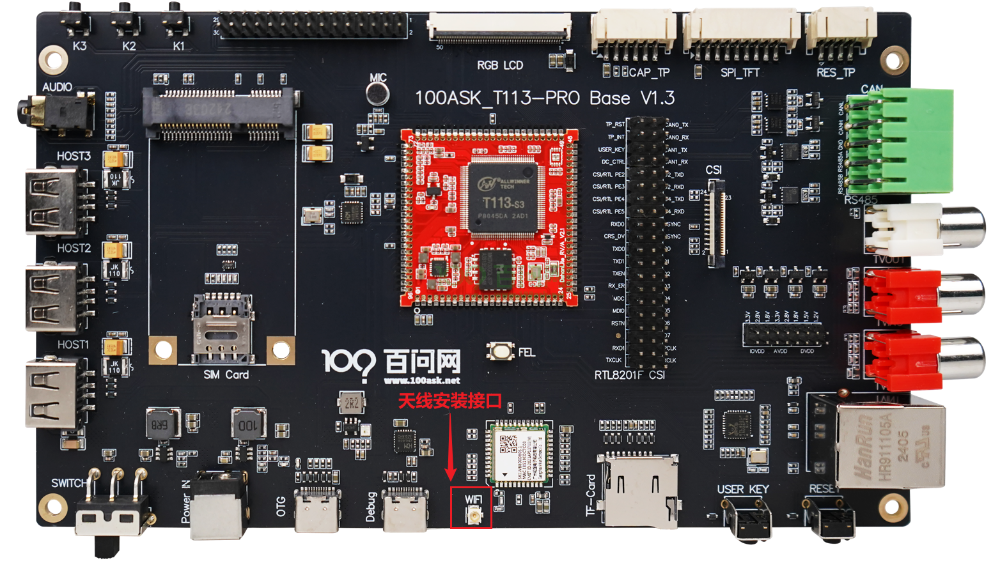
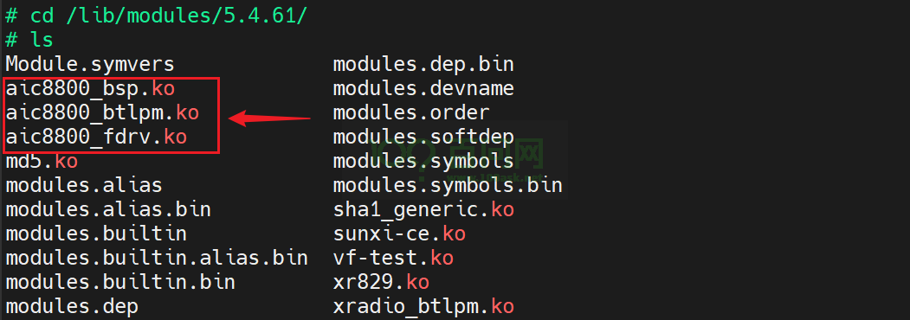
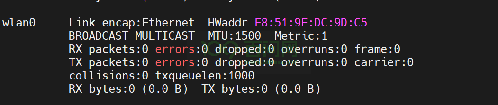
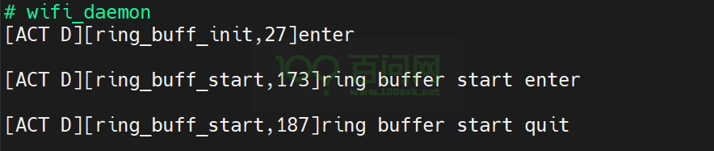
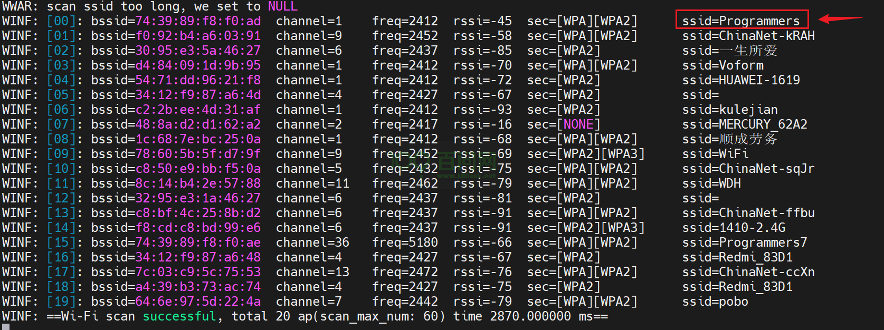
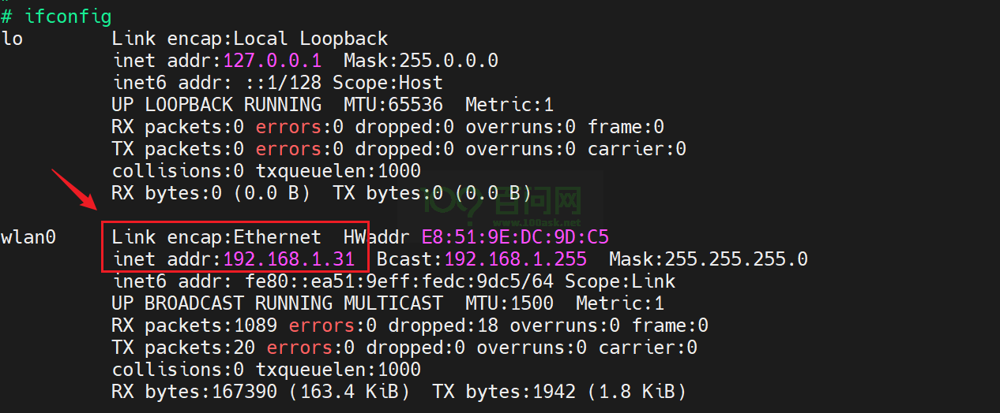

# WiFi联网

本章节来讲解如何在 T113s3ProV1.3SdNand 开发板上通过WiFi模块进行联网。

## 准备工作

**硬件：**
- T113s3-SDNAND 开发板
- usb typeC线 X2
- ipex 2.4G天线 X1

**软件：**
- 全志线刷工具：[AllwinnertechPhoeniSuit.zip](https://dl.100ask.net/Hardware/MPU/T113i-Industrial/Tools/AllwinnertechPhoeniSuit.zip)
- 全志USB烧录驱动：[AllwinnerUSBFlashDeviceDriver.zip](https://dl.100ask.net/Hardware/MPU/T113i-Industrial/Tools/AllwinnerUSBFlashDeviceDriver.zip)

## 连接开发板

如果不清楚如何连接开发板，并登录串口终端，请参考 快速启动中《启动开发板》章节。

### 安装2.4G天线

连接开发板后，在执行联网操作前，需要先安装一根2.4G天线，否则有可能会扫不到WiFi设备。安装接口在如下图位置：

## 装载WiFi驱动模块

进入串口终端，在开发板 `/lib/modules/5.4.61` 路径下，可以看到开发板的WiFi驱动模块，

~~~bash
# cd /lib/modules/5.4.61/
# ls
Module.symvers             modules.dep.bin
aic8800_bsp.ko             modules.devname
aic8800_btlpm.ko           modules.order
aic8800_fdrv.ko            modules.softdep
md5.ko                     modules.symbols
modules.alias              modules.symbols.bin
modules.alias.bin          sha1_generic.ko
modules.builtin            sunxi-ce.ko
modules.builtin.alias.bin  vf-test.ko
modules.builtin.bin        xr829.ko
modules.dep                xradio_btlpm.ko
~~~

如下：

在当前目录下，按照以下顺序来装载wifi驱动模块，

~~~bash
insmod aic8800_bsp.ko
insmod aic8800_fdrv.ko
~~~

依次执行后，会出现以下打印信息：

~~~bash
# insmod aic8800_bsp.ko
[ 1806.962880] aicbsp_init
[ 1806.965639] RELEASE_DATE:2023_0904_1726
# insmod aic8800_fdrv.ko
[ 1843.145204] AICWFDBG(LOGTRACE)       >>> rwnx_mod_init()
[ 1843.150641] AICWFDBG(LOGINFO)        rwnx v6.4.3.0 - - 241c091M (master)
[ 1843.157481] AICWFDBG(LOGINFO)        RELEASE_DATE:2023_0904_1725
[ 1843.163769] AICWFDBG(LOGTRACE)       rwnx_init_cmd_array Enter
[ 1843.169956] AICWFDBG(LOGTRACE)       rwnx_init_cmd_array cmd_queue[0]:05b1dbfd
[ 1843.177671] AICWFDBG(LOGTRACE)       rwnx_init_cmd_array cmd_queue[1]:4aacf3be
[ 1843.185411] AICWFDBG(LOGTRACE)       rwnx_init_cmd_array cmd_queue[2]:e9c475a4
[ 1843.193146] AICWFDBG(LOGTRACE)       rwnx_init_cmd_array cmd_queue[3]:7762a488
[ 1843.200887] AICWFDBG(LOGTRACE)       rwnx_init_cmd_array cmd_queue[4]:c19df40c
[ 1843.208599] AICWFDBG(LOGTRACE)       rwnx_init_cmd_array cmd_queue[5]:04f902c5
[ 1843.216340] AICWFDBG(LOGTRACE)       rwnx_init_cmd_array cmd_queue[6]:a57db9fe
[ 1843.224069] AICWFDBG(LOGTRACE)       rwnx_init_cmd_array cmd_queue[7]:20eb6fbb
[ 1843.231804] AICWFDBG(LOGTRACE)       rwnx_init_cmd_array cmd_queue[8]:b73102ef
[ 1843.239540] AICWFDBG(LOGTRACE)       rwnx_init_cmd_array cmd_queue[9]:670d7e99
[ 1843.247252] AICWFDBG(LOGTRACE)       rwnx_init_cmd_array cmd_queue[10]:e96b9080
[ 1843.255086] AICWFDBG(LOGTRACE)       rwnx_init_cmd_array cmd_queue[11]:b723d0d9
[ 1843.262914] AICWFDBG(LOGTRACE)       rwnx_init_cmd_array cmd_queue[12]:4c1df067
[ 1843.270748] AICWFDBG(LOGTRACE)       rwnx_init_cmd_array cmd_queue[13]:0b34f129
[ 1843.278559] AICWFDBG(LOGTRACE)       rwnx_init_cmd_array cmd_queue[14]:d8b94557
[ 1843.286393] AICWFDBG(LOGTRACE)       rwnx_init_cmd_array cmd_queue[15]:9f34c6c7
[ 1843.294221] AICWFDBG(LOGTRACE)       rwnx_init_cmd_array cmd_queue[16]:f3ad0d27
[ 1843.302060] AICWFDBG(LOGTRACE)       rwnx_init_cmd_array cmd_queue[17]:d5e09c50
[ 1843.309891] AICWFDBG(LOGTRACE)       rwnx_init_cmd_array cmd_queue[18]:9503d94f
[ 1843.317699] AICWFDBG(LOGTRACE)       rwnx_init_cmd_array cmd_queue[19]:105957bd
[ 1843.325530] AICWFDBG(LOGTRACE)       rwnx_init_cmd_array Exit
[ 1843.331611] aicbsp: aicbsp_set_subsys, subsys: AIC_WIFI, state to: 1
[ 1843.338738] aicbsp: aicbsp_set_subsys, power state change to 1 dure to AIC_WIFI
[ 1843.346962] aicbsp: aicbsp_platform_power_on
[ 1843.351775] sunxi-rfkill soc@3000000:rfkill@0: bus_index: 1
[ 1843.418137] sunxi-rfkill soc@3000000:rfkill@0: wlan power on success
[ 1843.475340] sunxi-mmc 4021000.sdmmc: sdc set ios:clk 0Hz bm PP pm UP vdd 21 width 1 timing LEGACY(SDR12) dt B
[ 1843.486582] sunxi-mmc 4021000.sdmmc: no vqmmc,Check if there is regulator
[ 1843.506764] sunxi-mmc 4021000.sdmmc: sdc set ios:clk 400000Hz bm PP pm ON vdd 21 width 1 timing LEGACY(SDR12) dt B
[ 1843.531829] sunxi-mmc 4021000.sdmmc: smc 2 p1 err, cmd 52, RTO !!
[ 1843.539499] sunxi-mmc 4021000.sdmmc: smc 2 p1 err, cmd 52, RTO !!
[ 1843.546363] sunxi-mmc 4021000.sdmmc: sdc set ios:clk 400000Hz bm PP pm ON vdd 21 width 1 timing LEGACY(SDR12) dt B
[ 1843.561002] sunxi-mmc 4021000.sdmmc: sdc set ios:clk 400000Hz bm PP pm ON vdd 21 width 1 timing LEGACY(SDR12) dt B
[ 1843.583548] sunxi-mmc 4021000.sdmmc: sdc set ios:clk 400000Hz bm PP pm ON vdd 21 width 1 timing SD-HS(SDR25) dt B
[ 1843.595162] sunxi-mmc 4021000.sdmmc: sdc set ios:clk 50000000Hz bm PP pm ON vdd 21 width 1 timing SD-HS(SDR25) dt B
[ 1843.607151] sunxi-mmc 4021000.sdmmc: sdc set ios:clk 50000000Hz bm PP pm ON vdd 21 width 4 timing SD-HS(SDR25) dt B
[ 1843.620909] mmc2: new high speed SDIO card at address 390b
[ 1843.647383] aicbsp: aicbsp_sdio_probe:1 vid:0xC8A1  did:0x0082
[ 1843.658752] aicbsp: aicbsp_sdio_probe:2 vid:0xC8A1  did:0x0182
[ 1843.665404] aicbsp: aicbsp_sdio_probe after replace:1
[ 1843.671097] AICWFDBG(LOGINFO)        aicwf_sdio_chipmatch USE AIC8800D80
[ 1843.678045] aicbsp: aicbsp_get_feature, set FEATURE_SDIO_CLOCK 150 MHz
[ 1843.685398] aicbsp: aicwf_sdio_reg_init
[ 1843.690814] AICWFDBG(LOGINFO)        aicbsp: aicbsp_driver_fw_init, chip rev: 7
[ 1843.698457] rwnx_load_firmware :firmware path = /lib/firmware/aic8800d80//fw_patch_table_8800d80_u02.bin
[ 1843.712722] file md5:0e6fd98c0a89c62ebd4c1a430fafa59f
[ 1843.718614] rwnx_plat_bin_fw_upload_android
[ 1843.723810] rwnx_load_firmware :firmware path = /lib/firmware/aic8800d80//fw_adid_8800d80_u02.bin
[ 1843.735185] file md5:f546881a81b960d89a672578eb45a809
[ 1843.741801] rwnx_plat_bin_fw_upload_android
[ 1843.746517] rwnx_load_firmware :firmware path = /lib/firmware/aic8800d80//fw_patch_8800d80_u02.bin
[ 1843.760015] file md5:9e3808a312cc19925259a6c5163753d5
[ 1843.784769] aicbt_patch_table_load bt btmode:0
[ 1843.789982] aicbt_patch_table_load bt uart_baud:1500000
[ 1843.796035] aicbt_patch_table_load bt uart_flowctrl:1
[ 1843.801926] aicbt_patch_table_load bt lpm_enable:0
[ 1843.807500] aicbt_patch_table_load bt tx_pwr:28463
[ 1843.818811] aicbsp: bt patch version: - Nov 06 2023 12:44:17 - git 1f5d13b
[ 1843.826646] rwnx_plat_bin_fw_upload_android
[ 1843.831372] rwnx_load_firmware :firmware path = /lib/firmware/aic8800d80//fmacfw_8800d80_u02.bin
[ 1843.873104] file md5:2aa840eaea976e7fb87e33fd9e82a653
[ 1843.970480] AICWFDBG(LOGDEBUG)       aicwf_sdio_probe:1
[ 1843.975764] AICWFDBG(LOGDEBUG)       Class=7
[ 1843.979998] AICWFDBG(LOGDEBUG)       sdio vendor ID: 0xc8a1
[ 1843.985684] AICWFDBG(LOGDEBUG)       sdio device ID: 0x0082
[ 1843.991376] AICWFDBG(LOGDEBUG)       Function#: 1
[ 1843.996070] AICWFDBG(LOGINFO)        aicwf_sdio_chipmatch USE AIC8800D80
[ 1844.003034] aicbsp: aicbsp_get_feature, set FEATURE_SDIO_CLOCK 150 MHz
[ 1844.009387] aicbsp: sdio_err:<aicwf_sdio_bus_pwrctl,1349>: bus down
[ 1844.010368] aicsdio: aicwf_sdio_reg_init
[ 1844.026972] AICWFDBG(LOGINFO)        sdio ready
[ 1844.031763] AICWFDBG(LOGINFO)        sdio_bustx_thread the policy of current thread is:0
[ 1844.031941] AICWFDBG(LOGINFO)        sdio_busrx_thread the policy of current thread is:0
[ 1844.040311] AICWFDBG(LOGINFO)        sdio_bustx_thread the rt_priority of current thread is:0
[ 1844.048645] AICWFDBG(LOGINFO)        sdio_busrx_thread the rt_priority of current thread is:0
[ 1844.057936] AICWFDBG(LOGINFO)        sdio_bustx_thread the current pid is:1310
[ 1844.066509] AICWFDBG(LOGTRACE)       >>> rwnx_platform_init()
[ 1844.074200] AICWFDBG(LOGINFO)        sdio_busrx_thread the current pid is:1311
[ 1844.079811] AICWFDBG(LOGTRACE)       >>> rwnx_cfg80211_init()
[ 1844.093084] aicbsp: aicbsp_get_feature, set FEATURE_SDIO_CLOCK 150 MHz
[ 1844.100437] AICWFDBG(LOGINFO)        rwnx_cfg80211_init sizeof(struct rwnx_hw):12736
[ 1844.108706] AICWFDBG(LOGTRACE)       >>> rwnx_init_aic()
[ 1844.114110] AICWFDBG(LOGTRACE)       >>> rwnx_cmd_mgr_init()
[ 1844.120149] AICWFDBG(LOGINFO)        aicwf_prealloc_txq_alloc size is diff will to be kzalloc
[ 1844.129274] AICWFDBG(LOGINFO)        aicwf_prealloc_txq_alloc txq kzalloc successful
[ 1844.137669] AICWFDBG(LOGTRACE)       >>> rwnx_send_dbg_mem_read_req()
[ 1844.144359] AICWFDBG(LOGTRACE)       rwnx_send_msg (1025)DBG_MEM_READ_CFM reqcfm:1 in_irq:0 in_softirq:0 in_atomic:0
[ 1844.155716] AICWFDBG(LOGTRACE)       rwnx_cmd_malloc get cmd_array[0]:05b1dbfd
[ 1844.163914] AICWFDBG(LOGTRACE)       rwnx_cmd_free cmd_array[0]:05b1dbfd
[ 1844.171093] AICWFDBG(LOGTRACE)       >>> rwnx_send_dbg_mem_read_req()
[ 1844.177748] AICWFDBG(LOGTRACE)       rwnx_send_msg (1025)DBG_MEM_READ_CFM reqcfm:1 in_irq:0 in_softirq:0 in_atomic:0
[ 1844.189103] AICWFDBG(LOGTRACE)       rwnx_cmd_malloc get cmd_array[0]:05b1dbfd
[ 1844.197091] AICWFDBG(LOGTRACE)       rwnx_cmd_free cmd_array[0]:05b1dbfd
[ 1844.204261] AICWFDBG(LOGINFO)        FDRV chip_id=7, chip_sub_id=2!!
[ 1844.210731] AICWFDBG(LOGTRACE)       >>> rwnx_platform_on()
[ 1844.216397] AICWFDBG(LOGINFO)        userconfig file path:aic_userconfig_8800d80.txt
[ 1844.224617] AICWFDBG(LOGINFO)        ### Load file aic_userconfig_8800d80.txt
[ 1844.231960] AICWFDBG(LOGINFO)        rwnx_load_firmware :firmware path = /lib/firmware/aic8800d80//aic_userconfig_8800d80.txt
[ 1844.245319] AICWFDBG(LOGINFO)        file md5:2c9d3ab6e42c03bd2adb9f9e2b6180f2
[ 1844.252869] AICWFDBG(LOGINFO)        ### Load file done: aic_userconfig_8800d80.txt, size=2448
[ 1844.261874] AICWFDBG(LOGINFO)        rwnx_plat_userconfig_parsing3: AIC USERCONFIG 2022/0803/1707
[ 1844.271260] AICWFDBG(LOGINFO)        rwnx_plat_userconfig_parsing3: txpwr_lvl
[ 1844.278680] AICWFDBG(LOGINFO)        rwnx_plat_nvram_set_value_v3:command=enable value=1
[ 1844.287099] AICWFDBG(LOGINFO)        rwnx_plat_nvram_set_value_v3:command=lvl_11b_11ag_1m_2g4 value=18
[ 1844.296884] AICWFDBG(LOGINFO)        rwnx_plat_nvram_set_value_v3:command=lvl_11b_11ag_2m_2g4 value=18
[ 1844.306668] AICWFDBG(LOGINFO)        rwnx_plat_nvram_set_value_v3:command=lvl_11b_11ag_5m5_2g4 value=18
[ 1844.316539] AICWFDBG(LOGINFO)        rwnx_plat_nvram_set_value_v3:command=lvl_11b_11ag_11m_2g4 value=18
[ 1844.326413] AICWFDBG(LOGINFO)        rwnx_plat_nvram_set_value_v3:command=lvl_11b_11ag_6m_2g4 value=18
[ 1844.336189] AICWFDBG(LOGINFO)        rwnx_plat_nvram_set_value_v3:command=lvl_11b_11ag_9m_2g4 value=18
[ 1844.345965] AICWFDBG(LOGINFO)        rwnx_plat_nvram_set_value_v3:command=lvl_11b_11ag_12m_2g4 value=18
[ 1844.355845] AICWFDBG(LOGINFO)        rwnx_plat_nvram_set_value_v3:command=lvl_11b_11ag_18m_2g4 value=18
[ 1844.365722] AICWFDBG(LOGINFO)        rwnx_plat_nvram_set_value_v3:command=lvl_11b_11ag_24m_2g4 value=16
[ 1844.375598] AICWFDBG(LOGINFO)        rwnx_plat_nvram_set_value_v3:command=lvl_11b_11ag_36m_2g4 value=16
[ 1844.385484] AICWFDBG(LOGINFO)        rwnx_plat_nvram_set_value_v3:command=lvl_11b_11ag_48m_2g4 value=15
[ 1844.395365] AICWFDBG(LOGINFO)        rwnx_plat_nvram_set_value_v3:command=lvl_11b_11ag_54m_2g4 value=15
[ 1844.405241] AICWFDBG(LOGINFO)        rwnx_plat_nvram_set_value_v3:command=lvl_11n_11ac_mcs0_2g4 value=18
[ 1844.415212] AICWFDBG(LOGINFO)        rwnx_plat_nvram_set_value_v3:command=lvl_11n_11ac_mcs1_2g4 value=18
[ 1844.425188] AICWFDBG(LOGINFO)        rwnx_plat_nvram_set_value_v3:command=lvl_11n_11ac_mcs2_2g4 value=18
[ 1844.435156] AICWFDBG(LOGINFO)        rwnx_plat_nvram_set_value_v3:command=lvl_11n_11ac_mcs3_2g4 value=18
[ 1844.445128] AICWFDBG(LOGINFO)        rwnx_plat_nvram_set_value_v3:command=lvl_11n_11ac_mcs4_2g4 value=16
[ 1844.455106] AICWFDBG(LOGINFO)        rwnx_plat_nvram_set_value_v3:command=lvl_11n_11ac_mcs5_2g4 value=16
[ 1844.465085] AICWFDBG(LOGINFO)        rwnx_plat_nvram_set_value_v3:command=lvl_11n_11ac_mcs6_2g4 value=15
[ 1844.475054] AICWFDBG(LOGINFO)        rwnx_plat_nvram_set_value_v3:command=lvl_11n_11ac_mcs7_2g4 value=15
[ 1844.485027] AICWFDBG(LOGINFO)        rwnx_plat_nvram_set_value_v3:command=lvl_11n_11ac_mcs8_2g4 value=14
[ 1844.495004] AICWFDBG(LOGINFO)        rwnx_plat_nvram_set_value_v3:command=lvl_11n_11ac_mcs9_2g4 value=14
[ 1844.504980] AICWFDBG(LOGINFO)        rwnx_plat_nvram_set_value_v3:command=lvl_11ax_mcs0_2g4 value=18
[ 1844.514566] AICWFDBG(LOGINFO)        rwnx_plat_nvram_set_value_v3:command=lvl_11ax_mcs1_2g4 value=18
[ 1844.524153] AICWFDBG(LOGINFO)        rwnx_plat_nvram_set_value_v3:command=lvl_11ax_mcs2_2g4 value=18
[ 1844.533735] AICWFDBG(LOGINFO)        rwnx_plat_nvram_set_value_v3:command=lvl_11ax_mcs3_2g4 value=18
[ 1844.543316] AICWFDBG(LOGINFO)        rwnx_plat_nvram_set_value_v3:command=lvl_11ax_mcs4_2g4 value=16
[ 1844.552898] AICWFDBG(LOGINFO)        rwnx_plat_nvram_set_value_v3:command=lvl_11ax_mcs5_2g4 value=16
[ 1844.562479] AICWFDBG(LOGINFO)        rwnx_plat_nvram_set_value_v3:command=lvl_11ax_mcs6_2g4 value=15
[ 1844.572061] AICWFDBG(LOGINFO)        rwnx_plat_nvram_set_value_v3:command=lvl_11ax_mcs7_2g4 value=15
[ 1844.581643] AICWFDBG(LOGINFO)        rwnx_plat_nvram_set_value_v3:command=lvl_11ax_mcs8_2g4 value=14
[ 1844.591235] AICWFDBG(LOGINFO)        rwnx_plat_nvram_set_value_v3:command=lvl_11ax_mcs9_2g4 value=14
[ 1844.600823] AICWFDBG(LOGINFO)        rwnx_plat_nvram_set_value_v3:command=lvl_11ax_mcs10_2g4 value=13
[ 1844.610501] AICWFDBG(LOGINFO)        rwnx_plat_nvram_set_value_v3:command=lvl_11ax_mcs11_2g4 value=13
[ 1844.620180] AICWFDBG(LOGINFO)        rwnx_plat_nvram_set_value_v3:command=lvl_11a_6m_5g value=18
[ 1844.629359] AICWFDBG(LOGINFO)        rwnx_plat_nvram_set_value_v3:command=lvl_11a_9m_5g value=18
[ 1844.638564] AICWFDBG(LOGINFO)        rwnx_plat_nvram_set_value_v3:command=lvl_11a_12m_5g value=18
[ 1844.647862] AICWFDBG(LOGINFO)        rwnx_plat_nvram_set_value_v3:command=lvl_11a_18m_5g value=18
[ 1844.657160] AICWFDBG(LOGINFO)        rwnx_plat_nvram_set_value_v3:command=lvl_11a_24m_5g value=16
[ 1844.666450] AICWFDBG(LOGINFO)        rwnx_plat_nvram_set_value_v3:command=lvl_11a_36m_5g value=16
[ 1844.675742] AICWFDBG(LOGINFO)        rwnx_plat_nvram_set_value_v3:command=lvl_11a_48m_5g value=15
[ 1844.685033] AICWFDBG(LOGINFO)        rwnx_plat_nvram_set_value_v3:command=lvl_11a_54m_5g value=15
[ 1844.694334] AICWFDBG(LOGINFO)        rwnx_plat_nvram_set_value_v3:command=lvl_11n_11ac_mcs0_5g value=18
[ 1844.704211] AICWFDBG(LOGINFO)        rwnx_plat_nvram_set_value_v3:command=lvl_11n_11ac_mcs1_5g value=18
[ 1844.714088] AICWFDBG(LOGINFO)        rwnx_plat_nvram_set_value_v3:command=lvl_11n_11ac_mcs2_5g value=18
[ 1844.723963] AICWFDBG(LOGINFO)        rwnx_plat_nvram_set_value_v3:command=lvl_11n_11ac_mcs3_5g value=18
[ 1844.733840] AICWFDBG(LOGINFO)        rwnx_plat_nvram_set_value_v3:command=lvl_11n_11ac_mcs4_5g value=16
[ 1844.743722] AICWFDBG(LOGINFO)        rwnx_plat_nvram_set_value_v3:command=lvl_11n_11ac_mcs5_5g value=16
[ 1844.753602] AICWFDBG(LOGINFO)        rwnx_plat_nvram_set_value_v3:command=lvl_11n_11ac_mcs6_5g value=15
[ 1844.763480] AICWFDBG(LOGINFO)        rwnx_plat_nvram_set_value_v3:command=lvl_11n_11ac_mcs7_5g value=15
[ 1844.773368] AICWFDBG(LOGINFO)        rwnx_plat_nvram_set_value_v3:command=lvl_11n_11ac_mcs8_5g value=14
[ 1844.783245] AICWFDBG(LOGINFO)        rwnx_plat_nvram_set_value_v3:command=lvl_11n_11ac_mcs9_5g value=14
[ 1844.793131] AICWFDBG(LOGINFO)        rwnx_plat_nvram_set_value_v3:command=lvl_11ax_mcs0_5g value=18
[ 1844.802616] AICWFDBG(LOGINFO)        rwnx_plat_nvram_set_value_v3:command=lvl_11ax_mcs1_5g value=18
[ 1844.812105] AICWFDBG(LOGINFO)        rwnx_plat_nvram_set_value_v3:command=lvl_11ax_mcs2_5g value=18
[ 1844.821588] AICWFDBG(LOGINFO)        rwnx_plat_nvram_set_value_v3:command=lvl_11ax_mcs3_5g value=18
[ 1844.831076] AICWFDBG(LOGINFO)        rwnx_plat_nvram_set_value_v3:command=lvl_11ax_mcs4_5g value=16
[ 1844.840559] AICWFDBG(LOGINFO)        rwnx_plat_nvram_set_value_v3:command=lvl_11ax_mcs5_5g value=16
[ 1844.850047] AICWFDBG(LOGINFO)        rwnx_plat_nvram_set_value_v3:command=lvl_11ax_mcs6_5g value=14
[ 1844.859531] AICWFDBG(LOGINFO)        rwnx_plat_nvram_set_value_v3:command=lvl_11ax_mcs7_5g value=14
[ 1844.869001] AICWFDBG(LOGINFO)        rwnx_plat_nvram_set_value_v3:command=lvl_11ax_mcs8_5g value=13
[ 1844.878491] AICWFDBG(LOGINFO)        rwnx_plat_nvram_set_value_v3:command=lvl_11ax_mcs9_5g value=13
[ 1844.887974] AICWFDBG(LOGINFO)        rwnx_plat_nvram_set_value_v3:command=lvl_11ax_mcs10_5g value=12
[ 1844.897572] AICWFDBG(LOGINFO)        rwnx_plat_nvram_set_value_v3:command=lvl_11ax_mcs11_5g value=12
[ 1844.907165] AICWFDBG(LOGINFO)        rwnx_plat_userconfig_parsing3: txpwr_loss
[ 1844.914707] AICWFDBG(LOGINFO)        rwnx_plat_nvram_set_value_v3:command=loss_enable value=0
[ 1844.923607] AICWFDBG(LOGINFO)        rwnx_plat_nvram_set_value_v3:command=loss_value value=2
[ 1844.932411] AICWFDBG(LOGINFO)        rwnx_plat_userconfig_parsing3: txpwr_ofst
[ 1844.939942] AICWFDBG(LOGINFO)        rwnx_plat_nvram_set_value_v3:command=ofst_enable value=0
[ 1844.948826] AICWFDBG(LOGINFO)        rwnx_plat_nvram_set_value_v3:command=ofst_2g4_11b_chan_1_4 value=0
[ 1844.958703] AICWFDBG(LOGINFO)        rwnx_plat_nvram_set_value_v3:command=ofst_2g4_11b_chan_5_9 value=0
[ 1844.968578] AICWFDBG(LOGINFO)        rwnx_plat_nvram_set_value_v3:command=ofst_2g4_11b_chan_10_13 value=0
[ 1844.978650] AICWFDBG(LOGINFO)        rwnx_plat_nvram_set_value_v3:command=ofst_2g4_ofdm_highrate_chan_1_4 value=0
[ 1844.989506] AICWFDBG(LOGINFO)        rwnx_plat_nvram_set_value_v3:command=ofst_2g4_ofdm_highrate_chan_5_9 value=0
[ 1845.000365] AICWFDBG(LOGINFO)        rwnx_plat_nvram_set_value_v3:command=ofst_2g4_ofdm_highrate_chan_10_13 value=0
[ 1845.011408] AICWFDBG(LOGINFO)        rwnx_plat_nvram_set_value_v3:command=ofst_2g4_ofdm_lowrate_chan_1_4 value=0
[ 1845.022171] AICWFDBG(LOGINFO)        rwnx_plat_nvram_set_value_v3:command=ofst_2g4_ofdm_lowrate_chan_5_9 value=0
[ 1845.032934] AICWFDBG(LOGINFO)        rwnx_plat_nvram_set_value_v3:command=ofst_2g4_ofdm_lowrate_chan_10_13 value=0
[ 1845.043893] AICWFDBG(LOGINFO)        rwnx_plat_nvram_set_value_v3:command=ofst_5g_ofdm_lowrate_chan_42 value=0
[ 1845.054450] AICWFDBG(LOGINFO)        rwnx_plat_nvram_set_value_v3:command=ofst_5g_ofdm_lowrate_chan_58 value=0
[ 1845.065012] AICWFDBG(LOGINFO)        rwnx_plat_nvram_set_value_v3:command=ofst_5g_ofdm_lowrate_chan_106 value=0
[ 1845.075673] AICWFDBG(LOGINFO)        rwnx_plat_nvram_set_value_v3:command=ofst_5g_ofdm_lowrate_chan_122 value=0
[ 1845.086361] AICWFDBG(LOGINFO)        rwnx_plat_nvram_set_value_v3:command=ofst_5g_ofdm_lowrate_chan_138 value=0
[ 1845.097036] AICWFDBG(LOGINFO)        rwnx_plat_nvram_set_value_v3:command=ofst_5g_ofdm_lowrate_chan_155 value=0
[ 1845.107705] AICWFDBG(LOGINFO)        rwnx_plat_nvram_set_value_v3:command=ofst_5g_ofdm_highrate_chan_42 value=0
[ 1845.118361] AICWFDBG(LOGINFO)        rwnx_plat_nvram_set_value_v3:command=ofst_5g_ofdm_highrate_chan_58 value=0
[ 1845.129020] AICWFDBG(LOGINFO)        rwnx_plat_nvram_set_value_v3:command=ofst_5g_ofdm_highrate_chan_106 value=0
[ 1845.139773] AICWFDBG(LOGINFO)        rwnx_plat_nvram_set_value_v3:command=ofst_5g_ofdm_highrate_chan_122 value=0
[ 1845.150529] AICWFDBG(LOGINFO)        rwnx_plat_nvram_set_value_v3:command=ofst_5g_ofdm_highrate_chan_138 value=0
[ 1845.161283] AICWFDBG(LOGINFO)        rwnx_plat_nvram_set_value_v3:command=ofst_5g_ofdm_highrate_chan_155 value=0
[ 1845.172042] AICWFDBG(LOGINFO)        rwnx_plat_nvram_set_value_v3:command=ofst_5g_ofdm_midrate_chan_42 value=0
[ 1845.182600] AICWFDBG(LOGINFO)        rwnx_plat_nvram_set_value_v3:command=ofst_5g_ofdm_midrate_chan_58 value=0
[ 1845.193171] AICWFDBG(LOGINFO)        rwnx_plat_nvram_set_value_v3:command=ofst_5g_ofdm_midrate_chan_106 value=0
[ 1845.203830] AICWFDBG(LOGINFO)        rwnx_plat_nvram_set_value_v3:command=ofst_5g_ofdm_midrate_chan_122 value=0
[ 1845.214493] AICWFDBG(LOGINFO)        rwnx_plat_nvram_set_value_v3:command=ofst_5g_ofdm_midrate_chan_138 value=0
[ 1845.225161] AICWFDBG(LOGINFO)        rwnx_plat_nvram_set_value_v3:command=ofst_5g_ofdm_midrate_chan_155 value=0
[ 1845.235827] AICWFDBG(LOGINFO)        rwnx_plat_userconfig_parsing3: xtal cap
[ 1845.243164] AICWFDBG(LOGINFO)        rwnx_plat_nvram_set_value_v3:command=xtal_enable value=0
[ 1845.252070] AICWFDBG(LOGINFO)        rwnx_plat_nvram_set_value_v3:command=xtal_cap value=24
[ 1845.260774] AICWFDBG(LOGINFO)        rwnx_plat_nvram_set_value_v3:command=xtal_cap_fine value=31
[ 1845.269969] AICWFDBG(LOGINFO)        userconfig download complete
[ 1845.269969]
[ 1845.277786] AICWFDBG(LOGTRACE)       rwnx_send_msg (124)MM_SET_STACK_START_CFM reqcfm:1 in_irq:0 in_softirq:0 in_atomic:0
[ 1845.289624] AICWFDBG(LOGTRACE)       rwnx_cmd_malloc get cmd_array[0]:05b1dbfd
[ 1845.297821] AICWFDBG(LOGTRACE)       rwnx_cmd_free cmd_array[0]:05b1dbfd
[ 1845.304979] AICWFDBG(LOGINFO)        is 5g support = 1, vendor_info = 0x00
[ 1845.312031] AICWFDBG(LOGTRACE)       rwnx_send_msg (129)MM_GET_FW_VERSION_CFM reqcfm:1 in_irq:0 in_softirq:0 in_atomic:0
[ 1845.323766] AICWFDBG(LOGTRACE)       rwnx_cmd_malloc get cmd_array[0]:05b1dbfd
[ 1845.331793] AICWFDBG(LOGTRACE)       rwnx_cmd_free cmd_array[0]:05b1dbfd
[ 1845.338940] AICWFDBG(LOGINFO)        Firmware Version: mi Nov 01 2023 19:51:27 - g6a92fae
[ 1845.347750] AICWFDBG(LOGTRACE)       >>> rwnx_send_txpwr_lvl_v3_req()
[ 1845.354449] AICWFDBG(LOGINFO)        get_userconfig_txpwr_lvl_v3_in_fdrv:enable:1
[ 1845.362314] AICWFDBG(LOGINFO)        get_userconfig_txpwr_lvl_v3_in_fdrv:lvl_11b_11ag_1m_2g4:18
[ 1845.371599] AICWFDBG(LOGINFO)        get_userconfig_txpwr_lvl_v3_in_fdrv:lvl_11b_11ag_2m_2g4:18
[ 1845.380798] AICWFDBG(LOGINFO)        get_userconfig_txpwr_lvl_v3_in_fdrv:lvl_11b_11ag_5m5_2g4:18
[ 1845.390102] AICWFDBG(LOGINFO)        get_userconfig_txpwr_lvl_v3_in_fdrv:lvl_11b_11ag_11m_2g4:18
[ 1845.399390] AICWFDBG(LOGINFO)        get_userconfig_txpwr_lvl_v3_in_fdrv:lvl_11b_11ag_6m_2g4:18
[ 1845.408574] AICWFDBG(LOGINFO)        get_userconfig_txpwr_lvl_v3_in_fdrv:lvl_11b_11ag_9m_2g4:18
[ 1845.417774] AICWFDBG(LOGINFO)        get_userconfig_txpwr_lvl_v3_in_fdrv:lvl_11b_11ag_12m_2g4:18
[ 1845.427071] AICWFDBG(LOGINFO)        get_userconfig_txpwr_lvl_v3_in_fdrv:lvl_11b_11ag_18m_2g4:18
[ 1845.436378] AICWFDBG(LOGINFO)        get_userconfig_txpwr_lvl_v3_in_fdrv:lvl_11b_11ag_24m_2g4:16
[ 1845.445667] AICWFDBG(LOGINFO)        get_userconfig_txpwr_lvl_v3_in_fdrv:lvl_11b_11ag_36m_2g4:16
[ 1845.454967] AICWFDBG(LOGINFO)        get_userconfig_txpwr_lvl_v3_in_fdrv:lvl_11b_11ag_48m_2g4:15
[ 1845.464255] AICWFDBG(LOGINFO)        get_userconfig_txpwr_lvl_v3_in_fdrv:lvl_11b_11ag_54m_2g4:15
[ 1845.473553] AICWFDBG(LOGINFO)        get_userconfig_txpwr_lvl_v3_in_fdrv:lvl_11n_11ac_mcs0_2g4:18
[ 1845.482938] AICWFDBG(LOGINFO)        get_userconfig_txpwr_lvl_v3_in_fdrv:lvl_11n_11ac_mcs1_2g4:18
[ 1845.492351] AICWFDBG(LOGINFO)        get_userconfig_txpwr_lvl_v3_in_fdrv:lvl_11n_11ac_mcs2_2g4:18
[ 1845.501746] AICWFDBG(LOGINFO)        get_userconfig_txpwr_lvl_v3_in_fdrv:lvl_11n_11ac_mcs3_2g4:18
[ 1845.511146] AICWFDBG(LOGINFO)        get_userconfig_txpwr_lvl_v3_in_fdrv:lvl_11n_11ac_mcs4_2g4:16
[ 1845.520558] AICWFDBG(LOGINFO)        get_userconfig_txpwr_lvl_v3_in_fdrv:lvl_11n_11ac_mcs5_2g4:16
[ 1845.529953] AICWFDBG(LOGINFO)        get_userconfig_txpwr_lvl_v3_in_fdrv:lvl_11n_11ac_mcs6_2g4:15
[ 1845.539333] AICWFDBG(LOGINFO)        get_userconfig_txpwr_lvl_v3_in_fdrv:lvl_11n_11ac_mcs7_2g4:15
[ 1845.548729] AICWFDBG(LOGINFO)        get_userconfig_txpwr_lvl_v3_in_fdrv:lvl_11n_11ac_mcs8_2g4:14
[ 1845.558124] AICWFDBG(LOGINFO)        get_userconfig_txpwr_lvl_v3_in_fdrv:lvl_11n_11ac_mcs9_2g4:14
[ 1845.567563] AICWFDBG(LOGINFO)        get_userconfig_txpwr_lvl_v3_in_fdrv:lvl_11ax_mcs0_2g4:18
[ 1845.576580] AICWFDBG(LOGINFO)        get_userconfig_txpwr_lvl_v3_in_fdrv:lvl_11ax_mcs1_2g4:18
[ 1845.585586] AICWFDBG(LOGINFO)        get_userconfig_txpwr_lvl_v3_in_fdrv:lvl_11ax_mcs2_2g4:18
[ 1845.594593] AICWFDBG(LOGINFO)        get_userconfig_txpwr_lvl_v3_in_fdrv:lvl_11ax_mcs3_2g4:18
[ 1845.603596] AICWFDBG(LOGINFO)        get_userconfig_txpwr_lvl_v3_in_fdrv:lvl_11ax_mcs4_2g4:16
[ 1845.612602] AICWFDBG(LOGINFO)        get_userconfig_txpwr_lvl_v3_in_fdrv:lvl_11ax_mcs5_2g4:16
[ 1845.621604] AICWFDBG(LOGINFO)        get_userconfig_txpwr_lvl_v3_in_fdrv:lvl_11ax_mcs6_2g4:15
[ 1845.630616] AICWFDBG(LOGINFO)        get_userconfig_txpwr_lvl_v3_in_fdrv:lvl_11ax_mcs7_2g4:15
[ 1845.639619] AICWFDBG(LOGINFO)        get_userconfig_txpwr_lvl_v3_in_fdrv:lvl_11ax_mcs8_2g4:14
[ 1845.648610] AICWFDBG(LOGINFO)        get_userconfig_txpwr_lvl_v3_in_fdrv:lvl_11ax_mcs9_2g4:14
[ 1845.657616] AICWFDBG(LOGINFO)        get_userconfig_txpwr_lvl_v3_in_fdrv:lvl_11ax_mcs10_2g4:13
[ 1845.666706] AICWFDBG(LOGINFO)        get_userconfig_txpwr_lvl_v3_in_fdrv:lvl_11ax_mcs11_2g4:13
[ 1845.675810] AICWFDBG(LOGINFO)        get_userconfig_txpwr_lvl_v3_in_fdrv:lvl_11a_1m_5g:-128
[ 1845.684609] AICWFDBG(LOGINFO)        get_userconfig_txpwr_lvl_v3_in_fdrv:lvl_11a_2m_5g:-128
[ 1845.693426] AICWFDBG(LOGINFO)        get_userconfig_txpwr_lvl_v3_in_fdrv:lvl_11a_5m5_5g:-128
[ 1845.702327] AICWFDBG(LOGINFO)        get_userconfig_txpwr_lvl_v3_in_fdrv:lvl_11a_11m_5g:-128
[ 1845.711247] AICWFDBG(LOGINFO)        get_userconfig_txpwr_lvl_v3_in_fdrv:lvl_11a_6m_5g:18
[ 1845.719855] AICWFDBG(LOGINFO)        get_userconfig_txpwr_lvl_v3_in_fdrv:lvl_11a_9m_5g:18
[ 1845.728452] AICWFDBG(LOGINFO)        get_userconfig_txpwr_lvl_v3_in_fdrv:lvl_11a_12m_5g:18
[ 1845.737164] AICWFDBG(LOGINFO)        get_userconfig_txpwr_lvl_v3_in_fdrv:lvl_11a_18m_5g:18
[ 1845.745877] AICWFDBG(LOGINFO)        get_userconfig_txpwr_lvl_v3_in_fdrv:lvl_11a_24m_5g:16
[ 1845.754587] AICWFDBG(LOGINFO)        get_userconfig_txpwr_lvl_v3_in_fdrv:lvl_11a_36m_5g:16
[ 1845.763299] AICWFDBG(LOGINFO)        get_userconfig_txpwr_lvl_v3_in_fdrv:lvl_11a_48m_5g:15
[ 1845.772009] AICWFDBG(LOGINFO)        get_userconfig_txpwr_lvl_v3_in_fdrv:lvl_11a_54m_5g:15
[ 1845.780719] AICWFDBG(LOGINFO)        get_userconfig_txpwr_lvl_v3_in_fdrv:lvl_11n_11ac_mcs0_5g:18
[ 1845.790013] AICWFDBG(LOGINFO)        get_userconfig_txpwr_lvl_v3_in_fdrv:lvl_11n_11ac_mcs1_5g:18
[ 1845.799295] AICWFDBG(LOGINFO)        get_userconfig_txpwr_lvl_v3_in_fdrv:lvl_11n_11ac_mcs2_5g:18
[ 1845.808589] AICWFDBG(LOGINFO)        get_userconfig_txpwr_lvl_v3_in_fdrv:lvl_11n_11ac_mcs3_5g:18
[ 1845.817886] AICWFDBG(LOGINFO)        get_userconfig_txpwr_lvl_v3_in_fdrv:lvl_11n_11ac_mcs4_5g:16
[ 1845.827178] AICWFDBG(LOGINFO)        get_userconfig_txpwr_lvl_v3_in_fdrv:lvl_11n_11ac_mcs5_5g:16
[ 1845.836480] AICWFDBG(LOGINFO)        get_userconfig_txpwr_lvl_v3_in_fdrv:lvl_11n_11ac_mcs6_5g:15
[ 1845.845796] AICWFDBG(LOGINFO)        get_userconfig_txpwr_lvl_v3_in_fdrv:lvl_11n_11ac_mcs7_5g:15
[ 1845.855095] AICWFDBG(LOGINFO)        get_userconfig_txpwr_lvl_v3_in_fdrv:lvl_11n_11ac_mcs8_5g:14
[ 1845.864398] AICWFDBG(LOGINFO)        get_userconfig_txpwr_lvl_v3_in_fdrv:lvl_11n_11ac_mcs9_5g:14
[ 1845.873686] AICWFDBG(LOGINFO)        get_userconfig_txpwr_lvl_v3_in_fdrv:lvl_11ax_mcs0_5g:18
[ 1845.882595] AICWFDBG(LOGINFO)        get_userconfig_txpwr_lvl_v3_in_fdrv:lvl_11ax_mcs1_5g:18
[ 1845.891493] AICWFDBG(LOGINFO)        get_userconfig_txpwr_lvl_v3_in_fdrv:lvl_11ax_mcs2_5g:18
[ 1845.900398] AICWFDBG(LOGINFO)        get_userconfig_txpwr_lvl_v3_in_fdrv:lvl_11ax_mcs3_5g:18
[ 1845.909280] AICWFDBG(LOGINFO)        get_userconfig_txpwr_lvl_v3_in_fdrv:lvl_11ax_mcs4_5g:16
[ 1845.918191] AICWFDBG(LOGINFO)        get_userconfig_txpwr_lvl_v3_in_fdrv:lvl_11ax_mcs5_5g:16
[ 1845.927087] AICWFDBG(LOGINFO)        get_userconfig_txpwr_lvl_v3_in_fdrv:lvl_11ax_mcs6_5g:14
[ 1845.935999] AICWFDBG(LOGINFO)        get_userconfig_txpwr_lvl_v3_in_fdrv:lvl_11ax_mcs7_5g:14
[ 1845.944897] AICWFDBG(LOGINFO)        get_userconfig_txpwr_lvl_v3_in_fdrv:lvl_11ax_mcs8_5g:13
[ 1845.953804] AICWFDBG(LOGINFO)        get_userconfig_txpwr_lvl_v3_in_fdrv:lvl_11ax_mcs9_5g:13
[ 1845.962702] AICWFDBG(LOGINFO)        get_userconfig_txpwr_lvl_v3_in_fdrv:lvl_11ax_mcs10_5g:12
[ 1845.971704] AICWFDBG(LOGINFO)        get_userconfig_txpwr_lvl_v3_in_fdrv:lvl_11ax_mcs11_5g:12
[ 1845.980703] AICWFDBG(LOGINFO)        get_userconfig_txpwr_loss:loss_enable:0
[ 1845.988030] AICWFDBG(LOGINFO)        get_userconfig_txpwr_loss:loss_value:2
[ 1845.995281] AICWFDBG(LOGINFO)        rwnx_send_txpwr_lvl_v3_req:enable:1
[ 1846.002242] AICWFDBG(LOGINFO)        rwnx_send_txpwr_lvl_v3_req:lvl_11b_11ag_1m_2g4:18
[ 1846.010559] AICWFDBG(LOGINFO)        rwnx_send_txpwr_lvl_v3_req:lvl_11b_11ag_2m_2g4:18
[ 1846.018867] AICWFDBG(LOGINFO)        rwnx_send_txpwr_lvl_v3_req:lvl_11b_11ag_5m5_2g4:18
[ 1846.027284] AICWFDBG(LOGINFO)        rwnx_send_txpwr_lvl_v3_req:lvl_11b_11ag_11m_2g4:18
[ 1846.035708] AICWFDBG(LOGINFO)        rwnx_send_txpwr_lvl_v3_req:lvl_11b_11ag_6m_2g4:18
[ 1846.044029] AICWFDBG(LOGINFO)        rwnx_send_txpwr_lvl_v3_req:lvl_11b_11ag_9m_2g4:18
[ 1846.052352] AICWFDBG(LOGINFO)        rwnx_send_txpwr_lvl_v3_req:lvl_11b_11ag_12m_2g4:18
[ 1846.060766] AICWFDBG(LOGINFO)        rwnx_send_txpwr_lvl_v3_req:lvl_11b_11ag_18m_2g4:18
[ 1846.069172] AICWFDBG(LOGINFO)        rwnx_send_txpwr_lvl_v3_req:lvl_11b_11ag_24m_2g4:16
[ 1846.077592] AICWFDBG(LOGINFO)        rwnx_send_txpwr_lvl_v3_req:lvl_11b_11ag_36m_2g4:16
[ 1846.086013] AICWFDBG(LOGINFO)        rwnx_send_txpwr_lvl_v3_req:lvl_11b_11ag_48m_2g4:15
[ 1846.094429] AICWFDBG(LOGINFO)        rwnx_send_txpwr_lvl_v3_req:lvl_11b_11ag_54m_2g4:15
[ 1846.102848] AICWFDBG(LOGINFO)        rwnx_send_txpwr_lvl_v3_req:lvl_11n_11ac_mcs0_2g4:18
[ 1846.111359] AICWFDBG(LOGINFO)        rwnx_send_txpwr_lvl_v3_req:lvl_11n_11ac_mcs1_2g4:18
[ 1846.119947] AICWFDBG(LOGINFO)        rwnx_send_txpwr_lvl_v3_req:lvl_11n_11ac_mcs2_2g4:18
[ 1846.128439] AICWFDBG(LOGINFO)        rwnx_send_txpwr_lvl_v3_req:lvl_11n_11ac_mcs3_2g4:18
[ 1846.136981] AICWFDBG(LOGINFO)        rwnx_send_txpwr_lvl_v3_req:lvl_11n_11ac_mcs4_2g4:16
[ 1846.145493] AICWFDBG(LOGINFO)        rwnx_send_txpwr_lvl_v3_req:lvl_11n_11ac_mcs5_2g4:16
[ 1846.154020] AICWFDBG(LOGINFO)        rwnx_send_txpwr_lvl_v3_req:lvl_11n_11ac_mcs6_2g4:15
[ 1846.162528] AICWFDBG(LOGINFO)        rwnx_send_txpwr_lvl_v3_req:lvl_11n_11ac_mcs7_2g4:15
[ 1846.171048] AICWFDBG(LOGINFO)        rwnx_send_txpwr_lvl_v3_req:lvl_11n_11ac_mcs8_2g4:14
[ 1846.179555] AICWFDBG(LOGINFO)        rwnx_send_txpwr_lvl_v3_req:lvl_11n_11ac_mcs9_2g4:14
[ 1846.188051] AICWFDBG(LOGINFO)        rwnx_send_txpwr_lvl_v3_req:lvl_11ax_mcs0_2g4:18
[ 1846.196175] AICWFDBG(LOGINFO)        rwnx_send_txpwr_lvl_v3_req:lvl_11ax_mcs1_2g4:18
[ 1846.204300] AICWFDBG(LOGINFO)        rwnx_send_txpwr_lvl_v3_req:lvl_11ax_mcs2_2g4:18
[ 1846.212422] AICWFDBG(LOGINFO)        rwnx_send_txpwr_lvl_v3_req:lvl_11ax_mcs3_2g4:18
[ 1846.220567] AICWFDBG(LOGINFO)        rwnx_send_txpwr_lvl_v3_req:lvl_11ax_mcs4_2g4:16
[ 1846.228664] AICWFDBG(LOGINFO)        rwnx_send_txpwr_lvl_v3_req:lvl_11ax_mcs5_2g4:16
[ 1846.236790] AICWFDBG(LOGINFO)        rwnx_send_txpwr_lvl_v3_req:lvl_11ax_mcs6_2g4:15
[ 1846.244921] AICWFDBG(LOGINFO)        rwnx_send_txpwr_lvl_v3_req:lvl_11ax_mcs7_2g4:15
[ 1846.253043] AICWFDBG(LOGINFO)        rwnx_send_txpwr_lvl_v3_req:lvl_11ax_mcs8_2g4:14
[ 1846.261184] AICWFDBG(LOGINFO)        rwnx_send_txpwr_lvl_v3_req:lvl_11ax_mcs9_2g4:14
[ 1846.269286] AICWFDBG(LOGINFO)        rwnx_send_txpwr_lvl_v3_req:lvl_11ax_mcs10_2g4:13
[ 1846.277523] AICWFDBG(LOGINFO)        rwnx_send_txpwr_lvl_v3_req:lvl_11ax_mcs11_2g4:13
[ 1846.285786] AICWFDBG(LOGINFO)        rwnx_send_txpwr_lvl_v3_req:lvl_11a_1m_5g:-128
[ 1846.293739] AICWFDBG(LOGINFO)        rwnx_send_txpwr_lvl_v3_req:lvl_11a_2m_5g:-128
[ 1846.301664] AICWFDBG(LOGINFO)        rwnx_send_txpwr_lvl_v3_req:lvl_11a_5m5_5g:-128
[ 1846.309694] AICWFDBG(LOGINFO)        rwnx_send_txpwr_lvl_v3_req:lvl_11a_11m_5g:-128
[ 1846.317700] AICWFDBG(LOGINFO)        rwnx_send_txpwr_lvl_v3_req:lvl_11a_6m_5g:18
[ 1846.325442] AICWFDBG(LOGINFO)        rwnx_send_txpwr_lvl_v3_req:lvl_11a_9m_5g:18
[ 1846.333177] AICWFDBG(LOGINFO)        rwnx_send_txpwr_lvl_v3_req:lvl_11a_12m_5g:18
[ 1846.341013] AICWFDBG(LOGINFO)        rwnx_send_txpwr_lvl_v3_req:lvl_11a_18m_5g:18
[ 1846.348823] AICWFDBG(LOGINFO)        rwnx_send_txpwr_lvl_v3_req:lvl_11a_24m_5g:16
[ 1846.356655] AICWFDBG(LOGINFO)        rwnx_send_txpwr_lvl_v3_req:lvl_11a_36m_5g:16
[ 1846.364488] AICWFDBG(LOGINFO)        rwnx_send_txpwr_lvl_v3_req:lvl_11a_48m_5g:15
[ 1846.372319] AICWFDBG(LOGINFO)        rwnx_send_txpwr_lvl_v3_req:lvl_11a_54m_5g:15
[ 1846.380153] AICWFDBG(LOGINFO)        rwnx_send_txpwr_lvl_v3_req:lvl_11n_11ac_mcs0_5g:18
[ 1846.388543] AICWFDBG(LOGINFO)        rwnx_send_txpwr_lvl_v3_req:lvl_11n_11ac_mcs1_5g:18
[ 1846.396963] AICWFDBG(LOGINFO)        rwnx_send_txpwr_lvl_v3_req:lvl_11n_11ac_mcs2_5g:18
[ 1846.405374] AICWFDBG(LOGINFO)        rwnx_send_txpwr_lvl_v3_req:lvl_11n_11ac_mcs3_5g:18
[ 1846.413795] AICWFDBG(LOGINFO)        rwnx_send_txpwr_lvl_v3_req:lvl_11n_11ac_mcs4_5g:16
[ 1846.422210] AICWFDBG(LOGINFO)        rwnx_send_txpwr_lvl_v3_req:lvl_11n_11ac_mcs5_5g:16
[ 1846.430649] AICWFDBG(LOGINFO)        rwnx_send_txpwr_lvl_v3_req:lvl_11n_11ac_mcs6_5g:15
[ 1846.439045] AICWFDBG(LOGINFO)        rwnx_send_txpwr_lvl_v3_req:lvl_11n_11ac_mcs7_5g:15
[ 1846.447473] AICWFDBG(LOGINFO)        rwnx_send_txpwr_lvl_v3_req:lvl_11n_11ac_mcs8_5g:14
[ 1846.455882] AICWFDBG(LOGINFO)        rwnx_send_txpwr_lvl_v3_req:lvl_11n_11ac_mcs9_5g:14
[ 1846.464305] AICWFDBG(LOGINFO)        rwnx_send_txpwr_lvl_v3_req:lvl_11ax_mcs0_5g:18
[ 1846.472324] AICWFDBG(LOGINFO)        rwnx_send_txpwr_lvl_v3_req:lvl_11ax_mcs1_5g:18
[ 1846.480353] AICWFDBG(LOGINFO)        rwnx_send_txpwr_lvl_v3_req:lvl_11ax_mcs2_5g:18
[ 1846.488359] AICWFDBG(LOGINFO)        rwnx_send_txpwr_lvl_v3_req:lvl_11ax_mcs3_5g:18
[ 1846.496391] AICWFDBG(LOGINFO)        rwnx_send_txpwr_lvl_v3_req:lvl_11ax_mcs4_5g:16
[ 1846.504411] AICWFDBG(LOGINFO)        rwnx_send_txpwr_lvl_v3_req:lvl_11ax_mcs5_5g:16
[ 1846.512442] AICWFDBG(LOGINFO)        rwnx_send_txpwr_lvl_v3_req:lvl_11ax_mcs6_5g:14
[ 1846.520461] AICWFDBG(LOGINFO)        rwnx_send_txpwr_lvl_v3_req:lvl_11ax_mcs7_5g:14
[ 1846.528474] AICWFDBG(LOGINFO)        rwnx_send_txpwr_lvl_v3_req:lvl_11ax_mcs8_5g:13
[ 1846.536503] AICWFDBG(LOGINFO)        rwnx_send_txpwr_lvl_v3_req:lvl_11ax_mcs9_5g:13
[ 1846.544550] AICWFDBG(LOGINFO)        rwnx_send_txpwr_lvl_v3_req:lvl_11ax_mcs10_5g:12
[ 1846.552677] AICWFDBG(LOGINFO)        rwnx_send_txpwr_lvl_v3_req:lvl_11ax_mcs11_5g:12
[ 1846.560803] AICWFDBG(LOGTRACE)       rwnx_send_msg (120)MM_SET_TXPWR_IDX_LVL_CFM reqcfm:1 in_irq:0 in_softirq:0 in_atomic:0
[ 1846.572850] AICWFDBG(LOGTRACE)       rwnx_cmd_malloc get cmd_array[0]:05b1dbfd
[ 1846.580906] AICWFDBG(LOGTRACE)       rwnx_cmd_free cmd_array[0]:05b1dbfd
[ 1846.588050] AICWFDBG(LOGTRACE)       >>> rwnx_send_txpwr_ofst2x_req()
[ 1846.594736] AICWFDBG(LOGINFO)        get_userconfig_txpwr_ofst2x_in_fdrv:enable      :0
[ 1846.603149] AICWFDBG(LOGINFO)        pwrofst2x 2.4g: [0]:11b, [1]:ofdm_highrate, [2]:ofdm_lowrate
[ 1846.603149]   chan=  1-4     5-9     10-13
[ 1846.603153] AICWFDBG(LOGINFO)
[ 1846.603153]   [0] =
[ 1846.616158] AICWFDBG(LOGINFO)                0
[ 1846.621944] AICWFDBG(LOGINFO)                0
[ 1846.625561] AICWFDBG(LOGINFO)                0
[ 1846.629175] AICWFDBG(LOGINFO)
[ 1846.629175]   [1] =
[ 1846.632813] AICWFDBG(LOGINFO)                0
[ 1846.638576] AICWFDBG(LOGINFO)                0
[ 1846.642214] AICWFDBG(LOGINFO)                0
[ 1846.645832] AICWFDBG(LOGINFO)
[ 1846.645832]   [2] =
[ 1846.649468] AICWFDBG(LOGINFO)                0
[ 1846.655229] AICWFDBG(LOGINFO)                0
[ 1846.658842] AICWFDBG(LOGINFO)                0
[ 1846.662481] AICWFDBG(LOGINFO)
[ 1846.662481] pwrofst2x 5g: [0]:ofdm_lowrate, [1]:ofdm_highrate, [2]:ofdm_midrate
[ 1846.662481]   chan=  36-50   51-64   98-114  115-130 131-146 147-166
[ 1846.666100] AICWFDBG(LOGINFO)
[ 1846.666100]   [0] =
[ 1846.684264] AICWFDBG(LOGINFO)                0
[ 1846.690040] AICWFDBG(LOGINFO)                0
[ 1846.693656] AICWFDBG(LOGINFO)                0
[ 1846.697271] AICWFDBG(LOGINFO)                0
[ 1846.700907] AICWFDBG(LOGINFO)                0
[ 1846.704526] AICWFDBG(LOGINFO)                0
[ 1846.708140] AICWFDBG(LOGINFO)
[ 1846.708140]   [1] =
[ 1846.711777] AICWFDBG(LOGINFO)                0
[ 1846.717540] AICWFDBG(LOGINFO)                0
[ 1846.721174] AICWFDBG(LOGINFO)                0
[ 1846.724792] AICWFDBG(LOGINFO)                0
[ 1846.728407] AICWFDBG(LOGINFO)                0
[ 1846.732047] AICWFDBG(LOGINFO)                0
[ 1846.735664] AICWFDBG(LOGINFO)
[ 1846.735664]   [2] =
[ 1846.739278] AICWFDBG(LOGINFO)                0
[ 1846.745063] AICWFDBG(LOGINFO)                0
[ 1846.748680] AICWFDBG(LOGINFO)                0
[ 1846.752318] AICWFDBG(LOGINFO)                0
[ 1846.755934] AICWFDBG(LOGINFO)                0
[ 1846.759569] AICWFDBG(LOGINFO)                0
[ 1846.763184] AICWFDBG(LOGINFO)
[ 1846.770239] AICWFDBG(LOGINFO)        rwnx_send_txpwr_ofst2x_req:Do not use txpwr_ofst2x
[ 1846.778631] AICWFDBG(LOGTRACE)       >>> rwnx_msg_free()
[ 1846.784030] AICWFDBG(LOGTRACE)       >>> rwnx_send_rf_calib_req()
[ 1846.790294] AICWFDBG(LOGINFO)        get_userconfig_xtal_cap:enable       :0
[ 1846.797615] AICWFDBG(LOGINFO)        get_userconfig_xtal_cap:xtal_cap     :0
[ 1846.804957] AICWFDBG(LOGINFO)        get_userconfig_xtal_cap:xtal_cap_fine:0
[ 1846.812296] AICWFDBG(LOGTRACE)       rwnx_send_msg (106)MM_SET_RF_CALIB_CFM reqcfm:1 in_irq:0 in_softirq:0 in_atomic:0
[ 1846.823837] AICWFDBG(LOGTRACE)       rwnx_cmd_malloc get cmd_array[0]:05b1dbfd
[ 1847.485287] AICWFDBG(LOGTRACE)       rwnx_cmd_free cmd_array[0]:05b1dbfd
[ 1847.492447] AICWFDBG(LOGTRACE)       >>> rwnx_send_get_macaddr_req()
[ 1847.498998] AICWFDBG(LOGTRACE)       rwnx_send_msg (116)MM_GET_MAC_ADDR_CFM reqcfm:1 in_irq:0 in_softirq:0 in_atomic:0
[ 1847.510544] AICWFDBG(LOGTRACE)       rwnx_cmd_malloc get cmd_array[0]:05b1dbfd
[ 1847.518628] AICWFDBG(LOGTRACE)       rwnx_cmd_free cmd_array[0]:05b1dbfd
[ 1847.525794] AICWFDBG(LOGINFO)        get macaddr: e8:51:9e:dc:9d:c5
[ 1847.532254] AICWFDBG(LOGTRACE)       >>> rwnx_send_reset()
[ 1847.537825] AICWFDBG(LOGTRACE)       rwnx_send_msg (1)MM_RESET_CFM reqcfm:1 in_irq:0 in_softirq:0 in_atomic:0
[ 1847.548487] AICWFDBG(LOGTRACE)       rwnx_cmd_malloc get cmd_array[0]:05b1dbfd
[ 1847.557004] AICWFDBG(LOGTRACE)       rwnx_cmd_free cmd_array[0]:05b1dbfd
[ 1847.564161] AICWFDBG(LOGTRACE)       >>> rwnx_send_version_req()
[ 1847.570332] AICWFDBG(LOGTRACE)       rwnx_send_msg (5)MM_VERSION_CFM reqcfm:1 in_irq:0 in_softirq:0 in_atomic:0
[ 1847.581190] AICWFDBG(LOGTRACE)       rwnx_cmd_malloc get cmd_array[0]:05b1dbfd
[ 1847.589147] AICWFDBG(LOGTRACE)       rwnx_cmd_free cmd_array[0]:05b1dbfd
[ 1847.596310] AICWFDBG(LOGTRACE)       >>> rwnx_set_vers()
[ 1847.601714] AICWFDBG(LOGTRACE)       >>> rwnx_send_me_config_req()
[ 1847.608070] ieee80211 phy0: HT supp 1, VHT supp 1, HE supp 1
[ 1847.614444] AICWFDBG(LOGTRACE)       rwnx_send_msg (5121)ME_CONFIG_CFM reqcfm:1 in_irq:0 in_softirq:0 in_atomic:0
[ 1847.625492] AICWFDBG(LOGTRACE)       rwnx_cmd_malloc get cmd_array[0]:05b1dbfd
[ 1847.633526] AICWFDBG(LOGTRACE)       rwnx_cmd_free cmd_array[0]:05b1dbfd
[ 1847.640938] AICWFDBG(LOGTRACE)       >>> rwnx_send_me_chan_config_req()
[ 1847.647792] AICWFDBG(LOGTRACE)       rwnx_send_msg (5123)ME_CHAN_CONFIG_CFM reqcfm:1 in_irq:0 in_softirq:0 in_atomic:0
[ 1847.659354] AICWFDBG(LOGTRACE)       rwnx_cmd_malloc get cmd_array[0]:05b1dbfd
[ 1847.667387] AICWFDBG(LOGTRACE)       rwnx_cmd_free cmd_array[0]:05b1dbfd
[ 1847.674872] AICWFDBG(LOGINFO)        getRegdomainFromRwnxDB set ccode:00
[ 1847.681972] AICWFDBG(LOGINFO)        rwnx_get_countrycode_channels support channel:1 2 3 4 5 6 7 8 9 10 11 12 13 14 36 40 44 48 52 56 60 64 100 104 108 112 116 120 124 128 132 136 140 144 149 153 157 161 165
[ 1847.702259] ieee80211 phy0:
[ 1847.702259] *******************************************************
[ 1847.702259] ** CAUTION: USING PERMISSIVE CUSTOM REGULATORY RULES **
[ 1847.702259] *******************************************************
[ 1847.726556] AICWFDBG(LOGTRACE)       >>> rwnx_send_me_chan_config_req()
[ 1847.733421] AICWFDBG(LOGTRACE)       rwnx_send_msg (5123)ME_CHAN_CONFIG_CFM reqcfm:1 in_irq:0 in_softirq:0 in_atomic:0
[ 1847.744958] AICWFDBG(LOGTRACE)       rwnx_cmd_malloc get cmd_array[0]:05b1dbfd
[ 1847.753089] AICWFDBG(LOGTRACE)       rwnx_cmd_free cmd_array[0]:05b1dbfd
[ 1847.760263] AICWFDBG(LOGTRACE)       >>> rwnx_dbgfs_register()
[ 1847.766327] AICWFDBG(LOGINFO)        fw_log_init: c582c000, c582e800
[ 1847.772871] AICWFDBG(LOGINFO)        rwnx_interface_add: wlan%d, 2, 10
[ 1847.779754] AICWFDBG(LOGINFO)        interface add:e8 51 9e dc 9d c5
[ 1848.196093] AICWFDBG(LOGINFO)        New interface create wlan0
#
~~~

出现以上信息，表示WiFi驱动模块加载成功。执行 `ifconfig -a` 指令，可以看到存在 wlan0 节点，

~~~bash
# ifconfig -a
awlink0   Link encap:UNSPEC  HWaddr 00-00-00-00-00-00-00-00-00-00-00-00-00-00-00-00
          NOARP  MTU:16  Metric:1
          RX packets:0 errors:0 dropped:0 overruns:0 frame:0
          TX packets:0 errors:0 dropped:0 overruns:0 carrier:0
          collisions:0 txqueuelen:10
          RX bytes:0 (0.0 B)  TX bytes:0 (0.0 B)
          Interrupt:2

awlink1   Link encap:UNSPEC  HWaddr 00-00-00-00-00-00-00-00-00-00-00-00-00-00-00-00
          NOARP  MTU:16  Metric:1
          RX packets:0 errors:0 dropped:0 overruns:0 frame:0
          TX packets:0 errors:0 dropped:0 overruns:0 carrier:0
          collisions:0 txqueuelen:10
          RX bytes:0 (0.0 B)  TX bytes:0 (0.0 B)
          Interrupt:3

ip6tnl0   Link encap:UNSPEC  HWaddr 00-00-00-00-00-00-00-00-00-00-00-00-00-00-00-00
          NOARP  MTU:1452  Metric:1
          RX packets:0 errors:0 dropped:0 overruns:0 frame:0
          TX packets:0 errors:0 dropped:0 overruns:0 carrier:0
          collisions:0 txqueuelen:1000
          RX bytes:0 (0.0 B)  TX bytes:0 (0.0 B)

lo        Link encap:Local Loopback
          inet addr:127.0.0.1  Mask:255.0.0.0
          inet6 addr: ::1/128 Scope:Host
          UP LOOPBACK RUNNING  MTU:65536  Metric:1
          RX packets:0 errors:0 dropped:0 overruns:0 frame:0
          TX packets:0 errors:0 dropped:0 overruns:0 carrier:0
          collisions:0 txqueuelen:1000
          RX bytes:0 (0.0 B)  TX bytes:0 (0.0 B)

sit0      Link encap:IPv6-in-IPv4
          NOARP  MTU:1480  Metric:1
          RX packets:0 errors:0 dropped:0 overruns:0 frame:0
          TX packets:0 errors:0 dropped:0 overruns:0 carrier:0
          collisions:0 txqueuelen:1000
          RX bytes:0 (0.0 B)  TX bytes:0 (0.0 B)

wlan0     Link encap:Ethernet  HWaddr E8:51:9E:DC:9D:C5
          BROADCAST MULTICAST  MTU:1500  Metric:1
          RX packets:0 errors:0 dropped:0 overruns:0 frame:0
          TX packets:0 errors:0 dropped:0 overruns:0 carrier:0
          collisions:0 txqueuelen:1000
          RX bytes:0 (0.0 B)  TX bytes:0 (0.0 B)

#
~~~

如下：

## 连接WiFi网络

### 打开wlan0节点

出现 `wlan0` 节点后，执行 `ifconfig wlan0 up` 指令，打开节点，

~~~bash
# ifconfig wlan0 up
[  879.333784] AICWFDBG(LOGTRACE)       >>> rwnx_open()
[  879.338782] AICWFDBG(LOGTRACE)       >>> rwnx_send_start()
[  879.344447] AICWFDBG(LOGTRACE)       rwnx_send_msg (3)MM_START_CFM reqcfm:1 in_irq:0 in_softirq:0 in_atomic:0
[  879.355119] AICWFDBG(LOGTRACE)       rwnx_cmd_malloc get cmd_array[0]:b0772898
[  879.363699] AICWFDBG(LOGTRACE)       rwnx_cmd_free cmd_array[0]:b0772898
[  879.370865] AICWFDBG(LOGTRACE)       >>> rwnx_send_coex_req()
[  879.376730] AICWFDBG(LOGTRACE)       rwnx_send_msg (102)MM_SET_COEX_CFM reqcfm:1 in_irq:0 in_softirq:0 in_atomic:0
[  879.387884] AICWFDBG(LOGTRACE)       rwnx_cmd_malloc get cmd_array[0]:b0772898
[  879.395941] AICWFDBG(LOGTRACE)       rwnx_cmd_free cmd_array[0]:b0772898
[  879.403108] AICWFDBG(LOGTRACE)       >>> rwnx_send_add_if()
[  879.408778] AICWFDBG(LOGTRACE)       rwnx_send_msg (7)MM_ADD_IF_CFM reqcfm:1 in_irq:0 in_softirq:0 in_atomic:0
[  879.419541] AICWFDBG(LOGTRACE)       rwnx_cmd_malloc get cmd_array[0]:b0772898
[  879.427502] AICWFDBG(LOGTRACE)       rwnx_cmd_free cmd_array[0]:b0772898
[  879.434667] AICWFDBG(LOGDEBUG)       rwnx_open sta create vif in rwnx_hw->vif_table[0]
#
~~~

### 运行Daemon服务

接着，执行以下指令，运行Wi-Fi 管理服务（daemon）

~~~bash
wifi_daemon
~~~

### 切换Station模式

运行Wi-Fi 管理服务后，执行以下指令，将WiFi模式切换为Station模式，

~~~bash
wifi -o sta
~~~

执行之后，会出现以下信息，

~~~bash
# wifi -o sta
WINF: open sta mode
WINF: linux sta supplicant init now
WINF: linux ap init now
WINF: **************************************
WINF: * Copyright (c) 2019-2025 Allwinner Technology Co., Ltd. ALL rights reserved
WINF: * version: 2.0.8.4 20231009 08:55
WINF: * support mode:(sta | ap | --- | ---)
WINF: * mode support list
WINF: * sta alone
WINF: * ap alone
WINF: **************************************
# Successfully initialized wpa_supplicant
[ 1139.630228] rwnx_virtual_interface_add: 10, p2p-dev-wlan0
[ 1139.636302] rwnx_virtual_interface_add, ifname=p2p-dev-wlan0, wdev=4bf6251b, vif_idx=1
[ 1139.645229] p2p dev addr=e8 51 9e dc 9d c4
[ 1139.668228] P2P interface started
[ 1139.680652] AICWFDBG(LOGTRACE)       >>> rwnx_cfg80211_scan()
[ 1139.686566] AICWFDBG(LOGTRACE)       >>> rwnx_send_scanu_req()
[ 1139.692600] AICWFDBG(LOGTRACE)       rwnx_send_msg (4104)SCANU_VENDOR_IE_CFM reqcfm:1 in_irq:0 in_softirq:0 in_atomic:0
[ 1139.704244] AICWFDBG(LOGTRACE)       rwnx_cmd_malloc get cmd_array[0]:b0772898
[ 1139.712359] AICWFDBG(LOGTRACE)       rwnx_cmd_free cmd_array[0]:b0772898
[ 1139.719725] AICWFDBG(LOGDEBUG)       scan channel:1(2412)
[ 1139.725393] AICWFDBG(LOGDEBUG)       scan channel:2(2417)
[ 1139.731089] AICWFDBG(LOGDEBUG)       scan channel:3(2422)
[ 1139.736752] AICWFDBG(LOGDEBUG)       scan channel:4(2427)
[ 1139.742439] AICWFDBG(LOGDEBUG)       scan channel:5(2432)
[ 1139.748103] AICWFDBG(LOGDEBUG)       scan channel:6(2437)
[ 1139.753789] AICWFDBG(LOGDEBUG)       scan channel:7(2442)
[ 1139.759464] AICWFDBG(LOGDEBUG)       scan channel:8(2447)
[ 1139.765128] AICWFDBG(LOGDEBUG)       scan channel:9(2452)
[ 1139.770816] AICWFDBG(LOGDEBUG)       scan channel:10(2457)
[ 1139.776579] AICWFDBG(LOGDEBUG)       scan channel:11(2462)
[ 1139.782362] AICWFDBG(LOGDEBUG)       scan channel:12(2467)
[ 1139.788122] AICWFDBG(LOGDEBUG)       scan channel:13(2472)
[ 1139.793904] AICWFDBG(LOGDEBUG)       scan channel:14(2484)
[ 1139.799676] AICWFDBG(LOGDEBUG)       scan channel:36(5180)
[ 1139.805436] AICWFDBG(LOGDEBUG)       scan channel:40(5200)
[ 1139.811216] AICWFDBG(LOGDEBUG)       scan channel:44(5220)
[ 1139.816979] AICWFDBG(LOGDEBUG)       scan channel:48(5240)
[ 1139.822761] AICWFDBG(LOGDEBUG)       scan channel:52(5260)
[ 1139.828521] AICWFDBG(LOGDEBUG)       scan channel:56(5280)
[ 1139.834303] AICWFDBG(LOGDEBUG)       scan channel:60(5300)
[ 1139.840074] AICWFDBG(LOGDEBUG)       scan channel:64(5320)
[ 1139.845834] AICWFDBG(LOGDEBUG)       scan channel:100(5500)
[ 1139.851716] AICWFDBG(LOGDEBUG)       scan channel:104(5520)
[ 1139.857575] AICWFDBG(LOGDEBUG)       scan channel:108(5540)
[ 1139.863460] AICWFDBG(LOGDEBUG)       scan channel:112(5560)
[ 1139.869318] AICWFDBG(LOGDEBUG)       scan channel:116(5580)
[ 1139.875203] AICWFDBG(LOGDEBUG)       scan channel:120(5600)
[ 1139.881074] AICWFDBG(LOGDEBUG)       scan channel:124(5620)
[ 1139.886931] AICWFDBG(LOGDEBUG)       scan channel:128(5640)
[ 1139.892809] AICWFDBG(LOGDEBUG)       scan channel:132(5660)
[ 1139.898668] AICWFDBG(LOGDEBUG)       scan channel:136(5680)
[ 1139.904546] AICWFDBG(LOGDEBUG)       scan channel:140(5700)
[ 1139.910417] AICWFDBG(LOGDEBUG)       scan channel:144(5720)
[ 1139.916275] AICWFDBG(LOGDEBUG)       scan channel:149(5745)
[ 1139.922151] AICWFDBG(LOGDEBUG)       scan channel:153(5765)
[ 1139.928011] AICWFDBG(LOGDEBUG)       scan channel:157(5785)
[ 1139.933891] AICWFDBG(LOGDEBUG)       scan channel:161(5805)
[ 1139.939761] AICWFDBG(LOGDEBUG)       scan channel:165(5825)
[ 1139.945626] AICWFDBG(LOGTRACE)       rwnx_send_msg (4105)SCANU_START_CFM_ADDTIONAL reqcfm:1 in_irq:0 in_softirq:0 in_atomic:0
[ 1139.957841] AICWFDBG(LOGTRACE)       rwnx_cmd_malloc get cmd_array[0]:b0772898
[ 1139.965823] AICWFDBG(LOGTRACE)       rwnx_cmd_free cmd_array[0]:b0772898
WINF: wifi mode sta on success
WINF: wifi on sta success
[ 1141.334021] AICWFDBG(LOGTRACE)       >>> rwnx_rx_scanu_start_cfm()
[ 1141.346070] AICWFDBG(LOGTRACE)       >>> rwnx_cfg80211_connect()
[ 1141.352300] AICWFDBG(LOGTRACE)       >>> rwnx_send_sm_connect_req()
[ 1141.358753] rwnx_send_sm_connect_req drv_vif_index:0 connect to Programmers(11) channel:2412 auth_type:0
[ 1141.369524] AICWFDBG(LOGTRACE)       rwnx_send_msg (6145)SM_CONNECT_CFM reqcfm:1 in_irq:0 in_softirq:0 in_atomic:0
[ 1141.380677] AICWFDBG(LOGTRACE)       rwnx_cmd_malloc get cmd_array[0]:b0772898
[ 1141.388668] AICWFDBG(LOGTRACE)       rwnx_cmd_free cmd_array[0]:b0772898
[ 1141.597502] AICWFDBG(LOGTRACE)       >>> rwnx_rx_sm_connect_ind()
[ 1141.603814] AICWFDBG(LOGINFO)        rwnx_rx_sm_connect_ind ind->status_code:0
[ 1141.611705] AICWFDBG(LOGINFO)        rwnx_rx_sm_connect_ind ind->roamed:0 ind->status_code:0 rwnx_vif->drv_conn_state:3
[ 1141.626317] AICWFDBG(LOGINFO)        need cfm ethertype:    8e88,user_idx=1, skb=cd852e18
[ 1141.637731] AICWFDBG(LOGINFO)        sdio_host_tx_cfm_handler:used_idx=0, 0x1ccf1132, status=9
[ 1141.649106] AICWFDBG(LOGINFO)        need cfm ethertype:    8e88,user_idx=2, skb=392b9d5b
[ 1141.658122] AICWFDBG(LOGTRACE)       >>> rwnx_cfg80211_add_key()
[ 1141.664356] AICWFDBG(LOGTRACE)       >>> rwnx_send_key_add()
[ 1141.670214] AICWFDBG(LOGINFO)        sdio_host_tx_cfm_handler:used_idx=1, 0x1ccf1132, status=9
[ 1141.670222] AICWFDBG(LOGTRACE)       rwnx_send_key_add: sta_idx:0 key_idx:0 inst_nbr:0 cipher:2 key_len:16
[ 1141.670231] AICWFDBG(LOGTRACE)       rwnx_send_msg (37)MM_KEY_ADD_CFM reqcfm:1 in_irq:0 in_softirq:0 in_atomic:0
[ 1141.700504] AICWFDBG(LOGTRACE)       rwnx_cmd_malloc get cmd_array[0]:b0772898
[ 1141.708459] AICWFDBG(LOGTRACE)       rwnx_cmd_free cmd_array[0]:b0772898
[ 1141.715763] AICWFDBG(LOGTRACE)       >>> rwnx_cfg80211_set_default_key()
[ 1141.723125] AICWFDBG(LOGTRACE)       >>> rwnx_cfg80211_add_key()
[ 1141.729283] AICWFDBG(LOGTRACE)       >>> rwnx_send_key_add()
[ 1141.735087] AICWFDBG(LOGTRACE)       rwnx_send_key_add: sta_idx:255 key_idx:2 inst_nbr:0 cipher:2 key_len:16
[ 1141.745548] AICWFDBG(LOGTRACE)       rwnx_send_msg (37)MM_KEY_ADD_CFM reqcfm:1 in_irq:0 in_softirq:0 in_atomic:0
[ 1141.756507] AICWFDBG(LOGTRACE)       rwnx_cmd_malloc get cmd_array[0]:b0772898
[ 1141.764531] AICWFDBG(LOGTRACE)       rwnx_cmd_free cmd_array[0]:b0772898
[ 1141.772397] AICWFDBG(LOGTRACE)       >>> rwnx_send_me_set_control_port_req()
[ 1141.779756] AICWFDBG(LOGTRACE)       rwnx_send_msg (5125)ME_SET_CONTROL_PORT_CFM reqcfm:1 in_irq:0 in_softirq:0 in_atomic:0
[ 1141.791786] AICWFDBG(LOGTRACE)       rwnx_cmd_malloc get cmd_array[0]:b0772898
[ 1141.799906] AICWFDBG(LOGTRACE)       rwnx_cmd_free cmd_array[0]:b0772898
WERR: ioctl error: Cannot assign requested address
udhcpc: started, v1.33.2
udhcpc: sending discover
[ 1143.445774] AICWFDBG(LOGINFO)        reord_init_sta:e8:51:9e:dc:9d:c5
udhcpc: sending select for 192.168.1.31
[ 1143.515581] AICWFDBG(LOGINFO)        paired=fac04, should=fac04
[ 1143.521562] AICWFDBG(LOGTRACE)       >>> rwnx_send_arpoffload_en_req()
[ 1143.528305] AICWFDBG(LOGTRACE)       rwnx_send_msg (98)MM_SET_ARPOFFLOAD_CFM reqcfm:1 in_irq:0 in_softirq:512 in_atomic:1
[ 1143.540146] AICWFDBG(LOGTRACE)       rwnx_cmd_malloc get cmd_array[0]:b0772898
[ 1143.547888] AICWFDBG(LOGTRACE)       >>> cmd_mgr_task_process()
[ 1143.554306] AICWFDBG(LOGTRACE)       rwnx_cmd_free cmd_array[0]:b0772898
udhcpc: lease of 192.168.1.31 obtained, lease time 147117
deleting routers
adding dns 192.168.1.1
WWAR: system cmd: /sbin/udhcpc -i wlan0 -S -t 5 -T 7 -b -q (errno-99:Cannot assign requested address)

# [ 1155.553210] AICWFDBG(LOGTRACE)     >>> rwnx_rx_me_tx_credits_update_ind()
~~~

### 扫描WiFi网络

出现以上信息之后，接下来可以进行扫描WiFi网络操作，执行以下指令，

~~~bash
wifi -s
~~~

可以看到这边出现了能使用的WiFi网络，

### 连接WiFi网络

看到相应的WiFi网络信号后，执行以下指令，进行联网操作，

~~~bash
#wifi -c wifi网络名 密码
wifi -c Programmers 100asktech
~~~

连接完成后，会自动获取ip地址，执行`ifconfig`，可以查看到 ip 地址

最后，执行以下指令，测试是否能连接外网。

~~~bash
# ping www.baidu.com
PING www.baidu.com (183.2.172.185): 56 data bytes
64 bytes from 183.2.172.185: seq=0 ttl=53 time=11.368 ms
64 bytes from 183.2.172.185: seq=1 ttl=53 time=11.880 ms
64 bytes from 183.2.172.185: seq=2 ttl=53 time=14.844 ms
64 bytes from 183.2.172.185: seq=3 ttl=53 time=11.096 ms
64 bytes from 183.2.172.185: seq=4 ttl=53 time=48.975 ms
64 bytes from 183.2.172.185: seq=5 ttl=53 time=67.863 ms
64 bytes from 183.2.172.185: seq=6 ttl=53 time=25.851 ms
~~~

能ping通，表示可以连接外网。