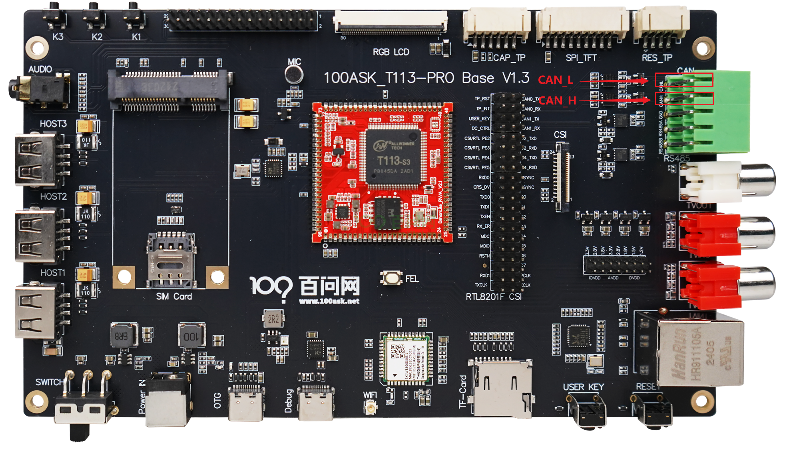
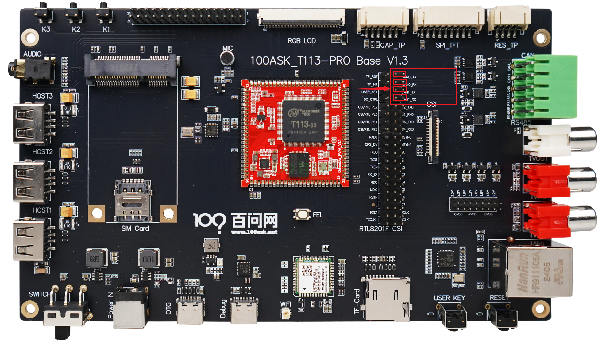
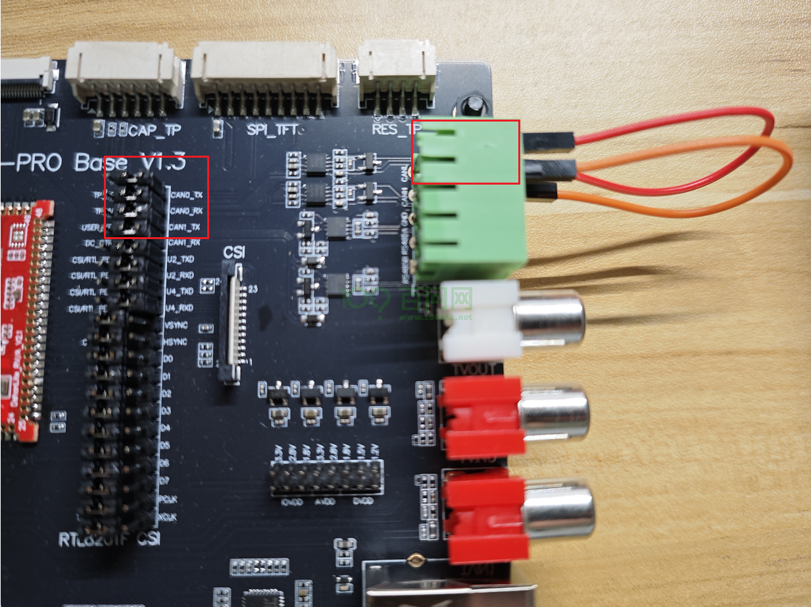

# CAN通信

本章节将讲解如何测试 T113s3-SDNAND 开发板的CAN通信功能。

## 准备工作

在进入本章节实验之前，请做好以下准备。

**硬件：**
- T113s3-SDNAND 开发板
- usb typeC线 X2

**软件：**
- 全志线刷工具：[AllwinnertechPhoeniSuit.zip](https://dl.100ask.net/Hardware/MPU/T113i-Industrial/Tools/AllwinnertechPhoeniSuit.zip)
- 全志USB烧录驱动：[AllwinnerUSBFlashDeviceDriver.zip](https://dl.100ask.net/Hardware/MPU/T113i-Industrial/Tools/AllwinnerUSBFlashDeviceDriver.zip)
- 镜像：[T113s3-SDNAND-Support-CAN.7z](https://dl.100ask.net/Hardware/MPU/T113s3-SDNAND/Images/T113s3-SDNAND-Support-CAN.7z)
> 镜像说明：支持CAN功能，不支持RGB触摸功能，md5值：0df6410466e823b89e30a0e2c517488e
## CAN通信协议概述

CAN通信协议，全称为Controller Area Network，是一种支持实时控制的串行通信协议，它专为满足汽车和工业环境中的高可靠性和网络灵活性而设计。以下是简要的概述：

- CAN协议由Bosch公司在1980年代开发，主要用于汽车电子系统中的电子控制单元（ECUs）之间的通信。
- CAN使用**多主站模式**，网络上的任何节点都可以在任何时间点开始发送数据。
- 它采用**非破坏性仲裁机制**，确保高优先级的消息能够优先传输。
- CAN协议的数据帧结构紧凑，包括帧起始、仲裁场、控制场、数据场、CRC校验、帧结束等部分。
- 支持最高**8个字节**的数据载荷，适用于传输控制命令和传感器数据。
- 集成了强大的错误检测机制，包括循环冗余校验（CRC）和位填充。
- 在检测到错误时，网络可以自动重传损坏的消息，提高了数据传输的可靠性。
- CAN网络**支持不同的波特率**，从最低的10kbps到最高的1Mbps，根据不同的应用需求进行配置。

## 硬件连接

在进行CAN功能测试前，需要使用两根接线端子(杜邦线)连接开发板的CAN接口，CAN0_L连接 CAN1_L，CAN0_H连接 CAN1_H。硬件连接如下图：

**注意**，这个四根引脚与USER_KET、RGB屏幕的触摸和SPI_TFT的引脚是共用的，我们需要使用卡槽把排针中间的引脚连接到右边的引脚上，这个时候可以使用CAN功能，但是与该引脚共用的其他功能是使用不了的，如下，

实际连接图如下，

## 登录串口终端

连接成功后，如果不清楚如何连接开发板登录串口，请参考 快速启动 中的《启动开发板》章节。

## 启用CAN接口

打开串口终端，执行`ifconfig -a`，可以看到存在 `awlink0` 和 `awlink1` 节点，

~~~bash
# ifconfig -a
awlink0   Link encap:UNSPEC  HWaddr 00-00-00-00-00-00-00-00-00-00-00-00-00-00-00-00
          NOARP  MTU:16  Metric:1
          RX packets:0 errors:0 dropped:0 overruns:0 frame:0
          TX packets:0 errors:0 dropped:0 overruns:0 carrier:0
          collisions:0 txqueuelen:10
          RX bytes:0 (0.0 B)  TX bytes:0 (0.0 B)
          Interrupt:2

awlink1   Link encap:UNSPEC  HWaddr 00-00-00-00-00-00-00-00-00-00-00-00-00-00-00-00
          NOARP  MTU:16  Metric:1
          RX packets:0 errors:0 dropped:0 overruns:0 frame:0
          TX packets:0 errors:0 dropped:0 overruns:0 carrier:0
          collisions:0 txqueuelen:10
          RX bytes:0 (0.0 B)  TX bytes:0 (0.0 B)
          Interrupt:3

ip6tnl0   Link encap:UNSPEC  HWaddr 00-00-00-00-00-00-00-00-00-00-00-00-00-00-00-00
          NOARP  MTU:1452  Metric:1
          RX packets:0 errors:0 dropped:0 overruns:0 frame:0
          TX packets:0 errors:0 dropped:0 overruns:0 carrier:0
          collisions:0 txqueuelen:1000
          RX bytes:0 (0.0 B)  TX bytes:0 (0.0 B)

lo        Link encap:Local Loopback
          inet addr:127.0.0.1  Mask:255.0.0.0
          inet6 addr: ::1/128 Scope:Host
          UP LOOPBACK RUNNING  MTU:65536  Metric:1
          RX packets:0 errors:0 dropped:0 overruns:0 frame:0
          TX packets:0 errors:0 dropped:0 overruns:0 carrier:0
          collisions:0 txqueuelen:1000
          RX bytes:0 (0.0 B)  TX bytes:0 (0.0 B)

sit0      Link encap:IPv6-in-IPv4
          NOARP  MTU:1480  Metric:1
          RX packets:0 errors:0 dropped:0 overruns:0 frame:0
          TX packets:0 errors:0 dropped:0 overruns:0 carrier:0
          collisions:0 txqueuelen:1000
          RX bytes:0 (0.0 B)  TX bytes:0 (0.0 B)

~~~

启用CAN接口，需要先设置**波特率**，执行以下指令，

~~~bash
# ip link set awlink0 type can bitrate 500000
# ip link set awlink1 type can bitrate 500000
~~~

设置完成后，启用CAN接口，

~~~bash
# ifconfig awlink0 up
[ 1105.138598] IPv6: ADDRCONF(NETDEV_CHANGE): awlink0: link becomes ready
# ifconfig awlink1 up
[ 1106.368692] IPv6: ADDRCONF(NETDEV_CHANGE): awlink1: link becomes ready
#
~~~

## 测试CAN通信

启用CAN接口之后，接下来进行两个CAN接口的通信测试。

**设置awlink0接收数据**

~~~bash
# candump awlink0 &
[1] 1386
~~~

**向awlink0发送数据**

下面cansend命令中，**5A1**是帧ID，**"#"**后面的“11.22.33.44.55.66.77.88”是要发送的数据，十六进制。CAN2.0一次最多发送8个字节的数据，8字节数据之间用英文点号`“.”`隔开，can-utils会对数据进行解析。

~~~bash
# cansend awlink0 5A1#11.22.33.44.55.66.77.88
  awlink0  5A1   [8]  11 22 33 44 55 66 77 88
~~~