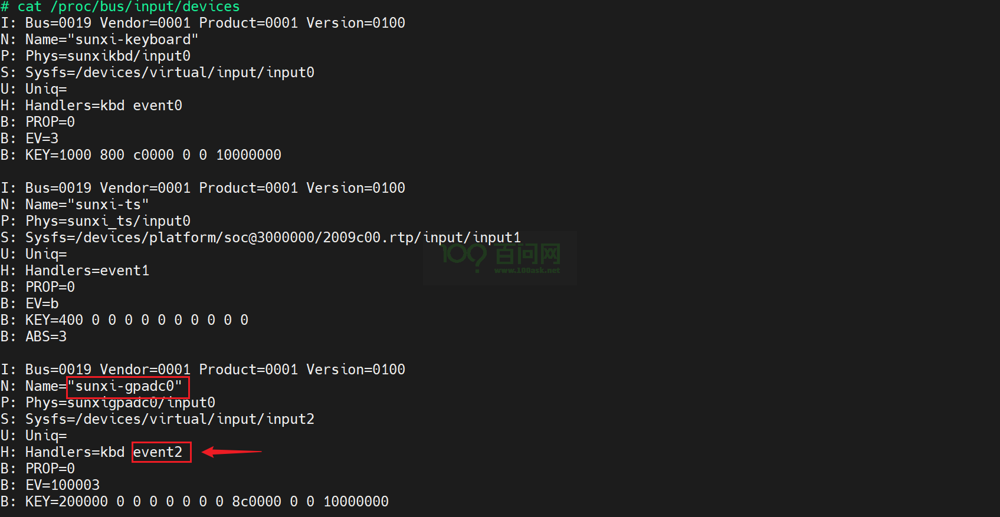
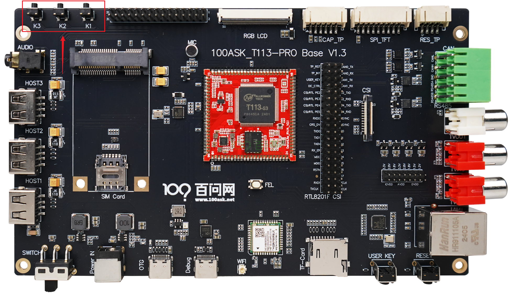
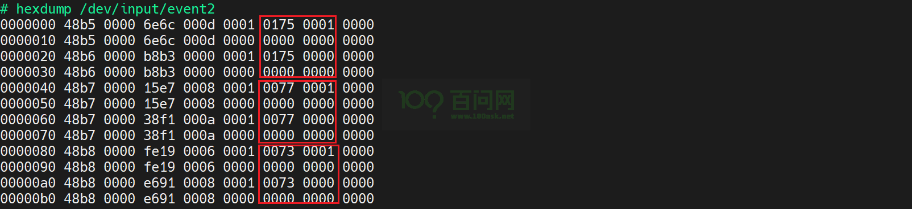

# GPADC按键测试

本章节将讲解如何测试 T113s3ProV1.3SdNand  开发板的GPADC按键功能。

## GPADC按键概述

GPADC（General Purpose ADC Keys）是一种通用的模拟数字转换按键，它通常用于将模拟信号转换为数字信号，从而实现对按键的检测。

- GPADC可以被想象成一个能够把按压按键的动作转换成开发板能懂的数字信号的“翻译官”。
- 当你按下一个按键时，按键之间会形成一个电路连接，这个连接会产生一个**模拟信号**
- GPADC的作用就是把这个连续变化的模拟电压信号**转换**成离散的数字信号
- GPADC按键广泛应用于遥控器、游戏手柄、家用电器等设备，提供用户输入接口。
- GPADC按键相比传统的机械开关，具有更低的磨损、更长的使用寿命和更精确的信号识别能力。

## 登录串口终端

如果不清楚如何连接开发板登录串口，请参考 快速启动 中的《启动开发板》章节。

## 按键功能测试

打开串口终端，想要在终端测试按键功能，需要查看按键对应的设备节点是哪个，执行以下指令，

~~~bash
cat /proc/bus/input/devices
~~~

从下图可以看到，按键对应的设备节点是 `/dev/input/event2`，

确定设备节点之后，执行以下指令测试按键，

~~~bash
hexdump /dev/input/event2 
~~~

开发板上有三个按键，按键的位置如下图，

执行指令之后，依次按下按键 `k1` 、`k2` 和 `k3`，会出现以下信息，

这样就可以根据返回的数据来进行应用。