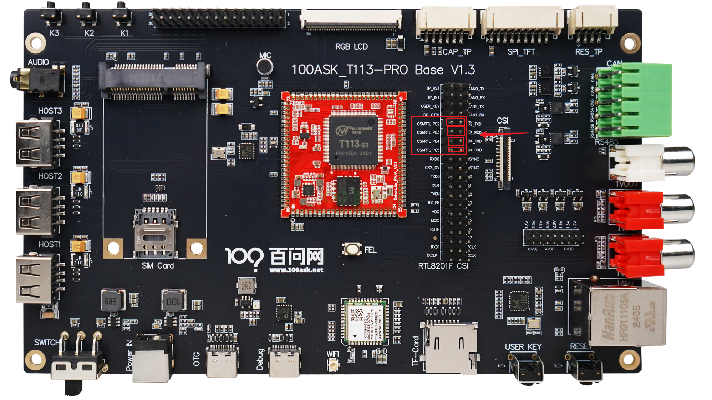
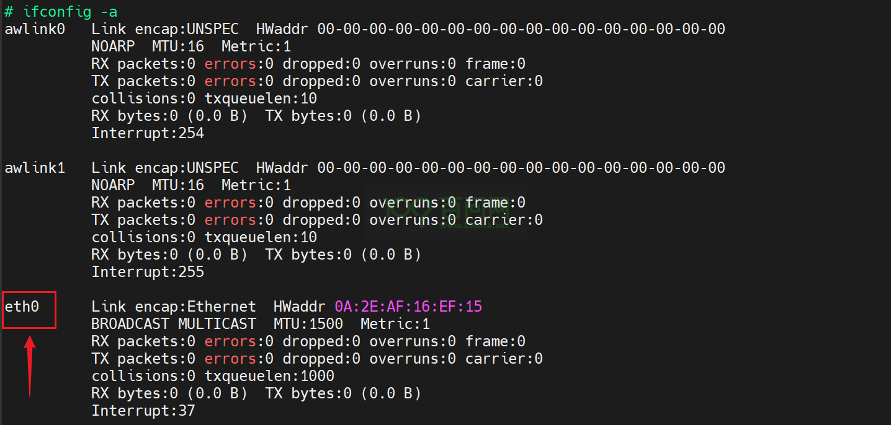
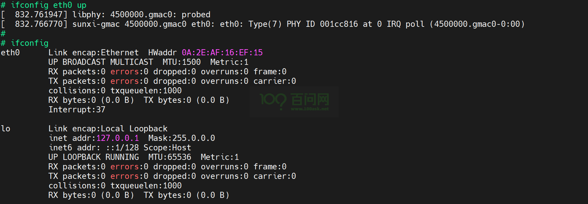
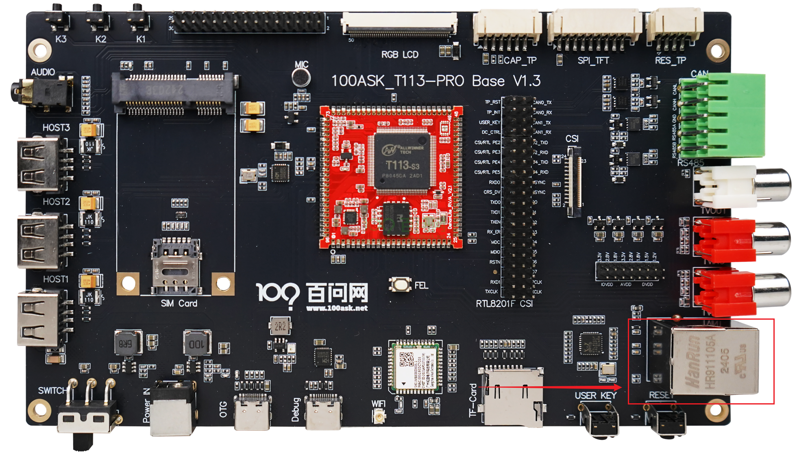
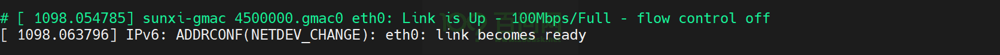
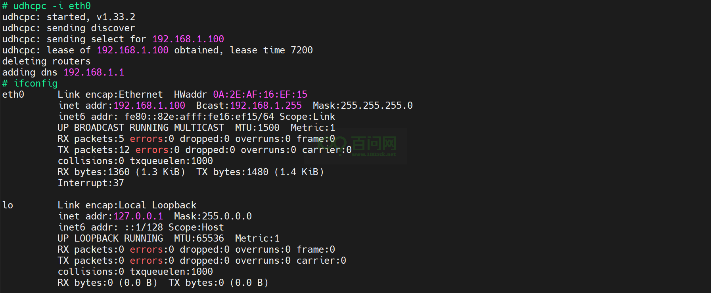
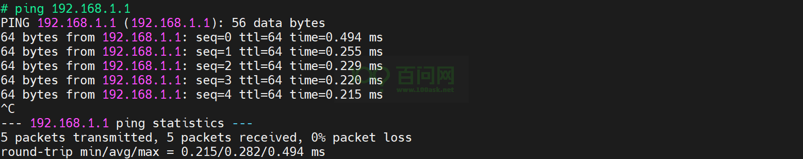

# 以太网测试

本章节来讲解如何在 T113s3ProV1.3SdNand 开发板上测试以太网功能。

## 准备工作

在进入本章节实验之前，请做好以下准备。

**硬件：**
- T113s3-SDNAND 开发板
- usb typeC线 X2
- 一根能用来上网的网线

**软件：**
- 全志线刷工具：[AllwinnertechPhoeniSuit.zip](https://dl.100ask.net/Hardware/MPU/T113i-Industrial/Tools/AllwinnertechPhoeniSuit.zip)
- 全志USB烧录驱动：[AllwinnerUSBFlashDeviceDriver.zip](https://dl.100ask.net/Hardware/MPU/T113i-Industrial/Tools/AllwinnerUSBFlashDeviceDriver.zip)

## 硬件连接

在进行以太网测试之前，需要先使用卡槽把下图排针中间的引脚连接到左边的引脚上，因为这个四根引脚与RS485引脚是共用的，硬件连接图如下，

## 登录串口终端

如果不清楚如何连接开发板登录串口，请参考 快速启动 中的《启动开发板》章节。

## 启用eth0接口

打开串口终端后，执行指令`ifconfig -a`，可以查看到存在eth0接口节点，

执行以下指令，启用eth0接口，

~~~bash
ifconfig eth0 up
~~~

## 测试以太网

执行`ifconfig`，看到eth0接口之后，把网线接入以太网接口，以太网接口位置如下图所示，

接入网线之后，串口终端上会出现以下信息，

接着，执行以下指令，获取ip地址，

~~~bash
udhcpc -i eth0
~~~

如下图所示，

最后测试一下是否能ping通，如果接的网线能访问外网可以直接ping百度来测试，这里ping网关地址，

能ping通，表示以太网接口可用。