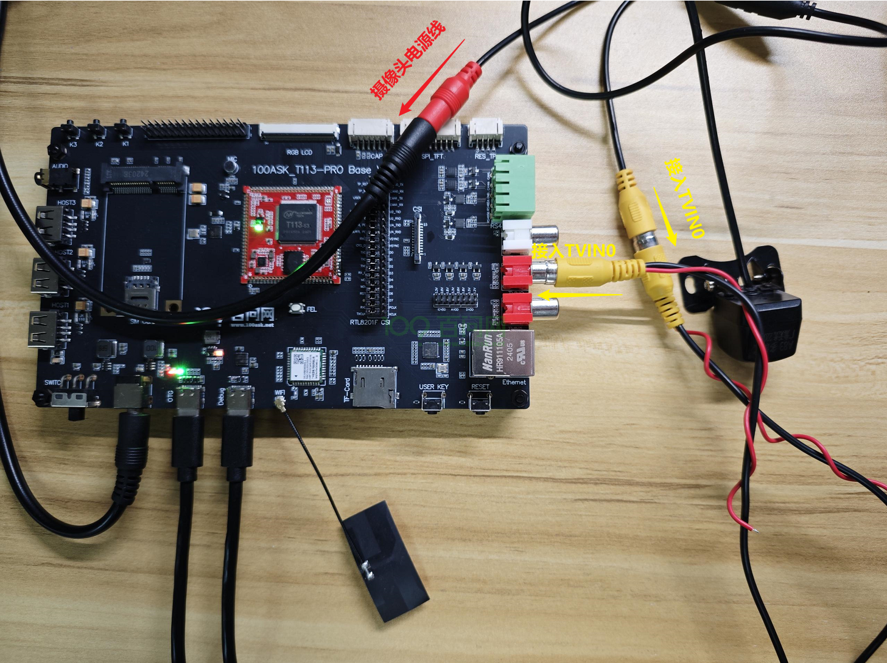
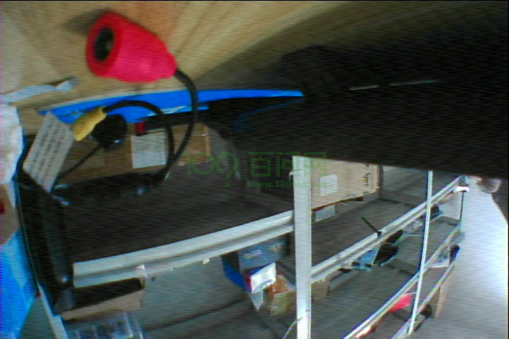

# CVBS摄像头抓图

本章节将讲解如何在 T113s3ProV1.3SdNand 开发板上使用cvbs摄像头抓取图像数据。

## 准备工作

操作之前，先做好以下准备。

- 硬件：cvbs摄像头
- 软件：全志线刷工具：[AllwinnertechPhoeniSuit](https://gitlab.com/dongshanpi/tools/-/raw/main/AllwinnertechPhoeniSuit.zip)
- 软件：全志USB烧录驱动：[AllwinnerUSBFlashDeviceDriver](https://gitlab.com/dongshanpi/tools/-/raw/main/AllwinnerUSBFlashDeviceDriver.zip)
- 软件：镜像（支持tvd）：t113_linux_evb1_auto_uart0.img

## 硬件连接

要使用cvbs摄像头获取图像数据，还需另外购买cvbs摄像头。下面图片是将cvbs摄像头连接到 T113s3ProV1.3SdNand  开发板的指南。



## TVD简述

### TVD功能特性

在全志内部，通常把 CVBS IN 模块称为 TVD 或者 TVIN 模块，是一个用于采集模拟 CVBS 视频的硬件模块，可将输入的 CVBS 信号或 YPbPr 信号转换成 YUV 信号。

### 驱动框架


tvd 驱动只是负责把tvd的硬件描述完成并注册进V4L2框架，具体对tvd的使用还是放在用户态的应用层。这里归纳关于用户态操作使用tvd模块的流程。

## 登录串口终端

上述硬件连接成功后，如果不清楚如何连接开发板登录串口，请参考 快速启动 中的《启动开发板》章节。

## 获取抓图工具

在 ubuntu 上，执行以下指令，获取资源：

```bash
git clone https://e.coding.net/weidongshan/tina5/APP-DevExample.git
```

下载的资源里面，源码在文件夹 `V4L2/camera_demo_v1`。

```bash
ubuntu@dshanpi:~/meihao/APP-DevExample/V4L2/camera_demo_v1$ tree -L 1
.
├── camerademo   #一个准备好的应用程序
├── makefile
├── Makefile
├── README.md
└── src

1 directory, 4 files
```

这个文件夹下的`README.md` 文档里有编译抓图工具的使用教程。

## 抓图测试

camerademo 抓图工具，默认情况下，使用的设备号是/dev/video0，查看开发板的tvd设备节点是否满足默认节点。打开串口终端，执行以下指令：

~~~bash
ls /dev/
~~~

可以看到设备号是 /dev/video4，不是默认的设备节点 /dev/video0，所以不可以直接执行 camerademo 指令抓图。


需要使用`camerademo NV21 640 480 30 bmp /tmp 5 4`，来指定设备号为/dev/video4。执行指令：

~~~bash
camerademo NV21 720 480 30 bmp /tmp 5
~~~

执行结果如下：

~~~bash
# ./camerademo NV21 720 480 30 bmp /tmp 5 4
[1970-01-01 00:18:05] WARNING: awplayer <cdx_log_set_level:30>: Set log level to 3
[1970-01-01 00:18:05] ERROR  : awplayer <ReadPluginEntry:198>: read plugin entry adecoder-14 fail!
[1970-01-01 00:18:05] ERROR  : awplayer <ReadPluginEntry:198>: read plugin entry vdecoder-10 fail!
INFO   : cedarc <CedarPluginVDInit:80>: register h264 decoder success!
INFO   : cedarc <CedarPluginVDInit:84>: register mjpeg decoder success!
INFO   : cedarc <CedarPluginVDInit:86>: register mpeg2 decoder success!
[1970-01-01 00:18:05] WARNING: awplayer <DlOpenPlugin:112>: Invalid plugin,function CedarPluginVDInit not found.
INFO   : cedarc <CedarPluginVDInit:98>: register mpeg4dx decoder success!
INFO   : cedarc <CedarPluginVDInit:79>: register mpeg4H263 decoder success!
INFO   : cedarc <CedarPluginVDInit:90>: register mpeg4Normal decoder success!
[1970-01-01 00:18:05] ERROR  : awplayer <DlOpenPlugin:103>: dlopen 'libawwmv3.so' fail: libawwmv3.so: cannot open shared object file: No such file or directory
[1970-01-01 00:18:05] ERROR  : awplayer <CdxPluginLoadList:235>: load vdecoder id vdecoder.wmv3 fail!
INFO   : cedarc <CedarPluginVDInit:85>: register h265 decoder success!
INFO   : cedarc <CedarPluginVDInit:73>: register vp8 decoder success!
[1970-01-01 00:18:05] ERROR  : awplayer <ReadPluginEntry:198>: read plugin entry plugin-0 fail!
[CAMERA]**********************************************************
[CAMERA]*                                                        *
[CAMERA]*              this is camera test.                      *
[CAMERA]*                                                        *
[CAMERA]**********************************************************
[CAMERA]**********************************************************
[CAMERA] open /dev/video4!
[CAMERA]**********************************************************
[CAMERA]**********************************************************
[CAMERA] The path to data saving is /tmp.
[CAMERA] The number of captured photos is 5.
[CAMERA] save bmp format
[CAMERA]************************[  506.457851] [tvd] vidioc_s_fmt_vid_cap:1623
[  506.457851] interface=0
[  506.457851] system=NTSC
[  506.457851] format=0
[  506.457851] output_fmt=YUV420
********************************[  506.476529] [tvd] vidioc_s_fmt_vid_cap:1627
[  506.476529] row=1
[  506.476529] column=1
[  506.476529] ch[0]=0
[  506.476529] ch[1]=0
[  506.476529] ch[2]=0
[  506.476529] ch[3]=0
**
[CAMERA] Using format parame[  506.498019] [tvd] vidioc_s_fmt_vid_cap:1629
[  506.498019] width=720
[  506.498019] height=480
[  506.498019] dev->sel=0
ters NV21.
[CAMERA] camera pixe[  506.513595] [tvd] tvd_cagc_and_3d_config:1481 tvd0 agc auto mode
lformat: NV21
[CAMERA] Resoluti[  506.523037] [tvd] tvd_cagc_and_3d_config:1490 tvd0 CAGC enable:0x1
on size : 720 * 480
[CAMERA] The photo save path is /tmp.
[CAMERA] The number of photos taken [  506.540539] [tvd] tvd_cagc_and_3d_config:1517 tvd0 3d enable :0x5f100000
is 5.
[CAMERA] Camera capture framerate is 0/0
[CAMERA] VIDIOC[  506.551252] [tvd] vidioc_streamon:1712 Out vidioc_streamon:0
_S_FMT succeed
[CAMERA] fmt.type = 1
[CAMERA] fmt.fmt.pix.width = 720
[CAMERA] fmt.fmt.pix.height = 480
[CAMERA] fmt.fmt.pix.pixelformat = NV21
[CAMERA] fmt.fmt.pix.field = 1
[CAMERA] stream on succeed
[CAMERA] camera4 capture num is [0]
[  506.604952] [tvd] tvd_isr:810 In tvd_isr
[CAMERA_PROMPT] the time interval from the start to the first frame is 78 ms
[CAMERA] camera4 capture num is [1]
[CAMERA] camera4 capture num is [2]
[CAMERA] camera4 capture num is [3]
[CAMERA] camera4 capture num is [4]
[CAMERA] Capture thread finish
[CAMERA] close /dev/video4
~~~

执行成功之后，图片会保存的路径在`/tmp`目录下，

~~~bash
# ls /tmp/
bmp_NV21_1.bmp    bmp_NV21_4.bmp    dnsmasq.leases    subsys
bmp_NV21_2.bmp    bmp_NV21_5.bmp    fw_printenv.lock
bmp_NV21_3.bmp    dbus              messages
#
~~~

可以通过ADB工具把图片传至windows进行查看。


