# QT应用环境部署

本章节将讲解如何在Tina5.0-SDK为 T113s3ProV1.3SdNand 开发板部署QT应用环境。

## QT库配置

在 ubuntu 上，进入SDK源码根目录路径，执行以下指令，进入 buildroot 配置界面。

~~~bash
./build.sh buildroot_menuconfig
~~~

找到 **Target packages**，

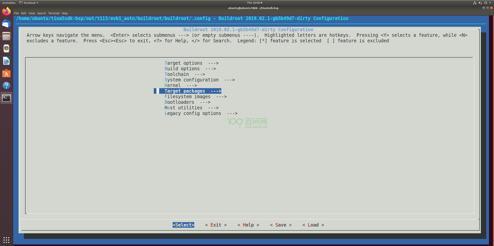

回车进入，找到 **Graphic libraries and applications**，

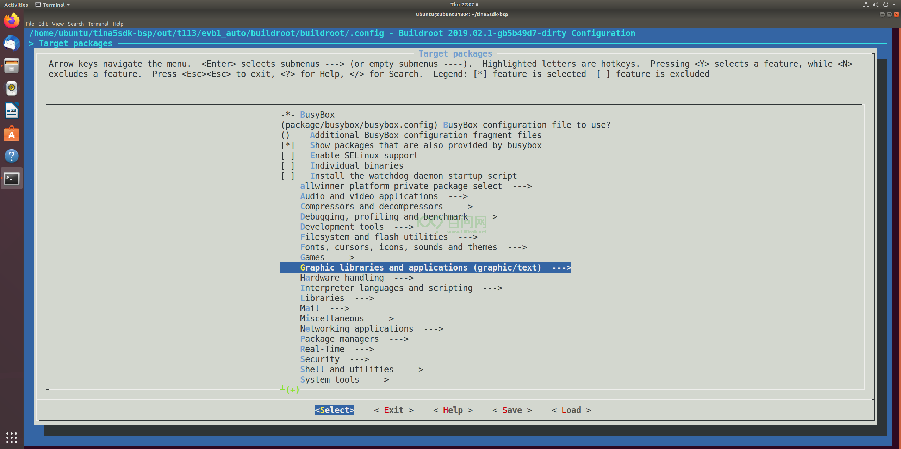

进入，找到 **QT5** ，点击键盘 y 键，选上。

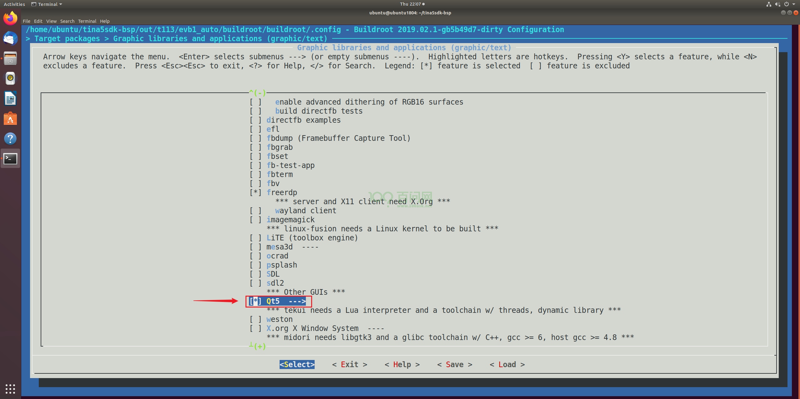

继续回车进入 ，选上以下相应的 qt 库，

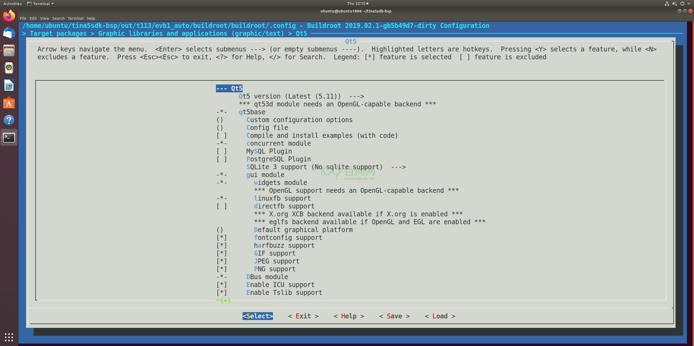

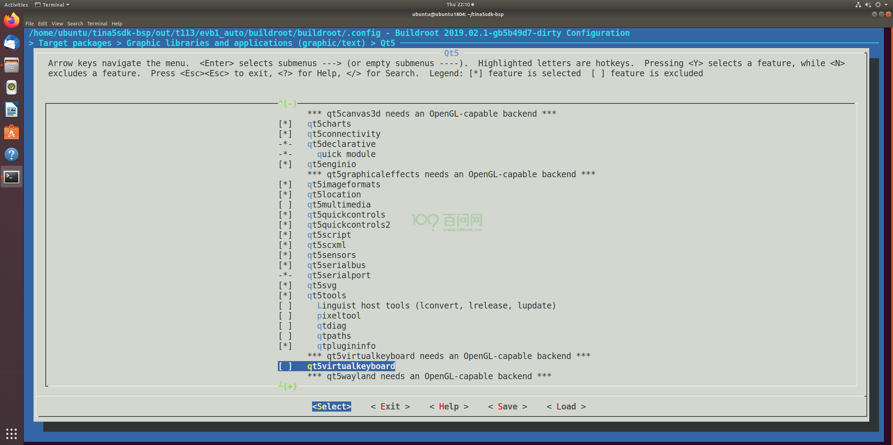

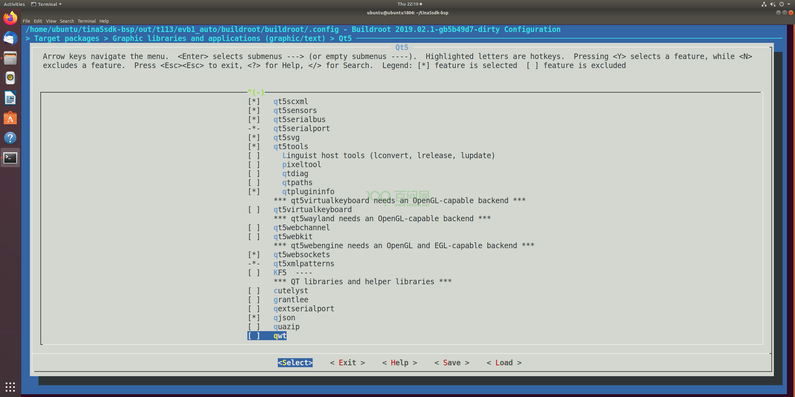

保存退出至SDK源码根目录路径。

## 编译QT库

在SDK源码根目录路径下，执行以下指令，编译qt库，

~~~bash
./build.sh
~~~

等待编译完成，执行打包操作。

~~~bash
./build.sh pack
~~~

镜像保存路径在 SDK/tina5sdk-bsp/out/t113/evb1_auto/buildroot/ ，如下所示

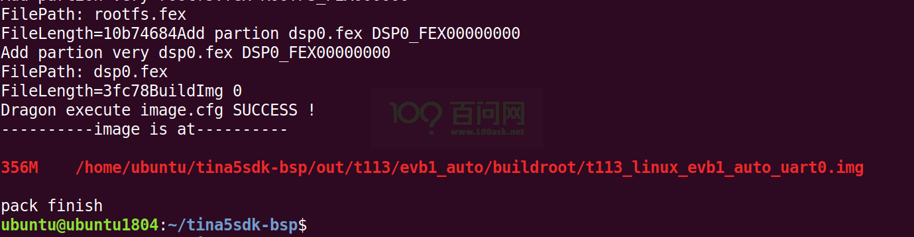

## 编译QT示例程序

需要在编译qt库之后，再去编译qt示例程序，否则会编译失败。在当前路径下，执行以下指令，进入buildroot配置界面，

~~~bash
./build.sh buildroot_menuconfig
~~~

找到 **Target packages**，

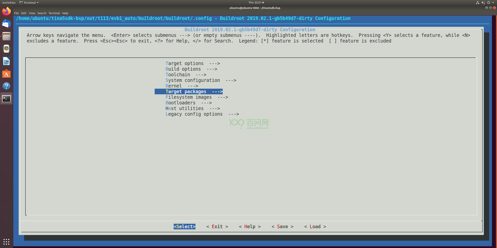

回车进入，找到 **allwinner platform private package select**，

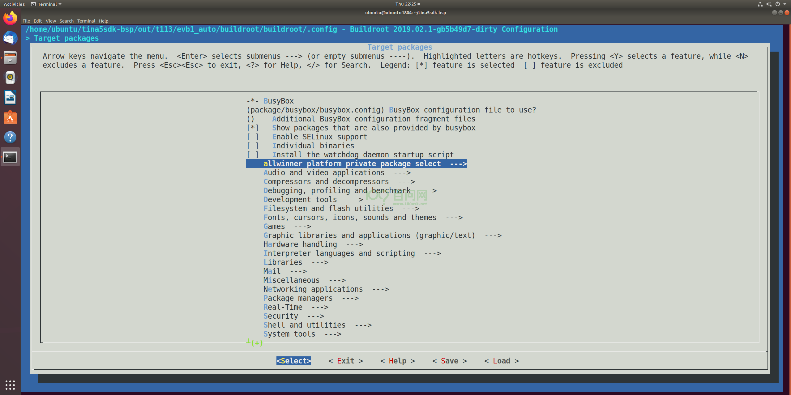

继续进入下一层，找到 **qt_demo**，回车进入。

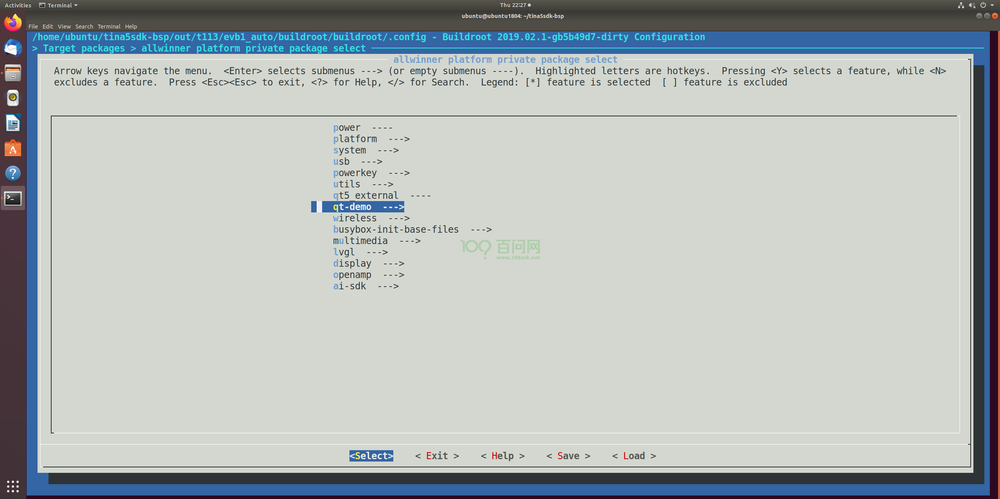

点击键盘 y 键，选上示例程序。

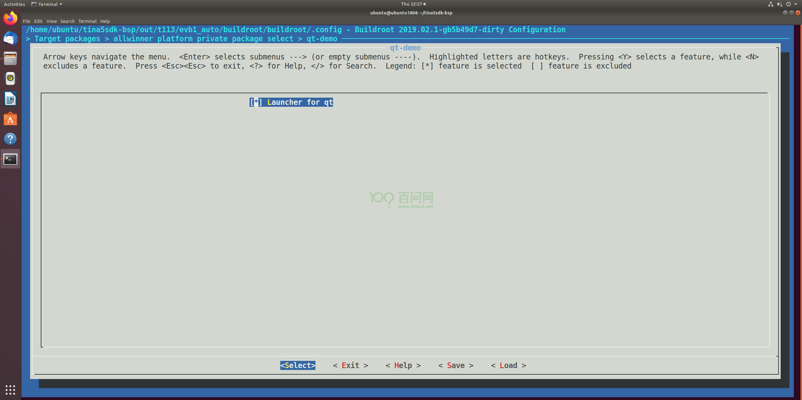

保存退出至SDK源码根目录路径。接着在当前目录执行编译、打包操作。

~~~bash
./build.sh
./build.sh pack
~~~

打包镜像后，参考 快速启动中 的《更新系统固件》章节，烧录镜像。

## 运行qt示例程序

启动开发板后，开发板默认会启动 S70launcher 脚本，进行初始化qt环境，并执行示例程序，脚本保存路径在 /etc/init.d/，

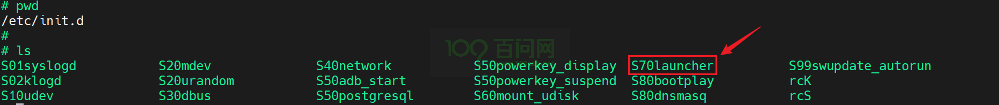

脚本内容如下，

~~~bash
#!/bin/sh
#
# Start the launcher
#

case "$1" in
    start)
                if [ ! -f "/usr/bin/Launcher" ];then
                        exit 1
                fi

                if [ -d "/usr/local/Qt_5.12.5" ];then
                        export  QTDIR=/usr/local/Qt_5.12.5
                else
                        export  QTDIR=/usr/lib
                fi

                if [ -d $QTDIR ];then

                        export  QT_ROOT=$QTDIR
                        export  PATH=$QTDIR/bin:$PATH
                        export  LD_LIBRARY_PATH=$QTDIR/lib:/usr/lib/cedarx/:$LD_LIBRARY_PATH

                        export QT_QPA_PLATFORM_PLUGIN_PATH=$QT_ROOT/plugins
                        export QT_QPA_PLATFORM=linuxfb:tty=/dev/fb0
                        export QT_QPA_FONTDIR=$QT_ROOT/fonts

                        TouchDevice=fts_ts
                        for InputDevices in /sys/class/input/input*
                        do
                                DeviceName=cat $InputDevices/name
                                if [ "$DeviceName" == "$TouchDevice" ];then
                                        TouchDeviceNum=${InputDevices##*input}
                                        export QT_QPA_EVDEV_TOUCHSCREEN_PARAMETERS=/dev/input/event$TouchDeviceNum
                                        echo "add "/dev/input/event$TouchDeviceNum "to Qt Application."
                                        break
                                fi
                        done
                        if [ ! -n "$TouchDeviceNum" ]; then
                                echo "Error:Input device $TouchDevice can not be found,plz check it!"
                        fi

                        if [ -d "/usr/local/Qt_5.12.5" ];then
                                export QT_QPA_PLATFORM=eglfs
                                export QT_QPA_GENERIC_PLUGINS=evdevtouch
                                export QT_QPA_EGLFS_INTEGRATION=eglfs_mali
                        else
                                export QT_QPA_FONTDIR=/usr/lib/fonts
                                export QT_QPA_GENERIC_PLUGINS=tslib
                                #export QT_QPA_GENERIC_PLUGINS=evdevmouse:/dev/input/event4
                                export TSLIB_FBDEVICE=/dev/fb0
                                export TSLIB_CONSOLEDEVICE=none
                                export TSLIB_TSDEVICE=/dev/input/event3
                                export TSLIB_CONFFILE=/etc/ts.conf
                                export TSLIB_CALIBFILE=/etc/pointercal
                                export TSLIB_PLUGINDIR=/usr/lib/ts
                        fi

                        export QWS_MOUSE_PROTO=
                        mkdir -p /dev/shm
                        ulimit -c unlimited
                        Launcher &
                fi
        ;;
    stop)]
        ;;
    *)
        echo "Usage: $0 {start}"
        exit 1
        ;;
esac

exit 0
~~~

可以在该脚本中修改或者配置**显示设备节点**和**触摸设备节点**。

