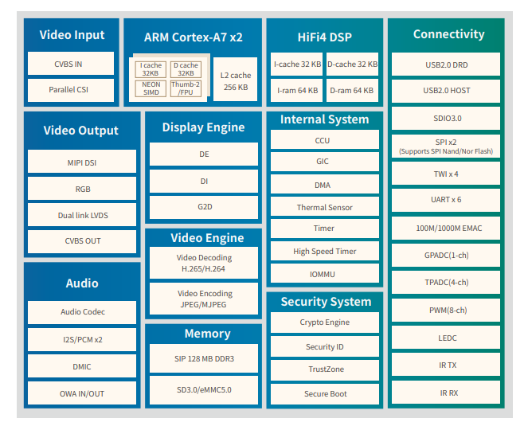
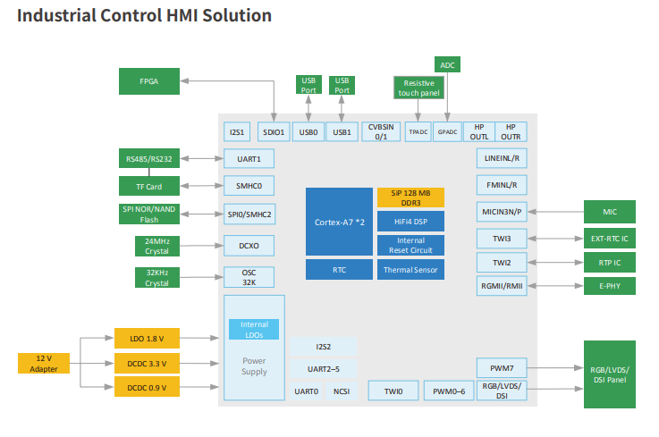
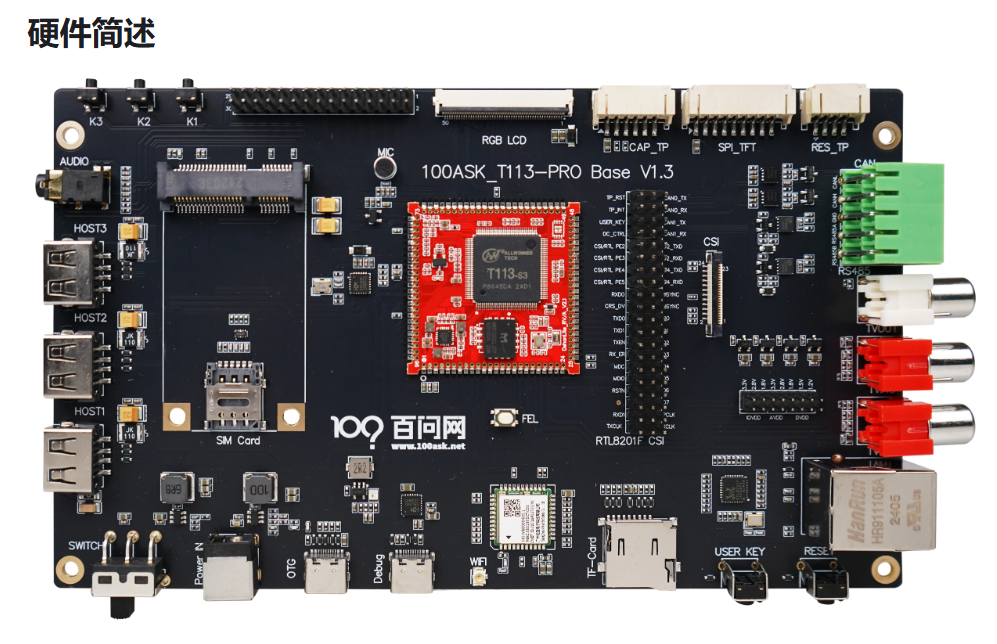
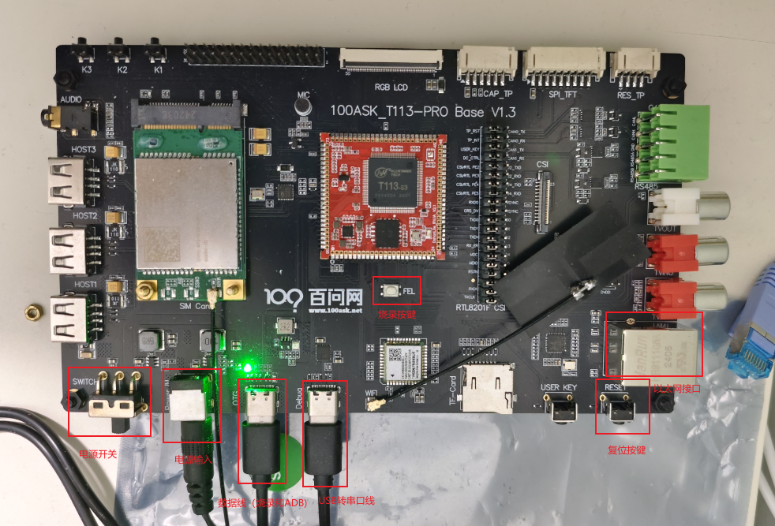
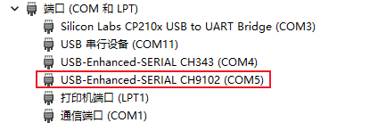
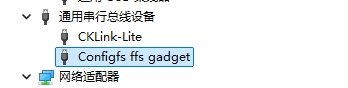
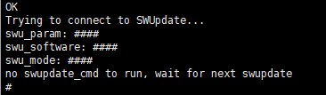

# 开发板介绍

## SOC相关

### SOC介绍

**T113-S3 是一款专为汽车和工业控制市场设计的先进应用处理器。它集成了双核 Cortex-A7 CPU 和单核 HiFi4 DSP，可提供高效的计算能力。T113-S3 支持全格式解码，如 H.265、H.264、MPEG-1/2/4、JPEG、VC1 等。独立的硬件编码器可以编码为 JPEG 或 MJPEG。集成的多个 ADC/DAC 和 I2S/PCM/DMIC/OWA 音频接口可以提供完美的语音交互解决方案。T113-S3 具有广泛的连接性，以方便产品扩展，例如 USB、SDIO、EMAC、TWI、UART、SPI、PWM、GPADC、IR TX&RX 等。**

### 特性

| **CPU** | **Dual-core ARM CortexTM-A7  32 KB L1 I-cache + 32 KB L1 D-cache per core, and 256 KB L2 cache** |
| ------- | ------------------------------------------------------------ |
| **DSP** | **HiFi4 32 KB l-cache + 32 KB D-cache 64 KB I-ram + 64KB D-ram** |
| **Memory** | **SIP 128 MB DDR3 SD3.0/eMMC5.0, SPI Nor/Nand Flash** |
| **Video Engine** | **Video decoding   -H.265 up to 1080p@60fps   -H.264 up to 1080p@60fps   -MPEG-1/2/4,JPEG,VCl up to 1080p@60fps Video encoding   -JPEG/MJPEG up to 1080p@60fps   -Supports input picture scaler up/down** |
| **Display Engine** | **AllwinnerSmartColor2.0 post processing for anexcellent display experience Supports de-interlace (Dl) up to 1080p@60fps Supports G2D hardware accelerator including rotate, mixer, lbc decompression functions** |
| **Video OUT** | **CVBS OUT interface, supporting NTSC and PAL format RGB LCD output interface up to 1920x1080@60fps Dual link LvDS interface up to 1920x1080@60fps 4-lane MlPl DSl interface up to 1920x1200@60fps** |
| **Video IN** | **8-bit parallel CSl interface CVBS IN interface, supporting NTSC and PAL format** |
| **Audio** | **2 DACs and 3 ADCs Analog audio interfaces: MICIN3P/N, LINEINL/R，FMINL/R,HPOUTL/R Digital audio interfaces: 12S/PCM,DMIC, OWA IN/OUT** |
| **Security Engine** | **AES, DES, 3DES encryption and decryption algorithms  RSA signature verification algorithm  MD5/SHA and HMAC tamper proofing  Hardware random number generator  Integrated 2 Kbits OTP storage space** |
| **Connectivity** | **USB2.0 DRD,USB2.0 Host SD10 3.0,SPIx2.UARTx6,TWIx4 PWM (8-ch),GPADC (1-ch), TPADC (4-ch),IR TX&RX 10/100/1000M EMAC with RMll and RGMll interfaces** |
| **Package** | **eLQFP128, 14 mm x 14 mm** |

### 架构图

### 典型应用

## 开发板相关

百问网D1h双屏异显开发套件是采用全志科技首款RISC-V处理器D1-H，该芯片是基于RISC-V指令集的芯片，集成了阿里平头哥64位C906核心，支持RVV，1GHz+主频，可支持Linux、RTOS等系统。同时支持最高4K的H.265/H.264解码，内置一颗HiFi4 DSP，最高可外接2GB DDR3，可以应用于智慧城市、智能汽车、智能商显、智能家电、智能办公和科研教育等多个领域。

# 基础使用

## 连接外设

按下图所示，需要连接一根USB转串口的线、还有一根用于烧录用的数据线。

## 安装驱动程序

### USB转串口芯片驱动

默认情况下系统会自动安装串口设备驱动，如果没有自动安装，可以使用驱动精灵来自动安装。

安装完成后，可以在设备管理器中识别到如下设备，即安装成功，可以正常使用。

### USB烧录驱动

下载全志USB烧录驱动：[AllwinnerUSBFlashDeviceDriver.zip](https://dl.100ask.net/Hardware/MPU/T113i-Industrial/Tools/AllwinnerUSBFlashDeviceDriver.zip)，解压文件；然后用管理员权限执行install.bat即可，安装后，默认单板系统启动后，会识别到ADB设备，如下所示：

## 连接调试串口

用串口工具，打开识别到的单板上的USB转串口，我这里示例是COM3，打开后上电，会有Tina Linux启动的日志，那么说明单板的基础使用环境已经准备好了，输入回车后可以看到如下打印：

